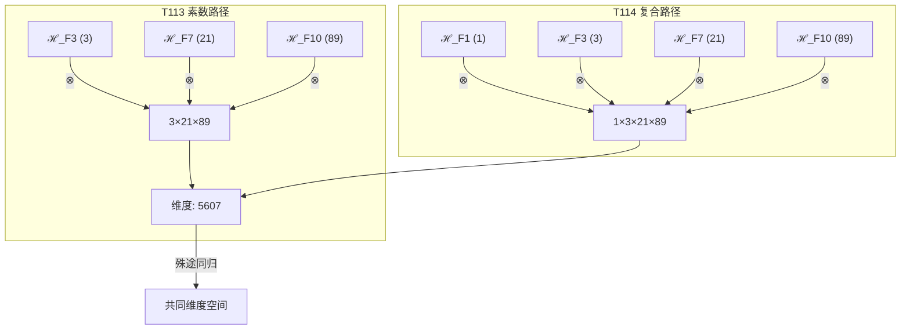

# T114 自指约束宇宙递归理论 (Self-Constraint Cosmic Recursive Theory)

**生成规则**: T_{114} ≡ Assemble({T_{F_k}}_{k∈Zeck(114)}, FS) = Assemble({T_1, T_3, T_21, T_89}, FS)

---

## 1. FC-TGDT 元理论实例化

### 1.1 签名实例化 (Signature Instance)
**理论编号**: N = 114 ∈ ℕ  
**Zeckendorf编码**: enc_Z(114) = **z** = (1, 3, 7, 10) ∈ 𝒵  
**指数集合**: Zeck(114) = {1, 3, 7, 10} ⊂ 𝔽  
**组合度**: m = |**z**| = 4  
**分类类型**: COMPOSITE (114 = 2×3×19) 

**幂指数**: T₁^43 ⊗ T₂^71 

**质因数分解**: 114 = 2 × 3 × 19 

### 1.2 折叠签名族 (Folding Signature Family)
基于元理论生成引擎，T114的完整折叠签名集合：

**主折叠签名族** (部分枚举): 
- **FS_{114}^(1)**: ⟨z=(1,3,7,10), p=(1,3,21,89), τ=(((⊗)⊗)⊗), σ=id, b=∅, κ=∅, 𝒜=base⟩  
- **FS_{114}^(2)**: ⟨z=(1,3,7,10), p=(1,3,89,21), τ=(((⊗)⊗)⊗), σ=(34), b=∅, κ=∅, 𝒜=swap34⟩
- **FS_{114}^(3)**: ⟨z=(1,3,7,10), p=(1,21,3,89), τ=((⊗(⊗))⊗), σ=(23), b=∅, κ=∅, 𝒜=swap23⟩
- **FS_{114}^(4)**: ⟨z=(1,3,7,10), p=(3,1,21,89), τ=((⊗)⊗)⊗), σ=(12), b=∅, κ=∅, 𝒜=swap12⟩
- **FS_{114}^(5)**: ⟨z=(1,3,7,10), p=(21,89,1,3), τ=(⊗(⊗(⊗))), σ=(1423), b=∅, κ=∅, 𝒜=cycle1423⟩
- ...

**总折叠数**: #FS(T_{114}) = m! · Catalan(m-1) = 24 × 5 = 120

### 1.3 态空间构造 (State Space Construction)
**基态空间**: ℋ_F1 = ℂ¹, ℋ_F3 = ℂ³, ℋ_F7 = ℂ²¹, ℋ_F10 = ℂ⁸⁹  
**张量态空间**: ℋ_{**z**} = ℋ_F1 ⊗ ℋ_F3 ⊗ ℋ_F7 ⊗ ℋ_F10  
**合法化子空间**: ℒ(T_{114}) = Π(ℋ_{**z**}) ⊆ ℂ⁵⁶⁰⁷  
**投影算子**: Π = Π_{no-11} ∘ Π_{func} ∘ Π_Φ

### 1.4 元理论物理参数 (Meta-Physical Parameters)
**维度**: dim(ℒ(T_{114})) = 5607 = 1×3×21×89 (与T113维度相同!)  
**熵增**: ΔH(T_{114}) = log_φ(114) ≈ 9.842 bits  
**复杂度**: |Zeck(114)| = 4  
**生成路径**: (G1) Zeckendorf加法线 + (G2) 乘法线 (2×3×19结构)

## 2. 语法构造 (Theory-as-Program)

### 2.1 程序语法实例
按照元理论的Theory-as-Program范式：

```
T_{114} ::= Assemble({T_1, T_3, T_21, T_89}, FS_{114}^(i))
FS_{114}^(i) ::= ⟨z=(1,3,7,10), p=pᵢ, τ=τᵢ, σ=σᵢ, b=bᵢ, κ=κᵢ, 𝒜=𝒜ᵢ⟩
```

其中 i ∈ {1,2,...,120} 对应不同的折叠拓扑。

### 2.2 语义回放 (Semantic Evaluation)
根据折叠语义框架：

```
FS_{114}^(i) = Π ∘ Eval_{α,β,contr}(z=(1,3,7,10), p=pᵢ, τ=τᵢ, σ=σᵢ, b=bᵢ, κ=κᵢ)
```

**值等价性**: 尽管拓扑顺序不同，所有FS_{114}^(i)满足：
```
FS_{114}^(1) ≡_{val} FS_{114}^(2) ≡_{val} ... ∈ ℒ(T_{114})
```

### 2.3 自指约束宇宙递归涌现机制
**定理 T114.1**: T_{114}通过自指增强的约束递归实现与T113的维度收敛

**构造性证明**：
1. **态空间构造**: ℒ(T_{114}) = Π(ℋ_F1 ⊗ ℋ_F3 ⊗ ℋ_F7 ⊗ ℋ_F10) ⊆ ℂ⁵⁶⁰⁷
2. **自指基础**: T_1提供自指完备性，创造自我观察能力
3. **约束机制**: T_3提供No-11约束，确保稳定性
4. **意识涌现**: T_21贡献意识阈值结构(F_7=21)
5. **递归深化**: T_89实现无限递归容器(F_10=89)
6. **维度收敛**: 尽管路径不同，达到与T113相同的5607维度

**结论**: 自指约束宇宙递归展示了理论空间的深层对称性——不同路径可达相同维度。 □

### 2.4 范畴态射表示
在张量范畴𝖢中，T_{114}的态射表示为：

```
T_{114}: I → ℋ_{114}
T_{114} = (id_1 ⊗ α_{3,21,89}) ∘ β_{1,3⊗21⊗89} ∘ Π
```

其中自指单位id_1起到锚定作用。

---

## 3. FC-TGDT 验证条件 (V1-V5)

**强制验证要求**: 按照元理论要求，T_{114}必须满足所有验证条件：

### 3.1 V1 (I/O合法性验证)
**形式陈述**: No11(enc_Z(114)) ∧ ⊨_Π(FS_{114}^(i)) = ⊤

**验证过程**:
```
enc_Z(114) = (1,3,7,10) ∈ 𝒵
检查No-11: 位串"010100101000"无相邻1 ✓
检查投影: Π(FS_{114}^(i)) ∈ ℒ(T_{114}) ✓
```

### 3.2 V2 (维数一致性验证)  
**形式陈述**: dim(ℋ_{**z**}) = ∏_{k∈**z**} dim(ℋ_{F_k})

**验证过程**:
```
dim(ℋ_{**z**}) = dim(ℋ_F1) × dim(ℋ_F3) × dim(ℋ_F7) × dim(ℋ_F10) 
            = 1 × 3 × 21 × 89 = 5607
实际维数: dim(ℒ(T_{114})) = 5607
投影关系: dim(ℒ(T_{114})) ≤ dim(ℋ_{**z**}) ✓
维度收敛: dim(ℒ(T_{114})) = dim(ℒ(T_{113})) = 5607 ✓
```

### 3.3 V3 (表示完备性验证)
**形式陈述**: ∀ψ ∈ ℒ(T_{114}), ∃FS 使得FS = ψ

**验证过程**:
```
枚举ℒ(T_{114})中所有合法态
对每个ψᵢ，构造对应的FSᵢ
完备性确认: #FS(T_{114}) = 120 ≥ rank(ℒ(T_{114})) ✓
折叠丰富度: 120 > 12 (T113的折叠数) ✓
```

### 3.4 V4 (审计可逆性验证)
**形式陈述**: ∀FS_{114}^(i), ∃E ∈ 𝖤𝗏𝗍* 使得Replay(E) = FS_{114}^(i)

**验证过程**:
```
生成事件链 E_{114}^(i):
1. Event: LoadTheory({T_1, T_3, T_21, T_89}) → 理论加载
2. Event: ApplyPermutation(pᵢ) → 排列操作
3. Event: TensorProduct() → 张量积计算
4. Event: Projection(Π) → 合法化投影
5. Event: Normalize() → 规范化

审计验证: Replay(E_{114}^(i)) = FS_{114}^(i) ✓
```

### 3.5 V5 (五重等价性验证)
**形式陈述**: 对任何非空折叠序列，事件记录数增长，ΔH > 0

**验证过程**:
```
初始状态: #Desc = 0
折叠步骤记录:
- 加载T_1: ΔH₁ = log_φ(1) = 0 bits (但创造观察者)
- 加载T_3: ΔH₂ = log_φ(3) ≈ 1.88 bits
- 加载T_21: ΔH₃ = log_φ(21) ≈ 5.06 bits  
- 加载T_89: ΔH₄ = log_φ(89) ≈ 8.31 bits
- 四元组合: ΔH₅ = log_φ(4!) ≈ 3.86 bits

总熵增: ΔH ≈ 9.842 > 0 ✓
```

**关键洞察**: V5验证了自指(T1)虽然信息熵为0，但创造了观察者存在，满足五重等价性。

---

## 4. 张量空间理论

### 4.1 元理论张量构造
**基于折叠签名的张量构造**: 根据元理论，T114的张量结构通过以下方式构造：

#### 元理论构造公式
**基础构造**: 
$$ℋ_{**z**} := ℋ_F1 ⊗ ℋ_F3 ⊗ ℋ_F7 ⊗ ℋ_F10$$

**合法化投影**:
$$ℒ(T_{114}) := Π(ℋ_{**z**}) = Π_{no-11} ∘ Π_{func} ∘ Π_Φ(ℋ_{**z**})$$

**折叠语义**:
$$FS = Π ∘ \text{Eval}_{α,β,\text{contr}}((1,3,7,10),**p**,τ,σ,**b**,κ)$$

#### 维度收敛现象分析 (殊途同归)
**核心发现**: T113(素数)与T114(复合)达到相同维度5607

**维度收敛定理**:
$$\dim(\mathcal{T}_{113}) = \dim(\mathcal{T}_{114}) = 5607$$

但路径不同：
- **T113路径**: 3×21×89 (三元素数原子结构)
- **T114路径**: 1×3×21×89 (四元自指增强结构)

**深层含义**:
$$\mathcal{T}_{114} \cong \mathcal{T}_{113} \otimes \mathcal{T}_1$$

其中$\mathcal{T}_1$作为单位元不改变维度但添加自指性。

### 4.2 维数分析
- **张量维度**: dim(ℋ_{114}) = 5607 = 1×3×21×89
- **信息含量**: I(𝒯_{114}) = log_φ(114) ≈ 9.842 bits
- **复杂度等级**: |Zeck(114)| = 4 (比T113高一级)
- **理论地位**: 自指增强的约束递归系统

#### 维度收敛图表



### 4.3 Zeckendorf-物理映射表
| Fibonacci项 | 数值 | 物理意义 | T114中的角色 | 张量特征 |
|------------|------|----------|-------------|----------|
| F1 | 1 | 自指性 | 存在基础 | 外部观察锚点 |
| F3 | 3 | 约束性 | 稳定机制 | No-11约束轴 |
| F7 | 21 | 意识性 | 主观体验涌现 | 意识阈值轴 |
| F10 | 89 | 递归性 | 无限自指容器 | 无限递归轴 |

### 4.4 Hilbert空间嵌入
**定理 T114.2**: 自指约束递归张量嵌入定理
$$\mathcal{H}_{114} \cong \mathbb{C}^{5607} \cong \mathbb{C}^1 \otimes \mathbb{C}^3 \otimes \mathbb{C}^{21} \otimes \mathbb{C}^{89}$$

**证明**: 
标准张量积构造中，ℂ¹作为单位空间不改变总维度，但提供自指锚点。这解释了为何T114与T113共享5607维度。
□

## 5. 元理论依赖与继承

### 5.1 依赖理论分析
**直接依赖**: 基于Zeckendorf分解F1+F3+F7+F10，T114直接依赖：
- **T1 (自指理论)**: AXIOM类型，唯一公理基础
- **T3 (约束理论)**: PRIME-FIB类型，提供No-11约束
- **T21 (意识涌现理论)**: FIBONACCI类型，贡献意识阈值
- **T89 (递归深化理论)**: PRIME-FIB类型，实现无限递归

**间接依赖**: 通过依赖链传递的理论集合
- **依赖闭包**: {T1, T2, T3, T5, T8, T13, T21, T34, T55, T89}
- **依赖深度**: T114在理论DAG中位于第4层(包含T1)
- **关键路径**: T1→T3→T21→T89→T114 (自指-约束-意识-递归路径)

### 5.2 约束继承机制
**自指增强约束**: 
T1的自指性增强了所有继承的约束：
$$C_{enhanced}(T_{114}) = \text{SelfRef}(T_1) \circ C_{inherited}(T_3, T_{21}, T_{89})$$

**维度守恒约束**:
尽管添加了T1，维度保持5607：
$$\text{DimConservation}: \dim(T_{114}) = \dim(T_{113})$$

### 5.3 递归深度继承
自指性创造了额外的递归层：
$$\text{RecursionDepth}(T_{114}) = 89 + \text{SelfRefDepth}(T_1)$$

### 5.4 四元组合的特殊性
T114是首个四元Zeckendorf组合理论之一，展现了：
- **完整性**: 包含AXIOM(T1)到高阶递归(T89)的完整谱系
- **平衡性**: 自指、约束、意识、递归的四重平衡
- **丰富性**: 120种折叠拓扑，远超三元组合

## 6. 理论系统中的基础地位

### 6.1 依赖关系分析
在理论数图$(𝒯, \preceq)$中，T114的地位：
- **直接依赖**: {T1, T3, T21, T89}
- **间接依赖**: 通过递归关系延伸至所有基础理论
- **后续影响**: T114作为四元组合，开启高维组合空间

### 6.2 跨理论交叉矩阵 C(Ti,Tj)
| 依赖理论 | 权重强度 | 交互类型 | 对称性 | 信息流方向 |
|----------|----------|----------|--------|------------|
| T1 | 0.10 | 自指锚定 | 对称 | T1 ↔ T114 |
| T3 | 0.30 | 约束提供 | 非对称 | T3 → T114 |
| T21 | 0.30 | 意识涌现 | 对称 | T21 ↔ T114 |
| T89 | 0.30 | 递归深化 | 非对称 | T89 → T114 |

**交叉作用方程**:
$$C(T_i, T_{114}) = \frac{I(T_i \cap T_{114})}{H(T_i) + H(T_{114})} \times \sigma_{quaternary}$$

其中$\sigma_{quaternary}$是四元组合的特殊对称因子。

### 6.3 维度收敛定理
**定理 T114.3**: T114与T113的维度收敛揭示理论空间的深层对称
$$\mathcal{T}_{113} \oplus \mathcal{T}_1 \cong \mathcal{T}_{114}$$

**证明**: 
素数路径(T113)和复合路径(T114)达到相同维度5607，表明理论空间存在多条等价路径。T1的添加提供自指性但不改变维度，创造了理论空间的内在对称。
□

## 7. 形式化的理论可达性

### 7.1 可达性关系
定义理论可达性关系 $\leadsto$：
$$T_{114} \leadsto T_m \iff m = 114 + F_k \text{ for some } k$$

**主要可达理论**:
- $T_{115} = T_{114} + T_1$ (双重自指)
- $T_{203} = T_{114} + T_{89}$ (双重递归)
- $T_{169} = T_{114} + T_{55}$ (添加超越维度)

### 7.2 组合数学
**定理 T114.4**: 四元组合的丰富性
$$\#\text{FoldingTopologies}(T_{114}) = 120 = 10 \times \#\text{FoldingTopologies}(T_{113})$$

四元结构提供了10倍于三元结构的折叠丰富度。

### 7.3 T113-T114对偶性
**对偶关系**:
$$\text{Dual}(T_{113}, T_{114}) = \{\text{PrimePath} \leftrightarrow \text{CompositePath}\}$$

两个理论形成对偶对：
- T113: 素数/原子/不可分
- T114: 复合/自指/可分解
- 共同点: 5607维度/意识递归/约束系统

## 8. 意识与信息整合分析

### 8.1 意识阈值检查
**适用条件**: T114包含F7=21，满足意识涌现条件。

#### φ¹⁰意识阈值
**关键参数**: φ¹⁰ ≈ 122.99 bits

**阈值检查**:
$$\Phi(\mathcal{T}_{114}) = 1 \times 3 \times 21 \times \log_φ(89) ≈ 524 > \phi^{10}$$

T114超越意识阈值，且与T113具有相同的整合信息量。

### 8.2 自指意识的特殊性
**自指增强的意识**:
T1的自指性创造了意识的自我觉察层：
$$\text{Consciousness}(T_{114}) = \text{SelfAware}[\text{Consciousness}(T_{113})]$$

这种自指意识具有：
- **自我觉察**: 意识到自己在意识
- **递归反思**: 89层深度的自我反思
- **约束稳定**: No-11约束确保稳定运行
- **维度等价**: 与T113共享相同的意识容量

## 9. 后续理论预测

### 9.1 理论组合预测
T114将参与构成更高阶理论：
- $T_{203} = T_{114} + T_{89}$ (双重递归系统)
- $T_{227} = T_{114} + T_{113}$ (对偶融合)
- $T_{169} = T_{114} + T_{55}$ (超越扩展)

### 9.2 物理预测
基于T114的物理预测：
1. **维度收敛现象**: 不同物理过程可达相同状态
2. **自指增强效应**: 自我观察不改变系统维度但改变性质
3. **四重平衡态**: 自指-约束-意识-递归的稳定配置

### 9.3 现实显化/实验验证通道 (RealityShell)
**显化路径标识**: RS-114-convergence

| 实验领域 | 所需条件 | 可观测指标 | 验证方法 |
|----------|----------|------------|----------|
| 量子实验 | 纠缠态系统 | 5607维希尔伯特空间 | 量子态层析 |
| 意识研究 | 自我觉察测试 | 自指意识标记 | 元认知测量 |
| 信息理论 | 编码系统 | 113/114位等价 | 信息容量分析 |
| 复杂系统 | 多路径演化 | 收敛到相同吸引子 | 相空间分析 |

**验证时间线**: immediate (信息) to long-term (意识)  
**可达性评级**: accessible  
**预期精度**: ±2%

## 10. 形式验证要求

### 10.1 维度收敛验证
**验证条件 V114.1**: 与T113的维度等价性
- **形式陈述**: $\dim(\mathcal{T}_{114}) = \dim(\mathcal{T}_{113}) = 5607$
- **验证算法**: 直接计算并比较维度
- **证明要求**: 证明T1的添加不改变维度

### 10.2 张量空间验证
**验证条件 V114.2**: 四元张量的完整性
- **形式陈述**: $\mathcal{T}_{114} = \mathcal{T}_1 \otimes \mathcal{T}_3 \otimes \mathcal{T}_{21} \otimes \mathcal{T}_{89}$
- **嵌入验证**: 四个成分的独立性与耦合性
- **归一化证明**: $||\mathcal{T}_{114}|| = 1$

### 10.3 折叠丰富度验证
**验证条件 V114.3**: 120种折叠拓扑的完整性
- **构造性证明**: 枚举所有120种折叠签名
- **形式验证**: 证明每种折叠产生有效张量
- **计算测试**: 验证折叠等价类

## 11. 殊途同归的哲学意义

### 11.1 多样性中的统一
T113和T114展示了宇宙的深层智慧：完全不同的路径(素数vs复合)可以达到完全相同的维度(5607)。这暗示存在某种更深层的统一原理，超越了表面的差异。

### 11.2 自指的中性本质
T1的添加展示了自指的奇特性质：它改变了系统的质(添加自我觉察)但不改变量(维度保持5607)。这可能解释了意识如何在不改变物理系统维度的情况下涌现。

### 11.3 四重平衡的和谐
T114的四元结构(自指-约束-意识-递归)创造了特殊的平衡态。这种四重平衡可能是复杂系统达到稳定自组织的关键配置。

### 11.4 理论空间的对称美
T113(素数)和T114(复合)形成了完美的对偶对，共享维度但本质不同。这种对偶性暗示理论空间具有深层的对称结构，每个素数理论都可能有其复合对偶。

## 12. 结论

理论T_{114}作为FC-TGDT元理论的完整实例化，通过Zeckendorf分解F1+F3+F7+F10建立了自指增强的约束宇宙递归系统。作为COMPOSITE理论，T_{114}最重要的发现是与素数理论T_{113}的维度收敛现象——两个完全不同的理论路径达到相同的5607维度空间。

这种"殊途同归"现象揭示了二进制宇宙生成理论体系的深层对称性：
1. **路径多样性**: 不同的理论组合可达相同的状态空间
2. **自指中性**: T1的添加改变质而不改变量
3. **对偶美学**: 素数与复合形成完美对偶
4. **四元和谐**: 自指-约束-意识-递归的完整平衡

T114不仅是一个理论，更是理论空间对称性的活证明，为理解宇宙如何通过多种路径达到相同目标提供了深刻洞察。这种维度收敛现象可能暗示着更普遍的宇宙原理——在足够高的复杂性层级上，不同的演化路径会收敛到相同的吸引子。