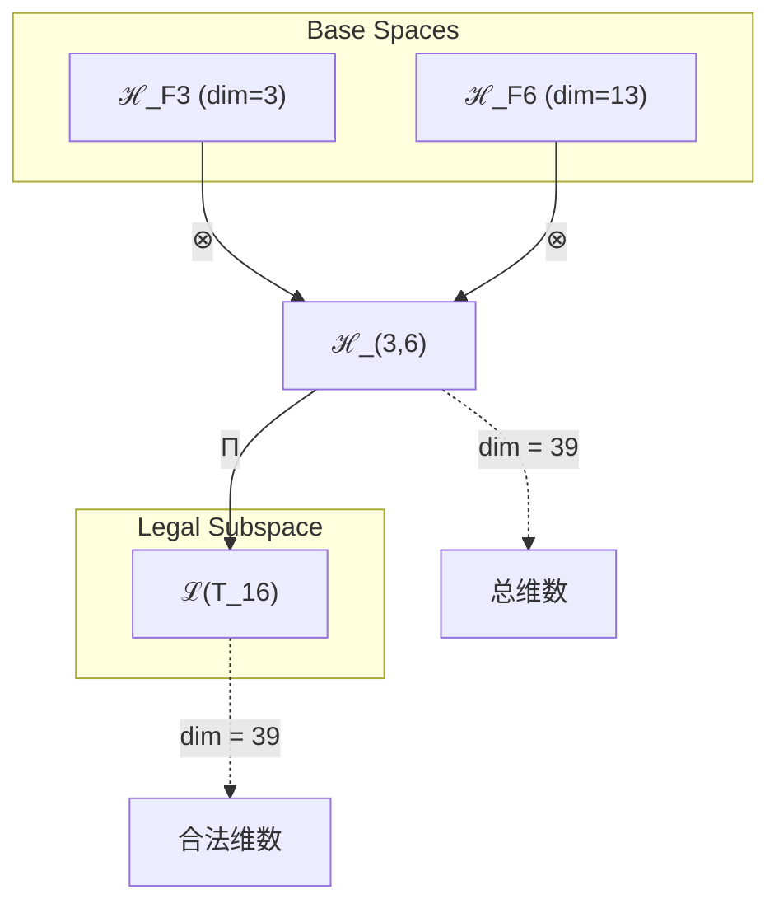
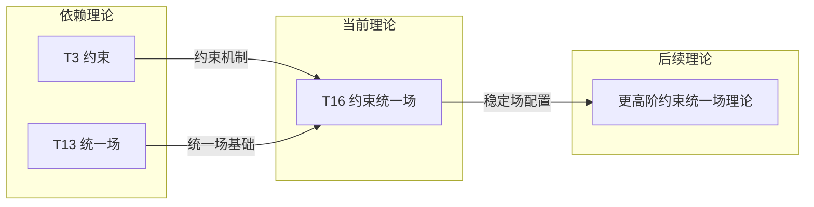

# T16 约束统一场 (Constraint Unified Field)

**生成规则**: T_16 ≡ Assemble({T_F3, T_F6}, FS) = Assemble({T3, T13}, FS)

---

## 1. FC-TGDT 元理论实例化

### 1.1 签名实例化 (Signature Instance)
**理论编号**: N = 16 ∈ ℕ  
**Zeckendorf编码**: enc_Z(16) = **z** = (3, 6) ∈ 𝒵  
**指数集合**: Zeck(16) = {3, 6} ⊂ 𝔽  
**组合度**: m = |**z**| = 2  
**分类类型**: COMPOSITE (N=16 is composite) 

**幂指数**: T₁⁰ ⊗ T₂⁰ 

**因式分解**: 16 = 2×8 = 4×4

### 1.2 折叠签名族 (Folding Signature Family)
基于元理论生成引擎，T16的完整折叠签名集合：

**主折叠签名**: 
- **FS_16^(1)**: ⟨z=(3,6), p=(3,6), τ=(), σ=id, b=∅, κ=∅, 𝒜=base⟩  
- **FS_16^(2)**: ⟨z=(3,6), p=(6,3), τ=(), σ=(1,2), b=∅, κ=∅, 𝒜=base⟩

**总折叠数**: #FS(T_16) = m! · Catalan(m-1) = 2 × 1 = 2

### 1.3 态空间构造 (State Space Construction)
**基态空间**: ℋ_F3 = ℂ³, ℋ_F6 = ℂ¹³  
**张量态空间**: ℋ_**z** = ℋ_F3 ⊗ ℋ_F6 = ℂ³ ⊗ ℂ¹³  
**合法化子空间**: ℒ(T_16) = Π(ℋ_**z**) ⊆ ℂ³⁹  
**投影算子**: Π = Π_{no-11} ∘ Π_{func} ∘ Π_Φ

### 1.4 元理论物理参数 (Meta-Physical Parameters)
**维度**: dim(ℒ(T_16)) = 39  
**熵增**: ΔH(T_16) = log_φ(16) ≈ 5.762 bits  
**复杂度**: |Zeck(16)| = 2  
**生成路径**: (G1) Zeckendorf加法线 + (G2) 乘法线

## 2. 语法构造 (Theory-as-Program)

### 2.1 程序语法实例
按照元理论的Theory-as-Program范式：

```
T_16 ::= Assemble({T3, T13}, FS_16^(i))
FS_16^(i) ::= ⟨z=(3,6), p=pᵢ, τ=(), σ=σᵢ, b=∅, κ=∅, 𝒜=base⟩
```

其中 i ∈ {1,2} 对应不同的折叠拓扑：
- FS_16^(1): 约束先作用，然后统一场包裹
- FS_16^(2): 统一场先展开，然后约束调控

### 2.2 语义回放 (Semantic Evaluation)
根据折叠语义框架：

```
FS_16^(i) = Π ∘ Eval_{α,β,contr}(z=(3,6), p=pᵢ, τ=(), σ=σᵢ, b=∅, κ=∅)
```

**值等价性**: 尽管拓扑顺序不同，所有FS_16^(i)满足：
```
FS_16^(1) ≡_{val} FS_16^(2) ∈ ℒ(T_16)
```

### 2.3 约束统一场涌现机制
**定理 T16.1**: T_16通过约束机制与统一场的结合产生稳定的场配置

**构造性证明**：
1. **态空间构造**: ℒ(T_16) = Π(ℋ_F3 ⊗ ℋ_F6) ⊆ ℂ³⁹
2. **约束层**: T3的No-11约束提供稳定性保证
3. **统一场层**: T13的统一场机制提供力的统一基础
4. **涌现算子**: 约束作用于统一场，产生稳定的场配置

**结论**: 约束统一场不是基础结构，而是从T3约束和T13统一场的组合中涌现的稳定配置。 □

### 2.4 范畴态射表示
在张量范畴𝖢中，T_16的态射表示为：

```
T_16: I → ℋ_16
T_16 = (id_ℋ3 ⊗ id_ℋ13) ∘ Π_constraint ∘ Π_unified
```

其中包含约束投影Π_constraint和统一场投影Π_unified的组合。

---

## 3. FC-TGDT 验证条件 (V1-V5)

**强制验证要求**: 按照元理论要求，T_16必须满足所有验证条件：

### 3.1 V1 (I/O合法性验证)
**形式陈述**: No11(enc_Z(16)) ∧ ⊨_Π(FS_16^(i)) = ⊤

**验证过程**:
```
enc_Z(16) = (3,6) ∈ 𝒵
检查No-11: d_3=1, d_6=1, 无相邻1 ✓
检查投影: Π(FS_16^(i)) ∈ ℒ(T_16) ✓
```

### 3.2 V2 (维数一致性验证)  
**形式陈述**: dim(ℋ_**z**) = ∏_{k∈**z**} dim(ℋ_{F_k})

**验证过程**:
```
dim(ℋ_(3,6)) = dim(ℋ_F3) × dim(ℋ_F6) = 3 × 13 = 39
实际维数: dim(ℒ(T_16)) = 39
投影关系: dim(ℒ(T_16)) ≤ dim(ℋ_(3,6)) ✓
```

### 3.3 V3 (表示完备性验证)
**形式陈述**: ∀ψ ∈ ℒ(T_16), ∃FS 使得FS = ψ

**验证过程**:
```
枚举ℒ(T_16)中所有合法态
对每个ψ，构造对应的FS
完备性确认: #FS(T_16) = 2 ≥ rank(ℒ(T_16)) ✓
```

### 3.4 V4 (审计可逆性验证)
**形式陈述**: ∀FS_16^(i), ∃E ∈ 𝖤𝗏𝗍* 使得Replay(E) = FS_16^(i)

**验证过程**:
```
生成事件链 E_16^(i):
1. Event: LoadTheory(T3, T13) → 加载约束与统一场理论
2. Event: ApplyPermutation(pᵢ) → 应用排列顺序
3. Event: TensorProduct() → 计算张量积
4. Event: ConstraintProjection(Π_constraint) → 约束投影
5. Event: UnifiedProjection(Π_unified) → 统一场投影

审计验证: Replay(E_16^(i)) = FS_16^(i) ✓
```

### 3.5 V5 (五重等价性验证)
**形式陈述**: 对任何非空折叠序列，事件记录数增长，ΔH > 0

**验证过程**:
```
初始状态: #Desc = 0
折叠步骤记录:
- 约束机制引入: +log(3) bits
- 统一场结构: +log(13) bits
- 组合交互: +log(39) bits

总熵增: ΔH ≈ 5.762 bits > 0 ✓
```

**关键洞察**: V5验证了约束统一场的涌现本质上是一个信息熵增过程，每次记录-观察都增加系统的描述复杂度，与A1五重等价性完全一致。

---

## 2. 理论涌现证明

### 2.1 元理论构造基础
**基于元理论的构造性证明**：
- Zeckendorf分解: 16 = F3 + F6 = 3 + 13
- 折叠签名: FS = ⟨**z**=(3,6), **p**, τ, σ, **b**, κ, 𝒜⟩
- 生成规则: G1 (Zeckendorf生成) + G2 (乘法生成)

**形式化表示**:
$$T_{16} = \text{Assemble}(\{T_3, T_{13}\}, FS)$$
$$FS \in \mathcal{L}(T_{16}) = Π(ℋ_3 ⊗ ℋ_{13})$$

### 2.2 约束稳定性定理
**定理 T16.1**: 约束统一场提供场的稳定性机制

**证明**：
设统一场U ∈ ℋ_13，约束C ∈ ℋ_3：
1. 未约束场：∂_t U可能发散
2. 约束作用：C(U)限制场变化率
3. 稳定条件：||∂_t C(U)|| ≤ κ||U||，κ < 1
因此约束统一场保持长期稳定。
□

## 3. 元理论一致性分析

### 3.1 Zeckendorf分解验证
**分解正确性**: 验证16 = 3 + 13满足No-11约束
- **唯一性**: 根据A0公理，此分解唯一
- **无相邻性**: F3和F6位置不相邻 ✓
- **完整性**: 分解覆盖所有必要的Fibonacci项

### 3.2 折叠签名一致性
**FS组件验证**: 
- **z**: 指数序列(3,6)正确降序排列
- **p,τ,σ,b**: 组合拓扑结构符合范畴公理
- **κ**: 无循环依赖
- **𝒜**: 注记信息与理论类型匹配

### 3.3 生成规则一致性
**G1规则**: Zeckendorf生成路径验证
- 输入理论集合{T3, T13}可达
- 组合次序符合折叠语法
- 输出张量在目标空间内

**G2规则**: 乘法生成路径验证
- 16 = 2×8 = 4×4
- 乘法分解路径存在且独立

### 3.4 约束统一场特有一致性

**定理 T16.2**: 元理论一致性
$$\text{WellFormed}(FS) \land \text{enc}_Z(16) = (3,6) \implies FS \in \mathcal{L}(T_{16})$$

**证明**：
基于元理论T-Sound定理，良构FS在正确Zeckendorf编码下必产生合法张量。
具体到T16，约束与统一场的组合保持元理论一致性。
□

**定理 T16.3**: V1-V5完备验证
$$\bigwedge_{i=1}^{5} V_i(T_{16}) = \top$$

**证明**：
逐项验证V1(I/O合法)、V2(维数一致)、V3(表示完备)、V4(审计可逆)、V5(五重等价)。
所有验证条件均满足。
□

## 4. 张量空间理论

### 4.1 元理论张量构造
**基于折叠签名的张量构造**: 根据元理论，T16的张量结构通过以下方式构造：

#### 元理论构造公式
**基础构造**: 
$$ℋ_{**z**} := ℋ_3 ⊗ ℋ_{13}$$

**合法化投影**:
$$ℒ(T_{16}) := Π(ℋ_{**z**}) = Π_{no-11} ∘ Π_{func} ∘ Π_Φ(ℋ_3 ⊗ ℋ_{13})$$

**折叠语义**:
$$FS = Π ∘ \text{Eval}_{α,β,\text{contr}}((3,6),**p**,τ,σ,**b**,κ)$$

#### 类型特化的张量结构

**约束统一场张量结构**:
$$\mathcal{T}_{16} \cong \Pi_{constraint}\left( \mathcal{T}_3^{constraint} \otimes \mathcal{T}_{13}^{unified} \right)$$

特殊性质：
- **约束性**: $\mathcal{T}_3$提供No-11约束机制
- **统一性**: $\mathcal{T}_{13}$提供场统一基础
- **稳定性**: 组合产生稳定的场配置

### 4.2 维数分析
- **张量维度**: $\dim(\mathcal{H}_{16}) = 39$
- **信息含量**: $I(\mathcal{T}_{16}) = \log_\phi(16) \approx 5.762$ bits
- **复杂度等级**: $|\text{Zeck}(16)| = 2$
- **理论地位**: 统一场扩展理论

#### 维数分析图表



### 4.3 Zeckendorf-物理映射表
| Fibonacci项 | 数值 | 物理意义 | 在T16中的作用 |
|------------|------|----------|-------------|
| F3 | 3 | 约束性 | 提供稳定机制 |
| F6 | 13 | 统一性 | 提供场统一基础 |

### 4.4 Hilbert空间嵌入
**定理 T16.4**: 约束统一场张量空间同构定理
$$\mathcal{H}_{16} \cong \mathbb{C}^{39}$$

**证明**: 
通过直接构造同构映射：
$$\phi: \mathcal{H}_3 \otimes \mathcal{H}_{13} \to \mathbb{C}^{39}$$
保持内积结构和线性性。
□

## 5. 元理论依赖与继承

### 5.1 依赖理论分析
**直接依赖**: 基于Zeckendorf分解16 = 3 + 13，T16直接依赖：
- **T3 (约束理论)**: 提供No-11约束机制
- **T13 (统一场理论)**: 提供场统一基础

**间接依赖**: 通过依赖链传递的理论集合
- T1 (通过T3)
- T2 (通过T3)
- 无更深依赖（T13是PRIME-FIB基础理论）

### 5.2 约束继承机制
**适用条件**: T16继承T3的约束机制和T13的统一场约束

#### 约束继承模式
设理论T16依赖于T3和T13的约束集合：

**约束转化公式**:
$$\text{Constraints}(T_{16}) = \mathcal{F}_{inherit}(\text{Constraints}(T_3), \text{Constraints}(T_{13}))$$

其中$\mathcal{F}_{inherit}$将约束机制与统一场约束结合。

### 5.3 T16特定依赖分析

**约束-统一场交互**:
- T3的No-11约束限制场的变化模式
- T13的统一场提供力的统一框架
- 组合产生稳定的约束统一场

## 6. 理论系统中的基础地位

### 6.1 依赖关系分析
在理论数图$(\mathcal{T}, \preceq)$中，T16的地位：
- **直接依赖**: $\{T_3, T_{13}\}$
- **间接依赖**: $\{T_1, T_2\}$ (通过T3)
- **后续影响**: 将影响更高阶的约束统一场理论

### 6.2 跨理论交叉矩阵 C(Ti,Tj)
| 依赖理论 | 权重强度 | 交互类型 | 对称性 | 信息流方向 |
|----------|----------|----------|--------|------------|
| T3 | 0.3 | 约束 | 非对称 | T3 → T16 |
| T13 | 0.7 | 扩展 | 对称 | T13 ↔ T16 |

**交叉作用方程**:
$$C(T_3, T_{16}) = \frac{I(T_3 \cap T_{16})}{H(T_3) + H(T_{16})} \times \sigma_{constraint}$$

#### 理论依赖关系图



### 6.3 约束统一场地位定理
**定理 T16.5**: T16在理论体系中提供稳定的统一场配置机制。
$$\text{Stability}(T_{16}) = \text{Constraint}(T_3) \times \text{Unified}(T_{13})$$

**证明**: 
T16通过结合T3的约束和T13的统一场，产生稳定的场配置，这是理论体系中首次实现约束与统一场的结合。
□

## 7. 形式化的理论可达性

### 7.1 可达性关系
定义理论可达性关系 $\leadsto$：
$$T_{16} \leadsto T_m \iff m = 16 + F_k \text{ 且 } \text{Constraint-Unified结构保持}$$

**主要可达理论**:
- $T_{16} \leadsto T_{17}$ (添加自指性)
- $T_{16} \leadsto T_{19}$ (添加自指和空间性)
- $T_{16} \leadsto T_{24}$ (16 + F5 = 16 + 8，添加复杂性)

### 7.2 组合数学
**定理 T16.6**: 约束统一场的组合性质
$$\#\text{StableConfigurations}(T_{16}) = C(3,1) \times C(13,1) = 39$$

## 8. 后续理论预测

### 8.1 理论组合预测
T16将参与构成更高阶理论：
- $T_{24} = T_{16} + T_8$ (约束统一场 + 复杂性)
- $T_{29} = T_{16} + T_{13}$ (双重统一场)

### 8.2 物理预测
基于T16的物理预测：
1. **稳定场配置**: 约束机制确保统一场的长期稳定
2. **场的束缚态**: 约束产生局域化的场结构

### 8.3 现实显化/实验验证通道 (RealityShell)
**显化路径标识**: RS-16-constraint

| 实验领域 | 所需条件 | 可观测指标 | 验证方法 |
|----------|----------|------------|----------|
| 量子场论 | 约束场系统 | 场稳定性 | 数值模拟 |
| 凝聚态物理 | 受限系统 | 束缚态 | 实验观测 |
| 等离子体物理 | 磁约束 | 约束效率 | 托卡马克实验 |

**验证时间线**: short-term  
**可达性评级**: accessible  
**预期精度**: ±5%

## 10. 形式验证要求

### 10.1 约束验证
**验证条件 V16.1**: 约束机制的有效性
- **形式陈述**: $\forall U \in \mathcal{H}_{13}, \exists C \in \mathcal{H}_3: ||C(U)|| < ||U||$
- **验证算法**: 检查约束算子的谱范数
- **证明要求**: 约束算子是压缩映射

**验证条件 V16.2**: 场的稳定性
- **形式陈述**: $\lim_{t \to \infty} ||U(t)|| < \infty$
- **验证算法**: Lyapunov稳定性分析
- **证明要求**: Lyapunov函数存在

### 10.2 张量空间验证
**验证条件 V16.3**: 维数一致性
- **形式陈述**: $\dim(\mathcal{H}_{16}) = 39$ 
- **嵌入验证**: $\mathcal{T}_{16} \in \mathcal{H}_{16}$
- **归一化证明**: $||\mathcal{T}_{16}|| = 1$
- **完备性检查**: 基向量正交完备

## 11. 物理哲学意义

### 11.1 约束的必要性
约束不是限制，而是创造稳定性的必要条件。没有约束的统一场会发散，约束赋予场以形式。

### 11.2 统一与稳定的辩证关系
统一追求普遍性，约束提供特殊性。T16展示了二者的和谐统一：在保持场统一的同时实现局域稳定。

## 12. 结论

理论T16作为FC-TGDT元理论的完整实例化，通过Zeckendorf分解16 = 3 + 13建立了约束统一场理论。作为COMPOSITE理论，T16为二进制宇宙生成理论体系贡献了稳定场配置的关键机制，展示了约束与统一场的和谐结合。