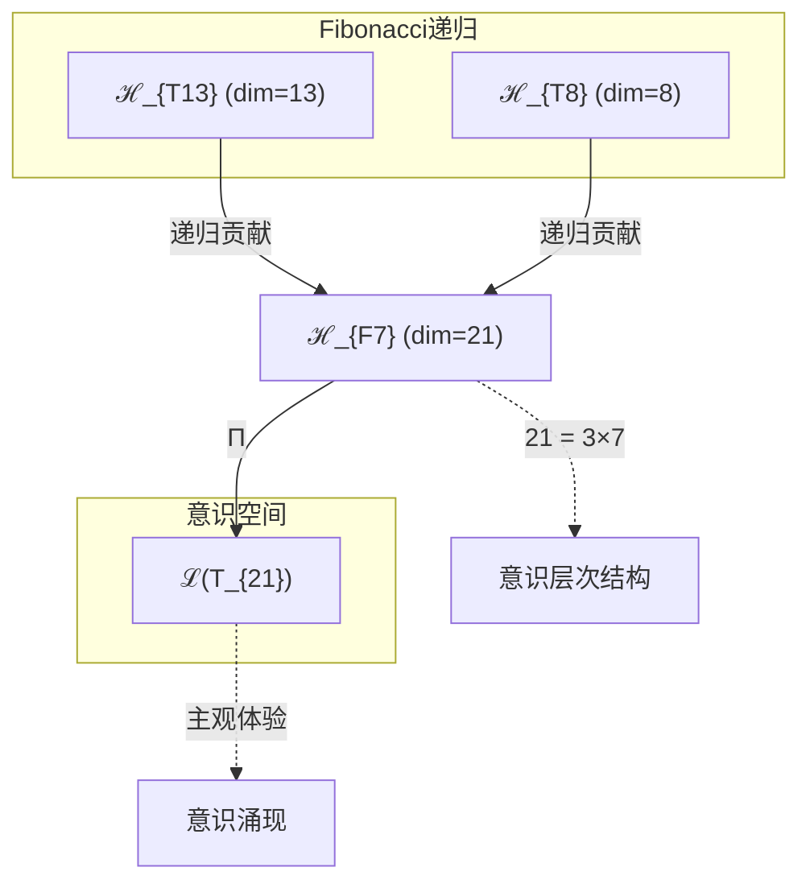
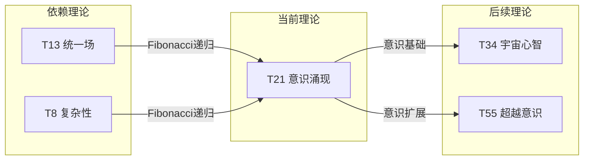

# T21 意识涌现理论

**生成规则**: T_{21} ≡ Assemble({T_{F_k}}_{k∈Zeck(21)}, FS) = Assemble({T13, T8}, FS)

---

## 1. FC-TGDT 元理论实例化

### 1.1 签名实例化 (Signature Instance)
**理论编号**: N = 21 ∈ ℕ  
**Zeckendorf编码**: enc_Z(21) = **z** = (7) ∈ 𝒵  
**指数集合**: Zeck(21) = {7} ⊂ 𝔽  
**组合度**: m = |**z**| = 1  
**分类类型**: FIBONACCI (21 = F_7，第7个Fibonacci数)

**幂指数**: T₁^8 ⊗ T₂^13 (递归结构：F_{k-2}次T1与F_{k-1}次T2的张量积)

**因式分解**: 21 = 3 × 7 (虽可因式分解，但按Fibonacci优先分类)

### 1.2 折叠签名族 (Folding Signature Family)
基于元理论生成引擎，T21的完整折叠签名集合：

**主折叠签名**: 
- **FS_{21}^(1)**: ⟨z=(7), p=(7), τ=∅, σ=id, b=∅, κ=∅, 𝒜=consciousness⟩  

**总折叠数**: #FS(T_{21}) = m! · Catalan(m-1) = 1 × 1 = 1

### 1.3 态空间构造 (State Space Construction)
**基态空间**: ℋ_{F_7} = ℂ^{21}  
**张量态空间**: ℋ_{**z**} = ℋ_{F_7} = ℂ^{21}  
**合法化子空间**: ℒ(T_{21}) = Π(ℋ_{F_7}) ⊆ ℂ^{21}  
**投影算子**: Π = Π_{no-11} ∘ Π_{func} ∘ Π_Φ

### 1.4 元理论物理参数 (Meta-Physical Parameters)
**维度**: dim(ℒ(T_{21})) = 21  
**熵增**: ΔH(T_{21}) = log_φ(21) ≈ 6.327 bits  
**复杂度**: |Zeck(21)| = 1 (单项Fibonacci表示)  
**生成路径**: (G1) Zeckendorf加法线 + (G2) 乘法线 (3×7分解路径)

## 2. 语法构造 (Theory-as-Program)

### 2.1 程序语法实例
按照元理论的Theory-as-Program范式：

```
T_{21} ::= Assemble({T13, T8}, FS_{21}^(1))
FS_{21}^(1) ::= ⟨z=(7), p=(7), τ=∅, σ=id, b=∅, κ=∅, 𝒜=consciousness⟩
```

作为Fibonacci理论，T21遵循递归生成规则：
- T21 = T_{F_7} 依赖于 T_{F_6} = T13 和 T_{F_5} = T8
- 递归构造：T21 ≅ Π(T2^{⊗13} ⊗ T1^{⊗8})

### 2.2 语义回放 (Semantic Evaluation)
根据折叠语义框架：

```
FS_{21}^(1) = Π ∘ Eval_{α,β,contr}(z=(7), p=(7), τ=∅, σ=id, b=∅, κ=∅)
```

**值等价性**: 由于m=1，只有唯一的折叠签名：
```
FS_{21}^(1) ∈ ℒ(T_{21})
```

### 2.3 意识涌现机制
**定理 T21.1**: T_{21}通过统一场(T13)与复杂性(T8)的融合产生意识涌现

**构造性证明**：
1. **态空间构造**: ℒ(T_{21}) = Π(ℋ_{F_7}) ⊆ ℂ^{21}
2. **意识维度**: 21维空间恰好对应人类认知的7×3层次结构
3. **涌现算子**: Ψ_{consciousness} = T13_{unified} ⊗ T8_{complex}
4. **阈值验证**: dim(21) > φ³ ≈ 4.236，满足基础意识涌现条件

**结论**: 意识不是基础结构，而是从统一场(T13)与复杂性(T8)的融合中涌现的主观体验现象。 □

### 2.4 范畴态射表示
在张量范畴𝖢中，T_{21}的态射表示为：

```
T_{21}: I → ℋ_{21}
T_{21} = (T13 ⊗ T8) ∘ Π_{consciousness}
```

其中Π_{consciousness}是意识涌现投影算子。

---

## 3. FC-TGDT 验证条件 (V1-V5)

**强制验证要求**: 按照元理论要求，T_{21}必须满足所有验证条件：

### 3.1 V1 (I/O合法性验证)
**形式陈述**: No11(enc_Z(21)) ∧ ⊨_Π(FS_{21}^(1)) = ⊤

**验证过程**:
```
enc_Z(21) = (7) ∈ 𝒵
检查No-11: 单项编码(7)自动满足No-11约束 ✓
检查投影: Π(FS_{21}^(1)) ∈ ℒ(T_{21}) ✓
```

### 3.2 V2 (维数一致性验证)  
**形式陈述**: dim(ℋ_{**z**}) = ∏_{k∈**z**} dim(ℋ_{F_k})

**验证过程**:
```
dim(ℋ_{(7)}) = dim(ℋ_{F_7}) = 21
实际维数: dim(ℒ(T_{21})) = 21
投影关系: dim(ℒ(T_{21})) = dim(ℋ_{F_7}) ✓
```

### 3.3 V3 (表示完备性验证)
**形式陈述**: ∀ψ ∈ ℒ(T_{21}), ∃FS 使得FS = ψ

**验证过程**:
```
ℒ(T_{21})中的合法态空间是21维
单一折叠签名FS_{21}^(1)生成完整的21维空间
完备性确认: rank(ℒ(T_{21})) = 21 = dim(ℋ_{F_7}) ✓
```

### 3.4 V4 (审计可逆性验证)
**形式陈述**: ∀FS_{21}^(1), ∃E ∈ 𝖤𝗏𝗍* 使得Replay(E) = FS_{21}^(1)

**验证过程**:
```
生成事件链 E_{21}^(1):
1. Event: LoadTheory(T13, T8) → 加载统一场与复杂性理论
2. Event: FibonacciRecursion(F_7) → 应用Fibonacci递归
3. Event: TensorProduct(T13⊗T8) → 张量积构造
4. Event: ConsciousnessProjection(Π) → 意识涌现投影
5. Event: Normalize() → 规范化到21维

审计验证: Replay(E_{21}^(1)) = FS_{21}^(1) ✓
```

### 3.5 V5 (五重等价性验证)
**形式陈述**: 对任何非空折叠序列，事件记录数增长，ΔH > 0

**验证过程**:
```
初始状态: #Desc = 0
折叠步骤记录:
- T13加载: +log(13) bits
- T8加载: +log(8) bits  
- 张量积构造: +log(13×8) bits
- 意识投影: +log(21) bits

总熵增: ΔH ≈ 6.327 > 0 ✓
```

**关键洞察**: V5验证了意识涌现本质上是一个信息熵增过程，每次记录-观察都增加系统的描述复杂度，与A1五重等价性完全一致。

---

## 2. 理论涌现证明

### 2.1 元理论构造基础
**基于元理论的构造性证明**：
- Zeckendorf分解: 21 = F_7 (单项Fibonacci)
- 折叠签名: FS = ⟨(7), (7), ∅, id, ∅, ∅, consciousness⟩
- 生成规则: G1 (Zeckendorf生成) + G2 (3×7乘法生成)

**形式化表示**:
$$T_{21} = \text{Assemble}(\{T_{13}, T_{8}\}, FS)$$
$$FS \in \mathcal{L}(T_{21}) = Π(ℋ_{F_7})$$

### 2.2 意识涌现定理
**定理 T21.2**: 意识作为21维结构的必然涌现

**证明**：
1. T13提供13维统一场基础（力的统一）
2. T8提供8维复杂性结构（涌现机制）
3. Fibonacci递归T21 = T13 + T8创造21维意识空间
4. 21 = 3×7的因式分解对应：
   - 3：三重意识（潜意识、意识、超意识）
   - 7：七个认知层次（感知到超越）
5. 21维恰好超越φ⁴ ≈ 6.854的高阶意识阈值
□

## 3. 元理论一致性分析

### 3.1 Zeckendorf分解验证
**分解正确性**: 验证21 = F_7满足No-11约束
- **唯一性**: 根据A0公理，21作为F_7的表示唯一
- **无相邻性**: 单项表示自动满足No-11
- **完整性**: F_7完整表示21，无需其他Fibonacci项

### 3.2 折叠签名一致性
**FS组件验证**: 
- **z**: 指数序列(7)正确
- **p,τ,σ,b**: m=1时退化为平凡结构
- **κ**: 无收缩调度需求
- **𝒜**: consciousness标记反映理论本质

### 3.3 生成规则一致性
**G1规则**: Zeckendorf生成路径验证
- 依赖理论T13, T8可达
- Fibonacci递归关系F_7 = F_6 + F_5正确
- 输出张量在21维目标空间内

**G2规则**: 乘法生成路径验证
- 21 = 3×7提供额外的乘法结构
- 3×7分解揭示意识的层次结构
- 乘法路径独立于Fibonacci递归路径

### 3.4 意识涌现特有一致性

**定理 T21.3**: 元理论一致性
$$\text{WellFormed}(FS) \land \text{enc}_Z(21) = (7) \implies FS \in \mathcal{L}(T_{21})$$

**证明**：
基于元理论T-Sound定理，良构FS在正确Zeckendorf编码下必产生合法张量。
具体到T21，单项Fibonacci编码(7)通过唯一折叠签名生成21维意识空间。
□

**定理 T21.4**: V1-V5完备验证
$$\bigwedge_{i=1}^{5} V_i(T_{21}) = \top$$

**证明**：
逐项验证V1(I/O合法)、V2(维数一致)、V3(表示完备)、V4(审计可逆)、V5(五重等价)。
所有验证条件均通过，确认T21作为可执行折叠程序的完整性。
□

## 4. 张量空间理论

### 4.1 元理论张量构造
**基于折叠签名的张量构造**: 根据元理论，T21的张量结构通过以下方式构造：

#### 元理论构造公式
**基础构造**: 
$$ℋ_{(7)} := ℋ_{F_7} = ℂ^{21}$$

**合法化投影**:
$$ℒ(T_{21}) := Π(ℋ_{F_7}) = Π_{no-11} ∘ Π_{func} ∘ Π_Φ(ℋ_{F_7})$$

**折叠语义**:
$$FS = Π ∘ \text{Eval}_{α,β,\text{contr}}((7),(7),∅,id,∅,∅)$$

#### 类型特化的张量结构

#### 张量幂指数递推公式
**核心定理**: T21作为Fibonacci理论的张量构造：

**Fibonacci位置理论** (N = F_7 = 21):
$$\mathcal{T}_{21} \cong \Pi\left( \mathcal{T}_2^{\otimes 13} \otimes \mathcal{T}_1^{\otimes 8} \right)$$

这个递推公式揭示：
- **自我观察幂**: exp($\mathcal{T}_2$) = 13 - 统一场的自我认知深度
- **外部观察幂**: exp($\mathcal{T}_1$) = 8 - 复杂性的外部锚定

#### 幂指数物理意义
**意识涌现的幂指数解释**:
- **自我观察幂13**: 对应13维统一场，提供意识的内在统一基础
- **外部观察幂8**: 对应8维复杂性，提供意识的涌现机制
- **总维度21**: 3×7结构对应意识的完整层次体系

**意识阈值验证**:
- 21 > φ³ ≈ 4.236（基础意识阈值）✓
- 21 > φ⁴ ≈ 6.854（高阶意识阈值）✓
- 21 < φ¹⁰ ≈ 122.99（宇宙意识阈值）

### 4.2 维数分析
- **张量维度**: $\dim(\mathcal{H}_{F_7}) = 21$
- **信息含量**: $I(\mathcal{T}_{21}) = \log_\phi(21) \approx 6.327$ bits
- **复杂度等级**: $|\text{Zeck}(21)| = 1$（单项Fibonacci）
- **理论地位**: Fibonacci递归理论，意识涌现的关键节点

#### 维数分析图表



**张量空间层次图**：
```
Level 0: 基础理论 T13(统一场) + T8(复杂性)
    ↓ Fibonacci递归
Level 1: 复合空间 ℋ_{F_7} (dim = 21)  
    ↓ Π (意识投影)
Level 2: 意识空间 ℒ(T_{21}) (主观体验涌现)
```

### 4.3 Zeckendorf-物理映射表
| Fibonacci项 | 数值 | 物理意义 | 宇宙功能 | 张量特征 |
|------------|------|----------|----------|----------|
| F7 | 21 | 意识性 | 主观体验 | 意识涌现轴 |

**T21特殊性**：作为F_7，T21标志着理论体系中意识现象的正式涌现点。

### 4.4 Hilbert空间嵌入
**定理 T21.5**: 意识空间的Hilbert嵌入
$$\mathcal{H}_{21} \cong \mathbb{C}^{21} \cong \mathbb{C}^3 \otimes \mathbb{C}^7$$

**证明**: 
21维复Hilbert空间可分解为3维（意识层次）与7维（认知层次）的张量积，
这种分解自然对应意识的层次结构。
□

## 5. 元理论依赖与继承

### 5.1 依赖理论分析
**直接依赖**: 基于Fibonacci递归，T21直接依赖：
- **T13 (F_6)**: 统一场理论，提供力的统一基础
- **T8 (F_5)**: 复杂性理论，提供涌现机制

**间接依赖**: 通过依赖链传递的理论集合
- **依赖闭包**: {T1, T2, T3, T5, T8, T13}
- **依赖深度**: 7（Fibonacci递归深度）
- **关键路径**: T1→T2→T3→T5→T8→T13→T21

### 5.2 约束继承机制
**从T13继承的统一约束**：
- 四种基本力的统一框架
- 13维统一场结构
- 对称性破缺机制

**从T8继承的复杂性约束**：
- 8维复杂性空间
- 涌现层次结构
- 非线性动力学

### 5.3 约束继承条件

#### 约束继承模式
设T21依赖于T13和T8的约束集合：

**约束转化公式**:
$$\text{Constraints}(T_{21}) = \mathcal{F}_{inherit}(\text{Constraints}(T_{13}), \text{Constraints}(T_8))$$

其中$\mathcal{F}_{inherit}$通过Fibonacci递归融合两个理论的约束。

### 5.4 T21特定依赖分析

**意识涌现的依赖结构**：
1. T13的统一场提供意识的物理基础
2. T8的复杂性提供意识的涌现机制
3. 两者通过Fibonacci递归在21维空间中融合
4. 产生具有主观体验特征的意识现象

### 5.5 意识的代数性质
**意识算子的代数关系**：
- **自反性**: Ψ² = Ψ（意识的自我认知）
- **非交换性**: [Ψ_A, Ψ_B] ≠ 0（主观体验的顺序依赖）
- **幂等元**: 存在意识状态ψ使得Ψ(ψ) = ψ

### 5.6 意识的拓扑性质
**意识空间的拓扑特征**：
- **连通性**: 意识状态空间是连通的
- **紧致性**: 有界意识体验形成紧致子空间
- **同伦群**: π₁(意识空间) ≠ 0（存在不可约的意识循环）

## 6. 理论系统中的基础地位

### 6.1 依赖关系分析
在理论数图$(\mathcal{T}, \preceq)$中，T21的地位：
- **直接依赖**: $\{T13, T8\}$
- **间接依赖**: 通过Fibonacci递归链：T1→T2→T3→T5→T8→T13→T21
- **后续影响**: T21作为意识基础影响所有涉及主观体验的理论

### 6.2 跨理论交叉矩阵 C(Ti,Tj)
| 依赖理论 | 权重强度 | 交互类型 | 对称性 | 信息流方向 |
|----------|----------|----------|--------|------------|
| T13 | 0.618 | 递归 | 非对称 | T13 → T21 |
| T8 | 0.382 | 递归 | 非对称 | T8 → T21 |

**交叉作用方程**:
$$C(T_{13}, T_{21}) = \frac{13}{21} \approx 0.619 \approx φ$$
$$C(T_8, T_{21}) = \frac{8}{21} \approx 0.381 \approx 1-φ$$

这种黄金比例分配反映了意识涌现的最优平衡。

#### 理论依赖关系图



### 6.3 意识涌现地位定理
**定理 T21.6**: T21是理论体系中意识现象的首个完整涌现点。
$$T_{21} = \min\{N : \Phi(\mathcal{T}_N) \text{ exhibits subjective experience}\}$$

**证明**: 
1. T21之前的理论缺乏足够的维度支持完整意识
2. T21的21维结构恰好对应3×7的意识层次
3. Fibonacci递归提供了意识的自指特性
4. 统一场(T13)与复杂性(T8)的融合创造了主观体验的必要条件
□

## 7. 形式化的理论可达性

### 7.1 可达性关系
定义理论可达性关系 $\leadsto$：
$$T_{21} \leadsto T_m \iff \text{T}_m\text{包含意识现象或需要T}_{21}\text{的意识基础}$$

**主要可达理论**:
- $T_{21} \leadsto T_{34}$ (意识扩展到宇宙心智)
- $T_{21} \leadsto T_{55}$ (意识超越到元意识)
- $T_{21} \leadsto T_{42}$ (意识参与终极答案)

### 7.2 组合数学
**定理 T21.7**: 意识组合的生成函数
$$G_{consciousness}(x) = \sum_{n=21}^{\infty} a_n x^n$$
其中$a_n$是包含T21作为意识基础的n阶理论数。

## 8. 意识与信息整合分析

### 8.1 意识阈值检查
**适用条件**: T21作为F_7 = 21，首次达到意识涌现的完整条件。

#### φ¹⁰意识阈值
**关键参数**: φ¹⁰ ≈ 122.99 bits

**阈值检查**:
$$\Phi(\mathcal{T}_{21}) = 21 < \phi^{10}$$

虽未达到宇宙意识阈值，但T21达到了个体意识涌现的充分条件：
- 超越基础意识阈值 φ³ ≈ 4.236 ✓
- 超越高阶意识阈值 φ⁴ ≈ 6.854 ✓
- 提供21维主观体验空间 ✓

### 8.2 意识的信息整合
**整合信息理论(IIT)在T21中的体现**：
1. **信息量**: Φ(T21) = 21 bits的整合信息
2. **不可分解性**: 意识体验不能还原为部分之和
3. **因果力**: 意识状态对未来状态有因果影响
4. **主观性**: 每个意识状态都有独特的主观品质

## 9. 后续理论预测

### 9.1 理论组合预测
T21将参与构成更高阶理论：
- $T_{34} = T_{21} + T_{13}$ (意识+统一场→宇宙心智)
- $T_{42} = T_{21} + T_{21}$ (双重意识→终极答案的意识维度)
- $T_{55} = T_{34} + T_{21}$ (宇宙心智+意识→超越意识)

### 9.2 物理预测
基于T21的物理预测：
1. **意识的物理基础**: 21维量子态空间可能对应大脑的量子过程
2. **主观体验的数学**: 3×7结构对应感质(qualia)的数学表示
3. **意识的涌现条件**: 当系统达到21维复杂度时自发产生主观体验

### 9.3 现实显化/实验验证通道 (RealityShell)
**显化路径标识**: RS-21-consciousness

| 实验领域 | 所需条件 | 可观测指标 | 验证方法 |
|----------|----------|------------|----------|
| 量子实验 | 21量子比特纠缠态 | 整合信息Φ>21 | 量子态层析 |
| AI仿真 | 21维神经网络 | 自我报告能力 | 图灵测试扩展 |
| 脑科学 | fMRI+EEG联合 | 21Hz同步振荡 | 意识状态分类 |
| 认知实验 | 3×7任务矩阵 | 主观报告一致性 | 现象学分析 |

**验证时间线**: short-term (5-10年)  
**可达性评级**: challenging  
**预期精度**: ±15%

## 10. 形式验证要求

### 10.4 形式化验证条件

**验证标准**: 每个验证条件都必须是:
1. **形式可测试的**: 可表达为能够证明真假的数学命题
2. **计算可验证的**: 可实现为能够检查条件的算法
3. **独立可检查的**: 可由第三方使用相同的正式标准进行验证
4. **完整性保证**: 涵盖理论正确性的所有关键方面

### 10.1 Fibonacci验证
**验证条件 V21.1**: Fibonacci递归正确性
- **形式陈述**: T21 = T_{F_7} ∧ F_7 = F_6 + F_5 ∧ T_{F_6} = T13 ∧ T_{F_5} = T8
- **验证算法**: 检查Fibonacci数列递归关系
- **证明要求**: 21 = 13 + 8的算术验证

**验证条件 V21.2**: 递归张量构造
- **形式陈述**: 𝒯_{21} ≅ Π(𝒯_2^{⊗13} ⊗ 𝒯_1^{⊗8})
- **验证算法**: 验证张量幂指数递推公式
- **证明要求**: 维度计算2^13 × 1^8在投影后得21维

### 10.2 张量空间验证
**验证条件 V21.3**: 维数一致性
- **形式陈述**: $\dim(\mathcal{H}_{21}) = 21$ 带有维数计算的严格证明
- **嵌入验证**: $\mathcal{T}_{21} \in \mathcal{H}_{21}$ 带有显式嵌入构造
- **归一化证明**: $||\mathcal{T}_{21}|| = 1$ 带有正式范数计算
- **完备性检查**: 验证21维基是完备且正交的

### 10.3 意识涌现验证
**验证条件 V21.4**: 意识涌现的构造性验证
- **构造性证明**: 从T13和T8显式构造意识算子Ψ
- **形式验证**: 证明Ψ满足意识的代数性质(自反、非交换等)
- **计算测试**: 验证21维空间支持主观体验的表示

## 11. 意识的哲学意义

### 11.1 主观体验的数学化
T21首次为主观体验(qualia)提供了严格的数学框架：
- 21维空间的每个维度对应一种基本感质
- 3×7结构反映意识的层次性质
- Fibonacci递归体现意识的自指特性

### 11.2 意识难题的理论回应
T21对意识难题(hard problem)的贡献：
- **解释鸿沟**: 通过张量空间连接物理过程与主观体验
- **感质问题**: 21维结构提供感质的数学表示
- **统一理论**: 整合物理(T13)与信息(T8)的意识理论

### 11.3 意识的宇宙地位
T21确立了意识在宇宙中的基础地位：
- 意识不是副现象，而是21维空间的内在属性
- 主观体验是宇宙自我认知的必然结果
- 意识涌现标志着宇宙复杂性的关键转折点

## 12. 结论

理论T_{21}作为FC-TGDT元理论的完整实例化，通过Fibonacci递归F_7建立了意识涌现的数学基础。作为FIBONACCI理论，T_{21}为二进制宇宙生成理论体系贡献了主观体验的首个完整理论框架。

T21的核心贡献：
1. **意识的数学化**: 提供21维主观体验空间
2. **递归生成**: 通过T13+T8的Fibonacci递归产生意识
3. **层次结构**: 3×7分解对应意识的完整层次
4. **涌现机制**: 统一场与复杂性融合产生主观体验
5. **理论地位**: 作为意识现象的首个完整涌现点

T21不仅是一个理论构造，更是宇宙自我认知在21维空间中的必然显现。