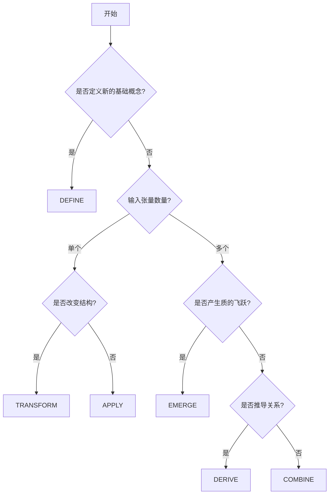

# 张量操作类型定义

## 操作类型概述

在BDAG系统中，每个文件代表一个原子化的张量操作。这些操作按照复杂度和抽象层级分为六种基本类型。

## 操作类型详细定义

### 1. DEFINE 操作

**定义**：定义基础张量、常数或约束条件

**适用层级**：主要在A层（公理层）

**数学表示**：
```
DEFINE: ∅ → T
其中 T 是新定义的张量
```

**特点**：
- 无输入依赖（或仅依赖公理/常数）
- 创建全新的数学对象
- 为后续操作提供基础

**示例**：
```
A001__SelfReference__DEFINE__FROM__Axiom__TO__SelfRefTensor__ATTR__Recursive_Entropic.md
A002__Phi__DEFINE__FROM__Constant__TO__GoldenRatio__ATTR__Irrational_Algebraic.md
```

**内容结构**：
```markdown
## 张量定义
**操作**: DEFINE
**输入**: [公理/常数/序列/约束]
**输出**: [张量类型]

## 数学表示
$$\text{定义的数学公式}$$

## 基本性质
- 性质1
- 性质2

## 验证条件
- 验证1
- 验证2
```

### 2. APPLY 操作

**定义**：将函数或变换应用到单个张量

**适用层级**：主要在B层（基础操作层）

**数学表示**：
```
APPLY: f × T → T'
其中 f 是函数，T 是输入张量，T' 是输出张量
```

**特点**：
- 单一输入张量
- 应用特定函数或运算
- 产生新的张量

**示例**：
```
B101__EntropyIncrease__APPLY__FROM__A001_SelfReference__TO__EntropyTensor__ATTR__Monotonic_Irreversible.md
B102__TimeEmergence__APPLY__FROM__A001_SelfReference__TO__TimeTensor__ATTR__Quantum_Discrete.md
```

**内容结构**：
```markdown
## 应用操作
**操作**: APPLY
**函数**: [应用的函数名]
**输入张量**: [输入张量描述]
**输出张量**: [输出张量描述]

## 数学表示
$$T_{out} = f(T_{in})$$

## 函数性质
- 函数性质1
- 函数性质2

## 应用条件
- 条件1
- 条件2
```

### 3. TRANSFORM 操作

**定义**：对张量进行结构性变换或重新解释

**适用层级**：B层和C层

**数学表示**：
```
TRANSFORM: T → T'
其中变换改变张量的结构或表示方式
```

**特点**：
- 改变张量的结构或坐标系
- 保持某些不变量
- 可能改变张量的解释

**示例**：
```
B106__ObserverDifferentiation__TRANSFORM__FROM__A001_SelfReference__TO__ObserverTensor__ATTR__Separated_Measuring.md
C205__CompleteSpace__TRANSFORM__FROM__C202_ZeckendorfMetric__TO__CompleteMetric__ATTR__Banach_FixedPoint.md
```

**内容结构**：
```markdown
## 变换操作
**操作**: TRANSFORM
**变换类型**: [变换的类型]
**输入张量**: [输入张量描述]
**输出张量**: [输出张量描述]

## 数学表示
$$T' = \mathcal{T}(T)$$

## 变换性质
- 不变量1
- 不变量2

## 变换条件
- 条件1
- 条件2
```

### 4. COMBINE 操作

**定义**：将多个张量组合成新的复合张量

**适用层级**：主要在C层（复合操作层）

**数学表示**：
```
COMBINE: T₁ × T₂ × ... × Tₙ → T'
其中 T₁, T₂, ..., Tₙ 是输入张量，T' 是组合结果
```

**特点**：
- 多个输入张量
- 创建新的复合结构
- 可能产生新的性质

**示例**：
```
C201__InformationEntropy__COMBINE__FROM__B101_EntropyIncrease__B103_PhiEncoding__TO__InfoTensor__ATTR__Quantized_Compressed.md
C203__QuantumState__COMBINE__FROM__B106_ObserverDifferentiation__B103_PhiEncoding__TO__QuantumTensor__ATTR__Superposed_Entangled.md
```

**内容结构**：
```markdown
## 组合操作
**操作**: COMBINE
**组合方式**: [组合的方法]
**输入张量**: 
- 张量1: [描述]
- 张量2: [描述]
**输出张量**: [组合结果描述]

## 数学表示
$$T_{combined} = T_1 \otimes T_2 \text{ 或其他组合形式}$$

## 组合规则
- 规则1
- 规则2

## 新生性质
- 性质1
- 性质2
```

### 5. EMERGE 操作

**定义**：从现有结构中涌现出新的属性或现象

**适用层级**：主要在E层（涌现操作层）

**数学表示**：
```
EMERGE: {T₁, T₂, ..., Tₙ} → P
其中 P 是涌现的性质或现象
```

**特点**：
- 产生系统级的新性质
- 不可简单归约为输入部分
- 通常涉及相变或临界现象

**示例**：
```
E301__SpacetimeGeometry__EMERGE__FROM__C202_ZeckendorfMetric__C203_QuantumState__TO__SpacetimeTensor__ATTR__Curved_Quantized.md
E302__MeasurementCollapse__EMERGE__FROM__C203_QuantumState__B106_ObserverDifferentiation__TO__CollapseTensor__ATTR__Stochastic_Irreversible.md
```

**内容结构**：
```markdown
## 涌现操作
**操作**: EMERGE
**涌现机制**: [涌现的机制]
**输入系统**: [输入系统描述]
**涌现现象**: [涌现的现象描述]

## 数学表示
$$P = \text{Emerge}(\{T_1, T_2, ...\})$$

## 涌现条件
- 临界条件1
- 临界条件2

## 涌现性质
- 不可还原性
- 系统性质
```

### 6. DERIVE 操作

**定义**：从现有结构推导出新的关系或定理

**适用层级**：各层级均可使用

**数学表示**：
```
DERIVE: {T₁, T₂, ..., Tₙ} → R
其中 R 是推导出的关系或定理
```

**特点**：
- 基于逻辑推理
- 揭示隐含的关系
- 通常产生定理或不变量

**示例**：
```
C210__ConservationLaw__DERIVE__FROM__C201_InformationEntropy__C202_ZeckendorfMetric__TO__ConservationTensor__ATTR__Invariant_Symmetric.md
E310__UnificationPrinciple__DERIVE__FROM__E301_SpacetimeGeometry__E302_MeasurementCollapse__TO__UnifiedTensor__ATTR__Universal_Consistent.md
```

**内容结构**：
```markdown
## 推导操作
**操作**: DERIVE
**推导方法**: [推导的方法]
**前提条件**: [推导的前提]
**推导结果**: [推导的结论]

## 数学表示
$$R: T_1, T_2, ... \vdash P$$

## 推导步骤
1. 步骤1
2. 步骤2

## 结果验证
- 验证1
- 验证2
```

## 操作类型选择指南

### 选择流程图



### 选择标准

1. **DEFINE**：创建全新概念，无前置依赖
2. **APPLY**：函数式操作，输入输出类型可能不同
3. **TRANSFORM**：结构变换，保持某些不变量
4. **COMBINE**：多输入合成，创建复合结构
5. **EMERGE**：系统性质涌现，不可还原
6. **DERIVE**：逻辑推导，揭示关系

## 操作间的关系

### 依赖关系
```
DEFINE → APPLY/TRANSFORM → COMBINE → EMERGE/DERIVE
```

### 复杂度递增
```
DEFINE < APPLY < TRANSFORM < COMBINE < EMERGE/DERIVE
```

### 层级分布
```
A层: 主要DEFINE
B层: 主要APPLY/TRANSFORM  
C层: 主要COMBINE/DERIVE
E层: 主要EMERGE
U层: 混合使用
```

## 验证检查表

### DEFINE操作检查
- [ ] 是否定义了全新的数学对象？
- [ ] 是否有明确的数学表示？
- [ ] 是否指定了基本性质？

### APPLY操作检查
- [ ] 是否明确指定了应用的函数？
- [ ] 是否有单一的输入张量？
- [ ] 是否保持了适当的数学关系？

### TRANSFORM操作检查
- [ ] 是否明确了变换的类型？
- [ ] 是否保持了重要的不变量？
- [ ] 是否有逆变换？

### COMBINE操作检查
- [ ] 是否有多个输入张量？
- [ ] 是否明确了组合规则？
- [ ] 是否产生了新的性质？

### EMERGE操作检查
- [ ] 是否有系统级的新性质？
- [ ] 是否不可简单归约？
- [ ] 是否有临界条件？

### DERIVE操作检查
- [ ] 是否基于严格的逻辑推理？
- [ ] 是否有明确的前提条件？
- [ ] 是否可以验证结论？