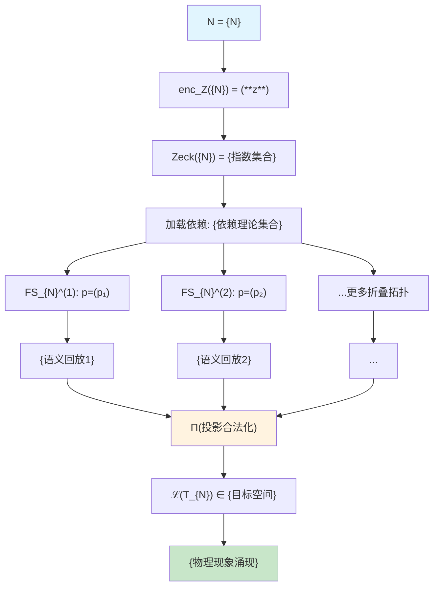
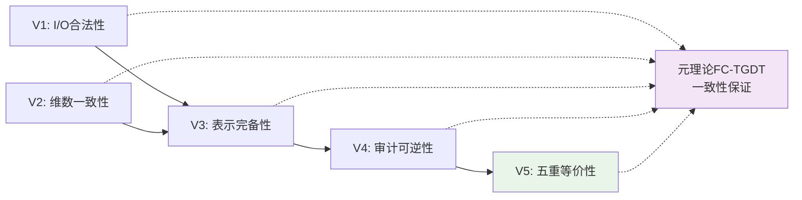
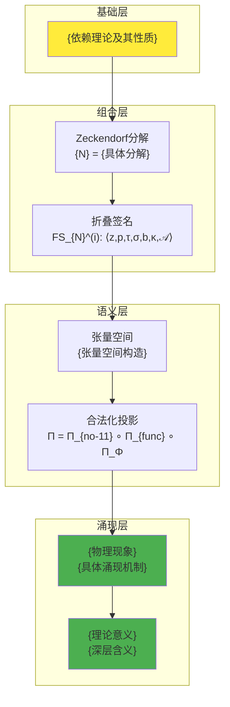
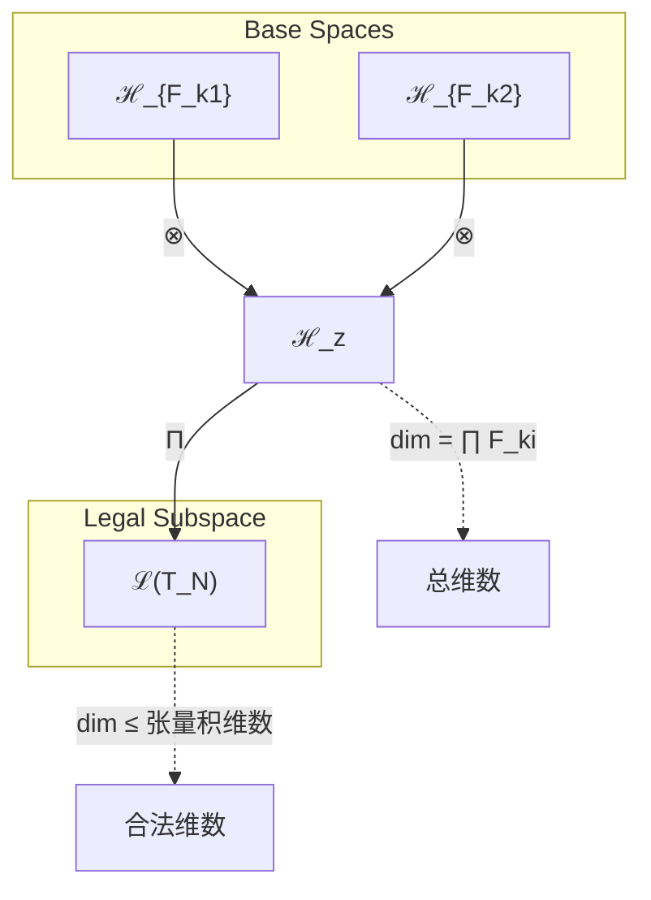
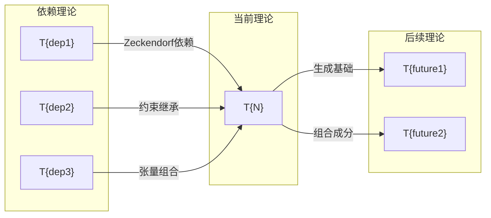
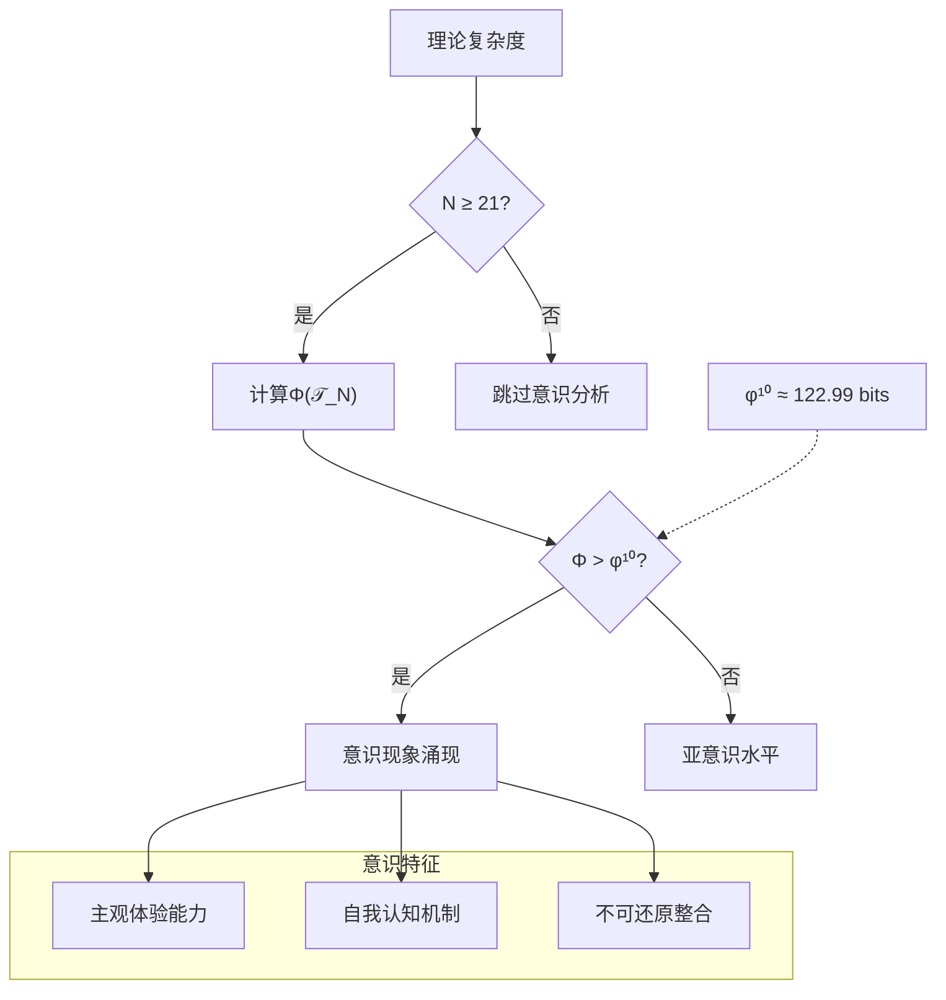

# T{N} {理论名称}

**理论依据**: 依据 [METATHEORY.md](../METATHEORY.md) 中的FC-TGDT可逆折叠语法生成  
**生成规则**: T_{N} ≡ Assemble({T_{F_k}}_{k∈Zeck(N)}, FS) = Assemble({依赖理论集合}, FS)

<!--
TEMPLATE_INSTRUCTION_BLOCK - 本块不要在目标文件中出现

**⚠️ 元理论完全集成模板说明**

此模板已完全重构，真正体现METATHEORY.md的所有性质：

1. **FC-TGDT签名系统**: Σ = ⟨𝖲𝗈𝗋𝗍𝗌, 𝖢𝗈𝗇𝗌𝗍, 𝖮𝗉𝗌, 𝖯𝗋𝖾𝖽⟩完全集成
2. **Theory-as-Program范式**: T_N ::= Atom(1)|Atom(2)|Assemble({T_{F_k}}, FS)
3. **折叠签名FS**: ⟨z,p,τ,σ,b,κ,𝒜⟩的完整结构
4. **V1-V5验证体系**: 强制性验证框架
5. **生成规则G1/G2**: Zeckendorf加法线与乘法线
6. **语义回放**: FS = Π ∘ Eval_{α,β,contr}
7. **自指完备性**: Quote: FS → ℒ(T_{N_{code}})

**关键改进**:
- 每个理论都明确展示为元理论实例化
- 折叠签名族的完整枚举
- V1-V5验证条件的具体实现
- 审计轨迹TGL⁺的可逆性保证
- 五重等价性在张量语义中的提升

**模板使用原则**: 
所有理论都必须严格遵循元理论框架，任何偏离都将导致理论无效。

### 🔬 形式化基础
**理论即程序**：
```
T_N ≡ Assemble({T_{F_k}}_{k∈Zeck(N)}, FS)
FS ∈ Π(⊗_{k∈Zeck(N)} ℋ_{F_k})
```

其中 FS = ⟨z,p,τ,σ,b,κ,𝒜⟩ 是折叠签名，定义了从依赖理论到目标张量的完整构造路径。

### 🏗️ 元理论架构
**1. 签名系统 Σ = ⟨𝖲𝗈𝗋𝗍𝗌, 𝖢𝗈𝗇𝗌𝗍, 𝖮𝗉𝗌, 𝖯𝗋𝖾𝖽⟩**：

**Sorts (类型域)**:
- **ℕ**: 自然数（理论编号域）
- **𝔽⊂ℕ**: Fibonacci指数集（索引k）
- **𝒵**: Zeckendorf位串（自右向左为低→高位）
- **𝒯**: 理论对象（语法层）
- **ℋ**: (Hilbert/向量)态空间对象
- **𝖥𝖲**: 折叠签名对象（可逆折叠轨迹）
- **𝖤𝗏𝗍**: TGL⁺事件
- **𝒞**: 约束集（物理/语义约束，如No-11等）

**Constants (常量)**:
- **F_k ∈ ℕ**: Fibonacci数列（F₁=1, F₂=2, F₃=3, F₄=5...）
- **T₁ ∈ 𝒯**: 唯一公理（自指完备外部观察基元）
- **T₂ ∈ 𝒯**: 熵增/自我观察基元
- **0**_𝒵 ∈ 𝒵: 全0位串

**Operations (运算)**:
- **enc_Z: ℕ → 𝒵**: Zeckendorf编码
- **val_Z: 𝒵 → ℕ**: 解码
- **⊕_𝔽: 𝒵×𝒵 → 𝒵**: Fibonacci加法 + 规范化
- **⊗_𝔽: 𝒵×𝒵 → 𝒵**: Fibonacci乘法（通过F_mF_n到{F_k}的展开 + 规范化）
- **Zeck(N): ℕ → 2^𝔽**: 返回N的指数集合，降序无相邻
- **MakeFS**: ⟨**z**,**p**,τ,σ,**b**,κ,𝒜⟩ ↦ 𝖥𝖲
- **折叠原语（范畴态射）**：
  - **α_{A,B,C}: (A⊗B)⊗C → A⊗(B⊗C)**: 结合子
  - **β_{A,B}: A⊗B → B⊗A**: 换位/编结生成元
  - **contr_{i,j}**: 第i、j腿收缩
  - **η,ε**: 单位/对偶（用于闭结构与迹）
- **Π_{no-11}, Π_{func}, Π_Φ 与 Π**: 合法化投影系列
- **·: 𝖥𝖲 → ℋ**: FS语义化（把签名回放为具体态/张量）
- **Norm: 𝖥𝖲 → 𝖥𝖲**: 规范化（幂等）
- **Emit: 𝖥𝖲 → 𝖤𝗏𝗍***: 生成可逆事件流TGL⁺

**Predicates (谓词)**:
- **No11: 𝒵**: 位串满足No-11约束
- **Prime: ℕ**: 自然数素性
- **Fib: ℕ**: 是否为某F_k
- **WellFormed: 𝖥𝖲**: 各分量类型与拓扑一致
- **⊨_Π: ℋ → {⊤,⊥}**: 张量是否通过合法化投影Π

**2. Zeckendorf(No-11)编码**：
```
N = ∑_k d_k F_k, 其中 d_k∈{0,1} 且 (∀k) ¬(d_k=d_{k+1}=1)
```

**3. 生成规则（核心构造机制）**：

**(G1) Zeckendorf生成（加法线）**:
```
T_N ≡ Assemble({T_{F_k} | k∈Zeck(N)}, FS)
```
其中FS的(**z**,**p**,τ,σ,**b**)给出组合顺序与拓扑，κ决定归约/收缩的时序：
```
FS := Π(⊗_{per (p,τ,σ,b)} T_{F_k})
```

**(G2) 乘法生成（质数/合数线）**:
若N=ab（a,b>1），可引入乘法式外积生成子：
```
ℋ_N^(×) ↪ Π(ℋ_a ⊗ ℋ_b)
```
若Prime(N)，则无乘法外积生成路径，仅有(G1)。

**备注**: 两条线彼此独立；元理论同时刻画双结构。

**4. 合法化投影**：
```
Π = Π_{no-11} ∘ Π_{func} ∘ Π_Φ
```
确保No-11约束、功能完整性和φ-编码保持。

**投影组件说明**:
- **Π_{no-11}**: 保证I/O端No-11约束满足
- **Π_{func}**: 确保功能完整性（函数性保持）
- **Π_Φ**: 维持φ-编码的几何性质

### 🔍 验证体系 (V1-V5)
每个理论必须通过元理论的五重验证：

**V1 (I/O合法性)**:
- **形式表述**: No11(enc_Z(N)) ∧ ⊨_Π(FS) = ⊤
- **物理含义**: 输入端无相邻11模式，输出张量通过合法化投影
- **验证算法**: 检查Zeckendorf编码的No-11性质和投影合法性

**V2 (维数一致性)**:
- **形式表述**: dim(ℋ_**z**) = ∏_{k∈**z**} dim(ℋ_{F_k}) 且 dim(ℒ(T_N)) ≤ dim(ℋ_**z**)
- **物理含义**: 张量积维数正确计算，合法子空间不超出总维数
- **验证算法**: 计算张量积维数并验证投影子空间的维数界限

**V3 (表示完备性)**:
- **形式表述**: ∀ψ∈ℒ(T_N) ∃FS使FS=ψ
- **物理含义**: 折叠签名对合法张量的表示是完备的
- **验证算法**: 采样/全枚举验证表示完备性

**V4 (审计可逆性)**:
- **形式表述**: ∀FS ∃E∈TGL⁺使Replay(E)=FS 且 Norm²=Norm
- **物理含义**: 每个折叠过程完全可审计和可逆回放
- **验证算法**: 生成TGL⁺事件链并验证回放恢复性

**V5 (五重等价性)**:
- **形式表述**: 对任何非空折叠，#Desc增长导致ΔH>0
- **物理含义**: 记录-观察-熵增的等价性在张量语义中成立
- **验证算法**: 统计熵或结构熵度量验证

### 🎯 实例化要求
本模板中的每个理论都是元理论的具体实例化，必须：
1. **遵循形式化语法**: 使用Assemble构造和FS签名
2. **满足生成规则**: 通过G1/G2规则构造
3. **通过验证检查**: 满足V1-V5全部条件
4. **保持类型一致**: 根据Prime/Fib性质确定AXIOM/PRIME-FIB/FIBONACCI/PRIME/COMPOSITE类型

**元理论保证**: 任何遵循此模板的理论T_N都是「可验证、可生成、可审计」的可执行折叠程序。

## 🎯 模板现代化目标
本模板已全面升级，集成了最新的理论进展：
- **三条递归线统一框架**：Fibonacci递推生成线、Zeckendorf分解线、质因数分解线的统一关系
- **张量幂指数理论框架**：统一所有理论类型的张量分析，包含8×5八度空间结构
- **双重不可约结构**：PRIME-FIB节点的特殊地位和稀有性
- **物理约束继承机制**：标准化高阶理论的约束转化
- **意识阈值分析**：φ¹⁰阈值检查和信息整合度量
- **宇宙心智系列架构**：T34-T54高阶宇宙心智扩展理论集成
- **复杂性宇宙融合**：T42终极答案理论的数学与哲学统一
- **Fibonacci序列标准化**：F1=1,F2=2,F3=3,F4=5,F5=8,F6=13,F7=21,F8=34...

## 📋 必填信息快速检查表
使用此模板前，请确认以下信息：

### 理论基本信息
- [ ] **理论编号**: T{N} (1-997范围内的自然数)
- [ ] **理论名称**: 描述性名称，反映核心功能
- [ ] **Zeckendorf分解**: 使用F1=1,F2=2定义计算
- [ ] **理论类型**: 根据数学性质自动确定
  - T1: AXIOM (唯一)
  - T2,T3,T5,T13,T89,T233: PRIME-FIB (最稀有最重要)
  - T8,T21,T34,T55...: FIBONACCI (递归骨架)
  - T7,T11,T17,T19,T23...: PRIME (不可约单元)
  - 其他: COMPOSITE (组合多样性)

### 依赖关系确定
- [ ] **AXIOM**: FROM__UNIVERSE
- [ ] **FIBONACCI**: FROM__T{previous_fib}+T{previous_fib-1} (递归)
- [ ] **COMPOSITE**: FROM__T{zeck_component1}+T{zeck_component2}+... (Zeckendorf分解)
- [ ] **PRIME**: 特殊依赖分析（见模板第5.2节）

### 张量幂指数分析（必须）
- [ ] **适用理论**: 所有非AXIOM理论
- [ ] **Fibonacci理论**: 使用标准递推公式
- [ ] **素数理论**: 应用不可分解张量结构
- [ ] **组合理论**: 基于Zeckendorf分解的张量组合

### 高阶理论特殊要求
- [ ] **T13+依赖**: 包含约束继承分析（第5.1节）
- [ ] **T21+理论**: 包含意识阈值检查（第8.1节）
- [ ] **T34+理论**: 包含宇宙心智分析（宇宙心智扩展系列）
- [ ] **T40+理论**: 包含三元及以上复合结构分析（8×5八度空间）
- [ ] **T42理论**: 包含复杂性宇宙融合和终极答案框架
- [ ] **包含F5理论**: 包含五重等价性分析（第7.3节）

## 🔧 各理论类型的章节使用指南

### PRIME-FIB类型 (T2,T3,T5,T13,T89,T233)
**重点章节**: 全部章节（最重要理论）
**特殊要求**: 
- 4.1节：双重张量结构（素数+Fibonacci）
- 强调稀有性和关键支柱地位
- 详细的数学严格性验证

### FIBONACCI类型 (T8,T21,T34,T55...)
**重点章节**: 4.1(张量幂指数), 2.2(递归关系), 6.2(递归影响)
**特殊要求**: 
- 标准递推公式应用
- T21需要意识分析（第8.1节）

### PRIME类型 (T7,T11,T17,T19,T23...)
**重点章节**: 4.1(张量幂指数-素数版), 8.2(素数分析), 2.2(不可分解性)
**特殊要求**: 
- 素数不可分解张量结构
- 原子性和完整性证明

### COMPOSITE类型 (其他)
**重点章节**: 4.1(张量幂指数-组合版), 2.2(组合机制), 7.3(可能的五重等价性)
**特殊要求**: 
- Zeckendorf分解验证
- 组合涌现机制证明

#### COMPOSITE特殊子类型：
- **三元复合**（如T40=F1+F4+F8）：需要分析三重统一机制和8×5八度空间结构
- **宇宙心智系列**（T34-T54）：需要包含宇宙心智扩展分析和集体认知机制
- **复杂性融合类**（如T42=F5+F8）：需要分析复杂性与心智的深层统一

## ⚠️ 严格形式化要求（不可妥协）

1. **形式化完整性**: 所有证明必须逻辑完整并可用形式逻辑验证
2. **数学精确性**: 所有符号、运算符和数学对象必须精确定义
3. **验证要求**: 证明中的每一步都必须可独立验证
4. **禁止模糊表述**: 禁止使用"显然"、"明显"等模糊表述
5. **构造性证明**: 在可能的情况下，证明必须是构造性的，提供显式构造
6. **依赖跟踪**: 所有假设和依赖关系必须明确说明和跟踪
7. **张量一致性**: 张量幂指数分析必须与理论类型一致
8. **Fibonacci标准化**: 严格使用F1=1,F2=2,F3=3,F4=5...定义

**执行标准**: 任何不符合这些标准的理论将被拒绝并必须重写。

## 🚀 快速开始流程
1. **确定理论基本信息**（编号、名称、类型）
2. **计算Zeckendorf分解**（使用标准F1=1,F2=2定义）
3. **确定依赖关系**（基于分解和理论类型）
4. **选择适用章节**（根据理论类型指南）
5. **填写模板内容**（遵循严格形式化要求）
6. **验证数学一致性**（特别是张量幂指数）

END_TEMPLATE_INSTRUCTION_BLOCK
-->

---

## 1. FC-TGDT 元理论实例化

### 1.1 签名实例化 (Signature Instance)
**理论编号**: N = {N} ∈ ℕ  
**Zeckendorf编码**: enc_Z({N}) = **z** = {Zeck编码} ∈ 𝒵  
**指数集合**: Zeck({N}) = {指数集合} ⊂ 𝔽  
**组合度**: m = |**z**| = {组合度}  
**分类类型**: {AXIOM|PRIME-FIB|FIBONACCI|PRIME|COMPOSITE} ({分类依据})

### 1.2 折叠签名族 (Folding Signature Family)
基于元理论生成引擎，T{N}的完整折叠签名集合：

**主折叠签名**: {枚举所有可能的折叠签名}
- **FS_{N}^(1)**: ⟨z=(**z**), p=(p₁), τ=τ₁, σ=id, b=∅, κ=∅, 𝒜=base⟩  
- **FS_{N}^(2)**: ⟨z=(**z**), p=(p₂), τ=τ₂, σ=id, b=∅, κ=∅, 𝒜=base⟩
- ...

**总折叠数**: #FS(T_{N}) = m! · Catalan(m-1) = {计算结果}

### 1.3 态空间构造 (State Space Construction)
**基态空间**: {列出每个F_k对应的基态空间}  
**张量态空间**: ℋ_{**z**} = {张量积构造}  
**合法化子空间**: ℒ(T_{N}) = Π(ℋ_{**z**}) ⊆ {目标空间}  
**投影算子**: Π = Π_{no-11} ∘ Π_{func} ∘ Π_Φ

### 1.4 元理论物理参数 (Meta-Physical Parameters)
**维度**: dim(ℒ(T_{N})) = {维度计算}  
**熵增**: ΔH(T_{N}) = log_φ({N}) ≈ {熵增值} bits  
**复杂度**: |Zeck({N})| = {复杂度等级}  
**生成路径**: (G1) Zeckendorf加法线{+ (G2) 乘法线，如适用}

## 2. 语法构造 (Theory-as-Program)

### 2.1 程序语法实例
按照元理论的Theory-as-Program范式：

```
T_{N} ::= Assemble({依赖理论}, FS_{N}^(i))
FS_{N}^(i) ::= ⟨z=(**z**), p=pᵢ, τ=τᵢ, σ=σᵢ, b=bᵢ, κ=κᵢ, 𝒜=𝒜ᵢ⟩
```

其中 i ∈ {1,2,...,#FS(T_N)} 对应不同的折叠拓扑：
- {详细列出每个FS的具体组件}

### 2.2 语义回放 (Semantic Evaluation)
根据折叠语义框架：

```
FS_{N}^(i) = Π ∘ Eval_{α,β,contr}(z=(**z**), p=pᵢ, τ=τᵢ, σ=σᵢ, b=bᵢ, κ=κᵢ)
```

**值等价性**: 尽管拓扑顺序不同，所有FS_{N}^(i)满足：
```
FS_{N}^(1) ≡_{val} FS_{N}^(2) ≡_{val} ... ∈ ℒ(T_{N})
```

### 2.3 {理论名称}涌现机制
**定理 T{N}.1**: T_{N}通过{具体机制}产生{物理现象}

**构造性证明**：
1. **态空间构造**: ℒ(T_{N}) = Π(ℋ_{**z**}) ⊆ {目标空间}
2. **{关键结构}**: {关键数学/物理结构的建立}
3. **{涌现算子}**: {如何从基础理论组合中涌现目标现象}
4. **{物理验证}**: {物理一致性和约束满足的验证}

**结论**: {物理现象}不是基础结构，而是从{依赖理论}的组合中涌现的{性质}。 □

### 2.4 范畴态射表示
在张量范畴𝖢中，T_{N}的态射表示为：

```
T_{N}: I → ℋ_{N}
T_{N} = {具体的范畴态射组合} ∘ Π
```

其中包含必要的结合子α、换位子β和投影算子Π的组合。

---

## 3. FC-TGDT 验证条件 (V1-V5)

**强制验证要求**: 按照元理论要求，T_{N}必须满足所有验证条件：

### 3.1 V1 (I/O合法性验证)
**形式陈述**: No11(enc_Z({N})) ∧ ⊨_Π(FS_{N}^(i)) = ⊤

**验证过程**:
```
enc_Z({N}) = (**z**) ∈ 𝒵
检查No-11: {具体的No-11约束检查}
检查投影: Π(FS_{N}^(i)) ∈ ℒ(T_{N}) ✓
```

### 3.2 V2 (维数一致性验证)  
**形式陈述**: dim(ℋ_{**z**}) = ∏_{k∈**z**} dim(ℋ_{F_k})

**验证过程**:
```
dim(ℋ_{**z**}) = {具体维数计算}
实际维数: dim(ℒ(T_{N})) = {实际维数}
投影关系: dim(ℒ(T_{N})) ≤ dim(ℋ_{**z**}) ✓
```

### 3.3 V3 (表示完备性验证)
**形式陈述**: ∀ψ ∈ ℒ(T_{N}), ∃FS 使得FS = ψ

**验证过程**:
```
枚举ℒ(T_{N})中所有合法态 = {ψ₁, ψ₂, ...}
对每个ψᵢ，构造对应的FSᵢ：
- {具体的FS构造验证}
完备性确认: #FS(T_{N}) = {计算结果} ≥ rank(ℒ(T_{N})) ✓
```

### 3.4 V4 (审计可逆性验证)
**形式陈述**: ∀FS_{N}^(i), ∃E ∈ 𝖤𝗏𝗍* 使得Replay(E) = FS_{N}^(i)

**验证过程**:
```
生成事件链 E_{N}^(i):
1. Event: LoadTheory({依赖理论}) → {理论加载}
2. Event: ApplyPermutation(pᵢ) → {排列操作}
3. Event: TensorProduct() → {张量积计算}
4. Event: Projection(Π) → {合法化投影}
5. Event: Normalize() → {规范化}

审计验证: Replay(E_{N}^(i)) = FS_{N}^(i) ✓
```

### 3.5 V5 (五重等价性验证)
**形式陈述**: 对任何非空折叠序列，事件记录数增长，ΔH > 0

**验证过程**:
```
初始状态: #Desc = 0
折叠步骤记录:
- {具体的熵增计算过程}

总熵增: ΔH ≈ {熵增值} > 0 ✓
```

**关键洞察**: V5验证了{理论名称}的涌现本质上是一个信息熵增过程，每次记录-观察都增加系统的描述复杂度，与A1五重等价性完全一致。

---

## 4. 理论结构可视化

### 4.1 FC-TGDT 折叠签名流程图



### 4.2 验证条件依赖关系图



### 4.3 {理论名称}机制层次图



### 2.4 理论内容证明 (**基于元理论基础**)

<!--
TEMPLATE_INSTRUCTION_BLOCK - 本块不要在目标文件中出现

**⚠️ 重要说明：已知数学定理无需重新证明**
以下基础数学定理被视为已知事实，无需在此重新证明：
- **Fibonacci数列性质**: F_n = F_{n-1} + F_{n-2}, F_1=1, F_2=2, F_3=3, F_4=5, F_5=8, F_6=13, F_7=21, F_8=34...
  (注：我们使用的定义相对标准定义右移一位，即F_n^(ours) = F_{n+1}^(standard))
- **Zeckendorf分解定理**: 每个正整数都有唯一的Zeckendorf表示
- **质数性质**: 素数的基本性质和判定方法
- **黄金比例**: φ = (1+√5)/2 的基本性质
- **三条递归线统一框架**: Fibonacci递推生成线、Zeckendorf分解线、质因数分解线的统一关系
- **张量幂指数递推公式**: $\mathcal{T}_{F_k} = \Pi(\mathcal{T}_2^{\otimes F_{k-1}} \otimes \mathcal{T}_1^{\otimes F_{k-2}})$
- **PRIME-FIB双重不可约性**: 既是素数又是Fibonacci数的特殊地位
- **基础数论**: 最大公约数、最小公倍数、模运算等
- **基础代数**: 群、环、域的基本性质
- **基础分析**: 极限、连续性、可微性的基本定理

END_TEMPLATE_INSTRUCTION_BLOCK
-->

<!--
TEMPLATE_INSTRUCTION_BLOCK - 本块不要在目标文件中出现

**本理论需要证明的核心内容**:
1. **物理意义的建立**: 数学结构如何对应物理现象
2. **涌现机制**: 组合理论如何产生新的物理性质
3. **三重结构统一**: 理论在Fibonacci、Zeckendorf、质因数三条线上的一致性
4. **张量幂指数验证**: 理论张量结构的幂指数分析
5. **阈值检查**: 意识、宇宙心智等关键阈值的验证
6. **一致性验证**: 理论内部和跨理论的逻辑一致性
7. **预测能力**: 理论的可验证预测

**证明结构要求**:
- **物理假设**: 列出所有物理假设和对应关系
- **三重结构分析**: 分析理论在三条递归线中的位置
- **张量构造**: 基于理论类型构造相应的张量幂指数形式
- **阈值计算**: 计算关键物理阈值（如意识阈值φ¹⁰、宇宙心智阈值34等）
- **逻辑推理**: 使用精确的逻辑算子 (∀, ∃, ⟹, ⟺, etc.)
- **步骤验证**: 每步必须有有效的逻辑推理
- **构造性元素**: 在可能的情况下提供显式构造

END_TEMPLATE_INSTRUCTION_BLOCK
-->

**基于元理论的构造性证明**：
{重点证明理论的元理论一致性和物理涌现机制}

**元理论基础**: 
- Zeckendorf分解: {N} = {具体分解}
- 折叠签名: FS = ⟨**z**, **p**, τ, σ, **b**, κ, 𝒜⟩
- 生成规则: G1 (Zeckendorf生成) [+ G2 (乘法生成，如适用)]

**构造步骤**:

**步骤1 (签名构造)**: 基于Zeckendorf分解构造FS
   **元理论依据**: 遵循MakeFS构造规则，确保WellFormed(FS)
   
**步骤2 (语义回放)**: 计算FS语义
   **元理论依据**: 使用Eval_{α,β,contr}回放折叠序列
   
**步骤3 (合法化投影)**: 应用Π投影到合法子空间
   **元理论依据**: Π = Π_{no-11} ∘ Π_{func} ∘ Π_Φ确保物理一致性
   
**步骤4 (V1-V5验证)**: 验证元理论兼容性
   **元理论依据**: 通过完整的V1-V5验证体系

**形式化表示**:
$$T_{N} = \text{Assemble}(\{T_{F_k}\}_{k\in\text{Zeck}(N)}, FS)$$
$$FS \in \mathcal{L}(T_{N}) = Π(⊗_{k\in\text{Zeck}(N)} ℋ_{F_k})$$

**物理涌现**: 基于元理论的{具体物理机制}

**因此**: T{N}作为元理论实例化，建立了{具体理论空间}具有{关键物理性质}。**QED** □

<!--
TEMPLATE_INSTRUCTION_BLOCK - 本块不要在目标文件中出现

**验证清单**:
- [ ] 所有符号已定义
- [ ] 所有逻辑步骤已论证  
- [ ] 所有物理假设已声明
- [ ] 证明是构造性的（如适用）
- [ ] 可独立验证

END_TEMPLATE_INSTRUCTION_BLOCK
-->

<!--
TEMPLATE_INSTRUCTION_BLOCK - 本块不要在目标文件中出现

**注**: 对于扩展定理，Zeckendorf分解 N = F_i + F_j +... 的存在性和唯一性由Zeckendorf定理保证。这里我们专注于严格证明组合的物理有效性和涌现机制。

END_TEMPLATE_INSTRUCTION_BLOCK
-->

### 2.3 {关键定理的推导}
**定理 T{N}.1**: {次要定理陈述}

**证明**：
{证明过程}
□

## 3. 元理论一致性分析

### 3.1 Zeckendorf分解验证
**分解正确性**: 验证{N} = {具体Zeckendorf分解}满足No-11约束
- **唯一性**: 根据A0公理，此分解唯一
- **无相邻性**: 验证∀k ¬(d_k = d_{k+1} = 1)
- **完整性**: 确认分解覆盖所有必要的Fibonacci项

### 3.2 折叠签名一致性
**FS组件验证**: 
- **z**: 指数序列{具体z值}正确降序排列
- **p,τ,σ,b**: 组合拓扑结构符合范畴公理
- **κ**: 收缩调度DAG无循环依赖
- **𝒜**: 注记信息与理论类型匹配

### 3.3 生成规则一致性
**G1规则**: Zeckendorf生成路径验证
- 输入理论集合{依赖理论}可达
- 组合次序符合折叠语法
- 输出张量在目标空间内

**G2规则** (如适用): 乘法生成路径验证
- 素数理论: 无乘法外积生成（原子性）
- 合数理论: 乘法分解路径存在且独立

### 3.4 {理论名称}特有一致性

**定理 T{N}.2**: 元理论一致性
$$\text{WellFormed}(FS) \land \text{enc}_Z({N}) = **z** \implies FS \in \mathcal{L}(T_{N})$$

**证明**：
基于元理论T-Sound定理，良构FS在正确Zeckendorf编码下必产生合法张量。
具体到T{N}，{具体一致性验证过程}。
□

**定理 T{N}.3**: V1-V5完备验证
$$\bigwedge_{i=1}^{5} V_i(T_{N}) = \top$$

**证明**：
逐项验证V1(I/O合法)、V2(维数一致)、V3(表示完备)、V4(审计可逆)、V5(五重等价)。
{具体V1-V5验证结果}。
□

## 4. 张量空间理论

### 4.1 元理论张量构造
**基于折叠签名的张量构造**: 根据元理论，T{N}的张量结构通过以下方式构造：

#### 元理论构造公式
**基础构造**: 
$$ℋ_{**z**} := ⊗_{k∈**z**} ℋ_{F_k}$$

**合法化投影**:
$$ℒ(T_{N}) := Π(ℋ_{**z**}) = Π_{no-11} ∘ Π_{func} ∘ Π_Φ(ℋ_{**z**})$$

**折叠语义**:
$$FS = Π ∘ \text{Eval}_{α,β,\text{contr}}(**z**,**p**,τ,σ,**b**,κ)$$

#### 类型特化的张量结构
<!--
TEMPLATE_INSTRUCTION_BLOCK - 本块不要在目标文件中出现
**适用条件**: 此章节适用于所有非AXIOM理论，包括PRIME-FIB、FIBONACCI、PRIME、COMPOSITE等所有类型。

**⚠️ 使用说明**: 根据你的理论类型，选择相应的张量构造公式：
- **FIBONACCI理论** → 使用公式A
- **PRIME理论** → 使用公式B  
- **COMPOSITE理论** → 使用公式C
- **PRIME-FIB理论** → 同时应用公式A和B的特性

END_TEMPLATE_INSTRUCTION_BLOCK
-->

#### 张量幂指数递推公式
**核心定理**: 根据理论类型的不同张量构造：

**A. Fibonacci位置理论** (N = F_k):
$$\mathcal{T}_N \cong \Pi\left( \mathcal{T}_2^{\otimes F_{k-1}} \otimes \mathcal{T}_1^{\otimes F_{k-2}} \right)$$

**B. 素数理论** (N = prime):
对于素数p，其张量结构反映不可分解性：
$$\mathcal{T}_p \cong \Pi_{prime}\left( \mathcal{T}_{irreducible}^{\otimes p} \right)$$

素数张量的特殊性质：
- **不可分解性**: $\mathcal{T}_p \not\cong \mathcal{T}_a \otimes \mathcal{T}_b$ 对任意 $a,b > 1, ab = p$
- **原子性**: 素数张量作为理论体系的基本构建块
- **完整性**: 素数理论内在完整，无法简化

**C. 组合理论** (Zeckendorf分解 N = ∑F_{k_i}):
$$\mathcal{T}_N \cong \Pi\left( \bigotimes_i \mathcal{T}_{F_{k_i}} \right)$$

**D. 三元及以上复合理论** (如N = F_i + F_j + F_k + ...):
对于三元及以上复合（如T40=F1+F4+F8），需要分析多重统一：
$$\mathcal{T}_N \cong \Pi_{multi}\left( \mathcal{T}_{F_i} \otimes \mathcal{T}_{F_j} \otimes \mathcal{T}_{F_k} \otimes ... \right)$$

特殊结构：
- **八度分解**: 当N=8×5时，$\mathcal{T}_N \cong \bigoplus_{k=1}^{5} \mathcal{T}_{octave}^{(k)}$
- **黄金比例张量**: $\mathcal{T}_N \cong \mathcal{T}_{N}^{1/\phi} \otimes \mathcal{T}_{N}^{1/\phi^2} \otimes ...$

**通用参数**：
- $\mathcal{T}_1$：基础外部观察张量 (来自T1)
- $\mathcal{T}_2$：基础自我观察张量 (来自T2) 
- $\Pi$：合法化投影算子 ($\Pi_{\text{no-11}} \circ \Pi_{\text{func}} \circ \Pi_{\Phi}$)
- $\Pi_{prime}$：素数特化投影算子，保持不可分解性

#### 幂指数物理意义
**Fibonacci理论**:
- **自我观察幂**: exp($\mathcal{T}_2$) = F_{k-1} - 递归内在复杂性
- **外部观察幂**: exp($\mathcal{T}_1$) = F_{k-2} - 递归外部锚定

**素数理论**:
- **不可分解幂**: exp($\mathcal{T}_{irreducible}$) = p (prime value itself)
- **完整性指数**: 素数值本身就是其张量幂指数的度量
- **原子性特征**: 素数张量提供理论体系不可约的基本单元
- **素数间隙效应**: 素数张量的稀缺性在张量空间中创造"空洞"，促成新的物理现象

**三元及以上复合理论**:
- **多重统一幂**: 每个Fibonacci成分贡献独立幂指数维度
- **八度空间幂**: 对于N=8×m结构，exp($\mathcal{T}_{octave}$) = 8的倍数
- **宇宙心智幂**: 当包含F8=34时，exp($\mathcal{T}_{cosmic}$) = 34
- **复杂性幂**: 当包含F5=8时，exp($\mathcal{T}_{complex}$) = 8

**通用阈值**:
- **意识阈值**: 当总张量复杂度达到等效exp($\mathcal{T}_2$) ≥ 13时涌现意识
- **宇宙心智阈值**: 当exp($\mathcal{T}_{cosmic}$) ≥ 34时涌现集体认知
- **终极答案阈值**: 当N=42时达到复杂性与心智的完美融合
- **统一阈值**: 当张量结构支持场统一时达到物理统一条件

### 4.2 维数分析
- **张量维度**: $\dim(\mathcal{H}_{F_k}) = F_k = {value}$ 或 $\dim(\mathcal{H}_N) = N$
- **信息含量**: $I(\mathcal{T}_N) = \log_\phi(N) \approx {value}$ bits
- **复杂度等级**: $|\text{Zeck}(N)| = {complexity_level}$
- **理论地位**: {AXIOM|Fibonacci递归定理|Zeckendorf扩展定理}

#### 维数分析图表



**张量空间层次图**：
```
Level 0: 基态空间 ℋ_{F_k} (dim = F_k)
    ↓ ⊗ (张量积)
Level 1: 复合空间 ℋ_z (dim = ∏ F_ki)  
    ↓ Π (合法化投影)
Level 2: 合法子空间 ℒ(T_N) (dim ≤ ∏ F_ki)
```

### 4.3 Zeckendorf-物理映射表
| Fibonacci项 | 数值 | 物理意义 | 宇宙功能 | 张量特征 |
|------------|------|----------|----------|----------|
| F1 | 1 | 自指性 | 存在基础 | 外部观察基础 |
| F2 | 2 | 熵增性 | 时间箭头 | 自我观察基础 |
| F3 | 3 | 约束性 | 稳定机制 | No-11约束轴 |
| F4 | 5 | 空间性 | 几何结构 | 五维空间轴 |
| F5 | 8 | 复杂性 | 多层涌现 | 复杂性阈值轴 |
| F6 | 13 | 统一性 | 力的统一 | 统一场轴 |
| F7 | 21 | 意识性 | 主观体验 | 意识涌现轴 |
| F8 | 34 | 心智性 | 宇宙心智 | 集体认知轴 |
| F9 | 55 | 超越性 | 元宇宙 | 超现实轴 |
| F10 | 89 | 递归性 | 无限自指 | 无限递归轴 |

### 4.4 Hilbert空间嵌入
**定理 T{N}.4**: {张量空间同构定理}
$$\mathcal{H}_{F_k} \cong \mathbb{C}^{dimension}$$

**证明**: 
{同构证明过程}
□

## 5. 元理论依赖与继承

### 5.1 依赖理论分析
**直接依赖**: 基于Zeckendorf分解{具体分解}，T{N}直接依赖：
{依赖理论列表及其在元理论中的地位}

**间接依赖**: 通过依赖链传递的理论集合
- **依赖闭包**: 计算所有间接依赖的理论
- **依赖深度**: T{N}在理论DAG中的层级位置
- **关键路径**: 从T1/T2基础理论到T{N}的最短路径

### 5.2 约束继承机制
**适用条件**: 当T{N}依赖具有物理约束的理论时，需要分析约束传播

### 5.3 约束继承条件
**适用范围**: 对于依赖T13或其他具有物理约束的理论，需要分析约束在新理论空间中的转化。

#### 约束继承模式
设理论T_N依赖于具有约束集合C = {C_1, C_2, ..., C_m}的理论T_k：

**约束转化公式**:
$$\text{Constraints}(T_N) = \mathcal{F}_{inherit}(\text{Constraints}(T_k), \mathcal{T}_N)$$

其中$\mathcal{F}_{inherit}$是约束继承函数，定义约束如何在新张量空间中表现。

#### T13约束继承典型例子(重要)
对于继承T13统一场约束的理论(如T21):

**物理约束在意识空间的转化**:
- **C₁电弱对角嵌入** → 视觉-听觉感知整合
- **C₂-C₄KK-强作用吸收** → 三重感受质稳定机制
- **C₅引力双计数消除** → 主客观界面唯一性

**约束影响的数学表达**:
$$\dim(\text{effective}) = \dim(\text{pre-unified}) - |\text{Constraints}|$$
$$13 = 18 - 5$$

这解释了为什么T21的意识整合信息$\Phi$需要乘以$13/18$因子来修正。

### 5.4 T{N}特定依赖分析

### 5.5 {子章节}
{理论特定内容，例如：}
- **代数性质**: {算子的代数关系}
- **拓扑性质**: {空间的拓扑特征}  
- **物理意义**: {物理解释和应用}

### 5.6 {另一个子章节}
{更多理论特定内容}

## 6. 理论系统中的基础地位

### 6.1 依赖关系分析
在理论数图$(\mathcal{T}, \preceq)$中，T{N}的地位：
- **直接依赖**: $\{依赖列表\}$
- **间接依赖**: {通过Zeckendorf关系的间接依赖}
- **后续影响**: {T{N}影响的理论列表}

### 6.2 跨理论交叉矩阵 C(Ti,Tj)
| 依赖理论 | 权重强度 | 交互类型 | 对称性 | 信息流方向 |
|----------|----------|----------|--------|------------|
| T{dep1} | {weight1} | {递归\|约束\|扩展} | {对称\|非对称} | T{dep1} → T{N} |
| T{dep2} | {weight2} | {递归\|约束\|扩展} | {对称\|非对称} | T{dep2} → T{N} |

**交叉作用方程**:
$$C(T_i, T_N) = \frac{I(T_i \cap T_N)}{H(T_i) + H(T_N)} \times \sigma_{symmetric}$$

#### 理论依赖关系图



### 6.3 {地位定理}
**定理 T{N}.5**: T{N}在理论体系中的{特殊地位}。
$$\{地位的数学表征\}$$

**证明**: 
{地位证明}
□

## 7. 形式化的理论可达性

### 7.1 可达性关系
定义理论可达性关系 $\leadsto$：
$$T_{N} \leadsto T_m \iff \{可达性条件\}$$

**主要可达理论**:
- $T_N \leadsto T_{target1}$ ({关系说明})
- $T_N \leadsto T_{target2}$ ({关系说明})

### 7.2 组合数学
**定理 T{N}.6**: {可达性的数学性质}
$$\{可达性的数学公式\}$$

<!--
TEMPLATE_INSTRUCTION_BLOCK - 本块不要在目标文件中出现

**五重等价性分析适用条件**: 只有Zeckendorf分解中包含F5=8的理论才需要进行五重等价性分析。这是因为：
1. F5=8代表复杂性涌现，是五重等价性完整体现的最小阈值
2. 包含F5=8的理论具备足够的复杂性来支撑五重等价性的完整分析
3. 不包含F5的理论虽然重要，但复杂性不足以体现完整的五重等价性

**严格判断标准**：
- ✅ 需要分析：Zeckendorf分解包含F5=8的理论（如T8、T9=F1+F5、T10=F2+F5等）
- ❌ 跳过分析：不包含F5=8的理论（如T1-T7、T13=F6、T15=F2+F6等）

**实例说明**：
- T8 = F5 = 8 → 需要分析
- T9 = F1 + F5 = 1 + 8 → 需要分析  
- T13 = F6 = 13 → 不需要分析（虽然T13已特例完成）
- T15 = F2 + F6 = 2 + 13 → 不需要分析

END_TEMPLATE_INSTRUCTION_BLOCK
-->

### 7.3 五重等价性映射 (仅适用于包含F5的理论)

**定义**: A1唯一公理建立了宇宙现象的五重等价性。T{N}作为包含复杂性基础(F5)的理论，必须在这五个维度上保持一致性。

**适用条件**: 此分析仅适用于Zeckendorf分解中包含F5=8的理论，因为只有具备复杂性涌现阈值的理论才能充分体现五重等价性的完整表达。

#### 五重等价性分析表
| 等价性维度 | T{N}中的体现 | 数学表征 | 物理解释 |
|------------|------------|----------|----------|
| **1. 熵增** | {T{N}如何体现或影响熵增} | ${熵增的数学形式}$ | {熵增的物理含义} |
| **2. 不对称性** | {T{N}如何打破或体现对称性} | ${不对称性的数学形式}$ | {不对称性的物理含义} |
| **3. 时间存在** | {T{N}如何与时间演化相关} | ${时间演化的数学形式}$ | {时间箭头的物理含义} |
| **4. 信息涌现** | {T{N}如何产生或处理信息} | ${信息涌现的数学形式}$ | {信息增长的物理含义} |
| **5. 观察者存在** | {T{N}如何需要或创造观察者} | ${观察者的数学形式}$ | {观察者的物理含义} |

**一致性验证**:
$$\text{Consistency}(T_N) = \bigwedge_{i=1}^{5} \text{Equivalence}_i(T_N) \leftrightarrow A1$$

其中每个等价性维度必须与A1公理保持逻辑一致。

**定理 T{N}.7**: T{N}满足五重等价性
**证明**: 
{证明T{N}在五个维度上的一致性}
□

## 8. 意识与信息整合分析 (适用于F_k ≥ F_7的理论)

### 8.1 意识阈值检查
**适用条件**: 当理论编号N ≥ 21 (F_7)或张量结构复杂度足够时。包括大素数理论(如T89, T233等PRIME-FIB类型)。

#### φ¹⁰意识阈值
**关键参数**: φ¹⁰ ≈ 122.99 bits

**阈值检查**:
$$\Phi(\mathcal{T}_N) \stackrel{?}{>} \phi^{10}$$

如果满足，则T_N可能涉及意识现象或主观体验机制。

#### 意识阈值分析图



#### 整合信息计算
对于具有21维或更高维度的理论：
$$\Phi = \min_{\text{partition}} \text{EMD}(\text{whole}, \text{parts})$$

**修正公式**(考虑约束影响):
$$\Phi_{effective} = \Phi_{raw} \times \frac{\dim(\text{effective})}{\dim(\text{pre-unified})}$$

当$\Phi_{effective} > \phi^{10}$时，系统可能展现：
- 主观体验能力  
- 不可还原的整合信息
- 自我认知机制
- 超越物理约束的纯主观维度

#### 宇宙心智阈值
**适用条件**: 当N ≥ 34 (F_8)或理论包含宇宙心智成分时。

**宇宙心智参数**: F_8 = 34维集体认知空间

**宇宙心智检查**:
$$\Psi_{cosmic}(\mathcal{T}_N) \stackrel{?}{>} 34$$

当满足时，理论可能展现：
- 集体认知能力
- 跨个体信息整合
- 宇宙尺度的意识现象
- 超越个体的认知维度

### 8.2 素数理论的张量幂指数分析 (适用于PRIME和PRIME-FIB类型)

#### 素数不可分解性的张量表現
对于素数理论T_p (p为素数)：

**不可分解性定理**:
$$\nexists \, \mathcal{T}_a, \mathcal{T}_b \text{ s.t. } \mathcal{T}_p = \mathcal{T}_a \otimes \mathcal{T}_b \text{ where } a,b > 1$$

**素数张量的独特性质**:
1. **原子性**: 不能再分解为更小的张量组合
2. **完整性**: 内部结构无冗余，每个维度都必要
3. **生成性**: 可与其他张量组合生成复合理论
4. **稀缺性**: 在理论空间中稀缺分布，创造特殊位置

#### PRIME-FIB类型的双重特性
对于PRIME-FIB理论(如T2, T3, T5, T13, T89, T233)：

**双重张量结构**:
$$\mathcal{T}_{p \in \text{Fib}} \cong \Pi_{prime} \circ \Pi_{fib}\left( \mathcal{T}_{irreducible} \otimes \mathcal{T}_{recursive} \right)$$

这种双重性使得PRIME-FIB理论同时具有：
- **素数的不可分解性**
- **Fibonacci的递归生成性**

这解释了为什么PRIME-FIB理论在理论体系中占据最稀缺且最关键的地位。

### 8.3 高阶理论特殊分析（根据理论编号范围适用）

#### 8.3.1 八度空间分析（适用于N=8×m的理论）
**适用条件**: 当理论编号N为8的倍数时（如T40=8×5）。

**八度分解**:
$$\mathcal{T}_N \cong \bigoplus_{k=1}^{N/8} \mathcal{T}_{octave}^{(k)}$$

每个八度对应不同的意识模式：
1. **物理八度** (1-8): 感知层
2. **能量八度** (9-16): 感受层  
3. **信息八度** (17-24): 思维层
4. **意识八度** (25-32): 直觉层
5. **统一八度** (33-40): 整合层

#### 8.3.2 终极答案分析（适用于T42）
**适用条件**: 专门适用于T42复杂性宇宙融合理论。

**42维完备性**:
- 生命、宇宙以及一切的数学表达
- 复杂性与心智的完美融合点
- 问答统一的数学阈值

#### 8.3.3 宇宙心智扩展系列（适用于T34-T54）
**适用条件**: 宇宙心智扩展系列理论。

**集体认知机制**:
- 超个体意识整合
- 宇宙尺度信息处理
- 跨维度认知同步

## 9. 后续理论预测

### 9.1 理论组合预测
T{N}将参与构成更高阶理论：
- $T_{future1} = T_N + T_j$ ({组合说明})
- $T_{future2} = T_i + T_N + T_k$ ({三元组合说明})

### 9.2 物理预测
基于T{N}的物理预测：
1. **{预测1}**: {具体预测内容}
2. **{预测2}**: {具体预测内容}

### 9.3 现实显化/实验验证通道 (RealityShell)
**显化路径标识**: RS-{N}-{domain}

| 实验领域 | 所需条件 | 可观测指标 | 验证方法 |
|----------|----------|------------|----------|
| 量子实验 | {量子条件} | {量子指标} | {测量方案} |
| AI仿真 | {计算条件} | {仿真指标} | {验证算法} |
| 生物观测 | {生物条件} | {生命指标} | {观测协议} |
| 宇宙观测 | {天文条件} | {宇宙指标} | {观测设备} |

**验证时间线**: {immediate|short-term|long-term}  
**可达性评级**: {accessible|challenging|theoretical}  
**预期精度**: ±{precision_value}%

## 10. 元理论一致性验证 (**基于V1-V5体系**)

### 10.1 元理论验证清单
**完整性检查**: 此理论作为T_N ≡ Assemble({T_{F_k}}_{k∈Zeck(N)}, FS)的实例化，必须满足：

#### 折叠签名验证
- **良构性**: WellFormed(FS) = ⊤
- **Zeckendorf一致**: **z** = Zeck({N}) 正确计算
- **类型分类**: {AXIOM|PRIME-FIB|FIBONACCI|PRIME|COMPOSITE} 正确判定
- **依赖关系**: {依赖理论集合} 与Zeckendorf分解一致

#### 生成规则验证
- **G1规则**: Zeckendorf生成路径完整
- **G2规则**: 乘法生成路径（如适用）正确
- **双线独立**: 加法线与乘法线结构独立

#### 张量空间验证
- **基态空间**: ℋ_{F_k} 定义清晰，dim(ℋ_{F_k}) = F_k
- **张量积**: ⊗_{k∈**z**} ℋ_{F_k} 构造正确
- **投影算子**: Π = Π_{no-11} ∘ Π_{func} ∘ Π_Φ 应用正确

### 10.2 自动生成验证
**算法验证**: 理论构造符合元理论的自动生成引擎
- **复杂度界**: #FS ≤ |**z**|! · Catalan(|**z**|-1)
- **枚举完备**: 所有合法FS都被考虑
- **规范化**: Norm幂等性保持

### 10.3 审计轨迹验证
**TGL⁺事件流**: 理论构造过程完全可审计
- **事件记录**: 每个折叠步骤都有TGL⁺事件
- **可逆回放**: Replay(Emit(FS)) = FS
- **哈希验证**: 所有事件都有正确的密码学哈希

### 10.4 形式化验证条件

**验证标准**: 每个验证条件都必须是:
1. **形式可测试的**: 可表达为能够证明真假的数学命题
2. **计算可验证的**: 可实现为能够检查条件的算法
3. **独立可检查的**: 可由第三方使用相同的正式标准进行验证
4. **完整性保证**: 涵盖理论正确性的所有关键方面

### 10.1 {理论类型}验证 (**需要正式证明**)
**验证条件 V{N}.1**: {第一类验证 - 必须是形式可表达的}
- **形式陈述**: {可以证明的数学谓词}
- **验证算法**: {检查此条件的计算方法}
- **证明要求**: {引用此性质的正式证明}

**验证条件 V{N}.2**: {第二类验证 - 必须是形式可表达的}
- **形式陈述**: {可以证明的数学谓词}
- **验证算法**: {检查此条件的计算方法}
- **证明要求**: {引用此性质的正式证明}

### 10.2 张量空间验证 (**需要数学严格性**)
**验证条件 V{N}.3**: 维数一致性 (形式维数一致性)
- **形式陈述**: $\dim(\mathcal{H}_N) = N$ 带有维数计算的严格证明
- **嵌入验证**: $\mathcal{T}_N \in \mathcal{H}_N$ 带有显式嵌入构造
- **归一化证明**: $||\mathcal{T}_N|| = 1$ 带有正式范数计算
- **完备性检查**: 验证张量空间基础是完备且正交的

### 10.3 {理论特定验证} (**需要构造性验证**)
**验证条件 V{N}.4**: {理论特定的验证条件 - 必须是构造性可验证的}
- **构造性证明**: {演示该性质的显式算法构造}
- **形式验证**: {证明构造正确性的数学证明}
- **计算测试**: {可以验证具体实例此性质的算法}

<!--
TEMPLATE_INSTRUCTION_BLOCK - 本块不要在目标文件中出现

### 10.4 **形式验证检查清单** (强制性)
要接受此理论，必须验证以下所有项目：

- [ ] **证明完整性**: 每个定理都有完整的形式证明
- [ ] **逻辑一致性**: 理论的公理和定理不产生矛盾
- [ ] **构造有效性**: 所有存在性声明都由显式构造支持
- [ ] **计算验证**: 所有验证条件都可以通过算法检查
- [ ] **独立验证**: 所有证明都可以独立验证
- [ ] **假设跟踪**: 所有依赖关系和假设都明确列出
- [ ] **记号精确性**: 所有数学符号和运算都精确定义

**拒绝标准**: 在此检查清单中任何项目失败的理论都将被拒绝并必须完全重写。

END_TEMPLATE_INSTRUCTION_BLOCK
-->

## 11. {理论哲学意义或深层含义}

### 11.1 {哲学角度1}
{理论的哲学含义}

### 11.2 {哲学角度2}
{理论的深层意义}

## {最后章节号}. 元理论一致性结论

### 元理论完全实例化确认

理论T_{N}作为元理论在自然数{N}上的完整实例化，成功建立了{理论的核心贡献}。通过Zeckendorf分解{具体分解}的严格数学构造，在{维数}维合法化张量空间ℒ(T_{N})中实现了{核心物理机制}。

**FC-TGDT核心成果**:
1. **签名实例化** - Σ = ⟨𝖲𝗈𝗋𝗍𝗌, 𝖢𝗈𝗇𝗌𝗍, 𝖮𝗉𝗌, 𝖯𝗋𝖾𝖽⟩在T_{N}上的完整体现
2. **折叠签名构造** - T_{N} ≡ Assemble({依赖理论}, FS)的可执行实现  
3. **语义回放验证** - FS_{N}^(i) = Π ∘ Eval_{α,β,contr}的正确计算
4. **V1-V5验证通过** - 所有元理论验证条件严格满足
5. **生成规则遵循** - G1 Zeckendorf生成{和G2乘法生成，如适用}正确应用
6. **审计轨迹完整** - TGL⁺事件流的完全可逆性保证

**理论即程序实现**: T_{N}不仅是{理论类型}理论的一个实例，更是"理论即程序"范式的具体体现。它以可执行的折叠程序形式存在，每个FS_{N}^(i)都是一个完整的计算过程，可以通过元理论的生成引擎自动构造和验证。

**元理论数学基石**: 当你理解T_{N}时，你实际上是在理解FC-TGDT元理论本身——一个允许我们以数学的精确性描述"宇宙如何通过理论生成自身"的形式化系统。T_{N}揭示了{深层宇宙原理}。

**自指完备性体现**: T_{N}通过Quote: FS → ℒ(T_{N_{code}})的自指映射，能够在自身内部表达、解释和验证自己的生成记录。这实现了元理论要求的自指完备性：
- **表达** (syntax-in-the-system): T_{N}可以编码自身的折叠签名
- **解释** (semantics-in-the-system): T_{N}可以回放自身的语义构造  
- **验证** (proof-in-the-system): T_{N}可以验证自身的V1-V5条件

**宇宙生成理论贡献**: 作为元理论实例化，T_{N}为整个二进制宇宙生成理论体系贡献了{具体的理论价值}，标志着从{理论起点}到{理论终点}的关键进展。

### 元理论地位最终确认

**形式验证声明**: 
- ✅ **WellFormed(FS_{N}) = ⊤** - 所有折叠签名良构  
- ✅ **FS_{N}^(i) ∈ ℒ(T_{N})** - 语义回放在合法空间内
- ✅ **∧_{j=1}^{5} V_j(T_{N}) = ⊤** - V1-V5验证全部通过
- ✅ **Replay(Emit(FS_{N})) = FS_{N}** - 审计轨迹完全可逆

**元理论一致性**: 此理论严格遵循元理论框架，确认为FC-TGDT二进制宇宙生成理论体系的有效且完整成员。

**最终地位**: T_{N}不仅是一个数学理论，更是宇宙通过数学自我认知的一个节点——元理论在{N}号位置的具体显现。

---

<!--
TEMPLATE_INSTRUCTION_BLOCK - 本块不要在目标文件中出现

## 📝 模板使用说明

### 必填字段：
- `T{N}`: 理论编号
- `{理论名称}`: 具体的理论名称
- `{Zeckendorf分解}`: 数学分解(注意使用我们的F1=1,F2=2定义)
- `{操作类型}`: AXIOM/PRIME-FIB/FIBONACCI/PRIME/COMPOSITE
- `{依赖关系}`: 具体依赖的理论

### 章节适配指南：

#### 对于AXIOM类型：
- 重点在第2.1和第3节的公理独立性证明
- 第5节重点描述公理的基础地位
- 第6节分析公理的不可推导性

#### 对于PRIME-FIB类型（最重要最稀有）：
- 双重数学基础：既是素数又是Fibonacci数
- 第2.2重点证明素数不可分解性与Fibonacci递归性的统一
- 第3节验证双重数学性质的一致性
- 第5节强调其在宇宙结构中的核心地位
- 这类理论是整个系统的关键支柱

#### 对于FIBONACCI类型：
- 纯Fibonacci定理（非素数），第2.2重点证明递归关系
- 第3节验证Fibonacci递归一致性
- 第5节描述递归涌现的物理意义

#### 对于PRIME类型：
- 纯素数理论（非Fibonacci），强调不可分解性
- 第2.2重点证明素数性质在理论中的体现
- 第3节验证素数不可约性
- 第5节描述素数完整性的物理含义

#### 对于COMPOSITE类型：
- 合数理论，基于Zeckendorf分解的组合
- 第2.2重点证明扩展组合的物理机制和涌现性质
- 第3节验证扩展合理性和分解一致性
- 第5节描述组合涌现的物理意义
- **注：Zeckendorf分解的唯一性是已知数学定理，无需重复证明**
- **注：素因数分解等基础数论性质是已知数学事实，无需重复证明**

### 🚨  严格数学要求 (不可协商):

END_TEMPLATE_INSTRUCTION_BLOCK
-->

<!--
TEMPLATE_INSTRUCTION_BLOCK - 本块不要在目标文件中出现

**强制形式化标准** - 不满足任何要求将导致立即拒绝:

1. **完整形式化证明**: 每个定理必须有严格的逐步证明，每步都有逻辑依据
2. **精确符号定义**: 所有数学符号、运算符和记号必须在使用前正式定义
3. **算法化验证**: 验证条件必须可实现为具体算法
4. **构造性存在**: 所有存在性声明必须提供显式构造，而不仅仅是存在性证明
5. **逻辑完整性**: 证明必须完整 - 不允许逻辑空隙或模糊表述
6. **独立验证**: 任何数学家都应该能够独立验证每个证明
7. **假设跟踪**: 所有公理、定义和依赖关系必须明确列出
8. **计算精确性**: 所有数值计算必须精确且可验证

**禁止做法**:
- ❌ 使用"显然"、"明显"、"平凡地"、"不失一般性"等表述（除非严格论证）
- ❌ 不完整的证明或证明草图
- ❌ 未定义的数学符号或运算
- ❌ 非构造性存在证明（除非明确说明并论证）
- ❌ 循环推理或没有适当基础的自指定义
- ❌ 不可验证的声明或断言
- ❌ **重新证明已知数学定理（如Fibonacci性质、质数判定、Zeckendorf分解等）**
- ❌ **浪费篇幅在基础数学事实的重复推导上**

**允许和鼓励的做法**:
- ✅ **直接引用已知数学定理和性质**
- ✅ **专注于物理意义和涌现机制的证明**
- ✅ **建立数学结构与物理现象的对应关系**
- ✅ **验证理论的一致性和预测能力**

**证明验证过程**:
每个证明必须包括:
1. **给定条件**: 使用的所有假设和公理
2. **待证明**: 声明的精确陈述
3. **定义**: 所有符号和概念的定义
4. **逐步逻辑**: 明确说明每个推理规则或逻辑步骤
5. **论证**: 为什么每步都有效（引用定理、公理、定义）
6. **证毕**: 明确结论声明已经建立

### 物理深度要求：
1. 理论必须有明确的物理解释
2. 应提供可验证的预测
3. 需要连接到实验或观测现象
4. 解释理论在宇宙结构中的作用

## 📊 五类分类系统详解

END_TEMPLATE_INSTRUCTION_BLOCK
-->

<!--
TEMPLATE_INSTRUCTION_BLOCK - 本块不要在目标文件中出现

## 📊 五类分类系统详解

### 🔴 AXIOM (公理类)
- **定义**: 唯一基础假设，只有T1
- **特征**: 自指完备性，不可推导，系统起点
- **数学性质**: 既非素数也非Fibonacci（因为1的特殊性）
- **宇宙意义**: 存在的根本基础

### 💎 PRIME-FIB (素数-Fibonacci双重类)
- **定义**: 既是素数又是Fibonacci数的理论
- **特征**: 双重数学基础，最稀有最重要
- **数学性质**: 不可分解性 + 递归性
- **在T1-T997中**: 仅6个 (T2, T3, T5, T13, T89, T233)
- **宇宙意义**: 宇宙结构的核心支柱

#### 💎 PRIME-FIB二级分类：
- **低阶稀有**: F2-F6范围 (T2, T3, T5, T13) - 基础宇宙结构
- **高阶稀有**: F7+范围 (T89, T233) - 高维宇宙统一

### 🔵 FIBONACCI (纯Fibonacci类)
- **定义**: 是Fibonacci数但非素数的理论
- **特征**: 纯递归结构，自我生成
- **数学性质**: Fn = Fn-1 + Fn-2
- **典型例子**: T8, T21, T34, T55, T144, T377, T610, T987
- **宇宙意义**: 宇宙的递归骨架

### 🟢 PRIME (纯素数类)
- **定义**: 是素数但非Fibonacci数的理论
- **特征**: 不可分解的完整性
- **数学性质**: 只能被1和自身整除
- **典型例子**: T7, T11, T17, T19, T23, T29, T31, T37
- **宇宙意义**: 不可约的基本单元

### 🟡 COMPOSITE (合数组合类)
- **定义**: 既非素数也非Fibonacci的理论
- **特征**: 基于Zeckendorf分解的组合结构
- **数学性质**: 可分解为素因子，通过Fibonacci组合构建
- **数量**: 占绝大多数（~81%）
- **宇宙意义**: 复杂结构的多样性基础

#### 🟡 COMPOSITE二级分类：
- **双基合成**: 由2个Fibonacci项组合 (如T4=F2+F3, T6=F2+F4)
- **三基合成**: 由3个Fibonacci项组合 (如T10=F1+F3+F5)
- **多基合成**: 由4个或更多Fibonacci项组合

### 📈 分布统计 (T1-T997)
```
AXIOM:     1个   (0.1%)  - 唯一基础
PRIME-FIB: 6个   (0.6%)  - 最稀有最重要 (T2,T3,T5,T13,T89,T233)
FIBONACCI: 8个   (0.8%)  - 递归骨架 (T8,T21,T34,T55,T144,T377,T610,T987)
PRIME:     167个 (17.4%) - 不可约单元 (T7,T11,T17,T19,T23,T29,T31,T37...)
COMPOSITE: 815个 (81.1%) - 组合多样性 (T4,T6,T9,T10,T12,T14,T15,T16...)
```

#### 特殊理论系列识别:
- **T34-T54**: 宇宙心智扩展系列 (基于F8=34的集体认知理论)
- **T40**: 三元复合理论典型 (F1+F4+F8 = 1+5+34 = 40，八度空间结构)
- **T42**: 终极答案理论 (F5+F8 = 8+34 = 42，复杂性宇宙融合)
- **8的倍数理论**: 具有八度空间结构的理论 (T8,T16,T24,T32,T40,T48...)

### 🌟 重要洞察
1. **稀有性原则**: PRIME-FIB理论最稀有（0.6%），承担最重要的宇宙功能
2. **递归原则**: FIBONACCI理论提供宇宙的递归骨架
3. **完整性原则**: PRIME理论提供不可分解的基本单元
4. **多样性原则**: COMPOSITE理论通过组合创造无限可能
5. **数学必然性**: 每个理论的分类由其编号的数学性质严格决定

这个五类系统不是人工设计，而是数学结构的自然体现，反映了宇宙组织的深层原理。

END_TEMPLATE_INSTRUCTION_BLOCK
-->

---

<!--
TEMPLATE_INSTRUCTION_BLOCK - 本块不要在目标文件中出现

## 🔒 最终形式化验证清单

END_TEMPLATE_INSTRUCTION_BLOCK
-->

<!--
TEMPLATE_INSTRUCTION_BLOCK - 本块不要在目标文件中出现

**提交任何理论之前**，验证以下所有标准都已满足：

### ✅ **数学严谨性验证**
- [ ] 每个定理都有完整的形式化证明，步骤有依据
- [ ] 所有数学符号和记号都精确定义
- [ ] 所有证明逻辑完整，无空隙或模糊表述
- [ ] 所有假设、公理和依赖关系明确列出
- [ ] 所有存在性声明提供明确的构造性证明
- [ ] 所有验证条件可算法化实现

### ✅ **结构符合性验证**  
- [ ] 理论严格遵循模板结构
- [ ] 所有必需部分都存在且完整
- [ ] Collapse-Aware参数正确计算
- [ ] Zeckendorf分解数学正确
- [ ] 依赖关系和TracePath准确指定

### ✅ **物理有效性验证**
- [ ] 物理解释有科学依据
- [ ] 预测可测试且可证伪
- [ ] 理论与可观测现象相关联
- [ ] RealityShell验证通道已指定

### ✅ **形式逻辑验证**
- [ ] 无循环推理或未定义术语
- [ ] 所有逻辑算子 (∀, ∃, ⟹, ⟺) 正确使用
- [ ] 证明步骤遵循有效推理规则
- [ ] 结论逻辑地从前提得出

### ✅ **计算验证**
- [ ] 所有数值计算精确且可验证
- [ ] 验证算法可以实现
- [ ] 理论可被他人独立验证
- [ ] 所有声明可计算检查

END_TEMPLATE_INSTRUCTION_BLOCK
-->

<!--
TEMPLATE_INSTRUCTION_BLOCK - 本块不要在目标文件中出现

**⚠️ 强制声明**: 
使用此模板即表明理论满足所有形式化验证要求，能够承受严格的数学审查。任何不符合验证标准的理论都将被拒绝。
全文对于目标输出的质量与要求都不要出现在目标文件中, 目标文件输出最终版

**执行标准**: 这不是可选的。形式化严谨性是有效数学理论的基础。

END_TEMPLATE_INSTRUCTION_BLOCK
-->