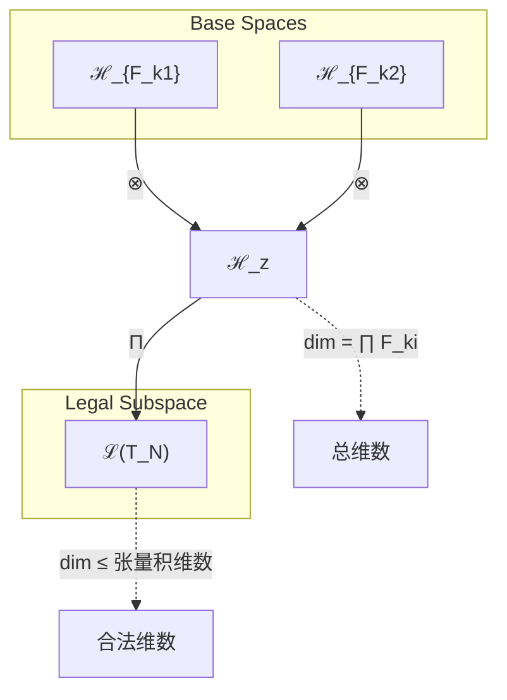
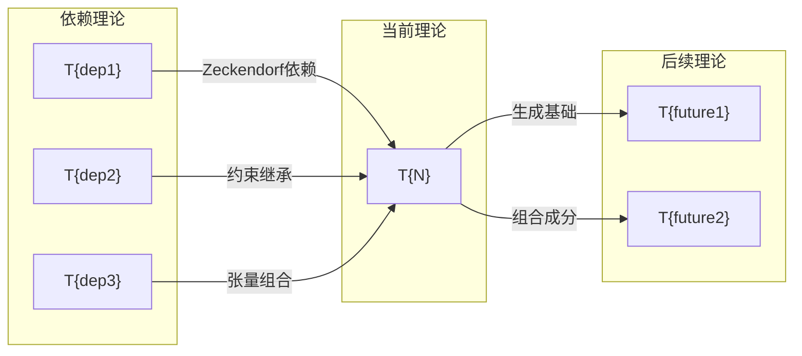

# T{N} {理论名称}

**生成规则**: T_{N} ≡ Assemble({T_{F_k}}_{k∈Zeck(N)}, FS) = Assemble({依赖理论集合}, FS)

---

## 1. FC-TGDT 元理论实例化

### 1.1 签名实例化 (Signature Instance)
**理论编号**: N = {N} ∈ ℕ  
**Zeckendorf编码**: enc_Z({N}) = **z** = {Zeck编码} ∈ 𝒵  
**指数集合**: Zeck({N}) = {指数集合} ⊂ 𝔽  
**组合度**: m = |**z**| = {组合度}  
**分类类型**: {AXIOM|PRIME-FIB|FIBONACCI|PRIME|COMPOSITE} ({分类依据})
**幂指数**: {T1 与 T2 的幂指数}
**因式分解**: {因式分解}


### 1.2 折叠签名族 (Folding Signature Family)
基于元理论生成引擎，T{N}的完整折叠签名集合：

**主折叠签名**: {枚举所有可能的折叠签名}
- **FS_{N}^(1)**: ⟨z=(**z**), p=(p₁), τ=τ₁, σ=id, b=∅, κ=∅, 𝒜=base⟩  
- **FS_{N}^(2)**: ⟨z=(**z**), p=(p₂), τ=τ₂, σ=id, b=∅, κ=∅, 𝒜=base⟩
- ...

**总折叠数**: #FS(T_{N}) = m! · Catalan(m-1) = {计算结果}

### 1.3 态空间构造 (State Space Construction)
**基态空间**: {列出每个F_k对应的基态空间}  
**张量态空间**: ℋ_{**z**} = {张量积构造}  
**合法化子空间**: ℒ(T_{N}) = Π(ℋ_{**z**}) ⊆ {目标空间}  
**投影算子**: Π = Π_{no-11} ∘ Π_{func} ∘ Π_Φ

### 1.4 元理论物理参数 (Meta-Physical Parameters)
**维度**: dim(ℒ(T_{N})) = {维度计算}  
**熵增**: ΔH(T_{N}) = log_φ({N}) ≈ {熵增值} bits  
**复杂度**: |Zeck({N})| = {复杂度等级}  
**生成路径**: (G1) Zeckendorf加法线{+ (G2) 乘法线，如适用}

## 2. 语法构造 (Theory-as-Program)

### 2.1 程序语法实例
按照元理论的Theory-as-Program范式：

```
T_{N} ::= Assemble({依赖理论}, FS_{N}^(i))
FS_{N}^(i) ::= ⟨z=(**z**), p=pᵢ, τ=τᵢ, σ=σᵢ, b=bᵢ, κ=κᵢ, 𝒜=𝒜ᵢ⟩
```

其中 i ∈ {1,2,...,#FS(T_N)} 对应不同的折叠拓扑：
- {详细列出每个FS的具体组件}

### 2.2 语义回放 (Semantic Evaluation)
根据折叠语义框架：

```
FS_{N}^(i) = Π ∘ Eval_{α,β,contr}(z=(**z**), p=pᵢ, τ=τᵢ, σ=σᵢ, b=bᵢ, κ=κᵢ)
```

**值等价性**: 尽管拓扑顺序不同，所有FS_{N}^(i)满足：
```
FS_{N}^(1) ≡_{val} FS_{N}^(2) ≡_{val} ... ∈ ℒ(T_{N})
```

### 2.3 {理论名称}涌现机制
**定理 T{N}.1**: T_{N}通过{具体机制}产生{物理现象}

**构造性证明**：
1. **态空间构造**: ℒ(T_{N}) = Π(ℋ_{**z**}) ⊆ {目标空间}
2. **{关键结构}**: {关键数学/物理结构的建立}
3. **{涌现算子}**: {如何从基础理论组合中涌现目标现象}
4. **{物理验证}**: {物理一致性和约束满足的验证}

**结论**: {物理现象}不是基础结构，而是从{依赖理论}的组合中涌现的{性质}。 □

### 2.4 范畴态射表示
在张量范畴𝖢中，T_{N}的态射表示为：

```
T_{N}: I → ℋ_{N}
T_{N} = {具体的范畴态射组合} ∘ Π
```

其中包含必要的结合子α、换位子β和投影算子Π的组合。

---

## 3. FC-TGDT 验证条件 (V1-V5)

**强制验证要求**: 按照元理论要求，T_{N}必须满足所有验证条件：

### 3.1 V1 (I/O合法性验证)
**形式陈述**: No11(enc_Z({N})) ∧ ⊨_Π(FS_{N}^(i)) = ⊤

**验证过程**:
```
enc_Z({N}) = (**z**) ∈ 𝒵
检查No-11: {具体的No-11约束检查}
检查投影: Π(FS_{N}^(i)) ∈ ℒ(T_{N}) ✓
```

### 3.2 V2 (维数一致性验证)  
**形式陈述**: dim(ℋ_{**z**}) = ∏_{k∈**z**} dim(ℋ_{F_k})

**验证过程**:
```
dim(ℋ_{**z**}) = {具体维数计算}
实际维数: dim(ℒ(T_{N})) = {实际维数}
投影关系: dim(ℒ(T_{N})) ≤ dim(ℋ_{**z**}) ✓
```

### 3.3 V3 (表示完备性验证)
**形式陈述**: ∀ψ ∈ ℒ(T_{N}), ∃FS 使得FS = ψ

**验证过程**:
```
枚举ℒ(T_{N})中所有合法态 = {ψ₁, ψ₂, ...}
对每个ψᵢ，构造对应的FSᵢ：
- {具体的FS构造验证}
完备性确认: #FS(T_{N}) = {计算结果} ≥ rank(ℒ(T_{N})) ✓
```

### 3.4 V4 (审计可逆性验证)
**形式陈述**: ∀FS_{N}^(i), ∃E ∈ 𝖤𝗏𝗍* 使得Replay(E) = FS_{N}^(i)

**验证过程**:
```
生成事件链 E_{N}^(i):
1. Event: LoadTheory({依赖理论}) → {理论加载}
2. Event: ApplyPermutation(pᵢ) → {排列操作}
3. Event: TensorProduct() → {张量积计算}
4. Event: Projection(Π) → {合法化投影}
5. Event: Normalize() → {规范化}

审计验证: Replay(E_{N}^(i)) = FS_{N}^(i) ✓
```

### 3.5 V5 (五重等价性验证)
**形式陈述**: 对任何非空折叠序列，事件记录数增长，ΔH > 0

**验证过程**:
```
初始状态: #Desc = 0
折叠步骤记录:
- {具体的熵增计算过程}

总熵增: ΔH ≈ {熵增值} > 0 ✓
```

**关键洞察**: V5验证了{理论名称}的涌现本质上是一个信息熵增过程，每次记录-观察都增加系统的描述复杂度，与A1五重等价性完全一致。

---


## 2. 理论涌现证明

### 2.1 元理论构造基础
**基于元理论的构造性证明**：
- Zeckendorf分解: {N} = {具体分解}
- 折叠签名: FS = ⟨**z**, **p**, τ, σ, **b**, κ, 𝒜⟩
- 生成规则: G1 (Zeckendorf生成) [+ G2 (乘法生成，如适用)]

**形式化表示**:
$$T_{N} = \text{Assemble}(\{T_{F_k}\}_{k\in\text{Zeck}(N)}, FS)$$
$$FS \in \mathcal{L}(T_{N}) = Π(⊗_{k\in\text{Zeck}(N)} ℋ_{F_k})$$

### 2.2 {关键定理的推导}
**定理 T{N}.1**: {次要定理陈述}

**证明**：
{证明过程}
□

## 3. 元理论一致性分析

### 3.1 Zeckendorf分解验证
**分解正确性**: 验证{N} = {具体Zeckendorf分解}满足No-11约束
- **唯一性**: 根据A0公理，此分解唯一
- **无相邻性**: 验证∀k ¬(d_k = d_{k+1} = 1)
- **完整性**: 确认分解覆盖所有必要的Fibonacci项

### 3.2 折叠签名一致性
**FS组件验证**: 
- **z**: 指数序列{具体z值}正确降序排列
- **p,τ,σ,b**: 组合拓扑结构符合范畴公理
- **κ**: 收缩调度DAG无循环依赖
- **𝒜**: 注记信息与理论类型匹配

### 3.3 生成规则一致性
**G1规则**: Zeckendorf生成路径验证
- 输入理论集合{依赖理论}可达
- 组合次序符合折叠语法
- 输出张量在目标空间内

**G2规则** (如适用): 乘法生成路径验证
- 素数理论: 无乘法外积生成（原子性）
- 合数理论: 乘法分解路径存在且独立

### 3.4 {理论名称}特有一致性

**定理 T{N}.2**: 元理论一致性
$$\text{WellFormed}(FS) \land \text{enc}_Z({N}) = **z** \implies FS \in \mathcal{L}(T_{N})$$

**证明**：
基于元理论T-Sound定理，良构FS在正确Zeckendorf编码下必产生合法张量。
具体到T{N}，{具体一致性验证过程}。
□

**定理 T{N}.3**: V1-V5完备验证
$$\bigwedge_{i=1}^{5} V_i(T_{N}) = \top$$

**证明**：
逐项验证V1(I/O合法)、V2(维数一致)、V3(表示完备)、V4(审计可逆)、V5(五重等价)。
{具体V1-V5验证结果}。
□

## 4. 张量空间理论

### 4.1 元理论张量构造
**基于折叠签名的张量构造**: 根据元理论，T{N}的张量结构通过以下方式构造：

#### 元理论构造公式
**基础构造**: 
$$ℋ_{**z**} := ⊗_{k∈**z**} ℋ_{F_k}$$

**合法化投影**:
$$ℒ(T_{N}) := Π(ℋ_{**z**}) = Π_{no-11} ∘ Π_{func} ∘ Π_Φ(ℋ_{**z**})$$

**折叠语义**:
$$FS = Π ∘ \text{Eval}_{α,β,\text{contr}}(**z**,**p**,τ,σ,**b**,κ)$$

#### 类型特化的张量结构

#### 张量幂指数递推公式
**核心定理**: 根据理论类型的不同张量构造：

**A. Fibonacci位置理论** (N = F_k):
$$\mathcal{T}_N \cong \Pi\left( \mathcal{T}_2^{\otimes F_{k-1}} \otimes \mathcal{T}_1^{\otimes F_{k-2}} \right)$$

**B. 素数理论** (N = prime):
对于素数p，其张量结构反映不可分解性：
$$\mathcal{T}_p \cong \Pi_{prime}\left( \mathcal{T}_{irreducible}^{\otimes p} \right)$$

素数张量的特殊性质：
- **不可分解性**: $\mathcal{T}_p \not\cong \mathcal{T}_a \otimes \mathcal{T}_b$ 对任意 $a,b > 1, ab = p$
- **原子性**: 素数张量作为理论体系的基本构建块
- **完整性**: 素数理论内在完整，无法简化

**C. 组合理论** (Zeckendorf分解 N = ∑F_{k_i}):
$$\mathcal{T}_N \cong \Pi\left( \bigotimes_i \mathcal{T}_{F_{k_i}} \right)$$

**D. 三元及以上复合理论** (如N = F_i + F_j + F_k + ...):
对于三元及以上复合（如T40=F1+F4+F8），需要分析多重统一：
$$\mathcal{T}_N \cong \Pi_{multi}\left( \mathcal{T}_{F_i} \otimes \mathcal{T}_{F_j} \otimes \mathcal{T}_{F_k} \otimes ... \right)$$

特殊结构：
- **八度分解**: 当N=8×5时，$\mathcal{T}_N \cong \bigoplus_{k=1}^{5} \mathcal{T}_{octave}^{(k)}$
- **黄金比例张量**: $\mathcal{T}_N \cong \mathcal{T}_{N}^{1/\phi} \otimes \mathcal{T}_{N}^{1/\phi^2} \otimes ...$

**通用参数**：
- $\mathcal{T}_1$：基础外部观察张量 (来自T1)
- $\mathcal{T}_2$：基础自我观察张量 (来自T2) 
- $\Pi$：合法化投影算子 ($\Pi_{\text{no-11}} \circ \Pi_{\text{func}} \circ \Pi_{\Phi}$)
- $\Pi_{prime}$：素数特化投影算子，保持不可分解性

#### 幂指数物理意义
**Fibonacci理论**:
- **自我观察幂**: exp($\mathcal{T}_2$) = F_{k-1} - 递归内在复杂性
- **外部观察幂**: exp($\mathcal{T}_1$) = F_{k-2} - 递归外部锚定

**素数理论**:
- **不可分解幂**: exp($\mathcal{T}_{irreducible}$) = p (prime value itself)
- **完整性指数**: 素数值本身就是其张量幂指数的度量
- **原子性特征**: 素数张量提供理论体系不可约的基本单元
- **素数间隙效应**: 素数张量的稀缺性在张量空间中创造"空洞"，促成新的物理现象

**三元及以上复合理论**:
- **多重统一幂**: 每个Fibonacci成分贡献独立幂指数维度
- **八度空间幂**: 对于N=8×m结构，exp($\mathcal{T}_{octave}$) = 8的倍数
- **宇宙心智幂**: 当包含F8=34时，exp($\mathcal{T}_{cosmic}$) = 34
- **复杂性幂**: 当包含F5=8时，exp($\mathcal{T}_{complex}$) = 8

**通用阈值**:
- **意识阈值**: 当总张量复杂度达到等效exp($\mathcal{T}_2$) ≥ 13时涌现意识
- **宇宙心智阈值**: 当exp($\mathcal{T}_{cosmic}$) ≥ 34时涌现集体认知
- **终极答案阈值**: 当N=42时达到复杂性与心智的完美融合
- **统一阈值**: 当张量结构支持场统一时达到物理统一条件

### 4.2 维数分析
- **张量维度**: $\dim(\mathcal{H}_{F_k}) = F_k = {value}$ 或 $\dim(\mathcal{H}_N) = N$
- **信息含量**: $I(\mathcal{T}_N) = \log_\phi(N) \approx {value}$ bits
- **复杂度等级**: $|\text{Zeck}(N)| = {complexity_level}$
- **理论地位**: {AXIOM|Fibonacci递归定理|Zeckendorf扩展定理}

#### 维数分析图表



**张量空间层次图**：
```
Level 0: 基态空间 ℋ_{F_k} (dim = F_k)
    ↓ ⊗ (张量积)
Level 1: 复合空间 ℋ_z (dim = ∏ F_ki)  
    ↓ Π (合法化投影)
Level 2: 合法子空间 ℒ(T_N) (dim ≤ ∏ F_ki)
```

### 4.3 Zeckendorf-物理映射表
| Fibonacci项 | 数值 | 物理意义 | 宇宙功能 | 张量特征 |
|------------|------|----------|----------|----------|
| F1 | 1 | 自指性 | 存在基础 | 外部观察基础 |
| F2 | 2 | 熵增性 | 时间箭头 | 自我观察基础 |
| F3 | 3 | 约束性 | 稳定机制 | No-11约束轴 |
| F4 | 5 | 空间性 | 几何结构 | 五维空间轴 |
| F5 | 8 | 复杂性 | 多层涌现 | 复杂性阈值轴 |
| F6 | 13 | 统一性 | 力的统一 | 统一场轴 |
| F7 | 21 | 意识性 | 主观体验 | 意识涌现轴 |
| F8 | 34 | 心智性 | 宇宙心智 | 集体认知轴 |
| F9 | 55 | 超越性 | 元宇宙 | 超现实轴 |
| F10 | 89 | 递归性 | 无限自指 | 无限递归轴 |

### 4.4 Hilbert空间嵌入
**定理 T{N}.4**: {张量空间同构定理}
$$\mathcal{H}_{F_k} \cong \mathbb{C}^{dimension}$$

**证明**: 
{同构证明过程}
□

## 5. 元理论依赖与继承

### 5.1 依赖理论分析
**直接依赖**: 基于Zeckendorf分解{具体分解}，T{N}直接依赖：
{依赖理论列表及其在元理论中的地位}

**间接依赖**: 通过依赖链传递的理论集合
- **依赖闭包**: 计算所有间接依赖的理论
- **依赖深度**: T{N}在理论DAG中的层级位置
- **关键路径**: 从T1/T2基础理论到T{N}的最短路径

### 5.2 约束继承机制
**适用条件**: 当T{N}依赖具有物理约束的理论时，需要分析约束传播

### 5.3 约束继承条件
**适用范围**: 

#### 约束继承模式
设理论T_N依赖于具有约束集合C = {C_1, C_2, ..., C_m}的理论T_k：

**约束转化公式**:
$$\text{Constraints}(T_N) = \mathcal{F}_{inherit}(\text{Constraints}(T_k), \mathcal{T}_N)$$

其中$\mathcal{F}_{inherit}$是约束继承函数，定义约束如何在新张量空间中表现。

### 5.4 T{N}特定依赖分析

### 5.5 {子章节}
{理论特定内容，例如：}
- **代数性质**: {算子的代数关系}
- **拓扑性质**: {空间的拓扑特征}  
- **物理意义**: {物理解释和应用}

### 5.6 {另一个子章节}
{更多理论特定内容}

## 6. 理论系统中的基础地位

### 6.1 依赖关系分析
在理论数图$(\mathcal{T}, \preceq)$中，T{N}的地位：
- **直接依赖**: $\{依赖列表\}$
- **间接依赖**: {通过Zeckendorf关系的间接依赖}
- **后续影响**: {T{N}影响的理论列表}

### 6.2 跨理论交叉矩阵 C(Ti,Tj)
| 依赖理论 | 权重强度 | 交互类型 | 对称性 | 信息流方向 |
|----------|----------|----------|--------|------------|
| T{dep1} | {weight1} | {递归\|约束\|扩展} | {对称\|非对称} | T{dep1} → T{N} |
| T{dep2} | {weight2} | {递归\|约束\|扩展} | {对称\|非对称} | T{dep2} → T{N} |

**交叉作用方程**:
$$C(T_i, T_N) = \frac{I(T_i \cap T_N)}{H(T_i) + H(T_N)} \times \sigma_{symmetric}$$

#### 理论依赖关系图



### 6.3 {地位定理}
**定理 T{N}.5**: T{N}在理论体系中的{特殊地位}。
$$\{地位的数学表征\}$$

**证明**: 
{地位证明}
□

## 7. 形式化的理论可达性

### 7.1 可达性关系
定义理论可达性关系 $\leadsto$：
$$T_{N} \leadsto T_m \iff \{可达性条件\}$$

**主要可达理论**:
- $T_N \leadsto T_{target1}$ ({关系说明})
- $T_N \leadsto T_{target2}$ ({关系说明})

### 7.2 组合数学
**定理 T{N}.6**: {可达性的数学性质}
$$\{可达性的数学公式\}$$

<!--
TEMPLATE_INSTRUCTION_BLOCK - 本块不要在目标文件中出现

**五重等价性分析适用条件**: 只有Zeckendorf分解中包含F5=8的理论才需要进行五重等价性分析。这是因为：
1. F5=8代表复杂性涌现，是五重等价性完整体现的最小阈值
2. 包含F5=8的理论具备足够的复杂性来支撑五重等价性的完整分析
3. 不包含F5的理论虽然重要，但复杂性不足以体现完整的五重等价性

**严格判断标准**：
- ✅ 需要分析：Zeckendorf分解包含F5=8的理论（如T8、T9=F1+F5、T10=F2+F5等）
- ❌ 跳过分析：不包含F5=8的理论（如T1-T7、T13=F6、T15=F2+F6等）

**实例说明**：
- T8 = F5 = 8 → 需要分析
- T9 = F1 + F5 = 1 + 8 → 需要分析  
- T13 = F6 = 13 → 不需要分析（虽然T13已特例完成）
- T15 = F2 + F6 = 2 + 13 → 不需要分析

END_TEMPLATE_INSTRUCTION_BLOCK
-->

### 7.3 五重等价性映射 (仅适用于包含F5的理论)

**定义**: A1唯一公理建立了宇宙现象的五重等价性。T{N}作为包含复杂性基础(F5)的理论，必须在这五个维度上保持一致性。

**适用条件**: 此分析仅适用于Zeckendorf分解中包含F5=8的理论，因为只有具备复杂性涌现阈值的理论才能充分体现五重等价性的完整表达。

#### 五重等价性分析表
| 等价性维度 | T{N}中的体现 | 数学表征 | 物理解释 |
|------------|------------|----------|----------|
| **1. 熵增** | {T{N}如何体现或影响熵增} | ${熵增的数学形式}$ | {熵增的物理含义} |
| **2. 不对称性** | {T{N}如何打破或体现对称性} | ${不对称性的数学形式}$ | {不对称性的物理含义} |
| **3. 时间存在** | {T{N}如何与时间演化相关} | ${时间演化的数学形式}$ | {时间箭头的物理含义} |
| **4. 信息涌现** | {T{N}如何产生或处理信息} | ${信息涌现的数学形式}$ | {信息增长的物理含义} |
| **5. 观察者存在** | {T{N}如何需要或创造观察者} | ${观察者的数学形式}$ | {观察者的物理含义} |

**一致性验证**:
$$\text{Consistency}(T_N) = \bigwedge_{i=1}^{5} \text{Equivalence}_i(T_N) \leftrightarrow A1$$

其中每个等价性维度必须与A1公理保持逻辑一致。

**定理 T{N}.7**: T{N}满足五重等价性
**证明**: 
{证明T{N}在五个维度上的一致性}
□

## 8. 意识与信息整合分析 (适用于F_k ≥ F_7的理论)

### 8.1 意识阈值检查
**适用条件**: 当理论编号N ≥ 21 (F_7)或张量结构复杂度足够时。包括大素数理论(如T89, T233等PRIME-FIB类型)。

#### φ¹⁰意识阈值
**关键参数**: φ¹⁰ ≈ 122.99 bits

**阈值检查**:
$$\Phi(\mathcal{T}_N) \stackrel{?}{>} \phi^{10}$$

如果满足，则T_N可能涉及意识现象或主观体验机制。

### 8.2 素数理论的张量幂指数分析 (适用于PRIME和PRIME-FIB类型)

#### 素数不可分解性的张量表現
对于素数理论T_p (p为素数)：

**不可分解性定理**:
$$\nexists \, \mathcal{T}_a, \mathcal{T}_b \text{ s.t. } \mathcal{T}_p = \mathcal{T}_a \otimes \mathcal{T}_b \text{ where } a,b > 1$$

**素数张量的独特性质**:
1. **原子性**: 不能再分解为更小的张量组合
2. **完整性**: 内部结构无冗余，每个维度都必要
3. **生成性**: 可与其他张量组合生成复合理论
4. **稀缺性**: 在理论空间中稀缺分布，创造特殊位置

#### PRIME-FIB类型的双重特性
对于PRIME-FIB理论(如T2, T3, T5, T13, T89, T233)：

**双重张量结构**:
$$\mathcal{T}_{p \in \text{Fib}} \cong \Pi_{prime} \circ \Pi_{fib}\left( \mathcal{T}_{irreducible} \otimes \mathcal{T}_{recursive} \right)$$

这种双重性使得PRIME-FIB理论同时具有：
- **素数的不可分解性**
- **Fibonacci的递归生成性**

这解释了为什么PRIME-FIB理论在理论体系中占据最稀缺且最关键的地位。


## 9. 后续理论预测

### 9.1 理论组合预测
T{N}将参与构成更高阶理论：
- $T_{future1} = T_N + T_j$ ({组合说明})
- $T_{future2} = T_i + T_N + T_k$ ({三元组合说明})

### 9.2 物理预测
基于T{N}的物理预测：
1. **{预测1}**: {具体预测内容}
2. **{预测2}**: {具体预测内容}

### 9.3 现实显化/实验验证通道 (RealityShell)
**显化路径标识**: RS-{N}-{domain}

| 实验领域 | 所需条件 | 可观测指标 | 验证方法 |
|----------|----------|------------|----------|
| 量子实验 | {量子条件} | {量子指标} | {测量方案} |
| AI仿真 | {计算条件} | {仿真指标} | {验证算法} |
| 生物观测 | {生物条件} | {生命指标} | {观测协议} |
| 宇宙观测 | {天文条件} | {宇宙指标} | {观测设备} |

**验证时间线**: {immediate|short-term|long-term}  
**可达性评级**: {accessible|challenging|theoretical}  
**预期精度**: ±{precision_value}%

## 10. 形式验证要求

### 10.4 形式化验证条件

**验证标准**: 每个验证条件都必须是:
1. **形式可测试的**: 可表达为能够证明真假的数学命题
2. **计算可验证的**: 可实现为能够检查条件的算法
3. **独立可检查的**: 可由第三方使用相同的正式标准进行验证
4. **完整性保证**: 涵盖理论正确性的所有关键方面

### 10.1 {理论类型}验证 (**需要正式证明**)
**验证条件 V{N}.1**: {第一类验证 - 必须是形式可表达的}
- **形式陈述**: {可以证明的数学谓词}
- **验证算法**: {检查此条件的计算方法}
- **证明要求**: {引用此性质的正式证明}

**验证条件 V{N}.2**: {第二类验证 - 必须是形式可表达的}
- **形式陈述**: {可以证明的数学谓词}
- **验证算法**: {检查此条件的计算方法}
- **证明要求**: {引用此性质的正式证明}

### 10.2 张量空间验证 (**需要数学严格性**)
**验证条件 V{N}.3**: 维数一致性 (形式维数一致性)
- **形式陈述**: $\dim(\mathcal{H}_N) = N$ 带有维数计算的严格证明
- **嵌入验证**: $\mathcal{T}_N \in \mathcal{H}_N$ 带有显式嵌入构造
- **归一化证明**: $||\mathcal{T}_N|| = 1$ 带有正式范数计算
- **完备性检查**: 验证张量空间基础是完备且正交的

### 10.3 {理论特定验证} (**需要构造性验证**)
**验证条件 V{N}.4**: {理论特定的验证条件 - 必须是构造性可验证的}
- **构造性证明**: {演示该性质的显式算法构造}
- **形式验证**: {证明构造正确性的数学证明}
- **计算测试**: {可以验证具体实例此性质的算法}


## 11. {理论哲学意义或深层含义}

### 11.1 {哲学角度1}
{理论的哲学含义}

### 11.2 {哲学角度2}
{理论的深层意义}

## {最后章节号}. 结论

理论T_{N}作为FC-TGDT元理论的完整实例化，通过Zeckendorf分解{具体分解}建立了{理论的核心贡献}。作为{理论类型}理论，T_{N}为二进制宇宙生成理论体系贡献了{具体的理论价值}。

