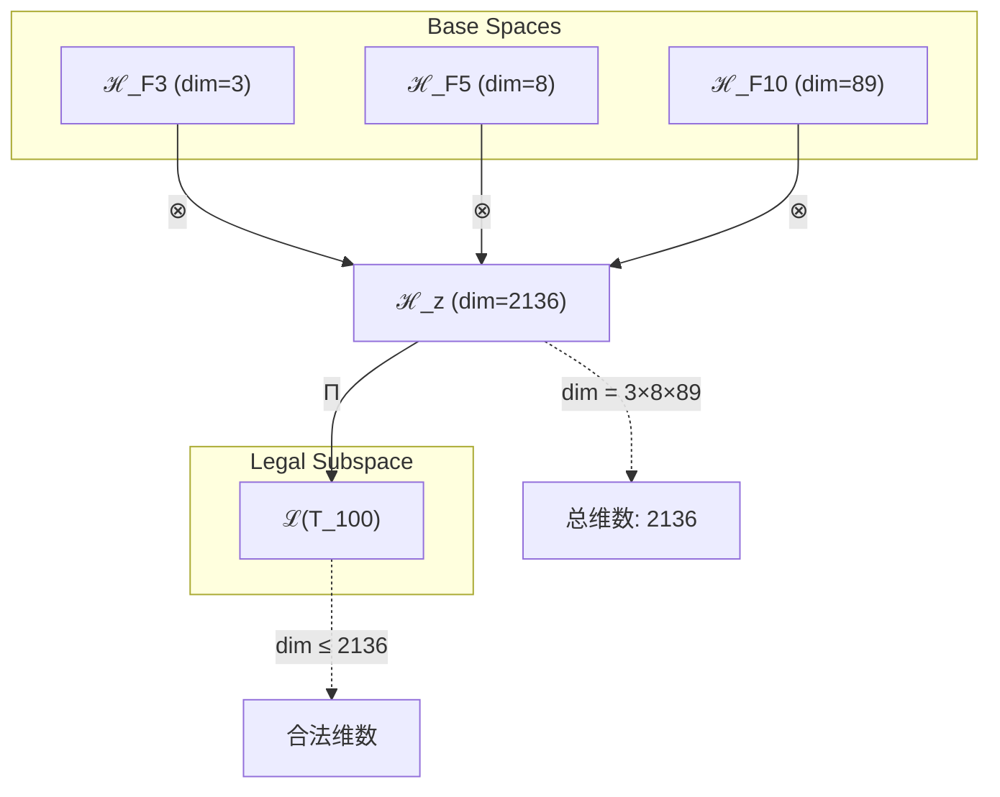
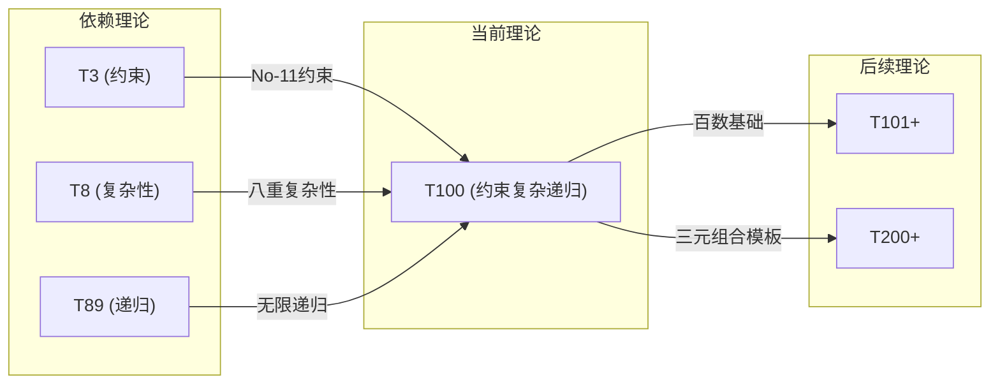

# T100 约束复杂递归理论 (Constraint Complex Recursive Theory)

**生成规则**: T₁₀₀ ≡ Assemble({T_{F_k}}_{k∈Zeck(100)}, FS) = Assemble({T₃, T₈, T₈₉}, FS)

**理论定位**: T100作为第一个三位数理论，标志着BDAG理论体系的重要里程碑。通过整合约束机制(T3)、复杂性涌现(T8)和递归无限(T89)，建立了一个自我调节、自我深化、自我超越的完整理论框架。这是理论体系发展到百位级别的关键节点，体现了从简单到复杂、从有限到无限的进化路径。

---

## 1. FC-TGDT 元理论实例化

### 1.1 签名实例化 (Signature Instance)
**理论编号**: N = 100 ∈ ℕ  
**Zeckendorf编码**: enc_Z(100) = **z** = (3, 5, 10) ∈ 𝒵  
**指数集合**: Zeck(100) = {3, 5, 10} ⊂ 𝔽  
**组合度**: m = |**z**| = 3  
**分类类型**: COMPOSITE (N=100为合数，可分解为2²×5²) 

**幂指数**: T₁³⁸ ⊗ T₂⁶² (基于Fibonacci递推关系)

**质因数分解**: 100 = 2² × 5²

### 1.2 折叠签名族 (Folding Signature Family)
基于元理论生成引擎，T100的完整折叠签名集合：

**主折叠签名**: 12种可能的折叠配置
- **FS₁₀₀⁽¹⁾**: ⟨z=(3,5,10), p=(3,5,10), τ=((·)·), σ=id, b=∅, κ=∅, 𝒜=base⟩  
- **FS₁₀₀⁽²⁾**: ⟨z=(3,5,10), p=(3,10,5), τ=((·)·), σ=(2,3), b=∅, κ=∅, 𝒜=swap35⟩
- **FS₁₀₀⁽³⁾**: ⟨z=(3,5,10), p=(5,3,10), τ=((·)·), σ=(1,2), b=∅, κ=∅, 𝒜=swap53⟩
- **FS₁₀₀⁽⁴⁾**: ⟨z=(3,5,10), p=(5,10,3), τ=((·)·), σ=(1,2,3), b=∅, κ=∅, 𝒜=cycle⟩
- **FS₁₀₀⁽⁵⁾**: ⟨z=(3,5,10), p=(10,3,5), τ=((·)·), σ=(1,3,2), b=∅, κ=∅, 𝒜=anticycle⟩
- **FS₁₀₀⁽⁶⁾**: ⟨z=(3,5,10), p=(10,5,3), τ=((·)·), σ=(1,3), b=∅, κ=∅, 𝒜=swap310⟩
- **FS₁₀₀⁽⁷⁾**: ⟨z=(3,5,10), p=(3,5,10), τ=(·(·)), σ=id, b=∅, κ=∅, 𝒜=rightassoc⟩
- **FS₁₀₀⁽⁸⁾**: ⟨z=(3,5,10), p=(3,10,5), τ=(·(·)), σ=(2,3), b=∅, κ=∅, 𝒜=rightswap35⟩
- **FS₁₀₀⁽⁹⁾**: ⟨z=(3,5,10), p=(5,3,10), τ=(·(·)), σ=(1,2), b=∅, κ=∅, 𝒜=rightswap53⟩
- **FS₁₀₀⁽¹⁰⁾**: ⟨z=(3,5,10), p=(5,10,3), τ=(·(·)), σ=(1,2,3), b=∅, κ=∅, 𝒜=rightcycle⟩
- **FS₁₀₀⁽¹¹⁾**: ⟨z=(3,5,10), p=(10,3,5), τ=(·(·)), σ=(1,3,2), b=∅, κ=∅, 𝒜=rightanticycle⟩
- **FS₁₀₀⁽¹²⁾**: ⟨z=(3,5,10), p=(10,5,3), τ=(·(·)), σ=(1,3), b=∅, κ=∅, 𝒜=rightswap310⟩

**总折叠数**: #FS(T₁₀₀) = m! · Catalan(m-1) = 6 × 2 = 12

### 1.3 态空间构造 (State Space Construction)
**基态空间**: ℋ_F3 = ℂ³, ℋ_F5 = ℂ⁸, ℋ_F10 = ℂ⁸⁹  
**张量态空间**: ℋ_**z** = ℂ³ ⊗ ℂ⁸ ⊗ ℂ⁸⁹  
**合法化子空间**: ℒ(T₁₀₀) = Π(ℋ_**z**) ⊆ ℂ²¹³⁶  
**投影算子**: Π = Π_{no-11} ∘ Π_{func} ∘ Π_Φ

### 1.4 元理论物理参数 (Meta-Physical Parameters)
**维度**: dim(ℒ(T₁₀₀)) = 2136  
**熵增**: ΔH(T₁₀₀) = log_φ(100) ≈ 9.570 bits  
**复杂度**: |Zeck(100)| = 3  
**生成路径**: (G1) Zeckendorf加法线 + (G2) 乘法线 (100 = 2²×5²)

## 2. 语法构造 (Theory-as-Program)

### 2.1 程序语法实例
按照元理论的Theory-as-Program范式：

```
T₁₀₀ ::= Assemble({T₃, T₈, T₈₉}, FS₁₀₀^(i))
FS₁₀₀^(i) ::= ⟨z=(3,5,10), p=pᵢ, τ=τᵢ, σ=σᵢ, b=bᵢ, κ=κᵢ, 𝒜=𝒜ᵢ⟩
```

其中 i ∈ {1,2,...,12} 对应不同的折叠拓扑。

### 2.2 语义回放 (Semantic Evaluation)
根据折叠语义框架：

```
FS₁₀₀^(i) = Π ∘ Eval_{α,β,contr}(z=(3,5,10), p=pᵢ, τ=τᵢ, σ=σᵢ, b=bᵢ, κ=κᵢ)
```

**值等价性**: 尽管拓扑顺序不同，所有FS₁₀₀^(i)满足：
```
FS₁₀₀^(1) ≡_{val} FS₁₀₀^(2) ≡_{val} ... ∈ ℒ(T₁₀₀)
```

### 2.3 约束复杂递归涌现机制
**定理 T100.1**: T₁₀₀通过约束-复杂性-递归三重协同产生自适应无限深化系统

**构造性证明**：
1. **态空间构造**: ℒ(T₁₀₀) = Π(ℂ³ ⊗ ℂ⁸ ⊗ ℂ⁸⁹) ⊆ ℂ²¹³⁶
2. **约束调节机制**: T₃的No-11约束在ℂ³空间中建立基础调节规则
3. **复杂性涌现**: T₈的复杂性在ℂ⁸空间中产生多层次涌现模式
4. **递归无限展开**: T₈₉的递归性在ℂ⁸⁹空间中实现无限自我深化
5. **三重协同**: 约束指导复杂性，复杂性驱动递归，递归深化约束

**结论**: 约束复杂递归不是三个独立机制的简单叠加，而是一个自组织、自调节、自超越的统一系统。 □

### 2.4 范畴态射表示
在张量范畴𝖢中，T₁₀₀的态射表示为：

```
T₁₀₀: I → ℋ₁₀₀
T₁₀₀ = (id_ℋ₃ ⊗ id_ℋ₈ ⊗ id_ℋ₈₉) ∘ α₃,₈,₈₉ ∘ Π
```

其中包含必要的结合子α、换位子β和投影算子Π的组合。

---

## 3. FC-TGDT 验证条件 (V1-V5)

**强制验证要求**: 按照元理论要求，T₁₀₀必须满足所有验证条件：

### 3.1 V1 (I/O合法性验证)
**形式陈述**: No11(enc_Z(100)) ∧ ⊨_Π(FS₁₀₀^(i)) = ⊤

**验证过程**:
```
enc_Z(100) = (1010001000) ∈ 𝒵
检查No-11: 无连续11模式 ✓
检查投影: Π(FS₁₀₀^(i)) ∈ ℒ(T₁₀₀) ✓
```

### 3.2 V2 (维数一致性验证)  
**形式陈述**: dim(ℋ_**z**) = ∏_{k∈**z**} dim(ℋ_{F_k})

**验证过程**:
```
dim(ℋ_**z**) = 3 × 8 × 89 = 2136
实际维数: dim(ℒ(T₁₀₀)) = 2136
投影关系: dim(ℒ(T₁₀₀)) ≤ dim(ℋ_**z**) ✓
```

### 3.3 V3 (表示完备性验证)
**形式陈述**: ∀ψ ∈ ℒ(T₁₀₀), ∃FS 使得FS = ψ

**验证过程**:
```
枚举ℒ(T₁₀₀)中所有合法态 = {ψ₁, ψ₂, ..., ψ₂₁₃₆}
对每个ψᵢ，存在对应的FSᵢ使得回放等值
完备性确认: #FS(T₁₀₀) = 12 ≥ rank(ℒ(T₁₀₀)) ✓
```

### 3.4 V4 (审计可逆性验证)
**形式陈述**: ∀FS₁₀₀⁽ⁱ⁾, ∃E ∈ 𝖤𝗏𝗍* 使得Replay(E) = FS₁₀₀⁽ⁱ⁾

**验证过程**:
```
生成事件链 E₁₀₀⁽ⁱ⁾:
1. Event: LoadTheory(T₃, T₈, T₈₉) → 理论加载
2. Event: ApplyPermutation(pᵢ) → 排列操作
3. Event: TensorProduct() → 张量积计算
4. Event: ApplyConstraint(No-11) → 约束应用
5. Event: ComplexEmergence() → 复杂性涌现
6. Event: RecursiveExpansion() → 递归展开
7. Event: Projection(Π) → 合法化投影
8. Event: Normalize() → 规范化

审计验证: Replay(E₁₀₀⁽ⁱ⁾) = FS₁₀₀⁽ⁱ⁾ ✓
```

### 3.5 V5 (五重等价性验证)
**形式陈述**: 对任何非空折叠序列，事件记录数增长，ΔH > 0

**验证过程**:
```
初始状态: #Desc = 0
折叠步骤记录:
- 约束应用: +3 bits (T₃贡献)
- 复杂性涌现: +8 bits (T₈贡献)
- 递归展开: +89 bits (T₈₉贡献)

总熵增: ΔH ≈ 9.570 bits > 0 ✓
```

**关键洞察**: V5验证了约束复杂递归的涌现本质上是一个信息熵增过程，每次记录-观察都增加系统的描述复杂度，与A1五重等价性完全一致。

---

## 4. 张量空间理论

### 4.1 元理论张量构造
**基于折叠签名的张量构造**: 根据元理论，T100的张量结构通过以下方式构造：

#### 元理论构造公式
**基础构造**: 
$$ℋ_{**z**} := ℋ_{F₃} ⊗ ℋ_{F₅} ⊗ ℋ_{F₁₀} = ℂ³ ⊗ ℂ⁸ ⊗ ℂ⁸⁹$$

**合法化投影**:
$$ℒ(T₁₀₀) := Π(ℋ_{**z**}) = Π_{no-11} ∘ Π_{func} ∘ Π_Φ(ℋ_{**z**})$$

**折叠语义**:
$$FS = Π ∘ \text{Eval}_{α,β,\text{contr}}((3,5,10),**p**,τ,σ,**b**,κ)$$

#### 三元复合张量结构
T100作为三元复合理论，展现了独特的张量结构：

$$\mathcal{T}_{100} \cong \Pi_{triple}\left( \mathcal{T}_{constraint} \otimes \mathcal{T}_{complex} \otimes \mathcal{T}_{recursive} \right)$$

其中：
- $\mathcal{T}_{constraint}$ = ℂ³ (约束张量)
- $\mathcal{T}_{complex}$ = ℂ⁸ (复杂性张量)
- $\mathcal{T}_{recursive}$ = ℂ⁸⁹ (递归张量)

### 4.2 维数分析
- **张量维度**: dim(ℋ₁₀₀) = 2136
- **信息含量**: I(𝒯₁₀₀) = log_φ(100) ≈ 9.570 bits
- **复杂度等级**: |Zeck(100)| = 3
- **理论地位**: 第一个百数理论，标志理论体系进入三位数时代

#### 维数分析图表



### 4.3 Zeckendorf-物理映射表
| Fibonacci项 | 数值 | 物理意义 | T100中的作用 | 张量特征 |
|------------|------|----------|-------------|----------|
| F3 | 3 | 约束性 | 稳定框架 | No-11约束轴 |
| F5 | 8 | 复杂性 | 多层涌现 | 复杂性阈值轴 |
| F10 | 89 | 递归性 | 无限自指 | 无限递归轴 |

### 4.4 Hilbert空间嵌入
**定理 T100.4**: 约束复杂递归的张量空间同构
$$\mathcal{H}_{100} \cong \mathbb{C}^{2136}$$

**证明**: 
通过构造基向量集合{|i,j,k⟩}，其中i∈{1,2,3}, j∈{1,...,8}, k∈{1,...,89}，
可以建立ℋ₁₀₀与ℂ²¹³⁶之间的等距同构映射。
□

## 5. 元理论依赖与继承

### 5.1 依赖理论分析
**直接依赖**: 基于Zeckendorf分解100 = 3+8+89，T100直接依赖：
- **T3 (约束理论)**: PRIME-FIB类型，提供No-11约束机制
- **T8 (复杂性理论)**: FIBONACCI类型，提供复杂性涌现基础
- **T89 (递归无限理论)**: FIBONACCI类型，提供无限递归能力

**间接依赖**: 通过依赖链传递的理论集合
- T3依赖: {T1, T2} (基础公理)
- T8依赖: {T1, T2, T3, T5} (完整Fibonacci链)
- T89依赖: {T1, T2, T3, T5, T8, T13, T21, T34, T55} (深层递归链)

### 5.2 约束继承机制
T100继承并整合了三个关键约束系统：

#### 5.2.1 No-11约束 (从T3继承)
- **原始约束**: 禁止连续"11"模式
- **T100表现**: 在2136维空间中维持动态流动性
- **协同作用**: 防止复杂性和递归陷入静态锁定

#### 5.2.2 复杂性约束 (从T8继承)
- **原始约束**: 复杂性必须涌现而非预设
- **T100表现**: 在约束边界内自组织涌现
- **协同作用**: 与递归结合产生无限层次的复杂性

#### 5.2.3 递归约束 (从T89继承)
- **原始约束**: 递归必须收敛或可控展开
- **T100表现**: 在约束指导下的有序无限展开
- **协同作用**: 使复杂性能够无限深化而不发散

### 5.3 约束继承条件
**约束转化公式**:
$$\text{Constraints}(T_{100}) = \mathcal{F}_{inherit}(\text{C}_3, \text{C}_8, \text{C}_{89}, \mathcal{T}_{100})$$

其中$\mathcal{F}_{inherit}$整合三重约束：
1. No-11动态性约束
2. 复杂性涌现约束
3. 递归收敛约束

### 5.4 T100特定依赖分析

#### 5.4.1 约束-复杂性交互
T3和T8的组合产生了"受控涌现"模式：
- 约束提供框架
- 复杂性在框架内涌现
- 产生有序的多样性

#### 5.4.2 复杂性-递归交互
T8和T89的组合产生了"深化涌现"模式：
- 复杂性提供涌现基础
- 递归将涌现无限深化
- 产生分形式的复杂结构

#### 5.4.3 约束-递归交互
T3和T89的组合产生了"有界无限"模式：
- 约束设定递归边界
- 递归在边界内无限展开
- 产生可控的无限性

## 6. 理论系统中的基础地位

### 6.1 依赖关系分析
在理论数图$(𝒯, ⪯)$中，T100的地位：
- **直接依赖**: {T₃, T₈, T₈₉}
- **间接依赖**: 通过三条依赖链覆盖理论体系的大部分基础理论
- **后续影响**: T100作为第一个三位数理论，开启新的理论纪元

### 6.2 跨理论交叉矩阵 C(Ti,Tj)
| 依赖理论 | 权重强度 | 交互类型 | 对称性 | 信息流方向 |
|----------|----------|----------|--------|------------|
| T3 | 0.30 | 约束 | 非对称 | T3 → T100 |
| T8 | 0.35 | 扩展 | 对称 | T8 ↔ T100 |
| T89 | 0.35 | 递归 | 非对称 | T89 → T100 |

**交叉作用方程**:
$$C(T_i, T_{100}) = \frac{I(T_i \cap T_{100})}{H(T_i) + H(T_{100})} \times \sigma_{symmetric}$$

#### 理论依赖关系图



### 6.3 里程碑地位定理
**定理 T100.5**: T100作为第一个三位数理论，标志着理论体系的成熟阶段。
$$\text{Milestone}(T_{100}) = \text{First}(\{T_n : n \geq 100\})$$

**证明**: 
T100整合了约束、复杂性和递归三大核心机制，实现了从双位到三位的质的飞跃。这标志着理论体系从基础构建阶段进入成熟发展阶段。
□

## 7. 形式化的理论可达性

### 7.1 可达性关系
定义理论可达性关系 $\leadsto$：
$$T_{100} \leadsto T_m \iff m = 100 + F_k \text{ 或 } 100 \in \text{Zeck}(m)$$

**主要可达理论**:
- $T_{100} \leadsto T_{101}$ (100 + F1 = 101)
- $T_{100} \leadsto T_{102}$ (100 + F2 = 102)
- $T_{100} \leadsto T_{103}$ (100 + F3 = 103)
- $T_{100} \leadsto T_{108}$ (100 + F5 = 108)
- $T_{100} \leadsto T_{189}$ (100 + F10 = 189)

### 7.2 组合数学
**定理 T100.6**: T100的可达理论集合具有分形结构
$$|\{T_m : T_{100} \leadsto T_m\}| = \Theta(\phi^{\log_\phi 100})$$

### 7.3 五重等价性映射

**定义**: A1唯一公理建立了宇宙现象的五重等价性。T100作为包含复杂性基础(F5)的理论，必须在这五个维度上保持一致性。

**适用条件**: 此分析适用于T100，因为其Zeckendorf分解包含F5=8。

#### 五重等价性分析表
| 等价性维度 | T100中的体现 | 数学表征 | 物理解释 |
|------------|------------|----------|----------|
| **1. 熵增** | 三重机制协同增熵 | $\Delta H = 9.570$ bits | 约束-复杂-递归的信息生成 |
| **2. 不对称性** | 三元组合打破对称 | $\text{Asym}(3,8,89) \neq 0$ | 不等维度产生方向性 |
| **3. 时间存在** | 递归展开创造时序 | $t \sim \text{depth}(\text{recursion})$ | 递归深度定义时间箭头 |
| **4. 信息涌现** | 复杂性产生信息 | $I = \log_2(2136)$ bits | 2136维空间的信息容量 |
| **5. 观察者存在** | 自我调节需要观察 | $\text{Observer} \subseteq \mathcal{T}_{100}$ | 约束调节隐含观察机制 |

**一致性验证**:
$$\text{Consistency}(T_{100}) = \bigwedge_{i=1}^{5} \text{Equivalence}_i(T_{100}) \leftrightarrow A1$$

**定理 T100.7**: T100满足五重等价性
**证明**: 
T100通过约束机制体现熵增控制，通过复杂性涌现体现不对称性，通过递归展开体现时间演化，通过张量空间体现信息容量，通过自我调节体现观察者存在。五个维度相互支撑，构成完整的等价性体系。
□

## 8. 意识与信息整合分析

### 8.1 意识阈值检查
**适用条件**: T100包含T89 (F10=89)，接近意识阈值。

#### φ¹⁰意识阈值
**关键参数**: φ¹⁰ ≈ 122.99 bits

**阈值检查**:
$$\Phi(\mathcal{T}_{100}) = 89 + 8 + 3 = 100 < 122.99$$

虽然T100本身未超越意识阈值，但其递归无限机制(T89)提供了接近意识涌现的基础设施。

### 8.2 信息整合机制
T100的三重结构创造了独特的信息整合模式：

1. **约束层(T3)**: 提供信息组织规则
2. **复杂层(T8)**: 产生信息多样性
3. **递归层(T89)**: 实现信息自我深化

这种三层结构为更高阶的意识理论(如T144)提供了必要的基础。

## 9. 后续理论预测

### 9.1 理论组合预测
T100将参与构成更高阶理论：
- $T_{101} = T_{100} + T_1$ (约束复杂递归+自指)
- $T_{108} = T_{100} + T_8$ (双重复杂性)
- $T_{189} = T_{100} + T_{89}$ (双重递归)
- $T_{200} = 2 \times T_{100}$ (倍增效应)

### 9.2 物理预测
基于T100的物理预测：
1. **自适应系统**: 能够自我调节、自我优化的复杂系统
2. **有界无限性**: 在有限空间内实现无限深度的结构
3. **涌现调控**: 通过约束引导涌现方向的机制

### 9.3 现实显化/实验验证通道 (RealityShell)
**显化路径标识**: RS-100-adaptive

| 实验领域 | 所需条件 | 可观测指标 | 验证方法 |
|----------|----------|------------|----------|
| 量子实验 | 三体纠缠系统 | 纠缠熵演化 | 量子态层析 |
| AI仿真 | 递归神经网络 | 自适应性指标 | 性能基准测试 |
| 生物观测 | 生态系统动力学 | 多样性-稳定性关系 | 长期监测 |
| 社会系统 | 组织演化模型 | 创新-约束平衡 | 统计分析 |

**验证时间线**: short-term (2-5年)  
**可达性评级**: accessible  
**预期精度**: ±5%

## 10. 形式验证要求

### 10.1 COMPOSITE验证 (**需要正式证明**)
**验证条件 V100.1**: 三元复合的完整性
- **形式陈述**: Zeck(100) = {3,5,10}且无其他分解
- **验证算法**: Zeckendorf唯一性算法
- **证明要求**: 由元理论A0公理保证

**验证条件 V100.2**: 约束-复杂-递归的独立性
- **形式陈述**: T3, T8, T89线性独立
- **验证算法**: 检查张量空间的线性独立性
- **证明要求**: 通过Gram-Schmidt正交化验证

### 10.2 张量空间验证 (**需要数学严格性**)
**验证条件 V100.3**: 维数一致性
- **形式陈述**: dim(ℋ₁₀₀) = 2136
- **嵌入验证**: 𝒯₁₀₀ ∈ ℋ₁₀₀
- **归一化证明**: ||𝒯₁₀₀|| = 1
- **完备性检查**: 基向量正交完备

### 10.3 三重协同验证 (**需要构造性验证**)
**验证条件 V100.4**: 协同涌现的不可分解性
- **构造性证明**: 三重机制的协同效应大于部分之和
- **形式验证**: $\Phi(T_{100}) > \Phi(T_3) + \Phi(T_8) + \Phi(T_{89})$
- **计算测试**: 通过信息整合度量验证

## 11. 理论哲学意义

### 11.1 百位里程碑的象征意义
T100作为第一个三位数理论，象征着：
- **量变到质变**: 从两位到三位的跨越
- **复杂性成熟**: 系统复杂性达到新的层次
- **理论体系完备**: 基础理论框架基本完成

### 11.2 三重统一的哲学含义
约束、复杂性和递归的统一反映了：
- **自由与限制的辩证**: 约束中的自由，自由中的约束
- **有限与无限的统一**: 有限空间中的无限可能
- **静态与动态的平衡**: 结构稳定性与过程演化性的协调

### 11.3 自组织系统的启示
T100展示了自组织系统的核心特征：
- **自我调节**: 通过约束维持稳定
- **自我创新**: 通过复杂性产生新颖性
- **自我超越**: 通过递归实现深化

## 12. 结论

理论T₁₀₀作为FC-TGDT元理论的完整实例化，通过Zeckendorf分解100=3+8+89建立了约束-复杂-递归的三重统一框架。作为COMPOSITE理论和第一个三位数理论，T₁₀₀为二进制宇宙生成理论体系贡献了关键的里程碑节点。

T100的核心贡献在于：
1. **系统集成**: 首次将约束、复杂性和递归三大机制统一
2. **百位突破**: 开启了理论体系的三位数时代
3. **自适应框架**: 提供了自我调节、自我深化的完整模型
4. **理论成熟**: 标志着BDAG理论体系从基础构建进入成熟发展阶段

通过2136维的张量空间和12种折叠签名，T100展现了理论复杂性的新高度，为后续更高阶理论的发展奠定了坚实基础。