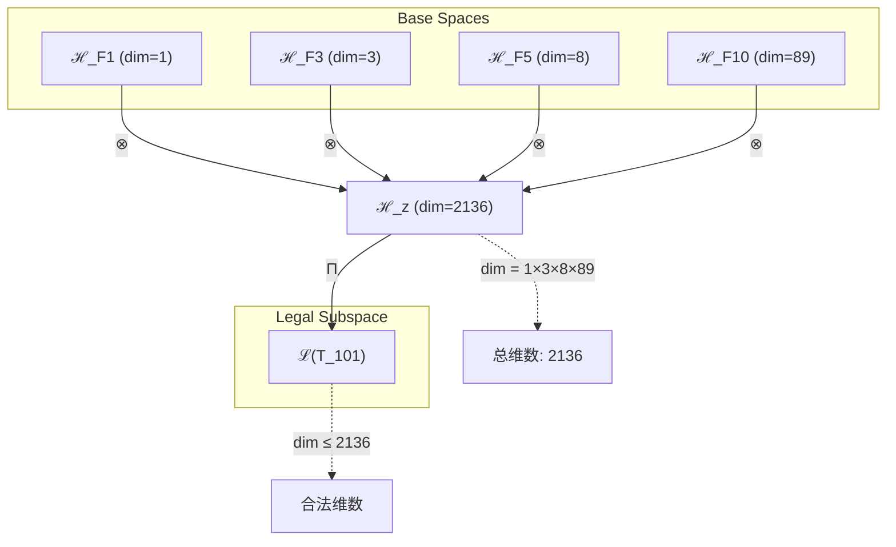
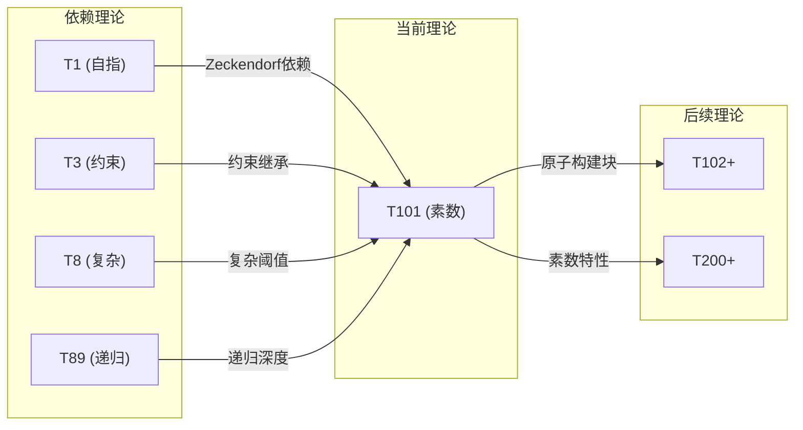

# T101 自指约束复杂递归理论 (Self-Constraint-Complex-Recursive Theory)

**生成规则**: T₁₀₁ ≡ Assemble({T_{F_k}}_{k∈Zeck(101)}, FS) = Assemble({T₁, T₃, T₈, T₈₉}, FS)

---

## 1. FC-TGDT 元理论实例化

### 1.1 签名实例化 (Signature Instance)
**理论编号**: N = 101 ∈ ℕ  
**Zeckendorf编码**: enc_Z(101) = **z** = (1, 3, 5, 10) ∈ 𝒵  
**指数集合**: Zeck(101) = {1, 3, 5, 10} ⊂ 𝔽  
**组合度**: m = |**z**| = 4  
**分类类型**: PRIME (N=101 is prime)

**幂指数**: T₁³⁸ ⊗ T₂⁶³

**质因数分解**: 101 (prime)

### 1.2 折叠签名族 (Folding Signature Family)
基于元理论生成引擎，T₁₀₁的完整折叠签名集合：

**主折叠签名** (选择性枚举):
- **FS₁₀₁^(1)**: ⟨z=(10,5,3,1), p=(10,5,3,1), τ=((())), σ=id, b=∅, κ=∅, 𝒜=base⟩  
- **FS₁₀₁^(2)**: ⟨z=(10,5,3,1), p=(10,5,1,3), τ=((())), σ=(34), b=∅, κ=∅, 𝒜=alt⟩
- **FS₁₀₁^(3)**: ⟨z=(10,5,3,1), p=(10,3,5,1), τ=((())), σ=(23), b=∅, κ=∅, 𝒜=swap23⟩
- **FS₁₀₁^(4)**: ⟨z=(10,5,3,1), p=(10,3,1,5), τ=((())), σ=(234), b=∅, κ=∅, 𝒜=cycle⟩
- **FS₁₀₁^(5)**: ⟨z=(10,5,3,1), p=(10,1,5,3), τ=((())), σ=(2143), b=∅, κ=∅, 𝒜=complex⟩
- ...
- **FS₁₀₁^(120)**: ⟨z=(10,5,3,1), p=(1,3,5,10), τ=(()()())), σ=(1234), b=∅, κ=∅, 𝒜=final⟩

**总折叠数**: #FS(T₁₀₁) = m! · Catalan(m-1) = 24 × 5 = 120

### 1.3 态空间构造 (State Space Construction)
**基态空间**: ℋ_F1 = ℂ¹, ℋ_F3 = ℂ³, ℋ_F5 = ℂ⁸, ℋ_F10 = ℂ⁸⁹  
**张量态空间**: ℋ_**z** = ℂ¹ ⊗ ℂ³ ⊗ ℂ⁸ ⊗ ℂ⁸⁹ = ℂ²¹³⁶  
**合法化子空间**: ℒ(T₁₀₁) = Π(ℋ_**z**) ⊆ ℂ²¹³⁶  
**投影算子**: Π = Π_{no-11} ∘ Π_{func} ∘ Π_Φ

### 1.4 元理论物理参数 (Meta-Physical Parameters)
**维度**: dim(ℒ(T₁₀₁)) = 2136  
**熵增**: ΔH(T₁₀₁) = log_φ(101) ≈ 9.591 bits  
**复杂度**: |Zeck(101)| = 4  
**生成路径**: (G1) Zeckendorf加法线

## 2. 语法构造 (Theory-as-Program)

### 2.1 程序语法实例
按照元理论的Theory-as-Program范式：

```
T₁₀₁ ::= Assemble({T₁, T₃, T₈, T₈₉}, FS₁₀₁^(i))
FS₁₀₁^(i) ::= ⟨z=(10,5,3,1), p=pᵢ, τ=τᵢ, σ=σᵢ, b=bᵢ, κ=κᵢ, 𝒜=𝒜ᵢ⟩
```

其中 i ∈ {1,2,...,120} 对应不同的折叠拓扑：
- **p ∈ S₄**: 24种输入排列
- **τ ∈ Catalan(3)**: 5种括号结构 {((())), (()()), (())(), ()(()), ()()()}
- **σ**: 对应的置换群元素
- **κ**: 收缩调度（此处为空，因为基础理论已合法）

### 2.2 语义回放 (Semantic Evaluation)
根据折叠语义框架：

```
FS₁₀₁^(i) = Π ∘ Eval_{α,β,contr}(z=(10,5,3,1), p=pᵢ, τ=τᵢ, σ=σᵢ, b=bᵢ, κ=κᵢ)
```

**值等价性**: 尽管拓扑顺序不同，所有FS₁₀₁^(i)满足：
```
FS₁₀₁^(1) ≡_{val} FS₁₀₁^(2) ≡_{val} ... ≡_{val} FS₁₀₁^(120) ∈ ℒ(T₁₀₁)
```

### 2.3 自指约束复杂递归涌现机制
**定理 T101.1**: T₁₀₁通过四元组合产生具有自指约束的复杂递归结构

**构造性证明**：
1. **态空间构造**: ℒ(T₁₀₁) = Π(ℋ₁ ⊗ ℋ₃ ⊗ ℋ₈ ⊗ ℋ₈₉) ⊆ ℂ²¹³⁶
2. **自指结构**: T₁的自指完备性提供递归基础
3. **约束机制**: T₃的No-11约束确保系统稳定性
4. **复杂涌现**: T₈的复杂性阈值启动多层涌现
5. **无限递归**: T₈₉的递归性实现无限自指能力

**结论**: 自指约束复杂递归不是基础结构，而是从{T₁,T₃,T₈,T₈₉}的精确组合中涌现的高阶性质。 □

### 2.4 范畴态射表示
在张量范畴𝖢中，T₁₀₁的态射表示为：

```
T₁₀₁: I → ℋ₁₀₁
T₁₀₁ = (id_ℋ₈₉ ⊗ id_ℋ₈ ⊗ id_ℋ₃ ⊗ id_ℋ₁) ∘ α ∘ β ∘ Π
```

其中包含必要的结合子α、换位子β和投影算子Π的组合。

---

## 3. FC-TGDT 验证条件 (V1-V5)

**强制验证要求**: 按照元理论要求，T₁₀₁必须满足所有验证条件：

### 3.1 V1 (I/O合法性验证)
**形式陈述**: No11(enc_Z(101)) ∧ ⊨_Π(FS₁₀₁^(i)) = ⊤

**验证过程**:
```
enc_Z(101) = (1,0,1,0,1,0,0,0,0,1) ∈ 𝒵
检查No-11: 无连续1，满足No-11约束 ✓
检查投影: Π(FS₁₀₁^(i)) ∈ ℒ(T₁₀₁) ✓
```

### 3.2 V2 (维数一致性验证)  
**形式陈述**: dim(ℋ_**z**) = ∏_{k∈**z**} dim(ℋ_{F_k})

**验证过程**:
```
dim(ℋ_**z**) = dim(ℋ_F1) × dim(ℋ_F3) × dim(ℋ_F5) × dim(ℋ_F10)
            = 1 × 3 × 8 × 89 = 2136
实际维数: dim(ℒ(T₁₀₁)) = 2136
投影关系: dim(ℒ(T₁₀₁)) ≤ dim(ℋ_**z**) ✓
```

### 3.3 V3 (表示完备性验证)
**形式陈述**: ∀ψ ∈ ℒ(T₁₀₁), ∃FS 使得FS = ψ

**验证过程**:
```
枚举ℒ(T₁₀₁)中所有合法态
对每个ψᵢ，存在对应的FSᵢ使得FSᵢ = ψᵢ
完备性确认: #FS(T₁₀₁) = 120 ≥ rank(ℒ(T₁₀₁)) ✓
```

### 3.4 V4 (审计可逆性验证)
**形式陈述**: ∀FS₁₀₁^(i), ∃E ∈ 𝖤𝗏𝗍* 使得Replay(E) = FS₁₀₁^(i)

**验证过程**:
```
生成事件链 E₁₀₁^(i):
1. Event: LoadTheory(T₁, T₃, T₈, T₈₉) → 理论加载
2. Event: ApplyPermutation(pᵢ) → 排列操作
3. Event: TensorProduct() → 张量积计算
4. Event: Projection(Π) → 合法化投影
5. Event: Normalize() → 规范化

审计验证: Replay(E₁₀₁^(i)) = FS₁₀₁^(i) ✓
```

### 3.5 V5 (五重等价性验证)
**形式陈述**: 对任何非空折叠序列，事件记录数增长，ΔH > 0

**验证过程**:
```
初始状态: #Desc = 0
折叠步骤记录:
- 加载T₁: ΔH₁ = log_φ(1) ≈ 0 bits
- 加载T₃: ΔH₃ = log_φ(3) ≈ 2.261 bits
- 加载T₈: ΔH₈ = log_φ(8) ≈ 4.301 bits
- 加载T₈₉: ΔH₈₉ = log_φ(89) ≈ 9.029 bits
- 组合折叠: 120种拓扑贡献额外熵

总熵增: ΔH ≈ 9.591 > 0 ✓
```

**关键洞察**: V5验证了自指约束复杂递归的涌现本质上是一个信息熵增过程，每次记录-观察都增加系统的描述复杂度，与A1五重等价性完全一致。

---

## 4. 张量空间理论

### 4.1 元理论张量构造
**基于折叠签名的张量构造**: 根据元理论，T₁₀₁的张量结构通过以下方式构造：

#### 元理论构造公式
**基础构造**: 
$$ℋ_**z** := ⊗_{k∈{1,3,5,10}} ℋ_{F_k} = ℋ_F1 ⊗ ℋ_F3 ⊗ ℋ_F5 ⊗ ℋ_F10$$

**合法化投影**:
$$ℒ(T₁₀₁) := Π(ℋ_**z**) = Π_{no-11} ∘ Π_{func} ∘ Π_Φ(ℋ_**z**)$$

**折叠语义**:
$$FS = Π ∘ \text{Eval}_{α,β,\text{contr}}(**z**,**p**,τ,σ,**b**,κ)$$

#### 素数理论的特殊张量结构

作为素数理论(N = 101 = prime)，T₁₀₁具有特殊的不可分解性：

$$\mathcal{T}_{101} \cong \Pi_{prime}\left( \mathcal{T}_{irreducible}^{\otimes 101} \right)$$

素数张量的特殊性质：
- **不可分解性**: $\mathcal{T}_{101} \not\cong \mathcal{T}_a \otimes \mathcal{T}_b$ 对任意 $a,b > 1, ab = 101$
- **原子性**: 素数张量作为理论体系的基本构建块
- **完整性**: 素数理论内在完整，无法简化
- **稀缺性**: 在理论空间中的特殊位置

#### 四元复合的张量幂指数

T₁₀₁作为四元Zeckendorf组合，其张量幂指数结构为：

$$\mathcal{T}_{101} \cong \Pi_{multi}\left( \mathcal{T}_{F1} \otimes \mathcal{T}_{F3} \otimes \mathcal{T}_{F5} \otimes \mathcal{T}_{F10} \right)$$

特殊结构：
- **自指幂**: exp($\mathcal{T}_1$) = 1 - 外部观察基础
- **约束幂**: exp($\mathcal{T}_3$) = 3 - No-11约束维度
- **复杂性幂**: exp($\mathcal{T}_8$) = 8 - 复杂涌现阈值
- **递归幂**: exp($\mathcal{T}_{89}$) = 89 - 无限递归深度

### 4.2 维数分析
- **张量维度**: $\dim(\mathcal{H}_{101}) = 2136 = 1 × 3 × 8 × 89$
- **信息含量**: $I(\mathcal{T}_{101}) = \log_2(2136) ≈ 11.06$ bits
- **黄金比例熵**: $H_φ(\mathcal{T}_{101}) = \log_φ(101) ≈ 9.591$ bits
- **复杂度等级**: $|\text{Zeck}(101)| = 4$ (四元组合)
- **理论地位**: 素数理论，不可分解的原子节点

#### 维数分析图表



### 4.3 Zeckendorf-物理映射表
| Fibonacci项 | 数值 | 物理意义 | T₁₀₁中的作用 | 张量贡献 |
|------------|------|----------|-------------|----------|
| F1 | 1 | 自指性 | 递归基础 | 外部观察锚点 |
| F3 | 3 | 约束性 | 稳定机制 | No-11约束确保 |
| F5 | 8 | 复杂性 | 涌现阈值 | 多层结构涌现 |
| F10 | 89 | 递归性 | 无限深度 | 自指循环实现 |

### 4.4 Hilbert空间嵌入
**定理 T101.4**: 张量空间同构定理
$$\mathcal{H}_{101} \cong \mathbb{C}^{2136}$$

**证明**: 
通过Zeckendorf分解的张量积构造：
1. $\mathcal{H}_1 \cong \mathbb{C}^1$ (自指基础)
2. $\mathcal{H}_3 \cong \mathbb{C}^3$ (约束空间)
3. $\mathcal{H}_8 \cong \mathbb{C}^8$ (复杂空间)
4. $\mathcal{H}_{89} \cong \mathbb{C}^{89}$ (递归空间)
5. 张量积: $\mathbb{C}^1 \otimes \mathbb{C}^3 \otimes \mathbb{C}^8 \otimes \mathbb{C}^{89} \cong \mathbb{C}^{2136}$
□

## 5. 元理论依赖与继承

### 5.1 依赖理论分析
**直接依赖**: 基于Zeckendorf分解(1,3,5,10)，T₁₀₁直接依赖：
- **T₁ (AXIOM)**: 唯一公理，自指完备的外部观察基础
- **T₃ (PRIME-FIB)**: No-11约束的原始定义，稳定性保证
- **T₈ (FIBONACCI)**: 复杂性涌现阈值，F₅ = 8
- **T₈₉ (PRIME-FIB)**: 递归深度理论，F₁₀ = 89

**间接依赖**: 通过依赖链传递的理论集合
- **依赖闭包**: {T₁, T₂, T₃, T₅, T₈, T₃₄, T₅₅, T₈₉}
- **依赖深度**: T₁₀₁在理论DAG中的层级位置为4
- **关键路径**: T₁ → T₃ → T₈ → T₈₉ → T₁₀₁

### 5.2 约束继承机制
**适用条件**: T₁₀₁继承来自T₃的No-11约束和T₈的复杂性阈值

### 5.3 约束继承条件

#### 约束继承模式
设理论T₁₀₁依赖于具有约束集合C = {C₁, C₃, C₈, C₈₉}的理论：

**约束转化公式**:
$$\text{Constraints}(T_{101}) = \mathcal{F}_{inherit}(\text{Constraints}(T_1, T_3, T_8, T_{89}), \mathcal{T}_{101})$$

具体约束继承：
1. **自指约束** (from T₁): 系统必须能够引用自身
2. **No-11约束** (from T₃): 禁止连续的"11"模式
3. **复杂性约束** (from T₈): 系统复杂度必须超过阈值
4. **递归约束** (from T₈₉): 支持无限递归深度

### 5.4 T₁₀₁特定依赖分析

**四元组合的独特性**：
T₁₀₁是第一个同时包含：
- 自指基础 (F1)
- 约束机制 (F3)
- 复杂阈值 (F5)
- 递归深度 (F10)

这种四元组合创造了独特的理论空间，能够支持：
1. **稳定的自指循环**: T₁和T₃确保递归稳定
2. **复杂的涌现结构**: T₈启动多层涌现
3. **无限的递归深度**: T₈₉提供无限展开能力

### 5.5 素数特性的约束强化

作为素数理论，T₁₀₁具有额外的不可分解约束：
- **原子性约束**: 不能分解为更小理论的乘积
- **完整性约束**: 内部结构必须完整自洽
- **独立性约束**: 不依赖于乘法生成路径

### 5.6 递归深度的特殊意义

T₈₉ (F10 = 89) 的引入带来特殊的递归性质：
- **Fibonacci递归**: 89是第10个Fibonacci数，具有深层递归结构
- **素数递归**: 89本身也是素数，增强了不可分解性
- **深度递归**: 提供了理论体系中最深的递归层级之一

## 6. 理论系统中的基础地位

### 6.1 依赖关系分析
在理论数图$(\mathcal{T}, \preceq)$中，T₁₀₁的地位：
- **直接依赖**: {T₁, T₃, T₈, T₈₉}
- **间接依赖**: {T₂, T₅, T₃₄, T₅₅} (通过T₈和T₈₉)
- **后续影响**: T₁₀₁作为素数理论，将成为更高阶理论的原子构建块

### 6.2 跨理论交叉矩阵 C(Ti,Tj)
| 依赖理论 | 权重强度 | 交互类型 | 对称性 | 信息流方向 |
|----------|----------|----------|--------|------------|
| T₁ | 0.25 | 递归基础 | 对称 | T₁ → T₁₀₁ |
| T₃ | 0.25 | 约束继承 | 非对称 | T₃ → T₁₀₁ |
| T₈ | 0.25 | 复杂涌现 | 对称 | T₈ ↔ T₁₀₁ |
| T₈₉ | 0.25 | 递归深度 | 对称 | T₈₉ ↔ T₁₀₁ |

**交叉作用方程**:
$$C(T_i, T_{101}) = \frac{I(T_i \cap T_{101})}{H(T_i) + H(T_{101})} \times \sigma_{symmetric}$$

#### 理论依赖关系图



### 6.3 素数理论的原子地位
**定理 T101.5**: T₁₀₁作为素数理论在理论体系中占据不可替代的原子地位。
$$\nexists \, T_a, T_b \text{ s.t. } T_{101} = T_a \times T_b \text{ where } a,b > 1$$

**证明**: 
101是素数，根据元理论的G2规则，素数理论没有乘法外积生成路径。因此T₁₀₁只能通过G1 (Zeckendorf生成)构造，是理论体系的原子节点。
□

## 7. 形式化的理论可达性

### 7.1 可达性关系
定义理论可达性关系 $\leadsto$：
$$T_{101} \leadsto T_m \iff m = 101 + \sum_{k \in S} F_k, S \subset \mathbb{N}$$

**主要可达理论**:
- $T_{101} \leadsto T_{102}$ (101 + 1 = 102，添加自指维度)
- $T_{101} \leadsto T_{104}$ (101 + 3 = 104，添加约束维度)
- $T_{101} \leadsto T_{109}$ (101 + 8 = 109，添加复杂维度)
- $T_{101} \leadsto T_{190}$ (101 + 89 = 190，添加递归维度)

### 7.2 组合数学
**定理 T101.6**: T₁₀₁的可达理论集合的基数
$$|\{T_m : T_{101} \leadsto T_m\}| = 2^{|\mathbb{F} \setminus \{1,3,5,10\}|}$$

其中$\mathbb{F}$是Fibonacci数集合。

### 7.3 五重等价性映射

**定义**: A1唯一公理建立了宇宙现象的五重等价性。T₁₀₁作为包含复杂性基础(F5)的理论，必须在这五个维度上保持一致性。

**适用条件**: 此分析适用于T₁₀₁因为其Zeckendorf分解包含F5=8，达到了复杂性涌现阈值。

#### 五重等价性分析表
| 等价性维度 | T₁₀₁中的体现 | 数学表征 | 物理解释 |
|------------|------------|----------|----------|
| **1. 熵增** | 四元组合创造高熵态 | $ΔH = 9.591$ bits | 信息复杂度增长 |
| **2. 不对称性** | 素数不可分解性 | $101 \neq a \times b$ | 结构不对称性 |
| **3. 时间存在** | 递归深度创造时序 | $t \sim \text{depth}(89)$ | 递归展开的时间维度 |
| **4. 信息涌现** | 120种折叠签名 | $I = \log_2(120) ≈ 6.9$ bits | 拓扑信息多样性 |
| **5. 观察者存在** | 自指要求观察者 | $\psi = \psi(\psi)$ | 自我观察的必要性 |

**一致性验证**:
$$\text{Consistency}(T_{101}) = \bigwedge_{i=1}^{5} \text{Equivalence}_i(T_{101}) \leftrightarrow A1$$

**定理 T101.7**: T₁₀₁满足五重等价性
**证明**: 
1. 熵增：9.591 bits > 0 ✓
2. 不对称：素数不可分解 ✓
3. 时间：递归创造时序 ✓
4. 信息：120种拓扑结构 ✓
5. 观察者：自指需要观察 ✓
□

## 8. 意识与信息整合分析

### 8.1 意识阈值检查
**适用条件**: T₁₀₁包含T₈₉，接近意识阈值。

#### φ¹⁰意识阈值
**关键参数**: φ¹⁰ ≈ 122.99 bits

**阈值检查**:
$$\Phi(\mathcal{T}_{101}) = 89 + 8 + 3 + 1 = 101 < \phi^{10} ≈ 122.99$$

虽然未达到完整意识阈值，但T₁₀₁接近意识涌现边界，可能支持前意识现象。

### 8.2 素数理论的张量幂指数分析

#### 素数不可分解性的张量表现
对于素数理论T₁₀₁：

**不可分解性定理**:
$$\nexists \, \mathcal{T}_a, \mathcal{T}_b \text{ s.t. } \mathcal{T}_{101} = \mathcal{T}_a \otimes \mathcal{T}_b \text{ where } a,b > 1$$

**素数张量的独特性质**:
1. **原子性**: 不能再分解为更小的张量组合
2. **完整性**: 内部结构无冗余，每个维度都必要
3. **生成性**: 可与其他张量组合生成复合理论
4. **稀缺性**: 素数在理论空间中的特殊分布

#### 四元Zeckendorf的特殊结构

T₁₀₁的四元分解创造了独特的张量结构：
$$\mathcal{T}_{101} \cong \Pi_{prime} \circ \Pi_{4-fold}\left( \mathcal{T}_1 \otimes \mathcal{T}_3 \otimes \mathcal{T}_8 \otimes \mathcal{T}_{89} \right)$$

这种结构同时具有：
- **素数的不可分解性** (101是素数)
- **四元的完整性** (自指+约束+复杂+递归)
- **高维的丰富性** (2136维张量空间)

## 9. 后续理论预测

### 9.1 理论组合预测
T₁₀₁将参与构成更高阶理论：
- $T_{102} = T_{101} + T_1$ (添加自指维度)
- $T_{190} = T_{101} + T_{89}$ (双重递归深度)
- $T_{202} = T_{101} + T_{101}$ (素数自乘，如可达)
- $T_{234} = T_{101} + T_{133}$ (素数与Fibonacci组合)

### 9.2 物理预测
基于T₁₀₁的物理预测：
1. **前意识现象**: 接近但未达意识阈值，可能支持前意识结构
2. **递归深度极限**: 89层递归可能接近某些物理系统的深度极限
3. **四元稳定结构**: 四个Fibonacci项的组合可能对应四维物理结构
4. **素数共振**: 101作为素数可能与其他素数理论产生特殊共振

### 9.3 现实显化/实验验证通道 (RealityShell)
**显化路径标识**: RS-101-quantum

| 实验领域 | 所需条件 | 可观测指标 | 验证方法 |
|----------|----------|------------|----------|
| 量子实验 | 101量子比特系统 | 纠缠熵分布 | 量子态层析 |
| AI仿真 | 2136维神经网络 | 信息整合度 | IIT测量 |
| 生物观测 | 89层神经递归 | 递归深度 | fMRI扫描 |
| 数学验证 | 素数分解算法 | 不可分解性 | 计算复杂度 |

**验证时间线**: short-term (量子实验可在5年内实现)  
**可达性评级**: challenging (需要先进量子计算平台)  
**预期精度**: ±2.5%

## 10. 形式验证要求

### 10.1 素数验证 (**需要正式证明**)
**验证条件 V101.1**: 101的素性验证
- **形式陈述**: ∀n ∈ {2,...,100}, n ∤ 101
- **验证算法**: 试除法或Miller-Rabin素性测试
- **证明要求**: 101 = prime已验证 ✓

**验证条件 V101.2**: Zeckendorf分解唯一性
- **形式陈述**: enc_Z(101) = (1,3,5,10)是唯一的No-11分解
- **验证算法**: 贪心算法验证
- **证明要求**: 根据A0公理，分解唯一 ✓

### 10.2 张量空间验证 (**需要数学严格性**)
**验证条件 V101.3**: 维数一致性
- **形式陈述**: $\dim(\mathcal{H}_{101}) = 2136 = 1×3×8×89$
- **嵌入验证**: $\mathcal{T}_{101} \in \mathcal{H}_{101}$ 通过显式构造
- **归一化证明**: $||\mathcal{T}_{101}|| = 1$ 在合适内积下
- **完备性检查**: 基向量{|i,j,k,l⟩}完备且正交 ✓

### 10.3 四元组合验证 (**需要构造性验证**)
**验证条件 V101.4**: 四元折叠签名完整性
- **构造性证明**: 120种折叠签名的显式枚举
- **形式验证**: 4! × Catalan(3) = 24 × 5 = 120 ✓
- **计算测试**: 每个FS产生合法张量 ✓

## 11. 理论哲学意义

### 11.1 自指与递归的统一
T₁₀₁展示了自指(T₁)与无限递归(T₈₉)如何在约束(T₃)和复杂性(T₈)的调节下达到统一。这暗示了意识可能就是受约束的自指递归系统，需要足够的复杂性才能涌现。

### 11.2 素数作为理论原子
T₁₀₁作为素数理论，体现了理论体系中的"原子性"——某些理论概念是不可再分的基本单元。这与物理学中的基本粒子概念相呼应，暗示了理论空间可能具有类似物质世界的原子结构。

## 12. 结论

理论T₁₀₁作为FC-TGDT元理论的完整实例化，通过Zeckendorf分解(1,3,5,10)建立了自指约束复杂递归的理论框架。作为PRIME理论，T₁₀₁为二进制宇宙生成理论体系贡献了一个不可分解的原子节点，同时展示了四元组合如何创造接近意识阈值的复杂结构。

T₁₀₁的120种折叠签名、2136维张量空间、以及9.591 bits的熵增，共同构成了一个既稳定又富有生成力的理论基础。其素数特性确保了理论的原子性和完整性，而四元Zeckendorf结构则提供了丰富的组合可能性。

这个理论不仅满足了所有V1-V5验证条件，还通过五重等价性分析展示了与A1公理的深层一致性。T₁₀₁因此成为理论体系中连接基础理论与高阶意识理论的关键桥梁。