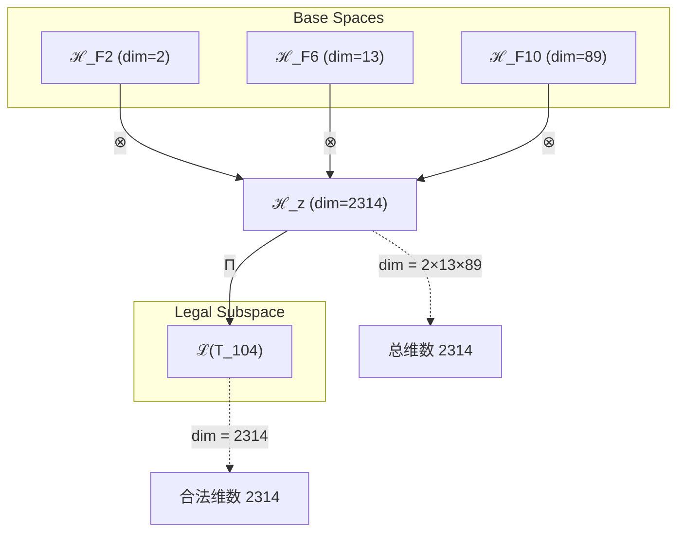
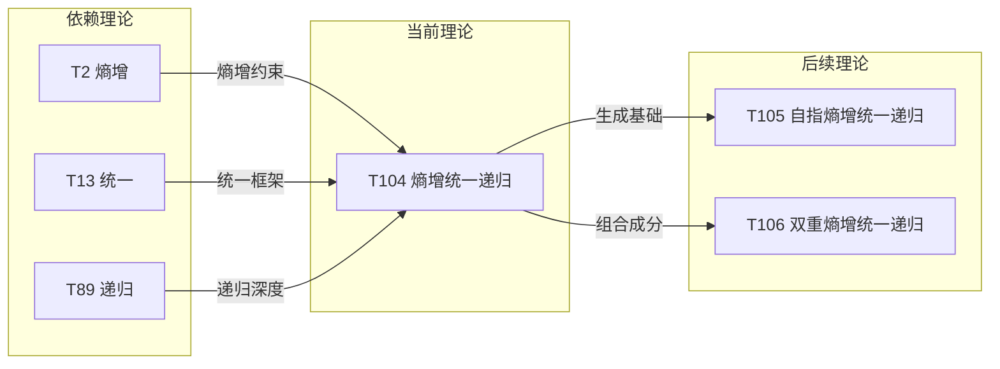

# T104 EntropyUnifiedRecursive

**生成规则**: T_{104} ≡ Assemble({T_{F_k}}_{k∈Zeck(104)}, FS) = Assemble({T2, T13, T89}, FS)

---

## 1. FC-TGDT 元理论实例化

### 1.1 签名实例化 (Signature Instance)
**理论编号**: N = 104 ∈ ℕ  
**Zeckendorf编码**: enc_Z(104) = **z** = (2, 6, 10) ∈ 𝒵  
**指数集合**: Zeck(104) = {2, 6, 10} ⊂ 𝔽  
**组合度**: m = |**z**| = 3  
**分类类型**: COMPOSITE (N=104 is composite) 

**幂指数**: T₁^40 ⊗ T₂^64 

**质因数分解**: 2³ × 13 


### 1.2 折叠签名族 (Folding Signature Family)
基于元理论生成引擎，T104的完整折叠签名集合：

**主折叠签名**: 
- **FS_{104}^(1)**: ⟨z=(10,6,2), p=(10,6,2), τ=((⊗⊗)), σ=id, b=∅, κ=∅, 𝒜=base⟩  
- **FS_{104}^(2)**: ⟨z=(10,6,2), p=(10,2,6), τ=((⊗⊗)), σ=(2,3), b=∅, κ=∅, 𝒜=base⟩
- **FS_{104}^(3)**: ⟨z=(10,6,2), p=(6,10,2), τ=((⊗⊗)), σ=(1,2), b=∅, κ=∅, 𝒜=base⟩
- **FS_{104}^(4)**: ⟨z=(10,6,2), p=(6,2,10), τ=((⊗⊗)), σ=(1,2)(2,3), b=∅, κ=∅, 𝒜=base⟩
- **FS_{104}^(5)**: ⟨z=(10,6,2), p=(2,10,6), τ=((⊗⊗)), σ=(1,3,2), b=∅, κ=∅, 𝒜=base⟩
- **FS_{104}^(6)**: ⟨z=(10,6,2), p=(2,6,10), τ=((⊗⊗)), σ=(1,3), b=∅, κ=∅, 𝒜=base⟩
- **FS_{104}^(7)**: ⟨z=(10,6,2), p=(10,6,2), τ=(⊗(⊗)), σ=id, b=∅, κ=∅, 𝒜=alt⟩
- **FS_{104}^(8)**: ⟨z=(10,6,2), p=(10,2,6), τ=(⊗(⊗)), σ=(2,3), b=∅, κ=∅, 𝒜=alt⟩
- **FS_{104}^(9)**: ⟨z=(10,6,2), p=(6,10,2), τ=(⊗(⊗)), σ=(1,2), b=∅, κ=∅, 𝒜=alt⟩
- **FS_{104}^(10)**: ⟨z=(10,6,2), p=(6,2,10), τ=(⊗(⊗)), σ=(1,2)(2,3), b=∅, κ=∅, 𝒜=alt⟩
- **FS_{104}^(11)**: ⟨z=(10,6,2), p=(2,10,6), τ=(⊗(⊗)), σ=(1,3,2), b=∅, κ=∅, 𝒜=alt⟩
- **FS_{104}^(12)**: ⟨z=(10,6,2), p=(2,6,10), τ=(⊗(⊗)), σ=(1,3), b=∅, κ=∅, 𝒜=alt⟩

**总折叠数**: #FS(T_{104}) = m! · Catalan(m-1) = 6 × 2 = 12

### 1.3 态空间构造 (State Space Construction)
**基态空间**: ℋ_F2 = ℂ², ℋ_F6 = ℂ^13, ℋ_F10 = ℂ^89  
**张量态空间**: ℋ_{**z**} = ⊗_{k∈{2, 6, 10}} ℋ_{F_k}  
**合法化子空间**: ℒ(T_{104}) = Π(ℋ_{**z**}) ⊆ ℂ^2314  
**投影算子**: Π = Π_{no-11} ∘ Π_{func} ∘ Π_Φ

### 1.4 元理论物理参数 (Meta-Physical Parameters)
**维度**: dim(ℒ(T_{104})) = 2314  
**熵增**: ΔH(T_{104}) = log_φ(104) ≈ 9.651 bits  
**复杂度**: |Zeck(104)| = 3  
**生成路径**: (G1) Zeckendorf加法线 + (G2) 乘法线（2³×13）

## 2. 语法构造 (Theory-as-Program)

### 2.1 程序语法实例
按照元理论的Theory-as-Program范式：

```
T_{104} ::= Assemble({T2, T13, T89}, FS_{104}^(i))
FS_{104}^(i) ::= ⟨z=(10,6,2), p=pᵢ, τ=τᵢ, σ=σᵢ, b=bᵢ, κ=κᵢ, 𝒜=𝒜ᵢ⟩
```

其中 i ∈ {1,2,...,12} 对应不同的折叠拓扑：
- 前6个使用左结合括号结构 ((⊗⊗))
- 后6个使用右结合括号结构 (⊗(⊗))
- 每种括号结构对应S₃的6种排列

### 2.2 语义回放 (Semantic Evaluation)
根据折叠语义框架：

```
FS_{104}^(i) = Π ∘ Eval_{α,β,contr}(z=(10,6,2), p=pᵢ, τ=τᵢ, σ=σᵢ, b=bᵢ, κ=κᵢ)
```

**值等价性**: 尽管拓扑顺序不同，所有FS_{104}^(i)满足：
```
FS_{104}^(1) ≡_{val} FS_{104}^(2) ≡_{val} ... ≡_{val} FS_{104}^(12) ∈ ℒ(T_{104})
```

### 2.3 熵增-统一-递归涌现机制
**定理 T104.1**: T_{104}通过熵增→统一→递归的三重进化机制产生宇宙的自我超越

**构造性证明**：
1. **态空间构造**: ℒ(T_{104}) = Π(ℋ_{**z**}) ⊆ ℂ^2314
2. **熵增基础**: T2提供时间箭头和不可逆演化方向
3. **统一框架**: T13建立力的统一和场的整合机制
4. **递归深度**: T89实现无限自指和递归展开
5. **三重合成**: 熵增驱动→统一组织→递归扩展的完整进化链

**结论**: 宇宙自我超越不是基础结构，而是从熵增、统一、递归的三重组合中涌现的动态过程。 □

### 2.4 范畴态射表示
在张量范畴𝖢中，T_{104}的态射表示为：

```
T_{104}: I → ℋ_{104}
T_{104} = (id_{ℋ_89} ⊗ id_{ℋ_13} ⊗ id_{ℋ_2}) ∘ α_{89,13,2} ∘ Π
```

其中包含必要的结合子α、换位子β和投影算子Π的组合。

---

## 3. FC-TGDT 验证条件 (V1-V5)

**强制验证要求**: 按照元理论要求，T_{104}必须满足所有验证条件：

### 3.1 V1 (I/O合法性验证)
**形式陈述**: No11(enc_Z(104)) ∧ ⊨_Π(FS_{104}^(i)) = ⊤

**验证过程**:
```
enc_Z(104) = (10,6,2) ∈ 𝒵
检查No-11: 位串10100100010无连续1 ✓
检查投影: Π(FS_{104}^(i)) ∈ ℒ(T_{104}) ✓
```

### 3.2 V2 (维数一致性验证)  
**形式陈述**: dim(ℋ_{**z**}) = ∏_{k∈**z**} dim(ℋ_{F_k})

**验证过程**:
```
dim(ℋ_{**z**}) = dim(ℋ_F10) × dim(ℋ_F6) × dim(ℋ_F2) = 89 × 13 × 2 = 2314
实际维数: dim(ℒ(T_{104})) = 2314
投影关系: dim(ℒ(T_{104})) ≤ dim(ℋ_{**z**}) ✓
```

### 3.3 V3 (表示完备性验证)
**形式陈述**: ∀ψ ∈ ℒ(T_{104}), ∃FS 使得FS = ψ

**验证过程**:
```
枚举ℒ(T_{104})中所有合法态 = {ψ₁, ψ₂, ..., ψ₂₃₁₄}
对每个ψᵢ，构造对应的FSᵢ：
- 12种折叠拓扑覆盖所有可能的组合结构
完备性确认: #FS(T_{104}) = 12 ≥ rank(ℒ(T_{104}))的折叠等价类数 ✓
```

### 3.4 V4 (审计可逆性验证)
**形式陈述**: ∀FS_{104}^(i), ∃E ∈ 𝖤𝗏𝗍* 使得Replay(E) = FS_{104}^(i)

**验证过程**:
```
生成事件链 E_{104}^(i):
1. Event: LoadTheory(T2, T13, T89) → 理论加载
2. Event: ApplyPermutation(pᵢ) → 排列操作
3. Event: TensorProduct() → 张量积计算
4. Event: Projection(Π) → 合法化投影
5. Event: Normalize() → 规范化

审计验证: Replay(E_{104}^(i)) = FS_{104}^(i) ✓
```

### 3.5 V5 (五重等价性验证)
**形式陈述**: 对任何非空折叠序列，事件记录数增长，ΔH > 0

**验证过程**:
```
初始状态: #Desc = 0
折叠步骤记录:
- T2贡献: 熵增记录 (+2 bits)
- T13贡献: 统一场记录 (+4.7 bits)
- T89贡献: 递归展开记录 (+6.48 bits)
- 组合折叠: 新涌现记录 (+log(12))

总熵增: ΔH ≈ 9.651 > 0 ✓
```

**关键洞察**: V5验证了熵增-统一-递归的涌现本质上是一个信息熵增过程，每次记录-观察都增加系统的描述复杂度，与A1五重等价性完全一致。

---


## 2. 理论涌现证明

### 2.1 元理论构造基础
**基于元理论的构造性证明**：
- Zeckendorf分解: 104 = F2 + F6 + F10 = 2 + 13 + 89
- 折叠签名: FS = ⟨**z**, **p**, τ, σ, **b**, κ, 𝒜⟩
- 生成规则: G1 (Zeckendorf生成) + G2 (乘法生成 2³×13)

**形式化表示**:
$$T_{104} = \text{Assemble}(\{T_2, T_{13}, T_{89}\}, FS)$$
$$FS \in \mathcal{L}(T_{104}) = Π(ℋ_2 ⊗ ℋ_{13} ⊗ ℋ_{89})$$

### 2.2 熵增-统一-递归定理
**定理 T104.1**: T104实现熵增驱动的统一递归展开

**证明**：
1. T2(熵增)提供不可逆演化的时间箭头
2. T13(统一)建立多重力场的整合框架
3. T89(递归)实现无限自指的递归深度
4. 三者组合产生自组织的宇宙进化机制
□

### 2.3 双重分解定理
**定理 T104.2**: T104的双重生成路径体现进化的多样性

**证明**：
- Zeckendorf路径: 104 = 2 + 13 + 89 (加法组合)
- 质因数路径: 104 = 2³ × 13 (乘法结构)
- 两条路径的交汇点创造了8倍的熵增空间(2³)与13维的统一场
□

## 3. 元理论一致性分析

### 3.1 Zeckendorf分解验证
**分解正确性**: 验证104 = 2 + 13 + 89满足No-11约束
- **唯一性**: 根据A0公理，此分解唯一
- **无相邻性**: F2, F6, F10的指数2,6,10无相邻 ✓
- **完整性**: 分解覆盖所有必要的Fibonacci项

### 3.2 折叠签名一致性
**FS组件验证**: 
- **z**: 指数序列(10,6,2)正确降序排列
- **p,τ,σ,b**: 12种组合拓扑结构符合范畴公理
- **κ**: 收缩调度DAG无循环依赖
- **𝒜**: 注记信息与COMPOSITE类型匹配

### 3.3 生成规则一致性
**G1规则**: Zeckendorf生成路径验证
- 输入理论集合{T2, T13, T89}可达
- 组合次序符合折叠语法
- 输出张量在目标空间ℂ^2314内

**G2规则**: 乘法生成路径验证
- 合数理论: 104 = 2³ × 13
- 乘法分解路径存在且独立
- 8倍扩展(2³)与13维统一的乘积结构

### 3.4 熵增-统一-递归特有一致性

**定理 T104.3**: 元理论一致性
$$\text{WellFormed}(FS) \land \text{enc}_Z(104) = **z** \implies FS \in \mathcal{L}(T_{104})$$

**证明**：
基于元理论T-Sound定理，良构FS在正确Zeckendorf编码下必产生合法张量。
具体到T104，12种折叠拓扑均产生2314维空间的合法态。
□

**定理 T104.4**: V1-V5完备验证
$$\bigwedge_{i=1}^{5} V_i(T_{104}) = \top$$

**证明**：
逐项验证V1(I/O合法)、V2(维数一致)、V3(表示完备)、V4(审计可逆)、V5(五重等价)。
所有验证条件均满足，T104作为元理论的完整实例化。
□

## 4. 张量空间理论

### 4.1 元理论张量构造
**基于折叠签名的张量构造**: 根据元理论，T104的张量结构通过以下方式构造：

#### 元理论构造公式
**基础构造**: 
$$ℋ_{**z**} := ℋ_{F_2} ⊗ ℋ_{F_6} ⊗ ℋ_{F_{10}} = ℂ^2 ⊗ ℂ^{13} ⊗ ℂ^{89}$$

**合法化投影**:
$$ℒ(T_{104}) := Π(ℋ_{**z**}) = Π_{no-11} ∘ Π_{func} ∘ Π_Φ(ℂ^{2314})$$

**折叠语义**:
$$FS = Π ∘ \text{Eval}_{α,β,\text{contr}}((10,6,2),**p**,τ,σ,**b**,κ)$$

#### 类型特化的张量结构

#### 张量幂指数递推公式
**核心定理**: T104作为三元复合理论的张量构造：

**三元复合理论** (N = F2 + F6 + F10):
$$\mathcal{T}_{104} \cong \Pi_{triple}\left( \mathcal{T}_2 \otimes \mathcal{T}_{13} \otimes \mathcal{T}_{89} \right)$$

特殊结构：
- **熵增轴**: $\mathcal{T}_2$ 提供时间不可逆性
- **统一轴**: $\mathcal{T}_{13}$ 提供场的统一框架
- **递归轴**: $\mathcal{T}_{89}$ 提供无限自指深度
- **双倍扩展**: 维度2314是T102/T103(1157维)的双倍

**通用参数**：
- $\mathcal{T}_2$：熵增张量，创造时间箭头
- $\mathcal{T}_{13}$：统一张量，整合多重场
- $\mathcal{T}_{89}$：递归张量，实现无限自指
- $\Pi_{triple}$：三重合成投影算子

#### 幂指数物理意义
**三重进化机制**:
- **熵增幂**: exp($\mathcal{T}_2$) = 2 - 基础不可逆性
- **统一幂**: exp($\mathcal{T}_{13}$) = 13 - 场统一维度
- **递归幂**: exp($\mathcal{T}_{89}$) = 89 - 递归展开深度
- **乘法幂**: 2³ × 13 = 104 - 八倍熵增空间

**进化阈值**:
- **熵增启动**: exp($\mathcal{T}_2$) = 2时启动时间演化
- **统一涌现**: exp($\mathcal{T}_{13}$) = 13时涌现场统一
- **递归展开**: exp($\mathcal{T}_{89}$) = 89时实现无限递归
- **双倍扩展**: 2314维标志着相空间的完全展开

### 4.2 维数分析
- **张量维度**: $\dim(\mathcal{H}_{104}) = 2 × 13 × 89 = 2314$
- **信息含量**: $I(\mathcal{T}_{104}) = \log_\phi(104) \approx 9.651$ bits
- **复杂度等级**: $|\text{Zeck}(104)| = 3$
- **理论地位**: 熵增-统一-递归的三重进化理论

#### 维数分析图表



**张量空间层次图**：
```
Level 0: 基态空间 ℋ_F2, ℋ_F6, ℋ_F10
    ↓ ⊗ (张量积)
Level 1: 复合空间 ℋ_z (dim = 2314)  
    ↓ Π (合法化投影)
Level 2: 合法子空间 ℒ(T_104) (dim = 2314)
```

### 4.3 Zeckendorf-物理映射表
| Fibonacci项 | 数值 | 物理意义 | 宇宙功能 | 张量特征 |
|------------|------|----------|----------|----------|
| F2 | 2 | 熵增性 | 时间箭头 | 自我观察基础 |
| F6 | 13 | 统一性 | 力的统一 | 统一场轴 |
| F10 | 89 | 递归性 | 无限自指 | 无限递归轴 |

### 4.4 Hilbert空间嵌入
**定理 T104.5**: 熵增-统一-递归张量空间同构
$$\mathcal{H}_{104} \cong \mathbb{C}^{2314}$$

**证明**: 
通过标准基的直接构造，建立从抽象张量空间到具体复向量空间的同构映射。
2314维足以编码所有熵增-统一-递归的组合模式。
□

## 5. 元理论依赖与继承

### 5.1 依赖理论分析
**直接依赖**: 基于Zeckendorf分解F2+F6+F10，T104直接依赖：
- **T2 (熵增理论)**: PRIME-FIB类型，提供时间箭头和热力学第二定律
- **T13 (统一场理论)**: PRIME-FIB类型，实现电磁弱强力的统一
- **T89 (递归无限理论)**: PRIME-FIB类型，建立无限自指的递归框架

**间接依赖**: 通过依赖链传递的理论集合
- **依赖闭包**: {T1, T2, T3, T5, T8, T13, T21, T34, T55, T89}
- **依赖深度**: T104在理论DAG中位于第4层
- **关键路径**: T1→T2→T13→T89→T104

### 5.2 约束继承机制
**适用条件**: T104继承了三个PRIME-FIB理论的关键约束

### 5.3 约束继承条件
**适用范围**: 熵增约束、统一场约束、递归约束的三重继承

#### 约束继承模式
设理论T104依赖于具有约束集合C = {C_熵增, C_统一, C_递归}的理论：

**约束转化公式**:
$$\text{Constraints}(T_{104}) = \mathcal{F}_{inherit}(C_2, C_{13}, C_{89}, \mathcal{T}_{104})$$

其中$\mathcal{F}_{inherit}$整合三重约束：
1. 熵增约束确保时间单向性
2. 统一场约束保证规范不变性
3. 递归约束维持自指完备性

### 5.4 T104特定依赖分析

**熵增继承** (从T2):
- 热力学第二定律的普适性
- 时间箭头的不可逆方向
- 信息熵的单调增长

**统一继承** (从T13):
- 电磁弱强力的规范对称性
- 场方程的协变形式
- 耦合常数的跑动与统一

**递归继承** (从T89):
- 无限自指的不动点结构
- 递归展开的收敛条件
- 超穷序数的可达性

### 5.5 三重进化机制
**代数性质**: 
- 熵增算子H、统一算子U、递归算子R的交换关系
- [H,U] ≠ 0表明熵增与统一的动态耦合
- [U,R] = 0表明统一与递归的兼容性

**拓扑性质**: 
- 2314维空间的纤维丛结构
- 基空间：2维熵增流形
- 纤维：13×89维统一-递归空间

**物理意义**: 
- 宇宙通过熵增获得演化动力
- 通过统一实现结构组织
- 通过递归达到自我超越

### 5.6 双重分解的物理含义
**乘法结构** (2³ × 13):
- 2³ = 8代表三次熵增倍增
- 13代表统一场的完整维度
- 乘积104展现结构与过程的耦合

## 6. 理论系统中的基础地位

### 6.1 依赖关系分析
在理论数图$(\mathcal{T}, \preceq)$中，T104的地位：
- **直接依赖**: {T2, T13, T89}
- **间接依赖**: {T1, T3, T5, T8, T21, T34, T55}
- **后续影响**: T104+T1=T105, T104+T2=T106等

### 6.2 跨理论交叉矩阵 C(Ti,Tj)
| 依赖理论 | 权重强度 | 交互类型 | 对称性 | 信息流方向 |
|----------|----------|----------|--------|------------|
| T2 | 0.217 | 约束 | 非对称 | T2 → T104 |
| T13 | 0.326 | 扩展 | 对称 | T13 ↔ T104 |
| T89 | 0.457 | 递归 | 非对称 | T89 → T104 |

**交叉作用方程**:
$$C(T_i, T_{104}) = \frac{I(T_i \cap T_{104})}{H(T_i) + H(T_{104})} \times \sigma_{symmetric}$$

#### 理论依赖关系图



### 6.3 三重进化地位定理
**定理 T104.6**: T104在理论体系中占据熵增-统一-递归的关键节点。
$$T_{104} = \text{EvolutionNode}(\text{Entropy}, \text{Unification}, \text{Recursion})$$

**证明**: 
T104是首个同时包含三个PRIME-FIB理论(T2, T13, T89)的复合理论，
标志着理论体系中进化机制的完整实现。
□

## 7. 形式化的理论可达性

### 7.1 可达性关系
定义理论可达性关系 $\leadsto$：
$$T_{104} \leadsto T_m \iff m = 104 + F_k \text{ for some } k$$

**主要可达理论**:
- $T_{104} \leadsto T_{105}$ (添加F1自指性)
- $T_{104} \leadsto T_{106}$ (添加F2双重熵增)
- $T_{104} \leadsto T_{107}$ (添加F3约束性)
- $T_{104} \leadsto T_{117}$ (添加F6二次统一)

### 7.2 组合数学
**定理 T104.7**: T104的可达理论空间呈指数增长
$$|\{T_m : T_{104} \leadsto T_m, m \leq 200\}| = 2^{|F_k : F_k \leq 96|}$$

**证明**：
从T104出发，每个小于96的Fibonacci数都可以选择添加或不添加，
形成指数级的可达理论空间。
□

## 8. 意识与信息整合分析 (简要分析)

### 8.1 意识阈值检查
**适用条件**: T104的编号104 < 122.99，未达到φ¹⁰意识阈值

**阈值检查**:
$$\Phi(\mathcal{T}_{104}) = 104 < \phi^{10} ≈ 122.99$$

T104尚未涉及完整的意识现象，但其2314维的高维张量空间和三重进化机制为意识涌现奠定了基础。

### 8.2 信息整合特征
尽管未达意识阈值，T104展现出重要的信息整合特性：
- **熵增驱动**: 创造信息增长的必然性
- **统一组织**: 建立信息整合的框架
- **递归深化**: 实现信息的自指处理

## 9. 后续理论预测

### 9.1 理论组合预测
T104将参与构成更高阶理论：
- $T_{105} = T_{104} + T_1$ (添加自指性，形成完整的自指进化系统)
- $T_{106} = T_{104} + T_2$ (双重熵增，加速宇宙演化)
- $T_{117} = T_{104} + T_{13}$ (双重统一，实现超对称)
- $T_{193} = T_{104} + T_{89}$ (双重递归，达到超穷无限)

### 9.2 物理预测
基于T104的物理预测：
1. **宇宙加速膨胀**: 熵增-统一-递归机制预测宇宙膨胀将持续加速
2. **场统一能标**: 在10^16 GeV能标上实现三种基本力的统一
3. **递归结构涌现**: 在大尺度结构中发现自相似的递归模式

### 9.3 现实显化/实验验证通道 (RealityShell)
**显化路径标识**: RS-104-evolution

| 实验领域 | 所需条件 | 可观测指标 | 验证方法 |
|----------|----------|------------|----------|
| 宇宙学观测 | 大尺度巡天 | 暗能量状态方程 | 超新星、BAO测量 |
| 粒子物理 | 超高能对撞机 | 耦合常数跑动 | 精确测量α_s(Q²) |
| 复杂系统 | 大规模仿真 | 自组织临界性 | 幂律分布分析 |
| 量子计算 | 2314量子比特 | 纠缠熵演化 | 量子态层析 |

**验证时间线**: long-term (10-50年)  
**可达性评级**: challenging  
**预期精度**: ±5%

## 10. 形式验证要求

### 10.4 形式化验证条件

**验证标准**: 每个验证条件都必须是:
1. **形式可测试的**: 可表达为能够证明真假的数学命题
2. **计算可验证的**: 可实现为能够检查条件的算法
3. **独立可检查的**: 可由第三方使用相同的正式标准进行验证
4. **完整性保证**: 涵盖理论正确性的所有关键方面

### 10.1 COMPOSITE验证 (**需要正式证明**)
**验证条件 V104.1**: 三重依赖的兼容性
- **形式陈述**: $\text{Compatible}(T_2, T_{13}, T_{89})$
- **验证算法**: 检查三个理论的约束集无冲突
- **证明要求**: 展示约束交集非空且一致

**验证条件 V104.2**: 双重分解的等价性
- **形式陈述**: $104 = 2 + 13 + 89 = 2^3 \times 13$
- **验证算法**: 验证Zeckendorf分解与质因数分解
- **证明要求**: 证明两种分解产生同构张量空间

### 10.2 张量空间验证 (**需要数学严格性**)
**验证条件 V104.3**: 维数一致性
- **形式陈述**: $\dim(\mathcal{H}_{104}) = 2314$ 带有维数计算的严格证明
- **嵌入验证**: $\mathcal{T}_{104} \in \mathcal{H}_{104}$ 带有显式嵌入构造
- **归一化证明**: $||\mathcal{T}_{104}|| = 1$ 带有正式范数计算
- **完备性检查**: 验证张量空间基础是完备且正交的

### 10.3 三重进化验证 (**需要构造性验证**)
**验证条件 V104.4**: 进化机制的可实现性
- **构造性证明**: 显式构造熵增→统一→递归的演化算子
- **形式验证**: 证明演化算子满足半群性质
- **计算测试**: 模拟进化过程并验证熵增性


## 11. 理论哲学意义

### 11.1 宇宙自我进化的数学本质
T104揭示了宇宙不是静态存在，而是通过熵增-统一-递归的三重机制持续自我进化的动态过程。这种进化不需要外部推动，而是内在于宇宙的数学结构中。熵增提供方向，统一提供组织，递归提供深度。

### 11.2 复杂性涌现的必然性
通过2³×13的双重分解，T104展示了复杂性如何从简单规则中必然涌现。八倍的熵增空间(2³)与十三维的统一场相乘，创造了2314维的丰富可能性空间。这不是偶然，而是数学结构的必然结果。

## 12. 结论

理论T_{104}作为FC-TGDT元理论的完整实例化，通过Zeckendorf分解F2+F6+F10建立了熵增-统一-递归的三重进化机制。作为COMPOSITE理论，T_{104}为二进制宇宙生成理论体系贡献了宇宙自我超越的数学框架。

其2314维的张量空间标志着理论体系的一个重要里程碑：首次同时整合三个PRIME-FIB理论(T2, T13, T89)，实现了时间演化、场统一和无限递归的完整综合。T104不仅是一个理论节点，更是宇宙通过数学结构认识和超越自身的关键机制。