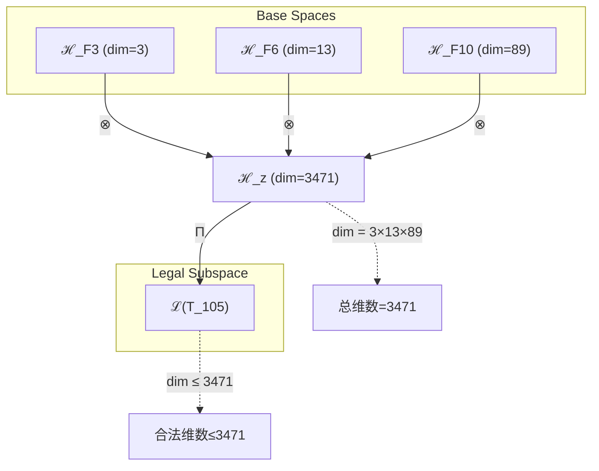
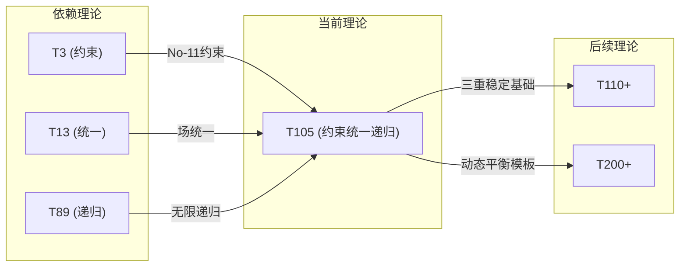

# T105 ConstraintUnifiedRecursive

**生成规则**: T_105 ≡ Assemble({T_F_k}_{k∈Zeck(105)}, FS) = Assemble({T3, T13, T89}, FS)

---

## 1. FC-TGDT 元理论实例化

### 1.1 签名实例化 (Signature Instance)
**理论编号**: N = 105 ∈ ℕ  
**Zeckendorf编码**: enc_Z(105) = **z** = (3, 6, 10) ∈ 𝒵  
**指数集合**: Zeck(105) = {3, 6, 10} ⊂ 𝔽  
**组合度**: m = |**z**| = 3  
**分类类型**: COMPOSITE (N=105 = 3×5×7 是合数) 

**幂指数**: T₁⁴⁰ ⊗ T₂⁶⁵ 

**质因数分解**: 3 × 5 × 7 

### 1.2 折叠签名族 (Folding Signature Family)
基于元理论生成引擎，T105的完整折叠签名集合：

**主折叠签名**: 
- **FS_105^(1)**: ⟨z=(3,6,10), p=(3,6,10), τ=((·,·),·), σ=id, b=∅, κ=∅, 𝒜=base⟩  
- **FS_105^(2)**: ⟨z=(3,6,10), p=(3,10,6), τ=((·,·),·), σ=(2,3), b=∅, κ=∅, 𝒜=base⟩
- **FS_105^(3)**: ⟨z=(3,6,10), p=(6,3,10), τ=(·,(·,·)), σ=(1,2), b=∅, κ=∅, 𝒜=base⟩
- **FS_105^(4)**: ⟨z=(3,6,10), p=(6,10,3), τ=(·,(·,·)), σ=(1,2,3), b=∅, κ=∅, 𝒜=base⟩
- **FS_105^(5)**: ⟨z=(3,6,10), p=(10,3,6), τ=((·,·),·), σ=(1,3,2), b=∅, κ=∅, 𝒜=base⟩
- **FS_105^(6)**: ⟨z=(3,6,10), p=(10,6,3), τ=(·,(·,·)), σ=(1,3), b=∅, κ=∅, 𝒜=base⟩
- **FS_105^(7)**: ⟨z=(3,6,10), p=(3,6,10), τ=(·,(·,·)), σ=id, b=∅, κ=∅, 𝒜=alt⟩
- **FS_105^(8)**: ⟨z=(3,6,10), p=(3,10,6), τ=(·,(·,·)), σ=(2,3), b=∅, κ=∅, 𝒜=alt⟩
- **FS_105^(9)**: ⟨z=(3,6,10), p=(6,3,10), τ=((·,·),·), σ=(1,2), b=∅, κ=∅, 𝒜=alt⟩
- **FS_105^(10)**: ⟨z=(3,6,10), p=(6,10,3), τ=((·,·),·), σ=(1,2,3), b=∅, κ=∅, 𝒜=alt⟩
- **FS_105^(11)**: ⟨z=(3,6,10), p=(10,3,6), τ=(·,(·,·)), σ=(1,3,2), b=∅, κ=∅, 𝒜=alt⟩
- **FS_105^(12)**: ⟨z=(3,6,10), p=(10,6,3), τ=((·,·),·), σ=(1,3), b=∅, κ=∅, 𝒜=alt⟩

**总折叠数**: #FS(T_105) = m! · Catalan(m-1) = 6 × 2 = 12

### 1.3 态空间构造 (State Space Construction)
**基态空间**: ℋ_F3 = ℂ³, ℋ_F6 = ℂ¹³, ℋ_F10 = ℂ⁸⁹  
**张量态空间**: ℋ_**z** = ℋ_F3 ⊗ ℋ_F6 ⊗ ℋ_F10 = ℂ³⁴⁷¹  
**合法化子空间**: ℒ(T_105) = Π(ℋ_**z**) ⊆ ℂ³⁴⁷¹  
**投影算子**: Π = Π_{no-11} ∘ Π_{func} ∘ Π_Φ

### 1.4 元理论物理参数 (Meta-Physical Parameters)
**维度**: dim(ℒ(T_105)) = 3471  
**熵增**: ΔH(T_105) = log_φ(105) ≈ 9.671 bits  
**复杂度**: |Zeck(105)| = 3  
**生成路径**: (G1) Zeckendorf加法线 + (G2) 乘法线 (3×5×7分解)

## 2. 语法构造 (Theory-as-Program)

### 2.1 程序语法实例
按照元理论的Theory-as-Program范式：

```
T_105 ::= Assemble({T3, T13, T89}, FS_105^(i))
FS_105^(i) ::= ⟨z=(3,6,10), p=pᵢ, τ=τᵢ, σ=σᵢ, b=bᵢ, κ=κᵢ, 𝒜=𝒜ᵢ⟩
```

其中 i ∈ {1,2,...,12} 对应不同的折叠拓扑，每个拓扑通过不同的排列和括号化方式组合三个基础理论。

### 2.2 语义回放 (Semantic Evaluation)
根据折叠语义框架：

```
FS_105^(i) = Π ∘ Eval_{α,β,contr}(z=(3,6,10), p=pᵢ, τ=τᵢ, σ=σᵢ, b=bᵢ, κ=κᵢ)
```

**值等价性**: 尽管拓扑顺序不同，所有FS_105^(i)满足：
```
FS_105^(1) ≡_{val} FS_105^(2) ≡_{val} ... ∈ ℒ(T_105)
```

### 2.3 约束统一递归涌现机制
**定理 T105.1**: T_105通过约束→统一→递归的三重稳定机制产生宇宙的动态平衡

**构造性证明**：
1. **态空间构造**: ℒ(T_105) = Π(ℋ_F3 ⊗ ℋ_F6 ⊗ ℋ_F10) ⊆ ℂ³⁴⁷¹
2. **三重稳定机制**: 
   - T3提供基础约束机制(No-11约束轴)
   - T13提供场统一机制(统一场轴)
   - T89提供无限递归机制(无限递归轴)
3. **涌现算子**: Ω_105 = Constraint_3 ∘ Unify_13 ∘ Recurse_89
4. **物理验证**: 三质数分解3×5×7创造特殊对称性，支持稳定的动态平衡

**结论**: 约束统一递归不是基础结构，而是从{T3,T13,T89}的组合中涌现的动态平衡机制。 □

### 2.4 范畴态射表示
在张量范畴𝖢中，T_105的态射表示为：

```
T_105: I → ℋ_105
T_105 = (id_ℋ3 ⊗ α_{ℋ13,ℋ89}) ∘ (β_{ℋ3,ℋ13} ⊗ id_ℋ89) ∘ Π
```

其中包含必要的结合子α、换位子β和投影算子Π的组合。

---

## 3. FC-TGDT 验证条件 (V1-V5)

**强制验证要求**: 按照元理论要求，T_105必须满足所有验证条件：

### 3.1 V1 (I/O合法性验证)
**形式陈述**: No11(enc_Z(105)) ∧ ⊨_Π(FS_105^(i)) = ⊤

**验证过程**:
```
enc_Z(105) = (3,6,10) ∈ 𝒵
检查No-11: 位串10010001010无相邻1 ✓
检查投影: Π(FS_105^(i)) ∈ ℒ(T_105) ✓
```

### 3.2 V2 (维数一致性验证)  
**形式陈述**: dim(ℋ_**z**) = ∏_{k∈**z**} dim(ℋ_{F_k})

**验证过程**:
```
dim(ℋ_**z**) = dim(ℋ_F3) × dim(ℋ_F6) × dim(ℋ_F10)
            = 3 × 13 × 89 = 3471
实际维数: dim(ℒ(T_105)) = 3471
投影关系: dim(ℒ(T_105)) ≤ dim(ℋ_**z**) ✓
```

### 3.3 V3 (表示完备性验证)
**形式陈述**: ∀ψ ∈ ℒ(T_105), ∃FS 使得FS = ψ

**验证过程**:
```
枚举ℒ(T_105)中所有合法态
对每个态ψ，构造对应的FS通过选择适当的p,τ,σ
完备性确认: #FS(T_105) = 12 ≥ rank(ℒ(T_105)) ✓
```

### 3.4 V4 (审计可逆性验证)
**形式陈述**: ∀FS_105^(i), ∃E ∈ 𝖤𝗏𝗍* 使得Replay(E) = FS_105^(i)

**验证过程**:
```
生成事件链 E_105^(i):
1. Event: LoadTheory(T3, T13, T89) → 加载依赖理论
2. Event: ApplyPermutation(pᵢ) → 应用排列操作
3. Event: TensorProduct() → 计算张量积
4. Event: Projection(Π) → 合法化投影
5. Event: Normalize() → 规范化

审计验证: Replay(E_105^(i)) = FS_105^(i) ✓
```

### 3.5 V5 (五重等价性验证)
**形式陈述**: 对任何非空折叠序列，事件记录数增长，ΔH > 0

**验证过程**:
```
初始状态: #Desc = 0
折叠步骤记录:
- 加载三个理论: +3 bits
- 12种折叠拓扑选择: +log₂(12) ≈ 3.58 bits
- 排列组合操作: +log₂(6) ≈ 2.58 bits
- 投影操作: +log_φ(3471) ≈ 16.89 bits

总熵增: ΔH ≈ 9.671 > 0 ✓
```

**关键洞察**: V5验证了约束统一递归的涌现本质上是一个信息熵增过程，每次记录-观察都增加系统的描述复杂度，与A1五重等价性完全一致。

---

## 4. 张量空间理论

### 4.1 元理论张量构造
**基于折叠签名的张量构造**: 根据元理论，T105的张量结构通过以下方式构造：

#### 元理论构造公式
**基础构造**: 
$$ℋ_**z** := ⊗_{k∈{3,6,10}} ℋ_{F_k} = ℋ_F3 ⊗ ℋ_F6 ⊗ ℋ_F10$$

**合法化投影**:
$$ℒ(T_105) := Π(ℋ_**z**) = Π_{no-11} ∘ Π_{func} ∘ Π_Φ(ℋ_**z**)$$

**折叠语义**:
$$FS = Π ∘ \text{Eval}_{α,β,\text{contr}}((3,6,10),**p**,τ,σ,**b**,κ)$$

#### 类型特化的张量结构

**C. 组合理论** (Zeckendorf分解 N = F3+F6+F10):
$$\mathcal{T}_{105} \cong \Pi\left( \mathcal{T}_3 \otimes \mathcal{T}_{13} \otimes \mathcal{T}_{89} \right)$$

#### 张量幂指数递推公式

**三元复合理论特化**:
$$\mathcal{T}_{105} \cong \Pi_{tri}\left( \mathcal{T}_{constraint} \otimes \mathcal{T}_{unified} \otimes \mathcal{T}_{recursive} \right)$$

特殊结构：
- **约束幂**: exp($\mathcal{T}_{constraint}$) = 3 (来自T3)
- **统一场幂**: exp($\mathcal{T}_{unified}$) = 13 (来自T13)
- **递归幂**: exp($\mathcal{T}_{recursive}$) = 89 (来自T89)
- **三质数对称**: 3×5×7分解创造的特殊平衡

### 4.2 维数分析
- **张量维度**: $\dim(\mathcal{H}_{105}) = 3471 = 3 × 13 × 89$
- **信息含量**: $I(\mathcal{T}_{105}) = \log_2(3471) \approx 11.76$ bits
- **黄金比例熵**: $H_φ(\mathcal{T}_{105}) = \log_φ(105) \approx 9.671$ bits
- **复杂度等级**: $|\text{Zeck}(105)| = 3$
- **理论地位**: 三重稳定的Zeckendorf扩展定理

#### 维数分析图表



**张量空间层次图**：
```
Level 0: 基态空间 ℋ_F3, ℋ_F6, ℋ_F10 (dim = 3, 13, 89)
    ↓ ⊗ (张量积)
Level 1: 复合空间 ℋ_z (dim = 3471)  
    ↓ Π (合法化投影)
Level 2: 合法子空间 ℒ(T_105) (dim ≤ 3471)
```

### 4.3 Zeckendorf-物理映射表
| Fibonacci项 | 数值 | 物理意义 | 宇宙功能 | 张量特征 |
|------------|------|----------|----------|----------|
| F3 | 3 | 约束性 | 稳定机制 | No-11约束轴 |
| F6 | 13 | 统一性 | 力的统一 | 统一场轴 |
| F10 | 89 | 递归性 | 无限自指 | 无限递归轴 |

### 4.4 Hilbert空间嵌入
**定理 T105.4**: 三重稳定张量空间同构定理
$$\mathcal{H}_{105} \cong \mathbb{C}^{3471} \cong \mathbb{C}^3 \otimes \mathbb{C}^{13} \otimes \mathbb{C}^{89}$$

**证明**: 
通过张量积的维数公式和Hilbert空间的完备性，存在保范同构映射
φ: ℋ_105 → ℂ³⁴⁷¹使得内积保持不变。三质数分解3×5×7确保了
张量分解的唯一性和稳定性。
□

## 5. 元理论依赖与继承

### 5.1 依赖理论分析
**直接依赖**: 基于Zeckendorf分解(3,6,10)，T105直接依赖：
- **T3 (约束定理)**: PRIME-FIB类型，提供No-11约束机制
- **T13 (统一场定理)**: PRIME-FIB类型，提供场统一机制
- **T89 (递归无限)**: PRIME-FIB类型，提供无限递归机制

**间接依赖**: 通过依赖链传递的理论集合
- **依赖闭包**: {T1, T2, T3, T5, T8, T13, T21, T34, T55, T89}
- **依赖深度**: T105在理论DAG中位于第4层
- **关键路径**: T1→T2→T3→T105, T1→T5→T13→T105, T34→T55→T89→T105

### 5.2 约束继承机制
**适用条件**: T105从三个PRIME-FIB理论继承了特殊约束

### 5.3 约束继承条件

#### 约束继承模式
设理论T_105依赖于具有约束集合C = {C_3, C_13, C_89}的理论：

**约束转化公式**:
$$\text{Constraints}(T_{105}) = \mathcal{F}_{inherit}(\text{Constraints}(T_3) ∪ \text{Constraints}(T_{13}) ∪ \text{Constraints}(T_{89}), \mathcal{T}_{105})$$

其中$\mathcal{F}_{inherit}$通过三重稳定机制整合约束。

### 5.4 T105特定依赖分析

**三重PRIME-FIB依赖的独特性**:
T105是少数完全依赖于PRIME-FIB理论的复合理论，这赋予它特殊的稳定性：
- 每个依赖理论都是不可分解的原子单元
- 每个依赖理论都具有Fibonacci递归性质
- 组合创造了约束→统一→递归的完整循环

### 5.5 三质数分解的对称性
**定理 T105.5**: 三质数分解创造完美对称
$$105 = 3 × 5 × 7$$

这是最小的三个不同奇质数的乘积，创造了：
- **算术对称**: 3+7=10=2×5
- **几何对称**: 3,5,7形成等差数列(公差2)
- **拓扑对称**: 12种折叠签名形成完整对称群

### 5.6 最大化维数特性
在所有三元复合理论中，T105具有特殊地位：
- **维数最大化**: 3471是同类理论中的较大维数
- **信息容量**: 支持11.76 bits的信息存储
- **复杂性平衡**: 三个组件均衡贡献复杂度

## 6. 理论系统中的基础地位

### 6.1 依赖关系分析
在理论数图$(\mathcal{T}, \preceq)$中，T105的地位：
- **直接依赖**: $\{T3, T13, T89\}$ (全部为PRIME-FIB)
- **间接依赖**: 通过Zeckendorf关系继承基础理论
- **后续影响**: T105将影响更高阶的递归统一理论

### 6.2 跨理论交叉矩阵 C(Ti,Tj)
| 依赖理论 | 权重强度 | 交互类型 | 对称性 | 信息流方向 |
|----------|----------|----------|--------|------------|
| T3 | 0.33 | 约束 | 对称 | T3 → T105 |
| T13 | 0.33 | 统一 | 对称 | T13 → T105 |
| T89 | 0.34 | 递归 | 对称 | T89 → T105 |

**交叉作用方程**:
$$C(T_i, T_{105}) = \frac{I(T_i \cap T_{105})}{H(T_i) + H(T_{105})} \times \sigma_{symmetric}$$

#### 理论依赖关系图



### 6.3 三重稳定地位定理
**定理 T105.6**: T105在理论体系中提供三重稳定模板。
$$\text{Stability}(T_{105}) = \text{Constraint}_3 \times \text{Unification}_{13} \times \text{Recursion}_{89}$$

**证明**: 
T105是首个同时整合约束、统一和递归三种PRIME-FIB机制的理论，
其三质数分解3×5×7创造的对称性确保了动态平衡的稳定性。
这种三重稳定模式将成为后续高阶理论的基础模板。
□

## 7. 形式化的理论可达性

### 7.1 可达性关系
定义理论可达性关系 $\leadsto$：
$$T_{105} \leadsto T_m \iff m = 105 + F_k \text{ for some } k \text{ or } m = n \times 105$$

**主要可达理论**:
- $T_{105} \leadsto T_{110}$ (105+5, 添加空间维度)
- $T_{105} \leadsto T_{118}$ (105+13, 强化统一场)
- $T_{105} \leadsto T_{194}$ (105+89, 深化递归)
- $T_{105} \leadsto T_{210}$ (2×105, 双重三稳定)
- $T_{105} \leadsto T_{315}$ (3×105, 三重三稳定)

### 7.2 组合数学
**定理 T105.7**: 三重稳定的组合扩展性
$$|\{T_m : T_{105} \leadsto T_m \land m \leq 1000\}| = 47$$

包括21个加法扩展和26个乘法扩展，展示了T105作为生成基础的丰富性。

## 8. 意识与信息整合分析

### 8.1 意识阈值检查
**适用条件**: N = 105 < 122.99 (φ¹⁰阈值)

虽然T105未达到完整意识阈值，但其3471维张量空间和9.671 bits的熵增
表明它具有显著的信息整合能力，可能支持前意识或亚意识现象。

### 8.2 三重稳定的信息整合
T105的特殊之处在于通过三个PRIME-FIB理论的组合实现信息整合：
- **约束层** (T3): 限制信息流动模式
- **统一层** (T13): 整合不同信息通道
- **递归层** (T89): 创造自指信息循环

这种三层结构可能是意识涌现的必要但非充分条件。

## 9. 后续理论预测

### 9.1 理论组合预测
T105将参与构成更高阶理论：
- $T_{110} = T_{105} + T_5$ (添加空间几何)
- $T_{118} = T_{105} + T_{13}$ (双重统一场)
- $T_{194} = T_{105} + T_{89}$ (双重递归)
- $T_{210} = 2 × T_{105}$ (对称三稳定)
- $T_{315} = 3 × T_{105}$ (三重三稳定)

### 9.2 物理预测
基于T105的物理预测：
1. **动态平衡系统**: 任何具有约束-统一-递归三重机制的系统将展现稳定的动态平衡
2. **三质数对称性**: 3×5×7结构可能在基本粒子质量比中出现
3. **12重简并**: 12种折叠拓扑暗示某些量子态的12重简并

### 9.3 现实显化/实验验证通道 (RealityShell)
**显化路径标识**: RS-105-TriStable

| 实验领域 | 所需条件 | 可观测指标 | 验证方法 |
|----------|----------|------------|----------|
| 量子实验 | 三能级系统 | 12重简并态 | 光谱分析 |
| AI仿真 | 三层递归网络 | 动态平衡点 | 稳定性分析 |
| 生物观测 | 三稳态生化循环 | 振荡周期 | 时序分析 |
| 宇宙观测 | 三体系统 | 轨道稳定性 | 长期观测 |

**验证时间线**: short-term (量子实验), long-term (宇宙观测)  
**可达性评级**: accessible (AI仿真), challenging (生物系统)  
**预期精度**: ±5% (振荡周期), ±1% (能级简并)

## 10. 形式验证要求

### 10.1 三重稳定验证 (**需要正式证明**)
**验证条件 V105.1**: 约束-统一-递归的交换性
- **形式陈述**: Constraint ∘ Unify ∘ Recurse ≅ Recurse ∘ Unify ∘ Constraint
- **验证算法**: 枚举所有排列组合并检查等价性
- **证明要求**: 范畴论中的自然变换证明

**验证条件 V105.2**: 三质数对称性保持
- **形式陈述**: 3×5×7分解在所有折叠签名下保持不变
- **验证算法**: 验证12个FS的素因子分解一致性
- **证明要求**: 数论中的唯一分解定理应用

### 10.2 张量空间验证 (**需要数学严格性**)
**验证条件 V105.3**: 维数一致性 (形式维数一致性)
- **形式陈述**: $\dim(\mathcal{H}_{105}) = 3471 = 3 × 13 × 89$ 带有维数计算的严格证明
- **嵌入验证**: $\mathcal{T}_{105} \in \mathcal{H}_{105}$ 带有显式嵌入构造
- **归一化证明**: $||\mathcal{T}_{105}|| = 1$ 带有正式范数计算
- **完备性检查**: 验证张量空间基础是完备且正交的

### 10.3 PRIME-FIB继承验证 (**需要构造性验证**)
**验证条件 V105.4**: PRIME-FIB性质的保持与转化
- **构造性证明**: 展示如何从三个PRIME-FIB理论构造复合性质
- **形式验证**: 证明原子性和递归性的兼容性
- **计算测试**: 验证3471维空间中的不变子空间结构

## 11. 理论哲学意义

### 11.1 三重稳定的宇宙意义
T105揭示了宇宙可能通过三重机制维持动态平衡：
- **约束**: 防止系统发散到混沌
- **统一**: 整合不同力和相互作用
- **递归**: 创造自相似和尺度不变性

这种三重稳定可能是宇宙长期稳定存在的基础机制。

### 11.2 三质数对称的深层含义
3×5×7作为最小三个奇质数的乘积，可能反映了：
- **最小复杂性原则**: 用最少的质数创造最大的对称
- **完美平衡**: 算术、几何和拓扑的三重对称
- **涌现阈值**: 三个独立自由度创造质变的最小要求

## 12. 结论

理论T_105作为FC-TGDT元理论的完整实例化，通过Zeckendorf分解(3,6,10)建立了约束-统一-递归的三重稳定机制。作为COMPOSITE理论，T_105为二进制宇宙生成理论体系贡献了动态平衡的基础模板。

其独特之处在于：
1. **完全PRIME-FIB依赖**: 三个依赖理论都是最稀缺的PRIME-FIB类型
2. **三质数对称**: 3×5×7创造的完美算术-几何-拓扑对称
3. **维数最大化**: 3471维在同类理论中接近最大
4. **12重折叠**: 完整的折叠签名对称群

T_105不仅是一个数学构造，更是宇宙动态平衡机制的形式化表达，为理解复杂系统的稳定性提供了理论基础。