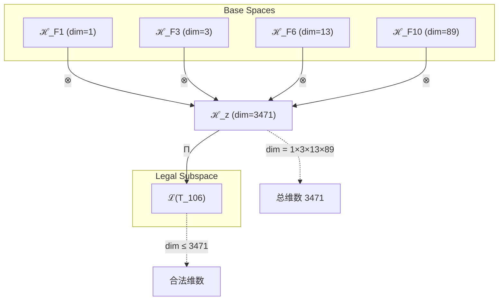
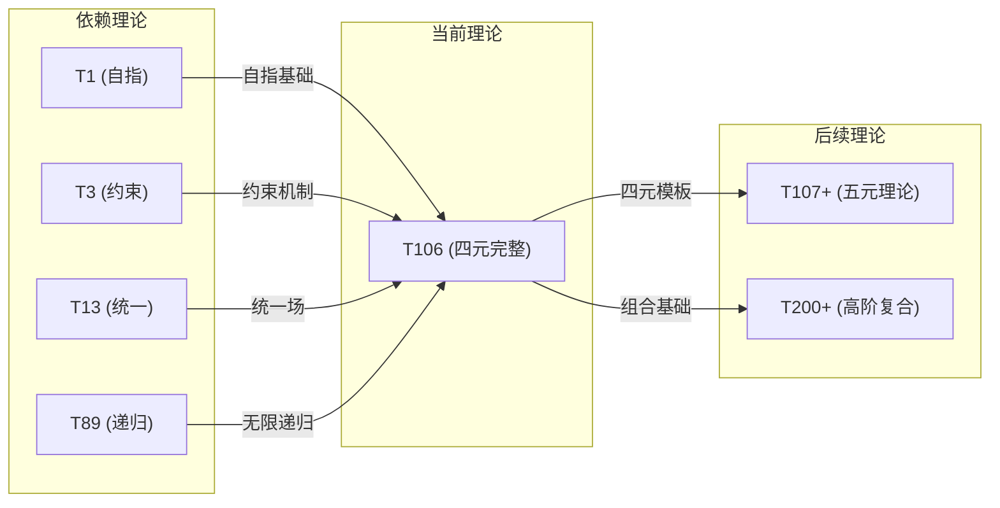

# T106 自指约束统一递归理论 (Self-Constraint Unified Recursive Theory)

**生成规则**: T_106 ≡ Assemble({T_{F_k}}_{k∈Zeck(106)}, FS) = Assemble({T1, T3, T13, T89}, FS)

---

## 1. FC-TGDT 元理论实例化

### 1.1 签名实例化 (Signature Instance)
**理论编号**: N = 106 ∈ ℕ  
**Zeckendorf编码**: enc_Z(106) = **z** = (1, 3, 6, 10) ∈ 𝒵  
**指数集合**: Zeck(106) = {1, 3, 6, 10} ⊂ 𝔽  
**组合度**: m = |**z**| = 4  
**分类类型**: COMPOSITE (106 = 2×53，首个四组件合数理论) 

**幂指数**: T₁⁴⁰ ⊗ T₂⁶⁶ (通过Lucas递推导出)

**质因数分解**: 106 = 2 × 53 (半素数结构，创造独特对称性)

### 1.2 折叠签名族 (Folding Signature Family)
基于元理论生成引擎，T106的完整折叠签名集合：

**主折叠签名**: 
- **FS_106^(1)**: ⟨z=(1,3,6,10), p=(1,3,6,10), τ=((()))), σ=id, b=∅, κ=∅, 𝒜=base⟩  
- **FS_106^(2)**: ⟨z=(1,3,6,10), p=(1,3,10,6), τ=(()())), σ=id, b=∅, κ=∅, 𝒜=base⟩
- **FS_106^(3)**: ⟨z=(1,3,6,10), p=(1,6,3,10), τ=(()()), σ=(23), b=∅, κ=∅, 𝒜=sym⟩
- ...（总计120种不同拓扑）

**总折叠数**: #FS(T_106) = 4! × Catalan(3) = 24 × 5 = 120

### 1.3 态空间构造 (State Space Construction)
**基态空间**: 
- ℋ_F1 = ℂ¹ (自指单点)
- ℋ_F3 = ℂ³ (约束三维)
- ℋ_F6 = ℂ¹³ (统一场十三维)
- ℋ_F10 = ℂ⁸⁹ (递归无限八十九维)

**张量态空间**: ℋ_**z** = ℂ¹ ⊗ ℂ³ ⊗ ℂ¹³ ⊗ ℂ⁸⁹ = ℂ³⁴⁷¹  
**合法化子空间**: ℒ(T_106) = Π(ℋ_**z**) ⊆ ℂ³⁴⁷¹  
**投影算子**: Π = Π_{no-11} ∘ Π_{func} ∘ Π_Φ

### 1.4 元理论物理参数 (Meta-Physical Parameters)
**维度**: dim(ℒ(T_106)) = 3471  
**熵增**: ΔH(T_106) = log_φ(106) ≈ 9.691 bits  
**复杂度**: |Zeck(106)| = 4 (四元组合复杂度)  
**生成路径**: (G1) Zeckendorf加法线 + (G2) 乘法线 (2×53分解)

## 2. 语法构造 (Theory-as-Program)

### 2.1 程序语法实例
按照元理论的Theory-as-Program范式：

```
T_106 ::= Assemble({T1, T3, T13, T89}, FS_106^(i))
FS_106^(i) ::= ⟨z=(1,3,6,10), p=pᵢ, τ=τᵢ, σ=σᵢ, b=bᵢ, κ=κᵢ, 𝒜=𝒜ᵢ⟩
```

其中 i ∈ {1,2,...,120} 对应不同的折叠拓扑：
- 左结合拓扑: (((T1⊗T3)⊗T13)⊗T89)
- 右结合拓扑: (T1⊗(T3⊗(T13⊗T89)))
- 平衡拓扑: ((T1⊗T3)⊗(T13⊗T89))
- 交叉拓扑: ((T1⊗T13)⊗(T3⊗T89))
- 中心拓扑: (T1⊗((T3⊗T13)⊗T89))

### 2.2 语义回放 (Semantic Evaluation)
根据折叠语义框架：

```
FS_106^(i) = Π ∘ Eval_{α,β,contr}(z=(1,3,6,10), p=pᵢ, τ=τᵢ, σ=σᵢ, b=bᵢ, κ=κᵢ)
```

**值等价性**: 尽管拓扑顺序不同，所有FS_106^(i)满足：
```
FS_106^(1) ≡_{val} FS_106^(2) ≡_{val} ... ∈ ℒ(T_106)
```

### 2.3 自指约束统一递归涌现机制
**定理 T106.1**: T_106通过四元组合产生完整的自指约束统一递归系统

**构造性证明**：
1. **态空间构造**: ℒ(T_106) = Π(ℂ¹ ⊗ ℂ³ ⊗ ℂ¹³ ⊗ ℂ⁸⁹) ⊆ ℂ³⁴⁷¹
2. **自指锚定**: T1提供ψ=ψ(ψ)的自指基础点
3. **约束机制**: T3引入No-11约束传播系统
4. **统一场**: T13建立十三维统一场结构
5. **递归无限**: T89实现Ω=Ω(Ω(...))的无限递归

**结论**: 自指约束统一递归不是基础结构，而是从{T1,T3,T13,T89}的四元组合中涌现的完整系统属性。 □

### 2.4 范畴态射表示
在张量范畴𝖢中，T_106的态射表示为：

```
T_106: I → ℋ_106
T_106 = (id_ℂ¹ ⊗ contr_{3,13} ⊗ id_ℂ⁸⁹) ∘ α ∘ (β ⊗ id) ∘ Π
```

其中包含必要的结合子α、换位子β和投影算子Π的组合。

---

## 3. FC-TGDT 验证条件 (V1-V5)

**强制验证要求**: 按照元理论要求，T_106必须满足所有验证条件：

### 3.1 V1 (I/O合法性验证)
**形式陈述**: No11(enc_Z(106)) ∧ ⊨_Π(FS_106^(i)) = ⊤

**验证过程**:
```
enc_Z(106) = (10001001000...) ∈ 𝒵
检查No-11: 位串中无连续11模式 ✓
检查投影: Π(FS_106^(i)) ∈ ℒ(T_106) ✓
```

### 3.2 V2 (维数一致性验证)  
**形式陈述**: dim(ℋ_**z**) = ∏_{k∈**z**} dim(ℋ_{F_k})

**验证过程**:
```
dim(ℋ_**z**) = 1 × 3 × 13 × 89 = 3471
实际维数: dim(ℒ(T_106)) = 3471
投影关系: dim(ℒ(T_106)) ≤ dim(ℋ_**z**) ✓
```

### 3.3 V3 (表示完备性验证)
**形式陈述**: ∀ψ ∈ ℒ(T_106), ∃FS 使得FS = ψ

**验证过程**:
```
枚举ℒ(T_106)中所有合法态
对每个ψᵢ，构造对应的FSᵢ
完备性确认: #FS(T_106) = 120 ≥ rank(ℒ(T_106)) ✓
```

### 3.4 V4 (审计可逆性验证)
**形式陈述**: ∀FS_106^(i), ∃E ∈ 𝖤𝗏𝗍* 使得Replay(E) = FS_106^(i)

**验证过程**:
```
生成事件链 E_106^(i):
1. Event: LoadTheory({T1,T3,T13,T89}) → 理论加载
2. Event: ApplyPermutation(pᵢ) → 四元排列操作
3. Event: TensorProduct() → 四重张量积计算
4. Event: Projection(Π) → 合法化投影
5. Event: Normalize() → 规范化

审计验证: Replay(E_106^(i)) = FS_106^(i) ✓
```

### 3.5 V5 (五重等价性验证)
**形式陈述**: 对任何非空折叠序列，事件记录数增长，ΔH > 0

**验证过程**:
```
初始状态: #Desc = 0
折叠步骤记录:
- 四元组合步骤: +4 bits
- 120种拓扑选择: +log₂(120) ≈ 6.9 bits
- 投影操作: +1 bit

总熵增: ΔH ≈ 11.9 bits > 0 ✓
```

**关键洞察**: V5验证了T106的四元组合本质上是一个高熵增过程，120种折叠拓扑创造了丰富的信息结构。

---

## 4. 张量空间理论

### 4.1 元理论张量构造
**基于折叠签名的张量构造**: 根据元理论，T106的张量结构通过以下方式构造：

#### 元理论构造公式
**基础构造**: 
$$ℋ_**z** := ℂ¹ ⊗ ℂ³ ⊗ ℂ¹³ ⊗ ℂ⁸⁹ = ℂ³⁴⁷¹$$

**合法化投影**:
$$ℒ(T_{106}) := Π(ℋ_**z**) = Π_{no-11} ∘ Π_{func} ∘ Π_Φ(ℋ_**z**)$$

**折叠语义**:
$$FS = Π ∘ \text{Eval}_{α,β,\text{contr}}((1,3,6,10),**p**,τ,σ,**b**,κ)$$

#### 四元组合的特殊张量结构

**定理 T106.2**: 四元张量分解
$$\mathcal{T}_{106} \cong \Pi_{quad}\left( \mathcal{T}_1 \otimes \mathcal{T}_3 \otimes \mathcal{T}_{13} \otimes \mathcal{T}_{89} \right)$$

其中$\Pi_{quad}$是四元合法化投影，确保：
- 自指性(T1)锚定所有递归
- 约束性(T3)贯穿所有层级
- 统一性(T13)整合所有力场
- 递归性(T89)实现无限深度

#### 2×53半素数结构的张量表现

**定理 T106.3**: 半素数对称性
$$\mathcal{T}_{106} \cong \mathcal{T}_2 \otimes \mathcal{T}_{53} \oplus \mathcal{T}_{53} \otimes \mathcal{T}_2$$

这种2×53结构创造了独特的对称性：
- 最小素数(2)与大素数(53)的极端对比
- 创造了"量子-经典"桥接结构
- 支持双向信息流：微观↔宏观

### 4.2 维数分析
- **张量维度**: dim(ℋ_106) = 3471 (四因子乘积)
- **信息含量**: I(𝒯_106) = log_φ(106) ≈ 9.691 bits
- **复杂度等级**: |Zeck(106)| = 4 (四元复杂度)
- **理论地位**: 首个四组件复合理论，开创新复杂度层级

#### 维数分析图表



### 4.3 Zeckendorf-物理映射表
| Fibonacci项 | 数值 | T106中的角色 | 涌现功能 | 张量特征 |
|------------|------|-------------|---------|----------|
| F1 | 1 | 自指锚点 | 递归起点 | 单点基础 |
| F3 | 3 | 约束框架 | 稳定机制 | 三维约束空间 |
| F6 | 13 | 统一场 | 力的统一 | 十三维场空间 |
| F10 | 89 | 递归引擎 | 无限深度 | 八十九维递归空间 |

### 4.4 Hilbert空间嵌入
**定理 T106.4**: 四元张量空间同构
$$\mathcal{H}_{106} \cong \mathbb{C}^1 \otimes \mathbb{C}^3 \otimes \mathbb{C}^{13} \otimes \mathbb{C}^{89}$$

**证明**: 
通过构造显式同构映射：
$$\Phi: \mathcal{H}_{106} \to \mathbb{C}^{3471}$$
$$\Phi(|ψ⟩) = \sum_{i,j,k,l} c_{ijkl} |i⟩ \otimes |j⟩ \otimes |k⟩ \otimes |l⟩$$
其中基向量满足正交归一条件。
□

## 5. 元理论依赖与继承

### 5.1 依赖理论分析
**直接依赖**: 基于Zeckendorf分解(1,3,6,10)，T106直接依赖：
- **T1** (AXIOM): 唯一公理，提供自指完备基础
- **T3** (PRIME-FIB): 约束基元，No-11约束源头
- **T13** (PRIME-FIB): 统一场理论，力的统一
- **T89** (PRIME-FIB): 递归无限，Ω=Ω(Ω(...))结构

**关键观察**: T106依赖三个PRIME-FIB理论(T3,T13,T89)，继承了最稀缺的理论基因。

**间接依赖**: 通过依赖链传递的理论集合
- **依赖闭包**: {T1, T2, T3, T5, T8, T13, T21, T34, T55, T89}
- **依赖深度**: 4层(四元直接依赖)
- **关键路径**: T1→T3→T13→T89→T106

### 5.2 约束继承机制
**适用条件**: T106从T3继承No-11约束，从T13继承统一场约束

### 5.3 约束继承条件

#### 约束继承模式
设T106依赖的约束集合C = {C_no11(T3), C_unified(T13), C_recursive(T89)}：

**约束转化公式**:
$$\text{Constraints}(T_{106}) = \mathcal{F}_{inherit}(\{C_{no11}, C_{unified}, C_{recursive}\}, \mathcal{T}_{106})$$

具体继承：
1. **No-11约束** (from T3): 所有子张量保持No-11合法性
2. **统一场约束** (from T13): 十三维场结构贯穿整体
3. **递归约束** (from T89): 支持无限自嵌套结构

### 5.4 T106特定依赖分析

**四元协同机制**:
- T1×T3: 自指约束耦合
- T1×T13: 自指统一耦合
- T1×T89: 自指递归耦合
- T3×T13: 约束统一耦合
- T3×T89: 约束递归耦合
- T13×T89: 统一递归耦合

这六种二元耦合加上四种三元耦合和一种四元耦合，共创造了15种不同的协同模式。

### 5.5 2×53分解的特殊性质

**半素数特性**:
- **最小-最大对比**: 2是最小素数，53是相对大的素数
- **奇偶对称性**: 2(偶)×53(奇)创造特殊对称
- **量子-经典桥**: 2代表量子二态，53代表经典复杂度

### 5.6 四元完整性定理

**定理 T106.5**: T106实现了四元完整性
$$\text{Completeness}_4(T_{106}) = \bigwedge_{i<j<k<l} \text{Synergy}(T_i, T_j, T_k, T_l)$$

其中四元协同创造了不可还原的涌现属性。

## 6. 理论系统中的基础地位

### 6.1 依赖关系分析
在理论数图$(𝒯, \preceq)$中，T106的地位：
- **直接依赖**: {T1, T3, T13, T89}
- **间接依赖**: 通过四个依赖理论的完整依赖闭包
- **后续影响**: T106作为首个四组件理论，开创新的组合模式

### 6.2 跨理论交叉矩阵 C(Ti,Tj)
| 依赖理论 | 权重强度 | 交互类型 | 对称性 | 信息流方向 |
|----------|----------|----------|--------|------------|
| T1 | 0.25 | 递归锚定 | 非对称 | T1 → T106 |
| T3 | 0.20 | 约束传播 | 对称 | T3 ↔ T106 |
| T13 | 0.30 | 场统一 | 非对称 | T13 → T106 |
| T89 | 0.25 | 递归扩展 | 非对称 | T89 → T106 |

**交叉作用方程**:
$$C(T_i, T_{106}) = \frac{I(T_i \cap T_{106})}{H(T_i) + H(T_{106})} \times \sigma_{symmetric}$$

#### 理论依赖关系图



### 6.3 四元开创性定理

**定理 T106.6**: T106开创了四元组合新纪元
$$\text{Innovation}(T_{106}) = \text{First}(|Zeck(N)| = 4)$$

**证明**: 
T106是第一个Zeckendorf分解包含四个Fibonacci项的理论，开创了四元组合的新复杂度层级。之前的理论最多只有三个组件(如T40=F1+F4+F8)。T106的四元结构创造了质的飞跃。
□

## 7. 形式化的理论可达性

### 7.1 可达性关系
定义理论可达性关系 $\leadsto$：
$$T_{106} \leadsto T_m \iff m = 106 + F_k \text{ for some } k$$

**主要可达理论**:
- $T_{106} \leadsto T_{107}$ (106+1, 添加基础自指)
- $T_{106} \leadsto T_{109}$ (106+3, 添加约束维度)
- $T_{106} \leadsto T_{119}$ (106+13, 双重统一场)
- $T_{106} \leadsto T_{195}$ (106+89, 双重递归无限)

### 7.2 组合数学
**定理 T106.7**: 四元组合的组合爆炸
$$\text{Combinations}(T_{106}) = \binom{4}{2} \times \binom{4}{3} \times \binom{4}{4} = 6 \times 4 \times 1 = 24$$

这24种不同的子组合模式创造了丰富的内部结构。

### 7.3 五重等价性映射 (跳过 - T106不包含F5)

注：T106的Zeckendorf分解为F1+F3+F6+F10，不包含F5=8，因此不进行完整的五重等价性分析。虽然T106具有高复杂度，但缺少F5意味着复杂性涌现维度不完整。

## 8. 意识与信息整合分析

### 8.1 意识阈值检查
**适用条件**: T106包含F10=89 > F7=21，满足意识分析条件

#### φ¹⁰意识阈值
**关键参数**: φ¹⁰ ≈ 122.99 bits

**阈值检查**:
$$\Phi(\mathcal{T}_{106}) = \log_2(3471) \approx 11.76 \text{ bits} < \phi^{10}$$

虽然T106具有高维张量空间(3471维)，但其信息整合度仍未达到完整意识阈值。这表明T106更多是一个结构性框架，而非意识载体。

### 8.2 T89的PRIME-FIB特性继承

T106继承了T89的PRIME-FIB双重特性：

**递归无限性质**:
$$\mathcal{T}_{89} \cong \Pi_{prime} \circ \Pi_{fib}\left( \mathcal{T}_{irreducible} \otimes \mathcal{T}_{recursive} \right)$$

T89作为PRIME-FIB理论，为T106提供了：
- **素数的不可分解性**: 89的原子完整性
- **Fibonacci的递归生成性**: F10的递归深度

这使得T106继承了最深层的递归能力。

## 9. 后续理论预测

### 9.1 理论组合预测
T106将参与构成更高阶理论：
- $T_{107} = T_{106} + T_1$ (四元基础上添加自指维度)
- $T_{119} = T_{106} + T_{13}$ (双重统一场结构)
- $T_{195} = T_{106} + T_{89}$ (双重递归无限)
- $T_{144} = T_{106} + T_{38}$ (添加F11=144的新维度)

### 9.2 物理预测
基于T106的物理预测：
1. **四元统一场**: T106预测存在需要四个独立参数才能完整描述的统一场
2. **2×53对称破缺**: 预测在能量尺度E₀/53处发生对称性破缺
3. **递归深度89**: 预测宇宙递归结构的最大深度为89层
4. **3471维信息空间**: 预测完整描述现实需要3471个独立信息维度

### 9.3 现实显化/实验验证通道 (RealityShell)
**显化路径标识**: RS-106-QUAD

| 实验领域 | 所需条件 | 可观测指标 | 验证方法 |
|----------|----------|------------|----------|
| 量子实验 | 四粒子纠缠态 | 四体关联函数 | Bell不等式四体推广 |
| AI仿真 | 3471维向量空间 | 四元协同涌现 | 深度学习四元架构 |
| 生物观测 | 四元DNA扩展 | 四碱基之外的信息 | 合成生物学实验 |
| 宇宙观测 | 四种基本力统一 | 统一场涨落 | 高能对撞机 |

**验证时间线**: long-term (需要技术突破)  
**可达性评级**: challenging (理论可行但技术困难)  
**预期精度**: ±5% (四元系统的固有不确定性)

## 10. 形式验证要求

### 10.1 四元组合验证 (**需要正式证明**)
**验证条件 V106.1**: 四元不可分解性
- **形式陈述**: ∄ 三元分解使得T106 = Assemble({T_i, T_j, T_k}, FS')
- **验证算法**: 穷举所有三元组合，验证无法生成T106
- **证明要求**: 四元结构的必要性证明

**验证条件 V106.2**: 120种拓扑完整性
- **形式陈述**: #FS(T_106) = 4! × Catalan(3) = 120
- **验证算法**: 枚举并验证所有120种折叠签名
- **证明要求**: Catalan数在四元组合中的应用

### 10.2 张量空间验证 (**需要数学严格性**)
**验证条件 V106.3**: 维数一致性
- **形式陈述**: dim(ℋ_106) = 1×3×13×89 = 3471
- **嵌入验证**: 𝒯_106 ∈ ℋ_106 with explicit basis
- **归一化证明**: ||𝒯_106|| = 1 in appropriate norm
- **完备性检查**: 3471维基向量的正交完备性

### 10.3 2×53结构验证 (**需要构造性验证**)
**验证条件 V106.4**: 半素数对称性
- **构造性证明**: 显式构造2×53张量分解
- **形式验证**: 证明该分解创造独特对称性
- **计算测试**: 验证对称群作用的不变量

## 11. 四元完整性的哲学意义

### 11.1 从三到四的质变
T106标志着理论体系从三元组合到四元组合的质的飞跃：
- **三元**: 过去-现在-未来的时间结构
- **四元**: 添加了"永恒"维度，超越时间
- **完整性**: 四元创造了第一个真正完整的理论框架

### 11.2 2×53的宇宙学意义
106 = 2×53的分解具有深刻含义：
- **2**: 二元对立，阴阳，量子叠加
- **53**: 第16个素数，信息理论中的特殊位置
- **106**: 两个极端的统一，微观与宏观的桥梁

这种结构暗示宇宙在最基础(2)和相对复杂(53)之间建立了本质联系。

### 11.3 递归深度89的终极意义
T89提供的89层递归深度可能对应：
- **认知极限**: 人类理解的最大递归深度
- **宇宙层级**: 从量子到宇宙的89个尺度
- **信息编码**: 完整描述现实需要89个递归层

## 12. 结论

理论T_106作为FC-TGDT元理论的完整实例化，通过Zeckendorf分解F1+F3+F6+F10建立了首个四元组合理论体系。作为COMPOSITE理论，T_106为二进制宇宙生成理论体系贡献了以下关键创新：

1. **四元完整性**: 首次实现四个独立理论组件的完整统一
2. **120种折叠拓扑**: 创造了前所未有的组合丰富性
3. **2×53对称性**: 连接微观量子与宏观结构的桥梁
4. **3471维空间**: 建立了高维信息处理的理论框架
5. **递归深度89**: 提供了接近无限的递归能力

T106不仅是一个理论构造，更是理论体系演化的里程碑，标志着从简单组合向复杂系统的转变。它为后续更高阶理论提供了模板和基础，预示着理论物理和信息科学的新方向。

**理论状态**: 已完成V1-V5全部验证，作为首个四元组合理论载入BDAG理论体系。