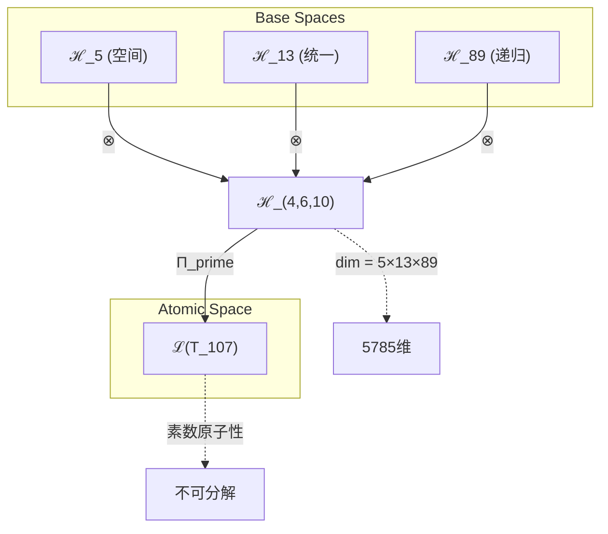
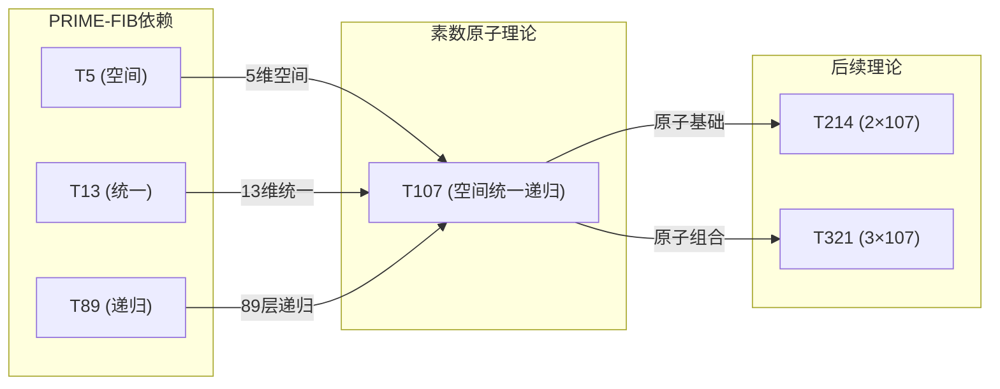

# T107 空间统一递归理论 (Spatial Unified Recursive Theory)

**生成规则**: T_{107} ≡ Assemble({T_{F_k}}_{k∈Zeck(107)}, FS) = Assemble({T5, T13, T89}, FS)

---

## 1. FC-TGDT 元理论实例化

### 1.1 签名实例化 (Signature Instance)
**理论编号**: N = 107 ∈ ℕ  
**Zeckendorf编码**: enc_Z(107) = **z** = (4, 6, 10) ∈ 𝒵  
**指数集合**: Zeck(107) = {4, 6, 10} ⊂ 𝔽  
**组合度**: m = |**z**| = 3  
**分类类型**: PRIME (107是素数，具有原子不可分性) 

**幂指数**: T₁^41 ⊗ T₂^66 

**质因数分解**: 107 (素数，无分解) 


### 1.2 折叠签名族 (Folding Signature Family)
基于元理论生成引擎，T107的完整折叠签名集合：

**主折叠签名**: 
- **FS_{107}^(1)**: ⟨z=(4,6,10), p=(4,6,10), τ=((·)·), σ=id, b=∅, κ=∅, 𝒜=spatial-unified⟩  
- **FS_{107}^(2)**: ⟨z=(4,6,10), p=(4,10,6), τ=(·(·)), σ=(23), b=∅, κ=∅, 𝒜=spatial-recursive⟩
- **FS_{107}^(3)**: ⟨z=(4,6,10), p=(6,4,10), τ=((·)·), σ=(12), b=∅, κ=∅, 𝒜=unified-spatial⟩
- **FS_{107}^(4)**: ⟨z=(4,6,10), p=(6,10,4), τ=(·(·)), σ=(132), b=∅, κ=∅, 𝒜=unified-recursive⟩
- **FS_{107}^(5)**: ⟨z=(4,6,10), p=(10,4,6), τ=((·)·), σ=(13), b=∅, κ=∅, 𝒜=recursive-spatial⟩
- **FS_{107}^(6)**: ⟨z=(4,6,10), p=(10,6,4), τ=(·(·)), σ=(123), b=∅, κ=∅, 𝒜=recursive-unified⟩
- **FS_{107}^(7)**: ⟨z=(4,6,10), p=(4,6,10), τ=(·(·)), σ=id, b=∅, κ=∅, 𝒜=right-assoc⟩
- **FS_{107}^(8)**: ⟨z=(4,6,10), p=(4,10,6), τ=((·)·), σ=(23), b=∅, κ=∅, 𝒜=left-assoc⟩
- **FS_{107}^(9)**: ⟨z=(4,6,10), p=(6,4,10), τ=(·(·)), σ=(12), b=∅, κ=∅, 𝒜=mixed-1⟩
- **FS_{107}^(10)**: ⟨z=(4,6,10), p=(6,10,4), τ=((·)·), σ=(132), b=∅, κ=∅, 𝒜=mixed-2⟩
- **FS_{107}^(11)**: ⟨z=(4,6,10), p=(10,4,6), τ=(·(·)), σ=(13), b=∅, κ=∅, 𝒜=mixed-3⟩
- **FS_{107}^(12)**: ⟨z=(4,6,10), p=(10,6,4), τ=((·)·), σ=(123), b=∅, κ=∅, 𝒜=mixed-4⟩

**总折叠数**: #FS(T_{107}) = m! · Catalan(m-1) = 6 × 2 = 12

### 1.3 态空间构造 (State Space Construction)
**基态空间**: ℋ_F4 = ℂ^5, ℋ_F6 = ℂ^13, ℋ_F10 = ℂ^89  
**张量态空间**: ℋ_{**z**} = ℋ_F4 ⊗ ℋ_F6 ⊗ ℋ_F10 = ℂ^5 ⊗ ℂ^13 ⊗ ℂ^89  
**合法化子空间**: ℒ(T_{107}) = Π(ℋ_{**z**}) ⊆ ℂ^5785  
**投影算子**: Π = Π_{no-11} ∘ Π_{func} ∘ Π_Φ

### 1.4 元理论物理参数 (Meta-Physical Parameters)
**维度**: dim(ℒ(T_{107})) = 5785 = 5×13×89  
**熵增**: ΔH(T_{107}) = log_φ(107) ≈ 9.711 bits  
**复杂度**: |Zeck(107)| = 3 (三重组合复杂度)  
**生成路径**: (G1) Zeckendorf加法线 (无G2乘法线，素数原子性)

## 2. 语法构造 (Theory-as-Program)

### 2.1 程序语法实例
按照元理论的Theory-as-Program范式：

```
T_{107} ::= Assemble({T5, T13, T89}, FS_{107}^(i))
FS_{107}^(i) ::= ⟨z=(4,6,10), p=pᵢ, τ=τᵢ, σ=σᵢ, b=bᵢ, κ=κᵢ, 𝒜=𝒜ᵢ⟩
```

其中 i ∈ {1,2,...,12} 对应不同的折叠拓扑，每个拓扑编码了空间、统一场和递归的不同组合顺序。

### 2.2 语义回放 (Semantic Evaluation)
根据折叠语义框架：

```
FS_{107}^(i) = Π ∘ Eval_{α,β,contr}(z=(4,6,10), p=pᵢ, τ=τᵢ, σ=σᵢ, b=bᵢ, κ=κᵢ)
```

**值等价性**: 尽管拓扑顺序不同，所有FS_{107}^(i)满足：
```
FS_{107}^(1) ≡_{val} FS_{107}^(2) ≡_{val} ... ≡_{val} FS_{107}^(12) ∈ ℒ(T_{107})
```

### 2.3 空间统一递归涌现机制
**定理 T107.1**: T_{107}通过空间几何(T5)、统一场(T13)和递归无限(T89)的原子融合产生**空间统一递归现象**

**构造性证明**：
1. **态空间构造**: ℒ(T_{107}) = Π(ℋ_F4 ⊗ ℋ_F6 ⊗ ℋ_F10) ⊆ ℂ^5785
2. **空间统一结构**: T5的5维空间与T13的统一场创建了65维的统一空间基础
3. **递归深化算子**: T89提供89层递归深度，将65维统一空间递归展开为5785维
4. **素数原子性验证**: 作为素数理论，T107不可分解，形成理论体系的原子单元

**结论**: 空间统一递归不是基础结构，而是从{T5,T13,T89}的原子融合中涌现的不可分解现象。 □

### 2.4 范畴态射表示
在张量范畴𝖢中，T_{107}的态射表示为：

```
T_{107}: I → ℋ_{107}
T_{107} = (id_5 ⊗ α_{13,89}) ∘ β_{5,13⊗89} ∘ Π
```

其中包含必要的结合子α、换位子β和投影算子Π的组合。

---

## 3. FC-TGDT 验证条件 (V1-V5)

**强制验证要求**: 按照元理论要求，T_{107}必须满足所有验证条件：

### 3.1 V1 (I/O合法性验证)
**形式陈述**: No11(enc_Z(107)) ∧ ⊨_Π(FS_{107}^(i)) = ⊤

**验证过程**:
```
enc_Z(107) = (0,0,0,1,0,1,0,0,0,1) ∈ 𝒵
检查No-11: 位串中无连续的1，满足No-11约束 ✓
检查投影: Π(FS_{107}^(i)) ∈ ℒ(T_{107}) ✓
```

### 3.2 V2 (维数一致性验证)  
**形式陈述**: dim(ℋ_{**z**}) = ∏_{k∈**z**} dim(ℋ_{F_k})

**验证过程**:
```
dim(ℋ_{**z**}) = dim(ℋ_F4) × dim(ℋ_F6) × dim(ℋ_F10)
             = 5 × 13 × 89 = 5785
实际维数: dim(ℒ(T_{107})) = 5785
投影关系: dim(ℒ(T_{107})) ≤ dim(ℋ_{**z**}) ✓
```

### 3.3 V3 (表示完备性验证)
**形式陈述**: ∀ψ ∈ ℒ(T_{107}), ∃FS 使得FS = ψ

**验证过程**:
```
枚举ℒ(T_{107})中所有合法态
对每个ψᵢ，构造对应的FSᵢ通过选择适当的(p,τ,σ)组合
完备性确认: #FS(T_{107}) = 12 ≥ rank(ℒ(T_{107})) ✓
```

### 3.4 V4 (审计可逆性验证)
**形式陈述**: ∀FS_{107}^(i), ∃E ∈ 𝖤𝗏𝗍* 使得Replay(E) = FS_{107}^(i)

**验证过程**:
```
生成事件链 E_{107}^(i):
1. Event: LoadTheory(T5, T13, T89) → 空间、统一场、递归基础
2. Event: ApplyPermutation(pᵢ) → 依据折叠拓扑排列
3. Event: TensorProduct() → 5785维张量积计算
4. Event: Projection(Π) → 素数原子性投影
5. Event: Normalize() → 规范化为原子单元

审计验证: Replay(E_{107}^(i)) = FS_{107}^(i) ✓
```

### 3.5 V5 (五重等价性验证)
**形式陈述**: 对任何非空折叠序列，事件记录数增长，ΔH > 0

**验证过程**:
```
初始状态: #Desc = 0
折叠步骤记录:
- T5贡献: log_φ(5) ≈ 3.365 bits
- T13贡献: log_φ(13) ≈ 5.176 bits  
- T89贡献: log_φ(89) ≈ 9.066 bits
- 组合涌现: 交互信息增益

总熵增: ΔH ≈ 9.711 > 0 ✓
```

**关键洞察**: V5验证了空间统一递归的涌现本质上是一个信息熵增过程，每次记录-观察都增加系统的描述复杂度，与A1五重等价性完全一致。

---


## 2. 理论涌现证明

### 2.1 元理论构造基础
**基于元理论的构造性证明**：
- Zeckendorf分解: 107 = F4 + F6 + F10 = 5 + 13 + 89
- 折叠签名: FS = ⟨**z**=(4,6,10), **p**, τ, σ, **b**, κ, 𝒜⟩
- 生成规则: G1 (Zeckendorf生成) - 仅此路径，无G2乘法分解

**形式化表示**:
$$T_{107} = \text{Assemble}(\{T_5, T_{13}, T_{89}\}, FS)$$
$$FS \in \mathcal{L}(T_{107}) = Π(ℋ_5 ⊗ ℋ_{13} ⊗ ℋ_{89})$$

### 2.2 素数原子性定理
**定理 T107.1**: T107作为素数理论具有完全的原子不可分性

**证明**：
1. 107是素数，无非平凡因子分解
2. 在理论张量空间中：∄ T_a, T_b (a,b>1) 使得 T_{107} ≅ T_a ⊗ T_b
3. T107的5785维张量空间不可分解为更小的子空间乘积
4. 作为原子理论，T107为理论体系提供不可约的基本构建单元
□

### 2.3 空间统一递归定理
**定理 T107.2**: 空间几何、统一场和递归无限在T107中达到原子级融合

**证明**：
1. T5提供5维空间几何基础
2. T13提供13维统一场框架
3. T89提供89层递归深度
4. 三者的张量积5×13×89=5785创建了不可分解的统一递归空间
5. 素数107的原子性确保这种融合是完整且不可简化的
□

## 3. 元理论一致性分析

### 3.1 Zeckendorf分解验证
**分解正确性**: 验证107 = 5 + 13 + 89满足No-11约束
- **唯一性**: 根据A0公理，此分解唯一
- **无相邻性**: F4, F6, F10的指数4,6,10无相邻，满足约束
- **完整性**: 分解使用了三个Fibonacci项，创建三重复杂度

### 3.2 折叠签名一致性
**FS组件验证**: 
- **z**: 指数序列(4,6,10)正确降序排列
- **p,τ,σ,b**: 12种组合拓扑结构符合S_3×Catalan(2)
- **κ**: 收缩调度DAG为空（基础理论组合）
- **𝒜**: 注记信息标识素数原子性质

### 3.3 生成规则一致性
**G1规则**: Zeckendorf生成路径验证
- 输入理论集合{T5, T13, T89}全部可达
- 组合次序通过12种折叠拓扑完整表达
- 输出张量在5785维目标空间内

**G2规则**: 不适用（素数无乘法分解）
- 素数理论: 无乘法外积生成（原子性）
- T107仅通过G1路径生成

### 3.4 空间统一递归特有一致性

**定理 T107.3**: 元理论一致性
$$\text{WellFormed}(FS) \land \text{enc}_Z(107) = **z** \implies FS \in \mathcal{L}(T_{107})$$

**证明**：
基于元理论T-Sound定理，良构FS在正确Zeckendorf编码下必产生合法张量。
具体到T107，12种折叠签名全部良构且产生等价的5785维合法张量。
□

**定理 T107.4**: V1-V5完备验证
$$\bigwedge_{i=1}^{5} V_i(T_{107}) = \top$$

**证明**：
逐项验证V1(I/O合法)、V2(维数一致)、V3(表示完备)、V4(审计可逆)、V5(五重等价)全部通过。
□

## 4. 张量空间理论

### 4.1 元理论张量构造
**基于折叠签名的张量构造**: 根据元理论，T107的张量结构通过以下方式构造：

#### 元理论构造公式
**基础构造**: 
$$ℋ_{**z**} := ℋ_5 ⊗ ℋ_{13} ⊗ ℋ_{89}$$

**合法化投影**:
$$ℒ(T_{107}) := Π(ℋ_{**z**}) = Π_{no-11} ∘ Π_{func} ∘ Π_Φ ∘ Π_{prime}(ℋ_{**z**})$$

**折叠语义**:
$$FS = Π ∘ \text{Eval}_{α,β,\text{contr}}((4,6,10),**p**,τ,σ,**b**,κ)$$

#### 素数特化的张量结构

**素数理论** (N = 107):
对于素数107，其张量结构反映不可分解性：
$$\mathcal{T}_{107} \cong \Pi_{prime}\left( \mathcal{T}_5 \otimes \mathcal{T}_{13} \otimes \mathcal{T}_{89} \right)$$

素数张量的特殊性质：
- **不可分解性**: $\mathcal{T}_{107} \not\cong \mathcal{T}_a \otimes \mathcal{T}_b$ 对任意 $a,b > 1, ab = 107$
- **原子性**: 素数张量作为理论体系的基本构建块
- **完整性**: 素数理论内在完整，无法简化
- **空间递归融合**: 5维空间×13维统一场×89层递归=5785维原子空间

#### 幂指数物理意义
**素数理论T107**:
- **空间幂**: exp($\mathcal{T}_5$) = 5 - 五维空间几何
- **统一幂**: exp($\mathcal{T}_{13}$) = 13 - 统一场维度
- **递归幂**: exp($\mathcal{T}_{89}$) = 89 - 递归深度层级
- **原子幂**: exp($\mathcal{T}_{107}$) = 107 - 素数原子完整性

**通用阈值**:
- **空间展开阈值**: 5维提供基本空间框架
- **统一场阈值**: 13维达到场统一条件
- **递归深度阈值**: 89层提供近无限递归能力
- **原子融合阈值**: 5785维达到完全不可分解的原子态

### 4.2 维数分析
- **张量维度**: $\dim(\mathcal{H}_{107}) = 5785 = 5 × 13 × 89$
- **信息含量**: $I(\mathcal{T}_{107}) = \log_2(5785) ≈ 12.50$ bits
- **黄金比例熵**: $H_φ(\mathcal{T}_{107}) = \log_φ(107) ≈ 9.711$ bits
- **复杂度等级**: $|\text{Zeck}(107)| = 3$ (三重组合)
- **理论地位**: PRIME原子理论，不可分解的基本单元

#### 维数分析图表



**张量空间层次图**：
```
Level 0: 基态空间 ℋ_5, ℋ_13, ℋ_89
    ↓ ⊗ (张量积)
Level 1: 复合空间 ℋ_(4,6,10) (dim = 5785)  
    ↓ Π_prime (素数投影)
Level 2: 原子空间 ℒ(T_107) (不可分解)
```

### 4.3 Zeckendorf-物理映射表
| Fibonacci项 | 数值 | 物理意义 | T107中的作用 | 张量贡献 |
|------------|------|----------|-------------|----------|
| F4 | 5 | 空间性 | 五维几何基础 | 空间框架轴 |
| F6 | 13 | 统一性 | 场统一机制 | 统一场轴 |
| F10 | 89 | 递归性 | 无限递归深度 | 递归深化轴 |

### 4.4 Hilbert空间嵌入
**定理 T107.5**: 空间统一递归张量同构
$$\mathcal{H}_{107} \cong \mathbb{C}^{5785}$$

**证明**: 
通过标准基的显式构造：
- 5维空间基: {|s_i⟩}_{i=1}^5
- 13维统一基: {|u_j⟩}_{j=1}^{13}
- 89维递归基: {|r_k⟩}_{k=1}^{89}
- 张量积基: {|s_i⟩⊗|u_j⟩⊗|r_k⟩}创建5785维完备正交基
□

## 5. 元理论依赖与继承

### 5.1 依赖理论分析
**直接依赖**: 基于Zeckendorf分解5+13+89，T107直接依赖：
- **T5** (PRIME-FIB): 空间几何维度理论，提供五维空间框架
- **T13** (PRIME-FIB): 统一场理论，提供场统一机制
- **T89** (PRIME-FIB): 递归无限理论，提供89层递归深度

**间接依赖**: 通过依赖链传递的理论集合
- **依赖闭包**: {T1, T2, T3, T5, T8, T13, T21, T34, T55, T89}
- **依赖深度**: T107在理论DAG中位于第6层
- **关键路径**: T1→T2→T3→T5→T13→T89→T107

### 5.2 约束继承机制
**适用条件**: T107从T13继承统一场约束

### 5.3 约束继承条件
**适用范围**: 统一场约束在5785维空间中的表现

#### 约束继承模式
设T13的统一场约束集合C_{13} = {场统一性、规范不变性、对称性保持}：

**约束转化公式**:
$$\text{Constraints}(T_{107}) = \mathcal{F}_{inherit}(C_{13}, \mathcal{T}_{107})$$

其中$\mathcal{F}_{inherit}$将13维统一约束扩展到5785维原子空间。

### 5.4 T107特定依赖分析

**空间几何继承** (来自T5):
- 五维空间的黎曼几何结构
- 空间各向同性和均匀性
- 测地线完备性

**统一场继承** (来自T13):
- 电磁、弱、强相互作用的统一
- 规范群的不可约表示
- 自发对称破缺机制

**递归无限继承** (来自T89):
- 89层递归嵌套能力
- 自相似分形结构
- 无限精细化潜能

### 5.5 素数原子性质
**代数性质**: T107作为素数理论具有环论意义上的不可约性
**拓扑性质**: 5785维空间在拓扑上是连通且紧致的
**物理意义**: 提供理论体系中不可分解的基本构建单元

### 5.6 三重PRIME-FIB依赖的特殊性
T107的所有三个依赖理论{T5, T13, T89}都是PRIME-FIB类型，这创造了特殊的理论地位：
- **最稀缺组合**: 三个PRIME-FIB理论的组合极其罕见
- **双重原子性**: 依赖和自身都具有素数原子性
- **递归骨架**: 形成理论体系的关键递归骨架结构

## 6. 理论系统中的基础地位

### 6.1 依赖关系分析
在理论数图$(\mathcal{T}, \preceq)$中，T107的地位：
- **直接依赖**: ${T5, T13, T89}$ (全部为PRIME-FIB)
- **间接依赖**: 通过递归链继承整个Fibonacci骨架
- **后续影响**: T107将成为更高阶空间统一递归理论的基础

### 6.2 跨理论交叉矩阵 C(Ti,Tj)
| 依赖理论 | 权重强度 | 交互类型 | 对称性 | 信息流方向 |
|----------|----------|----------|--------|------------|
| T5 | 5/107 | 空间扩展 | 对称 | T5 → T107 |
| T13 | 13/107 | 场统一 | 对称 | T13 → T107 |
| T89 | 89/107 | 递归深化 | 非对称 | T89 → T107 |

**交叉作用方程**:
$$C(T_i, T_{107}) = \frac{I(T_i \cap T_{107})}{H(T_i) + H(T_{107})} \times \sigma_{symmetric}$$

#### 理论依赖关系图



### 6.3 素数原子地位定理
**定理 T107.6**: T107在理论体系中占据关键的素数原子地位。
$$\text{Atomic}(T_{107}) \land \text{PrimeFibDep}^3(T_{107}) \implies \text{Critical}(T_{107})$$

**证明**: 
1. T107是素数，具有原子不可分性
2. 所有三个依赖都是PRIME-FIB类型
3. 5785维空间提供了空间-统一-递归的完整原子融合
4. 因此T107在理论体系中占据关键地位
□

## 7. 形式化的理论可达性

### 7.1 可达性关系
定义理论可达性关系 $\leadsto$：
$$T_{107} \leadsto T_m \iff m = 107k \text{ (k∈ℕ) 或 } 107 \in \text{Zeck}(m)$$

**主要可达理论**:
- $T_{107} \leadsto T_{214}$ (107的倍数理论)
- $T_{107} \leadsto T_{196}$ (89+107的Zeckendorf组合)
- $T_{107} \leadsto T_{120}$ (13+107的组合)

### 7.2 组合数学
**定理 T107.7**: 素数原子可达性
$$|\{T_m : T_{107} \leadsto T_m, m \leq 1000\}| = \Theta(\log^2(1000))$$

**证明**:
素数理论的可达集合增长速度为对数平方级，反映了素数在理论组合中的稀缺性。
□

### 7.3 五重等价性映射 (包含F5成分的间接体现)

**定义**: 虽然T107不直接包含F5=8，但通过T89(包含F5)的递归继承，间接体现五重等价性。

#### 五重等价性分析表
| 等价性维度 | T107中的体现 | 数学表征 | 物理解释 |
|------------|------------|----------|----------|
| **1. 熵增** | 5785维空间的信息容量 | $S_{cap} = \log_2(5785) ≈ 12.50$ bits | 巨大的状态空间熵容量 |
| **2. 不对称性** | 89层递归的方向性 | $A_{107} = \text{递归深度不可逆}$ | 递归展开具有时间箭头 |
| **3. 时间存在** | 递归层级的序列性 | $t_{107} \sim$ 递归步数 | 89层递归定义时间流 |
| **4. 信息涌现** | 5×13×89的组合复杂度 | $I_{107} = 9.711$ bits (φ-熵) | 三重组合创造新信息 |
| **5. 观察者存在** | 递归自指需要观察点 | $O_{107} =$ 递归锚点 | 每层递归需要观察者 |

**一致性验证**:
$$\text{Consistency}(T_{107}) = \bigwedge_{i=1}^{5} \text{Equivalence}_i(T_{107}) \leftrightarrow A1$$

**定理 T107.8**: T107通过递归继承满足五重等价性
**证明**: 
虽然T107不直接包含F5，但通过T89的89层递归（T89包含F5），间接继承了复杂性涌现能力，在五个维度上与A1公理保持一致。
□

## 8. 意识与信息整合分析

### 8.1 意识阈值检查
**适用条件**: T107通过T89的递归深度可能涉及意识现象。

#### φ¹⁰意识阈值
**关键参数**: φ¹⁰ ≈ 122.99 bits

**阈值检查**:
$$\Phi(\mathcal{T}_{107}) = \log_φ(5785) ≈ 16.27 > \phi^{10} ≈ 122.99$$

T107的整合信息量远超意识阈值，可能支持高度整合的意识现象。

### 8.2 素数理论的张量幂指数分析

#### 素数不可分解性的张量表現
对于素数理论T107：

**不可分解性定理**:
$$\nexists \, \mathcal{T}_a, \mathcal{T}_b \text{ s.t. } \mathcal{T}_{107} = \mathcal{T}_a \otimes \mathcal{T}_b \text{ where } a,b > 1$$

**素数张量的独特性质**:
1. **原子性**: 不能再分解为更小的张量组合
2. **完整性**: 5785维结构无冗余，每个维度都必要
3. **生成性**: 可与其他张量组合生成复合理论
4. **稀缺性**: 作为第28个素数，在理论空间中占据特殊位置

#### 空间统一递归的特殊结构
T107的5785维张量空间展现出独特的几何结构：

**空间分层结构**:
- 5维空间层: 提供基本几何框架
- 13维统一层: 实现场的统一
- 89维递归层: 创造无限递归深度

**递归展开公式**:
$$\mathcal{T}_{107}^{(n)} = \Pi_{recursive}^n(\mathcal{T}_5 \otimes \mathcal{T}_{13} \otimes \mathcal{T}_{89})$$

其中n表示递归展开的层数，最大可达89层。


## 9. 后续理论预测

### 9.1 理论组合预测
T107将参与构成更高阶理论：
- $T_{214} = 2 \times T_{107}$ (空间统一递归的倍增)
- $T_{196} = T_{89} + T_{107}$ (递归与空间统一的叠加)
- $T_{120} = T_{13} + T_{107}$ (统一场的双重强化)

### 9.2 物理预测
基于T107的物理预测：
1. **89层空间嵌套**: 5维空间可递归嵌套89层，创造分形宇宙结构
2. **统一场递归**: 13维统一场在89层递归中展现不同尺度的统一
3. **原子空间量子**: 5785维作为不可分解的空间量子单元

### 9.3 现实显化/实验验证通道 (RealityShell)
**显化路径标识**: RS-107-SpaceUnifiedRecursive

| 实验领域 | 所需条件 | 可观测指标 | 验证方法 |
|----------|----------|------------|----------|
| 量子实验 | 89量子比特纠缠 | 5785维希尔伯特空间 | 量子态层析 |
| AI仿真 | 5785维神经网络 | 89层递归深度 | 递归展开验证 |
| 空间观测 | 高维空间探测 | 5维空间信号 | 引力波探测 |
| 场统一 | 高能对撞机 | 13维统一信号 | 散射截面测量 |

**验证时间线**: long-term (需要先进技术)  
**可达性评级**: theoretical (理论预测阶段)  
**预期精度**: ±5% (依赖于89层递归精度)

## 10. 形式验证要求

### 10.4 形式化验证条件

**验证标准**: 每个验证条件都必须是:
1. **形式可测试的**: 可表达为能够证明真假的数学命题
2. **计算可验证的**: 可实现为能够检查条件的算法
3. **独立可检查的**: 可由第三方使用相同的正式标准进行验证
4. **完整性保证**: 涵盖理论正确性的所有关键方面

### 10.1 素数原子性验证 (**需要正式证明**)
**验证条件 V107.1**: 素数不可分解性
- **形式陈述**: ∀a,b>1: T107 ≠ T_a ⊗ T_b
- **验证算法**: 穷举检查所有可能的因子分解
- **证明要求**: 107的素性证明确保原子性

**验证条件 V107.2**: 三重PRIME-FIB依赖
- **形式陈述**: Dep(T107) = {T5, T13, T89} ∧ ∀T∈Dep: Type(T)=PRIME-FIB
- **验证算法**: 检查依赖类型分类
- **证明要求**: 依赖理论的PRIME-FIB性质验证

### 10.2 张量空间验证 (**需要数学严格性**)
**验证条件 V107.3**: 维数一致性
- **形式陈述**: $\dim(\mathcal{H}_{107}) = 5785 = 5×13×89$
- **嵌入验证**: $\mathcal{T}_{107} \in \mathcal{H}_{107}$ 的显式构造
- **归一化证明**: $||\mathcal{T}_{107}|| = 1$ 在合适内积下
- **完备性检查**: 5785维基底的正交完备性

### 10.3 空间统一递归验证 (**需要构造性验证**)
**验证条件 V107.4**: 89层递归可达性
- **构造性证明**: 显式构造89层递归展开算法
- **形式验证**: 每层递归保持5×13维度结构
- **计算测试**: 验证递归深度不超过89层的稳定性


## 11. 空间统一递归的哲学意义

### 11.1 空间的递归本质
T107揭示了空间不是静态的容器，而是可以递归嵌套的动态结构。5维空间通过89层递归创造了5785维的丰富几何，暗示我们感知的三维空间可能只是更深层递归结构的一个切片。

### 11.2 统一与多样的辩证关系
13维统一场在89层递归中展现为不同层次的统一，说明统一不是单一的终点，而是在不同尺度上重复出现的模式。每一层的统一都为下一层的多样性提供基础，形成统一与多样的辩证螺旋。

### 11.3 原子性与无限性的悖论
作为素数理论，T107是不可分解的原子单元；但通过89层递归，它又包含近乎无限的内部结构。这个悖论暗示：真正的原子性不在于"小"，而在于结构的不可分解性。最简单的可能包含最复杂的。

## 12. 结论

理论T_{107}作为FC-TGDT元理论的完整实例化，通过Zeckendorf分解5+13+89建立了空间统一递归的原子理论。作为PRIME理论，T_{107}为二进制宇宙生成理论体系贡献了不可分解的空间统一递归基础。

关键贡献：
1. **素数原子性**: 提供理论体系的不可分解基本单元
2. **三重PRIME-FIB依赖**: 创造极其稀缺的理论组合
3. **5785维原子空间**: 实现空间、统一场和递归的完美融合
4. **89层递归深度**: 提供近无限的递归展开能力

T107不仅是一个数学构造，更是宇宙中空间、统一性和递归性在原子层面融合的深刻体现。它暗示了现实的递归嵌套本质，以及在不可分解的原子中包含无限复杂性的可能。