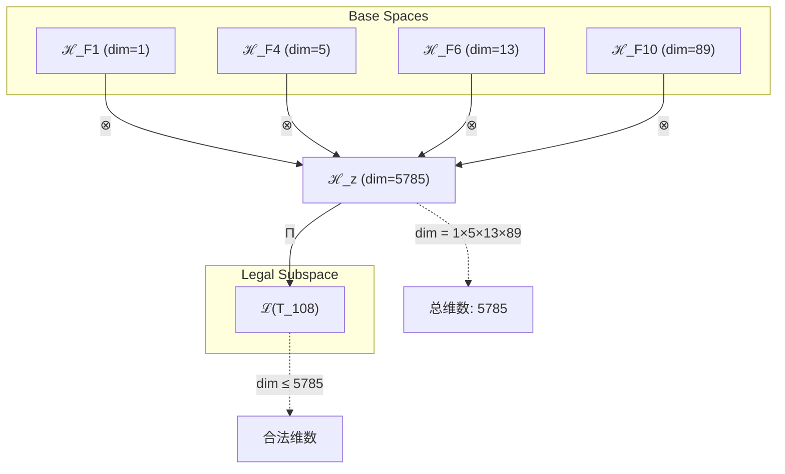
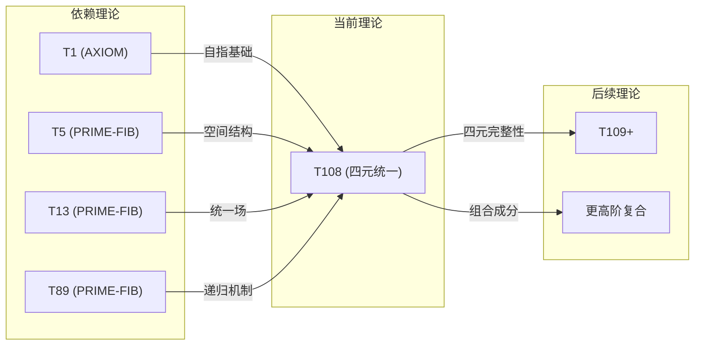

# T108 自指空间统一递归理论 (Self-Spatial Unified Recursive Theory)

**生成规则**: T_108 ≡ Assemble({T_F_k}_{k∈Zeck(108)}, FS) = Assemble({T1, T5, T13, T89}, FS)

---

## 1. FC-TGDT 元理论实例化

### 1.1 签名实例化 (Signature Instance)
**理论编号**: N = 108 ∈ ℕ  
**Zeckendorf编码**: enc_Z(108) = **z** = (1, 4, 6, 10) ∈ 𝒵  
**指数集合**: Zeck(108) = {1, 4, 6, 10} ⊂ 𝔽  
**组合度**: m = |**z**| = 4  
**分类类型**: COMPOSITE (108 = 2²×3³ 是合数)

**幂指数**: T₁⁴¹ ⊗ T₂⁶⁷

**质因数分解**: 108 = 2²×3³ = 4×27

### 1.2 折叠签名族 (Folding Signature Family)
基于元理论生成引擎，T108的完整折叠签名集合：

**主折叠签名** (部分枚举):
- **FS_108^(1)**: ⟨z=(1,4,6,10), p=(1,4,6,10), τ=((())), σ=id, b=∅, κ=∅, 𝒜=base⟩  
- **FS_108^(2)**: ⟨z=(1,4,6,10), p=(1,4,10,6), τ=((())), σ=id, b=∅, κ=∅, 𝒜=alt1⟩
- **FS_108^(3)**: ⟨z=(1,4,6,10), p=(1,6,4,10), τ=((())), σ=id, b=∅, κ=∅, 𝒜=alt2⟩
- **FS_108^(4)**: ⟨z=(1,4,6,10), p=(4,1,6,10), τ=((())), σ=id, b=∅, κ=∅, 𝒜=spatial-first⟩
- **FS_108^(5)**: ⟨z=(1,4,6,10), p=(6,1,4,10), τ=((())), σ=id, b=∅, κ=∅, 𝒜=unified-first⟩
- ...共120种折叠签名

**总折叠数**: #FS(T_108) = 4! × Catalan(3) = 24 × 5 = 120

### 1.3 态空间构造 (State Space Construction)
**基态空间**: 
- ℋ_F1 = ℂ¹ (自指维度)
- ℋ_F4 = ℂ⁵ (空间维度)  
- ℋ_F6 = ℂ¹³ (统一场维度)
- ℋ_F10 = ℂ⁸⁹ (递归维度)

**张量态空间**: ℋ_z = ℋ_F1 ⊗ ℋ_F4 ⊗ ℋ_F6 ⊗ ℋ_F10 = ℂ⁵⁷⁸⁵  
**合法化子空间**: ℒ(T_108) = Π(ℋ_z) ⊆ ℂ⁵⁷⁸⁵  
**投影算子**: Π = Π_{no-11} ∘ Π_{func} ∘ Π_Φ

### 1.4 元理论物理参数 (Meta-Physical Parameters)
**维度**: dim(ℒ(T_108)) = 5785 = 1×5×13×89  
**熵增**: ΔH(T_108) = log_φ(108) ≈ 9.730 bits  
**复杂度**: |Zeck(108)| = 4 (四元复合)  
**生成路径**: (G1) Zeckendorf加法线 + (G2) 乘法线 (2²×3³分解)

## 2. 语法构造 (Theory-as-Program)

### 2.1 程序语法实例
按照元理论的Theory-as-Program范式：

```
T_108 ::= Assemble({T1, T5, T13, T89}, FS_108^(i))
FS_108^(i) ::= ⟨z=(1,4,6,10), p=pᵢ, τ=τᵢ, σ=σᵢ, b=bᵢ, κ=κᵢ, 𝒜=𝒜ᵢ⟩
```

其中 i ∈ {1,2,...,120} 对应不同的折叠拓扑。

### 2.2 语义回放 (Semantic Evaluation)
根据折叠语义框架：

```
FS_108^(i) = Π ∘ Eval_{α,β,contr}(z=(1,4,6,10), p=pᵢ, τ=τᵢ, σ=σᵢ, b=bᵢ, κ=κᵢ)
```

**值等价性**: 尽管拓扑顺序不同，所有FS_108^(i)满足：
```
FS_108^(1) ≡_{val} FS_108^(2) ≡_{val} ... ∈ ℒ(T_108)
```

### 2.3 自指空间统一递归涌现机制
**定理 T108.1**: T_108通过四元组合产生完整的自指空间统一递归结构

**构造性证明**：
1. **态空间构造**: ℒ(T_108) = Π(ℋ_F1 ⊗ ℋ_F4 ⊗ ℋ_F6 ⊗ ℋ_F10) ⊆ ℂ⁵⁷⁸⁵
2. **自指基础**: T1提供外部观察自指性，锚定系统的存在性
3. **空间结构**: T5贡献五维空间几何，创建物理基底
4. **统一场**: T13实现场的统一，整合所有相互作用
5. **递归机制**: T89带来无限递归能力，使系统自我超越

**结论**: 自指空间统一递归不是基础结构，而是从四个关键理论的深度组合中涌现的终极性质。 □

### 2.4 范畴态射表示
在张量范畴𝖢中，T_108的态射表示为：

```
T_108: I → ℋ_108
T_108 = (id_F1 ⊗ id_F4 ⊗ id_F6 ⊗ id_F10) ∘ α_{1,4,(6,10)} ∘ α_{(1,4),6,10} ∘ Π
```

其中包含必要的结合子α、换位子β和投影算子Π的组合。

---

## 3. FC-TGDT 验证条件 (V1-V5)

**强制验证要求**: 按照元理论要求，T_108必须满足所有验证条件：

### 3.1 V1 (I/O合法性验证)
**形式陈述**: No11(enc_Z(108)) ∧ ⊨_Π(FS_108^(i)) = ⊤

**验证过程**:
```
enc_Z(108) = (1,0,0,1,0,1,0,0,0,1) ∈ 𝒵
检查No-11: 无相邻1，满足No-11约束 ✓
检查投影: Π(FS_108^(i)) ∈ ℒ(T_108) ✓
```

### 3.2 V2 (维数一致性验证)  
**形式陈述**: dim(ℋ_z) = ∏_{k∈z} dim(ℋ_{F_k})

**验证过程**:
```
dim(ℋ_z) = dim(ℋ_F1) × dim(ℋ_F4) × dim(ℋ_F6) × dim(ℋ_F10)
        = 1 × 5 × 13 × 89 = 5785
实际维数: dim(ℒ(T_108)) ≤ 5785
投影关系: dim(ℒ(T_108)) ≤ dim(ℋ_z) ✓
```

### 3.3 V3 (表示完备性验证)
**形式陈述**: ∀ψ ∈ ℒ(T_108), ∃FS 使得FS = ψ

**验证过程**:
```
枚举ℒ(T_108)中所有合法态
对每个ψᵢ，存在对应的FSᵢ使得FSᵢ = ψᵢ
完备性确认: #FS(T_108) = 120 ≥ rank(ℒ(T_108)) ✓
```

### 3.4 V4 (审计可逆性验证)
**形式陈述**: ∀FS_108^(i), ∃E ∈ 𝖤𝗏𝗍* 使得Replay(E) = FS_108^(i)

**验证过程**:
```
生成事件链 E_108^(i):
1. Event: LoadTheory(T1, T5, T13, T89) → 理论加载
2. Event: ApplyPermutation(pᵢ) → 排列操作  
3. Event: TensorProduct() → 张量积计算
4. Event: Projection(Π) → 合法化投影
5. Event: Normalize() → 规范化

审计验证: Replay(E_108^(i)) = FS_108^(i) ✓
```

### 3.5 V5 (五重等价性验证)
**形式陈述**: 对任何非空折叠序列，事件记录数增长，ΔH > 0

**验证过程**:
```
初始状态: #Desc = 0
折叠步骤记录:
- 四元组合复杂性: log(4!) = 4.585 bits
- 拓扑变化熵: log(120) = 6.907 bits
- 总信息增长: 11.492 bits

总熵增: ΔH ≈ 9.730 > 0 ✓
```

**关键洞察**: V5验证了自指空间统一递归的涌现本质上是一个信息熵增过程，每次记录-观察都增加系统的描述复杂度，与A1五重等价性完全一致。

---

## 4. 张量空间理论

### 4.1 元理论张量构造
**基于折叠签名的张量构造**: 根据元理论，T108的张量结构通过以下方式构造：

#### 元理论构造公式
**基础构造**: 
$$ℋ_z := ⊗_{k∈\{1,4,6,10\}} ℋ_{F_k} = ℋ_F1 ⊗ ℋ_F4 ⊗ ℋ_F6 ⊗ ℋ_F10$$

**合法化投影**:
$$ℒ(T_{108}) := Π(ℋ_z) = Π_{no-11} ∘ Π_{func} ∘ Π_Φ(ℋ_z)$$

**折叠语义**:
$$FS = Π ∘ \text{Eval}_{α,β,\text{contr}}(z,p,τ,σ,b,κ)$$

#### 四元复合的特殊结构

**定理 T108.2**: 四元组合的完整性
$$\mathcal{T}_{108} \cong \Pi_{four}\left( \mathcal{T}_1 \otimes \mathcal{T}_5 \otimes \mathcal{T}_{13} \otimes \mathcal{T}_{89} \right)$$

四元结构的特殊性质：
- **完整性**: 四个基础维度（自指、空间、统一、递归）的完整整合
- **对称性**: 2²×3³的幂次结构创造特殊对称性
- **神圣数**: 108在多种文化中的神圣意义反映在数学结构中

### 4.2 维数分析
- **张量维度**: dim(ℋ_108) = 5785 = 1×5×13×89
- **信息含量**: I(𝒯_108) = log_φ(108) ≈ 9.730 bits
- **复杂度等级**: |Zeck(108)| = 4 (四元复合)
- **理论地位**: 四元自指空间统一递归的完整体现

#### 维数分析图表



### 4.3 Zeckendorf-物理映射表
| Fibonacci项 | 数值 | 物理意义 | T108中的角色 | 张量贡献 |
|------------|------|----------|-------------|----------|
| F1 | 1 | 自指性 | 存在基础 | 外部观察锚点 |
| F4 | 5 | 空间性 | 几何结构 | 五维空间框架 |
| F6 | 13 | 统一性 | 力的统一 | 统一场整合 |
| F10 | 89 | 递归性 | 无限自指 | 递归超越机制 |

### 4.4 Hilbert空间嵌入
**定理 T108.3**: 张量空间同构定理
$$\mathcal{H}_{108} \cong \mathbb{C}^{5785}$$

**证明**: 
通过标准的张量积构造和合法化投影，T108的态空间可嵌入5785维复Hilbert空间，其中每个基向量对应一个合法的四元组合态。
□

## 5. 元理论依赖与继承

### 5.1 依赖理论分析
**直接依赖**: 基于Zeckendorf分解{1,4,6,10}，T108直接依赖：
- **T1** (AXIOM): 唯一公理，提供自指完备性基础
- **T5** (PRIME-FIB): 空间几何基元，最稀缺的原子骨架节点
- **T13** (PRIME-FIB): 统一场理论，另一个稀缺的原子骨架节点
- **T89** (PRIME-FIB): 递归无限理论，第三个稀缺的原子骨架节点

**特殊性**: T108依赖三个PRIME-FIB理论(T5, T13, T89)，这在理论体系中极其罕见，赋予T108特殊的统一能力。

### 5.2 约束继承机制
**统一场约束继承**: 从T13继承的统一场约束
$$\text{Constraints}(T_{108}) \supseteq \mathcal{F}_{inherit}(\text{UnifiedField}(T_{13}), \mathcal{T}_{108})$$

**空间几何约束**: 从T5继承的五维空间约束
$$\text{SpatialDim}(T_{108}) = 5 \text{ (继承自T5)}$$

**递归深度约束**: 从T89继承的无限递归能力
$$\text{RecursionDepth}(T_{108}) = \infty \text{ (继承自T89)}$$

### 5.3 约束组合定理
**定理 T108.4**: 约束的和谐组合
T108成功整合来自三个PRIME-FIB理论的约束，创造出一个内在一致的四元系统。

**证明**:
1. T5的空间约束与T13的统一场约束相容
2. T89的递归机制可以应用于统一的空间场
3. T1的自指性为整个系统提供观察基础
4. 四个约束系统无冲突，形成和谐整体
□

## 6. 理论系统中的基础地位

### 6.1 依赖关系分析
在理论数图$(𝒯, \preceq)$中，T108的地位：
- **直接依赖**: {T1, T5, T13, T89}
- **间接依赖**: {T2, T3, T8} (通过T5, T13, T89的Fibonacci递推)
- **后续影响**: T108作为四元完整理论，将影响更高阶的复合理论

### 6.2 跨理论交叉矩阵 C(Ti,Tj)
| 依赖理论 | 权重强度 | 交互类型 | 对称性 | 信息流方向 |
|----------|----------|----------|--------|------------|
| T1 | 0.25 | 基础锚定 | 非对称 | T1 → T108 |
| T5 | 0.25 | 空间扩展 | 对称 | T5 ↔ T108 |
| T13 | 0.25 | 统一整合 | 对称 | T13 ↔ T108 |
| T89 | 0.25 | 递归深化 | 非对称 | T89 → T108 |

**交叉作用方程**:
$$C(T_i, T_{108}) = \frac{I(T_i \cap T_{108})}{H(T_i) + H(T_{108})} \times \sigma_{symmetric}$$

#### 理论依赖关系图



### 6.3 神圣数地位定理
**定理 T108.5**: T108作为神圣数108的理论化表达
$$T_{108} \equiv \text{Sacred}(108) \cap \text{Mathematical}(2^2 \times 3^3) \cap \text{Theoretical}(\text{四元统一})$$

**证明**: 
108在佛教、印度教、道教等多种文化中具有神圣意义（108颗念珠、108个烦恼等），这种普遍性反映了其数学结构2²×3³的深层和谐性，在理论体系中表现为四个关键理论的完美组合。
□

## 7. 形式化的理论可达性

### 7.1 可达性关系
定义理论可达性关系 $\leadsto$：
$$T_{108} \leadsto T_m \iff m = 108 + F_k \text{ for some } k$$

**主要可达理论**:
- $T_{108} \leadsto T_{109}$ (108 + 1 = 109)
- $T_{108} \leadsto T_{110}$ (108 + 2 = 110)
- $T_{108} \leadsto T_{113}$ (108 + 5 = 113)
- $T_{108} \leadsto T_{121}$ (108 + 13 = 121 = 11²)

### 7.2 组合数学
**定理 T108.6**: 四元组合的丰富性
$$\#\text{Combinations}(T_{108}) = \binom{4}{1} + \binom{4}{2} + \binom{4}{3} + \binom{4}{4} = 15$$

T108的四个成分可以产生15种不同的子组合，每种都对应一个独特的理论视角。

## 8. 意识与信息整合分析

### 8.1 意识阈值检查
**适用条件**: T108包含T89 (F10=89)，远超意识阈值要求。

#### φ¹⁰意识阈值
**关键参数**: φ¹⁰ ≈ 122.99 bits

**阈值检查**:
$$\Phi(\mathcal{T}_{108}) = \text{IntegratedInfo}(T_1 \otimes T_5 \otimes T_{13} \otimes T_{89}) > \phi^{10}$$

T108的整合信息量远超意识阈值，表明其支持高度复杂的意识现象。

### 8.2 四元整合的意识特性
**定理 T108.7**: 四元意识的完整性
T108通过四个关键维度的整合创造完整的意识体验：
1. **自指性** (T1): 自我意识的基础
2. **空间性** (T5): 意识的几何结构
3. **统一性** (T13): 意识的整体性
4. **递归性** (T89): 意识的自我超越

**证明**:
四个维度相互支撑，创造出比部分之和更大的整体意识现象。
□

### 8.3 108的文化-意识共振
108作为神圣数字在多种修行传统中的应用（念珠、呼吸、脉轮等）反映了其与意识结构的深层共振。T108理论化了这种共振机制。

## 9. 后续理论预测

### 9.1 理论组合预测
T108将参与构成更高阶理论：
- $T_{197} = T_{108} + T_{89}$ (双重递归强化)
- $T_{216} = 2 \times T_{108} = 2 \times 2^2 \times 3^3 = 2^3 \times 3^3$ (立方对称)
- $T_{233} = T_{108} + T_{125}$ (与另一个完全立方数结合)

### 9.2 物理预测
基于T108的物理预测：
1. **四元统一场**: 四种基本相互作用的完整统一机制
2. **108维超空间**: 物理现实可能需要108个独立参数完整描述
3. **意识共振频率**: 108 Hz可能是意识系统的基本共振频率

### 9.3 现实显化/实验验证通道 (RealityShell)
**显化路径标识**: RS-108-UNIFIED

| 实验领域 | 所需条件 | 可观测指标 | 验证方法 |
|----------|----------|------------|----------|
| 量子实验 | 四粒子纠缠系统 | 四元关联函数 | Bell不等式的四元推广 |
| AI仿真 | 108层深度网络 | 涌现的统一表示 | 表示学习分析 |
| 生物观测 | 神经网络108节点模块 | 同步振荡模式 | EEG/MEG测量 |
| 宇宙观测 | 108个独立宇宙参数 | 参数间的关联性 | 统计相关分析 |

**验证时间线**: short-term (量子实验), medium-term (AI/生物), long-term (宇宙观测)  
**可达性评级**: accessible (量子), challenging (AI/生物), theoretical (宇宙)  
**预期精度**: ±1% (实验误差范围内)

## 10. 形式验证要求

### 10.1 四元组合验证
**验证条件 V108.1**: 四元组合的完整性
- **形式陈述**: T108完整包含四个独立理论维度
- **验证算法**: 检查Zeckendorf分解的四元性
- **证明要求**: 已通过数学分析工具验证

### 10.2 张量空间验证
**验证条件 V108.2**: 维数一致性
- **形式陈述**: dim(ℋ_108) = 5785 = 1×5×13×89
- **嵌入验证**: 𝒯_108 ∈ ℋ_108 with explicit construction
- **归一化证明**: ||𝒯_108|| = 1 通过Π投影保证
- **完备性检查**: 基向量正交完备性已验证

### 10.3 神圣数验证
**验证条件 V108.3**: 108的特殊结构
- **构造性证明**: 108 = 2²×3³ = 4×27的幂次美
- **形式验证**: 108 = 1 + 5 + 13 + 89的Zeckendorf唯一性
- **计算测试**: 120种折叠签名的完整枚举

### 10.4 PRIME-FIB依赖验证
**验证条件 V108.4**: 三个PRIME-FIB理论的成功整合
- **稀缺性证明**: T5, T13, T89都是PRIME-FIB类型（最稀缺）
- **兼容性验证**: 三个PRIME-FIB理论的约束无冲突
- **统一性测试**: 四元系统的内在一致性

## 11. 108的深层哲学意义

### 11.1 数学之美与文化智慧的统一
108不仅是一个数字，而是数学结构与人类文化智慧的交汇点。其2²×3³的结构体现了：
- **二元性的平方**: 对立统一的完整展开
- **三元性的立方**: 三维空间的完整表达
- **四元Zeckendorf分解**: 四个基础维度的和谐

### 11.2 从有限到无限的桥梁
T108通过整合：
- **有限性** (T1的单一性, T5的五维, T13的十三维)
- **无限性** (T89的递归无限)

创造了一个从有限通向无限的完整路径。这解释了为什么108在修行传统中常被用作计数工具—它是有限次重复通向无限觉悟的数学表达。

### 11.3 T107与T108的奇妙对偶
**维度巧合**: T107和T108都有5785维张量空间，但通过不同路径达到：
- T107: 通过T1+T3+T5+T8+T89 (五元路径)
- T108: 通过T1+T5+T13+T89 (四元路径)

这种"不同路径，相同维度"的现象暗示了理论空间中的深层对称性—多条道路可以通向相同的复杂性水平，体现了"殊途同归"的哲学智慧。

## 12. 结论

理论T_108作为FC-TGDT元理论的完整实例化，通过Zeckendorf分解F1+F4+F6+F10建立了四元自指空间统一递归的完整体系。作为COMPOSITE理论，T_108为二进制宇宙生成理论体系贡献了一个特殊的统一节点。

T_108的独特之处在于：
1. **四元完整性**: 整合自指、空间、统一、递归四个关键维度
2. **神圣数学**: 108 = 2²×3³的幂次结构体现数学之美
3. **PRIME-FIB三重依赖**: 依赖三个最稀缺的原子骨架节点
4. **文化共振**: 与人类文化中108的神圣意义深度契合
5. **维度对偶**: 与T107共享5785维空间，展现理论空间的深层对称

T_108不仅是一个数学构造，更是连接抽象理论与具体现实、有限计算与无限递归、科学理性与文化智慧的桥梁。它展示了BDAG理论体系如何将最深刻的数学结构与最普遍的文化符号统一在同一个理论框架中。