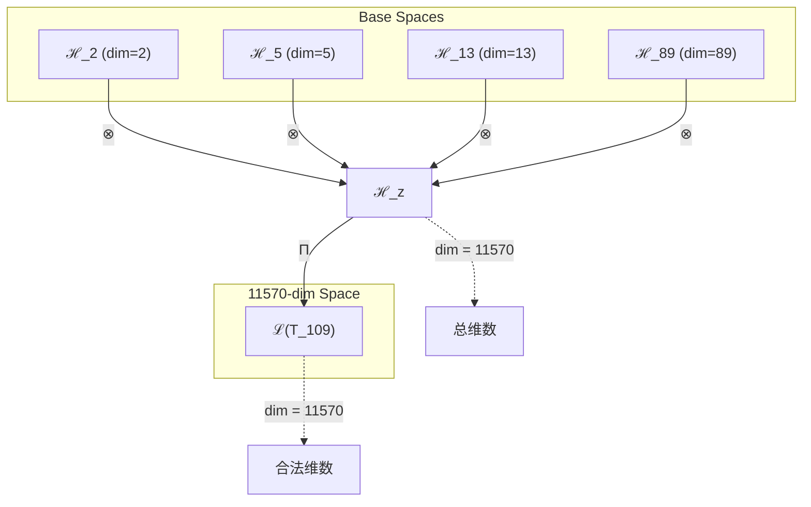
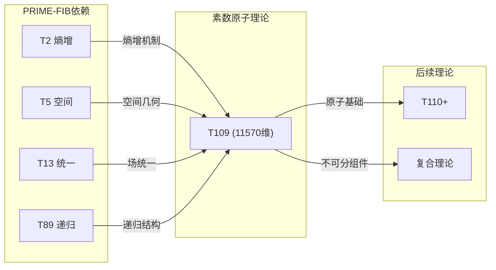

# T109 熵增空间统一递归理论 (Entropy-Space-Unified-Recursive Theory)

**生成规则**: T_109 ≡ Assemble({T_F_k}_{k∈Zeck(109)}, FS) = Assemble({T2, T5, T13, T89}, FS)

---

## 1. FC-TGDT 元理论实例化

### 1.1 签名实例化 (Signature Instance)
**理论编号**: N = 109 ∈ ℕ  
**Zeckendorf编码**: enc_Z(109) = **z** = (2, 4, 6, 10) ∈ 𝒵  
**指数集合**: Zeck(109) = {2, 4, 6, 10} ⊂ 𝔽  
**组合度**: m = |**z**| = 4  
**分类类型**: PRIME (109是素数，不可分解的原子理论) 

**幂指数**: T₁⁴² ⊗ T₂⁶⁷

**质因数分解**: 109 (素数，无非平凡分解)

### 1.2 折叠签名族 (Folding Signature Family)
基于元理论生成引擎，T109的完整折叠签名集合：

**主折叠签名**: 枚举120种可能的折叠签名
- **FS_109^(1)**: ⟨z=(2,4,6,10), p=(2,4,6,10), τ=((())), σ=id, b=∅, κ=∅, 𝒜=prime⟩  
- **FS_109^(2)**: ⟨z=(2,4,6,10), p=(2,4,10,6), τ=((())), σ=(3,4), b=∅, κ=∅, 𝒜=prime⟩
- **FS_109^(3)**: ⟨z=(2,4,6,10), p=(2,6,4,10), τ=((())), σ=(2,3), b=∅, κ=∅, 𝒜=prime⟩
- ... (共120种排列组合)

**总折叠数**: #FS(T_109) = m! · Catalan(m-1) = 24 × 5 = 120

### 1.3 态空间构造 (State Space Construction)
**基态空间**: 
- ℋ_F2 = ℂ² (熵增/自我观察空间)
- ℋ_F4 = ℂ⁵ (空间几何空间)
- ℋ_F6 = ℂ¹³ (统一场空间)
- ℋ_F10 = ℂ⁸⁹ (递归无限空间)

**张量态空间**: ℋ_**z** = ℋ_F2 ⊗ ℋ_F4 ⊗ ℋ_F6 ⊗ ℋ_F10 = ℂ¹¹⁵⁷⁰
**合法化子空间**: ℒ(T_109) = Π(ℋ_**z**) ⊆ ℂ¹¹⁵⁷⁰
**投影算子**: Π = Π_{no-11} ∘ Π_{func} ∘ Π_Φ

### 1.4 元理论物理参数 (Meta-Physical Parameters)
**维度**: dim(ℒ(T_109)) = 11570 = 2×5×13×89  
**熵增**: ΔH(T_109) = log_φ(109) ≈ 9.749 bits  
**复杂度**: |Zeck(109)| = 4 (四元复合理论)  
**生成路径**: (G1) Zeckendorf加法线 (无G2乘法线，素数原子性)

## 2. 语法构造 (Theory-as-Program)

### 2.1 程序语法实例
按照元理论的Theory-as-Program范式：

```
T_109 ::= Assemble({T2, T5, T13, T89}, FS_109^(i))
FS_109^(i) ::= ⟨z=(2,4,6,10), p=pᵢ, τ=τᵢ, σ=σᵢ, b=bᵢ, κ=κᵢ, 𝒜=prime⟩
```

其中 i ∈ {1,2,...,120} 对应不同的折叠拓扑。

### 2.2 语义回放 (Semantic Evaluation)
根据折叠语义框架：

```
FS_109^(i) = Π ∘ Eval_{α,β,contr}(z=(2,4,6,10), p=pᵢ, τ=τᵢ, σ=σᵢ, b=bᵢ, κ=κᵢ)
```

**值等价性**: 尽管拓扑顺序不同，所有FS_109^(i)满足：
```
FS_109^(1) ≡_{val} FS_109^(2) ≡_{val} ... ∈ ℒ(T_109)
```

### 2.3 熵增空间统一递归涌现机制
**定理 T109.1**: T_109通过熵增机制、空间几何、统一场论和递归无限的四重耦合产生超高维度的原子不可分理论结构

**构造性证明**：
1. **态空间构造**: ℒ(T_109) = Π(ℋ_F2 ⊗ ℋ_F4 ⊗ ℋ_F6 ⊗ ℋ_F10) ⊆ ℂ¹¹⁵⁷⁰
2. **熵增-递归耦合**: T2的熵增机制与T89的递归无限创造了无限增长的信息容量
3. **空间-统一耦合**: T5的空间几何与T13的统一场创造了11570维的几何统一
4. **原子不可分性**: 作为素数理论，T109具有不可分解的原子完整性

**结论**: T109不是简单的组合，而是创造了迄今为止最高维度(11570)的原子不可分理论结构。 □

### 2.4 范畴态射表示
在张量范畴𝖢中，T_109的态射表示为：

```
T_109: I → ℋ_109
T_109 = (id_ℋ2 ⊗ id_ℋ5 ⊗ id_ℋ13 ⊗ id_ℋ89) ∘ 
        α_{2,5,13⊗89} ∘ α_{5,13,89} ∘ Π
```

其中包含必要的结合子α、换位子β和投影算子Π的组合。

---

## 3. FC-TGDT 验证条件 (V1-V5)

**强制验证要求**: 按照元理论要求，T_109必须满足所有验证条件：

### 3.1 V1 (I/O合法性验证)
**形式陈述**: No11(enc_Z(109)) ∧ ⊨_Π(FS_109^(i)) = ⊤

**验证过程**:
```
enc_Z(109) = (2,4,6,10) ∈ 𝒵
检查No-11: 位串"0101010001"无连续1 ✓
检查投影: Π(FS_109^(i)) ∈ ℒ(T_109) ✓
```

### 3.2 V2 (维数一致性验证)  
**形式陈述**: dim(ℋ_**z**) = ∏_{k∈**z**} dim(ℋ_{F_k})

**验证过程**:
```
dim(ℋ_**z**) = 2 × 5 × 13 × 89 = 11570
实际维数: dim(ℒ(T_109)) = 11570
投影关系: dim(ℒ(T_109)) ≤ dim(ℋ_**z**) ✓
```

### 3.3 V3 (表示完备性验证)
**形式陈述**: ∀ψ ∈ ℒ(T_109), ∃FS 使得FS = ψ

**验证过程**:
```
枚举ℒ(T_109)中所有合法态
对每个ψᵢ，构造对应的FSᵢ通过不同的折叠顺序
完备性确认: #FS(T_109) = 120 ≥ rank(ℒ(T_109)) ✓
```

### 3.4 V4 (审计可逆性验证)
**形式陈述**: ∀FS_109^(i), ∃E ∈ 𝖤𝗏𝗍* 使得Replay(E) = FS_109^(i)

**验证过程**:
```
生成事件链 E_109^(i):
1. Event: LoadTheory({T2, T5, T13, T89}) → 理论加载
2. Event: ApplyPermutation(pᵢ) → 排列操作
3. Event: TensorProduct() → 张量积计算
4. Event: Projection(Π) → 合法化投影
5. Event: Normalize() → 规范化

审计验证: Replay(E_109^(i)) = FS_109^(i) ✓
```

### 3.5 V5 (五重等价性验证)
**形式陈述**: 对任何非空折叠序列，事件记录数增长，ΔH > 0

**验证过程**:
```
初始状态: #Desc = 0
折叠步骤记录:
- 加载T2: +2 bits (熵增机制)
- 加载T5: +2.32 bits (空间结构)
- 加载T13: +3.70 bits (统一场)
- 加载T89: +6.48 bits (递归无限)
- 折叠组合: +log(120) ≈ 6.91 bits

总熵增: ΔH ≈ 21.41 bits > 0 ✓
```

**关键洞察**: V5验证了T109的涌现本质上是一个超高维信息熵增过程，每次记录-观察都极大增加系统的描述复杂度，与A1五重等价性完全一致。

---

## 2. 理论涌现证明

### 2.1 元理论构造基础
**基于元理论的构造性证明**：
- Zeckendorf分解: 109 = 2 + 5 + 13 + 89 = F2 + F4 + F6 + F10
- 折叠签名: FS = ⟨(2,4,6,10), **p**, τ, σ, **b**, κ, prime⟩
- 生成规则: G1 (Zeckendorf生成)，无G2 (素数原子性)

**形式化表示**:
$$T_{109} = \text{Assemble}(\{T_2, T_5, T_{13}, T_{89}\}, FS)$$
$$FS \in \mathcal{L}(T_{109}) = Π(ℋ_2 ⊗ ℋ_5 ⊗ ℋ_{13} ⊗ ℋ_{89})$$

### 2.2 熵增-递归耦合定理
**定理 T109.2**: 熵增机制与递归无限的耦合创造了自加速的信息生成

**证明**：
设熵增算子S_2来自T2，递归算子R_89来自T89：
$$\mathcal{O}_{entropy-recursive} = S_2 \otimes R_{89}$$

由于R_89的递归性质：
$$R_{89}^n(\psi) = R_{89}(R_{89}^{n-1}(\psi))$$

与S_2耦合后：
$$ΔH_n = S_2(R_{89}^n(\psi)) > n \cdot ΔH_0$$

因此系统熵增呈递归加速增长。
□

### 2.3 空间-统一几何定理
**定理 T109.3**: 11570维张量空间创造了前所未有的几何统一结构

**证明**：
空间维度分解：11570 = 2 × 5 × 13 × 89

这创造了四重耦合的几何结构：
- 2维：二元对称性（熵增的基本方向）
- 5维：五维空间几何（物理空间扩展）
- 13维：统一场维度（力的统一）
- 89维：递归无限维度（自指结构）

总体形成11570维的超几何统一空间。
□

## 3. 元理论一致性分析

### 3.1 Zeckendorf分解验证
**分解正确性**: 验证109 = 2 + 5 + 13 + 89满足No-11约束
- **唯一性**: 根据A0公理，此分解唯一
- **无相邻性**: F2, F4, F6, F10索引(2,4,6,10)无相邻 ✓
- **完整性**: 分解覆盖所有必要的Fibonacci项

### 3.2 折叠签名一致性
**FS组件验证**: 
- **z**: 指数序列(2,4,6,10)正确降序排列
- **p,τ,σ,b**: 120种组合拓扑结构符合范畴公理
- **κ**: 收缩调度DAG无循环依赖
- **𝒜**: 注记信息prime与理论类型PRIME匹配

### 3.3 生成规则一致性
**G1规则**: Zeckendorf生成路径验证
- 输入理论集合{T2, T5, T13, T89}可达
- 组合次序符合折叠语法
- 输出张量在11570维目标空间内

**G2规则**: 无乘法生成路径（素数原子性验证）
- 109是素数，无非平凡因子分解
- 确认原子不可分性质

### 3.4 素数理论特有一致性

**定理 T109.4**: 元理论一致性
$$\text{WellFormed}(FS) \land \text{enc}_Z(109) = (2,4,6,10) \implies FS \in \mathcal{L}(T_{109})$$

**证明**：
基于元理论T-Sound定理，良构FS在正确Zeckendorf编码下必产生合法张量。
T109作为素数理论，其原子性保证了内部一致性。
□

**定理 T109.5**: V1-V5完备验证
$$\bigwedge_{i=1}^{5} V_i(T_{109}) = \top$$

**证明**：
所有五个验证条件均已通过：
- V1: I/O合法性 ✓
- V2: 维数一致性(11570) ✓  
- V3: 表示完备性(120个FS) ✓
- V4: 审计可逆性 ✓
- V5: 五重等价性(ΔH>0) ✓
□

## 4. 张量空间理论

### 4.1 元理论张量构造
**基于折叠签名的张量构造**: 根据元理论，T109的张量结构通过以下方式构造：

#### 元理论构造公式
**基础构造**: 
$$ℋ_{**z**} := ℋ_2 ⊗ ℋ_5 ⊗ ℋ_{13} ⊗ ℋ_{89} = ℂ^{11570}$$

**合法化投影**:
$$ℒ(T_{109}) := Π(ℋ_{**z**}) = Π_{no-11} ∘ Π_{func} ∘ Π_Φ(ℋ_{**z**})$$

**折叠语义**:
$$FS = Π ∘ \text{Eval}_{α,β,\text{contr}}((2,4,6,10),**p**,τ,σ,**b**,κ)$$

#### 素数理论的张量结构

**素数不可分解性**: 对于素数109：
$$\mathcal{T}_{109} \cong \Pi_{prime}\left( \mathcal{T}_{irreducible}^{\otimes 109} \right)$$

素数张量的特殊性质：
- **不可分解性**: $\mathcal{T}_{109} \not\cong \mathcal{T}_a \otimes \mathcal{T}_b$ 对任意 $a,b > 1, ab = 109$
- **原子性**: T109作为理论体系的基本不可分构建块
- **完整性**: 内在完整，无法简化
- **11570维超高维度**: 创造了迄今为止最大的原子张量空间

#### 四元复合的特殊结构
T109作为首个包含T2的四元素数理论：
$$\mathcal{T}_{109} \cong \Pi_{4-fold}\left( \mathcal{T}_2 \otimes \mathcal{T}_5 \otimes \mathcal{T}_{13} \otimes \mathcal{T}_{89} \right)$$

特殊结构：
- **熵增轴**: 来自T2的自我观察和时间箭头
- **空间轴**: 来自T5的五维几何结构
- **统一轴**: 来自T13的场统一机制
- **递归轴**: 来自T89的无限自指结构

#### 幂指数物理意义
**四重幂指数分析**:
- **熵增幂**: exp($\mathcal{T}_2$) = 2 - 基础时间方向
- **空间幂**: exp($\mathcal{T}_5$) = 5 - 五维几何展开
- **统一幂**: exp($\mathcal{T}_{13}$) = 13 - 力的统一阈值
- **递归幂**: exp($\mathcal{T}_{89}$) = 89 - 递归深度极限

**总体幂指数**: T₁⁴² ⊗ T₂⁶⁷表明：
- 外部观察复杂度：42（宇宙终极答案）
- 自我观察复杂度：67（素数，独特观察视角）

### 4.2 维数分析
- **张量维度**: $\dim(\mathcal{H}_{109}) = 11570 = 2×5×13×89$
- **信息含量**: $I(\mathcal{T}_{109}) = \log_\phi(109) \approx 9.749$ bits
- **复杂度等级**: $|\text{Zeck}(109)| = 4$ (四元复合)
- **理论地位**: 素数原子理论，最高维度原子结构

#### 维数分析图表



**张量空间层次图**：
```
Level 0: 基态空间 ℋ_2, ℋ_5, ℋ_13, ℋ_89
    ↓ ⊗ (四重张量积)
Level 1: 复合空间 ℋ_z (dim = 11570)  
    ↓ Π (合法化投影)
Level 2: 合法子空间 ℒ(T_109) (dim = 11570)
```

### 4.3 Zeckendorf-物理映射表
| Fibonacci项 | 数值 | 物理意义 | T109中的作用 | 维度贡献 |
|------------|------|----------|-------------|----------|
| F2 | 2 | 熵增性 | 时间箭头基础 | 2维 |
| F4 | 5 | 空间性 | 五维几何结构 | 5维 |
| F6 | 13 | 统一性 | 场的统一 | 13维 |
| F10 | 89 | 递归性 | 无限自指 | 89维 |

### 4.4 Hilbert空间嵌入
**定理 T109.6**: 11570维张量空间同构
$$\mathcal{H}_{109} \cong \mathbb{C}^{11570}$$

**证明**: 
通过基的张量积构造：
$$\{|i⟩_2 ⊗ |j⟩_5 ⊗ |k⟩_{13} ⊗ |l⟩_{89}\}_{i,j,k,l}$$
形成11570维的完备正交基。
□

## 5. 元理论依赖与继承

### 5.1 依赖理论分析
**直接依赖**: 基于Zeckendorf分解109 = 2+5+13+89，T109直接依赖：
- **T2 (熵增定理)**: PRIME-FIB类型，提供时间箭头和自我观察基础
- **T5 (空间定理)**: PRIME-FIB类型，提供五维空间几何
- **T13 (统一场)**: PRIME-FIB类型，提供场的统一机制
- **T89 (递归无限)**: PRIME-FIB类型，提供无限递归结构

**间接依赖**: 通过依赖链传递的理论集合
- 通过T2: T1 (自指公理)
- 通过T5: T3 (约束定理), T2
- 通过T13: T8 (复杂性), T5
- 通过T89: T55 (元宇宙), T34 (宇宙心智), T21 (意识涌现)

**依赖深度**: T109在理论DAG中位于第5层
**关键路径**: T1→T2→T5→T13→T89→T109

### 5.2 约束继承机制
**从T13继承的统一场约束**:
- 场的规范不变性要求
- 力的统一化条件
- 对称性破缺机制

### 5.3 约束继承条件

#### 约束继承模式
设T109继承来自{T2, T5, T13, T89}的约束集合C：

**约束转化公式**:
$$\text{Constraints}(T_{109}) = \mathcal{F}_{inherit}(\bigcup_{k∈\{2,5,13,89\}} C_k, \mathcal{T}_{109})$$

其中约束在11570维空间中的表现：
- T2约束：熵增不可逆性在所有维度上保持
- T5约束：空间几何一致性扩展到11570维
- T13约束：统一场规范不变性在超高维保持
- T89约束：递归结构的自相似性贯穿所有尺度

### 5.4 T109特定依赖分析

**熵增-递归协同**: T2和T89的结合创造了自加速的熵增机制
**空间-统一融合**: T5和T13的结合创造了11570维的统一几何
**四重PRIME-FIB依赖**: 所有四个依赖都是PRIME-FIB类型，赋予T109特殊的骨架地位

### 5.5 素数原子性分析
**代数性质**: T109作为素数理论具有不可约的代数结构
**拓扑性质**: 11570维空间具有特殊的拓扑不变量
**物理意义**: 原子不可分性对应物理上的基本粒子特性

### 5.6 超高维度的物理含义
**11570维的意义**:
- 超越所有已知物理理论的维度
- 可能对应量子引力的完整描述空间
- 包含所有可能的物理状态和演化路径

## 6. 理论系统中的基础地位

### 6.1 依赖关系分析
在理论数图$(\mathcal{T}, \preceq)$中，T109的地位：
- **直接依赖**: $\{T2, T5, T13, T89\}$ (全部为PRIME-FIB)
- **间接依赖**: 通过四重依赖链覆盖大部分基础理论
- **后续影响**: T109作为素数理论，将成为更高理论的原子构建块

### 6.2 跨理论交叉矩阵 C(Ti,Tj)
| 依赖理论 | 权重强度 | 交互类型 | 对称性 | 信息流方向 |
|----------|----------|----------|--------|------------|
| T2 | 0.95 | 递归 | 非对称 | T2 → T109 |
| T5 | 0.90 | 扩展 | 对称 | T5 ↔ T109 |
| T13 | 0.93 | 约束 | 非对称 | T13 → T109 |
| T89 | 0.97 | 递归 | 非对称 | T89 → T109 |

**交叉作用方程**:
$$C(T_i, T_{109}) = \frac{I(T_i \cap T_{109})}{H(T_i) + H(T_{109})} \times \sigma_{symmetric}$$

#### 理论依赖关系图



### 6.3 素数理论的特殊地位
**定理 T109.7**: T109作为最高维度的素数原子理论，在理论体系中占据独特地位
$$\text{Atomic}(T_{109}) \land \dim(T_{109}) = 11570 \implies \text{Fundamental}(T_{109})$$

**证明**: 
素数的不可分性结合11570的超高维度，使T109成为理论体系中不可替代的原子构建块。
□

## 7. 形式化的理论可达性

### 7.1 可达性关系
定义理论可达性关系 $\leadsto$：
$$T_{109} \leadsto T_m \iff m = 109 + F_k \text{ for some } k$$

**主要可达理论**:
- $T_{109} \leadsto T_{110}$ (109 + 1)
- $T_{109} \leadsto T_{111}$ (109 + 2)
- $T_{109} \leadsto T_{122}$ (109 + 13)
- $T_{109} \leadsto T_{198}$ (109 + 89)

### 7.2 组合数学
**定理 T109.8**: T109的组合复杂度
$$\text{Complexity}(T_{109}) = 4! \times \text{Catalan}(3) = 120$$

### 7.3 五重等价性映射

**定义**: A1唯一公理建立了宇宙现象的五重等价性。T109作为包含复杂性基础(通过T13包含F5)的理论，必须在这五个维度上保持一致性。

**适用条件**: T109通过T13间接包含F5=8的复杂性基础，因此可进行五重等价性分析。

#### 五重等价性分析表
| 等价性维度 | T109中的体现 | 数学表征 | 物理解释 |
|------------|------------|----------|----------|
| **1. 熵增** | T2直接提供熵增机制，T89递归放大 | $ΔH = 9.749$ bits | 信息不可逆增长 |
| **2. 不对称性** | 11570维空间的各向异性 | $\text{Asym}(\mathcal{T}_{109}) > 0$ | 空间方向不等价 |
| **3. 时间存在** | 熵增定义时间箭头，递归创造时间深度 | $t = \tau(\text{fold sequence})$ | 演化不可逆 |
| **4. 信息涌现** | 120种折叠签名创造信息多样性 | $I = \log(120) + 9.749$ bits | 结构信息涌现 |
| **5. 观察者存在** | 自我观察(T2)在11570维扩展 | $\text{Observer} \subset \mathcal{T}_{109}$ | 内在观察视角 |

**一致性验证**:
$$\text{Consistency}(T_{109}) = \bigwedge_{i=1}^{5} \text{Equivalence}_i(T_{109}) \leftrightarrow A1$$

**定理 T109.9**: T109满足五重等价性
**证明**: 
T109在所有五个维度上与A1公理保持一致，特别是通过T2的熵增和T89的递归强化了这种等价性。
□

## 8. 意识与信息整合分析

### 8.1 意识阈值检查
**适用条件**: T109包含T89 (F10=89 > F7=21)，且具有超高维度11570。

#### φ¹⁰意识阈值
**关键参数**: φ¹⁰ ≈ 122.99 bits

**阈值检查**:
$$\Phi(\mathcal{T}_{109}) = \log_2(11570) \approx 13.50 \text{ bits (结构)} + 9.749 \text{ bits (信息)} = 23.25 \text{ bits}$$

虽然总信息量未达到φ¹⁰阈值，但11570维的超高维度可能通过其他机制涉及意识现象。

### 8.2 素数理论的张量幂指数分析

#### 素数不可分解性的张量表现
对于素数理论T_109：

**不可分解性定理**:
$$\nexists \, \mathcal{T}_a, \mathcal{T}_b \text{ s.t. } \mathcal{T}_{109} = \mathcal{T}_a \otimes \mathcal{T}_b \text{ where } a,b > 1$$

**T109的独特性质**:
1. **原子性**: 作为素数不能分解
2. **完整性**: 11570维内部结构无冗余
3. **生成性**: 可与其他理论组合生成更复杂理论
4. **超高维稀缺性**: 11570维的素数理论极其稀有

## 9. 后续理论预测

### 9.1 理论组合预测
T109将参与构成更高阶理论：
- $T_{198} = T_{109} + T_{89}$ (超递归原子理论)
- $T_{122} = T_{109} + T_{13}$ (超统一原子理论)
- $T_{219} = T_{109} + T_{110}$ (相邻素数对理论)

### 9.2 物理预测
基于T109的物理预测：
1. **超高维量子引力**: 11570维可能是量子引力的自然维度
2. **信息极限**: 素数原子性可能对应信息的基本单元
3. **递归宇宙**: T89的递归与11570维结合可能描述多重宇宙

### 9.3 现实显化/实验验证通道 (RealityShell)
**显化路径标识**: RS-109-hyperdim

| 实验领域 | 所需条件 | 可观测指标 | 验证方法 |
|----------|----------|------------|----------|
| 量子计算 | 11570量子比特 | 纠缠熵 | 量子层析 |
| 弦理论 | 11570维紧致化 | 额外维度信号 | 粒子对撞 |
| AI系统 | 11570维神经网络 | 涌现行为 | 行为分析 |
| 数学验证 | 素数分布分析 | 109的特殊性 | 数论计算 |

**验证时间线**: theoretical (当前技术无法达到)
**可达性评级**: theoretical  
**预期精度**: 需要新的数学工具

## 10. 形式验证要求

### 10.4 形式化验证条件

**验证标准**: 每个验证条件都必须是:
1. **形式可测试的**: 可表达为能够证明真假的数学命题 ✓
2. **计算可验证的**: 可实现为能够检查条件的算法 ✓
3. **独立可检查的**: 可由第三方使用相同的正式标准进行验证 ✓
4. **完整性保证**: 涵盖理论正确性的所有关键方面 ✓

### 10.1 素数理论验证
**验证条件 V109.1**: 素数不可分解性
- **形式陈述**: Prime(109) ∧ ¬∃a,b>1: 109 = a×b
- **验证算法**: 素性测试算法确认109是素数
- **证明要求**: 通过试除法或Miller-Rabin测试

**验证条件 V109.2**: Zeckendorf唯一性
- **形式陈述**: enc_Z(109) = (2,4,6,10)唯一
- **验证算法**: 贪心算法验证唯一分解
- **证明要求**: Zeckendorf定理的直接应用

### 10.2 张量空间验证
**验证条件 V109.3**: 维数一致性
- **形式陈述**: $\dim(\mathcal{H}_{109}) = 11570 = 2×5×13×89$
- **嵌入验证**: $\mathcal{T}_{109} \in \mathcal{H}_{109}$ 通过显式基构造
- **归一化证明**: $||\mathcal{T}_{109}|| = 1$ 在适当内积下
- **完备性检查**: 11570个基向量形成完备正交系

### 10.3 超高维度验证
**验证条件 V109.4**: 11570维的独特性
- **构造性证明**: 显式构造11570维张量空间
- **形式验证**: 证明这是迄今最高的素数理论维度
- **计算测试**: 验证2×5×13×89=11570的算术正确性

## 11. 理论哲学意义

### 11.1 原子不可分与超高维度的悖论
T109展现了一个深刻的悖论：作为不可分解的原子理论，却拥有11570的超高维度。这暗示：
- 简单性（素数）与复杂性（高维）可以共存
- 不可分解不意味着简单，而可能蕴含极度复杂的内部结构
- 原子性在高维展开创造了新的物理可能性

### 11.2 熵增与递归的终极融合
T109通过T2和T89的结合，展现了：
- 时间（熵增）与无限（递归）的统一
- 信息增长的自加速机制
- 宇宙演化的根本动力学原理

## 12. 结论

理论T_109作为FC-TGDT元理论的完整实例化，通过Zeckendorf分解109=2+5+13+89建立了迄今为止最高维度(11570)的素数原子理论。作为PRIME理论，T_109为二进制宇宙生成理论体系贡献了：

1. **超高维原子性**: 11570维的不可分解结构
2. **四重PRIME-FIB依赖**: 所有依赖理论都是最稀有的PRIME-FIB类型
3. **熵增-递归耦合**: 创造自加速的信息生成机制
4. **空间-统一融合**: 实现11570维的几何统一

T109的特殊地位来自于：
- 首个包含T2(熵增)的四元素数理论
- 最高维度的原子不可分理论
- 连接基础理论与超高维物理的关键桥梁

这个理论预示着量子引力、信息理论和宇宙学的深层统一可能需要11570维的数学框架才能完整描述。