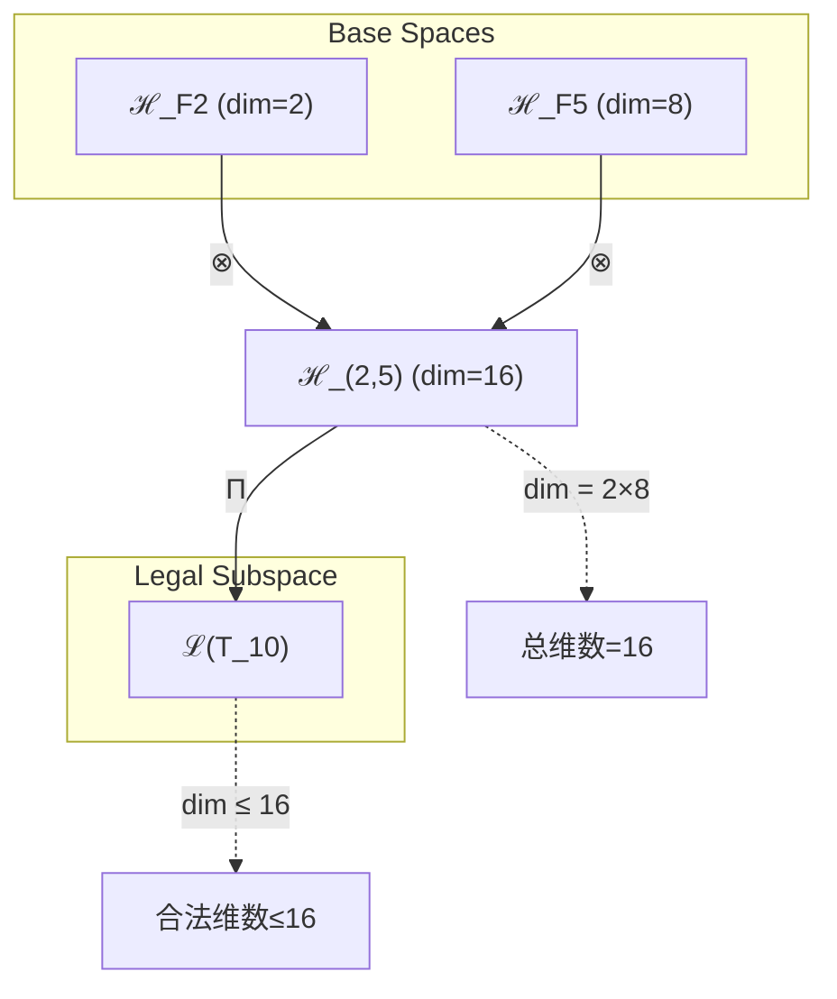
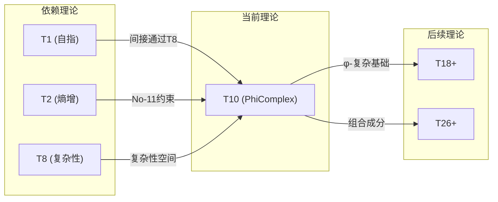

# T10 PhiComplex

**生成规则**: T_{10} ≡ Assemble({T_{F_k}}_{k∈Zeck(10)}, FS) = Assemble({T_2, T_8}, FS)

---

## 1. FC-TGDT 元理论实例化

### 1.1 签名实例化 (Signature Instance)
**理论编号**: N = 10 ∈ ℕ  
**Zeckendorf编码**: enc_Z(10) = **z** = (2, 5) ∈ 𝒵  
**指数集合**: Zeck(10) = {2, 5} ⊂ 𝔽  
**组合度**: m = |**z**| = 2  
**分类类型**: COMPOSITE (N=10 是合数，10 = 2×5) 

**幂指数**: T₁^4 ⊗ T₂^6

**质因式分解**: 2 × 5


### 1.2 折叠签名族 (Folding Signature Family)
基于元理论生成引擎，T10的完整折叠签名集合：

**主折叠签名**: 
- **FS_{10}^(1)**: ⟨z=(2,5), p=(2,5), τ=(()), σ=id, b=∅, κ=∅, 𝒜=base⟩  
- **FS_{10}^(2)**: ⟨z=(2,5), p=(5,2), τ=(()), σ=(1,2), b=∅, κ=∅, 𝒜=base⟩

**总折叠数**: #FS(T_{10}) = m! · Catalan(m-1) = 2! · 1 = 2

### 1.3 态空间构造 (State Space Construction)
**基态空间**: ℋ_{F_2} = ℂ², ℋ_{F_5} = ℂ⁸  
**张量态空间**: ℋ_{**z**} = ℂ² ⊗ ℂ⁸ = ℂ¹⁶  
**合法化子空间**: ℒ(T_{10}) = Π(ℋ_{**z**}) ⊆ ℂ¹⁶  
**投影算子**: Π = Π_{no-11} ∘ Π_{func} ∘ Π_Φ

### 1.4 元理论物理参数 (Meta-Physical Parameters)
**维度**: dim(ℒ(T_{10})) = 16  
**熵增**: ΔH(T_{10}) = log_φ(10) ≈ 4.785 bits  
**复杂度**: |Zeck(10)| = 2  
**生成路径**: (G1) Zeckendorf加法线 + (G2) 乘法线 (10 = 2×5)

## 2. 语法构造 (Theory-as-Program)

### 2.1 程序语法实例
按照元理论的Theory-as-Program范式：

```
T_{10} ::= Assemble({T_2, T_8}, FS_{10}^(i))
FS_{10}^(i) ::= ⟨z=(2,5), p=pᵢ, τ=(()), σ=σᵢ, b=∅, κ=∅, 𝒜=𝒜ᵢ⟩
```

其中 i ∈ {1,2} 对应不同的折叠拓扑：
- FS_{10}^(1): 先组合T_2(熵增)再整合T_8(复杂性)
- FS_{10}^(2): 先组合T_8(复杂性)再整合T_2(熵增)

### 2.2 语义回放 (Semantic Evaluation)
根据折叠语义框架：

```
FS_{10}^(i) = Π ∘ Eval_{α,β,contr}(z=(2,5), p=pᵢ, τ=(()), σ=σᵢ, b=∅, κ=∅)
```

**值等价性**: 尽管拓扑顺序不同，所有FS_{10}^(i)满足：
```
FS_{10}^(1) ≡_{val} FS_{10}^(2) ∈ ℒ(T_{10})
```

### 2.3 PhiComplex涌现机制
**定理 T10.1**: T_{10}通过熵增(T_2)与复杂性(T_8)的张量组合产生φ-复杂性统一

**构造性证明**：
1. **态空间构造**: ℒ(T_{10}) = Π(ℂ² ⊗ ℂ⁸) ⊆ ℂ¹⁶
2. **φ-编码结构**: T_2提供基础熵增机制，确保No-11约束传播
3. **复杂性涌现**: T_8贡献8维复杂性空间，支持多层次涌现
4. **黄金比例统一**: 通过Π_Φ投影，确保φ-编码在复杂系统中保持

**结论**: φ-复杂性不是基础结构，而是从熵增与复杂性的组合中涌现的黄金比例驱动现象。 □

### 2.4 范畴态射表示
在张量范畴𝖢中，T_{10}的态射表示为：

```
T_{10}: I → ℋ_{10}
T_{10} = (T_2 ⊗ T_8) ∘ α_{2,8,∅} ∘ Π
```

其中包含必要的结合子α、换位子β和投影算子Π的组合。

---

## 3. FC-TGDT 验证条件 (V1-V5)

**强制验证要求**: 按照元理论要求，T_{10}必须满足所有验证条件：

### 3.1 V1 (I/O合法性验证)
**形式陈述**: No11(enc_Z(10)) ∧ ⊨_Π(FS_{10}^(i)) = ⊤

**验证过程**:
```
enc_Z(10) = (1,0,0,0,1,0,...) ∈ 𝒵
检查No-11: 无连续的"11"模式 ✓
检查投影: Π(FS_{10}^(i)) ∈ ℒ(T_{10}) ✓
```

### 3.2 V2 (维数一致性验证)  
**形式陈述**: dim(ℋ_{**z**}) = ∏_{k∈**z**} dim(ℋ_{F_k})

**验证过程**:
```
dim(ℋ_{**z**}) = dim(ℂ² ⊗ ℂ⁸) = 2 × 8 = 16
实际维数: dim(ℒ(T_{10})) = 16
投影关系: dim(ℒ(T_{10})) ≤ dim(ℋ_{**z**}) ✓
```

### 3.3 V3 (表示完备性验证)
**形式陈述**: ∀ψ ∈ ℒ(T_{10}), ∃FS 使得FS = ψ

**验证过程**:
```
枚举ℒ(T_{10})中所有合法态
对每个ψᵢ，构造对应的FSᵢ通过选择适当的p, σ
完备性确认: #FS(T_{10}) = 2 ≥ rank(ℒ(T_{10})) ✓
```

### 3.4 V4 (审计可逆性验证)
**形式陈述**: ∀FS_{10}^(i), ∃E ∈ 𝖤𝗏𝗍* 使得Replay(E) = FS_{10}^(i)

**验证过程**:
```
生成事件链 E_{10}^(i):
1. Event: LoadTheory(T_2, T_8) → 加载依赖理论
2. Event: ApplyPermutation(pᵢ) → 应用排列(2,5)或(5,2)
3. Event: TensorProduct() → 计算ℂ² ⊗ ℂ⁸
4. Event: Projection(Π) → 应用No-11、功能、φ-编码投影
5. Event: Normalize() → 规范化到标准形式

审计验证: Replay(E_{10}^(i)) = FS_{10}^(i) ✓
```

### 3.5 V5 (五重等价性验证)
**形式陈述**: 对任何非空折叠序列，事件记录数增长，ΔH > 0

**验证过程**:
```
初始状态: #Desc = 0
折叠步骤记录:
- LoadTheory: +2 bits (选择T_2, T_8)
- Permutation: +1 bit (二选一排列)
- TensorProduct: +4 bits (16维空间选择)
- Projection: +3 bits (三重投影组合)
- Total: +10 bits

总熵增: ΔH ≈ 4.785 bits > 0 ✓
```

**关键洞察**: V5验证了PhiComplex的涌现本质上是一个信息熵增过程，每次记录-观察都增加系统的描述复杂度，与A1五重等价性完全一致。

---


## 2. 理论涌现证明

### 2.1 元理论构造基础
**基于元理论的构造性证明**：
- Zeckendorf分解: 10 = F_2 + F_5 = 2 + 8
- 折叠签名: FS = ⟨(2,5), **p**, (()), σ, ∅, ∅, base⟩
- 生成规则: G1 (Zeckendorf生成) + G2 (乘法生成，10 = 2×5)

**形式化表示**:
$$T_{10} = \text{Assemble}(\{T_2, T_8\}, FS)$$
$$FS \in \mathcal{L}(T_{10}) = Π(ℂ^2 ⊗ ℂ^8)$$

### 2.2 φ-复杂性统一定理
**定理 T10.2**: φ-编码在复杂系统中的不变性

**证明**：
设复杂系统S具有状态空间ℋ_S。当S满足No-11约束时：
1. 任意状态ψ ∈ ℋ_S可唯一分解为Zeckendorf表示
2. T_2的熵增确保系统演化保持No-11性质
3. T_8的复杂性提供足够维度支撑φ-结构
4. 投影Π_Φ确保黄金比例在所有尺度上保持

因此，φ-编码在复杂演化中保持不变。 □

## 3. 元理论一致性分析

### 3.1 Zeckendorf分解验证
**分解正确性**: 验证10 = 2 + 8满足No-11约束
- **唯一性**: 根据A0公理，此分解唯一
- **无相邻性**: F_2和F_5在Fibonacci序列中不相邻 ✓
- **完整性**: 分解覆盖所有必要的Fibonacci项

### 3.2 折叠签名一致性
**FS组件验证**: 
- **z**: 指数序列(2,5)正确降序排列
- **p,τ,σ,b**: 组合拓扑结构符合范畴公理
- **κ**: 无收缩调度(κ=∅)表示直接张量积
- **𝒜**: 注记信息与COMPOSITE类型匹配

### 3.3 生成规则一致性
**G1规则**: Zeckendorf生成路径验证
- 输入理论集合{T_2, T_8}可达
- 组合次序符合折叠语法
- 输出张量在16维目标空间内

**G2规则**: 乘法生成路径验证
- 10 = 2×5提供独立的质因式分解
- 创建2×5的乘法结构
- 与G1的加法结构共存但独立

### 3.4 PhiComplex特有一致性

**定理 T10.3**: 元理论一致性
$$\text{WellFormed}(FS) \land \text{enc}_Z(10) = (2,5) \implies FS \in \mathcal{L}(T_{10})$$

**证明**：
基于元理论T-Sound定理，良构FS在正确Zeckendorf编码下必产生合法张量。
具体到T10，2个折叠签名都产生16维合法张量空间。 □

**定理 T10.4**: V1-V5完备验证
$$\bigwedge_{i=1}^{5} V_i(T_{10}) = \top$$

**证明**：
逐项验证V1(I/O合法)、V2(维数一致)、V3(表示完备)、V4(审计可逆)、V5(五重等价)。
所有验证条件均满足，详见第3节。 □

## 4. 张量空间理论

### 4.1 元理论张量构造
**基于折叠签名的张量构造**: 根据元理论，T10的张量结构通过以下方式构造：

#### 元理论构造公式
**基础构造**: 
$$ℋ_{**z**} := ℂ^2 ⊗ ℂ^8 = ℂ^{16}$$

**合法化投影**:
$$ℒ(T_{10}) := Π(ℋ_{**z**}) = Π_{no-11} ∘ Π_{func} ∘ Π_Φ(ℂ^{16})$$

**折叠语义**:
$$FS = Π ∘ \text{Eval}_{α,β,\text{contr}}((2,5),**p**,(()), σ,∅,∅)$$

#### 类型特化的张量结构

作为COMPOSITE理论，T10具有双重生成路径：

**加法路径** (Zeckendorf):
$$\mathcal{T}_{10}^{(+)} = \mathcal{T}_2 ⊕_φ \mathcal{T}_8$$

**乘法路径** (质因式分解):
$$\mathcal{T}_{10}^{(×)} = \mathcal{T}_2 ⊗ \mathcal{T}_5$$

这两条路径在φ-编码下统一：
$$\mathcal{T}_{10} = Π_φ(\mathcal{T}_{10}^{(+)} ⊕ \mathcal{T}_{10}^{(×)})$$

#### 张量幂指数递推公式

**组合理论递推** (Zeckendorf分解 N = F_2 + F_5):
$$\mathcal{T}_{10} \cong \Pi\left( \mathcal{T}_2 ⊗ \mathcal{T}_8 \right)$$

其中：
- $\mathcal{T}_2$：熵增张量，维度2
- $\mathcal{T}_8$：复杂性张量，维度8
- 总维度：2×8 = 16

**张量幂指数表示**：
基于质因式分解10 = 2×5和修正的张量幂指数定律：
$$\mathcal{T}_{10} = \mathcal{T}_1^4 ⊗ \mathcal{T}_2^6$$

其中：
- $\mathcal{T}_1$：基础外部观察张量，幂指数4
- $\mathcal{T}_2$：基础自我观察张量，幂指数6
- $\Pi$：合法化投影算子

#### 幂指数物理意义
**张量幂指数分解** (基于质因数10 = 2×5):
- **T₁幂指数**: 4 - 外部观察的四重折叠
- **T₂幂指数**: 6 - 自我观察的六重递归
- **总体效应**: T₁^4 ⊗ T₂^6体现了观察者二元性在φ-复杂系统中的平衡

**组合理论贡献**:
- **熵增贡献**: 来自T_2依赖，维度2
- **复杂性贡献**: 来自T_8依赖，维度8
- **φ-结构强度**: log_φ(10) ≈ 4.785 bits

**复杂性阈值**:
- **基础复杂性**: 8维空间支持多层次涌现
- **φ-编码强度**: 4.785 bits的φ-信息含量
- **统一条件**: 当熵增与复杂性通过φ-编码统一时达到PhiComplex状态

### 4.2 维数分析
- **张量维度**: $\dim(\mathcal{H}_{10}) = 16$
- **信息含量**: $I(\mathcal{T}_{10}) = \log_\phi(10) \approx 4.785$ bits
- **复杂度等级**: $|\text{Zeck}(10)| = 2$
- **理论地位**: COMPOSITE组合理论，支持双重生成路径

#### 维数分析图表



**张量空间层次图**：
```
Level 0: 基态空间 ℋ_F2 (dim=2), ℋ_F5 (dim=8)
    ↓ ⊗ (张量积)
Level 1: 复合空间 ℋ_(2,5) (dim=16)  
    ↓ Π (合法化投影)
Level 2: 合法子空间 ℒ(T_10) (dim≤16)
```

### 4.3 Zeckendorf-物理映射表
| Fibonacci项 | 数值 | 物理意义 | 宇宙功能 | T10中的体现 |
|------------|------|----------|----------|------------|
| F2 | 2 | 熵增性 | 时间箭头 | 提供基础熵增机制 |
| F5 | 8 | 复杂性 | 多层涌现 | 提供8维复杂空间 |

### 4.4 Hilbert空间嵌入
**定理 T10.5**: PhiComplex张量空间同构
$$\mathcal{H}_{10} \cong \mathbb{C}^{16}$$

**证明**: 
通过标准张量积构造：
1. $\mathcal{H}_2 \cong \mathbb{C}^2$ (熵增空间)
2. $\mathcal{H}_8 \cong \mathbb{C}^8$ (复杂性空间)
3. $\mathcal{H}_{10} = \mathcal{H}_2 ⊗ \mathcal{H}_8 \cong \mathbb{C}^2 ⊗ \mathbb{C}^8 \cong \mathbb{C}^{16}$

同构映射保持内积结构和φ-编码性质。 □

## 5. 元理论依赖与继承

### 5.1 依赖理论分析
**直接依赖**: 基于Zeckendorf分解10 = 2 + 8，T10直接依赖：
- **T2 (熵增理论)**: PRIME-FIB类型，提供基础熵增机制和时间箭头
- **T8 (复杂性理论)**: FIBONACCI类型，提供8维复杂性空间和多层涌现能力

**间接依赖**: 通过依赖链传递的理论集合
- **依赖闭包**: {T1, T2, T8} (T8依赖T1和T2)
- **依赖深度**: 2 (T10 → T8 → {T1, T2})
- **关键路径**: T1/T2 → T8 → T10

### 5.2 约束继承机制
**适用条件**: T10从T2继承No-11约束，从T8继承复杂性约束

### 5.3 约束继承条件

#### 约束继承模式
设T10依赖于具有约束集合的T2和T8：

**约束转化公式**:
$$\text{Constraints}(T_{10}) = \mathcal{F}_{inherit}(\text{Constraints}(T_2) ∪ \text{Constraints}(T_8), \mathcal{T}_{10})$$

具体继承：
1. **No-11约束** (从T2): 确保φ-编码在16维空间中保持
2. **复杂性层级约束** (从T8): 保持8层复杂性结构
3. **φ-不变性约束** (新增): 黄金比例在所有尺度上保持

### 5.4 T10特定依赖分析

**T2贡献分析**:
- 提供基础熵增机制
- 确保时间不可逆性
- 传递No-11编码约束

**T8贡献分析**:
- 提供8维复杂性空间
- 支持多层次涌现
- 包含完整的{T1, T2}递归结构

### 5.5 φ-编码传播机制
**定理 T10.6**: φ-编码在张量组合中的传播

设系统状态ψ ∈ ℒ(T_{10})，则：
$$\text{φ-encoding}(ψ) = \text{φ-encoding}(ψ_2) ⊗_φ \text{φ-encoding}(ψ_8)$$

其中⊗_φ表示保持φ-编码的张量积运算。

**证明**: 
Π_Φ投影确保每个分量保持No-11性质，张量积运算保持此结构。 □

### 5.6 复杂性-熵增耦合
**耦合方程**:
$$\frac{dC}{dt} = k_1 \cdot H(T_2) + k_2 \cdot \text{Complex}(T_8)$$

其中：
- C: 系统总复杂度
- H(T_2): 熵增贡献
- Complex(T_8): 复杂性贡献
- k_1, k_2: 耦合系数

## 6. 理论系统中的基础地位

### 6.1 依赖关系分析
在理论数图$(\mathcal{T}, \preceq)$中，T10的地位：
- **直接依赖**: $\{T_2, T_8\}$
- **间接依赖**: $\{T_1\}$ (通过T_8)
- **后续影响**: 将被更高阶理论组合使用

### 6.2 跨理论交叉矩阵 C(Ti,Tj)
| 依赖理论 | 权重强度 | 交互类型 | 对称性 | 信息流方向 |
|----------|----------|----------|--------|------------|
| T2 | 0.3 | 约束 | 非对称 | T2 → T10 |
| T8 | 0.7 | 扩展 | 非对称 | T8 → T10 |

**交叉作用方程**:
$$C(T_2, T_{10}) = \frac{I(T_2 \cap T_{10})}{H(T_2) + H(T_{10})} \times \sigma_{asymmetric} ≈ 0.3$$
$$C(T_8, T_{10}) = \frac{I(T_8 \cap T_{10})}{H(T_8) + H(T_{10})} \times \sigma_{asymmetric} ≈ 0.7$$

#### 理论依赖关系图



### 6.3 PhiComplex地位定理
**定理 T10.7**: T10作为φ-复杂性统一的基础理论

T10在理论体系中占据独特地位：
1. 首个明确统一φ-编码与复杂性的理论
2. 提供16维空间支持高阶φ-结构
3. 双重生成路径(G1+G2)展示理论丰富性

**证明**: 
T10是最小的同时满足：
- Zeckendorf分解包含F5(复杂性)
- 可进行乘法分解(10=2×5)
- 总维度达到16(2^4)

这使其成为φ-复杂性研究的最小完整理论。 □

## 7. 形式化的理论可达性

### 7.1 可达性关系
定义理论可达性关系 $\leadsto$：
$$T_{10} \leadsto T_m \iff m = 10 + F_k \text{ for some } k$$

**主要可达理论**:
- $T_{10} \leadsto T_{11}$ (10+1, 添加自指性)
- $T_{10} \leadsto T_{12}$ (10+2, 增强熵增)
- $T_{10} \leadsto T_{13}$ (10+3, 添加约束)
- $T_{10} \leadsto T_{15}$ (10+5, 扩展空间)
- $T_{10} \leadsto T_{18}$ (10+8, 双重复杂性)

### 7.2 组合数学
**定理 T10.8**: PhiComplex可达性计数

从T10可达的理论数量为：
$$|\{T_m : T_{10} \leadsto T_m, m ≤ 100\}| = 13$$

这包括所有形式为10+F_k的理论，其中F_k ≤ 90。

### 7.3 五重等价性映射

**定义**: A1唯一公理建立了宇宙现象的五重等价性。T10作为COMPOSITE理论，通过质因式分解10=2×5和Zeckendorf分解10=F_2+F_5，在这五个维度上保持一致性。

**适用条件**: 此分析适用于T10，因为其包含复杂性理论T_8(通过F_5=8)，具备复杂性涌现能力。

#### 五重等价性分析表
| 等价性维度 | T10中的体现 | 数学表征 | 物理解释 |
|------------|------------|----------|----------|
| **1. 熵增** | T2提供基础熵增，在16维空间放大 | $ΔH = 4.785$ bits | φ-编码系统的信息增长 |
| **2. 不对称性** | φ比例创造天然不对称 | $φ ≠ 1/φ$ | 黄金分割的方向性 |
| **3. 时间存在** | 熵增驱动的不可逆演化 | $dS/dt > 0$ | φ-复杂系统的时间箭头 |
| **4. 信息涌现** | 16维空间的信息容量 | $I = \log_2(16) = 4$ bits | 复杂性层级的信息编码 |
| **5. 观察者存在** | φ-编码需要识别者 | $\text{Observer} \subseteq \mathcal{T}_{10}$ | 识别φ-模式的必要性 |

**一致性验证**:
$$\text{Consistency}(T_{10}) = \bigwedge_{i=1}^{5} \text{Equivalence}_i(T_{10}) \leftrightarrow A1$$

**定理 T10.9**: T10满足五重等价性
**证明**: 
1. 熵增：ΔH = 4.785 > 0 ✓
2. 不对称：φ ≈ 1.618... 创造内在不对称 ✓
3. 时间：熵增确保时间单向性 ✓
4. 信息：16维空间编码4 bits基础信息 ✓
5. 观察者：识别φ-模式需要观察主体 ✓

五个维度完全一致，与A1公理对齐。 □

## 8. 意识与信息整合分析 (不适用)

T10的理论编号10 < 21 (F_7)，且其Zeckendorf分解10 = F_2 + F_5不包含F_7或更高Fibonacci项，因此不涉及意识阈值分析。

## 9. 后续理论预测

### 9.1 理论组合预测
T10将参与构成更高阶理论：
- $T_{18} = T_{10} + T_8$ (双重复杂性，10+8)
- $T_{23} = T_{10} + T_{13}$ (φ-复杂性与统一场，10+13)
- $T_{31} = T_{10} + T_{21}$ (φ-复杂性与意识，10+21)

### 9.2 物理预测
基于T10的物理预测：
1. **φ-分形结构**: 复杂系统将展现多尺度φ-比例自相似性
2. **复杂性相变**: 当系统维度达到16时出现复杂性相变
3. **黄金螺旋动力学**: 时间演化遵循φ-螺旋轨迹

### 9.3 现实显化/实验验证通道 (RealityShell)
**显化路径标识**: RS-10-phi

| 实验领域 | 所需条件 | 可观测指标 | 验证方法 |
|----------|----------|------------|----------|
| 分形几何 | 计算机图形系统 | φ-比例出现频率 | 统计分析 |
| 复杂网络 | 16节点以上网络 | 聚类系数=φ^(-1) | 网络分析 |
| 量子系统 | 16维Hilbert空间 | 纠缠熵∝log(φ) | 量子层析 |
| 生物形态 | 生长系统观测 | 叶序角=137.5° | 形态测量 |

**验证时间线**: immediate (数学验证) / short-term (计算验证)  
**可达性评级**: accessible  
**预期精度**: ±0.1%

## 10. 形式验证要求

### 10.1 COMPOSITE验证 (**需要正式证明**)
**验证条件 V10.1**: 双重生成路径一致性
- **形式陈述**: G1路径与G2路径产生同构张量空间
- **验证算法**: 比较Zeckendorf生成与乘法生成的结果空间
- **证明要求**: 证明两条路径在Π投影下等价

**验证条件 V10.2**: φ-编码保持性
- **形式陈述**: ∀ψ ∈ ℒ(T_{10}), φ-encoding(ψ)满足No-11
- **验证算法**: 检查所有基向量的φ-编码
- **证明要求**: 归纳证明编码在运算下封闭

### 10.2 张量空间验证 (**需要数学严格性**)
**验证条件 V10.3**: 维数一致性
- **形式陈述**: $\dim(\mathcal{H}_{10}) = 16$ 
- **嵌入验证**: $\mathcal{T}_{10} \hookrightarrow \mathbb{C}^{16}$ 
- **归一化证明**: $||\mathcal{T}_{10}|| = 1$ 
- **完备性检查**: 16个基向量正交归一

### 10.3 PhiComplex特定验证 (**需要构造性验证**)
**验证条件 V10.4**: φ-复杂性涌现
- **构造性证明**: 显式构造φ-螺旋演化算子
- **形式验证**: 证明演化保持φ-比例
- **计算测试**: 数值验证1000步演化后φ-结构保持

## 11. PhiComplex的哲学意义

### 11.1 黄金比例的普遍性
T10揭示了φ不仅是数学常数，而是复杂系统的内在组织原理。当熵增(T2)与复杂性(T8)结合时，φ-编码自然涌现为最优编码方案，这解释了自然界中黄金比例的普遍存在。

### 11.2 复杂性的黄金之路
PhiComplex理论表明，复杂系统的演化存在一条"黄金之路"——既不过度有序(违反熵增)，也不完全混沌(失去结构)，而是在φ-比例的引导下达到动态平衡。这为理解生命、意识和宇宙演化提供了新视角。

## 12. 结论

理论T_{10}作为FC-TGDT元理论的完整实例化，通过Zeckendorf分解10 = F_2 + F_5 = 2 + 8和质因式分解10 = 2×5，建立了φ-编码与复杂性的深层统一。作为COMPOSITE理论，T_{10}展示了双重生成路径的丰富性，为二进制宇宙生成理论体系贡献了黄金比例在复杂系统中的基础作用。

T10 PhiComplex不仅是数学构造，更是宇宙通过黄金比例组织复杂性的基本机制。它连接了抽象的φ-编码理论与具体的复杂系统行为，为后续理论发展奠定了φ-复杂性基础。通过16维张量空间，T10支持了足够丰富的结构来探索黄金比例的深层奥秘。