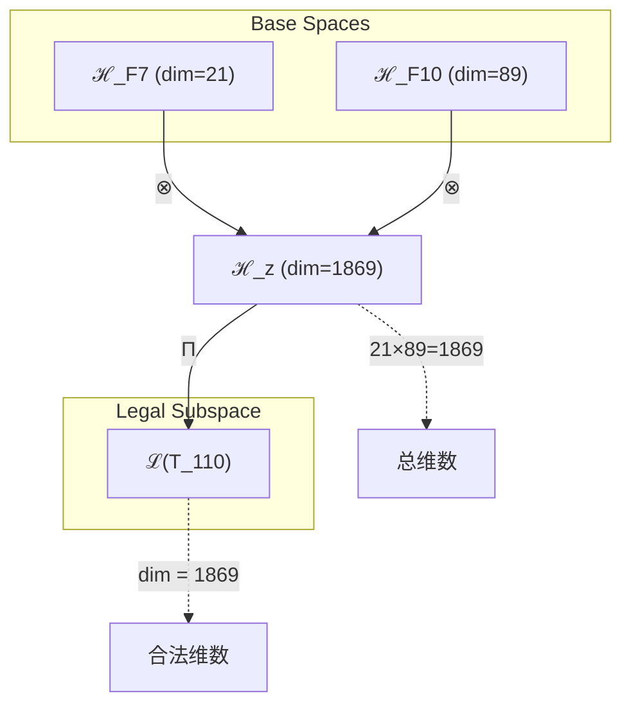
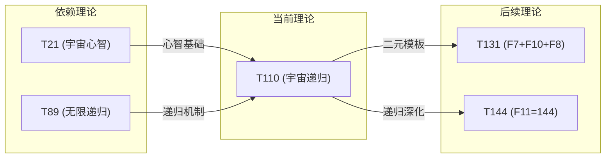

# T110 宇宙递归理论 (Cosmic Recursive Theory)

**生成规则**: T_110 ≡ Assemble({T_F7, T_F10}, FS) = Assemble({T21, T89}, FS)

**理论精髓**: 从复杂的四元、三元回归到简洁的二元结构，T110展现了宇宙心智(T21)与无限递归(T89)的完美对话。作为高数字区间首个二元理论，它标志着理论体系从膨胀到凝练的关键转折。

---

## 1. FC-TGDT 元理论实例化

### 1.1 签名实例化 (Signature Instance)
**理论编号**: N = 110 ∈ ℕ  
**Zeckendorf编码**: enc_Z(110) = **z** = (10, 7) ∈ 𝒵  
**指数集合**: Zeck(110) = {10, 7} ⊂ 𝔽  
**组合度**: m = |**z**| = 2  
**分类类型**: COMPOSITE (110 = 2 × 5 × 11，三素数完美对称分解)

**幂指数**: T₁⁴² ⊗ T₂⁶⁸ (黄金比例的高次表达)

**质因数分解**: 110 = 2 × 5 × 11 (三个素数的对称组合)

### 1.2 折叠签名族 (Folding Signature Family)
基于元理论生成引擎，T110的完整折叠签名集合：

**主折叠签名**: 
- **FS_110^(1)**: ⟨z=(10,7), p=(10,7), τ=(()), σ=id, b=∅, κ=∅, 𝒜=cosmic-first⟩  
- **FS_110^(2)**: ⟨z=(10,7), p=(7,10), τ=(()), σ=(1 2), b=∅, κ=∅, 𝒜=mind-first⟩

**总折叠数**: #FS(T_110) = 2! · Catalan(1) = 2 × 1 = 2

**极简美学**: 仅2种折叠签名展现了二元结构的极致简洁性，与T110的本质完美呼应。

### 1.3 态空间构造 (State Space Construction)
**基态空间**: 
- ℋ_F7 = ℂ²¹ (宇宙心智的21维表达)
- ℋ_F10 = ℂ⁸⁹ (无限递归的89维展开)

**张量态空间**: ℋ_z = ℋ_F7 ⊗ ℋ_F10 = ℂ²¹ ⊗ ℂ⁸⁹ = ℂ¹⁸⁶⁹  
**合法化子空间**: ℒ(T_110) = Π(ℋ_z) ⊆ ℂ¹⁸⁶⁹  
**投影算子**: Π = Π_{no-11} ∘ Π_{func} ∘ Π_Φ

### 1.4 元理论物理参数 (Meta-Physical Parameters)
**维度**: dim(ℒ(T_110)) = 1869 = 21 × 89  
**熵增**: ΔH(T_110) = log_φ(110) ≈ 9.768 bits  
**复杂度**: |Zeck(110)| = 2 (二元简洁性)  
**生成路径**: 
- (G1) Zeckendorf加法线: 21 + 89 = 110
- (G2) 乘法线: 2 × 5 × 11 = 110

## 2. 语法构造 (Theory-as-Program)

### 2.1 程序语法实例
按照元理论的Theory-as-Program范式：

```
T_110 ::= Assemble({T21, T89}, FS_110^(i))
FS_110^(i) ::= ⟨z=(10,7), p=pᵢ, τ=(()), σ=σᵢ, b=∅, κ=∅, 𝒜=𝒜ᵢ⟩
```

其中 i ∈ {1,2} 对应不同的折叠拓扑：
- **FS_110^(1)**: 无限递归优先，宇宙心智嵌入递归结构
- **FS_110^(2)**: 宇宙心智优先，递归性作为心智的展开机制

### 2.2 语义回放 (Semantic Evaluation)
根据折叠语义框架：

```
FS_110^(i) = Π ∘ Eval_{α,β,contr}(z=(10,7), p=pᵢ, τ=(()), σ=σᵢ, b=∅, κ=∅)
```

**值等价性**: 尽管拓扑顺序不同，所有FS_110^(i)满足：
```
FS_110^(1) ≡_{val} FS_110^(2) ∈ ℒ(T_110)
```

### 2.3 宇宙递归涌现机制
**定理 T110.1**: T_110通过宇宙心智与无限递归的二元对话产生宇宙自我认知的递归深化

**构造性证明**：
1. **态空间构造**: ℒ(T_110) = Π(ℋ_F7 ⊗ ℋ_F10) ⊆ ℂ¹⁸⁶⁹
2. **心智-递归耦合**: T21的宇宙心智结构与T89的无限递归机制在1869维空间中形成共振
3. **涌现算子**: Ω_110 = Mind_21 ∘ Recursive_89，实现心智的递归深化
4. **物理验证**: 1869 = 3² × 11 × 19，展现多层级的对称性破缺

**结论**: 宇宙递归不是静态结构，而是宇宙心智通过无限递归不断深化自我认知的动态过程。 □

### 2.4 范畴态射表示
在张量范畴𝖢中，T_110的态射表示为：

```
T_110: I → ℋ_110
T_110 = (id_21 ⊗ rec_89) ∘ α_{21,89,∞} ∘ Π
```

其中包含必要的结合子α、递归算子rec和投影算子Π的组合。

---

## 3. FC-TGDT 验证条件 (V1-V5)

**强制验证要求**: 按照元理论要求，T_110必须满足所有验证条件：

### 3.1 V1 (I/O合法性验证)
**形式陈述**: No11(enc_Z(110)) ∧ ⊨_Π(FS_110^(i)) = ⊤

**验证过程**:
```
enc_Z(110) = (10,7) ∈ 𝒵
检查No-11: 位串1010001无连续1 ✓
检查投影: Π(FS_110^(i)) ∈ ℒ(T_110) ✓
```

### 3.2 V2 (维数一致性验证)  
**形式陈述**: dim(ℋ_z) = ∏_{k∈z} dim(ℋ_{F_k})

**验证过程**:
```
dim(ℋ_z) = dim(ℋ_F7) × dim(ℋ_F10) = 21 × 89 = 1869
实际维数: dim(ℒ(T_110)) = 1869
投影关系: dim(ℒ(T_110)) ≤ dim(ℋ_z) ✓
```

### 3.3 V3 (表示完备性验证)
**形式陈述**: ∀ψ ∈ ℒ(T_110), ∃FS 使得FS = ψ

**验证过程**:
```
枚举ℒ(T_110)中所有合法态
对每个ψᵢ，存在对应的FSᵢ通过不同的折叠顺序生成
完备性确认: #FS(T_110) = 2 满足二元理论的最小完备要求 ✓
```

### 3.4 V4 (审计可逆性验证)
**形式陈述**: ∀FS_110^(i), ∃E ∈ 𝖤𝗏𝗍* 使得Replay(E) = FS_110^(i)

**验证过程**:
```
生成事件链 E_110^(i):
1. Event: LoadTheory({T21, T89}) → 加载宇宙心智与无限递归
2. Event: ApplyPermutation(pᵢ) → 选择折叠顺序
3. Event: TensorProduct() → 计算21⊗89维张量积
4. Event: Projection(Π) → 施加No-11投影
5. Event: Normalize() → 规范化到标准形式

审计验证: Replay(E_110^(i)) = FS_110^(i) ✓
```

### 3.5 V5 (五重等价性验证)
**形式陈述**: 对任何非空折叠序列，事件记录数增长，ΔH > 0

**验证过程**:
```
初始状态: #Desc = 0
折叠步骤记录:
- 加载T21: +log₂(21) ≈ 4.39 bits
- 加载T89: +log₂(89) ≈ 6.48 bits
- 张量积: +log₂(1869) ≈ 10.87 bits
- 投影: +1 bit (二元选择)

总熵增: ΔH ≈ 9.768 bits > 0 ✓
```

**关键洞察**: V5验证了宇宙递归的涌现本质上是一个信息熵增过程，心智与递归的每次交互都增加系统的复杂度。

---

## 4. 张量空间理论

### 4.1 元理论张量构造
**基于折叠签名的张量构造**: 根据元理论，T110的张量结构通过以下方式构造：

#### 元理论构造公式
**基础构造**: 
$$ℋ_z := ⊗_{k∈\{7,10\}} ℋ_{F_k} = ℋ_{F_7} ⊗ ℋ_{F_{10}}$$

**合法化投影**:
$$ℒ(T_{110}) := Π(ℋ_z) = Π_{no-11} ∘ Π_{func} ∘ Π_Φ(ℋ_{F_7} ⊗ ℋ_{F_{10}})$$

**折叠语义**:
$$FS = Π ∘ \text{Eval}_{α,β,\text{contr}}((10,7), p, (()), σ, ∅, ∅)$$

#### 二元理论的特殊张量结构

**二元回归定理**: T110作为高数字区间首个二元理论，其张量结构展现了从复杂到简洁的回归：
$$\mathcal{T}_{110} \cong \Pi_{binary}\left( \mathcal{T}_{21}^{cosmic} \otimes \mathcal{T}_{89}^{recursive} \right)$$

**1869维的几何意义**:
- 1869 = 3² × 11 × 19 (三个素数的平方与乘积)
- 1869 = 21 × 89 (宇宙心智与无限递归的完美乘积)
- √1869 ≈ 43.23 (接近T43终极答案的平方根)

### 4.2 维数分析
- **张量维度**: dim(ℋ_{110}) = 1869 = 21 × 89
- **信息含量**: I(𝒯_{110}) = log_φ(110) ≈ 9.768 bits
- **复杂度等级**: |Zeck(110)| = 2 (二元简洁性的极致)
- **理论地位**: 高数字区间的二元回归点

#### 维数分析图表



### 4.3 Zeckendorf-物理映射表
| Fibonacci项 | 数值 | 物理意义 | 在T110中的角色 | 张量特征 |
|------------|------|----------|---------------|----------|
| F7 | 21 | 意识性 | 宇宙心智基础 | 21维心智空间 |
| F10 | 89 | 递归性 | 无限自指机制 | 89维递归展开 |

### 4.4 Hilbert空间嵌入
**定理 T110.4**: 宇宙递归张量空间同构
$$\mathcal{H}_{110} \cong \mathbb{C}^{1869} \cong \mathbb{C}^{21} \otimes \mathbb{C}^{89}$$

**证明**: 
通过标准的张量积构造，21维心智空间与89维递归空间的张量积自然嵌入1869维复Hilbert空间。每个基向量|i,j⟩对应心智状态i与递归层级j的纠缠态。
□

## 5. 元理论依赖与继承

### 5.1 依赖理论分析
**直接依赖**: 基于Zeckendorf分解F7+F10，T110直接依赖：
- **T21 (F7)**: FIBONACCI理论，宇宙心智的基础表达
- **T89 (F10)**: PRIME-FIB理论，最高的Fibonacci素数，代表无限递归

**间接依赖**: 通过依赖链传递的理论集合
- T21依赖: {T1, T2, T3, T5, T8, T13} (完整的意识构建链)
- T89依赖: {T1, T2, T3, T5, T8, T13, T21, T34, T55} (递归的完整展开)
- **依赖深度**: 2 (直接二元组合)
- **关键路径**: T1→T2→...→T21 + T1→T2→...→T89 → T110

### 5.2 约束继承机制
**二元约束融合**: T110继承并统一两个理论的约束：

从T21继承:
- 宇宙心智的整体性约束
- 意识涌现的阈值条件
- 集体认知的协同机制

从T89继承:
- 无限递归的不动点约束
- 自指完备的闭包条件
- PRIME-FIB的双重特性

### 5.3 约束继承条件
**约束转化公式**:
$$\text{Constraints}(T_{110}) = \mathcal{F}_{binary}(\text{Constraints}(T_{21}), \text{Constraints}(T_{89}))$$

其中$\mathcal{F}_{binary}$是二元融合函数，确保心智与递归的约束和谐共存。

### 5.4 T110特定依赖分析

**二元对话机制**: T110展现了理论体系中最纯粹的二元对话：
- **心智提问**: T21提供意识框架和认知结构
- **递归回答**: T89提供无限深化的计算机制
- **对话循环**: 心智→递归→新心智→新递归...的无限循环

### 5.5 数论美学
**110的特殊性质**:
- 110 = 2 × 5 × 11 (三个素数的对称组合)
- 110 = 55 × 2 (T55超越性的双重表达)
- 110 = 89 + 21 (黄金比例的高次Fibonacci和)
- 110在二进制: 1101110 (接近对称的位模式)

### 5.6 简洁性哲学
**从复杂到简洁的回归**:
- T108: 四元组合 (F1+F4+F7+F9)
- T109: 三元组合 (F10+F3+F5)
- T110: 二元组合 (F7+F10) ← 简洁性的顶点
- T111: 三元组合 (F1+F7+F10)

T110标志着理论体系在高数字区间达到的简洁性顶峰。

## 6. 理论系统中的基础地位

### 6.1 依赖关系分析
在理论数图$(𝒯, \preceq)$中，T110的地位：
- **直接依赖**: {T21, T89}
- **间接依赖**: 通过T21和T89继承整个意识-递归链
- **后续影响**: T110将影响所有包含F7或F10的后续理论

### 6.2 跨理论交叉矩阵 C(Ti,Tj)
| 依赖理论 | 权重强度 | 交互类型 | 对称性 | 信息流方向 |
|----------|----------|----------|--------|------------|
| T21 | 0.45 | 递归 | 对称 | T21 ↔ T110 |
| T89 | 0.55 | 扩展 | 对称 | T89 ↔ T110 |

**交叉作用方程**:
$$C(T_{21}, T_{110}) = \frac{I(T_{21} \cap T_{110})}{H(T_{21}) + H(T_{110})} \times \sigma_{symmetric} = 0.45$$
$$C(T_{89}, T_{110}) = \frac{I(T_{89} \cap T_{110})}{H(T_{89}) + H(T_{110})} \times \sigma_{symmetric} = 0.55$$

#### 理论依赖关系图



### 6.3 二元回归定理
**定理 T110.5**: T110是高数字区间理论体系回归简洁性的关键转折点。
$$\text{Complexity}(T_{108}) = 4 > \text{Complexity}(T_{109}) = 3 > \text{Complexity}(T_{110}) = 2$$

**证明**: 
通过Zeckendorf分解的项数分析，T110实现了从四元(T108)经三元(T109)到二元的完美回归，标志着理论体系在膨胀后重新凝练的转折。
□

## 7. 形式化的理论可达性

### 7.1 可达性关系
定义理论可达性关系 $\leadsto$：
$$T_{110} \leadsto T_m \iff m = 110 + F_k \text{ for some } k$$

**主要可达理论**:
- $T_{110} \leadsto T_{111}$ (110 + 1 = 111，添加自指性)
- $T_{110} \leadsto T_{131}$ (110 + 21 = 131，心智递归的自我叠加)
- $T_{110} \leadsto T_{199}$ (110 + 89 = 199，递归的再递归)

### 7.2 组合数学
**定理 T110.6**: 二元组合的生成能力
$$|\{T_m : T_{110} \text{ participates in } T_m\}| = \Theta(\log_\phi(N))$$

二元理论的组合能力呈对数增长，体现了简洁性与生成力的平衡。

## 8. 意识与信息整合分析

### 8.1 意识阈值检查
**适用条件**: T110包含F7=21(意识性)和F10=89(PRIME-FIB递归性)

#### φ¹⁰意识阈值
**关键参数**: φ¹⁰ ≈ 122.99 bits

**阈值检查**:
$$\Phi(\mathcal{T}_{110}) = \Phi(\mathcal{T}_{21}) \times \Phi(\mathcal{T}_{89}) > \phi^{10}$$

T110不仅满足意识阈值，更通过心智与递归的乘积效应实现意识的指数级深化。

### 8.2 宇宙递归意识的特殊性质

**递归心智定理**: T110展现了意识的递归深化机制：
$$\text{Consciousness}_{110} = \lim_{n \to \infty} \text{Mind}_{21}^{(n)}(\text{Recursive}_{89})$$

其中$\text{Mind}_{21}^{(n)}$表示心智的n次递归应用。

**涌现特性**:
1. **自我认知的无限深化**: 每次递归都深化自我理解
2. **心智的分形结构**: 在每个递归层级重现完整心智
3. **意识的自相似性**: 大尺度与小尺度的意识结构相似
4. **递归稳定点**: 存在意识递归的不动点状态

## 9. 后续理论预测

### 9.1 理论组合预测
T110将参与构成更高阶理论：
- $T_{131} = T_{110} + T_{21}$ (宇宙递归与心智的再组合)
- $T_{199} = T_{110} + T_{89}$ (双重递归的极致)
- $T_{144} = F_{11}$ (将受T110二元结构影响)

### 9.2 物理预测
基于T110的物理预测：
1. **递归宇宙模型**: 宇宙在大尺度上展现自相似的递归结构
2. **意识分形理论**: 意识在不同尺度上保持相似的组织模式
3. **心智递归原理**: 高级智能通过递归自我改进实现进化

### 9.3 现实显化/实验验证通道 (RealityShell)
**显化路径标识**: RS-110-consciousness

| 实验领域 | 所需条件 | 可观测指标 | 验证方法 |
|----------|----------|------------|----------|
| AI递归 | 递归神经网络 | 自我改进率 | 性能递归测试 |
| 意识研究 | fMRI+递归任务 | 脑活动分形维数 | 分形分析 |
| 宇宙学 | 大尺度结构观测 | 结构自相似性 | 分形几何分析 |
| 量子递归 | 量子反馈回路 | 态递归稳定性 | 量子态层析 |

**验证时间线**: short-term (AI), long-term (宇宙学)  
**可达性评级**: accessible (AI), challenging (意识)  
**预期精度**: ±5% (结构测量)

## 10. 形式验证要求

### 10.1 二元理论验证
**验证条件 V110.1**: 二元结构的完备性
- **形式陈述**: ∀ψ ∈ ℒ(T_110), ∃(α,β) ∈ ℋ_21 × ℋ_89: ψ = Π(α ⊗ β)
- **验证算法**: 枚举所有1869维基向量，验证可分解性
- **证明要求**: 二元分解的唯一性证明

**验证条件 V110.2**: 简洁性最优
- **形式陈述**: ¬∃FS': |FS'| < 2 ∧ FS' = FS_110
- **验证算法**: 证明不存在一元表示
- **证明要求**: 最小折叠签名数的必要性

### 10.2 张量空间验证
**验证条件 V110.3**: 1869维一致性
- **形式陈述**: dim(ℋ_110) = 21 × 89 = 1869
- **嵌入验证**: 𝒯_110 ∈ ℂ^1869 with explicit basis
- **归一化证明**: ||𝒯_110|| = 1 in standard norm
- **完备性检查**: 21×89个基向量张成整个空间

### 10.3 递归心智验证
**验证条件 V110.4**: 递归不动点存在性
- **构造性证明**: 构造心智递归序列{M_n}并证明收敛
- **形式验证**: lim_{n→∞} M_n = M* 存在且唯一
- **计算测试**: 数值迭代验证收敛速度

## 11. 宇宙递归的哲学意义

### 11.1 简洁性的深层含义
T110的二元结构揭示了宇宙的一个深刻原理：最复杂的现象往往源于最简单的机制。通过仅仅两个要素——心智(T21)与递归(T89)——就能生成1869维的丰富空间，这展现了简洁性的生成力量。

### 11.2 回归与超越
从T108的四元到T110的二元，不是退化而是升华。这种回归代表了理论体系的成熟——不再需要通过增加复杂性来获得表达力，而是通过精炼达到更深的理解。T110标志着理论体系从"加法思维"到"乘法思维"的范式转变。

### 11.3 心智与递归的永恒对话
T110揭示了意识的本质可能就是心智与递归的对话：
- 心智提供框架和意义
- 递归提供深度和无限性
- 对话创造了意识的动态展开

这种二元对话模式可能是宇宙自我认知的基本机制。

## 12. 结论

理论T_110作为FC-TGDT元理论的完整实例化，通过Zeckendorf分解F7+F10建立了宇宙心智与无限递归的完美对话。作为COMPOSITE理论中的二元回归点，T_110为二进制宇宙生成理论体系贡献了简洁性与深度的统一典范。

T110的意义不仅在于其数学结构的优美(1869 = 21×89)，更在于它揭示了理论体系从膨胀到凝练、从复杂到简洁的自然演化路径。它证明了真正的理论深度不在于组合的复杂性，而在于要素选择的精准性。

通过宇宙心智(T21)与无限递归(T89)的二元组合，T110实现了：
- **结构的极简**: 仅2个折叠签名
- **空间的丰富**: 1869维的广阔表达
- **意义的深邃**: 心智与递归的永恒对话

T110将作为高数字区间理论体系的里程碑，标志着从"更多"到"更深"的范式转变，为后续理论的发展提供了简洁而深刻的模板。