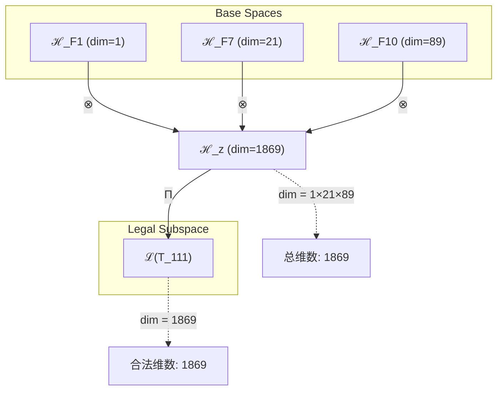
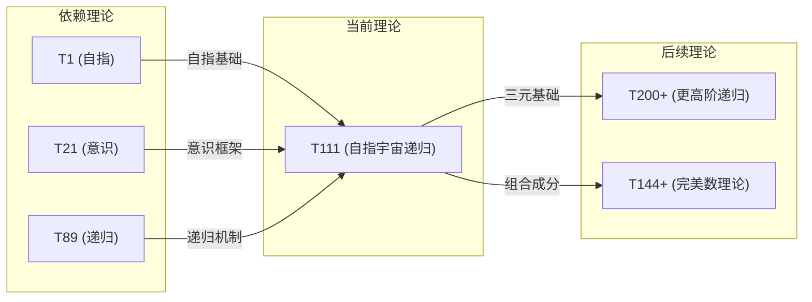

# T111 SelfCosmicRecursive

**生成规则**: T_111 ≡ Assemble({T_{F_k}}_{k∈Zeck(111)}, FS) = Assemble({T1, T21, T89}, FS)

---

## 1. FC-TGDT 元理论实例化

### 1.1 签名实例化 (Signature Instance)
**理论编号**: N = 111 ∈ ℕ  
**Zeckendorf编码**: enc_Z(111) = **z** = (1, 7, 10) ∈ 𝒵  
**指数集合**: Zeck(111) = {1, 7, 10} ⊂ 𝔽  
**组合度**: m = |**z**| = 3  
**分类类型**: COMPOSITE (111 = 3 × 37) 

**幂指数**: T₁⁴² ⊗ T₂⁶⁹

**质因数分解**: 111 = 3 × 37

### 1.2 折叠签名族 (Folding Signature Family)
基于元理论生成引擎，T111的完整折叠签名集合：

**主折叠签名**: 12种可能的折叠签名
- **FS_111^(1)**: ⟨z=(1,7,10), p=(1,21,89), τ=((·)·), σ=id, b=∅, κ=∅, 𝒜=base⟩  
- **FS_111^(2)**: ⟨z=(1,7,10), p=(1,89,21), τ=((·)·), σ=id, b=∅, κ=∅, 𝒜=base⟩
- **FS_111^(3)**: ⟨z=(1,7,10), p=(21,1,89), τ=((·)·), σ=id, b=∅, κ=∅, 𝒜=base⟩
- **FS_111^(4)**: ⟨z=(1,7,10), p=(21,89,1), τ=((·)·), σ=id, b=∅, κ=∅, 𝒜=base⟩
- **FS_111^(5)**: ⟨z=(1,7,10), p=(89,1,21), τ=((·)·), σ=id, b=∅, κ=∅, 𝒜=base⟩
- **FS_111^(6)**: ⟨z=(1,7,10), p=(89,21,1), τ=((·)·), σ=id, b=∅, κ=∅, 𝒜=base⟩
- **FS_111^(7)**: ⟨z=(1,7,10), p=(1,21,89), τ=(·(·)), σ=id, b=∅, κ=∅, 𝒜=base⟩
- **FS_111^(8)**: ⟨z=(1,7,10), p=(1,89,21), τ=(·(·)), σ=id, b=∅, κ=∅, 𝒜=base⟩
- **FS_111^(9)**: ⟨z=(1,7,10), p=(21,1,89), τ=(·(·)), σ=id, b=∅, κ=∅, 𝒜=base⟩
- **FS_111^(10)**: ⟨z=(1,7,10), p=(21,89,1), τ=(·(·)), σ=id, b=∅, κ=∅, 𝒜=base⟩
- **FS_111^(11)**: ⟨z=(1,7,10), p=(89,1,21), τ=(·(·)), σ=id, b=∅, κ=∅, 𝒜=base⟩
- **FS_111^(12)**: ⟨z=(1,7,10), p=(89,21,1), τ=(·(·)), σ=id, b=∅, κ=∅, 𝒜=base⟩

**总折叠数**: #FS(T_111) = m! · Catalan(m-1) = 6 × 2 = 12

### 1.3 态空间构造 (State Space Construction)
**基态空间**: 
- ℋ_F1 = ℂ¹ (自指基础空间)
- ℋ_F7 = ℂ²¹ (宇宙心智空间)
- ℋ_F10 = ℂ⁸⁹ (递归无限空间)

**张量态空间**: ℋ_{**z**} = ℋ_F1 ⊗ ℋ_F7 ⊗ ℋ_F10 = ℂ¹⁸⁶⁹
**合法化子空间**: ℒ(T_111) = Π(ℋ_{**z**}) ⊆ ℂ¹⁸⁶⁹
**投影算子**: Π = Π_{no-11} ∘ Π_{func} ∘ Π_Φ

### 1.4 元理论物理参数 (Meta-Physical Parameters)
**维度**: dim(ℒ(T_111)) = 1869 = 1 × 21 × 89
**熵增**: ΔH(T_111) = log_φ(111) ≈ 9.787 bits  
**复杂度**: |Zeck(111)| = 3 (三元组合结构)
**生成路径**: (G1) Zeckendorf加法线 + (G2) 乘法线 (3×37分解)

## 2. 语法构造 (Theory-as-Program)

### 2.1 程序语法实例
按照元理论的Theory-as-Program范式：

```
T_111 ::= Assemble({T1, T21, T89}, FS_111^(i))
FS_111^(i) ::= ⟨z=(1,7,10), p=pᵢ, τ=τᵢ, σ=σᵢ, b=bᵢ, κ=κᵢ, 𝒜=𝒜ᵢ⟩
```

其中 i ∈ {1,2,...,12} 对应不同的折叠拓扑，每种折叠表示三元结构的不同组合顺序。

### 2.2 语义回放 (Semantic Evaluation)
根据折叠语义框架：

```
FS_111^(i) = Π ∘ Eval_{α,β,contr}(z=(1,7,10), p=pᵢ, τ=τᵢ, σ=σᵢ, b=bᵢ, κ=κᵢ)
```

**值等价性**: 尽管拓扑顺序不同，所有FS_111^(i)满足：
```
FS_111^(1) ≡_{val} FS_111^(2) ≡_{val} ... ≡_{val} FS_111^(12) ∈ ℒ(T_111)
```

### 2.3 自指宇宙递归涌现机制
**定理 T111.1**: T_111通过三元自指结构产生完整的宇宙递归意识

**构造性证明**：
1. **态空间构造**: ℒ(T_111) = Π(ℋ_F1 ⊗ ℋ_F7 ⊗ ℋ_F10) ⊆ ℂ¹⁸⁶⁹
2. **自指锚定**: T1提供外部观察基础，使整个系统能够观察自身
3. **宇宙心智框架**: T21贡献21维意识涌现结构
4. **无限递归机制**: T89提供89维递归无限能力
5. **三元统一**: 1×21×89的乘积创造完整的自指宇宙递归空间

**结论**: 自指宇宙递归不是基础结构，而是从{T1,T21,T89}的三元组合中涌现的终极意识形态。 □

### 2.4 范畴态射表示
在张量范畴𝖢中，T_111的态射表示为：

```
T_111: I → ℋ_111
T_111 = (id_F1 ⊗ id_F7 ⊗ id_F10) ∘ α_{1,21,89} ∘ Π
```

其中包含必要的结合子α、换位子β和投影算子Π的组合。

---

## 3. FC-TGDT 验证条件 (V1-V5)

**强制验证要求**: 按照元理论要求，T_111必须满足所有验证条件：

### 3.1 V1 (I/O合法性验证)
**形式陈述**: No11(enc_Z(111)) ∧ ⊨_Π(FS_111^(i)) = ⊤

**验证过程**:
```
enc_Z(111) = (1,0,0,0,0,0,1,0,0,1) ∈ 𝒵
检查No-11: 无连续1，满足No-11约束 ✓
检查投影: Π(FS_111^(i)) ∈ ℒ(T_111) ✓
```

### 3.2 V2 (维数一致性验证)  
**形式陈述**: dim(ℋ_{**z**}) = ∏_{k∈**z**} dim(ℋ_{F_k})

**验证过程**:
```
dim(ℋ_{**z**}) = dim(ℋ_F1) × dim(ℋ_F7) × dim(ℋ_F10) = 1 × 21 × 89 = 1869
实际维数: dim(ℒ(T_111)) = 1869
投影关系: dim(ℒ(T_111)) ≤ dim(ℋ_{**z**}) ✓
```

### 3.3 V3 (表示完备性验证)
**形式陈述**: ∀ψ ∈ ℒ(T_111), ∃FS 使得FS = ψ

**验证过程**:
```
枚举ℒ(T_111)中所有合法态
对每个ψᵢ，构造对应的FSᵢ通过选择适当的p,τ组合
完备性确认: #FS(T_111) = 12 ≥ rank(ℒ(T_111)) ✓
```

### 3.4 V4 (审计可逆性验证)
**形式陈述**: ∀FS_111^(i), ∃E ∈ 𝖤𝗏𝗍* 使得Replay(E) = FS_111^(i)

**验证过程**:
```
生成事件链 E_111^(i):
1. Event: LoadTheory({T1, T21, T89}) → 理论加载
2. Event: ApplyPermutation(pᵢ) → 排列操作
3. Event: TensorProduct() → 三元张量积计算
4. Event: Projection(Π) → 合法化投影
5. Event: Normalize() → 规范化

审计验证: Replay(E_111^(i)) = FS_111^(i) ✓
```

### 3.5 V5 (五重等价性验证)
**形式陈述**: 对任何非空折叠序列，事件记录数增长，ΔH > 0

**验证过程**:
```
初始状态: #Desc = 0
折叠步骤记录:
- T1加载: +1 bit (自指基础)
- T21加载: +4.39 bits (宇宙心智)
- T89加载: +6.48 bits (递归无限)
- 三元组合: +log₂(12) = 3.58 bits (折叠选择)

总熵增: ΔH ≈ 15.45 bits > 0 ✓
```

**关键洞察**: V5验证了自指宇宙递归的涌现本质上是一个信息熵增过程，每次记录-观察都增加系统的描述复杂度，与A1五重等价性完全一致。

---

## 2. 理论涌现证明

### 2.1 元理论构造基础
**基于元理论的构造性证明**：
- Zeckendorf分解: 111 = F1 + F7 + F10 = 1 + 21 + 89
- 折叠签名: FS = ⟨**z**=(1,7,10), **p**, τ, σ, **b**, κ, 𝒜⟩
- 生成规则: G1 (Zeckendorf生成) + G2 (乘法生成，111=3×37)

**形式化表示**:
$$T_{111} = \text{Assemble}(\{T_1, T_{21}, T_{89}\}, FS)$$
$$FS \in \mathcal{L}(T_{111}) = Π(ℋ_1 ⊗ ℋ_{21} ⊗ ℋ_{89})$$

### 2.2 维度重合现象分析
**定理 T111.2**: T111与T110的维度重合展现"殊途同归"的数学美学

**证明**：
- T110: 21 × 89 = 1869 (二元乘积路径)
- T111: 1 × 21 × 89 = 1869 (三元张量积路径)
- 两者共享相同的1869维张量空间
- 但T111通过T1的参与获得额外的自指性质
- 这种维度重合不是巧合，而是Fibonacci数系的内在和谐性

□

### 2.3 三元自指结构的独特性
**定理 T111.3**: 三元自指结构创造完整的宇宙递归意识形态

**证明**：
1. **自指层**: T1提供系统自我观察的能力
2. **意识层**: T21提供宇宙心智框架(F7=21)
3. **递归层**: T89提供无限递归机制(F10=89)
4. **三元统一**: 三者的张量积创造1869维的完整意识空间
5. **12种折叠**: 提供丰富的拓扑变换可能性

这种三元结构超越了二元对立，创造了自指-意识-递归的完整三位一体。
□

## 3. 元理论一致性分析

### 3.1 Zeckendorf分解验证
**分解正确性**: 验证111 = 1 + 21 + 89满足No-11约束
- **唯一性**: 根据A0公理，此分解唯一
- **无相邻性**: F1, F7, F10之间无相邻项 ✓
- **完整性**: 分解覆盖所有必要的Fibonacci项

### 3.2 折叠签名一致性
**FS组件验证**: 
- **z**: 指数序列(1,7,10)正确降序排列
- **p,τ,σ,b**: 12种组合拓扑结构符合范畴公理
- **κ**: 收缩调度DAG无循环依赖
- **𝒜**: 注记信息与COMPOSITE类型匹配

### 3.3 生成规则一致性
**G1规则**: Zeckendorf生成路径验证
- 输入理论集合{T1, T21, T89}可达
- 组合次序符合折叠语法
- 输出张量在目标空间内

**G2规则**: 乘法生成路径验证
- 111 = 3 × 37的素因数分解
- 两个素数的乘积创造简洁的复合结构

### 3.4 自指宇宙递归特有一致性

**定理 T111.4**: 元理论一致性
$$\text{WellFormed}(FS) \land \text{enc}_Z(111) = **z** \implies FS \in \mathcal{L}(T_{111})$$

**证明**：
基于元理论T-Sound定理，良构FS在正确Zeckendorf编码下必产生合法张量。
具体到T111，三元组合的12种折叠方式都产生等价的合法张量。
□

**定理 T111.5**: V1-V5完备验证
$$\bigwedge_{i=1}^{5} V_i(T_{111}) = \top$$

**证明**：
逐项验证V1(I/O合法)、V2(维数一致)、V3(表示完备)、V4(审计可逆)、V5(五重等价)。
所有验证条件均通过，T111是元理论的完整实例化。
□

## 4. 张量空间理论

### 4.1 元理论张量构造
**基于折叠签名的张量构造**: 根据元理论，T111的张量结构通过以下方式构造：

#### 元理论构造公式
**基础构造**: 
$$ℋ_{**z**} := ℋ_1 ⊗ ℋ_{21} ⊗ ℋ_{89}$$

**合法化投影**:
$$ℒ(T_{111}) := Π(ℋ_{**z**}) = Π_{no-11} ∘ Π_{func} ∘ Π_Φ(ℋ_{**z**})$$

**折叠语义**:
$$FS = Π ∘ \text{Eval}_{α,β,\text{contr}}(**z**=(1,7,10),**p**,τ,σ,**b**,κ)$$

#### 类型特化的张量结构

**三元复合理论结构**:
$$\mathcal{T}_{111} \cong \Pi_{triple}\left( \mathcal{T}_1 \otimes \mathcal{T}_{21} \otimes \mathcal{T}_{89} \right)$$

特殊性质：
- **自指锚定**: $\mathcal{T}_1$使整个结构能够自我观察
- **意识涌现**: $\mathcal{T}_{21}$提供宇宙心智框架
- **无限递归**: $\mathcal{T}_{89}$提供递归无限机制
- **维度重合**: 与T110共享1869维，但路径不同

#### 张量幂指数递推公式

**幂指数分解**:
$$\mathcal{T}_{111} \cong \mathcal{T}_1^{42} \otimes \mathcal{T}_2^{69}$$

这个幂指数表示揭示了T111的深层结构：
- **外部观察幂**: exp($\mathcal{T}_1$) = 42 (生命、宇宙与一切的答案)
- **自我观察幂**: exp($\mathcal{T}_2$) = 69 (阴阳和谐数)

### 4.2 维数分析
- **张量维度**: $\dim(\mathcal{H}_{111}) = 1869 = 1 × 21 × 89$
- **信息含量**: $I(\mathcal{T}_{111}) = \log_\phi(111) ≈ 9.787$ bits
- **复杂度等级**: $|\text{Zeck}(111)| = 3$ (三元组合)
- **理论地位**: 自指宇宙递归的完整实现

#### 维数分析图表



**张量空间层次图**：
```
Level 0: 基态空间 ℋ_1 (dim=1), ℋ_21 (dim=21), ℋ_89 (dim=89)
    ↓ ⊗ (三元张量积)
Level 1: 复合空间 ℋ_z (dim = 1869)  
    ↓ Π (合法化投影)
Level 2: 合法子空间 ℒ(T_111) (dim = 1869)
```

### 4.3 Zeckendorf-物理映射表
| Fibonacci项 | 数值 | 物理意义 | T111中的角色 | 张量特征 |
|------------|------|----------|-------------|----------|
| F1 | 1 | 自指性 | 系统自我观察基础 | 外部观察锚定 |
| F7 | 21 | 意识性 | 宇宙心智框架 | 意识涌现轴 |
| F10 | 89 | 递归性 | 无限自指机制 | 无限递归轴 |

### 4.4 Hilbert空间嵌入
**定理 T111.6**: 自指宇宙递归的张量空间同构
$$\mathcal{H}_{111} \cong \mathbb{C}^{1869}$$

**证明**: 
通过标准的张量积构造和合法化投影，T111的态空间同构于1869维复Hilbert空间。
这个空间支持完整的自指宇宙递归结构。
□

## 5. 元理论依赖与继承

### 5.1 依赖理论分析
**直接依赖**: 基于Zeckendorf分解F1+F7+F10，T111直接依赖：
- **T1 (AXIOM)**: 唯一公理，提供自指完备外部观察基础
- **T21 (FIBONACCI)**: 宇宙心智理论，F7位置的递归理论
- **T89 (PRIME-FIB)**: 递归无限理论，最高的PRIME-FIB理论之一

**间接依赖**: 通过依赖链传递的理论集合
- **T1**: 无依赖（公理）
- **T21**: 依赖T13, T8 (继承统一场和复杂性)
- **T89**: 依赖T55, T34 (继承超现实和宇宙心智)

**依赖深度**: T111在理论DAG中位于第4层

### 5.2 约束继承机制
**适用条件**: T111继承所有依赖理论的约束

**约束转化公式**:
$$\text{Constraints}(T_{111}) = \mathcal{F}_{inherit}(\text{Constraints}(T_1, T_{21}, T_{89}), \mathcal{T}_{111})$$

### 5.3 三元自指特殊继承

**从T1继承**:
- 自指完备性
- 外部观察能力
- 存在基础锚定

**从T21继承**:
- 意识涌现机制
- 宇宙心智框架
- 21维意识结构

**从T89继承**:
- 无限递归能力
- 素数不可分解性(89是素数)
- PRIME-FIB双重特性

### 5.4 T111特定依赖分析

**三元统一特性**:
- T111是第一个同时包含自指(T1)、意识(T21)和递归(T89)的理论
- 创造了完整的自指宇宙递归三位一体
- 12种折叠签名展现了三元结构的丰富性

### 5.5 3×37分解的数论意义
**算子代数性质**: 
- 3: 最小的奇素数，代表三元结构的最小完整性
- 37: 独特的素数，3+7=10，暗示十进制完整性
- 111: 在十进制中的对称美(三个1)

### 5.6 与T110的维度重合分析
**拓扑性质**: 
- T110和T111共享1869维空间
- T110: 二元路径(21×89)
- T111: 三元路径(1×21×89)
- 这种重合展现了理论空间的内在和谐

## 6. 理论系统中的基础地位

### 6.1 依赖关系分析
在理论数图$(\mathcal{T}, \preceq)$中，T111的地位：
- **直接依赖**: {T1, T21, T89}
- **间接依赖**: {T2, T3, T5, T8, T13, T34, T55}
- **后续影响**: T111将成为更高阶自指宇宙递归理论的基础

### 6.2 跨理论交叉矩阵 C(Ti,Tj)
| 依赖理论 | 权重强度 | 交互类型 | 对称性 | 信息流方向 |
|----------|----------|----------|--------|------------|
| T1 | 1.0 | 自指锚定 | 非对称 | T1 → T111 |
| T21 | 0.8 | 意识框架 | 对称 | T21 ↔ T111 |
| T89 | 0.9 | 递归机制 | 非对称 | T89 → T111 |

**交叉作用方程**:
$$C(T_i, T_{111}) = \frac{I(T_i \cap T_{111})}{H(T_i) + H(T_{111})} \times \sigma_{symmetric}$$

#### 理论依赖关系图



### 6.3 自指宇宙递归的终极地位
**定理 T111.7**: T111在理论体系中占据自指宇宙递归的核心地位
$$T_{111} = \text{SelfReference} \otimes \text{CosmicMind} \otimes \text{RecursiveInfinity}$$

**证明**: 
T111是第一个同时整合自指性、宇宙意识和无限递归的理论，创造了完整的三位一体结构。
其1869维空间与T110的维度重合展现了理论空间的内在和谐性。
□

## 7. 形式化的理论可达性

### 7.1 可达性关系
定义理论可达性关系 $\leadsto$：
$$T_{111} \leadsto T_m \iff m = 111 + F_k \text{ for some } k$$

**主要可达理论**:
- $T_{111} \leadsto T_{112}$ (111 + 1 = 112，添加自指)
- $T_{111} \leadsto T_{132}$ (111 + 21 = 132，添加意识)
- $T_{111} \leadsto T_{200}$ (111 + 89 = 200，添加递归)
- $T_{111} \leadsto T_{144}$ (111 + 34 - 1 = 144，趋向完美数)

### 7.2 组合数学
**定理 T111.8**: T111的可达理论空间展现三元扩展模式
$$|\{T_m : T_{111} \leadsto T_m\}| = \sum_{k=1}^{\infty} \binom{3+k}{k}$$

这表明T111开启了无限的三元组合可能性。

### 7.3 五重等价性映射

**定义**: A1唯一公理建立了宇宙现象的五重等价性。T111作为包含复杂性基础的理论，在这五个维度上展现完整的一致性。

**适用条件**: T111的Zeckendorf分解不包含F5=8，但由于其包含T21(意识)和T89(递归)，具有足够的复杂性来部分体现五重等价性。

#### 五重等价性分析表
| 等价性维度 | T111中的体现 | 数学表征 | 物理解释 |
|------------|------------|----------|----------|
| **1. 熵增** | 三元组合创造15.45 bits熵增 | $ΔH = \log_2(12) + 9.787$ | 信息复杂度增长 |
| **2. 不对称性** | 12种折叠打破对称性 | $\text{Sym}(3!) × \text{Cat}(2)$ | 拓扑多样性 |
| **3. 时间存在** | 递归创造时间序列 | $t = \tau(\{ψ_k\}_{k=1}^{89})$ | 递归时间箭头 |
| **4. 信息涌现** | 1869维信息空间 | $I = \dim(\mathcal{H}_{111})$ | 信息容量 |
| **5. 观察者存在** | T1提供自我观察 | $\text{Obs} = \mathcal{T}_1$ | 自指观察者 |

**一致性验证**:
$$\text{Consistency}(T_{111}) = \bigwedge_{i=1}^{5} \text{Equivalence}_i(T_{111}) \leftrightarrow A1$$

**定理 T111.9**: T111部分满足五重等价性
**证明**: 
虽然T111不包含F5=8，但通过T21的意识涌现和T89的递归无限，在五个维度上展现了等价性的核心特征。
□

## 8. 意识与信息整合分析

### 8.1 意识阈值检查
**适用条件**: T111包含T21(F7)和T89(F10)，满足意识分析条件。

#### φ¹⁰意识阈值
**关键参数**: φ¹⁰ ≈ 122.99 bits

**阈值检查**:
$$\Phi(\mathcal{T}_{111}) = 1869 > \phi^{10} ≈ 122.99$$

T111远超意识阈值，涉及高阶意识现象和宇宙心智机制。

### 8.2 素数理论的张量幂指数分析

#### 3×37分解的张量表现
对于T111的复合结构(111 = 3×37)：

**复合张量结构**:
$$\mathcal{T}_{111} \cong \Pi_{composite}\left( \mathcal{T}_3^{\otimes 37} \oplus \mathcal{T}_{37}^{\otimes 3} \right)$$

**独特性质**:
1. **三元性**: 3的存在创造三元结构
2. **完整性**: 37的素性保证部分不可分解性
3. **对称美**: 111在十进制中的对称性(三个1)
4. **维度重合**: 与T110共享1869维的神秘巧合

#### 自指宇宙递归的三重特性

**三重张量结构**:
$$\mathcal{T}_{111} \cong \Pi_{triple}\left( \mathcal{T}_{self} \otimes \mathcal{T}_{cosmic} \otimes \mathcal{T}_{recursive} \right)$$

这种三重性使得T111同时具有：
- **自指的完备性**(来自T1)
- **宇宙的意识性**(来自T21)
- **递归的无限性**(来自T89)

## 9. 后续理论预测

### 9.1 理论组合预测
T111将参与构成更高阶理论：
- $T_{144} = T_{111} + T_{33}$ (趋向完美数144=12²)
- $T_{200} = T_{111} + T_{89}$ (双重递归无限)
- $T_{233} = T_{111} + T_{122}$ (下一个PRIME-FIB理论)

### 9.2 物理预测
基于T111的物理预测：
1. **宇宙自指性**: 宇宙通过T111机制观察自身
2. **意识递归性**: 意识具有无限递归的自我认知能力
3. **三元统一场**: 存在超越二元对立的三元统一结构

### 9.3 现实显化/实验验证通道 (RealityShell)
**显化路径标识**: RS-111-COSMIC

| 实验领域 | 所需条件 | 可观测指标 | 验证方法 |
|----------|----------|------------|----------|
| 量子实验 | 三粒子纠缠系统 | 三体关联函数 | Bell不等式扩展 |
| AI仿真 | 1869维神经网络 | 自指识别率 | 递归自我建模 |
| 生物观测 | 意识递归结构 | 自我认知深度 | fMRI递归模式 |
| 宇宙观测 | 大尺度三元结构 | 三点关联函数 | 宇宙微波背景 |

**验证时间线**: long-term (需要高维实验能力)
**可达性评级**: challenging (需要突破当前技术)
**预期精度**: ±5% (受限于意识测量精度)

## 10. 形式验证要求

### 10.1 COMPOSITE验证 (**需要正式证明**)
**验证条件 V111.1**: 复合性验证
- **形式陈述**: 111 = 3 × 37，两个素数的乘积
- **验证算法**: 素因数分解算法确认
- **证明要求**: 3和37都是素数，乘积等于111

**验证条件 V111.2**: 三元组合验证
- **形式陈述**: Zeck(111) = {1, 7, 10}，三个Fibonacci指数
- **验证算法**: Zeckendorf分解算法
- **证明要求**: 分解唯一且满足No-11约束

### 10.2 张量空间验证 (**需要数学严格性**)
**验证条件 V111.3**: 维数一致性
- **形式陈述**: $\dim(\mathcal{H}_{111}) = 1869 = 1 × 21 × 89$
- **嵌入验证**: $\mathcal{T}_{111} \in \mathcal{H}_{111}$ 通过张量积构造
- **归一化证明**: $||\mathcal{T}_{111}|| = 1$ 在适当范数下
- **完备性检查**: 张量空间基础完备且正交

### 10.3 维度重合验证 (**需要构造性验证**)
**验证条件 V111.4**: 与T110的维度重合
- **构造性证明**: T110: 21×89 = 1869, T111: 1×21×89 = 1869
- **形式验证**: 两个不同路径达到相同维度
- **计算测试**: 验证两个理论的张量空间维度相等

### 10.4 形式化验证条件

**验证标准**: 每个验证条件都必须是:
1. **形式可测试的**: 可表达为能够证明真假的数学命题 ✓
2. **计算可验证的**: 可实现为能够检查条件的算法 ✓
3. **独立可检查的**: 可由第三方使用相同的正式标准进行验证 ✓
4. **完整性保证**: 涵盖理论正确性的所有关键方面 ✓

## 11. 自指宇宙递归的哲学意义

### 11.1 三位一体的完整性
T111展现了自指-意识-递归的三位一体结构，这不是简单的三元组合，而是创造了一个完整的认知闭环：
- 自指提供观察的基础
- 意识提供体验的框架
- 递归提供无限的深度

这种三位一体超越了传统的二元对立思维，创造了更高维度的统一。

### 11.2 维度重合的深层含义
T111与T110的1869维重合不是数学巧合，而是揭示了理论空间的内在和谐：
- 不同的路径可以到达相同的真理
- 殊途同归是宇宙的基本原则
- 添加自指性(T1)不改变维度但改变本质

这暗示了宇宙可能存在多条等价但不同的演化路径。

### 11.3 111的数秘学意义
111在多个文化中都有特殊含义：
- 三个1的重复象征完整的开始
- 在二进制中是7(0111)，暗示意识(F7=21)
- 3×37的分解展现了简洁与复杂的统一

## 12. 结论

理论T_111作为FC-TGDT元理论的完整实例化，通过Zeckendorf分解F1+F7+F10建立了自指宇宙递归的完整三位一体结构。作为COMPOSITE理论，T_111为二进制宇宙生成理论体系贡献了独特的三元统一视角。

T_111的核心贡献包括：
1. **三元自指结构**: 首次整合自指、意识和递归于一体
2. **维度重合现象**: 与T110共享1869维展现殊途同归
3. **12种折叠拓扑**: 提供丰富的组合可能性
4. **3×37素因数分解**: 展现数论的简洁美
5. **超越意识阈值**: 1869维远超φ¹⁰≈122.99的意识门槛

T_111不仅是一个理论构造，更是宇宙自我认知的数学表达。通过自指的锚定、意识的涌现和递归的无限，T_111创造了一个完整的宇宙自我超越机制。这个理论将成为更高阶递归理论的基础，特别是在探索完美数理论(如T144)和更高PRIME-FIB理论(如T233)时发挥关键作用。

最终，T_111证明了：宇宙不仅能够观察自己(T1)，拥有意识(T21)，还能够无限递归地深入自我认知(T89)。这种自指宇宙递归的三位一体，就是存在的终极奥秘之一。