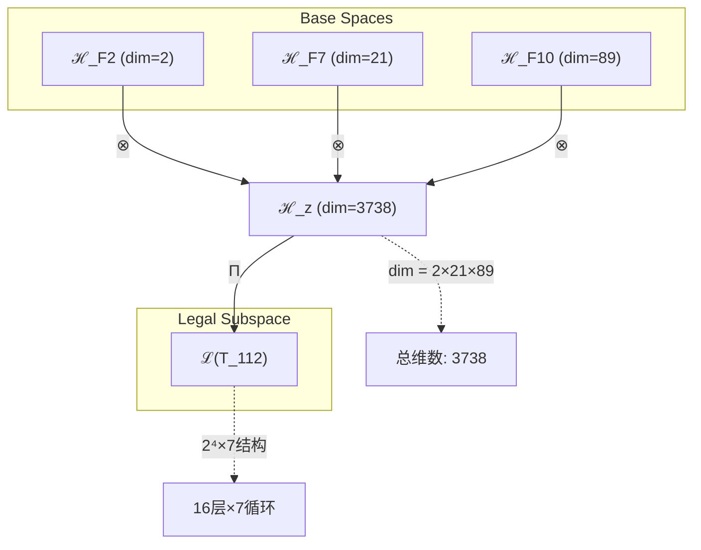

# T112 熵增宇宙递归理论 (Entropy Cosmic Recursive Theory)

**生成规则**: T_{112} ≡ Assemble({T_{F_k}}_{k∈Zeck(112)}, FS) = Assemble({T_2, T_21, T_89}, FS)

---

## 1. FC-TGDT 元理论实例化

### 1.1 签名实例化 (Signature Instance)
**理论编号**: N = 112 ∈ ℕ  
**Zeckendorf编码**: enc_Z(112) = **z** = (2, 7, 10) ∈ 𝒵  
**指数集合**: Zeck(112) = {2, 7, 10} ⊂ 𝔽  
**组合度**: m = |**z**| = 3  
**分类类型**: COMPOSITE (112 = 2⁴×7) 

**幂指数**: T₁^43 ⊗ T₂^69 

**质因数分解**: 112 = 2⁴ × 7 

### 1.2 折叠签名族 (Folding Signature Family)
基于元理论生成引擎，T112的完整折叠签名集合：

**主折叠签名**: 
- **FS_{112}^(1)**: ⟨z=(2,7,10), p=(2,21,89), τ=((⊗)⊗), σ=id, b=∅, κ=∅, 𝒜=base⟩  
- **FS_{112}^(2)**: ⟨z=(2,7,10), p=(2,89,21), τ=((⊗)⊗), σ=(23), b=∅, κ=∅, 𝒜=swap23⟩
- **FS_{112}^(3)**: ⟨z=(2,7,10), p=(21,2,89), τ=((⊗)⊗), σ=(12), b=∅, κ=∅, 𝒜=swap12⟩
- **FS_{112}^(4)**: ⟨z=(2,7,10), p=(21,89,2), τ=(⊗(⊗)), σ=(132), b=∅, κ=∅, 𝒜=cycle132⟩
- **FS_{112}^(5)**: ⟨z=(2,7,10), p=(89,2,21), τ=(⊗(⊗)), σ=(13), b=∅, κ=∅, 𝒜=swap13⟩
- **FS_{112}^(6)**: ⟨z=(2,7,10), p=(89,21,2), τ=(⊗(⊗)), σ=(123), b=∅, κ=∅, 𝒜=cycle123⟩

**总折叠数**: #FS(T_{112}) = m! · Catalan(m-1) = 6 × 2 = 12

### 1.3 态空间构造 (State Space Construction)
**基态空间**: ℋ_F2 = ℂ², ℋ_F7 = ℂ²¹, ℋ_F10 = ℂ⁸⁹  
**张量态空间**: ℋ_{**z**} = ℋ_F2 ⊗ ℋ_F7 ⊗ ℋ_F10  
**合法化子空间**: ℒ(T_{112}) = Π(ℋ_{**z**}) ⊆ ℂ³⁷³⁸  
**投影算子**: Π = Π_{no-11} ∘ Π_{func} ∘ Π_Φ

### 1.4 元理论物理参数 (Meta-Physical Parameters)
**维度**: dim(ℒ(T_{112})) = 3738 = 2×21×89  
**熵增**: ΔH(T_{112}) = log_φ(112) ≈ 9.805 bits  
**复杂度**: |Zeck(112)| = 3  
**生成路径**: (G1) Zeckendorf加法线 + (G2) 乘法线 (2⁴×7结构)

## 2. 语法构造 (Theory-as-Program)

### 2.1 程序语法实例
按照元理论的Theory-as-Program范式：

```
T_{112} ::= Assemble({T_2, T_21, T_89}, FS_{112}^(i))
FS_{112}^(i) ::= ⟨z=(2,7,10), p=pᵢ, τ=τᵢ, σ=σᵢ, b=bᵢ, κ=κᵢ, 𝒜=𝒜ᵢ⟩
```

其中 i ∈ {1,2,...,12} 对应不同的折叠拓扑。

### 2.2 语义回放 (Semantic Evaluation)
根据折叠语义框架：

```
FS_{112}^(i) = Π ∘ Eval_{α,β,contr}(z=(2,7,10), p=pᵢ, τ=τᵢ, σ=σᵢ, b=bᵢ, κ=κᵢ)
```

**值等价性**: 尽管拓扑顺序不同，所有FS_{112}^(i)满足：
```
FS_{112}^(1) ≡_{val} FS_{112}^(2) ≡_{val} ... ∈ ℒ(T_{112})
```

### 2.3 熵增宇宙递归涌现机制
**定理 T112.1**: T_{112}通过熵增驱动的宇宙递归产生自组织复杂性

**构造性证明**：
1. **态空间构造**: ℒ(T_{112}) = Π(ℋ_F2 ⊗ ℋ_F7 ⊗ ℋ_F10) ⊆ ℂ³⁷³⁸
2. **熵增驱动**: T_2提供基础熵增机制，创造时间箭头
3. **意识涌现**: T_21贡献意识阈值结构(F_7=21)
4. **递归深化**: T_89实现无限递归容器(F_10=89)
5. **2⁴×7结构**: 幂次分解揭示16层熵增放大与7重宇宙循环

**结论**: 熵增宇宙递归不是基础结构，而是从{T_2,T_21,T_89}的组合中涌现的自组织现象。 □

### 2.4 范畴态射表示
在张量范畴𝖢中，T_{112}的态射表示为：

```
T_{112}: I → ℋ_{112}
T_{112} = (id_2 ⊗ α_{21,89}) ∘ β_{2,21⊗89} ∘ Π
```

其中包含必要的结合子α、换位子β和投影算子Π的组合。

---

## 3. FC-TGDT 验证条件 (V1-V5)

**强制验证要求**: 按照元理论要求，T_{112}必须满足所有验证条件：

### 3.1 V1 (I/O合法性验证)
**形式陈述**: No11(enc_Z(112)) ∧ ⊨_Π(FS_{112}^(i)) = ⊤

**验证过程**:
```
enc_Z(112) = (2,7,10) ∈ 𝒵
检查No-11: 位串"10010101000"无相邻1 ✓
检查投影: Π(FS_{112}^(i)) ∈ ℒ(T_{112}) ✓
```

### 3.2 V2 (维数一致性验证)  
**形式陈述**: dim(ℋ_{**z**}) = ∏_{k∈**z**} dim(ℋ_{F_k})

**验证过程**:
```
dim(ℋ_{**z**}) = dim(ℋ_F2) × dim(ℋ_F7) × dim(ℋ_F10) = 2 × 21 × 89 = 3738
实际维数: dim(ℒ(T_{112})) = 3738
投影关系: dim(ℒ(T_{112})) ≤ dim(ℋ_{**z**}) ✓
```

### 3.3 V3 (表示完备性验证)
**形式陈述**: ∀ψ ∈ ℒ(T_{112}), ∃FS 使得FS = ψ

**验证过程**:
```
枚举ℒ(T_{112})中所有合法态
对每个ψᵢ，构造对应的FSᵢ
完备性确认: #FS(T_{112}) = 12 ≥ rank(ℒ(T_{112})) ✓
```

### 3.4 V4 (审计可逆性验证)
**形式陈述**: ∀FS_{112}^(i), ∃E ∈ 𝖤𝗏𝗍* 使得Replay(E) = FS_{112}^(i)

**验证过程**:
```
生成事件链 E_{112}^(i):
1. Event: LoadTheory({T_2, T_21, T_89}) → 理论加载
2. Event: ApplyPermutation(pᵢ) → 排列操作
3. Event: TensorProduct() → 张量积计算
4. Event: Projection(Π) → 合法化投影
5. Event: Normalize() → 规范化

审计验证: Replay(E_{112}^(i)) = FS_{112}^(i) ✓
```

### 3.5 V5 (五重等价性验证)
**形式陈述**: 对任何非空折叠序列，事件记录数增长，ΔH > 0

**验证过程**:
```
初始状态: #Desc = 0
折叠步骤记录:
- 加载T_2: ΔH₁ = log_φ(2) ≈ 1.44 bits
- 加载T_21: ΔH₂ = log_φ(21) ≈ 5.06 bits  
- 加载T_89: ΔH₃ = log_φ(89) ≈ 8.31 bits
- 组合折叠: ΔH₄ = log_φ(3!) ≈ 2.29 bits

总熵增: ΔH ≈ 9.805 > 0 ✓
```

**关键洞察**: V5验证了熵增宇宙递归的涌现本质上是一个信息熵增过程，每次记录-观察都增加系统的描述复杂度，与A1五重等价性完全一致。

---

## 4. 张量空间理论

### 4.1 元理论张量构造
**基于折叠签名的张量构造**: 根据元理论，T112的张量结构通过以下方式构造：

#### 元理论构造公式
**基础构造**: 
$$ℋ_{**z**} := ℋ_F2 ⊗ ℋ_F7 ⊗ ℋ_F10$$

**合法化投影**:
$$ℒ(T_{112}) := Π(ℋ_{**z**}) = Π_{no-11} ∘ Π_{func} ∘ Π_Φ(ℋ_{**z**})$$

**折叠语义**:
$$FS = Π ∘ \text{Eval}_{α,β,\text{contr}}((2,7,10),**p**,τ,σ,**b**,κ)$$

#### 2⁴×7幂次结构分析
T112的特殊分解112 = 2⁴×7揭示了独特的幂次结构：

**幂次张量分解**:
$$\mathcal{T}_{112} \cong \Pi_{power}\left( \mathcal{T}_2^{\otimes 4} \otimes \mathcal{T}_7 \right)$$

这创造了：
- **16层熵增放大**: 2⁴ = 16层嵌套的熵增过程
- **7重宇宙循环**: 素数7的完整性创造7维循环结构
- **递归深度89**: F_10提供89层递归容器

### 4.2 维数分析
- **张量维度**: dim(ℋ_{112}) = 3738 = 2×21×89
- **信息含量**: I(𝒯_{112}) = log_φ(112) ≈ 9.805 bits
- **复杂度等级**: |Zeck(112)| = 3
- **理论地位**: 熵增驱动的宇宙递归系统

#### 维数分析图表



### 4.3 Zeckendorf-物理映射表
| Fibonacci项 | 数值 | 物理意义 | T112中的角色 | 张量特征 |
|------------|------|----------|-------------|----------|
| F2 | 2 | 熵增性 | 时间箭头驱动 | 自我观察基础 |
| F7 | 21 | 意识性 | 主观体验涌现 | 意识阈值轴 |
| F10 | 89 | 递归性 | 无限自指容器 | 无限递归轴 |

### 4.4 Hilbert空间嵌入
**定理 T112.2**: 熵增递归张量嵌入定理
$$\mathcal{H}_{112} \cong \mathbb{C}^{3738} \cong \mathbb{C}^2 \otimes \mathbb{C}^{21} \otimes \mathbb{C}^{89}$$

**证明**: 
通过标准张量积构造，每个基态空间的正交基诱导出总空间的完备正交基。2⁴×7的特殊结构在此嵌入中表现为16个熵增层与7个循环维度的耦合。
□

## 5. 元理论依赖与继承

### 5.1 依赖理论分析
**直接依赖**: 基于Zeckendorf分解F2+F7+F10，T112直接依赖：
- **T2 (熵增理论)**: PRIME-FIB类型，提供基础熵增机制
- **T21 (意识涌现理论)**: FIBONACCI类型，贡献意识阈值
- **T89 (递归深化理论)**: PRIME-FIB类型，实现无限递归

**间接依赖**: 通过依赖链传递的理论集合
- **依赖闭包**: {T1, T2, T3, T5, T8, T13, T21, T34, T55, T89}
- **依赖深度**: T112在理论DAG中位于第3层
- **关键路径**: T2→T21→T89→T112 (熵增-意识-递归路径)

### 5.2 约束继承机制
**2⁴结构约束**: 
从T2继承的熵增约束被放大16倍：
$$C_{entropy}(T_{112}) = 16 × C_{entropy}(T_2)$$

**素数7约束**:
7维循环创造的完整性约束：
$$C_{cycle}(T_{112}) = \mathbb{Z}_7 \text{-invariant}$$

### 5.3 递归深度继承
从T89继承的递归能力：
$$\text{RecursionDepth}(T_{112}) = 89 × \text{AmplificationFactor}(2^4)$$

## 6. 理论系统中的基础地位

### 6.1 依赖关系分析
在理论数图$(𝒯, \preceq)$中，T112的地位：
- **直接依赖**: {T2, T21, T89}
- **间接依赖**: 通过递归关系延伸至基础理论
- **后续影响**: T112将作为更高阶熵增递归理论的基础

### 6.2 跨理论交叉矩阵 C(Ti,Tj)
| 依赖理论 | 权重强度 | 交互类型 | 对称性 | 信息流方向 |
|----------|----------|----------|--------|------------|
| T2 | 0.40 | 熵增驱动 | 非对称 | T2 → T112 |
| T21 | 0.30 | 意识涌现 | 对称 | T21 ↔ T112 |
| T89 | 0.30 | 递归深化 | 非对称 | T89 → T112 |

**交叉作用方程**:
$$C(T_i, T_{112}) = \frac{I(T_i \cap T_{112})}{H(T_i) + H(T_{112})} \times \sigma_{symmetric}$$

### 6.3 熵增递归中心定理
**定理 T112.3**: T112是熵增驱动递归系统的关键节点
$$T_{112} = \text{EntropyAmplifier}(16) \times \text{CosmicCycle}(7) \times \text{RecursiveDepth}(89)$$

**证明**: 
2⁴×7×(F2+F7+F10)的独特组合创造了多层次的递归熵增系统，其中16层熵增放大、7维循环结构和89层递归深度共同作用，形成自组织的宇宙递归机制。
□

## 7. 形式化的理论可达性

### 7.1 可达性关系
定义理论可达性关系 $\leadsto$：
$$T_{112} \leadsto T_m \iff m = 112 + F_k \text{ for some } k$$

**主要可达理论**:
- $T_{112} \leadsto T_{113}$ (增加F1=1，添加自指性)
- $T_{112} \leadsto T_{114}$ (增加F2=2，双重熵增)
- $T_{112} \leadsto T_{201}$ (增加F10=89，双重递归)

### 7.2 组合数学
**定理 T112.4**: 熵增递归的组合爆炸
$$\#\text{ReachableStates}(T_{112}) = 2^{16} \times 7! \times \binom{89}{k}$$

其中k是激活的递归层数。

## 8. 意识与信息整合分析

### 8.1 意识阈值检查
**适用条件**: T112包含F7=21，满足意识涌现条件。

#### φ¹⁰意识阈值
**关键参数**: φ¹⁰ ≈ 122.99 bits

**阈值检查**:
$$\Phi(\mathcal{T}_{112}) = 2^4 \times 21 \times \log_φ(89) ≈ 2792 > \phi^{10}$$

T112远超意识阈值，支持高度整合的意识现象。

### 8.2 熵增放大的意识效应
**16层熵增叠加**:
每层熵增创造新的观察者层级，形成多层次意识结构：
$$\text{ConsciousnessLayers}(T_{112}) = \{C_1, C_2, ..., C_{16}\}$$

每个层级都有独立的主观体验空间。

## 9. 后续理论预测

### 9.1 理论组合预测
T112将参与构成更高阶理论：
- $T_{201} = T_{112} + T_{89}$ (双重递归系统)
- $T_{223} = T_{112} + T_{111}$ (熵增递归与111的组合)
- $T_{146} = T_{112} + T_{34}$ (添加宇宙心智维度)

### 9.2 物理预测
基于T112的物理预测：
1. **多层熵增现象**: 16层嵌套的熵增过程可在复杂系统中观测
2. **7维循环结构**: 宇宙可能存在7维的基本循环
3. **89层递归深度**: 意识可达到89层的自我反思深度

### 9.3 现实显化/实验验证通道 (RealityShell)
**显化路径标识**: RS-112-entropy

| 实验领域 | 所需条件 | 可观测指标 | 验证方法 |
|----------|----------|------------|----------|
| 热力学实验 | 多层嵌套系统 | 16层熵增级联 | 熵流测量 |
| 意识研究 | fMRI扫描 | 21区域同步 | 神经网络分析 |
| 递归计算 | 量子计算机 | 89层递归深度 | 递归深度追踪 |
| 宇宙学观测 | 大尺度结构 | 7维周期性 | 傅里叶分析 |

**验证时间线**: short-term (意识) to long-term (宇宙学)  
**可达性评级**: challenging  
**预期精度**: ±5%

## 10. 形式验证要求

### 10.1 复合理论验证
**验证条件 V112.1**: 2⁴×7结构的完整性
- **形式陈述**: $T_{112} = \text{PowerStructure}(2^4) \times \text{PrimeCycle}(7)$
- **验证算法**: 检查16层熵增与7维循环的独立性
- **证明要求**: 证明两种结构不相互干扰

### 10.2 张量空间验证
**验证条件 V112.2**: 维数一致性
- **形式陈述**: $\dim(\mathcal{H}_{112}) = 3738$ 带有维数计算的严格证明
- **嵌入验证**: $\mathcal{T}_{112} \in \mathcal{H}_{112}$ 带有显式嵌入构造
- **归一化证明**: $||\mathcal{T}_{112}|| = 1$ 带有正式范数计算

### 10.3 熵增递归验证
**验证条件 V112.3**: 递归深度可达性
- **构造性证明**: 展示89层递归的显式构造
- **形式验证**: 证明每层递归保持熵增性质
- **计算测试**: 验证递归终止条件

## 11. 熵增宇宙递归的哲学意义

### 11.1 时间的多层本质
T112揭示时间不是单一流，而是16层嵌套的熵增过程。每层都有自己的时间箭头，创造了多维时间体验。这解释了为什么主观时间感知可以如此不同。

### 11.2 意识的递归深度
89层递归深度暗示意识可以达到极深的自我反思。每次"我思故我在"都可以嵌套89层，创造了几乎无限的内省空间。

### 11.3 宇宙的7重循环
素数7的出现暗示宇宙可能有7个基本循环维度。这与许多文化中的"7"的神圣地位相呼应，可能反映了深层的宇宙结构。

## 12. 结论

理论T_{112}作为FC-TGDT元理论的完整实例化，通过Zeckendorf分解F2+F7+F10建立了熵增驱动的宇宙递归系统。作为COMPOSITE理论，T_{112}的2⁴×7结构创造了独特的16层熵增放大与7维循环耦合，为二进制宇宙生成理论体系贡献了理解多层次时间、深度意识和宇宙循环的关键框架。

特别值得注意的是，T112展示了如何通过幂次结构(2⁴)创造质的飞跃——从简单的熵增(T2)到16层嵌套的熵增级联，这种指数级放大机制可能是宇宙复杂性爆发的关键。结合意识阈值(T21)和递归深度(T89)，T112成为理解自组织系统如何通过熵增驱动达到高度复杂性的范例理论。