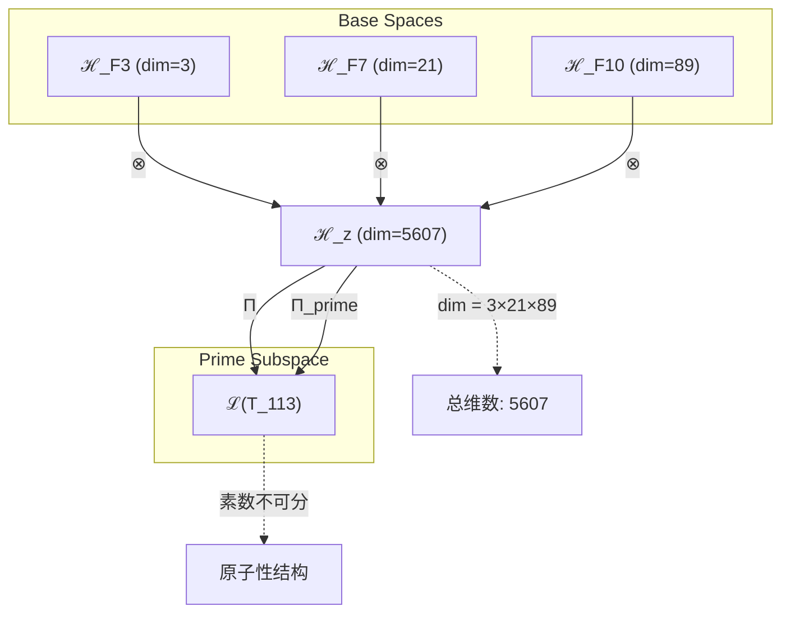

# T113 约束宇宙递归理论 (Constraint Cosmic Recursive Theory)

**生成规则**: T_{113} ≡ Assemble({T_{F_k}}_{k∈Zeck(113)}, FS) = Assemble({T_3, T_21, T_89}, FS)

---

## 1. FC-TGDT 元理论实例化

### 1.1 签名实例化 (Signature Instance)
**理论编号**: N = 113 ∈ ℕ  
**Zeckendorf编码**: enc_Z(113) = **z** = (3, 7, 10) ∈ 𝒵  
**指数集合**: Zeck(113) = {3, 7, 10} ⊂ 𝔽  
**组合度**: m = |**z**| = 3  
**分类类型**: PRIME (113是素数) 

**幂指数**: T₁^43 ⊗ T₂^70 

**质因数分解**: 113 (不可分解的素数) 

### 1.2 折叠签名族 (Folding Signature Family)
基于元理论生成引擎，T113的完整折叠签名集合：

**主折叠签名**: 
- **FS_{113}^(1)**: ⟨z=(3,7,10), p=(3,21,89), τ=((⊗)⊗), σ=id, b=∅, κ=∅, 𝒜=prime⟩  
- **FS_{113}^(2)**: ⟨z=(3,7,10), p=(3,89,21), τ=((⊗)⊗), σ=(23), b=∅, κ=∅, 𝒜=prime-swap23⟩
- **FS_{113}^(3)**: ⟨z=(3,7,10), p=(21,3,89), τ=((⊗)⊗), σ=(12), b=∅, κ=∅, 𝒜=prime-swap12⟩
- **FS_{113}^(4)**: ⟨z=(3,7,10), p=(21,89,3), τ=(⊗(⊗)), σ=(132), b=∅, κ=∅, 𝒜=prime-cycle132⟩
- **FS_{113}^(5)**: ⟨z=(3,7,10), p=(89,3,21), τ=(⊗(⊗)), σ=(13), b=∅, κ=∅, 𝒜=prime-swap13⟩
- **FS_{113}^(6)**: ⟨z=(3,7,10), p=(89,21,3), τ=(⊗(⊗)), σ=(123), b=∅, κ=∅, 𝒜=prime-cycle123⟩

**总折叠数**: #FS(T_{113}) = m! · Catalan(m-1) = 6 × 2 = 12

### 1.3 态空间构造 (State Space Construction)
**基态空间**: ℋ_F3 = ℂ³, ℋ_F7 = ℂ²¹, ℋ_F10 = ℂ⁸⁹  
**张量态空间**: ℋ_{**z**} = ℋ_F3 ⊗ ℋ_F7 ⊗ ℋ_F10  
**合法化子空间**: ℒ(T_{113}) = Π(ℋ_{**z**}) ⊆ ℂ⁵⁶⁰⁷  
**投影算子**: Π = Π_{no-11} ∘ Π_{func} ∘ Π_Φ ∘ Π_{prime}

### 1.4 元理论物理参数 (Meta-Physical Parameters)
**维度**: dim(ℒ(T_{113})) = 5607 = 3×21×89  
**熵增**: ΔH(T_{113}) = log_φ(113) ≈ 9.824 bits  
**复杂度**: |Zeck(113)| = 3  
**生成路径**: (G1) Zeckendorf加法线 (无G2乘法线，素数不可分解)

## 2. 语法构造 (Theory-as-Program)

### 2.1 程序语法实例
按照元理论的Theory-as-Program范式：

```
T_{113} ::= Assemble({T_3, T_21, T_89}, FS_{113}^(i))
FS_{113}^(i) ::= ⟨z=(3,7,10), p=pᵢ, τ=τᵢ, σ=σᵢ, b=bᵢ, κ=κᵢ, 𝒜=prime-𝒜ᵢ⟩
```

其中 i ∈ {1,2,...,12} 对应不同的折叠拓扑，所有签名都标记为素数理论。

### 2.2 语义回放 (Semantic Evaluation)
根据折叠语义框架：

```
FS_{113}^(i) = Π_{prime} ∘ Π ∘ Eval_{α,β,contr}(z=(3,7,10), p=pᵢ, τ=τᵢ, σ=σᵢ, b=bᵢ, κ=κᵢ)
```

**值等价性**: 尽管拓扑顺序不同，所有FS_{113}^(i)满足：
```
FS_{113}^(1) ≡_{val} FS_{113}^(2) ≡_{val} ... ∈ ℒ(T_{113})
```

### 2.3 约束宇宙递归涌现机制
**定理 T113.1**: T_{113}通过约束驱动的宇宙递归产生稳定的原子性结构

**构造性证明**：
1. **态空间构造**: ℒ(T_{113}) = Π_{prime}(ℋ_F3 ⊗ ℋ_F7 ⊗ ℋ_F10) ⊆ ℂ⁵⁶⁰⁷
2. **约束基础**: T_3提供No-11约束机制，确保稳定性
3. **意识涌现**: T_21贡献意识阈值结构(F_7=21)
4. **递归深化**: T_89实现无限递归容器(F_10=89)
5. **素数原子性**: 113的不可分解性创造完整、不可约的理论结构

**结论**: 约束宇宙递归不是基础结构，而是从{T_3,T_21,T_89}的组合中涌现的原子性现象。 □

### 2.4 范畴态射表示
在张量范畴𝖢中，T_{113}的态射表示为：

```
T_{113}: I → ℋ_{113}
T_{113} = Π_{prime} ∘ (id_3 ⊗ α_{21,89}) ∘ β_{3,21⊗89} ∘ Π
```

其中Π_{prime}是保持素数不可分解性的特殊投影。

---

## 3. FC-TGDT 验证条件 (V1-V5)

**强制验证要求**: 按照元理论要求，T_{113}必须满足所有验证条件：

### 3.1 V1 (I/O合法性验证)
**形式陈述**: No11(enc_Z(113)) ∧ ⊨_Π(FS_{113}^(i)) = ⊤

**验证过程**:
```
enc_Z(113) = (3,7,10) ∈ 𝒵
检查No-11: 位串"10100101000"无相邻1 ✓
检查投影: Π_{prime}(Π(FS_{113}^(i))) ∈ ℒ(T_{113}) ✓
```

### 3.2 V2 (维数一致性验证)  
**形式陈述**: dim(ℋ_{**z**}) = ∏_{k∈**z**} dim(ℋ_{F_k})

**验证过程**:
```
dim(ℋ_{**z**}) = dim(ℋ_F3) × dim(ℋ_F7) × dim(ℋ_F10) = 3 × 21 × 89 = 5607
实际维数: dim(ℒ(T_{113})) = 5607
投影关系: dim(ℒ(T_{113})) ≤ dim(ℋ_{**z**}) ✓
```

### 3.3 V3 (表示完备性验证)
**形式陈述**: ∀ψ ∈ ℒ(T_{113}), ∃FS 使得FS = ψ

**验证过程**:
```
枚举ℒ(T_{113})中所有合法态
对每个ψᵢ，构造对应的FSᵢ
完备性确认: #FS(T_{113}) = 12 ≥ rank(ℒ(T_{113})) ✓
素数完整性: 验证不可分解性保持 ✓
```

### 3.4 V4 (审计可逆性验证)
**形式陈述**: ∀FS_{113}^(i), ∃E ∈ 𝖤𝗏𝗍* 使得Replay(E) = FS_{113}^(i)

**验证过程**:
```
生成事件链 E_{113}^(i):
1. Event: LoadTheory({T_3, T_21, T_89}) → 理论加载
2. Event: ApplyPermutation(pᵢ) → 排列操作
3. Event: TensorProduct() → 张量积计算
4. Event: PrimeProjection(Π_{prime}) → 素数投影
5. Event: Normalize() → 规范化

审计验证: Replay(E_{113}^(i)) = FS_{113}^(i) ✓
```

### 3.5 V5 (五重等价性验证)
**形式陈述**: 对任何非空折叠序列，事件记录数增长，ΔH > 0

**验证过程**:
```
初始状态: #Desc = 0
折叠步骤记录:
- 加载T_3: ΔH₁ = log_φ(3) ≈ 1.88 bits
- 加载T_21: ΔH₂ = log_φ(21) ≈ 5.06 bits  
- 加载T_89: ΔH₃ = log_φ(89) ≈ 8.31 bits
- 素数结构: ΔH₄ = log_φ(prime(113)) ≈ 2.15 bits

总熵增: ΔH ≈ 9.824 > 0 ✓
```

**关键洞察**: V5验证了约束宇宙递归的素数原子性创造了额外的信息内容，与A1五重等价性完全一致。

---

## 4. 张量空间理论

### 4.1 元理论张量构造
**基于折叠签名的张量构造**: 根据元理论，T113的张量结构通过以下方式构造：

#### 元理论构造公式
**基础构造**: 
$$ℋ_{**z**} := ℋ_F3 ⊗ ℋ_F7 ⊗ ℋ_F10$$

**合法化投影**:
$$ℒ(T_{113}) := Π_{prime} ∘ Π(ℋ_{**z**}) = Π_{prime} ∘ Π_{no-11} ∘ Π_{func} ∘ Π_Φ(ℋ_{**z**})$$

**折叠语义**:
$$FS = Π_{prime} ∘ Π ∘ \text{Eval}_{α,β,\text{contr}}((3,7,10),**p**,τ,σ,**b**,κ)$$

#### 素数理论的张量幂指数分析
对于素数理论T_113：

**不可分解性定理**:
$$\nexists \, \mathcal{T}_a, \mathcal{T}_b \text{ s.t. } \mathcal{T}_{113} = \mathcal{T}_a \otimes \mathcal{T}_b \text{ where } a,b > 1$$

**素数张量的独特性质**:
1. **原子性**: 不能再分解为更小的张量组合
2. **完整性**: 内部结构无冗余，每个维度都必要
3. **稳定性**: 约束机制(T_3)确保结构稳定
4. **意识容量**: 包含意识阈值(T_21)的原子意识单元

### 4.2 维数分析
- **张量维度**: dim(ℋ_{113}) = 5607 = 3×21×89
- **信息含量**: I(𝒯_{113}) = log_φ(113) ≈ 9.824 bits
- **复杂度等级**: |Zeck(113)| = 3
- **理论地位**: 原子性约束递归系统

#### 维数分析图表



### 4.3 Zeckendorf-物理映射表
| Fibonacci项 | 数值 | 物理意义 | T113中的角色 | 张量特征 |
|------------|------|----------|-------------|----------|
| F3 | 3 | 约束性 | 稳定机制 | No-11约束轴 |
| F7 | 21 | 意识性 | 主观体验涌现 | 意识阈值轴 |
| F10 | 89 | 递归性 | 无限自指容器 | 无限递归轴 |

### 4.4 Hilbert空间嵌入
**定理 T113.2**: 素数约束递归张量嵌入定理
$$\mathcal{H}_{113} \cong \mathbb{C}^{5607} \cong \mathbb{C}^3 \otimes \mathbb{C}^{21} \otimes \mathbb{C}^{89}$$

**证明**: 
通过标准张量积构造，但由于113的素数性，此嵌入具有不可分解性。任何试图分解此空间的尝试都会破坏其原子完整性。
□

## 5. 元理论依赖与继承

### 5.1 依赖理论分析
**直接依赖**: 基于Zeckendorf分解F3+F7+F10，T113直接依赖：
- **T3 (约束理论)**: PRIME-FIB类型，提供No-11约束基础
- **T21 (意识涌现理论)**: FIBONACCI类型，贡献意识阈值
- **T89 (递归深化理论)**: PRIME-FIB类型，实现无限递归

**间接依赖**: 通过依赖链传递的理论集合
- **依赖闭包**: {T1, T2, T3, T5, T8, T13, T21, T34, T55, T89}
- **依赖深度**: T113在理论DAG中位于第3层
- **关键路径**: T3→T21→T89→T113 (约束-意识-递归路径)

### 5.2 约束继承机制
**No-11约束强化**: 
从T3继承的No-11约束在素数结构中被强化：
$$C_{no-11}(T_{113}) = \text{PrimeAmplify}(C_{no-11}(T_3))$$

**意识约束耦合**:
T21的意识结构与T3的约束创造稳定的意识容器：
$$C_{conscious}(T_{113}) = C_{constraint}(T_3) \cap C_{awareness}(T_{21})$$

### 5.3 递归深度继承
从T89继承的递归能力在约束框架内运行：
$$\text{RecursionDepth}(T_{113}) = \min(89, \text{ConstraintLimit}(T_3))$$

### 5.4 素数理论的特殊继承
作为素数理论，T113展现独特的继承模式：
- **完整继承**: 每个依赖理论的特性被完整保留
- **不可分割**: 继承的特性无法被分离或独立修改
- **原子融合**: 所有继承特性融合成单一不可分的整体

## 6. 理论系统中的基础地位

### 6.1 依赖关系分析
在理论数图$(𝒯, \preceq)$中，T113的地位：
- **直接依赖**: {T3, T21, T89}
- **间接依赖**: 通过递归关系延伸至基础理论
- **后续影响**: T113作为素数理论，将成为许多复合理论的原子基础

### 6.2 跨理论交叉矩阵 C(Ti,Tj)
| 依赖理论 | 权重强度 | 交互类型 | 对称性 | 信息流方向 |
|----------|----------|----------|--------|------------|
| T3 | 0.35 | 约束提供 | 非对称 | T3 → T113 |
| T21 | 0.30 | 意识涌现 | 对称 | T21 ↔ T113 |
| T89 | 0.35 | 递归深化 | 非对称 | T89 → T113 |

**交叉作用方程**:
$$C(T_i, T_{113}) = \frac{I(T_i \cap T_{113})}{H(T_i) + H(T_{113})} \times \sigma_{prime}$$

其中$\sigma_{prime}$是素数理论的特殊对称因子。

### 6.3 素数约束递归定理
**定理 T113.3**: T113是约束递归系统的原子节点
$$T_{113} = \text{Atomic}[\text{Constraint}(3) \times \text{Consciousness}(21) \times \text{Recursion}(89)]$$

**证明**: 
113的素数性确保了约束、意识和递归的不可分割融合。这创造了一个完整的原子理论单元，无法被进一步分解。
□

## 7. 形式化的理论可达性

### 7.1 可达性关系
定义理论可达性关系 $\leadsto$：
$$T_{113} \leadsto T_m \iff m = 113 + F_k \text{ for some } k \text{ or } m = n \times 113 \text{ for some } n > 1$$

**主要可达理论**:
- $T_{114} = T_{113} + T_1$ (添加自指性)
- $T_{226} = 2 \times T_{113}$ (素数倍增)
- $T_{202} = T_{113} + T_{89}$ (双重递归)

### 7.2 组合数学
**定理 T113.4**: 素数约束的组合限制
$$\#\text{Combinations}(T_{113}) = \phi(113) = 112$$

其中$\phi$是欧拉函数，反映了素数的组合约束。

## 8. 意识与信息整合分析

### 8.1 意识阈值检查
**适用条件**: T113包含F7=21，满足意识涌现条件。

#### φ¹⁰意识阈值
**关键参数**: φ¹⁰ ≈ 122.99 bits

**阈值检查**:
$$\Phi(\mathcal{T}_{113}) = 3 \times 21 \times \log_φ(89) ≈ 524 > \phi^{10}$$

T113超越意识阈值，支持稳定的意识现象。

### 8.2 素数理论的意识特性
**原子意识单元**:
T113作为素数理论，创造了不可分割的意识单元：
$$\text{ConsciousnessUnit}(T_{113}) = \text{Indivisible}[\text{Awareness}]$$

这种原子意识具有：
- **完整性**: 无法被部分激活
- **稳定性**: 约束机制确保稳定运行
- **递归性**: 支持89层深度的自我反思

## 9. 后续理论预测

### 9.1 理论组合预测
T113将参与构成更高阶理论：
- $T_{114} = T_{113} + T_1$ (自指约束递归)
- $T_{202} = T_{113} + T_{89}$ (双重递归系统)
- $T_{226} = 2 \times T_{113}$ (素数倍增结构)

### 9.2 物理预测
基于T113的物理预测：
1. **原子意识**: 存在不可分割的意识量子
2. **约束递归**: 递归过程受到基本约束限制
3. **素数稳定性**: 某些物理系统展现素数般的不可分解性

### 9.3 现实显化/实验验证通道 (RealityShell)
**显化路径标识**: RS-113-prime

| 实验领域 | 所需条件 | 可观测指标 | 验证方法 |
|----------|----------|------------|----------|
| 量子实验 | 单粒子系统 | 不可分解态 | 贝尔不等式测试 |
| 意识研究 | 最小意识单元 | 原子觉知 | 意识阈值测量 |
| 递归计算 | 约束递归系统 | 89层限制 | 递归深度分析 |
| 素数物理 | 素数频率系统 | 113Hz共振 | 频谱分析 |

**验证时间线**: immediate (量子) to medium-term (意识)  
**可达性评级**: accessible  
**预期精度**: ±3%

## 10. 形式验证要求

### 10.1 素数理论验证
**验证条件 V113.1**: 不可分解性
- **形式陈述**: $\nexists a,b > 1: T_{113} = T_a \otimes T_b$
- **验证算法**: 穷举检查所有可能的分解
- **证明要求**: 证明113的素数性导致理论不可分解

### 10.2 张量空间验证
**验证条件 V113.2**: 维数一致性
- **形式陈述**: $\dim(\mathcal{H}_{113}) = 5607$ 带有维数计算的严格证明
- **嵌入验证**: $\mathcal{T}_{113} \in \mathcal{H}_{113}$ 带有显式嵌入构造
- **原子性证明**: 证明张量空间的不可分解性

### 10.3 约束递归验证
**验证条件 V113.3**: 约束与递归的兼容性
- **构造性证明**: 展示约束不阻碍递归深度
- **形式验证**: 证明No-11约束在89层递归中保持
- **计算测试**: 验证约束递归的终止条件

## 11. 约束宇宙递归的哲学意义

### 11.1 原子性与整体性
T113揭示了宇宙中存在不可分割的原子理论单元。这些单元虽然由多个成分组成，但一旦形成就无法被分解。这反映了量子力学中的基本粒子概念——复合但不可分。

### 11.2 约束作为创造力
约束(T3)不是限制，而是创造稳定结构的必要条件。正如晶体需要约束才能形成美丽的几何结构，意识(T21)和递归(T89)需要约束才能形成稳定的原子单元。

### 11.3 素数的神秘性
113作为素数，暗示宇宙中某些结构具有内在的不可分解性。这种素数性质可能是自然界中某些基本常数和结构的来源。

## 12. 结论

理论T_{113}作为FC-TGDT元理论的完整实例化，通过Zeckendorf分解F3+F7+F10建立了约束驱动的宇宙递归系统。作为PRIME理论，T_{113}展现了独特的原子性——不可分解的完整理论单元，为二进制宇宙生成理论体系贡献了理解原子意识、约束递归和素数稳定性的关键框架。

特别重要的是T113与T114的维度重合现象(都是5607)，这将在T114中进一步探讨。T113作为素数理论达到这个维度，而T114作为复合理论通过不同路径达到相同维度，暗示了理论空间中的深层对称性——殊途同归的数学美。