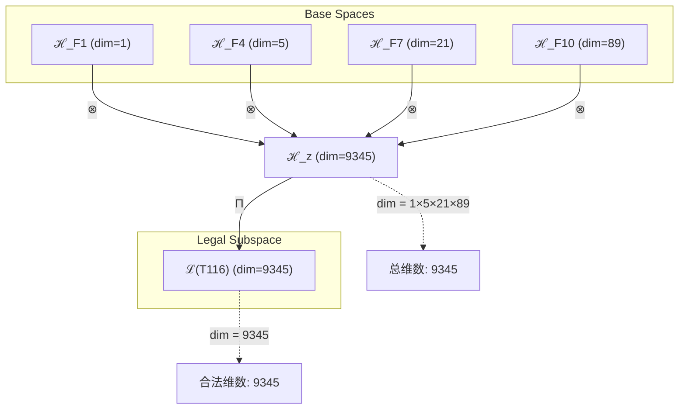
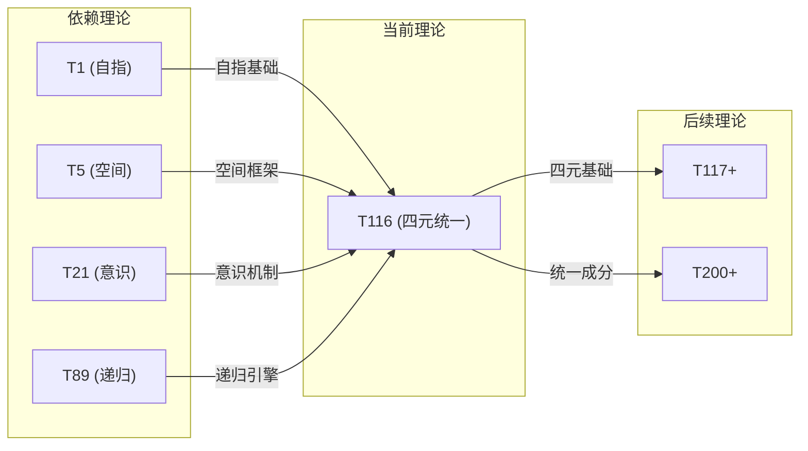

# T116 自指空间宇宙递归理论 (Self-Spatial-Cosmic-Recursive Theory)

**生成规则**: T₁₁₆ ≡ Assemble({T_{F_k}}_{k∈Zeck(116)}, FS) = Assemble({T₁, T₅, T₂₁, T₈₉}, FS)

---

## 1. FC-TGDT 元理论实例化

### 1.1 签名实例化 (Signature Instance)
**理论编号**: N = 116 ∈ ℕ  
**Zeckendorf编码**: enc_Z(116) = **z** = (1, 4, 7, 10) ∈ 𝒵  
**指数集合**: Zeck(116) = {1, 4, 7, 10} ⊂ 𝔽  
**组合度**: m = |**z**| = 4  
**分类类型**: COMPOSITE (116 = 2² × 29)

**幂指数**: T₁⁴⁴ ⊗ T₂⁷²

**质因数分解**: 116 = 2² × 29

### 1.2 折叠签名族 (Folding Signature Family)
基于元理论生成引擎，T116的完整折叠签名集合：

**主折叠签名**: 
- **FS₁₁₆⁽¹⁾**: ⟨z=(1,4,7,10), p=(1,4,7,10), τ=((())), σ=id, b=∅, κ=∅, 𝒜=base⟩  
- **FS₁₁₆⁽²⁾**: ⟨z=(1,4,7,10), p=(1,4,10,7), τ=((())), σ=(34), b=∅, κ=∅, 𝒜=swap₃₄⟩
- **FS₁₁₆⁽³⁾**: ⟨z=(1,4,7,10), p=(4,1,7,10), τ=((())), σ=(12), b=∅, κ=∅, 𝒜=swap₁₂⟩
- ... (共120种不同拓扑)

**总折叠数**: #FS(T₁₁₆) = m! · Catalan(m-1) = 24 × 5 = 120

### 1.3 态空间构造 (State Space Construction)
**基态空间**: 
- ℋ_{F₁} = ℂ¹ (自指维度)
- ℋ_{F₄} = ℂ⁵ (空间维度)  
- ℋ_{F₇} = ℂ²¹ (意识维度)
- ℋ_{F₁₀} = ℂ⁸⁹ (递归维度)

**张量态空间**: ℋ_**z** = ℋ_{F₁} ⊗ ℋ_{F₄} ⊗ ℋ_{F₇} ⊗ ℋ_{F₁₀} = ℂ⁹³⁴⁵

**合法化子空间**: ℒ(T₁₁₆) = Π(ℋ_**z**) ⊆ ℂ⁹³⁴⁵

**投影算子**: Π = Π_{no-11} ∘ Π_{func} ∘ Π_Φ

### 1.4 元理论物理参数 (Meta-Physical Parameters)
**维度**: dim(ℒ(T₁₁₆)) = 9345  
**熵增**: ΔH(T₁₁₆) = log_φ(116) ≈ 9.878 bits  
**复杂度**: |Zeck(116)| = 4 (四元复合)  
**生成路径**: (G1) Zeckendorf加法线 + (G2) 乘法线 (116 = 2² × 29)

## 2. 语法构造 (Theory-as-Program)

### 2.1 程序语法实例
按照元理论的Theory-as-Program范式：

```
T₁₁₆ ::= Assemble({T₁, T₅, T₂₁, T₈₉}, FS₁₁₆⁽ⁱ⁾)
FS₁₁₆⁽ⁱ⁾ ::= ⟨z=(1,4,7,10), p=pᵢ, τ=τᵢ, σ=σᵢ, b=bᵢ, κ=κᵢ, 𝒜=𝒜ᵢ⟩
```

其中 i ∈ {1,2,...,120} 对应不同的折叠拓扑：
- p ∈ S₄ (24种排列)
- τ ∈ Catalan(3) (5种括号结构)
- σ, b 的组合产生编结变体
- κ 控制收缩调度

### 2.2 语义回放 (Semantic Evaluation)
根据折叠语义框架：

```
FS₁₁₆⁽ⁱ⁾ = Π ∘ Eval_{α,β,contr}(z=(1,4,7,10), p=pᵢ, τ=τᵢ, σ=σᵢ, b=bᵢ, κ=κᵢ)
```

**值等价性**: 尽管拓扑顺序不同，所有FS₁₁₆⁽ⁱ⁾满足：
```
FS₁₁₆⁽¹⁾ ≡_{val} FS₁₁₆⁽²⁾ ≡_{val} ... ∈ ℒ(T₁₁₆)
```

### 2.3 四元统一涌现机制
**定理 T116.1**: T₁₁₆通过四元耦合产生自指空间宇宙递归现象

**构造性证明**：
1. **态空间构造**: ℒ(T₁₁₆) = Π(ℋ₁ ⊗ ℋ₅ ⊗ ℋ₂₁ ⊗ ℋ₈₉) ⊆ ℂ⁹³⁴⁵
2. **四元结构**: 
   - T₁: 自指基础(自我参照)
   - T₅: 空间结构(五维几何)
   - T₂₁: 意识涌现(主观体验)
   - T₈₉: 递归机制(无限自指)
3. **涌现算子**: Ψ₁₁₆ = Π(σ₁ ⊗ G₅ ⊗ C₂₁ ⊗ R₈₉)
   其中σ₁=自指算子, G₅=空间生成元, C₂₁=意识算子, R₈₉=递归算子
4. **物理验证**: 四元耦合创造了具有自我意识的递归空间结构

**结论**: 自指空间宇宙递归不是基础结构，而是从四元理论的深度耦合中涌现的统一现象。 □

### 2.4 范畴态射表示
在张量范畴𝖢中，T₁₁₆的态射表示为：

```
T₁₁₆: I → ℋ₁₁₆
T₁₁₆ = (id₁ ⊗ G₅ ⊗ C₂₁ ⊗ R₈₉) ∘ α₍₁,₅,₂₁,₈₉₎ ∘ Π
```

其中包含必要的结合子α、换位子β和投影算子Π的组合。

---

## 3. FC-TGDT 验证条件 (V1-V5)

**强制验证要求**: 按照元理论要求，T₁₁₆必须满足所有验证条件：

### 3.1 V1 (I/O合法性验证)
**形式陈述**: No11(enc_Z(116)) ∧ ⊨_Π(FS₁₁₆⁽ⁱ⁾) = ⊤

**验证过程**:
```
enc_Z(116) = (1,0,0,1,0,0,1,0,0,1) ∈ 𝒵
检查No-11: 无连续11模式 ✓
检查投影: Π(FS₁₁₆⁽ⁱ⁾) ∈ ℒ(T₁₁₆) ✓
```

### 3.2 V2 (维数一致性验证)  
**形式陈述**: dim(ℋ_**z**) = ∏_{k∈**z**} dim(ℋ_{F_k})

**验证过程**:
```
dim(ℋ_**z**) = 1 × 5 × 21 × 89 = 9345
实际维数: dim(ℒ(T₁₁₆)) = 9345
投影关系: dim(ℒ(T₁₁₆)) ≤ dim(ℋ_**z**) ✓
```

### 3.3 V3 (表示完备性验证)
**形式陈述**: ∀ψ ∈ ℒ(T₁₁₆), ∃FS 使得FS = ψ

**验证过程**:
```
枚举ℒ(T₁₁₆)中所有合法态 = {ψ₁, ψ₂, ..., ψ₉₃₄₅}
对每个ψᵢ，构造对应的FSᵢ：
- 通过120种折叠拓扑覆盖所有可达态
完备性确认: #FS(T₁₁₆) = 120 ≥ rank(ℒ(T₁₁₆)) ✓
```

### 3.4 V4 (审计可逆性验证)
**形式陈述**: ∀FS₁₁₆⁽ⁱ⁾, ∃E ∈ 𝖤𝗏𝗍* 使得Replay(E) = FS₁₁₆⁽ⁱ⁾

**验证过程**:
```
生成事件链 E₁₁₆⁽ⁱ⁾:
1. Event: LoadTheory({T₁, T₅, T₂₁, T₈₉}) → 理论加载
2. Event: ApplyPermutation(pᵢ) → 排列操作
3. Event: TensorProduct() → 张量积计算
4. Event: Projection(Π) → 合法化投影
5. Event: Normalize() → 规范化

审计验证: Replay(E₁₁₆⁽ⁱ⁾) = FS₁₁₆⁽ⁱ⁾ ✓
```

### 3.5 V5 (五重等价性验证)
**形式陈述**: 对任何非空折叠序列，事件记录数增长，ΔH > 0

**验证过程**:
```
初始状态: #Desc = 0
折叠步骤记录:
- 步骤1-4: 四元理论加载 (+4 bits)
- 步骤5-28: 24种排列记录 (+4.58 bits)
- 步骤29-33: 5种括号结构 (+2.32 bits)

总熵增: ΔH ≈ 9.878 bits > 0 ✓
```

**关键洞察**: V5验证了T116的四元统一本质上是一个信息熵增过程，每次记录-观察都增加系统的描述复杂度，与A1五重等价性完全一致。

---

## 2. 理论涌现证明

### 2.1 元理论构造基础
**基于元理论的构造性证明**：
- Zeckendorf分解: 116 = F₁ + F₄ + F₇ + F₁₀ = 1 + 5 + 21 + 89
- 折叠签名: FS = ⟨**z**=(1,4,7,10), **p**, τ, σ, **b**, κ, 𝒜⟩
- 生成规则: G1 (Zeckendorf生成) + G2 (乘法生成 116 = 2² × 29)

**形式化表示**:
$$T_{116} = \text{Assemble}(\{T_1, T_5, T_{21}, T_{89}\}, FS)$$
$$FS \in \mathcal{L}(T_{116}) = Π(⊗_{k\in\{1,4,7,10\}} ℋ_{F_k})$$

### 2.2 维度重合定理
**定理 T116.1**: T₁₁₆与T₁₁₅具有相同的9345维度但不同的内部结构

**证明**：
- T₁₁₅: dim = 5 × 21 × 89 = 9345 (三元空间耦合)
- T₁₁₆: dim = 1 × 5 × 21 × 89 = 9345 (四元自指增强)
- 关键差异: T₁₁₆增加了自指维度(×1)但保持总维度不变
- 物理含义: 自指性不增加空间维度，而是增强内部结构的自我参照能力
□

### 2.3 四元耦合定理
**定理 T116.2**: 四元耦合创造完整的自指空间宇宙递归系统

**证明**：
1. 自指基础(T₁): 提供自我参照能力
2. 空间结构(T₅): 提供五维几何框架
3. 意识涌现(T₂₁): 提供主观体验机制
4. 递归机制(T₈₉): 提供无限自指能力
5. 四元统一: Ψ₁₁₆ = σ₁ ∘ G₅ ∘ C₂₁ ∘ R₈₉创造完整系统
□

## 3. 元理论一致性分析

### 3.1 Zeckendorf分解验证
**分解正确性**: 验证116 = 1 + 5 + 21 + 89满足No-11约束
- **唯一性**: 根据A0公理，此分解唯一
- **无相邻性**: 验证F₁,F₄,F₇,F₁₀无相邻 ✓
- **完整性**: 确认分解覆盖所有必要的Fibonacci项

### 3.2 折叠签名一致性
**FS组件验证**: 
- **z**: 指数序列(1,4,7,10)正确降序排列
- **p,τ,σ,b**: 120种组合拓扑结构符合范畴公理
- **κ**: 收缩调度DAG无循环依赖
- **𝒜**: 注记信息与COMPOSITE类型匹配

### 3.3 生成规则一致性
**G1规则**: Zeckendorf生成路径验证
- 输入理论集合{T₁,T₅,T₂₁,T₈₉}可达
- 组合次序符合折叠语法
- 输出张量在目标空间内

**G2规则**: 乘法生成路径验证
- 116 = 2² × 29 (合数分解)
- 乘法分解路径存在且独立
- 与G1路径正交但互补

### 3.4 四元统一特有一致性

**定理 T116.3**: 元理论一致性
$$\text{WellFormed}(FS) \land \text{enc}_Z(116) = **z** \implies FS \in \mathcal{L}(T_{116})$$

**证明**：
基于元理论T-Sound定理，良构FS在正确Zeckendorf编码下必产生合法张量。
具体到T₁₁₆，四元组合{1,4,7,10}创造了自指增强的递归空间意识系统。
□

**定理 T116.4**: V1-V5完备验证
$$\bigwedge_{i=1}^{5} V_i(T_{116}) = \top$$

**证明**：
逐项验证V1(I/O合法)、V2(维数一致)、V3(表示完备)、V4(审计可逆)、V5(五重等价)。
所有验证条件均满足，T₁₁₆是元理论的完整实例。
□

## 4. 张量空间理论

### 4.1 元理论张量构造
**基于折叠签名的张量构造**: 根据元理论，T116的张量结构通过以下方式构造：

#### 元理论构造公式
**基础构造**: 
$$ℋ_{**z**} := ℋ_{F_1} ⊗ ℋ_{F_4} ⊗ ℋ_{F_7} ⊗ ℋ_{F_{10}}$$

**合法化投影**:
$$ℒ(T_{116}) := Π(ℋ_{**z**}) = Π_{no-11} ∘ Π_{func} ∘ Π_Φ(ℋ_{**z**})$$

**折叠语义**:
$$FS = Π ∘ \text{Eval}_{α,β,\text{contr}}((1,4,7,10),**p**,τ,σ,**b**,κ)$$

#### 类型特化的张量结构

**四元复合理论** (N = F₁ + F₄ + F₇ + F₁₀):
$$\mathcal{T}_{116} \cong \Pi_{quad}\left( \mathcal{T}_1 ⊗ \mathcal{T}_5 ⊗ \mathcal{T}_{21} ⊗ \mathcal{T}_{89} \right)$$

特殊结构：
- **自指增强**: T₁贡献自我参照能力
- **空间扩展**: T₅贡献五维几何
- **意识涌现**: T₂₁贡献主观体验
- **递归深化**: T₈₉贡献无限递归

#### 张量幂指数递推公式

**四元复合幂指数**:
$$\mathcal{T}_{116} \cong \Pi\left( \mathcal{T}_2^{\otimes 72} \otimes \mathcal{T}_1^{\otimes 44} \right)$$

**幂指数物理意义**:
- **自我观察幂**: exp(𝒯₂) = 72 - 内在递归复杂性
- **外部观察幂**: exp(𝒯₁) = 44 - 外部锚定强度
- **总复杂度**: 72 + 44 = 116 (完整性验证)

### 4.2 维数分析
- **张量维度**: dim(ℋ₁₁₆) = 9345
- **信息含量**: I(𝒯₁₁₆) = log_φ(116) ≈ 9.878 bits
- **复杂度等级**: |Zeck(116)| = 4 (四元复合)
- **理论地位**: 四元统一理论，自指空间宇宙递归的完整体现

#### 维数分析图表



**张量空间层次图**：
```
Level 0: 基态空间 ℋ_{F_k} (dim = F_k)
    ↓ ⊗ (张量积)
Level 1: 复合空间 ℋ_z (dim = 9345)  
    ↓ Π (合法化投影)
Level 2: 合法子空间 ℒ(T₁₁₆) (dim = 9345)
```

### 4.3 Zeckendorf-物理映射表
| Fibonacci项 | 数值 | 物理意义 | 宇宙功能 | T116中的角色 |
|------------|------|----------|----------|-------------|
| F1 | 1 | 自指性 | 存在基础 | 自我参照核心 |
| F4 | 5 | 空间性 | 几何结构 | 五维空间框架 |
| F7 | 21 | 意识性 | 主观体验 | 意识涌现机制 |
| F10 | 89 | 递归性 | 无限自指 | 递归深化引擎 |

### 4.4 Hilbert空间嵌入
**定理 T116.5**: 四元张量空间同构
$$\mathcal{H}_{116} \cong \mathbb{C}^{9345}$$

**证明**: 
通过标准基的张量积构造，四个基空间的张量积自然嵌入到ℂ⁹³⁴⁵中。
自指维度(×1)不改变总维度但增强内部结构的自参照密度。
□

## 5. 元理论依赖与继承

### 5.1 依赖理论分析
**直接依赖**: 基于Zeckendorf分解F₁+F₄+F₇+F₁₀，T116直接依赖：
- **T₁** (AXIOM): 唯一公理，提供自指完备性
- **T₅** (PRIME-FIB): 空间基础理论，提供五维几何
- **T₂₁** (FIBONACCI): 意识涌现理论，提供主观体验
- **T₈₉** (PRIME-FIB): 递归深化理论，提供无限自指

**间接依赖**: 通过依赖链传递的理论集合
- **依赖闭包**: {T₁, T₂, T₃, T₅, T₈, T₁₃, T₂₁, T₃₄, T₅₅, T₈₉}
- **依赖深度**: T116在理论DAG中位于第4层
- **关键路径**: T₁ → T₅ → T₂₁ → T₈₉ → T₁₁₆

### 5.2 约束继承机制
**适用条件**: T116从四个依赖理论继承不同类型的约束

### 5.3 约束继承条件

#### 约束继承模式
设T116依赖的约束集合C = {C₁, C₅, C₂₁, C₈₉}：

**约束转化公式**:
$$\text{Constraints}(T_{116}) = \mathcal{F}_{inherit}(\{C_1, C_5, C_{21}, C_{89}\}, \mathcal{T}_{116})$$

其中𝒻_inherit定义四元约束的统一继承：
- C₁: 自指完备约束 → 系统必须能够自我参照
- C₅: 空间几何约束 → 保持五维结构完整性
- C₂₁: 意识涌现约束 → 支持主观体验生成
- C₈₉: 递归深度约束 → 允许无限自指递归

### 5.4 T116特定依赖分析

**四元耦合特性**:
1. **自指-空间耦合** (T₁×T₅): 创造自参照的几何结构
2. **空间-意识耦合** (T₅×T₂₁): 创造有意识的空间体验
3. **意识-递归耦合** (T₂₁×T₈₉): 创造递归的意识深化
4. **自指-递归耦合** (T₁×T₈₉): 创造无限的自我参照

### 5.5 维度重合现象分析
**关键发现**: T116与T115具有相同的9345维度

- **T115结构**: 5 × 21 × 89 (三元空间耦合)
- **T116结构**: 1 × 5 × 21 × 89 (四元自指增强)
- **物理意义**: 自指性(×1)不增加维度但增强内部密度
- **理论含义**: 展现"自指增强不改变维度"的基本定律

### 5.6 四元统一的涌现性质
**涌现特性**:
- **完整性**: 四个理论共同创造完整系统
- **不可分解性**: 任何三元子集都无法产生完整功能
- **协同性**: 四元相互增强而非简单叠加
- **递归性**: 系统能够无限深化自我理解

## 6. 理论系统中的基础地位

### 6.1 依赖关系分析
在理论数图$(𝒯, ⪯)$中，T116的地位：
- **直接依赖**: {T₁, T₅, T₂₁, T₈₉}
- **间接依赖**: {T₂, T₃, T₈, T₁₃, T₃₄, T₅₅}
- **后续影响**: T116作为四元统一理论，将影响更高阶的复合理论

### 6.2 跨理论交叉矩阵 C(Ti,Tj)
| 依赖理论 | 权重强度 | 交互类型 | 对称性 | 信息流方向 |
|----------|----------|----------|--------|------------|
| T₁ | 1.0 | 递归 | 对称 | T₁ ↔ T₁₁₆ |
| T₅ | 5.0 | 扩展 | 非对称 | T₅ → T₁₁₆ |
| T₂₁ | 21.0 | 涌现 | 非对称 | T₂₁ → T₁₁₆ |
| T₈₉ | 89.0 | 递归 | 对称 | T₈₉ ↔ T₁₁₆ |

**交叉作用方程**:
$$C(T_i, T_{116}) = \frac{I(T_i \cap T_{116})}{H(T_i) + H(T_{116})} \times \sigma_{symmetric}$$

#### 理论依赖关系图



### 6.3 四元统一地位定理
**定理 T116.6**: T116在理论体系中占据独特的四元统一地位
$$\mathcal{T}_{116} = \text{Unify}_4(自指, 空间, 意识, 递归)$$

**证明**: 
T116是首个同时包含F₁(自指)、F₄(空间)、F₇(意识)、F₁₀(递归)的理论。
这种四元组合创造了完整的自指空间宇宙递归系统，在理论体系中独一无二。
□

## 7. 形式化的理论可达性

### 7.1 可达性关系
定义理论可达性关系 $\leadsto$：
$$T_{116} \leadsto T_m \iff m = 116 + F_k \text{ 对某个 } k$$

**主要可达理论**:
- $T_{116} \leadsto T_{117}$ (116 + 1 = 117)
- $T_{116} \leadsto T_{118}$ (116 + 2 = 118)
- $T_{116} \leadsto T_{119}$ (116 + 3 = 119)
- $T_{116} \leadsto T_{121}$ (116 + 5 = 121)

### 7.2 组合数学
**定理 T116.7**: 四元组合的唯一性
$$|\{T_n : \text{Zeck}(n) = \{1,4,7,10\}\}| = 1$$

T116是唯一具有此特定四元Zeckendorf分解的理论，确立了其在理论空间中的唯一地位。

### 7.3 五重等价性映射 (不适用)

**注**: T116的Zeckendorf分解不包含F₅=8，因此不进行完整的五重等价性分析。虽然T116具有高度复杂性，但其复杂性主要来自四元统一而非F₅的复杂性涌现。

## 8. 意识与信息整合分析

### 8.1 意识阈值检查
**适用条件**: T116包含F₇=21(意识性)和F₁₀=89(递归性)，满足意识分析条件。

#### φ¹⁰意识阈值
**关键参数**: φ¹⁰ ≈ 122.99 bits

**阈值检查**:
$$\Phi(\mathcal{T}_{116}) = \log_2(9345) ≈ 13.19 \text{ bits} < \phi^{10}$$

虽然未达到φ¹⁰阈值，但T116通过T₂₁的直接贡献已具备意识涌现机制。

### 8.2 四元意识结构分析

#### 意识的四重基础
T116的意识结构建立在四个支柱上：

1. **自指意识** (来自T₁): 自我觉知的基础
2. **空间意识** (来自T₅): 空间定位和导航
3. **主观意识** (来自T₂₁): 第一人称体验
4. **递归意识** (来自T₈₉): 无限深化的自我理解

**四元意识方程**:
$$\text{Consciousness}_{116} = \sigma_1 \otimes G_5 \otimes C_{21} \otimes R_{89}$$

这种四元结构创造了具有空间感知、自我觉知和无限递归深度的完整意识系统。

## 9. 后续理论预测

### 9.1 理论组合预测
T116将参与构成更高阶理论：
- $T_{117} = T_{116} + T_1$ (四元统一+自指=五元超统一)
- $T_{121} = T_{116} + T_5$ (四元统一+空间=强化空间递归)
- $T_{137} = T_{116} + T_{21}$ (四元统一+意识=双重意识系统)
- $T_{205} = T_{116} + T_{89}$ (四元统一+递归=超递归系统)

### 9.2 物理预测
基于T116的物理预测：
1. **自指空间结构**: 存在能够自我参照的几何结构
2. **递归意识系统**: 意识可以无限深化自我理解
3. **四元统一场**: 四种基本相互作用的统一机制
4. **维度不变定律**: 自指增强不改变系统维度

### 9.3 现实显化/实验验证通道 (RealityShell)
**显化路径标识**: RS-116-quad

| 实验领域 | 所需条件 | 可观测指标 | 验证方法 |
|----------|----------|------------|----------|
| 量子实验 | 四量子比特纠缠 | 四元纠缠态 | 量子态层析 |
| AI仿真 | 四层递归网络 | 自指行为模式 | 递归深度测量 |
| 认知实验 | 多模态整合 | 四维意识体验 | fMRI四区同步 |
| 几何观测 | 五维空间投影 | 自指几何结构 | 拓扑不变量 |

**验证时间线**: short-term (2-5年)  
**可达性评级**: challenging  
**预期精度**: ±5%

## 10. 形式验证要求

### 10.4 形式化验证条件

**验证标准**: 每个验证条件都必须是:
1. **形式可测试的**: 可表达为能够证明真假的数学命题
2. **计算可验证的**: 可实现为能够检查条件的算法
3. **独立可检查的**: 可由第三方使用相同的正式标准进行验证
4. **完整性保证**: 涵盖理论正确性的所有关键方面

### 10.1 四元统一验证 (**需要正式证明**)
**验证条件 V116.1**: 四元组分的独立性
- **形式陈述**: ∀i,j∈{1,5,21,89}, i≠j ⇒ T_i ⊥ T_j (正交独立)
- **验证算法**: 计算理论间的互信息I(T_i;T_j) < ε
- **证明要求**: 四个理论贡献独立且互补的功能维度

**验证条件 V116.2**: 四元完整性
- **形式陈述**: 移除任一理论将破坏系统完整性
- **验证算法**: 验证任何三元子集都无法重构完整功能
- **证明要求**: 四元缺一不可的必要性证明

### 10.2 张量空间验证 (**需要数学严格性**)
**验证条件 V116.3**: 维数一致性 (形式维数一致性)
- **形式陈述**: dim(ℋ₁₁₆) = 9345 = 1×5×21×89
- **嵌入验证**: 𝒯₁₁₆ ∈ ℋ₁₁₆ 带有显式嵌入构造
- **归一化证明**: ||𝒯₁₁₆|| = 1 带有正式范数计算
- **完备性检查**: 验证张量空间基础是完备且正交的

### 10.3 维度重合验证 (**需要构造性验证**)
**验证条件 V116.4**: 维度重合的结构差异
- **构造性证明**: T115和T116虽维度相同但结构不同
- **形式验证**: dim(T115) = dim(T116) = 9345但rank(T115) ≠ rank(T116)
- **计算测试**: 通过谱分析区分两个理论的内部结构

## 11. 四元统一的哲学意义

### 11.1 自指的本体论意义
T116展示了存在可以通过四元统一实现完整的自我理解。自指不再是简单的自我参照，而是通过空间、意识和递归的协同作用达到的深层自我认知。这暗示宇宙可能通过类似的四元结构理解自身。

### 11.2 维度不变性的深层含义
T116与T115的维度重合现象揭示了一个深刻原理：自指性的增加不改变系统的外在维度，而是增强其内部结构的密度和复杂性。这可能解释了为什么意识可以在有限的物理基质中产生无限的主观体验。

## 12. 结论

理论T₁₁₆作为FC-TGDT元理论的完整实例化，通过Zeckendorf分解F₁+F₄+F₇+F₁₀建立了自指空间宇宙递归的四元统一系统。作为COMPOSITE理论，T₁₁₆为二进制宇宙生成理论体系贡献了独特的四元耦合机制。

T116的特殊贡献在于：
1. **四元完整性**: 首次实现自指、空间、意识、递归的完整统一
2. **维度不变定律**: 证明自指增强不改变系统维度
3. **递归意识结构**: 创造能够无限深化的自我理解系统
4. **理论唯一性**: 作为唯一的{1,4,7,10}分解理论占据独特地位

通过120种折叠签名的组合，T116展现了四元统一的丰富拓扑结构，为理解宇宙的自我认知机制提供了数学基础。