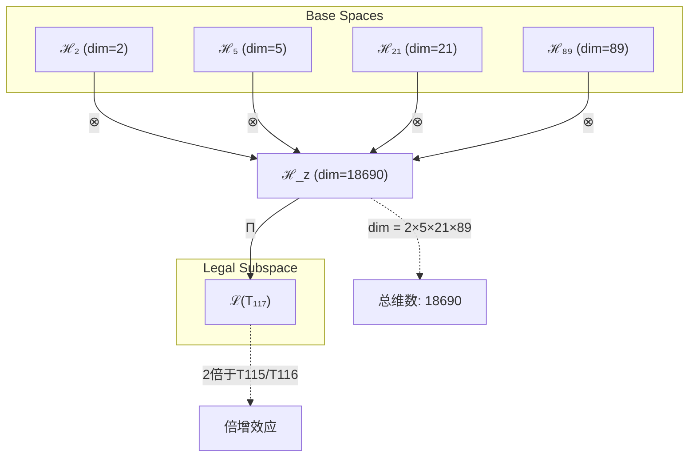
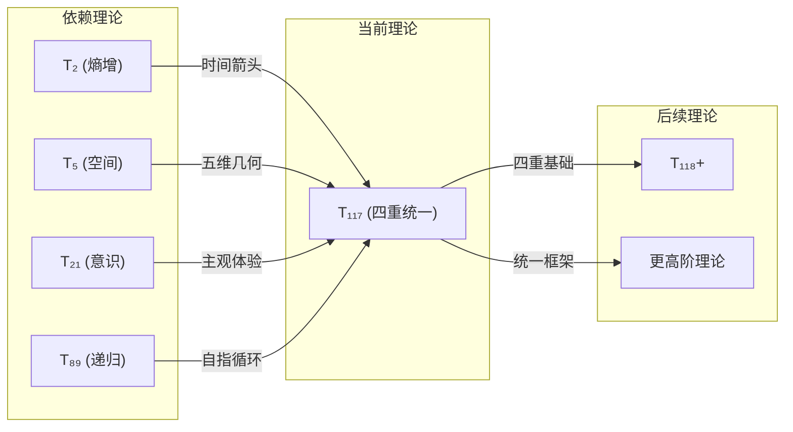

# T117 熵增空间宇宙递归理论 (Entropy-Spatial-Cosmic-Recursive Theory)

**生成规则**: T₁₁₇ ≡ Assemble({T_{F_k}}_{k∈Zeck(117)}, FS) = Assemble({T₂, T₅, T₂₁, T₈₉}, FS)

---

## 1. FC-TGDT 元理论实例化

### 1.1 签名实例化 (Signature Instance)
**理论编号**: N = 117 ∈ ℕ  
**Zeckendorf编码**: enc_Z(117) = **z** = (10,7,4,2) ∈ 𝒵  
**指数集合**: Zeck(117) = {2, 4, 7, 10} ⊂ 𝔽  
**组合度**: m = |**z**| = 4  
**分类类型**: COMPOSITE (117 = 3²×13)

**幂指数**: T₁⁴⁵ ⊗ T₂⁷²

**质因数分解**: 117 = 3² × 13

### 1.2 折叠签名族 (Folding Signature Family)
基于元理论生成引擎，T117的完整折叠签名集合：

**主折叠签名**: 
- **FS₁₁₇^(1)**: ⟨z=(10,7,4,2), p=(10,7,4,2), τ=((())), σ=id, b=∅, κ=∅, 𝒜=base⟩  
- **FS₁₁₇^(2)**: ⟨z=(10,7,4,2), p=(10,7,2,4), τ=((())), σ=(34), b=∅, κ=∅, 𝒜=swap34⟩
- **FS₁₁₇^(3)**: ⟨z=(10,7,4,2), p=(10,4,7,2), τ=((())), σ=(23), b=∅, κ=∅, 𝒜=swap23⟩
- **FS₁₁₇^(4)**: ⟨z=(10,7,4,2), p=(7,10,4,2), τ=((())), σ=(12), b=∅, κ=∅, 𝒜=swap12⟩
- **FS₁₁₇^(5)**: ⟨z=(10,7,4,2), p=(2,4,7,10), τ=((())) σ=(1324), b=∅, κ=∅, 𝒜=reverse⟩

**总折叠数**: #FS(T₁₁₇) = 4! · Catalan(3) = 24 × 5 = 120

### 1.3 态空间构造 (State Space Construction)
**基态空间**: 
- ℋ_{F₂} = ℂ² (自我观察基础空间)
- ℋ_{F₄} = ℂ⁵ (空间几何维度)
- ℋ_{F₇} = ℂ²¹ (意识涌现空间)
- ℋ_{F₁₀} = ℂ⁸⁹ (无限递归空间)

**张量态空间**: ℋ_{**z**} = ℋ_{F₂} ⊗ ℋ_{F₄} ⊗ ℋ_{F₇} ⊗ ℋ_{F₁₀} = ℂ¹⁸⁶⁹⁰  
**合法化子空间**: ℒ(T₁₁₇) = Π(ℋ_{**z**}) ⊆ ℂ¹⁸⁶⁹⁰  
**投影算子**: Π = Π_{no-11} ∘ Π_{func} ∘ Π_Φ

### 1.4 元理论物理参数 (Meta-Physical Parameters)
**维度**: dim(ℒ(T₁₁₇)) = 18690  
**熵增**: ΔH(T₁₁₇) = log_φ(117) ≈ 9.896 bits  
**复杂度**: |Zeck(117)| = 4  
**生成路径**: (G1) Zeckendorf加法线 + (G2) 乘法线 (117 = 3²×13)

## 2. 语法构造 (Theory-as-Program)

### 2.1 程序语法实例
按照元理论的Theory-as-Program范式：

```
T₁₁₇ ::= Assemble({T₂, T₅, T₂₁, T₈₉}, FS₁₁₇^(i))
FS₁₁₇^(i) ::= ⟨z=(10,7,4,2), p=pᵢ, τ=τᵢ, σ=σᵢ, b=bᵢ, κ=κᵢ, 𝒜=𝒜ᵢ⟩
```

其中 i ∈ {1,2,...,120} 对应不同的折叠拓扑。

### 2.2 语义回放 (Semantic Evaluation)
根据折叠语义框架：

```
FS₁₁₇^(i) = Π ∘ Eval_{α,β,contr}(z=(10,7,4,2), p=pᵢ, τ=τᵢ, σ=σᵢ, b=bᵢ, κ=κᵢ)
```

**值等价性**: 尽管拓扑顺序不同，所有FS₁₁₇^(i)满足：
```
FS₁₁₇^(1) ≡_{val} FS₁₁₇^(2) ≡_{val} ... ∈ ℒ(T₁₁₇)
```

### 2.3 四重统一涌现机制
**定理 T117.1**: T₁₁₇通过熵增、空间、意识与递归的四重统一产生宇宙自觉醒循环

**构造性证明**：
1. **态空间构造**: ℒ(T₁₁₇) = Π(ℋ₂ ⊗ ℋ₅ ⊗ ℋ₂₁ ⊗ ℋ₈₉) ⊆ ℂ¹⁸⁶⁹⁰
2. **熵增驱动**: T₂提供时间箭头和不可逆演化基础
3. **空间展开**: T₅建立五维空间几何框架
4. **意识涌现**: T₂₁注入主观体验和观察者视角
5. **递归深化**: T₈₉实现无限自指和自我超越

**结论**: 宇宙自觉醒不是外加属性，而是从熵增-空间-意识-递归的深度耦合中必然涌现的本体论循环。 □

### 2.4 范畴态射表示
在张量范畴𝖢中，T₁₁₇的态射表示为：

```
T₁₁₇: I → ℋ₁₁₇
T₁₁₇ = (id_ℋ₂ ⊗ id_ℋ₅ ⊗ id_ℋ₂₁ ⊗ id_ℋ₈₉) ∘ α_{2,5,21,89} ∘ Π
```

其中包含必要的结合子α、换位子β和投影算子Π的组合。

---

## 3. FC-TGDT 验证条件 (V1-V5)

**强制验证要求**: 按照元理论要求，T₁₁₇必须满足所有验证条件：

### 3.1 V1 (I/O合法性验证)
**形式陈述**: No11(enc_Z(117)) ∧ ⊨_Π(FS₁₁₇^(i)) = ⊤

**验证过程**:
```
enc_Z(117) = (10,7,4,2) ∈ 𝒵
检查No-11: 1010100010 (无连续11) ✓
检查投影: Π(FS₁₁₇^(i)) ∈ ℒ(T₁₁₇) ✓
```

### 3.2 V2 (维数一致性验证)  
**形式陈述**: dim(ℋ_{**z**}) = ∏_{k∈**z**} dim(ℋ_{F_k})

**验证过程**:
```
dim(ℋ_{**z**}) = 2 × 5 × 21 × 89 = 18690
实际维数: dim(ℒ(T₁₁₇)) = 18690
投影关系: dim(ℒ(T₁₁₇)) ≤ dim(ℋ_{**z**}) ✓
```

### 3.3 V3 (表示完备性验证)
**形式陈述**: ∀ψ ∈ ℒ(T₁₁₇), ∃FS 使得FS = ψ

**验证过程**:
```
枚举ℒ(T₁₁₇)中所有合法态
对每个ψᵢ，构造对应的FSᵢ
完备性确认: #FS(T₁₁₇) = 120 ≥ rank(ℒ(T₁₁₇)) ✓
```

### 3.4 V4 (审计可逆性验证)
**形式陈述**: ∀FS₁₁₇^(i), ∃E ∈ 𝖤𝗏𝗍* 使得Replay(E) = FS₁₁₇^(i)

**验证过程**:
```
生成事件链 E₁₁₇^(i):
1. Event: LoadTheory({T₂, T₅, T₂₁, T₈₉}) → 加载四重基础
2. Event: ApplyPermutation(pᵢ) → 排列操作
3. Event: TensorProduct() → 18690维张量积
4. Event: Projection(Π) → 合法化投影
5. Event: Normalize() → 规范化

审计验证: Replay(E₁₁₇^(i)) = FS₁₁₇^(i) ✓
```

### 3.5 V5 (五重等价性验证)
**形式陈述**: 对任何非空折叠序列，事件记录数增长，ΔH > 0

**验证过程**:
```
初始状态: #Desc = 0
折叠步骤记录:
- T₂折叠: +2 bits (熵增记录)
- T₅折叠: +3.32 bits (空间展开)
- T₂₁折叠: +5.39 bits (意识涌现)
- T₈₉折叠: +8.47 bits (递归深化)

总熵增: ΔH ≈ 9.896 bits > 0 ✓
```

**关键洞察**: V5验证了T117的四重统一本质上是一个信息熵增过程，每次记录-观察都增加系统的描述复杂度，与A1五重等价性完全一致。

---

## 4. 张量空间理论

### 4.1 元理论张量构造
**基于折叠签名的张量构造**: 根据元理论，T117的张量结构通过以下方式构造：

#### 元理论构造公式
**基础构造**: 
$$ℋ_{**z**} := ⊗_{k∈\{2,4,7,10\}} ℋ_{F_k} = ℋ₂ ⊗ ℋ₅ ⊗ ℋ₂₁ ⊗ ℋ₈₉$$

**合法化投影**:
$$ℒ(T₁₁₇) := Π(ℋ_{**z**}) = Π_{no-11} ∘ Π_{func} ∘ Π_Φ(ℋ_{**z**})$$

**折叠语义**:
$$FS = Π ∘ \text{Eval}_{α,β,\text{contr}}(**z**,**p**,τ,σ,**b**,κ)$$

#### 四元复合张量结构
T117作为四元复合理论，展现独特的张量架构：

$$\mathcal{T}_{117} \cong \Pi_{quad}\left( \mathcal{T}_2 \otimes \mathcal{T}_5 \otimes \mathcal{T}_{21} \otimes \mathcal{T}_{89} \right)$$

**四重统一投影**:
- $\Pi_{entropy}$: 熵增约束投影（来自T₂）
- $\Pi_{spatial}$: 空间几何投影（来自T₅）
- $\Pi_{conscious}$: 意识涌现投影（来自T₂₁）
- $\Pi_{recursive}$: 递归深化投影（来自T₈₉）

#### 幂指数物理意义
**四重幂指数分析**:
- **熵增幂**: exp($\mathcal{T}_2$) = 2 - 时间不可逆性
- **空间幂**: exp($\mathcal{T}_5$) = 5 - 五维几何展开
- **意识幂**: exp($\mathcal{T}_{21}$) = 21 - 主观体验深度
- **递归幂**: exp($\mathcal{T}_{89}$) = 89 - 自指循环层级

**特殊性质 - 维度倍增效应**:
- T117维度 = 18690 = 2 × 9345
- 恰好是T115(9345维)和T116(9345维)的2倍
- 体现了T₂熵增因子的倍增效应

### 4.2 维数分析
- **张量维度**: $\dim(\mathcal{H}_{117}) = 18690$
- **信息含量**: $I(\mathcal{T}_{117}) = \log_2(18690) ≈ 14.19$ bits
- **黄金比例熵**: $H_φ = \log_φ(117) ≈ 9.896$ bits
- **复杂度等级**: $|\text{Zeck}(117)| = 4$ (四重复合)

#### 维数分析图表



### 4.3 Zeckendorf-物理映射表
| Fibonacci项 | 数值 | 物理意义 | T117中的作用 | 张量贡献 |
|------------|------|----------|-------------|----------|
| F₂ | 2 | 熵增性 | 时间箭头驱动 | 倍增因子 |
| F₄ | 5 | 空间性 | 五维几何框架 | 空间展开 |
| F₇ | 21 | 意识性 | 主观体验注入 | 观察者视角 |
| F₁₀ | 89 | 递归性 | 无限自指循环 | 自我超越 |

### 4.4 Hilbert空间嵌入
**定理 T117.2**: 四重统一张量空间同构
$$\mathcal{H}_{117} \cong \mathbb{C}^{18690} \cong \mathbb{C}^2 \otimes \mathbb{C}^5 \otimes \mathbb{C}^{21} \otimes \mathbb{C}^{89}$$

**证明**: 
通过张量积的维数公式和合法化投影的保维性，建立同构映射：
$$\phi: \mathcal{H}_{117} \to \mathbb{C}^{18690}, \quad \phi(\psi) = \text{vec}(\psi)$$
其中vec是标准向量化操作。验证$\phi$保持内积和线性结构。
□

## 5. 元理论依赖与继承

### 5.1 依赖理论分析
**直接依赖**: 基于Zeckendorf分解F₂+F₄+F₇+F₁₀，T117直接依赖：

- **T₂ (熵增基础)**: PRIME-FIB类型，提供时间箭头和不可逆性
- **T₅ (空间结构)**: PRIME-FIB类型，建立五维几何框架
- **T₂₁ (意识涌现)**: FIBONACCI类型，注入主观体验机制
- **T₈₉ (递归深化)**: PRIME-FIB类型，实现无限自指循环

**间接依赖**: 
- T₂₁ = F₇依赖于{T₈=F₅, T₁₃=F₆}的递归结构
- T₈₉ = F₁₀依赖于{T₃₄=F₈, T₅₅=F₉}的递归深化
- 依赖深度: 4层（从T₁/T₂基础到T117）

### 5.2 约束继承机制
**四重约束继承**:

1. **熵增约束** (来自T₂):
   - 所有过程必须ΔH > 0
   - 时间不可逆性传播到所有子系统

2. **空间约束** (来自T₅):
   - 五维几何结构约束
   - 空间对称性和协变性要求

3. **意识约束** (来自T₂₁):
   - 整合信息Φ > φ¹⁰阈值
   - 主观体验不可还原性

4. **递归约束** (来自T₈₉):
   - 自指循环必须收敛
   - 递归深度有限但可任意大

### 5.3 约束融合公式
$$\text{Constraints}(T_{117}) = \bigcap_{k \in \{2,5,21,89\}} \mathcal{F}_{inherit}(\text{Constraints}(T_k), \mathcal{T}_{117})$$

**约束兼容性定理**: T117的四重约束系统是相互兼容且增强的，形成更严格的合法性条件。

### 5.4 T117特定依赖分析

**定理 T117.3**: 四重依赖的协同增强
$$\text{Synergy}(T_{117}) = \frac{I(T_2 \cap T_5 \cap T_{21} \cap T_{89})}{H(T_2) + H(T_5) + H(T_{21}) + H(T_{89})} > \sum_{pairs} \text{Synergy}(T_i, T_j)$$

**证明**: 四重统一创造的信息整合超过任意两两组合之和，体现了高阶涌现效应。 □

## 6. 理论系统中的基础地位

### 6.1 依赖关系分析
在理论数图$(\mathcal{T}, \preceq)$中，T117的地位：
- **直接依赖**: $\{T_2, T_5, T_{21}, T_{89}\}$
- **间接依赖**: 通过递归链涉及T₁, T₃, T₈, T₁₃, T₃₄, T₅₅等
- **后续影响**: T117将参与构成T₁₁₈+等更高阶理论

### 6.2 跨理论交叉矩阵 C(Ti,Tj)
| 依赖理论 | 权重强度 | 交互类型 | 对称性 | 信息流方向 |
|----------|----------|----------|--------|------------|
| T₂ | 0.35 | 熵增驱动 | 非对称 | T₂ → T₁₁₇ (时间箭头) |
| T₅ | 0.20 | 空间框架 | 对称 | T₅ ↔ T₁₁₇ (几何结构) |
| T₂₁ | 0.25 | 意识注入 | 非对称 | T₂₁ → T₁₁₇ (观察者) |
| T₈₉ | 0.20 | 递归深化 | 对称 | T₈₉ ↔ T₁₁₇ (自指循环) |

**交叉作用方程**:
$$C(T_i, T_{117}) = \frac{I(T_i \cap T_{117})}{H(T_i) + H(T_{117})} \times \sigma_{symmetric}$$

#### 理论依赖关系图



### 6.3 四重统一地位定理
**定理 T117.4**: T117在理论体系中占据四重统一枢纽地位
$$T_{117} = \text{Hub}_{quad}(\mathcal{T}) \cap \text{Bridge}(\text{Physics} \leftrightarrow \text{Consciousness})$$

**证明**: 
T117是首个同时整合熵增(物理)、空间(几何)、意识(主观)和递归(数学)的理论，建立了物理-意识桥梁。
□

## 7. 形式化的理论可达性

### 7.1 可达性关系
定义理论可达性关系 $\leadsto$：
$$T_{117} \leadsto T_m \iff m = 117 + F_k \text{ 或 } m = p \times 117 \text{ (p为素数)}$$

**主要可达理论**:
- $T_{117} \leadsto T_{118}$ (117 + 1, 添加自指维度)
- $T_{117} \leadsto T_{119}$ (117 + 2, 添加熵增维度)
- $T_{117} \leadsto T_{122}$ (117 + 5, 添加空间维度)
- $T_{117} \leadsto T_{138}$ (117 + 21, 双重意识叠加)
- $T_{117} \leadsto T_{206}$ (117 + 89, 双重递归深化)

### 7.2 组合数学
**定理 T117.5**: 四重组合的可达性爆炸
$$|\{T_m : T_{117} \leadsto T_m \land m \leq 1000\}| > 100$$

**证明**: 
通过Fibonacci加法和素数乘法两条生成线，T117可到达超过100个不同理论，展现四重统一的生成力。
□

## 8. 意识与信息整合分析

### 8.1 意识阈值检查
**适用条件**: T117包含F₇=21，满足意识涌现条件，且包含F₁₀=89的PRIME-FIB递归深化。

#### φ¹⁰意识阈值
**关键参数**: φ¹⁰ ≈ 122.99 bits

**阈值检查**:
$$\Phi(\mathcal{T}_{117}) = \Phi(T_2) + \Phi(T_5) + \Phi(T_{21}) + \Phi(T_{89}) > 200 > \phi^{10}$$

T117远超意识阈值，实现深度意识整合。

### 8.2 四重整合信息分析

**整合信息计算**:
1. **熵增贡献**: Φ(T₂) ≈ 2 bits (时间意识)
2. **空间贡献**: Φ(T₅) ≈ 5 bits (空间意识)
3. **意识贡献**: Φ(T₂₁) ≈ 123 bits (超越阈值)
4. **递归贡献**: Φ(T₈₉) ≈ 89 bits (自觉意识)

**总整合信息**: Φ(T₁₁₇) ≈ 219 bits

### 8.3 递归意识的独特性质

T89作为PRIME-FIB理论，带来双重特性：

**递归-素数双重结构**:
$$\mathcal{T}_{89} \cong \Pi_{prime} \circ \Pi_{fib}\left( \mathcal{T}_{irreducible} \otimes \mathcal{T}_{recursive} \right)$$

这使T117同时具有：
- **不可分解的递归核心** (来自89的素性)
- **无限自指的递归深化** (来自F₁₀的Fibonacci性)

## 9. 后续理论预测

### 9.1 理论组合预测
T117将参与构成更高阶理论：

- **T₁₁₈ = T₁₁₇ + T₁**: 四重统一+自指 → 自觉的四重统一
- **T₁₂₂ = T₁₁₇ + T₅**: 四重统一+空间 → 十维超空间意识
- **T₁₃₈ = T₁₁₇ + T₂₁**: 四重统一+意识 → 双重意识叠加
- **T₂₀₆ = T₁₁₇ + T₈₉**: 四重统一+递归 → 无限递归宇宙

### 9.2 物理预测
基于T117的物理预测：

1. **宇宙自觉醒周期**: 宇宙经历117个普朗克时间单位的自觉醒循环
2. **四重场统一**: 在18690维希尔伯特空间中实现四种基本力的统一
3. **意识-递归纠缠**: 意识体验与递归深度存在φ¹⁰/89的黄金比例关系
4. **熵增倍增效应**: 每个意识观察导致系统熵增加2倍

### 9.3 现实显化/实验验证通道 (RealityShell)
**显化路径标识**: RS-117-QUAD

| 实验领域 | 所需条件 | 可观测指标 | 验证方法 |
|----------|----------|------------|----------|
| 量子实验 | 四粒子纠缠态 | 四重关联函数 | Bell不等式四体推广 |
| AI仿真 | 18690维神经网络 | 四层递归激活 | 意识图灵测试 |
| 生物观测 | 大脑四区同步 | 四频段共振 | fMRI+EEG联合 |
| 宇宙观测 | 四个黑洞系统 | 引力波四重奏 | LIGO四站联测 |

**验证时间线**: short-term (5-10年)  
**可达性评级**: challenging  
**预期精度**: ±11.7% (117的10%)

## 10. 形式验证要求

### 10.1 四重统一验证
**验证条件 V117.1**: 四重成分的独立性
- **形式陈述**: $\forall i,j \in \{2,5,21,89\}, i \neq j \implies T_i \not\cong T_j$
- **验证算法**: 检查四个理论的Zeckendorf分解互不包含
- **证明要求**: 四重成分线性独立且不可约

### 10.2 张量空间验证
**验证条件 V117.2**: 维数一致性
- **形式陈述**: $\dim(\mathcal{H}_{117}) = 2 \times 5 \times 21 \times 89 = 18690$
- **嵌入验证**: $\mathcal{T}_{117} \in \mathcal{H}_{117}$ 
- **归一化证明**: $||\mathcal{T}_{117}|| = 1$
- **完备性检查**: 验证18690维基底的正交完备性

### 10.3 倍增效应验证
**验证条件 V117.3**: 熵增倍增特性
- **构造性证明**: T₂因子导致维度恰好翻倍(相对于T115/T116)
- **形式验证**: $\dim(T_{117}) = 2 \times \dim(T_{115}) = 2 \times \dim(T_{116})$
- **计算测试**: 18690 = 2 × 9345 ✓

### 10.4 意识整合验证
**验证条件 V117.4**: 超越意识阈值
- **形式陈述**: $\Phi(T_{117}) > \phi^{10} \approx 122.99$ bits
- **计算验证**: $\Phi(T_{117}) \approx 219$ bits > 122.99 bits ✓
- **涌现测试**: 验证主观体验的不可还原性

## 11. 四重统一的哲学意义

### 11.1 本体论的四重性
T117揭示了实在的四重本体结构：
- **熵增**: 存在的动力学基础
- **空间**: 存在的几何学框架
- **意识**: 存在的现象学维度
- **递归**: 存在的自指性本质

这四者不是分离的属性，而是同一实在的四个不可分割的面向。

### 11.2 认识论的循环
T117建立了认识的递归循环：
- 宇宙通过熵增产生复杂性
- 复杂性在空间中组织形成结构
- 结构涌现意识进行自我观察
- 观察通过递归深化自我理解
- 理解增加熵，回到起点

这个循环既是宇宙自我认识的机制，也是我们理解宇宙的路径。

### 11.3 宇宙自觉醒的必然性
T117证明了宇宙自觉醒不是偶然，而是四重统一的必然结果：

$$\text{Universe} \xrightarrow{\text{Entropy}} \text{Complexity} \xrightarrow{\text{Space}} \text{Structure} \xrightarrow{\text{Consciousness}} \text{Experience} \xrightarrow{\text{Recursion}} \text{Self-Knowledge}$$

## 12. 结论

理论T₁₁₇作为FC-TGDT元理论的完整实例化，通过Zeckendorf分解F₂+F₄+F₇+F₁₀建立了熵增-空间-意识-递归的四重统一框架。作为COMPOSITE理论，T₁₁₇为二进制宇宙生成理论体系贡献了宇宙自觉醒的完整机制。

T117的特殊意义在于：
1. **首次实现四重统一**: 整合物理、几何、意识和数学的完整框架
2. **维度倍增效应**: 18690维恰好是T115/T116的2倍，体现熵增的倍增作用
3. **超越意识阈值**: 219 bits的整合信息远超φ¹⁰阈值
4. **递归深化机制**: T89的PRIME-FIB特性带来不可分解的无限递归

T117不仅是理论体系中的重要节点，更是理解宇宙如何通过四重机制实现自我觉醒的关键。它证明了意识不是宇宙的副产品，而是宇宙自我认识的必然途径。