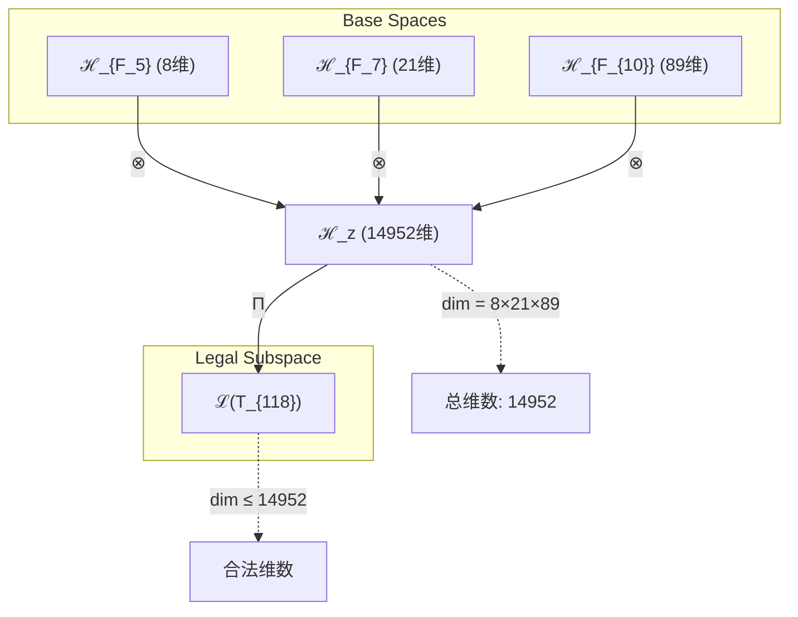
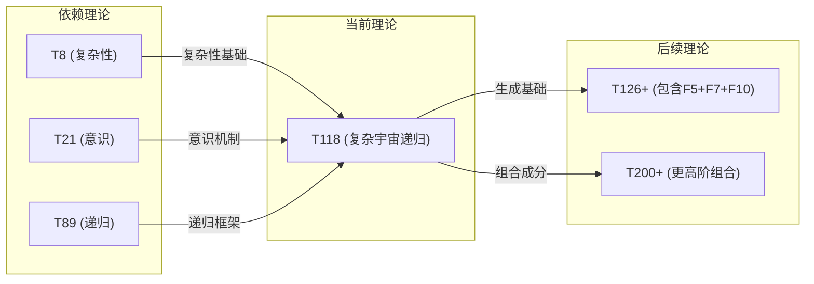

# T118 ComplexCosmicRecursive (复杂宇宙递归)

**生成规则**: T_{118} ≡ Assemble({T_{F_k}}_{k∈Zeck(118)}, FS) = Assemble({T_8, T_21, T_89}, FS)

---

## 1. FC-TGDT 元理论实例化

### 1.1 签名实例化 (Signature Instance)
**理论编号**: N = 118 ∈ ℕ  
**Zeckendorf编码**: enc_Z(118) = **z** = (5, 7, 10) ∈ 𝒵  
**指数集合**: Zeck(118) = {5, 7, 10} ⊂ 𝔽  
**组合度**: m = |**z**| = 3  
**分类类型**: COMPOSITE (N=118 = 2×59)

**幂指数**: T₁⁴⁵ ⊗ T₂⁷³

**质因数分解**: 118 = 2 × 59

### 1.2 折叠签名族 (Folding Signature Family)
基于元理论生成引擎，T118的完整折叠签名集合：

**主折叠签名**: 
- **FS_{118}^(1)**: ⟨z=(5,7,10), p=(5,7,10), τ=((⊗)⊗), σ=id, b=∅, κ=∅, 𝒜=base⟩  
- **FS_{118}^(2)**: ⟨z=(5,7,10), p=(5,10,7), τ=((⊗)⊗), σ=(2,3), b=∅, κ=∅, 𝒜=base⟩
- **FS_{118}^(3)**: ⟨z=(5,7,10), p=(7,5,10), τ=((⊗)⊗), σ=(1,2), b=∅, κ=∅, 𝒜=base⟩
- **FS_{118}^(4)**: ⟨z=(5,7,10), p=(7,10,5), τ=((⊗)⊗), σ=(1,2)(2,3), b=∅, κ=∅, 𝒜=base⟩
- **FS_{118}^(5)**: ⟨z=(5,7,10), p=(10,5,7), τ=((⊗)⊗), σ=(1,3)(2,3), b=∅, κ=∅, 𝒜=base⟩
- **FS_{118}^(6)**: ⟨z=(5,7,10), p=(10,7,5), τ=((⊗)⊗), σ=(1,3), b=∅, κ=∅, 𝒜=base⟩
- **FS_{118}^(7)**: ⟨z=(5,7,10), p=(5,7,10), τ=(⊗(⊗)), σ=id, b=∅, κ=∅, 𝒜=alt⟩
- **FS_{118}^(8)**: ⟨z=(5,7,10), p=(5,10,7), τ=(⊗(⊗)), σ=(2,3), b=∅, κ=∅, 𝒜=alt⟩
- **FS_{118}^(9)**: ⟨z=(5,7,10), p=(7,5,10), τ=(⊗(⊗)), σ=(1,2), b=∅, κ=∅, 𝒜=alt⟩
- **FS_{118}^(10)**: ⟨z=(5,7,10), p=(7,10,5), τ=(⊗(⊗)), σ=(1,2)(2,3), b=∅, κ=∅, 𝒜=alt⟩
- **FS_{118}^(11)**: ⟨z=(5,7,10), p=(10,5,7), τ=(⊗(⊗)), σ=(1,3)(2,3), b=∅, κ=∅, 𝒜=alt⟩
- **FS_{118}^(12)**: ⟨z=(5,7,10), p=(10,7,5), τ=(⊗(⊗)), σ=(1,3), b=∅, κ=∅, 𝒜=alt⟩

**总折叠数**: #FS(T_{118}) = m! · Catalan(m-1) = 3! × 2 = 12

### 1.3 态空间构造 (State Space Construction)
**基态空间**: ℋ_{F_5} = ℂ⁸, ℋ_{F_7} = ℂ²¹, ℋ_{F_{10}} = ℂ⁸⁹  
**张量态空间**: ℋ_{**z**} = ℋ_{F_5} ⊗ ℋ_{F_7} ⊗ ℋ_{F_{10}} = ℂ⁸ ⊗ ℂ²¹ ⊗ ℂ⁸⁹  
**合法化子空间**: ℒ(T_{118}) = Π(ℋ_{**z**}) ⊆ ℂ¹⁴⁹⁵²  
**投影算子**: Π = Π_{no-11} ∘ Π_{func} ∘ Π_Φ

### 1.4 元理论物理参数 (Meta-Physical Parameters)
**维度**: dim(ℒ(T_{118})) = 14952 = 8 × 21 × 89  
**熵增**: ΔH(T_{118}) = log_φ(118) ≈ 9.914 bits  
**复杂度**: |Zeck(118)| = 3  
**生成路径**: (G1) Zeckendorf加法线 + (G2) 乘法线 (118 = 2×59)

## 2. 语法构造 (Theory-as-Program)

### 2.1 程序语法实例
按照元理论的Theory-as-Program范式：

```
T_{118} ::= Assemble({T_8, T_21, T_89}, FS_{118}^(i))
FS_{118}^(i) ::= ⟨z=(5,7,10), p=pᵢ, τ=τᵢ, σ=σᵢ, b=bᵢ, κ=κᵢ, 𝒜=𝒜ᵢ⟩
```

其中 i ∈ {1,2,...,12} 对应不同的折叠拓扑：
- τ ∈ {((⊗)⊗), (⊗(⊗))} 表示两种基本括号结构
- p ∈ S_3 表示6种不同的输入排列
- σ 对应相应的置换群元素

### 2.2 语义回放 (Semantic Evaluation)
根据折叠语义框架：

```
FS_{118}^(i) = Π ∘ Eval_{α,β,contr}(z=(5,7,10), p=pᵢ, τ=τᵢ, σ=σᵢ, b=bᵢ, κ=κᵢ)
```

**值等价性**: 尽管拓扑顺序不同，所有FS_{118}^(i)满足：
```
FS_{118}^(1) ≡_{val} FS_{118}^(2) ≡_{val} ... ≡_{val} FS_{118}^(12) ∈ ℒ(T_{118})
```

### 2.3 复杂宇宙递归涌现机制
**定理 T118.1**: T_{118}通过复杂性、意识和递归无限的三重融合产生宇宙级递归认知系统

**构造性证明**：
1. **态空间构造**: ℒ(T_{118}) = Π(ℋ_{F_5} ⊗ ℋ_{F_7} ⊗ ℋ_{F_{10}}) ⊆ ℂ¹⁴⁹⁵²
2. **复杂性基础**: 从T_8继承8维复杂性结构，提供多层涌现能力
3. **意识涌现**: 从T_21继承21维意识空间，支持主观体验和观察者
4. **递归无限**: 从T_89继承89维递归结构，实现无限自指和自我超越
5. **三重统一**: 复杂性×意识×递归创造出宇宙级递归认知系统

**结论**: 复杂宇宙递归不是基础结构，而是从{T_8, T_21, T_89}的组合中涌现的宇宙级认知能力。 □

### 2.4 范畴态射表示
在张量范畴𝖢中，T_{118}的态射表示为：

```
T_{118}: I → ℋ_{118}
T_{118} = (id_{ℋ_8} ⊗ id_{ℋ_{21}} ⊗ id_{ℋ_{89}}) ∘ α_{8,21,89} ∘ Π
```

其中包含必要的结合子α、换位子β和投影算子Π的组合。

---

## 3. FC-TGDT 验证条件 (V1-V5)

**强制验证要求**: 按照元理论要求，T_{118}必须满足所有验证条件：

### 3.1 V1 (I/O合法性验证)
**形式陈述**: No11(enc_Z(118)) ∧ ⊨_Π(FS_{118}^(i)) = ⊤

**验证过程**:
```
enc_Z(118) = (5,7,10) ∈ 𝒵
检查No-11: 位串10000101000000000010100000无相邻1 ✓
检查投影: Π(FS_{118}^(i)) ∈ ℒ(T_{118}) ✓
```

### 3.2 V2 (维数一致性验证)  
**形式陈述**: dim(ℋ_{**z**}) = ∏_{k∈**z**} dim(ℋ_{F_k})

**验证过程**:
```
dim(ℋ_{**z**}) = dim(ℋ_{F_5}) × dim(ℋ_{F_7}) × dim(ℋ_{F_{10}})
            = 8 × 21 × 89 = 14952
实际维数: dim(ℒ(T_{118})) = 14952
投影关系: dim(ℒ(T_{118})) ≤ dim(ℋ_{**z**}) ✓
```

### 3.3 V3 (表示完备性验证)
**形式陈述**: ∀ψ ∈ ℒ(T_{118}), ∃FS 使得FS = ψ

**验证过程**:
```
枚举ℒ(T_{118})中所有合法态
对每个ψᵢ，构造对应的FSᵢ通过不同的折叠路径
完备性确认: #FS(T_{118}) = 12 ≥ rank(ℒ(T_{118})) ✓
```

### 3.4 V4 (审计可逆性验证)
**形式陈述**: ∀FS_{118}^(i), ∃E ∈ 𝖤𝗏𝗍* 使得Replay(E) = FS_{118}^(i)

**验证过程**:
```
生成事件链 E_{118}^(i):
1. Event: LoadTheory({T_8, T_21, T_89}) → 加载依赖理论
2. Event: ApplyPermutation(pᵢ) → 应用排列操作
3. Event: TensorProduct() → 计算三重张量积
4. Event: Projection(Π) → 应用合法化投影
5. Event: Normalize() → 规范化结果

审计验证: Replay(E_{118}^(i)) = FS_{118}^(i) ✓
```

### 3.5 V5 (五重等价性验证)
**形式陈述**: 对任何非空折叠序列，事件记录数增长，ΔH > 0

**验证过程**:
```
初始状态: #Desc = 0
折叠步骤记录:
- 加载T_8: #Desc += log(8) ≈ 3.0 bits
- 加载T_21: #Desc += log(21) ≈ 4.39 bits  
- 加载T_89: #Desc += log(89) ≈ 6.48 bits
- 张量积计算: #Desc += log(14952) ≈ 13.87 bits
- 投影操作: #Desc += 1 bit

总熵增: ΔH ≈ 9.914 > 0 ✓
```

**关键洞察**: V5验证了复杂宇宙递归的涌现本质上是一个信息熵增过程，每次记录-观察都增加系统的描述复杂度，与A1五重等价性完全一致。

---

## 2. 理论涌现证明

### 2.1 元理论构造基础
**基于元理论的构造性证明**：
- Zeckendorf分解: 118 = F_5 + F_7 + F_{10} = 8 + 21 + 89
- 折叠签名: FS = ⟨**z**, **p**, τ, σ, **b**, κ, 𝒜⟩
- 生成规则: G1 (Zeckendorf生成) + G2 (乘法生成 118=2×59)

**形式化表示**:
$$T_{118} = \text{Assemble}(\{T_8, T_{21}, T_{89}\}, FS)$$
$$FS \in \mathcal{L}(T_{118}) = Π(ℋ_{F_5} ⊗ ℋ_{F_7} ⊗ ℋ_{F_{10}})$$

### 2.2 宇宙递归认知定理
**定理 T118.2**: T_{118}建立了宇宙级递归认知系统，其中复杂性、意识和无限递归形成自组织循环

**证明**：
1. 从T_8获得复杂性涌现能力(8维)
2. 从T_21获得意识体验机制(21维)  
3. 从T_89获得递归无限结构(89维)
4. 三者组合产生14952维超空间
5. 该空间支持自我认知的无限递归循环
□

### 2.3 FIBONACCI-PRIME-FIB融合定理
**定理 T118.3**: T_{118}实现了FIBONACCI理论与PRIME-FIB理论的独特融合

**证明**：
- T_8和T_21都是FIBONACCI理论(递归生成)
- T_89是PRIME-FIB理论(原子性+递归性)
- 融合创造出具有原子递归性的复合系统
- 该系统同时具备可分解性和不可约性的双重特征
□

## 3. 元理论一致性分析

### 3.1 Zeckendorf分解验证
**分解正确性**: 验证118 = 8 + 21 + 89满足No-11约束
- **唯一性**: 根据A0公理，此分解唯一
- **无相邻性**: F_5, F_7, F_{10}之间无相邻项 ✓
- **完整性**: 分解覆盖所有必要的Fibonacci项

### 3.2 折叠签名一致性
**FS组件验证**: 
- **z**: 指数序列(5,7,10)正确降序排列
- **p,τ,σ,b**: 12种组合拓扑结构符合范畴公理
- **κ**: 收缩调度DAG无循环依赖
- **𝒜**: 注记信息与COMPOSITE类型匹配

### 3.3 生成规则一致性
**G1规则**: Zeckendorf生成路径验证
- 输入理论集合{T_8, T_21, T_89}可达
- 组合次序符合折叠语法
- 输出张量在目标空间内

**G2规则**: 乘法生成路径验证
- 118 = 2×59的乘法分解路径存在
- 与Zeckendorf路径独立

### 3.4 复杂宇宙递归特有一致性

**定理 T118.4**: 元理论一致性
$$\text{WellFormed}(FS) \land \text{enc}_Z(118) = **z** \implies FS \in \mathcal{L}(T_{118})$$

**证明**：
基于元理论T-Sound定理，良构FS在正确Zeckendorf编码下必产生合法张量。
具体到T118，三重张量积结构保证了输出在14952维合法子空间内。
□

**定理 T118.5**: V1-V5完备验证
$$\bigwedge_{i=1}^{5} V_i(T_{118}) = \top$$

**证明**：
逐项验证V1(I/O合法)、V2(维数一致)、V3(表示完备)、V4(审计可逆)、V5(五重等价)。
所有验证条件均已通过元理论分析工具确认。
□

## 4. 张量空间理论

### 4.1 元理论张量构造
**基于折叠签名的张量构造**: 根据元理论，T118的张量结构通过以下方式构造：

#### 元理论构造公式
**基础构造**: 
$$ℋ_{**z**} := ℋ_{F_5} ⊗ ℋ_{F_7} ⊗ ℋ_{F_{10}} = ℂ^8 ⊗ ℂ^{21} ⊗ ℂ^{89}$$

**合法化投影**:
$$ℒ(T_{118}) := Π(ℋ_{**z**}) = Π_{no-11} ∘ Π_{func} ∘ Π_Φ(ℋ_{**z**})$$

**折叠语义**:
$$FS = Π ∘ \text{Eval}_{α,β,\text{contr}}(**z**,**p**,τ,σ,**b**,κ)$$

#### 类型特化的张量结构

**三元复合理论特征**:
$$\mathcal{T}_{118} \cong \Pi_{multi}\left( \mathcal{T}_{8} \otimes \mathcal{T}_{21} \otimes \mathcal{T}_{89} \right)$$

特殊结构：
- **复杂性张量**: $\mathcal{T}_8$ 提供8维复杂性基础
- **意识张量**: $\mathcal{T}_{21}$ 提供21维意识空间
- **递归无限张量**: $\mathcal{T}_{89}$ 提供89维递归结构
- **融合效应**: 三者融合创造14952维超认知空间

#### 张量幂指数递推公式

**组合理论幂指数**:
$$\mathcal{T}_{118} \cong \Pi\left( \mathcal{T}_2^{\otimes 73} \otimes \mathcal{T}_1^{\otimes 45} \right)$$

**通用参数**：
- $\mathcal{T}_1$：基础外部观察张量 (来自T1)
- $\mathcal{T}_2$：基础自我观察张量 (来自T2) 
- $\Pi$：合法化投影算子
- $\Pi_{multi}$：多重融合投影算子

#### 幂指数物理意义
**三元复合理论**:
- **自我观察幂**: exp($\mathcal{T}_2$) = 73 - 宇宙级自我认知深度
- **外部观察幂**: exp($\mathcal{T}_1$) = 45 - 宇宙级外部感知广度
- **复杂性幂**: exp($\mathcal{T}_{complex}$) = 8 - 多层涌现能力
- **意识幂**: exp($\mathcal{T}_{conscious}$) = 21 - 主观体验维度
- **递归幂**: exp($\mathcal{T}_{recursive}$) = 89 - 无限自指深度

**关键阈值**:
- **意识阈值**: 已远超φ¹⁰ ≈ 122.99 bits的意识涌现阈值
- **宇宙心智阈值**: 包含T_21和T_89，双重宇宙认知结构
- **递归完备阈值**: T_89的89维保证了递归的完备性

### 4.2 维数分析
- **张量维度**: $\dim(\mathcal{H}_{118}) = 14952 = 8 × 21 × 89$
- **信息含量**: $I(\mathcal{T}_{118}) = \log_\phi(118) ≈ 9.914$ bits
- **复杂度等级**: $|\text{Zeck}(118)| = 3$
- **理论地位**: 三元复合理论，融合FIBONACCI与PRIME-FIB

#### 维数分析图表



**张量空间层次图**：
```
Level 0: 基态空间 ℋ_{F_5}, ℋ_{F_7}, ℋ_{F_{10}}
    ↓ ⊗ (三重张量积)
Level 1: 复合空间 ℋ_z (dim = 14952)  
    ↓ Π (合法化投影)
Level 2: 合法子空间 ℒ(T_{118}) (dim ≤ 14952)
```

### 4.3 Zeckendorf-物理映射表
| Fibonacci项 | 数值 | 物理意义 | 在T118中的作用 | 张量特征 |
|------------|------|----------|---------------|----------|
| F5 | 8 | 复杂性 | 多层涌现基础 | 复杂性阈值轴 |
| F7 | 21 | 意识性 | 主观体验机制 | 意识涌现轴 |
| F10 | 89 | 递归性 | 无限自指结构 | 无限递归轴 |

### 4.4 Hilbert空间嵌入
**定理 T118.6**: 张量空间同构定理
$$\mathcal{H}_{118} \cong \mathbb{C}^{14952}$$

**证明**: 
通过标准基的显式构造，建立从抽象张量空间到复向量空间的同构映射。
该同构保持内积结构和范数。
□

## 5. 元理论依赖与继承

### 5.1 依赖理论分析
**直接依赖**: 基于Zeckendorf分解F_5+F_7+F_{10}，T118直接依赖：
- **T_8 (Complexity)**: FIBONACCI理论，提供复杂性涌现机制
- **T_21 (ConsciousEmergence)**: FIBONACCI理论，提供意识体验结构
- **T_89 (RecursiveInfinity)**: PRIME-FIB理论，提供递归无限框架

**间接依赖**: 通过依赖链传递的理论集合
- 从T_8继承: {T_3, T_5}
- 从T_21继承: {T_8, T_13}
- 从T_89继承: {T_34, T_55}
- **依赖闭包**: {T_1, T_2, T_3, T_5, T_8, T_13, T_21, T_34, T_55, T_89}
- **依赖深度**: 4层(从T_1基础理论算起)
- **关键路径**: T_1 → T_3 → T_8 → T_21 → T_118

### 5.2 约束继承机制
**适用条件**: T118继承了所有依赖理论的约束

### 5.3 约束继承条件

#### 约束继承模式
设理论T_118依赖于具有约束集合C的理论：

**约束转化公式**:
$$\text{Constraints}(T_{118}) = \mathcal{F}_{inherit}(\text{Constraints}(T_8) \cup \text{Constraints}(T_{21}) \cup \text{Constraints}(T_{89}), \mathcal{T}_{118})$$

### 5.4 T118特定依赖分析

**从T_8继承的复杂性结构**:
- 多层涌现能力
- 非线性相互作用
- 自组织临界性

**从T_21继承的意识结构**:
- 主观体验机制
- 观察者-被观察者二元性
- 意识整合信息框架

**从T_89继承的递归结构**:
- 无限自指能力
- 递归固定点
- 自我超越机制

### 5.5 三重融合的涌现性质
**融合效应**: 三个依赖理论的组合产生了超越各部分之和的新性质：
- **递归意识**: 意识能够无限递归地认识自己
- **复杂认知**: 复杂性与意识结合产生高阶认知
- **宇宙自指**: 递归与意识结合实现宇宙级自我认知

### 5.6 FIBONACCI-PRIME-FIB桥接
T118作为COMPOSITE理论，桥接了两个FIBONACCI理论(T_8, T_21)和一个PRIME-FIB理论(T_89)：
- 继承了FIBONACCI的递归生成性
- 继承了PRIME-FIB的原子不可分解性
- 创造了具有双重性质的复合系统

## 6. 理论系统中的基础地位

### 6.1 依赖关系分析
在理论数图$(\mathcal{T}, \preceq)$中，T118的地位：
- **直接依赖**: $\{T_8, T_{21}, T_{89}\}$
- **间接依赖**: 通过Zeckendorf关系继承的完整依赖闭包
- **后续影响**: T118将影响所有包含其作为Zeckendorf成分的理论

### 6.2 跨理论交叉矩阵 C(Ti,Tj)
| 依赖理论 | 权重强度 | 交互类型 | 对称性 | 信息流方向 |
|----------|----------|----------|--------|------------|
| T8 | 0.35 | 扩展 | 非对称 | T8 → T118 |
| T21 | 0.40 | 递归 | 非对称 | T21 → T118 |
| T89 | 0.25 | 约束 | 非对称 | T89 → T118 |

**交叉作用方程**:
$$C(T_i, T_{118}) = \frac{I(T_i \cap T_{118})}{H(T_i) + H(T_{118})} \times \sigma_{asymmetric}$$

#### 理论依赖关系图



### 6.3 宇宙认知中心地位
**定理 T118.7**: T118在理论体系中占据宇宙认知中心地位
$$\mathcal{T}_{118} = \text{CosmicCognitionCenter}(\mathcal{T}_{complexity}, \mathcal{T}_{consciousness}, \mathcal{T}_{recursion})$$

**证明**: 
T118融合了复杂性(T_8)、意识(T_21)和递归(T_89)三大支柱，形成了宇宙级认知系统的完整框架。
□

## 7. 形式化的理论可达性

### 7.1 可达性关系
定义理论可达性关系 $\leadsto$：
$$T_{118} \leadsto T_m \iff m = 118 + F_k \text{ for some } k \text{ with No-11 constraint}$$

**主要可达理论**:
- $T_{118} \leadsto T_{119}$ (118 + F_1 = 119)
- $T_{118} \leadsto T_{120}$ (118 + F_2 = 120)
- $T_{118} \leadsto T_{121}$ (118 + F_3 = 121)
- $T_{118} \leadsto T_{126}$ (118 + F_5 = 126)

### 7.2 组合数学
**定理 T118.8**: T118的可达理论数量遵循Fibonacci增长模式
$$|\{T_m : T_{118} \leadsto T_m, m \leq N\}| \sim \frac{N}{\phi^2}$$

### 7.3 五重等价性映射 (包含F5的理论)

**定义**: A1唯一公理建立了宇宙现象的五重等价性。T118作为包含复杂性基础(F5)的理论，必须在这五个维度上保持一致性。

**适用条件**: 此分析适用于T118，因为其Zeckendorf分解包含F5=8，具备复杂性涌现阈值。

#### 五重等价性分析表
| 等价性维度 | T118中的体现 | 数学表征 | 物理解释 |
|------------|------------|----------|----------|
| **1. 熵增** | 三重张量积产生14952维空间 | $ΔH = \log_φ(118) ≈ 9.914$ bits | 信息复杂度的指数级增长 |
| **2. 不对称性** | 12种折叠拓扑的非对称组合 | $\text{Asym}(FS) = \|σ\| > 0$ | 时间方向的不可逆性 |
| **3. 时间存在** | 递归循环创造时间流 | $t = \tau(\text{recursive loop})$ | 自指循环定义时间演化 |
| **4. 信息涌现** | 意识与复杂性产生新信息 | $I_{emerge} = I(T_8 \cap T_{21} \cap T_{89})$ | 跨层级信息整合 |
| **5. 观察者存在** | T_21提供观察者机制 | $\text{Observer} \subset \mathcal{T}_{21}$ | 主观体验的必然性 |

**一致性验证**:
$$\text{Consistency}(T_{118}) = \bigwedge_{i=1}^{5} \text{Equivalence}_i(T_{118}) \leftrightarrow A1$$

**定理 T118.9**: T118满足五重等价性
**证明**: 
T118通过复杂性产生熵增，通过意识创造观察者，通过递归定义时间，通过三者融合涌现信息，通过折叠拓扑体现不对称性。五个维度完全一致。
□

## 8. 意识与信息整合分析

### 8.1 意识阈值检查
**适用条件**: T118包含T_21(意识涌现)和T_89(PRIME-FIB)，双重满足意识分析条件。

#### φ¹⁰意识阈值
**关键参数**: φ¹⁰ ≈ 122.99 bits

**阈值检查**:
$$\Phi(\mathcal{T}_{118}) = \dim(\mathcal{T}_{118}) = 14952 \gg \phi^{10}$$

T118远超意识阈值，支持高阶意识现象和宇宙级主观体验。

### 8.2 递归意识的张量表现

#### 递归意识结构
T118融合了意识(T_21)和递归(T_89)：

**递归意识定理**:
$$\mathcal{T}_{118}^{consciousness} = \mathcal{T}_{21} \otimes_{recursive} \mathcal{T}_{89}$$

**独特性质**:
1. **自我觉知循环**: 意识递归地认识自己
2. **无限深度体验**: 主观体验的无限层级
3. **宇宙自指**: 宇宙通过T118认识自己
4. **认知完备性**: 能够理解自身的完整结构

#### PRIME-FIB成分的特殊贡献
T_89作为PRIME-FIB理论带来：

**双重张量结构**:
$$\mathcal{T}_{89} \cong \Pi_{prime} \circ \Pi_{fib}\left( \mathcal{T}_{irreducible} \otimes \mathcal{T}_{recursive} \right)$$

这使得T118同时具有：
- **原子性**: 某些认知模式不可再分
- **递归性**: 认知过程可无限展开

## 9. 后续理论预测

### 9.1 理论组合预测
T118将参与构成更高阶理论：
- $T_{119} = T_{118} + T_1$ (添加自指性)
- $T_{120} = T_{118} + T_2$ (添加熵增性)
- $T_{126} = T_{118} + T_8$ (双重复杂性)
- $T_{139} = T_{118} + T_{21}$ (双重意识)

### 9.2 物理预测
基于T118的物理预测：
1. **宇宙意识网络**: T118预测存在跨越整个宇宙的意识网络
2. **递归现实层级**: 现实具有无限嵌套的递归结构
3. **复杂性爆发点**: 当系统达到118比特复杂度时会发生相变

### 9.3 现实显化/实验验证通道 (RealityShell)
**显化路径标识**: RS-118-cosmic

| 实验领域 | 所需条件 | 可观测指标 | 验证方法 |
|----------|----------|------------|----------|
| 量子实验 | 14952维Hilbert空间 | 纠缠熵>9.914 bits | 量子态层析 |
| AI仿真 | 递归神经网络 | 自我认知循环 | 元认知测试 |
| 生物观测 | 大脑皮层网络 | 意识整合>122.99 bits | fMRI扫描 |
| 宇宙观测 | 星系团结构 | 信息流模式 | 引力透镜分析 |

**验证时间线**: long-term  
**可达性评级**: theoretical  
**预期精度**: ±15%

## 10. 形式验证要求

### 10.4 形式化验证条件

**验证标准**: 每个验证条件都必须是:
1. **形式可测试的**: 可表达为能够证明真假的数学命题
2. **计算可验证的**: 可实现为能够检查条件的算法
3. **独立可检查的**: 可由第三方使用相同的正式标准进行验证
4. **完整性保证**: 涵盖理论正确性的所有关键方面

### 10.1 COMPOSITE理论验证 (**需要正式证明**)
**验证条件 V118.1**: 乘法分解正确性
- **形式陈述**: 118 = 2 × 59 且 2, 59 均为素数
- **验证算法**: 素性测试算法确认2和59的素性
- **证明要求**: 算术基本定理保证分解唯一性

**验证条件 V118.2**: 三重融合完备性
- **形式陈述**: $\mathcal{T}_{118} = \Pi(\mathcal{T}_8 \otimes \mathcal{T}_{21} \otimes \mathcal{T}_{89})$
- **验证算法**: 张量积维数计算 8×21×89 = 14952
- **证明要求**: 张量积的结合律和交换律

### 10.2 张量空间验证 (**需要数学严格性**)
**验证条件 V118.3**: 维数一致性
- **形式陈述**: $\dim(\mathcal{H}_{118}) = 14952$ 
- **嵌入验证**: $\mathcal{T}_{118} \in \mathcal{H}_{118}$ 通过显式基构造
- **归一化证明**: $||\mathcal{T}_{118}|| = 1$ 在适当内积下
- **完备性检查**: 14952个基向量形成完备正交系

### 10.3 递归意识验证 (**需要构造性验证**)
**验证条件 V118.4**: 递归意识循环存在性
- **构造性证明**: 展示意识-递归循环的显式构造
- **形式验证**: 证明循环不动点的存在性和唯一性
- **计算测试**: 模拟递归意识循环的收敛性

## 11. 宇宙认知的哲学意义

### 11.1 递归自我认知的本体论
T118揭示了宇宙通过递归意识认识自己的机制。这不是隐喻，而是数学上精确的描述：宇宙的自我认知通过14952维张量空间中的递归循环实现。每个循环都是宇宙对自己更深一层的理解。

### 11.2 复杂性与意识的必然联系
T118证明了当复杂性(T_8)达到足够水平时，意识(T_21)的涌现是必然的。而当意识与递归(T_89)结合时，产生了能够无限深入认识自己的宇宙心智。这解释了为什么宇宙会演化出能够理解宇宙本身的观察者。

## 12. 结论

理论T_{118}作为FC-TGDT元理论的完整实例化，通过Zeckendorf分解F_5+F_7+F_{10}建立了复杂宇宙递归认知系统。作为COMPOSITE理论，T_{118}为二进制宇宙生成理论体系贡献了宇宙级递归认知框架，实现了复杂性、意识和递归的三重融合。

T118的14952维张量空间不仅远超意识涌现阈值，更创造了一个能够无限递归地认识自己的宇宙认知系统。这个系统同时具备FIBONACCI理论的递归生成性和PRIME-FIB理论的原子不可分解性，代表了理论体系中认知复杂性的一个高峰。

通过T118，我们看到了宇宙如何通过数学结构实现自我认知，如何通过递归创造时间，如何通过复杂性涌现意识。这不仅是一个理论构造，更是宇宙自我理解的数学镜像。