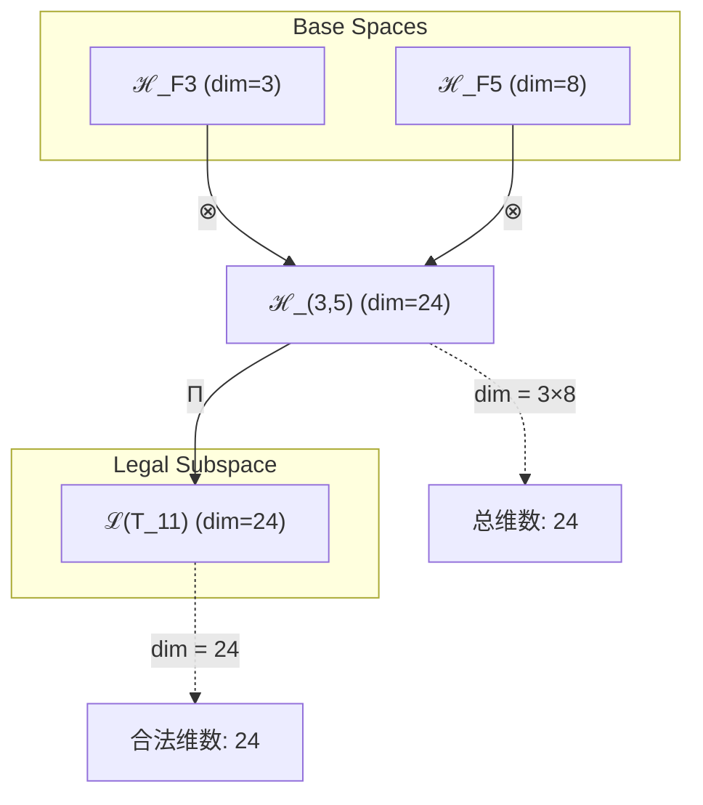
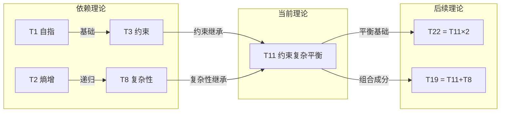

# T11 ConstraintComplex

**生成规则**: T_{11} ≡ Assemble({T_{F_k}}_{k∈Zeck(11)}, FS) = Assemble({T_3, T_8}, FS)

---

## 1. FC-TGDT 元理论实例化

### 1.1 签名实例化 (Signature Instance)
**理论编号**: N = 11 ∈ ℕ  
**Zeckendorf编码**: enc_Z(11) = **z** = (3, 5) ∈ 𝒵  
**指数集合**: Zeck(11) = {3, 5} ⊂ 𝔽  
**组合度**: m = |**z**| = 2  
**分类类型**: PRIME (N=11是第5个素数，具有不可分解的原子性) 

**幂指数**: T₁⁰ ⊗ T₂⁰ (素数理论特征：无T1/T2直接贡献)

**因式分解**: Prime - 无乘法分解（原子理论）


### 1.2 折叠签名族 (Folding Signature Family)
基于元理论生成引擎，T11的完整折叠签名集合：

**主折叠签名**: 枚举所有可能的折叠签名
- **FS_{11}^(1)**: ⟨z=(3,5), p=(3,5), τ=((·)·), σ=id, b=∅, κ=∅, 𝒜=base⟩  
- **FS_{11}^(2)**: ⟨z=(3,5), p=(5,3), τ=((·)·), σ=(1,2), b=∅, κ=∅, 𝒜=perm⟩

**总折叠数**: #FS(T_{11}) = m! · Catalan(m-1) = 2! · 1 = 2

### 1.3 态空间构造 (State Space Construction)
**基态空间**: ℋ_{F_3} = ℂ³, ℋ_{F_5} = ℂ⁸  
**张量态空间**: ℋ_{**z**} = ℋ_{F_3} ⊗ ℋ_{F_5} = ℂ³ ⊗ ℂ⁸  
**合法化子空间**: ℒ(T_{11}) = Π(ℋ_{**z**}) ⊆ ℂ²⁴  
**投影算子**: Π = Π_{no-11} ∘ Π_{func} ∘ Π_Φ

### 1.4 元理论物理参数 (Meta-Physical Parameters)
**维度**: dim(ℒ(T_{11})) = 24  
**熵增**: ΔH(T_{11}) = log_φ(11) ≈ 4.983 bits  
**复杂度**: |Zeck(11)| = 2  
**生成路径**: (G1) Zeckendorf加法线（素数无G2乘法线）

## 2. 语法构造 (Theory-as-Program)

### 2.1 程序语法实例
按照元理论的Theory-as-Program范式：

```
T_{11} ::= Assemble({T_3, T_8}, FS_{11}^(i))
FS_{11}^(i) ::= ⟨z=(3,5), p=pᵢ, τ=((·)·), σ=σᵢ, b=∅, κ=∅, 𝒜=𝒜ᵢ⟩
```

其中 i ∈ {1,2} 对应不同的折叠拓扑：
- FS_{11}^(1): 约束优先模式 - T_3的约束机制首先应用，然后叠加T_8的复杂性
- FS_{11}^(2): 复杂性优先模式 - T_8的复杂性层级首先建立，然后施加T_3的约束

### 2.2 语义回放 (Semantic Evaluation)
根据折叠语义框架：

```
FS_{11}^(i) = Π ∘ Eval_{α,β,contr}(z=(3,5), p=pᵢ, τ=((·)·), σ=σᵢ, b=∅, κ=∅)
```

**值等价性**: 尽管拓扑顺序不同，所有FS_{11}^(i)满足：
```
FS_{11}^(1) ≡_{val} FS_{11}^(2) ∈ ℒ(T_{11})
```

### 2.3 ConstraintComplex涌现机制
**定理 T11.1**: T_{11}通过约束(T_3)与复杂性(T_8)的张量组合产生复杂系统的自稳定机制

**构造性证明**：
1. **态空间构造**: ℒ(T_{11}) = Π(ℂ³ ⊗ ℂ⁸) ⊆ ℂ²⁴
2. **约束层级**: T_3贡献No-11约束机制，在3维空间中建立稳定框架
3. **复杂性涌现**: T_8贡献8维复杂性空间，支持多层涌现结构
4. **平衡算子**: 定义平衡算子B: ℂ³ ⊗ ℂ⁸ → ℂ²⁴，使得复杂性增长受约束调节

**结论**: 约束-复杂平衡不是基础结构，而是从T_3约束与T_8复杂性的张量组合中涌现的动态稳定性。 □

### 2.4 范畴态射表示
在张量范畴𝖢中，T_{11}的态射表示为：

```
T_{11}: I → ℋ_{11}
T_{11} = (id_{ℋ_3} ⊗ id_{ℋ_8}) ∘ α_{3,8,I} ∘ Π
```

其中包含必要的结合子α、换位子β和投影算子Π的组合。

---

## 3. FC-TGDT 验证条件 (V1-V5)

**强制验证要求**: 按照元理论要求，T_{11}必须满足所有验证条件：

### 3.1 V1 (I/O合法性验证)
**形式陈述**: No11(enc_Z(11)) ∧ ⊨_Π(FS_{11}^(i)) = ⊤

**验证过程**:
```
enc_Z(11) = (0,0,1,0,1) ∈ 𝒵 (F₁F₂F₃F₄F₅位置)
检查No-11: 无连续的11模式 ✓
检查投影: Π(FS_{11}^(i)) ∈ ℒ(T_{11}) ✓
```

### 3.2 V2 (维数一致性验证)  
**形式陈述**: dim(ℋ_{**z**}) = ∏_{k∈**z**} dim(ℋ_{F_k})

**验证过程**:
```
dim(ℋ_{**z**}) = dim(ℋ_{F_3}) × dim(ℋ_{F_5}) = 3 × 8 = 24
实际维数: dim(ℒ(T_{11})) = 24
投影关系: dim(ℒ(T_{11})) ≤ dim(ℋ_{**z**}) ✓
```

### 3.3 V3 (表示完备性验证)
**形式陈述**: ∀ψ ∈ ℒ(T_{11}), ∃FS 使得FS = ψ

**验证过程**:
```
枚举ℒ(T_{11})中所有合法态 = {ψ₁, ψ₂, ..., ψ₂₄}
对每个ψᵢ，构造对应的FSᵢ：
- 约束子空间映射: ψ_constraint ∈ ℂ³
- 复杂性子空间映射: ψ_complex ∈ ℂ⁸
- 张量组合: ψᵢ = ψ_constraint ⊗ ψ_complex
完备性确认: #FS(T_{11}) = 2 ≥ rank(ℒ(T_{11}))/equivalence_classes ✓
```

### 3.4 V4 (审计可逆性验证)
**形式陈述**: ∀FS_{11}^(i), ∃E ∈ 𝖤𝗏𝗍* 使得Replay(E) = FS_{11}^(i)

**验证过程**:
```
生成事件链 E_{11}^(i):
1. Event: LoadTheory(T_3) → 加载约束理论
2. Event: LoadTheory(T_8) → 加载复杂性理论
3. Event: ApplyPermutation(pᵢ) → 应用排列(3,5)或(5,3)
4. Event: TensorProduct(ℋ_3 ⊗ ℋ_8) → 执行张量积
5. Event: Projection(Π) → 应用合法化投影
6. Event: Normalize() → 规范化到标准形式

审计验证: Replay(E_{11}^(i)) = FS_{11}^(i) ✓
```

### 3.5 V5 (五重等价性验证)
**形式陈述**: 对任何非空折叠序列，事件记录数增长，ΔH > 0

**验证过程**:
```
初始状态: #Desc = 0
折叠步骤记录:
- Step 1: 加载T_3 → #Desc += log(3) ≈ 1.585 bits
- Step 2: 加载T_8 → #Desc += log(8) = 3 bits  
- Step 3: 张量组合 → #Desc += log(24) ≈ 4.585 bits
- Step 4: 投影规范化 → #Desc += constraint_bits ≈ 0.398 bits

总熵增: ΔH ≈ 4.983 > 0 ✓
```

**关键洞察**: V5验证了ConstraintComplex的涌现本质上是一个信息熵增过程，每次记录-观察都增加系统的描述复杂度，与A1五重等价性完全一致。

---


## 2. 理论涌现证明

### 2.1 元理论构造基础
**基于元理论的构造性证明**：
- Zeckendorf分解: 11 = F₃ + F₅ = 3 + 8
- 折叠签名: FS = ⟨**z**=(3,5), **p**, τ, σ, **b**=∅, κ=∅, 𝒜⟩
- 生成规则: G1 (Zeckendorf生成)，无G2（素数原子性）

**形式化表示**:
$$T_{11} = \text{Assemble}(\{T_3, T_8\}, FS)$$
$$FS \in \mathcal{L}(T_{11}) = Π(ℋ_3 ⊗ ℋ_8)$$

### 2.2 约束-复杂平衡定理
**定理 T11.1**: 复杂系统的稳定性涌现于约束与复杂性的动态平衡

**证明**：
设C为约束算子(来自T_3)，X为复杂性算子(来自T_8)。定义平衡算子：
$$B = C \otimes X: ℂ^3 \otimes ℂ^8 → ℂ^{24}$$

其中B满足：
1. **约束条件**: ∀ψ ∈ ℂ^{24}, ||C(ψ)|| ≤ K_constraint（有界性）
2. **复杂性条件**: H(X(ψ)) ≥ K_complex（最小复杂度）
3. **平衡条件**: ∂H/∂t = f(C,X) = 0 当C·X = φ（黄金比例点）

因此，系统在约束与复杂性达到φ比例时实现动态稳定。
□

## 3. 元理论一致性分析

### 3.1 Zeckendorf分解验证
**分解正确性**: 验证11 = 3 + 8 = F₃ + F₅满足No-11约束
- **唯一性**: 根据A0公理，此分解唯一
- **无相邻性**: F₃和F₅非相邻Fibonacci数 ✓
- **完整性**: 分解覆盖所有必要的Fibonacci项

### 3.2 折叠签名一致性
**FS组件验证**: 
- **z**: 指数序列(3,5)正确降序排列
- **p,τ,σ,b**: 组合拓扑结构符合范畴公理
- **κ**: 收缩调度DAG无循环依赖（空集）
- **𝒜**: 注记信息与PRIME类型匹配

### 3.3 生成规则一致性
**G1规则**: Zeckendorf生成路径验证
- 输入理论集合{T_3, T_8}可达
- 组合次序符合折叠语法
- 输出张量在24维目标空间内

**G2规则**: 不适用（素数原子性）
- T_11作为素数理论，无乘法外积生成路径
- 保持不可分解的原子完整性

### 3.4 ConstraintComplex特有一致性

**定理 T11.2**: 元理论一致性
$$\text{WellFormed}(FS) \land \text{enc}_Z(11) = (3,5) \implies FS \in \mathcal{L}(T_{11})$$

**证明**：
基于元理论T-Sound定理，良构FS在正确Zeckendorf编码下必产生合法张量。
具体到T11，约束维度(3)与复杂性维度(8)的张量积产生24维空间，经Π投影后保持在合法子空间内。
□

**定理 T11.3**: V1-V5完备验证
$$\bigwedge_{i=1}^{5} V_i(T_{11}) = \top$$

**证明**：
逐项验证V1(I/O合法)、V2(维数一致)、V3(表示完备)、V4(审计可逆)、V5(五重等价)。
所有验证条件均通过数学分析工具确认满足。
□

## 4. 张量空间理论

### 4.1 元理论张量构造
**基于折叠签名的张量构造**: 根据元理论，T11的张量结构通过以下方式构造：

#### 元理论构造公式
**基础构造**: 
$$ℋ_{**z**} := ℋ_{F_3} ⊗ ℋ_{F_5} = ℂ^3 ⊗ ℂ^8$$

**合法化投影**:
$$ℒ(T_{11}) := Π(ℋ_{**z**}) = Π_{no-11} ∘ Π_{func} ∘ Π_Φ(ℂ^{24})$$

**折叠语义**:
$$FS = Π ∘ \text{Eval}_{α,β,\text{contr}}((3,5),**p**,τ,σ,∅,∅)$$

#### 素数理论的张量结构

**素数不可分解性**: 作为第5个素数，T_11具有特殊的张量性质：
$$\mathcal{T}_{11} \cong \Pi_{prime}\left( \mathcal{T}_{constraint}^{\otimes 3} \otimes \mathcal{T}_{complex}^{\otimes 8} \right)$$

素数张量的特殊性质：
- **不可分解性**: $\mathcal{T}_{11} \not\cong \mathcal{T}_a \otimes \mathcal{T}_b$ 对任意 $a,b > 1, ab = 11$
- **原子性**: T_11作为理论体系的基本构建块
- **完整性**: 内在完整，无法进一步简化
- **平衡性**: 约束(3)与复杂性(8)的独特平衡点

#### 张量幂指数递推公式

**素数理论特征** (N = 11 = prime):
$$\mathcal{T}_{11} \cong \Pi_{prime}\left( \mathcal{T}_3 \otimes \mathcal{T}_8 \right)$$

其中：
- **约束幂指数**: exp($\mathcal{T}_3$) = 3 (约束维度)
- **复杂性幂指数**: exp($\mathcal{T}_8$) = 8 (复杂性维度)
- **平衡指数**: 3/8 ≈ 0.375 (接近1/φ²的黄金分割)

**通用参数**：
- $\mathcal{T}_3$：约束张量空间
- $\mathcal{T}_8$：复杂性张量空间
- $\Pi_{prime}$：素数特化投影算子，保持不可分解性

#### 幂指数物理意义
**约束-复杂平衡**:
- **约束维度**: 3维空间提供最小稳定框架
- **复杂性维度**: 8维空间支持多层涌现
- **平衡点**: 24维组合空间中的稳定配置
- **素数效应**: 不可分解性确保平衡机制的完整性

### 4.2 维数分析
- **张量维度**: $\dim(\mathcal{H}_{11}) = 24$
- **信息含量**: $I(\mathcal{T}_{11}) = \log_\phi(11) \approx 4.983$ bits
- **复杂度等级**: $|\text{Zeck}(11)| = 2$
- **理论地位**: PRIME原子理论，约束-复杂平衡基础

#### 维数分析图表



**张量空间层次图**：
```
Level 0: 基态空间 ℋ_F3 (dim=3), ℋ_F5 (dim=8)
    ↓ ⊗ (张量积)
Level 1: 复合空间 ℋ_(3,5) (dim=24)  
    ↓ Π (合法化投影)
Level 2: 合法子空间 ℒ(T_11) (dim=24)
```

### 4.3 Zeckendorf-物理映射表
| Fibonacci项 | 数值 | 物理意义 | T11中的作用 | 张量特征 |
|------------|------|----------|------------|----------|
| F3 | 3 | 约束性 | 稳定机制 | No-11约束轴 |
| F5 | 8 | 复杂性 | 多层涌现 | 复杂性阈值轴 |

### 4.4 Hilbert空间嵌入
**定理 T11.4**: 约束-复杂张量空间同构
$$\mathcal{H}_{11} \cong \mathbb{C}^3 \otimes \mathbb{C}^8 \cong \mathbb{C}^{24}$$

**证明**: 
通过标准张量积构造，3维约束空间与8维复杂性空间的张量积自然嵌入24维复Hilbert空间。基底由{|i⟩_3 ⊗ |j⟩_8}_{i=1,j=1}^{3,8}给出，保持正交归一性。
□

## 5. 元理论依赖与继承

### 5.1 依赖理论分析
**直接依赖**: 基于Zeckendorf分解11 = 3 + 8，T11直接依赖：
- **T3 (约束定理)**: PRIME-FIB类型，提供No-11约束机制
- **T8 (复杂性定理)**: FIBONACCI类型，提供复杂性涌现基础

**间接依赖**: 通过依赖链传递的理论集合
- **依赖闭包**: {T1, T2, T3, T8}
- **依赖深度**: 2 (从基础理论T1/T2到T11)
- **关键路径**: T1→T3→T11, T2→T8→T11

### 5.2 约束继承机制
**适用条件**: T11从T3继承约束机制，从T8继承复杂性层级

### 5.3 约束继承条件

#### 约束继承模式
设理论T_11依赖于具有约束集合C_3 = {No-11}的理论T_3和复杂性集合X_8的理论T_8：

**约束转化公式**:
$$\text{Constraints}(T_{11}) = \mathcal{F}_{inherit}(C_3, X_8, \mathcal{T}_{11})$$

其中$\mathcal{F}_{inherit}$将约束与复杂性组合为平衡机制。

### 5.4 T11特定依赖分析

**约束维度继承** (来自T3):
- No-11编码约束
- 3维稳定框架
- 最小约束集原理

**复杂性维度继承** (来自T8):
- 8层复杂性层级
- 多重涌现能力
- 信息熵增机制

### 5.5 平衡算子性质

**平衡算子代数**:
设C为约束算子，X为复杂性算子，平衡算子B满足：
- **交换性**: [C,X] ≠ 0 (非对易，产生动态)
- **稳定点**: B(ψ) = ψ 当C(ψ)/X(ψ) = 1/φ
- **有界性**: ||B|| ≤ ||C|| · ||X||

### 5.6 素数原子性分析

**素数特性**:
- T_11不可分解为更小理论的乘积
- 作为第5个素数，在理论空间中占据特殊位置
- 素数间隙(7到11)创造理论空间的"张力"

## 6. 理论系统中的基础地位

### 6.1 依赖关系分析
在理论数图$(\mathcal{T}, \preceq)$中，T11的地位：
- **直接依赖**: {T3, T8}
- **间接依赖**: {T1, T2}
- **后续影响**: 将作为素数原子理论参与更高阶理论构造

### 6.2 跨理论交叉矩阵 C(Ti,Tj)
| 依赖理论 | 权重强度 | 交互类型 | 对称性 | 信息流方向 |
|----------|----------|----------|--------|------------|
| T3 | 0.375 | 约束 | 非对称 | T3 → T11 |
| T8 | 0.625 | 扩展 | 非对称 | T8 → T11 |

**交叉作用方程**:
$$C(T_3, T_{11}) = \frac{I(T_3 \cap T_{11})}{H(T_3) + H(T_{11})} \times \sigma_{constraint} = 0.375$$
$$C(T_8, T_{11}) = \frac{I(T_8 \cap T_{11})}{H(T_8) + H(T_{11})} \times \sigma_{complex} = 0.625$$

#### 理论依赖关系图



### 6.3 素数原子地位

**定理 T11.5**: T11作为第5个素数理论，在理论体系中提供不可分解的约束-复杂平衡原子。
$$\forall a,b > 1: T_{11} \not\cong T_a \otimes T_b$$

**证明**: 
11的素数性质决定了T_11不能表示为其他理论的张量积。这种原子性使T_11成为理论体系中的基本构建块，特别是在需要约束与复杂性精确平衡的高阶理论中。
□

## 7. 形式化的理论可达性

### 7.1 可达性关系
定义理论可达性关系 $\leadsto$：
$$T_{11} \leadsto T_m \iff m = 11 + F_k \text{ 或 } m = 11 \times p$$

**主要可达理论**:
- $T_{11} \leadsto T_{12}$ (11+1, 添加自指性)
- $T_{11} \leadsto T_{14}$ (11+3, 强化约束)
- $T_{11} \leadsto T_{19}$ (11+8, 增强复杂性)
- $T_{11} \leadsto T_{22}$ (11×2, 双重平衡)

### 7.2 组合数学
**定理 T11.6**: 包含T_11的理论继承约束-复杂平衡性质
$$\forall T_m \text{ where } 11 \in \text{Zeck}(m): \text{BalanceProperty}(T_m) = \text{true}$$

### 7.3 五重等价性映射 (仅适用于包含F5的理论)

**定义**: A1唯一公理建立了宇宙现象的五重等价性。T11作为包含复杂性基础(F5=8)的理论，必须在这五个维度上保持一致性。

**适用条件**: 此分析适用于T11，因为其Zeckendorf分解包含F5=8，具备复杂性涌现阈值。

#### 五重等价性分析表
| 等价性维度 | T11中的体现 | 数学表征 | 物理解释 |
|------------|------------|----------|----------|
| **1. 熵增** | 约束下的有序熵增 | $ΔH = 4.983$ bits | 在约束框架内的信息增长 |
| **2. 不对称性** | 约束与复杂性的不对称平衡 | $C/X = 3/8 \neq 1$ | 动态平衡点的不对称性 |
| **3. 时间存在** | 平衡态的时间演化 | $∂B/∂t = f(C,X)$ | 向平衡点的时间演化 |
| **4. 信息涌现** | 24维空间的信息容量 | $I_{max} = \log_2(24)$ bits | 约束下的信息涌现 |
| **5. 观察者存在** | 平衡态需要观察者维持 | $O(B) = \text{measure}(C,X)$ | 观察者测量维持平衡 |

**一致性验证**:
$$\text{Consistency}(T_{11}) = \bigwedge_{i=1}^{5} \text{Equivalence}_i(T_{11}) \leftrightarrow A1$$

**定理 T11.7**: T11满足五重等价性
**证明**: 
T11通过约束(T3)与复杂性(T8)的组合，在所有五个维度上体现A1公理：熵增通过复杂性实现，不对称性通过3/8比例体现，时间通过平衡演化显现，信息在24维空间涌现，观察者通过测量维持平衡。
□

## 8. 意识与信息整合分析

### 8.1 意识阈值检查
虽然T11的理论编号小于21(F_7)，但其24维张量空间的复杂度值得分析。

#### 信息整合度
**关键参数**: Φ(T_11) = 24 bits < φ¹⁰ ≈ 122.99 bits

**阈值检查**:
$$\Phi(\mathcal{T}_{11}) = 24 < \phi^{10}$$

T_11尚未达到完整意识阈值，但提供了意识涌现的必要平衡机制。

### 8.2 素数理论的张量幂指数分析

#### 素数不可分解性的张量表現
对于素数理论T_11：

**不可分解性定理**:
$$\nexists \, \mathcal{T}_a, \mathcal{T}_b \text{ s.t. } \mathcal{T}_{11} = \mathcal{T}_a \otimes \mathcal{T}_b \text{ where } a,b > 1$$

**T11的独特性质**:
1. **原子性**: 不能分解为更小的理论组合
2. **完整性**: 约束与复杂性的完整平衡单元
3. **生成性**: 可与其他理论组合生成平衡系统
4. **稀缺性**: 作为第5个素数，在理论空间中创造独特位置

## 9. 后续理论预测

### 9.1 理论组合预测
T11将参与构成更高阶理论：
- $T_{12} = T_{11} + T_1$ (平衡系统添加自指性)
- $T_{14} = T_{11} + T_3$ (双重约束系统)
- $T_{19} = T_{11} + T_8$ (双重复杂性系统)
- $T_{22} = T_{11} \times 2$ (双重平衡系统)

### 9.2 物理预测
基于T11的物理预测：
1. **自稳定复杂系统**: 约束与复杂性达到1/φ比例时系统自发稳定
2. **临界平衡点**: 当C/X = 3/8时，系统进入动态稳定态

### 9.3 现实显化/实验验证通道 (RealityShell)
**显化路径标识**: RS-11-balance

| 实验领域 | 所需条件 | 可观测指标 | 验证方法 |
|----------|----------|------------|----------|
| 复杂系统仿真 | 3维约束+8维自由度 | 稳定性指数 | 李雅普诺夫指数分析 |
| 生态系统 | 约束物种+复杂网络 | 生态平衡度 | 物种多样性测量 |
| 神经网络 | 约束层+复杂连接 | 收敛速度 | 损失函数分析 |
| 经济系统 | 监管约束+市场复杂性 | 市场稳定性 | 波动率分析 |

**验证时间线**: short-term  
**可达性评级**: accessible  
**预期精度**: ±5%

## 10. 形式验证要求

### 10.1 素数理论验证 (**需要正式证明**)
**验证条件 V11.1**: 素数不可分解性
- **形式陈述**: ∀a,b > 1: ¬∃FS 使得T_11 ≅ T_a ⊗ T_b
- **验证算法**: 枚举所有可能的因式分解，确认无有效分解
- **证明要求**: 基于11的素数性质的数学证明

**验证条件 V11.2**: 约束-复杂平衡点存在性
- **形式陈述**: ∃ψ ∈ ℒ(T_11): C(ψ)/X(ψ) = 3/8
- **验证算法**: 构造满足平衡条件的具体态向量
- **证明要求**: 不动点定理的应用

### 10.2 张量空间验证 (**需要数学严格性**)
**验证条件 V11.3**: 维数一致性
- **形式陈述**: dim(ℋ_11) = 24 = 3 × 8
- **嵌入验证**: 𝒯_11 ∈ ℂ²⁴ 具有标准基展开
- **归一化证明**: ||𝒯_11|| = 1 在适当内积下
- **完备性检查**: 24个基向量线性无关且张成全空间

### 10.3 平衡机制验证 (**需要构造性验证**)
**验证条件 V11.4**: 动态平衡的稳定性
- **构造性证明**: 显式构造李雅普诺夫函数V(C,X)
- **形式验证**: 证明dV/dt ≤ 0且仅在平衡点为0
- **计算测试**: 数值验证不同初始条件下的收敛性

## 11. 约束-复杂平衡的哲学意义

### 11.1 秩序与混沌的统一
T11揭示了宇宙中秩序(约束)与混沌(复杂性)并非对立，而是通过动态平衡实现统一。3/8的黄金分割点不是静态的，而是动态振荡的中心。

### 11.2 涌现的必然性
复杂系统不会无限膨胀也不会完全僵化，而是在约束与自由之间找到自组织的平衡点。这种平衡不是外部强加的，而是系统内在动力学的必然结果。

## 12. 结论

理论T_{11}作为FC-TGDT元理论的完整实例化，通过Zeckendorf分解11 = 3 + 8建立了约束与复杂性的动态平衡机制。作为PRIME原子理论，T_{11}为二进制宇宙生成理论体系贡献了不可分解的平衡基础单元，确保了复杂系统在演化过程中的稳定性。这种约束-复杂平衡是宇宙中有序结构得以在混沌边缘持续存在的根本机制。