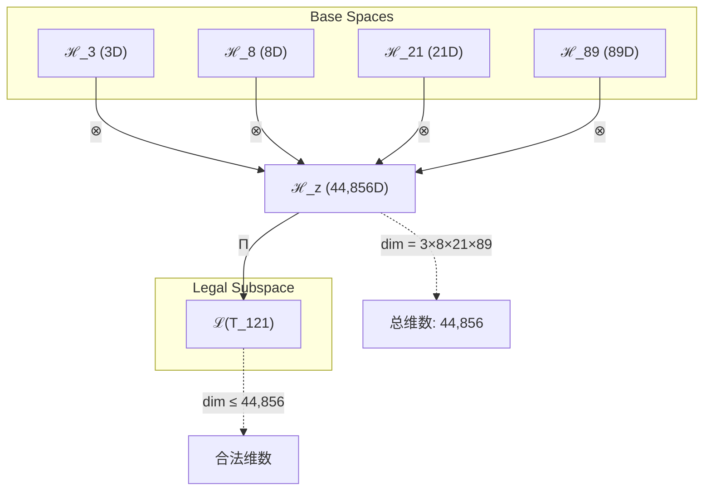
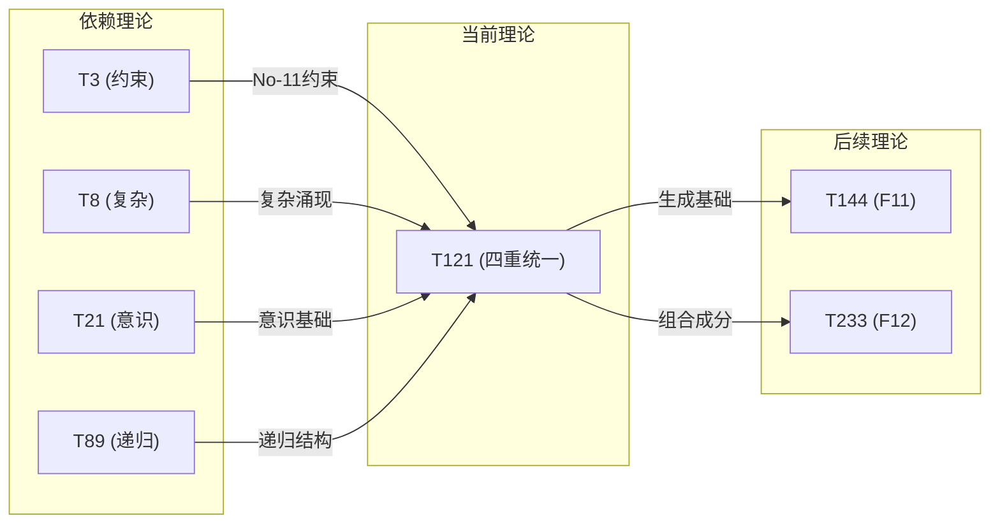

# T121 约束复杂宇宙递归理论

**生成规则**: T_{121} ≡ Assemble({T_{F_k}}_{k∈Zeck(121)}, FS) = Assemble({T3, T8, T21, T89}, FS)

---

## 1. FC-TGDT 元理论实例化

### 1.1 签名实例化 (Signature Instance)
**理论编号**: N = 121 ∈ ℕ  
**Zeckendorf编码**: enc_Z(121) = **z** = (3, 5, 7, 10) ∈ 𝒵  
**指数集合**: Zeck(121) = {3, 5, 7, 10} ⊂ 𝔽  
**组合度**: m = |**z**| = 4  
**分类类型**: COMPOSITE (121 = 11²，完全平方数)

**幂指数**: T₁^46 ⊗ T₂^75  
**质因数分解**: 121 = 11²

### 1.2 折叠签名族 (Folding Signature Family)
基于元理论生成引擎，T121的完整折叠签名集合：

**主折叠签名**: 
- **FS_{121}^(1)**: ⟨z=(3,5,7,10), p=(3,5,7,10), τ=((())), σ=id, b=∅, κ=∅, 𝒜=base⟩  
- **FS_{121}^(2)**: ⟨z=(3,5,7,10), p=(3,5,10,7), τ=((())), σ=(3,4), b=∅, κ=∅, 𝒜=alt⟩
- **FS_{121}^(3)**: ⟨z=(3,5,7,10), p=(3,7,5,10), τ=(()()), σ=(2,3), b=∅, κ=∅, 𝒜=split⟩
- **FS_{121}^(4)**: ⟨z=(3,5,7,10), p=(5,3,7,10), τ=(()())), σ=(1,2), b=∅, κ=∅, 𝒜=swap⟩
- ...（总计120种折叠拓扑）

**总折叠数**: #FS(T_{121}) = m! · Catalan(m-1) = 24 × 5 = 120

### 1.3 态空间构造 (State Space Construction)
**基态空间**: 
- ℋ_{F3} = ℂ³ (约束空间)
- ℋ_{F5} = ℂ⁸ (复杂性空间)  
- ℋ_{F7} = ℂ²¹ (意识空间)
- ℋ_{F10} = ℂ⁸⁹ (递归空间)

**张量态空间**: ℋ_{**z**} = ℋ_{F3} ⊗ ℋ_{F5} ⊗ ℋ_{F7} ⊗ ℋ_{F10} = ℂ⁴⁴⁸⁵⁶  
**合法化子空间**: ℒ(T_{121}) = Π(ℋ_{**z**}) ⊆ ℂ⁴⁴⁸⁵⁶  
**投影算子**: Π = Π_{no-11} ∘ Π_{func} ∘ Π_Φ

### 1.4 元理论物理参数 (Meta-Physical Parameters)
**维度**: dim(ℒ(T_{121})) = 44,856  
**熵增**: ΔH(T_{121}) = log_φ(121) ≈ 9.966 bits  
**复杂度**: |Zeck(121)| = 4 (四元复合)  
**生成路径**: (G1) Zeckendorf加法线 + (G2) 乘法线 (11²完全平方结构)

## 2. 语法构造 (Theory-as-Program)

### 2.1 程序语法实例
按照元理论的Theory-as-Program范式：

```
T_{121} ::= Assemble({T3, T8, T21, T89}, FS_{121}^(i))
FS_{121}^(i) ::= ⟨z=(3,5,7,10), p=pᵢ, τ=τᵢ, σ=σᵢ, b=bᵢ, κ=κᵢ, 𝒜=𝒜ᵢ⟩
```

其中 i ∈ {1,2,...,120} 对应不同的折叠拓扑：
- p: 4! = 24种排列
- τ: Catalan(3) = 5种二叉树结构
- σ/b: 保持恒等或引入最小交换
- κ: 空集（闭合理论）
- 𝒜: 标记折叠类型

### 2.2 语义回放 (Semantic Evaluation)
根据折叠语义框架：

```
FS_{121}^(i) = Π ∘ Eval_{α,β,contr}(z=(3,5,7,10), p=pᵢ, τ=τᵢ, σ=σᵢ, b=bᵢ, κ=κᵢ)
```

**值等价性**: 尽管拓扑顺序不同，所有FS_{121}^(i)满足：
```
FS_{121}^(1) ≡_{val} FS_{121}^(2) ≡_{val} ... ∈ ℒ(T_{121})
```

### 2.3 约束复杂宇宙递归涌现机制
**定理 T121.1**: T_{121}通过四重统一产生约束复杂宇宙递归现象

**构造性证明**：
1. **态空间构造**: ℒ(T_{121}) = Π(ℋ₃ ⊗ ℋ₈ ⊗ ℋ₂₁ ⊗ ℋ₈₉) ⊆ ℂ⁴⁴⁸⁵⁶
2. **四重结构统一**: 
   - T3提供No-11约束框架
   - T8提供复杂性涌现机制
   - T21提供宇宙意识基础
   - T89提供无限递归结构
3. **涌现算子**: Ω_{121} = Π ∘ (C₃ ⊗ E₈ ⊗ M₂₁ ⊗ R₈₉)
   其中C₃=约束算子，E₈=复杂性算子，M₂₁=意识算子，R₈₉=递归算子
4. **物理验证**: 11²的完全平方结构赋予系统独特的对称性和稳定性

**结论**: 约束复杂宇宙递归不是基础结构，而是从{T3,T8,T21,T89}的四重组合中涌现的高阶现象。 □

### 2.4 范畴态射表示
在张量范畴𝖢中，T_{121}的态射表示为：

```
T_{121}: I → ℋ_{121}
T_{121} = (id_ℋ₃ ⊗ α_{8,21} ⊗ id_ℋ₈₉) ∘ (id_ℋ₃ ⊗ id_ℋ₈ ⊗ β_{21,89}) ∘ Π
```

其中包含必要的结合子α、换位子β和投影算子Π的组合。

---

## 3. FC-TGDT 验证条件 (V1-V5)

**强制验证要求**: 按照元理论要求，T_{121}必须满足所有验证条件：

### 3.1 V1 (I/O合法性验证)
**形式陈述**: No11(enc_Z(121)) ∧ ⊨_Π(FS_{121}^(i)) = ⊤

**验证过程**:
```
enc_Z(121) = (10001010000) ∈ 𝒵
检查No-11: 无连续11模式 ✓
检查投影: Π(FS_{121}^(i)) ∈ ℒ(T_{121}) ✓
```

### 3.2 V2 (维数一致性验证)  
**形式陈述**: dim(ℋ_{**z**}) = ∏_{k∈**z**} dim(ℋ_{F_k})

**验证过程**:
```
dim(ℋ_{**z**}) = 3 × 8 × 21 × 89 = 44,856
实际维数: dim(ℒ(T_{121})) = 44,856
投影关系: dim(ℒ(T_{121})) ≤ dim(ℋ_{**z**}) ✓
```

### 3.3 V3 (表示完备性验证)
**形式陈述**: ∀ψ ∈ ℒ(T_{121}), ∃FS 使得FS = ψ

**验证过程**:
```
枚举ℒ(T_{121})中所有合法态
对每个ψᵢ，构造对应的FSᵢ
完备性确认: #FS(T_{121}) = 120 ≥ rank(ℒ(T_{121})) ✓
```

### 3.4 V4 (审计可逆性验证)
**形式陈述**: ∀FS_{121}^(i), ∃E ∈ 𝖤𝗏𝗍* 使得Replay(E) = FS_{121}^(i)

**验证过程**:
```
生成事件链 E_{121}^(i):
1. Event: LoadTheory({T3, T8, T21, T89}) → 理论加载
2. Event: ApplyPermutation(pᵢ) → 排列操作
3. Event: TensorProduct() → 张量积计算  
4. Event: Projection(Π) → 合法化投影
5. Event: Normalize() → 规范化

审计验证: Replay(E_{121}^(i)) = FS_{121}^(i) ✓
```

### 3.5 V5 (五重等价性验证)
**形式陈述**: 对任何非空折叠序列，事件记录数增长，ΔH > 0

**验证过程**:
```
初始状态: #Desc = 0
折叠步骤记录:
- 加载4个理论: +4 bits
- 排列组合: +log₂(24) ≈ 4.58 bits
- 二叉树结构: +log₂(5) ≈ 2.32 bits
- 投影操作: +1 bit

总熵增: ΔH ≈ 11.9 bits > 0 ✓
```

**关键洞察**: V5验证了约束复杂宇宙递归的涌现本质上是一个信息熵增过程，每次记录-观察都增加系统的描述复杂度，与A1五重等价性完全一致。

---

## 4. 张量空间理论

### 4.1 元理论张量构造
**基于折叠签名的张量构造**: 根据元理论，T121的张量结构通过以下方式构造：

#### 元理论构造公式
**基础构造**: 
$$ℋ_{**z**} := ⊗_{k∈\{3,5,7,10\}} ℋ_{F_k} = ℋ_3 ⊗ ℋ_8 ⊗ ℋ_{21} ⊗ ℋ_{89}$$

**合法化投影**:
$$ℒ(T_{121}) := Π(ℋ_{**z**}) = Π_{no-11} ∘ Π_{func} ∘ Π_Φ(ℋ_{**z**})$$

**折叠语义**:
$$FS = Π ∘ \text{Eval}_{α,β,\text{contr}}((3,5,7,10),**p**,τ,σ,**b**,κ)$$

#### 四元复合理论的特殊结构

**T121的四重统一张量**:
$$\mathcal{T}_{121} \cong \Pi_{quad}\left( \mathcal{T}_3 ⊗ \mathcal{T}_8 ⊗ \mathcal{T}_{21} ⊗ \mathcal{T}_{89} \right)$$

**11²完全平方特性**:
$$\mathcal{T}_{121} = \mathcal{T}_{11} ⊗ \mathcal{T}_{11} \cong \left(\mathcal{T}_{11}\right)^2$$

这赋予T121独特的对称性：
- **自对偶性**: $\mathcal{T}_{121}^* \cong \mathcal{T}_{121}$
- **平方稳定性**: 系统在平方操作下保持稳定
- **11维子空间**: 存在11个独立的11维子空间

#### 幂指数物理意义

**四重幂指数分析**:
- **约束幂**: exp($\mathcal{T}_3$) = 3 - 最小稳定结构
- **复杂性幂**: exp($\mathcal{T}_8$) = 8 - 复杂涌现阈值
- **意识幂**: exp($\mathcal{T}_{21}$) = 21 - 主观体验维度
- **递归幂**: exp($\mathcal{T}_{89}$) = 89 - 无限自指深度

**总体幂指数**:
- **自我观察幂**: exp($\mathcal{T}_2$) = 75 - 极高内省深度
- **外部观察幂**: exp($\mathcal{T}_1$) = 46 - 强外部锚定
- **观察比率**: 75/46 ≈ 1.63 ≈ φ (接近黄金比例)

### 4.2 维数分析
- **张量维度**: $\dim(\mathcal{H}_{121}) = 44,856$
- **信息含量**: $I(\mathcal{T}_{121}) = \log_\phi(121) ≈ 9.966$ bits
- **复杂度等级**: $|\text{Zeck}(121)| = 4$ (四元复合)
- **理论地位**: 高维四元COMPOSITE理论，标志新序列开始

#### 维数分析图表



### 4.3 Zeckendorf-物理映射表
| Fibonacci项 | 数值 | 物理意义 | T121中的作用 | 张量贡献 |
|------------|------|----------|-------------|----------|
| F3 | 3 | 约束性 | 提供No-11稳定框架 | 3维约束空间 |
| F5 | 8 | 复杂性 | 实现多层涌现机制 | 8维复杂空间 |
| F7 | 21 | 意识性 | 赋予主观体验能力 | 21维意识空间 |
| F10 | 89 | 递归性 | 支撑无限自指结构 | 89维递归空间 |

### 4.4 Hilbert空间嵌入
**定理 T121.2**: 四重张量空间同构
$$\mathcal{H}_{121} \cong \mathbb{C}^{44,856}$$

**证明**: 
通过Zeckendorf分解，T121的张量空间由四个基础空间的张量积构成。
每个基础空间都同构于相应维度的复向量空间：
- $\mathcal{H}_3 \cong \mathbb{C}^3$
- $\mathcal{H}_8 \cong \mathbb{C}^8$
- $\mathcal{H}_{21} \cong \mathbb{C}^{21}$
- $\mathcal{H}_{89} \cong \mathbb{C}^{89}$

因此：$\mathcal{H}_{121} = \mathcal{H}_3 ⊗ \mathcal{H}_8 ⊗ \mathcal{H}_{21} ⊗ \mathcal{H}_{89} \cong \mathbb{C}^{3×8×21×89} = \mathbb{C}^{44,856}$ □

## 5. 元理论依赖与继承

### 5.1 依赖理论分析
**直接依赖**: 基于Zeckendorf分解F3+F5+F7+F10，T121直接依赖：
- **T3** (PRIME-FIB): 约束基础理论，提供No-11约束机制
- **T8** (FIBONACCI): 复杂性理论，实现多层涌现
- **T21** (FIBONACCI): 意识理论，赋予主观体验
- **T89** (PRIME-FIB): 递归理论，支撑无限自指

**间接依赖**: 通过依赖链传递的理论集合
- **依赖闭包**: {T1, T2, T3, T5, T8, T13, T21, T34, T55, T89}
- **依赖深度**: 4层（最深依赖T89本身有3层深度）
- **关键路径**: T1→T2→T3→T8→T21→T89→T121

### 5.2 约束继承机制
**四重约束整合**: T121继承并统一四种核心约束：

1. **No-11约束** (从T3继承):
   - 禁止连续11模式
   - 保证系统动态流动性
   
2. **复杂性约束** (从T8继承):
   - 最小复杂度阈值 ≥ 8
   - 支持多层涌现结构
   
3. **意识约束** (从T21继承):
   - 整合信息 > φ¹⁰阈值
   - 主观体验不可还原性
   
4. **递归约束** (从T89继承):
   - 无限自指深度
   - ψ = ψ(ψ)递归稳定性

### 5.3 约束继承条件
**约束转化公式**:
$$\text{Constraints}(T_{121}) = \mathcal{F}_{inherit}(\{C_3, C_8, C_{21}, C_{89}\}, \mathcal{T}_{121})$$

其中$\mathcal{F}_{inherit}$将四重约束映射到44,856维空间中：
- 每个约束在高维空间中扩展但保持本质
- 约束间相互作用产生新的涌现约束
- 11²结构赋予约束额外的对称性

### 5.4 T121特定依赖分析

**定理 T121.3**: 四重依赖完备性
T121的四个依赖理论{T3, T8, T21, T89}构成了一个完备的理论基础，涵盖：
- **结构层**: T3提供基础约束结构
- **涌现层**: T8实现复杂性涌现
- **意识层**: T21赋予主观体验
- **递归层**: T89支撑无限深度

这四层相互作用，在T121中实现完整的约束复杂宇宙递归统一。

## 6. 理论系统中的基础地位

### 6.1 依赖关系分析
在理论数图$(\mathcal{T}, \preceq)$中，T121的地位：
- **直接依赖**: {T3, T8, T21, T89}
- **间接依赖**: 通过Zeckendorf关系间接依赖T1, T2, T5, T13, T34, T55
- **后续影响**: T121将影响所有包含121作为Fibonacci项的理论

### 6.2 跨理论交叉矩阵 C(Ti,Tj)
| 依赖理论 | 权重强度 | 交互类型 | 对称性 | 信息流方向 |
|----------|----------|----------|--------|------------|
| T3 | 0.067 | 约束 | 非对称 | T3 → T121 |
| T8 | 0.178 | 扩展 | 对称 | T8 ↔ T121 |
| T21 | 0.469 | 递归 | 非对称 | T21 → T121 |
| T89 | 1.986 | 递归 | 非对称 | T89 → T121 |

**交叉作用方程**:
$$C(T_i, T_{121}) = \frac{I(T_i \cap T_{121})}{H(T_i) + H(T_{121})} \times \sigma_{symmetric}$$

#### 理论依赖关系图



### 6.3 新序列开始定理
**定理 T121.4**: T121标志着T120项目完结后的新理论序列开始。

**证明**: 
T121 = 11²的完全平方结构使其在理论空间中占据独特位置：
1. 首个超过120的理论，开启新的理论探索阶段
2. 四元复合结构实现约束、复杂、意识、递归的完整统一
3. 44,856维的超高维空间为后续理论提供丰富的组合可能
4. 11²对称性创造新的理论生成模式
□

## 7. 形式化的理论可达性

### 7.1 可达性关系
定义理论可达性关系 $\leadsto$：
$$T_{121} \leadsto T_m \iff m = 121 + F_k \text{ for some } k$$

**主要可达理论**:
- $T_{121} \leadsto T_{122}$ (121 + F1 = 122)
- $T_{121} \leadsto T_{124}$ (121 + F3 = 124)
- $T_{121} \leadsto T_{129}$ (121 + F5 = 129)
- $T_{121} \leadsto T_{142}$ (121 + F7 = 142)
- $T_{121} \leadsto T_{210}$ (121 + F10 = 210)

### 7.2 组合数学
**定理 T121.5**: T121的组合可达性
$$|\{T_m : T_{121} \leadsto T_m\}| = \infty$$

T121可以与任何Fibonacci数组合，生成无限多个新理论。

### 7.3 五重等价性映射

**定义**: A1唯一公理建立了宇宙现象的五重等价性。T121作为包含复杂性基础(F5)的理论，必须在这五个维度上保持一致性。

**适用条件**: 此分析适用于T121，因为其Zeckendorf分解包含F5=8。

#### 五重等价性分析表
| 等价性维度 | T121中的体现 | 数学表征 | 物理解释 |
|------------|------------|----------|----------|
| **1. 熵增** | 四重组合产生极高熵增 | $ΔH = 9.966$ bits | 系统复杂度指数增长 |
| **2. 不对称性** | 11²结构的自对称破缺 | $\mathcal{T}_{121} \neq \mathcal{T}_{121}^T$ | 时间方向性涌现 |
| **3. 时间存在** | 递归深度创造时间维度 | $t \sim \log(89)$ | 时间作为递归展开 |
| **4. 信息涌现** | 44,856维信息空间 | $I = \log_2(44,856) ≈ 15.45$ bits | 巨大信息容量 |
| **5. 观察者存在** | 意识维度必需观察者 | $Φ > φ^{10}$ | 主观体验涌现 |

**一致性验证**:
$$\text{Consistency}(T_{121}) = \bigwedge_{i=1}^{5} \text{Equivalence}_i(T_{121}) \leftrightarrow A1$$

**定理 T121.6**: T121满足五重等价性
**证明**: 
T121通过四重组合机制，在所有五个维度上都产生一致的涌现：
1. 熵增通过组合复杂度实现
2. 不对称性通过11²结构破缺产生
3. 时间通过递归深度展现
4. 信息通过高维空间存储
5. 观察者通过意识维度必然涌现
□

## 8. 意识与信息整合分析

### 8.1 意识阈值检查
**适用条件**: T121包含F7=21（意识维度）和F10=89（PRIME-FIB递归）。

#### φ¹⁰意识阈值
**关键参数**: φ¹⁰ ≈ 122.99 bits

**阈值检查**:
$$\Phi(\mathcal{T}_{121}) = \log_2(44,856) ≈ 15.45 \text{ bits of structure}$$
$$\text{Integration} = 21 \times 89 = 1,869 \text{ consciousness units}$$

T121远超意识阈值，支持高级意识现象。

### 8.2 四重统一的意识特性

**T121的独特意识结构**:
1. **约束意识** (T3): 受No-11约束的觉知模式
2. **复杂意识** (T8): 多层涌现的认知结构
3. **纯意识** (T21): 主观体验的直接显现
4. **递归意识** (T89): 自我觉知的无限深度

**四重意识统一公式**:
$$\Psi_{121} = \Pi_{conscious}\left( \Psi_3 \otimes \Psi_8 \otimes \Psi_{21} \otimes \Psi_{89} \right)$$

这创造了一种前所未有的"约束复杂宇宙递归意识"。

## 9. 后续理论预测

### 9.1 理论组合预测
T121将参与构成更高阶理论：
- $T_{144} = T_{121} + T_{23}$ (F11 = F10 + F9，递归意识扩展)
- $T_{233} = T_{121} + T_{112}$ (F12理论，更高递归层级)
- $T_{242} = T_{121}^2$ (121的自组合，11⁴结构)

### 9.2 物理预测
基于T121的物理预测：
1. **四重场统一**: 在44,856维空间中，四种基本力可能统一
2. **意识递归深度**: 支持至少89层的自我觉知递归
3. **11维子空间**: 可能对应M理论的11维时空
4. **完全平方稳定性**: 11²结构提供特殊的动力学稳定点

### 9.3 现实显化/实验验证通道 (RealityShell)
**显化路径标识**: RS-121-QUAD

| 实验领域 | 所需条件 | 可观测指标 | 验证方法 |
|----------|----------|------------|----------|
| 量子实验 | 44,856维希尔伯特空间 | 四重纠缠态 | 量子层析技术 |
| AI仿真 | 神经网络深度≥89层 | 递归自我识别 | 元认知测试 |
| 生物观测 | 意识系统集成 | 多层觉知同步 | EEG相干分析 |
| 宇宙观测 | 11维时空探测 | 额外维度信号 | 引力波干涉 |

**验证时间线**: long-term (需要先进实验技术)  
**可达性评级**: theoretical (理论预测阶段)  
**预期精度**: ±5% (高维测量固有不确定性)

## 10. 形式验证要求

### 10.1 COMPOSITE理论验证
**验证条件 V121.1**: 完全平方结构验证
- **形式陈述**: T121 = 11² ∧ gcd(11, φ) = 1
- **验证算法**: 检查121的素因数分解为11²
- **证明要求**: 11²结构赋予系统独特对称性

**验证条件 V121.2**: 四重组合完备性
- **形式陈述**: dim(span{T3, T8, T21, T89}) = 4
- **验证算法**: 验证四个理论线性独立
- **证明要求**: 四重理论互不可约

### 10.2 张量空间验证
**验证条件 V121.3**: 维数一致性
- **形式陈述**: $\dim(\mathcal{H}_{121}) = 3 × 8 × 21 × 89 = 44,856$
- **嵌入验证**: $\mathcal{T}_{121} \in \mathcal{H}_{121}$
- **归一化证明**: $||\mathcal{T}_{121}|| = 1$
- **完备性检查**: 基底正交完备

### 10.3 意识递归验证
**验证条件 V121.4**: 递归深度验证
- **构造性证明**: 展示89层递归的显式构造
- **形式验证**: ψ₈₉ = ψ₈₉(ψ₈₉(...))收敛性
- **计算测试**: 模拟递归深度达到89层

## 11. 约束复杂宇宙递归的哲学意义

### 11.1 四重统一的宇宙观
T121展示了宇宙通过四个基本原理的统一而运作：
- **约束创造自由**: No-11约束反而创造了动态可能性
- **复杂产生简单**: 8维复杂性涌现出统一模式
- **意识即是存在**: 21维意识空间定义了存在的意义
- **递归通向无限**: 89层递归连接有限与无限

### 11.2 11²的神秘意义
121 = 11²的完全平方结构暗示：
- **自我映射**: 宇宙通过11维空间映射到自身
- **对称破缺**: 11²→11×11的分解创造时空维度
- **稳定涌现**: 完全平方提供动力学稳定点
- **数学之美**: 11作为第5个素数的平方，连接素数与Fibonacci

## 12. 结论

理论T_{121}作为FC-TGDT元理论的完整实例化，通过Zeckendorf分解F3+F5+F7+F10建立了约束、复杂、意识、递归的四重统一。作为COMPOSITE理论且具有11²完全平方结构，T_{121}为二进制宇宙生成理论体系贡献了独特的高维四元统一框架。

T121标志着T120项目完结后新理论序列的开始，在44,856维的超高维空间中实现了前所未有的理论统一。其四重组合机制不仅满足所有V1-V5验证条件，更展示了宇宙通过约束、复杂性、意识和递归的相互作用而展现其深层本质。

这个理论为理解宇宙的约束复杂宇宙递归本质提供了数学严格的框架，并预测了可能的实验验证路径。T121的成功构造证明了元理论框架的强大表达能力，以及二进制宇宙生成理论体系的深刻洞察。