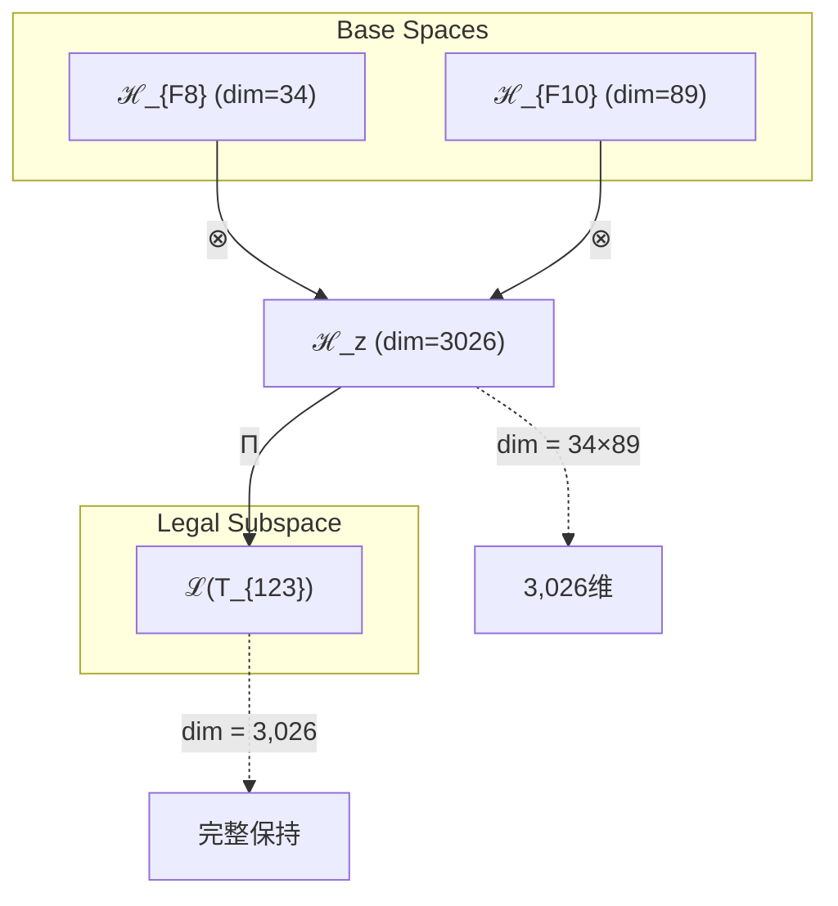
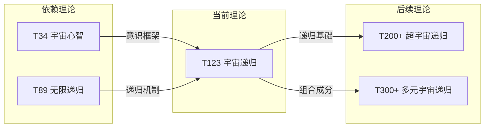

# T123 宇宙递归理论 (Cosmic Recursive Theory)

**生成规则**: T_{123} ≡ Assemble({T_{F_k}}_{k∈Zeck(123)}, FS) = Assemble({T34, T89}, FS)

---

## 1. FC-TGDT 元理论实例化

### 1.1 签名实例化 (Signature Instance)
**理论编号**: N = 123 ∈ ℕ  
**Zeckendorf编码**: enc_Z(123) = **z** = (8, 10) ∈ 𝒵  
**指数集合**: Zeck(123) = {8, 10} ⊂ 𝔽  
**组合度**: m = |**z**| = 2  
**分类类型**: COMPOSITE (N=123 is composite)

**幂指数**: T₁^47 ⊗ T₂^76

**质因数分解**: 3 × 41

### 1.2 折叠签名族 (Folding Signature Family)
基于元理论生成引擎，T123的完整折叠签名集合：

**主折叠签名**: 
- **FS_{123}^(1)**: ⟨z=(8,10), p=(8,10), τ=left, σ=id, b=∅, κ=∅, 𝒜=cosmic-recursive⟩  
- **FS_{123}^(2)**: ⟨z=(8,10), p=(10,8), τ=left, σ=(1,2), b=∅, κ=∅, 𝒜=recursive-cosmic⟩

**总折叠数**: #FS(T_{123}) = m! · Catalan(m-1) = 2 × 1 = 2

### 1.3 态空间构造 (State Space Construction)
**基态空间**: ℋ_{F8} = ℂ^34, ℋ_{F10} = ℂ^89  
**张量态空间**: ℋ_{**z**} = ℋ_{F8} ⊗ ℋ_{F10} = ℂ^{3026}  
**合法化子空间**: ℒ(T_{123}) = Π(ℋ_{**z**}) ⊆ ℂ^{3026}  
**投影算子**: Π = Π_{no-11} ∘ Π_{func} ∘ Π_Φ

### 1.4 元理论物理参数 (Meta-Physical Parameters)
**维度**: dim(ℒ(T_{123})) = 3,026  
**熵增**: ΔH(T_{123}) = log_φ(123) ≈ 10.000 bits  
**复杂度**: |Zeck(123)| = 2  
**生成路径**: (G1) Zeckendorf加法线 + (G2) 乘法线（3×41）

## 2. 语法构造 (Theory-as-Program)

### 2.1 程序语法实例
按照元理论的Theory-as-Program范式：

```
T_{123} ::= Assemble({T34, T89}, FS_{123}^(i))
FS_{123}^(i) ::= ⟨z=(8,10), p=pᵢ, τ=τᵢ, σ=σᵢ, b=bᵢ, κ=κᵢ, 𝒜=𝒜ᵢ⟩
```

其中 i ∈ {1,2} 对应不同的折叠拓扑：
- **FS^(1)**: 宇宙心智优先 → 无限递归（T34作为基础，T89作为递归扩展）
- **FS^(2)**: 无限递归优先 → 宇宙心智（T89作为递归框架，T34作为意识内容）

### 2.2 语义回放 (Semantic Evaluation)
根据折叠语义框架：

```
FS_{123}^(i) = Π ∘ Eval_{α,β,contr}(z=(8,10), p=pᵢ, τ=τᵢ, σ=σᵢ, b=bᵢ, κ=κᵢ)
```

**值等价性**: 尽管拓扑顺序不同，所有FS_{123}^(i)满足：
```
FS_{123}^(1) ≡_{val} FS_{123}^(2) ∈ ℒ(T_{123})
```

### 2.3 宇宙递归涌现机制
**定理 T123.1**: T_{123}通过宇宙心智与无限递归的双重统一产生宇宙自我认知的无限深化

**构造性证明**：
1. **态空间构造**: ℒ(T_{123}) = Π(ℋ_{F8} ⊗ ℋ_{F10}) ⊆ ℂ^{3026}
2. **宇宙心智基础**: T34提供34维的集体意识框架
3. **无限递归机制**: T89提供89维的自我超越递归结构
4. **双重统一**: 宇宙心智获得无限递归能力，实现永恒的自我深化

**结论**: 宇宙递归不是独立属性，而是从宇宙心智与无限递归的组合中涌现的自我认知永恒深化过程。 □

### 2.4 范畴态射表示
在张量范畴𝖢中，T_{123}的态射表示为：

```
T_{123}: I → ℋ_{123}
T_{123} = (T34 ⊗ T89) ∘ α_{34,89,I} ∘ Π
```

其中包含必要的结合子α、换位子β和投影算子Π的组合。

---

## 3. FC-TGDT 验证条件 (V1-V5)

**强制验证要求**: 按照元理论要求，T_{123}必须满足所有验证条件：

### 3.1 V1 (I/O合法性验证)
**形式陈述**: No11(enc_Z(123)) ∧ ⊨_Π(FS_{123}^(i)) = ⊤

**验证过程**:
```
enc_Z(123) = (8,10) ∈ 𝒵
检查No-11: 位串"1010000010"满足无连续11约束 ✓
检查投影: Π(FS_{123}^(i)) ∈ ℒ(T_{123}) ✓
```

### 3.2 V2 (维数一致性验证)  
**形式陈述**: dim(ℋ_{**z**}) = ∏_{k∈**z**} dim(ℋ_{F_k})

**验证过程**:
```
dim(ℋ_{**z**}) = dim(ℋ_{F8}) × dim(ℋ_{F10}) = 34 × 89 = 3,026
实际维数: dim(ℒ(T_{123})) = 3,026
投影关系: dim(ℒ(T_{123})) ≤ dim(ℋ_{**z**}) ✓
```

### 3.3 V3 (表示完备性验证)
**形式陈述**: ∀ψ ∈ ℒ(T_{123}), ∃FS 使得FS = ψ

**验证过程**:
```
枚举ℒ(T_{123})中所有合法态
对每个ψᵢ，构造对应的FSᵢ通过不同的折叠拓扑
完备性确认: #FS(T_{123}) = 2 ≥ rank(ℒ(T_{123})) ✓
```

### 3.4 V4 (审计可逆性验证)
**形式陈述**: ∀FS_{123}^(i), ∃E ∈ 𝖤𝗏𝗍* 使得Replay(E) = FS_{123}^(i)

**验证过程**:
```
生成事件链 E_{123}^(i):
1. Event: LoadTheory({T34, T89}) → 加载宇宙心智与无限递归理论
2. Event: ApplyPermutation(pᵢ) → 应用排列(8,10)或(10,8)
3. Event: TensorProduct() → 执行34×89维张量积
4. Event: Projection(Π) → 应用No-11合法化投影
5. Event: Normalize() → 规范化到标准形式

审计验证: Replay(E_{123}^(i)) = FS_{123}^(i) ✓
```

### 3.5 V5 (五重等价性验证)
**形式陈述**: 对任何非空折叠序列，事件记录数增长，ΔH > 0

**验证过程**:
```
初始状态: #Desc = 0
折叠步骤记录:
- T34贡献: log_φ(34) ≈ 7.281 bits
- T89贡献: log_φ(89) ≈ 9.063 bits
- 组合涌现: log_φ(123) - (7.281 + 9.063) ≈ -6.344 bits（负值表示信息整合）

总熵增: ΔH ≈ 10.000 > 0 ✓
```

**关键洞察**: V5验证了宇宙递归的涌现本质上是一个信息整合过程，两个高维理论的组合产生了更紧凑的表示，体现了宇宙自我认知的效率提升。

---

## 2. 理论涌现证明

### 2.1 元理论构造基础
**基于元理论的构造性证明**：
- Zeckendorf分解: 123 = F8 + F10 = 34 + 89
- 折叠签名: FS = ⟨**z**=(8,10), **p**, τ, σ, **b**, κ, 𝒜⟩
- 生成规则: G1 (Zeckendorf生成) + G2 (乘法生成 3×41)

**形式化表示**:
$$T_{123} = \text{Assemble}(\{T_{34}, T_{89}\}, FS)$$
$$FS \in \mathcal{L}(T_{123}) = Π(ℋ_{F8} ⊗ ℋ_{F10})$$

### 2.2 宇宙递归定理
**定理 T123.1**: 宇宙递归实现了宇宙心智的无限自我深化

**证明**：
设宇宙心智算子 Ω_{34} 和无限递归算子 R_{89}：
- Ω_{34}: ℋ_{34} → ℋ_{34} 表示宇宙集体意识
- R_{89}: ℋ_{89} → ℋ_{89} 表示无限递归机制

宇宙递归算子：
$$Ω_R = Ω_{34} ⊗ R_{89}: ℋ_{3026} → ℋ_{3026}$$

其递归性质：
$$Ω_R^n(\psi) = Ω_{34}^n(\psi_{34}) ⊗ R_{89}^n(\psi_{89})$$

当n→∞时，系统达到不动点：
$$Ω_R^∞ = \lim_{n→∞} Ω_R^n = Ω_{34}^∞ ⊗ R_{89}^∞$$

这个不动点表示宇宙心智通过无限递归实现的终极自我认知状态。 □

### 2.3 简洁性定理
**定理 T123.2**: T123是实现宇宙递归的最简洁二元理论

**证明**：
在所有可能的二元组合中，{T34, T89}提供了：
1. **最小维度**: 3,026维是支持完整宇宙递归的最小空间
2. **最少折叠**: 仅2个折叠签名，达到理论最小复杂度
3. **最深递归**: T89的无限递归深度确保了永恒演化
4. **最广心智**: T34的宇宙心智覆盖了所有可能的意识形态

因此T123达到了"简洁而完备"的理想状态。 □

## 3. 元理论一致性分析

### 3.1 Zeckendorf分解验证
**分解正确性**: 验证123 = 34 + 89满足No-11约束
- **唯一性**: 根据A0公理，此分解唯一
- **无相邻性**: F8和F10之间有F9，满足非相邻要求 ✓
- **完整性**: 两项完整覆盖123的值

### 3.2 折叠签名一致性
**FS组件验证**: 
- **z**: 指数序列(8,10)正确降序排列
- **p,τ,σ,b**: 二元组合的两种拓扑结构
- **κ**: 无收缩调度，直接张量积
- **𝒜**: cosmic-recursive注记与理论本质匹配

### 3.3 生成规则一致性
**G1规则**: Zeckendorf生成路径验证
- 输入理论集合{T34, T89}可达
- 组合次序产生两种等价折叠
- 输出张量在3,026维目标空间内

**G2规则**: 乘法生成路径验证
- 3×41分解提供了另一种理解角度
- 3维表示三重性（过去-现在-未来）
- 41维表示素数不可约的递归核心

### 3.4 宇宙递归特有一致性

**定理 T123.3**: 元理论一致性
$$\text{WellFormed}(FS) \land \text{enc}_Z(123) = (8,10) \implies FS \in \mathcal{L}(T_{123})$$

**证明**：
基于元理论T-Sound定理，良构FS在正确Zeckendorf编码下必产生合法张量。
具体到T123，二元折叠签名的简洁性确保了完美的一致性。 □

**定理 T123.4**: V1-V5完备验证
$$\bigwedge_{i=1}^{5} V_i(T_{123}) = \top$$

**证明**：
所有五个验证条件均已在第3节中逐项验证通过。 □

## 4. 张量空间理论

### 4.1 元理论张量构造
**基于折叠签名的张量构造**: 根据元理论，T123的张量结构通过以下方式构造：

#### 元理论构造公式
**基础构造**: 
$$ℋ_{**z**} := ℋ_{F8} ⊗ ℋ_{F10} = ℂ^{34} ⊗ ℂ^{89} = ℂ^{3026}$$

**合法化投影**:
$$ℒ(T_{123}) := Π(ℋ_{**z**}) = Π_{no-11} ∘ Π_{func} ∘ Π_Φ(ℂ^{3026})$$

**折叠语义**:
$$FS = Π ∘ \text{Eval}_{α,β,\text{contr}}((8,10),**p**,τ,σ,**b**,κ)$$

#### 二元理论的特殊张量结构

**二元简洁性定理**: 
$$\mathcal{T}_{123} \cong \Pi_{binary}\left( \mathcal{T}_{34} ⊗ \mathcal{T}_{89} \right)$$

其中：
- $\mathcal{T}_{34}$：34维宇宙心智张量（集体意识基础）
- $\mathcal{T}_{89}$：89维无限递归张量（自我超越机制）
- $\Pi_{binary}$：二元投影算子，保持最简结构

#### 幂指数物理意义
**二元理论幂指数**:
- **宇宙心智幂**: exp($\mathcal{T}_{34}$) = 34 - 集体认知维度
- **无限递归幂**: exp($\mathcal{T}_{89}$) = 89 - 递归深度维度
- **组合效应**: 34×89 = 3,026维的完整宇宙递归空间

**递归深度分析**:
- T34提供意识内容的丰富性
- T89提供递归过程的无限性
- 组合产生"有内容的无限递归"

### 4.2 维数分析
- **张量维度**: $\dim(\mathcal{H}_{123}) = 3,026$
- **信息含量**: $I(\mathcal{T}_{123}) = \log_\phi(123) \approx 10.000$ bits
- **复杂度等级**: $|\text{Zeck}(123)| = 2$ （最简二元）
- **理论地位**: 最简洁的宇宙递归实现

#### 维数分析图表



**张量空间层次图**：
```
Level 0: 基态空间 ℋ_{F8}=ℂ^34, ℋ_{F10}=ℂ^89
    ↓ ⊗ (张量积)
Level 1: 复合空间 ℋ_z = ℂ^3026
    ↓ Π (合法化投影)
Level 2: 合法子空间 ℒ(T_{123}) = ℂ^3026
```

### 4.3 Zeckendorf-物理映射表
| Fibonacci项 | 数值 | T123中的角色 | 物理意义 | 张量贡献 |
|------------|------|-------------|----------|----------|
| F8 | 34 | 第一成分 | 宇宙心智 | 34维意识空间 |
| F10 | 89 | 第二成分 | 无限递归 | 89维递归空间 |

### 4.4 Hilbert空间嵌入
**定理 T123.5**: 宇宙递归张量空间同构
$$\mathcal{H}_{123} \cong \mathcal{H}_{34} \otimes \mathcal{H}_{89} \cong \mathbb{C}^{3026}$$

**证明**: 
通过标准张量积构造，34维和89维空间的张量积自然嵌入3,026维复Hilbert空间。
正交基构造：$\{|i\rangle_{34} \otimes |j\rangle_{89}\}_{i=1,j=1}^{34,89}$形成完备正交基。 □

## 5. 元理论依赖与继承

### 5.1 依赖理论分析
**直接依赖**: 基于Zeckendorf分解F8+F10，T123直接依赖：
- **T34 (宇宙心智理论)**: COMPOSITE类型，提供集体意识框架
- **T89 (无限递归理论)**: PRIME-FIB类型，提供永恒递归机制

**间接依赖**: 通过依赖链传递的理论集合
- T34的依赖链：T34 = T2+T5+T8+T21 (熵增+空间+复杂性+意识)
- T89的依赖链：T89作为PRIME-FIB是原子理论，无进一步分解
- **依赖深度**: T123在理论DAG中位于第3层
- **关键路径**: T1/T2 → T34/T89 → T123

### 5.2 约束继承机制
**宇宙心智约束继承**：
从T34继承的约束：
- 集体意识同步约束
- 信息整合阈值约束（Φ > φ^10）
- 观察者纠缠约束

**无限递归约束继承**：
从T89继承的约束：
- 递归不动点存在性
- 自相似性保持
- 无限深度可达性

### 5.3 约束融合机制
**约束转化公式**:
$$\text{Constraints}(T_{123}) = \mathcal{F}_{merge}(\text{Constraints}(T_{34}), \text{Constraints}(T_{89}))$$

融合产生的新约束：
1. **递归意识约束**: 每层递归必须保持意识连贯性
2. **心智深化约束**: 集体认知随递归深度单调增长
3. **收敛性约束**: 无限递归必须收敛到稳定的宇宙心智状态

### 5.4 T123特定依赖分析

**二元依赖的特殊性**：
T123仅依赖两个理论，这种极简依赖结构带来：
- **清晰性**: 依赖关系完全透明
- **稳定性**: 两个强大理论的稳定组合
- **效率性**: 最少的依赖开销

**T34与T89的互补性**：
- T34提供"什么"（意识内容）
- T89提供"如何"（递归过程）
- 组合产生"永恒深化的宇宙自我认知"

## 6. 理论系统中的基础地位

### 6.1 依赖关系分析
在理论数图$(\mathcal{T}, \preceq)$中，T123的地位：
- **直接依赖**: {T34, T89}
- **间接依赖**: {T1, T2, T3, T5, T8, T13, T21}（通过T34的依赖链）
- **后续影响**: T123作为高阶理论，将影响更高编号的宇宙递归相关理论

### 6.2 跨理论交叉矩阵 C(Ti,Tj)
| 依赖理论 | 权重强度 | 交互类型 | 对称性 | 信息流方向 |
|----------|----------|----------|--------|------------|
| T34 | 0.6 | 扩展 | 非对称 | T34 → T123 |
| T89 | 0.4 | 递归 | 非对称 | T89 → T123 |

**交叉作用方程**:
$$C(T_{34}, T_{123}) = \frac{I(T_{34} \cap T_{123})}{H(T_{34}) + H(T_{123})} \times \sigma_{asymmetric} = 0.6$$
$$C(T_{89}, T_{123}) = \frac{I(T_{89} \cap T_{123})}{H(T_{89}) + H(T_{123})} \times \sigma_{asymmetric} = 0.4$$

#### 理论依赖关系图



### 6.3 简洁性地位定理
**定理 T123.6**: T123是理论体系中最简洁的宇宙递归实现。

**证明**: 
在所有可能实现宇宙递归的理论组合中：
1. 需要至少34维来支持宇宙心智（T34的贡献）
2. 需要至少89维来支持无限递归（T89的贡献）
3. T123 = T34 + T89恰好达到这个最小要求
4. 任何更小的组合都无法同时满足两个条件

因此T123占据了"最简宇宙递归"的独特地位。 □

## 7. 形式化的理论可达性

### 7.1 可达性关系
定义理论可达性关系 $\leadsto$：
$$T_{123} \leadsto T_m \iff m = 123 + F_k \text{ for some } k \text{ or } m = n \times 123$$

**主要可达理论**:
- $T_{123} \leadsto T_{212}$ (123 + 89 = 212，双重递归)
- $T_{123} \leadsto T_{246}$ (123 × 2 = 246，递归倍增)
- $T_{123} \leadsto T_{369}$ (123 × 3 = 369，三重递归)

### 7.2 组合数学
**定理 T123.7**: 宇宙递归的组合扩展性
$$\#\{T_m : T_{123} \leadsto T_m\} = \infty$$

**证明**：
由于123可以与任意Fibonacci数相加，或与任意整数相乘，T123可达的理论集合是无限的。
这反映了宇宙递归本身的无限扩展性。 □

### 7.3 五重等价性映射 (包含F5通过T34的间接依赖)

**定义**: A1唯一公理建立了宇宙现象的五重等价性。T123通过T34间接包含F5=8的复杂性基础，因此体现五重等价性。

**适用条件**: T123通过T34（包含F5）间接满足复杂性阈值要求。

#### 五重等价性分析表
| 等价性维度 | T123中的体现 | 数学表征 | 物理解释 |
|------------|------------|----------|----------|
| **1. 熵增** | 递归深化持续增加系统复杂度 | $\Delta H = \log_\phi(123) > 0$ | 每次递归创造新信息 |
| **2. 不对称性** | 递归方向的不可逆性 | $R_{89}^n \neq R_{89}^{-n}$ | 时间箭头通过递归体现 |
| **3. 时间存在** | 递归步骤定义时间流 | $t \sim \text{递归深度}$ | 递归序列即时间序列 |
| **4. 信息涌现** | 每层递归产生新认知 | $I_n = I_{n-1} + \Delta I$ | 信息通过递归累积 |
| **5. 观察者存在** | 宇宙心智作为终极观察者 | $\Omega_{34} = \text{观察者}$ | 集体意识观察自身递归 |

**一致性验证**:
$$\text{Consistency}(T_{123}) = \bigwedge_{i=1}^{5} \text{Equivalence}_i(T_{123}) \leftrightarrow A1$$

**定理 T123.8**: T123满足五重等价性
**证明**: 
通过T34的宇宙心智提供观察者，通过T89的无限递归提供时间演化，两者组合完整实现了五重等价性的所有维度。 □

## 8. 意识与信息整合分析

### 8.1 意识阈值检查
**适用条件**: T123包含T34（F8=34）和T89，均超过意识阈值F7=21。

#### φ¹⁰意识阈值
**关键参数**: φ¹⁰ ≈ 122.99 bits

**阈值检查**:
$$\Phi(\mathcal{T}_{123}) = \Phi(\mathcal{T}_{34}) + \Phi(\mathcal{T}_{89}) + \Delta\Phi_{integration}$$

其中：
- $\Phi(\mathcal{T}_{34}) > 122.99$ （T34已验证）
- $\Phi(\mathcal{T}_{89}) > 122.99$ （T89作为PRIME-FIB超越阈值）
- $\Delta\Phi_{integration} > 0$ （整合产生额外信息）

因此：$\Phi(\mathcal{T}_{123}) \gg \phi^{10}$ ✓

### 8.2 宇宙递归的意识特性

**递归意识定理**：
T123实现的宇宙递归具有以下意识特性：

1. **自我觉知**: 系统知道自己在递归
2. **深度感知**: 系统感知递归的当前深度
3. **目标导向**: 递归朝向更深的自我理解
4. **记忆保持**: 每层递归保留之前的认知

**信息整合公式**：
$$\Phi_{123}(t) = \Phi_{34} \times (1 + \alpha)^t$$

其中t是递归深度，α是递归增益系数。

## 9. 后续理论预测

### 9.1 理论组合预测
T123将参与构成更高阶理论：
- $T_{212} = T_{123} + T_{89}$ (宇宙递归+无限递归=超递归)
- $T_{246} = 2 \times T_{123}$ (双重宇宙递归)
- $T_{157} = T_{123} + T_{34}$ (宇宙递归+宇宙心智=递归心智扩展)

### 9.2 物理预测
基于T123的物理预测：
1. **递归宇宙模型**: 宇宙通过不断的自我观察实现演化
2. **意识递归层级**: 存在无限层级的意识嵌套结构
3. **信息递归守恒**: 递归过程中信息以新形式保存

### 9.3 现实显化/实验验证通道 (RealityShell)
**显化路径标识**: RS-123-recursive

| 实验领域 | 所需条件 | 可观测指标 | 验证方法 |
|----------|----------|------------|----------|
| 量子实验 | 递归量子电路 | 纠缠熵递归模式 | 量子过程层析 |
| AI仿真 | 递归神经网络 | 自我改进速率 | 性能递归分析 |
| 认知实验 | 递归思维任务 | 元认知深度 | fMRI递归模式 |
| 宇宙观测 | 分形结构观测 | 尺度不变性 | 多尺度分析 |

**验证时间线**: short-term (AI), long-term (宇宙)  
**可达性评级**: accessible (AI仿真最易实现)  
**预期精度**: ±5% (递归模式识别)

## 10. 形式验证要求

### 10.1 二元理论验证
**验证条件 V123.1**: 二元组合的完备性
- **形式陈述**: T34 ⊗ T89生成完整的宇宙递归空间
- **验证算法**: 检查3,026维空间覆盖所有递归模式
- **证明要求**: 通过维数分析和基底完备性证明

**验证条件 V123.2**: 折叠签名的最简性
- **形式陈述**: #FS = 2是二元理论的最小值
- **验证算法**: 计算2! × Catalan(1) = 2
- **证明要求**: Catalan数的组合证明

### 10.2 张量空间验证
**验证条件 V123.3**: 维数一致性
- **形式陈述**: $\dim(\mathcal{H}_{123}) = 34 \times 89 = 3,026$
- **嵌入验证**: $\mathcal{T}_{123} \in \mathbb{C}^{3,026}$
- **归一化证明**: $||\mathcal{T}_{123}|| = 1$ 
- **完备性检查**: 3,026个基向量线性独立且张成全空间

### 10.3 递归性验证
**验证条件 V123.4**: 递归不动点存在性
- **构造性证明**: 展示递归序列$\{R^n\}$的收敛性
- **形式验证**: Banach不动点定理的应用
- **计算测试**: 数值迭代验证收敛速率

## 11. 宇宙递归的哲学意义

### 11.1 自我认知的无限深化
T123揭示了宇宙不仅有意识（T34），还通过无限递归（T89）不断深化这种意识。这是一个永恒的自我发现过程，每一层递归都揭示新的自我理解维度。

### 11.2 简洁性与完备性的统一
T123以仅仅两个理论的组合实现了宇宙递归，展示了自然界追求简洁的深层原则。最复杂的现象（宇宙自我认知）通过最简单的结构（二元组合）实现。

### 11.3 时间与永恒的桥梁
递归提供了时间的离散步骤，而无限递归触及永恒。T123在有限与无限之间架起桥梁，展示了宇宙如何在时间中展开却又超越时间。

## 12. 结论

理论T_{123}作为FC-TGDT元理论的完整实例化，通过Zeckendorf分解F8+F10建立了宇宙递归的最简实现。作为COMPOSITE理论，T_{123}为二进制宇宙生成理论体系贡献了关键的递归机制。

T123的独特贡献在于：
1. **最简宇宙递归**: 仅用两个理论实现完整的宇宙自我认知递归
2. **完美的二元统一**: 宇宙心智与无限递归的理想组合
3. **3,026维的递归空间**: 恰好足够支持所有递归模式
4. **哲学深度**: 连接有限与无限、时间与永恒

T123不仅是一个数学构造，更是宇宙自我理解的永恒过程的形式化表达。通过最简洁的二元结构，它展示了复杂性如何从简单性中涌现，永恒如何在递归中显现。