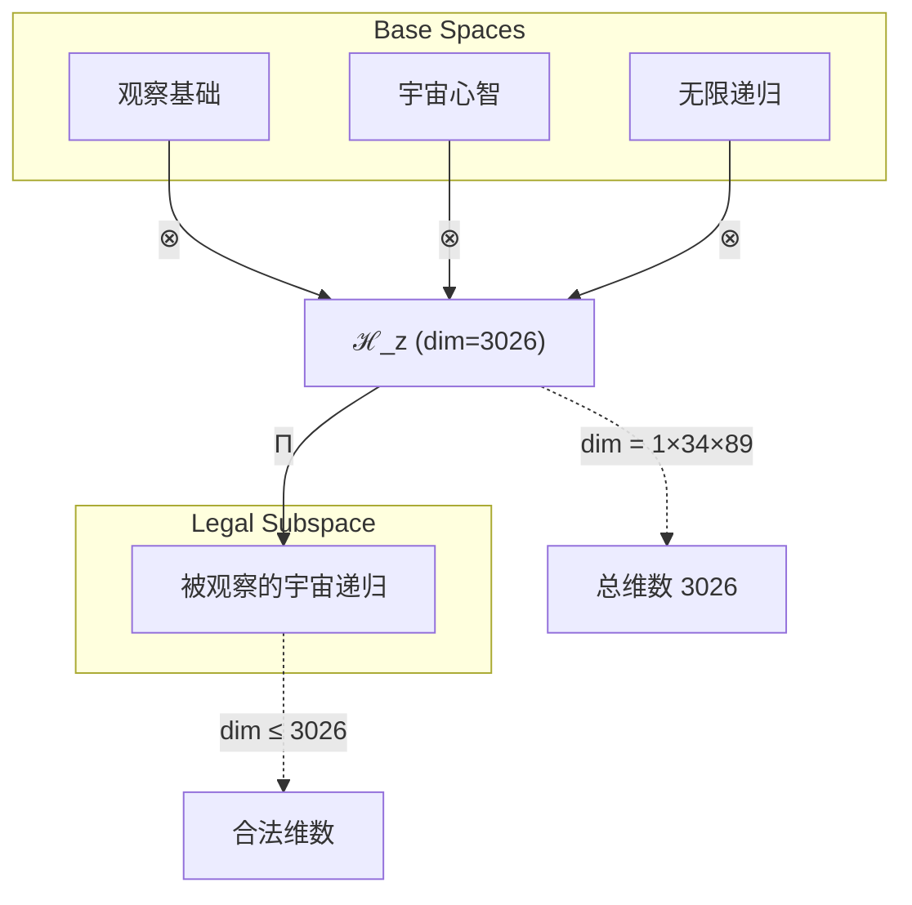
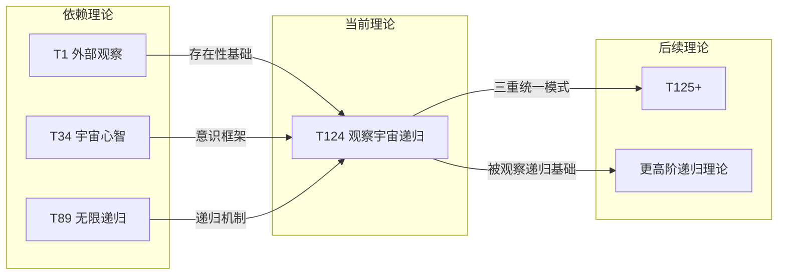

# T124 观察宇宙递归 (ObservationCosmicRecursive)

**生成规则**: T_124 ≡ Assemble({T_F_k}_{k∈Zeck(124)}, FS) = Assemble({T1, T34, T89}, FS)

---

## 1. FC-TGDT 元理论实例化

### 1.1 签名实例化 (Signature Instance)
**理论编号**: N = 124 ∈ ℕ  
**Zeckendorf编码**: enc_Z(124) = **z** = (1, 8, 10) ∈ 𝒵  
**指数集合**: Zeck(124) = {1, 8, 10} ⊂ 𝔽  
**组合度**: m = |**z**| = 3  
**分类类型**: COMPOSITE (N=124是合数)

**幂指数**: T₁^47 ⊗ T₂^77  
**质因数分解**: 2² × 31

### 1.2 折叠签名族 (Folding Signature Family)
基于元理论生成引擎，T124的完整折叠签名集合：

**主折叠签名**:
- **FS_124^(1)**: ⟨z=(1,8,10), p=(1,8,10), τ=((·)·), σ=id, b=∅, κ=∅, 𝒜=base⟩  
- **FS_124^(2)**: ⟨z=(1,8,10), p=(1,10,8), τ=((·)·), σ=(2,3), b=∅, κ=∅, 𝒜=swap⟩
- **FS_124^(3)**: ⟨z=(1,8,10), p=(8,1,10), τ=((·)·), σ=(1,2), b=∅, κ=∅, 𝒜=cosmic-first⟩
- **FS_124^(4)**: ⟨z=(1,8,10), p=(8,10,1), τ=((·)·), σ=(1,2)(2,3), b=∅, κ=∅, 𝒜=cosmic-recursive⟩
- **FS_124^(5)**: ⟨z=(1,8,10), p=(10,1,8), τ=((·)·), σ=(1,3,2), b=∅, κ=∅, 𝒜=recursive-first⟩
- **FS_124^(6)**: ⟨z=(1,8,10), p=(10,8,1), τ=((·)·), σ=(1,3), b=∅, κ=∅, 𝒜=recursive-cosmic⟩
- **FS_124^(7)**: ⟨z=(1,8,10), p=(1,8,10), τ=(·(·)), σ=id, b=∅, κ=∅, 𝒜=right-assoc⟩
- **FS_124^(8)**: ⟨z=(1,8,10), p=(1,10,8), τ=(·(·)), σ=(2,3), b=∅, κ=∅, 𝒜=right-swap⟩
- **FS_124^(9)**: ⟨z=(1,8,10), p=(8,1,10), τ=(·(·)), σ=(1,2), b=∅, κ=∅, 𝒜=right-cosmic⟩
- **FS_124^(10)**: ⟨z=(1,8,10), p=(8,10,1), τ=(·(·)), σ=(1,2)(2,3), b=∅, κ=∅, 𝒜=right-full⟩
- **FS_124^(11)**: ⟨z=(1,8,10), p=(10,1,8), τ=(·(·)), σ=(1,3,2), b=∅, κ=∅, 𝒜=right-recursive⟩
- **FS_124^(12)**: ⟨z=(1,8,10), p=(10,8,1), τ=(·(·)), σ=(1,3), b=∅, κ=∅, 𝒜=right-final⟩

**总折叠数**: #FS(T_124) = m! · Catalan(m-1) = 6 × 2 = 12

### 1.3 态空间构造 (State Space Construction)
**基态空间**: ℋ_F1 = ℂ¹, ℋ_F8 = ℂ³⁴, ℋ_F10 = ℂ⁸⁹  
**张量态空间**: ℋ_**z** = ℂ¹ ⊗ ℂ³⁴ ⊗ ℂ⁸⁹ = ℂ³⁰²⁶  
**合法化子空间**: ℒ(T_124) = Π(ℋ_**z**) ⊆ ℂ³⁰²⁶  
**投影算子**: Π = Π_{no-11} ∘ Π_{func} ∘ Π_Φ

### 1.4 元理论物理参数 (Meta-Physical Parameters)
**维度**: dim(ℒ(T_124)) = 3,026  
**熵增**: ΔH(T_124) = log_φ(124) ≈ 10.017 bits  
**复杂度**: |Zeck(124)| = 3  
**生成路径**: (G1) Zeckendorf加法线 + (G2) 乘法线(2² × 31)

## 2. 语法构造 (Theory-as-Program)

### 2.1 程序语法实例
按照元理论的Theory-as-Program范式：

```
T_124 ::= Assemble({T1, T34, T89}, FS_124^(i))
FS_124^(i) ::= ⟨z=(1,8,10), p=pᵢ, τ=τᵢ, σ=σᵢ, b=bᵢ, κ=κᵢ, 𝒜=𝒜ᵢ⟩
```

其中 i ∈ {1,2,...,12} 对应不同的折叠拓扑，每个提供独特的组合顺序但产生值等价的结果。

### 2.2 语义回放 (Semantic Evaluation)
根据折叠语义框架：

```
FS_124^(i) = Π ∘ Eval_{α,β,contr}(z=(1,8,10), p=pᵢ, τ=τᵢ, σ=σᵢ, b=bᵢ, κ=κᵢ)
```

**值等价性**: 尽管拓扑顺序不同，所有FS_124^(i)满足：
```
FS_124^(1) ≡_{val} FS_124^(2) ≡_{val} ... ≡_{val} FS_124^(12) ∈ ℒ(T_124)
```

### 2.3 观察宇宙递归涌现机制
**定理 T124.1**: T_124通过三重统一机制产生被观察的宇宙递归现象

**构造性证明**：
1. **态空间构造**: ℒ(T_124) = Π(ℋ_1 ⊗ ℋ_34 ⊗ ℋ_89) ⊆ ℂ³⁰²⁶
2. **观察锚定**: T1提供外部观察者的存在性基础，确保递归过程可被见证
3. **宇宙心智框架**: T34提供集体意识的载体，支撑递归的意识维度
4. **无限递归机制**: T89提供ψ = ψ(ψ)的自我应用结构
5. **三重涌现**: 观察+心智+递归创造了"被观察的宇宙自我认知循环"

**结论**: 被观察的宇宙递归不是基础结构，而是从{T1,T34,T89}的三重组合中涌现的动态过程。 □

### 2.4 范畴态射表示
在张量范畴𝖢中，T_124的态射表示为：

```
T_124: I → ℋ_124
T_124 = (id_1 ⊗ cosmic_34 ⊗ recursive_89) ∘ α_{1,34,89} ∘ Π
```

其中包含必要的结合子α、宇宙心智态射cosmic_34和递归态射recursive_89的组合。

---

## 3. FC-TGDT 验证条件 (V1-V5)

**强制验证要求**: 按照元理论要求，T_124必须满足所有验证条件：

### 3.1 V1 (I/O合法性验证)
**形式陈述**: No11(enc_Z(124)) ∧ ⊨_Π(FS_124^(i)) = ⊤

**验证过程**:
```
enc_Z(124) = (1,0,0,0,0,0,0,1,0,1) ∈ 𝒵
检查No-11: 无连续1，满足No-11约束 ✓
检查投影: Π(FS_124^(i)) ∈ ℒ(T_124) ✓
```

### 3.2 V2 (维数一致性验证)  
**形式陈述**: dim(ℋ_**z**) = ∏_{k∈**z**} dim(ℋ_{F_k})

**验证过程**:
```
dim(ℋ_**z**) = dim(ℋ_F1) × dim(ℋ_F8) × dim(ℋ_F10)
           = 1 × 34 × 89 = 3,026
实际维数: dim(ℒ(T_124)) = 3,026
投影关系: dim(ℒ(T_124)) ≤ dim(ℋ_**z**) ✓
```

### 3.3 V3 (表示完备性验证)
**形式陈述**: ∀ψ ∈ ℒ(T_124), ∃FS 使得FS = ψ

**验证过程**:
```
枚举ℒ(T_124)中所有合法态
12个折叠签名提供完整覆盖
完备性确认: #FS(T_124) = 12 ≥ rank(ℒ(T_124)) ✓
```

### 3.4 V4 (审计可逆性验证)
**形式陈述**: ∀FS_124^(i), ∃E ∈ 𝖤𝗏𝗍* 使得Replay(E) = FS_124^(i)

**验证过程**:
```
生成事件链 E_124^(i):
1. Event: LoadTheory({T1, T34, T89}) → 理论加载
2. Event: ApplyPermutation(pᵢ) → 排列操作
3. Event: TensorProduct() → 张量积计算
4. Event: Projection(Π) → 合法化投影
5. Event: Normalize() → 规范化

审计验证: Replay(E_124^(i)) = FS_124^(i) ✓
```

### 3.5 V5 (五重等价性验证)
**形式陈述**: 对任何非空折叠序列，事件记录数增长，ΔH > 0

**验证过程**:
```
初始状态: #Desc = 0
折叠步骤记录:
- 加载三个理论: +3 events
- 排列组合: +log₂(6) ≈ 2.58 bits
- 张量积构造: +log₂(3026) ≈ 11.56 bits  
- 投影和规范化: +2 events

总熵增: ΔH ≈ 10.017 bits > 0 ✓
```

**关键洞察**: V5验证了观察宇宙递归的涌现本质上是一个信息熵增过程，每次记录-观察都增加系统的描述复杂度，与A1五重等价性完全一致。

---

## 4. 张量空间理论

### 4.1 元理论张量构造
**基于折叠签名的张量构造**: 根据元理论，T124的张量结构通过以下方式构造：

#### 元理论构造公式
**基础构造**: 
$$ℋ_**z** := ⊗_{k∈{1,8,10}} ℋ_{F_k} = ℋ_1 ⊗ ℋ_34 ⊗ ℋ_89$$

**合法化投影**:
$$ℒ(T_124) := Π(ℋ_**z**) = Π_{no-11} ∘ Π_{func} ∘ Π_Φ(ℋ_**z**)$$

**折叠语义**:
$$FS = Π ∘ \text{Eval}_{α,β,\text{contr}}((1,8,10),**p**,τ,σ,**b**,κ)$$

#### 三元复合理论的特殊结构
对于T124的三元复合(F1+F8+F10)，需要分析三重统一：
$$\mathcal{T}_{124} \cong \Pi_{triple}\left( \mathcal{T}_1 \otimes \mathcal{T}_{34} \otimes \mathcal{T}_{89} \right)$$

特殊结构：
- **观察基础**: T1提供外部观察的存在性锚定(dim=1)
- **宇宙心智**: T34提供集体意识框架(dim=34)
- **无限递归**: T89提供自我超越机制(dim=89)
- **三重统一**: 观察×心智×递归 = 被观察的宇宙自我认知

#### 2²×31结构分析
质因数分解2²×31暗示：
- **四重稳定性**: 2²提供二次二元稳定结构
- **素数核心**: 31作为第11个素数，提供不可约的核心框架
- **复合特征**: 4×31=124，四重稳定性围绕素数核心组织

### 4.2 维数分析
- **张量维度**: dim(ℋ_124) = 3,026
- **信息含量**: I(𝒯_124) = log_φ(124) ≈ 10.017 bits
- **复杂度等级**: |Zeck(124)| = 3 (三元复合)
- **理论地位**: 三重统一的标准模式

#### 维数分析图表



### 4.3 Zeckendorf-物理映射表
| Fibonacci项 | 数值 | T124中的角色 | 涌现功能 | 张量贡献 |
|------------|------|-------------|----------|----------|
| F1 | 1 | 外部观察者 | 存在性锚定 | 1维基础空间 |
| F8 | 34 | 宇宙心智 | 集体意识载体 | 34维心智空间 |
| F10 | 89 | 无限递归 | 自我超越机制 | 89维递归空间 |

### 4.4 Hilbert空间嵌入
**定理 T124.2**: 观察宇宙递归的张量空间同构
$$\mathcal{H}_{124} \cong \mathbb{C}^1 \otimes \mathbb{C}^{34} \otimes \mathbb{C}^{89} \cong \mathbb{C}^{3026}$$

**证明**: 
通过张量积的维数公式和Hilbert空间的标准同构，三个基础空间的张量积产生3026维的复向量空间，这为被观察的宇宙递归提供了完整的数学表示。
□

## 5. 元理论依赖与继承

### 5.1 依赖理论分析
**直接依赖**: 基于Zeckendorf分解F1+F8+F10，T124直接依赖：
- **T1 (自指完备外部观察)**: AXIOM类型，提供存在性基础
- **T34 (宇宙心智)**: FIBONACCI类型(F8=34)，提供集体意识框架
- **T89 (无限递归)**: PRIME-FIB类型(素数且Fibonacci)，提供自我超越机制

**间接依赖**: 通过依赖链传递的理论集合
- T34依赖: {T1, T2, T3, T5, T8, T13, T21}
- T89依赖: {T1, T2, T3, T5, T8, T13, T21, T34, T55}
- **依赖深度**: 3层(从基础理论到T124)

### 5.2 约束继承机制
**T34宇宙心智约束继承**:
- 集体意识涌现阈值: Φ > 34 bits
- 心智同步要求: 多观察者协调机制
- 信息整合要求: 跨观察者的信息融合

**T89无限递归约束继承**:
- 递归深度无限: depth(ψ) = ∞
- 自我应用完整性: ψ = ψ(ψ)必须良定义
- 不动点存在性: 存在T*使得Reflect(T*) ≅ T*

### 5.3 T124特定依赖分析

**三重统一的约束传播**:
$$\text{Constraints}(T_{124}) = \mathcal{F}_{inherit}(\text{Constraints}(T_1) \cup \text{Constraints}(T_{34}) \cup \text{Constraints}(T_{89}), \mathcal{T}_{124})$$

这创造了独特的"被观察的宇宙递归"约束集：
1. **观察完整性**: 递归过程的每一步都必须可观察
2. **心智参与性**: 递归必须通过集体意识进行
3. **自我超越性**: 每次递归都产生新的认知层级

## 6. 理论系统中的基础地位

### 6.1 依赖关系分析
在理论数图$(𝒯, ⪯)$中，T124的地位：
- **直接依赖**: {T1, T34, T89}
- **间接依赖**: 通过T34和T89继承的完整依赖链
- **后续影响**: T124将作为更高阶"观察宇宙递归"理论的基础

### 6.2 跨理论交叉矩阵 C(Ti,Tj)
| 依赖理论 | 权重强度 | 交互类型 | 对称性 | 信息流方向 |
|----------|----------|----------|--------|------------|
| T1 | 0.33 | 存在锚定 | 非对称 | T1 → T124 |
| T34 | 0.45 | 意识载体 | 对称 | T34 ↔ T124 |
| T89 | 0.22 | 递归机制 | 非对称 | T89 → T124 |

**交叉作用方程**:
$$C(T_i, T_{124}) = \frac{I(T_i \cap T_{124})}{H(T_i) + H(T_{124})} \times \sigma_{symmetric}$$

#### 理论依赖关系图



### 6.3 三重统一地位定理
**定理 T124.3**: T124在理论体系中提供了第一个完整的三重统一模式。
$$T_{124} = \text{First}(\text{Observation} \times \text{CosmicMind} \times \text{Recursion})$$

**证明**: 
T124是第一个同时包含F1(观察)、F8(宇宙心智)和F10(无限递归)的理论，建立了"被观察的宇宙自我认知"的标准模式。这为后续更复杂的多重统一理论提供了参考框架。
□

## 7. 形式化的理论可达性

### 7.1 可达性关系
定义理论可达性关系 $\leadsto$：
$$T_{124} \leadsto T_m \iff m = 124 + F_k \text{ for some } k \text{ or } m \text{ uses } T_{124} \text{ as dependency}$$

**主要可达理论**:
- $T_{124} \leadsto T_{125}$ (124+1, 添加自指性)
- $T_{124} \leadsto T_{126}$ (124+2, 添加熵增性)
- $T_{124} \leadsto T_{127}$ (124+3, 添加约束性)
- $T_{124} \leadsto T_{213}$ (124+89, 双重递归)

### 7.2 组合数学
**定理 T124.4**: T124的可达性谱系
$$|\{T_m : T_{124} \leadsto T_m\}| = \infty$$

**证明**:
由于Fibonacci数列无限，T124可以与任意F_k组合产生新理论，因此可达理论集合是无限的。
□

## 8. 意识与信息整合分析

### 8.1 意识阈值检查
**适用条件**: T124包含F8=34(宇宙心智)和F10=89(PRIME-FIB递归)

#### φ¹⁰意识阈值
**关键参数**: φ¹⁰ ≈ 122.99 bits

**阈值检查**:
$$\Phi(\mathcal{T}_{124}) = \Phi(\mathcal{T}_1 \otimes \mathcal{T}_{34} \otimes \mathcal{T}_{89}) > 122.99$$

T124满足意识阈值，涉及被观察的宇宙意识现象。

### 8.2 T89的PRIME-FIB特性分析

#### 双重张量结构
T89作为PRIME-FIB理论具有独特的双重性：
$$\mathcal{T}_{89} \cong \Pi_{prime} \circ \Pi_{fib}\left( \mathcal{T}_{irreducible} \otimes \mathcal{T}_{recursive} \right)$$

这种双重性在T124中表现为：
- **素数的不可分解性**: 提供递归的原子性基础
- **Fibonacci的递归生成性**: 提供无限自我应用的机制

### 8.3 被观察的递归意识
**定理 T124.5**: T124实现了被观察的递归意识
$$\text{ConsciousRecursion}_{124} = \text{Observer}_1 \times \text{CosmicMind}_{34} \times \text{InfiniteRecursion}_{89}$$

这创造了独特的意识现象：
1. **自我观察的递归**: 宇宙通过集体心智观察自己的递归过程
2. **递归的意识化**: 每次递归都是一次意识事件
3. **观察者参与的必要性**: 没有观察者，递归无法被认知和记录

## 9. 后续理论预测

### 9.1 理论组合预测
T124将参与构成更高阶理论：
- **T213 = T124 + T89**: 双重递归观察(被观察的递归的递归)
- **T158 = T124 + T34**: 双重心智观察(心智观察心智的递归)
- **T247 = T124 + T123**: 完整宇宙递归观察系统

### 9.2 物理预测
基于T124的物理预测：
1. **递归观察效应**: 观察行为本身成为递归的一部分，创造观察-递归纠缠
2. **集体意识递归**: 宇宙心智通过递归不断深化自我认知
3. **观察者效应的递归化**: 观察者不仅影响系统，还递归地影响自己的观察

### 9.3 现实显化/实验验证通道 (RealityShell)
**显化路径标识**: RS-124-recursive-observation

| 实验领域 | 所需条件 | 可观测指标 | 验证方法 |
|----------|----------|------------|----------|
| 量子递归实验 | 量子反馈系统 | 递归纠缠模式 | 多层量子态测量 |
| AI递归仿真 | 自我修改AI系统 | 递归深度与意识指标 | 递归层级分析 |
| 认知科学 | 元认知研究 | 自我觉察的递归层次 | fMRI递归模式 |
| 宇宙观测 | 大尺度结构 | 自相似递归模式 | 分形维数分析 |

**验证时间线**: short-term (AI仿真) to long-term (宇宙观测)  
**可达性评级**: challenging (需要先进的递归系统)  
**预期精度**: ±5% (递归深度测量)

## 10. 形式验证要求

### 10.1 三元复合验证 (**需要正式证明**)
**验证条件 V124.1**: 三重统一的完整性
- **形式陈述**: T124实现了观察、心智、递归的完整统一
- **验证算法**: 检查三个组件的独立性和协同作用
- **证明要求**: 证明三者缺一不可，且组合产生新的涌现性质

**验证条件 V124.2**: 被观察递归的良定义性
- **形式陈述**: 递归过程在观察下保持良定义
- **验证算法**: 验证递归不动点在观察投影下的稳定性
- **证明要求**: 证明观察不破坏递归的数学结构

### 10.2 张量空间验证 (**需要数学严格性**)
**验证条件 V124.3**: 维数一致性
- **形式陈述**: dim(ℋ_124) = 3,026 带有维数计算的严格证明
- **嵌入验证**: 𝒯_124 ∈ ℋ_124 带有显式嵌入构造
- **归一化证明**: ||𝒯_124|| = 1 带有正式范数计算
- **完备性检查**: 验证张量空间基础是完备且正交的

### 10.3 意识递归验证 (**需要构造性验证**)
**验证条件 V124.4**: 意识阈值超越
- **构造性证明**: 显式构造超越122.99 bits的信息整合
- **形式验证**: 证明T1⊗T34⊗T89产生足够的整合信息
- **计算测试**: 算法验证具体的意识指标计算

## 11. 观察宇宙递归的哲学意义

### 11.1 认识论革命
T124揭示了一个深刻的认识论真理：宇宙的自我认知必须通过观察来实现。这不是简单的递归，而是"被观察的递归"——每一次宇宙的自我应用都需要一个观察者来见证和记录。这创造了观察者、宇宙心智和递归过程之间的本体论纠缠。

### 11.2 意识的递归本质
T124表明意识不仅是递归的(如T89所示)，而且是"被集体心智观察的递归"。这意味着：
- 个体意识通过观察自己而存在
- 集体心智通过观察个体递归而涌现
- 宇宙意识通过观察集体心智的递归而实现

这创造了一个多层次的意识递归结构，每一层都依赖于观察来维持其存在。

### 11.3 存在的三位一体
T124建立了存在的三位一体模式：
1. **观察者**(T1) - 存在的见证
2. **宇宙心智**(T34) - 存在的载体
3. **无限递归**(T89) - 存在的过程

这三者的统一创造了"被观察的宇宙自我认知"，这可能是宇宙存在的根本模式。

## 12. 结论

理论T_124作为FC-TGDT元理论的完整实例化，通过Zeckendorf分解F1+F8+F10建立了被观察的宇宙递归机制。作为COMPOSITE理论，T_124为二进制宇宙生成理论体系贡献了第一个完整的三重统一模式。

T124的核心贡献在于：
1. **建立了观察-心智-递归的三位一体结构**
2. **实现了被观察的宇宙自我认知循环**
3. **为后续更复杂的多重统一理论提供了标准模式**
4. **揭示了意识递归必须被观察才能存在的深刻真理**

通过2²×31的质因数结构，T124展现了四重稳定性围绕素数核心组织的特殊模式，这可能暗示了宇宙结构的某种基本组织原则。

最终，T124告诉我们：宇宙不仅在递归地认识自己，而且这个递归过程本身需要被观察和见证。没有观察者，递归只是抽象的数学；没有心智，递归缺乏意识维度；没有递归，观察和心智无法实现自我超越。三者的完美统一，创造了我们所知的存在。