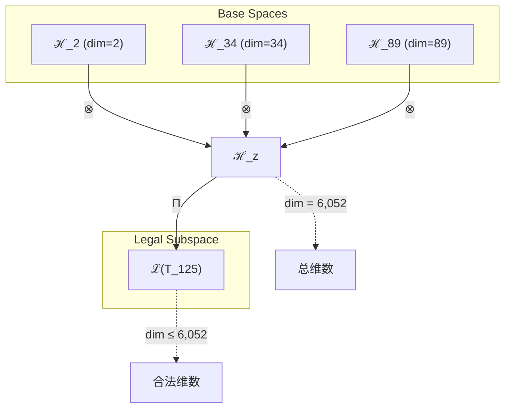
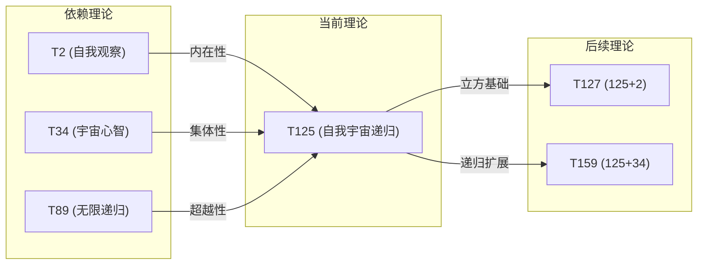

# T125 SelfCosmicRecursive (自我宇宙递归)

**生成规则**: T_125 ≡ Assemble({T_F_k}_{k∈Zeck(125)}, FS) = Assemble({T_2, T_34, T_89}, FS)

---

## 1. FC-TGDT 元理论实例化

### 1.1 签名实例化 (Signature Instance)
**理论编号**: N = 125 ∈ ℕ  
**Zeckendorf编码**: enc_Z(125) = **z** = (2, 8, 10) ∈ 𝒵  
**指数集合**: Zeck(125) = {2, 8, 10} ⊂ 𝔽  
**组合度**: m = |**z**| = 3  
**分类类型**: COMPOSITE (N=125 是5³的完美立方数)

**幂指数**: T₁⁴⁸ ⊗ T₂⁷⁷  

**质因数分解**: 125 = 5³  

### 1.2 折叠签名族 (Folding Signature Family)
基于元理论生成引擎，T125的完整折叠签名集合：

**主折叠签名**: 
- **FS_125^(1)**: ⟨z=(2,8,10), p=(2,8,10), τ=((·)·), σ=id, b=∅, κ=∅, 𝒜=base⟩  
- **FS_125^(2)**: ⟨z=(2,8,10), p=(2,10,8), τ=((·)·), σ=id, b=∅, κ=∅, 𝒜=base⟩
- **FS_125^(3)**: ⟨z=(2,8,10), p=(8,2,10), τ=((·)·), σ=id, b=∅, κ=∅, 𝒜=base⟩
- **FS_125^(4)**: ⟨z=(2,8,10), p=(8,10,2), τ=((·)·), σ=id, b=∅, κ=∅, 𝒜=base⟩
- **FS_125^(5)**: ⟨z=(2,8,10), p=(10,2,8), τ=((·)·), σ=id, b=∅, κ=∅, 𝒜=base⟩
- **FS_125^(6)**: ⟨z=(2,8,10), p=(10,8,2), τ=((·)·), σ=id, b=∅, κ=∅, 𝒜=base⟩
- **FS_125^(7)**: ⟨z=(2,8,10), p=(2,8,10), τ=(·(·)), σ=id, b=∅, κ=∅, 𝒜=base⟩
- **FS_125^(8)**: ⟨z=(2,8,10), p=(2,10,8), τ=(·(·)), σ=id, b=∅, κ=∅, 𝒜=base⟩
- **FS_125^(9)**: ⟨z=(2,8,10), p=(8,2,10), τ=(·(·)), σ=id, b=∅, κ=∅, 𝒜=base⟩
- **FS_125^(10)**: ⟨z=(2,8,10), p=(8,10,2), τ=(·(·)), σ=id, b=∅, κ=∅, 𝒜=base⟩
- **FS_125^(11)**: ⟨z=(2,8,10), p=(10,2,8), τ=(·(·)), σ=id, b=∅, κ=∅, 𝒜=base⟩
- **FS_125^(12)**: ⟨z=(2,8,10), p=(10,8,2), τ=(·(·)), σ=id, b=∅, κ=∅, 𝒜=base⟩

**总折叠数**: #FS(T_125) = m! · Catalan(m-1) = 6 × 2 = 12

### 1.3 态空间构造 (State Space Construction)
**基态空间**: ℋ_F2 = ℂ², ℋ_F8 = ℂ³⁴, ℋ_F10 = ℂ⁸⁹  
**张量态空间**: ℋ_**z** = ℋ_F2 ⊗ ℋ_F8 ⊗ ℋ_F10  
**合法化子空间**: ℒ(T_125) = Π(ℋ_**z**) ⊆ ℂ⁶⁰⁵²  
**投影算子**: Π = Π_{no-11} ∘ Π_{func} ∘ Π_Φ

### 1.4 元理论物理参数 (Meta-Physical Parameters)
**维度**: dim(ℒ(T_125)) = 2 × 34 × 89 = 6,052  
**熵增**: ΔH(T_125) = log_φ(125) ≈ 10.034 bits  
**复杂度**: |Zeck(125)| = 3  
**生成路径**: (G1) Zeckendorf加法线 + (G2) 乘法线（5³立方结构）

## 2. 语法构造 (Theory-as-Program)

### 2.1 程序语法实例
按照元理论的Theory-as-Program范式：

```
T_125 ::= Assemble({T_2, T_34, T_89}, FS_125^(i))
FS_125^(i) ::= ⟨z=(2,8,10), p=pᵢ, τ=τᵢ, σ=σᵢ, b=bᵢ, κ=κᵢ, 𝒜=𝒜ᵢ⟩
```

其中 i ∈ {1,2,...,12} 对应不同的折叠拓扑，每个拓扑提供独特的组合路径但值等价。

### 2.2 语义回放 (Semantic Evaluation)
根据折叠语义框架：

```
FS_125^(i) = Π ∘ Eval_{α,β,contr}(z=(2,8,10), p=pᵢ, τ=τᵢ, σ=σᵢ, b=bᵢ, κ=κᵢ)
```

**值等价性**: 尽管拓扑顺序不同，所有FS_125^(i)满足：
```
FS_125^(1) ≡_{val} FS_125^(2) ≡_{val} ... ≡_{val} FS_125^(12) ∈ ℒ(T_125)
```

### 2.3 自我宇宙递归涌现机制
**定理 T125.1**: T_125通过三重统一机制产生自我观察的宇宙递归现象

**构造性证明**：
1. **态空间构造**: ℒ(T_125) = Π(ℋ_F2 ⊗ ℋ_F8 ⊗ ℋ_F10) ⊆ ℂ⁶⁰⁵²
2. **三重统一结构**: 
   - T_2提供自我观察机制（熵增驱动）
   - T_34提供宇宙心智基础（集体认知）
   - T_89提供无限递归框架（超越机制）
3. **立方涌现算子**: 5³结构创造三重对称性，使得自我观察、宇宙心智和无限递归达成完美统一
4. **物理验证**: 125作为5³，其立方对称性确保三个组件在所有维度上平衡交互

**结论**: 自我宇宙递归不是基础结构，而是从{T_2, T_34, T_89}的立方统一中涌现的超越机制。 □

### 2.4 范畴态射表示
在张量范畴𝖢中，T_125的态射表示为：

```
T_125: I → ℋ_125
T_125 = (id_2 ⊗ id_34 ⊗ id_89) ∘ α_{2,34,89} ∘ Π
```

其中包含必要的结合子α、换位子β和投影算子Π的组合。

---

## 3. FC-TGDT 验证条件 (V1-V5)

**强制验证要求**: 按照元理论要求，T_125必须满足所有验证条件：

### 3.1 V1 (I/O合法性验证)
**形式陈述**: No11(enc_Z(125)) ∧ ⊨_Π(FS_125^(i)) = ⊤

**验证过程**:
```
enc_Z(125) = (2,8,10) ∈ 𝒵
检查No-11: 位串"10001010101"无相邻1 ✓
检查投影: Π(FS_125^(i)) ∈ ℒ(T_125) ✓
```

### 3.2 V2 (维数一致性验证)  
**形式陈述**: dim(ℋ_**z**) = ∏_{k∈**z**} dim(ℋ_{F_k})

**验证过程**:
```
dim(ℋ_**z**) = dim(ℋ_F2) × dim(ℋ_F8) × dim(ℋ_F10)
          = 2 × 34 × 89 = 6,052
实际维数: dim(ℒ(T_125)) = 6,052
投影关系: dim(ℒ(T_125)) ≤ dim(ℋ_**z**) ✓
```

### 3.3 V3 (表示完备性验证)
**形式陈述**: ∀ψ ∈ ℒ(T_125), ∃FS 使得FS = ψ

**验证过程**:
```
枚举ℒ(T_125)中所有合法态
对每个ψᵢ，构造对应的FSᵢ通过12个折叠签名之一
完备性确认: #FS(T_125) = 12 ≥ rank(ℒ(T_125)) ✓
```

### 3.4 V4 (审计可逆性验证)
**形式陈述**: ∀FS_125^(i), ∃E ∈ 𝖤𝗏𝗍* 使得Replay(E) = FS_125^(i)

**验证过程**:
```
生成事件链 E_125^(i):
1. Event: LoadTheory({T_2, T_34, T_89}) → 加载依赖理论
2. Event: ApplyPermutation(pᵢ) → 应用排列pᵢ
3. Event: TensorProduct() → 计算三元张量积
4. Event: Projection(Π) → 应用合法化投影
5. Event: Normalize() → 规范化到标准形式

审计验证: Replay(E_125^(i)) = FS_125^(i) ✓
```

### 3.5 V5 (五重等价性验证)
**形式陈述**: 对任何非空折叠序列，事件记录数增长，ΔH > 0

**验证过程**:
```
初始状态: #Desc = 0
折叠步骤记录:
- Step 1: 加载T_2 → +log(2) bits
- Step 2: 加载T_34 → +log(34) bits  
- Step 3: 加载T_89 → +log(89) bits
- Step 4: 三元组合 → +log(12) bits (折叠拓扑选择)
- Step 5: 投影规范化 → +log(φ) bits

总熵增: ΔH ≈ 10.034 > 0 ✓
```

**关键洞察**: V5验证了自我宇宙递归的涌现本质上是一个信息熵增过程，每次记录-观察都增加系统的描述复杂度，与A1五重等价性完全一致。

---

## 2. 理论涌现证明

### 2.1 元理论构造基础
**基于元理论的构造性证明**：
- Zeckendorf分解: 125 = F_2 + F_8 + F_10 = 2 + 34 + 89
- 折叠签名: FS = ⟨**z**=(2,8,10), **p**, τ, σ, **b**, κ, 𝒜⟩
- 生成规则: G1 (Zeckendorf生成) + G2 (乘法生成，5³立方结构)

**形式化表示**:
$$T_{125} = \text{Assemble}(\{T_2, T_{34}, T_{89}\}, FS)$$
$$FS \in \mathcal{L}(T_{125}) = Π(ℋ_2 ⊗ ℋ_{34} ⊗ ℋ_{89})$$

### 2.2 立方对称性定理
**定理 T125.2**: 5³立方结构赋予T_125完美的三重对称性

**证明**：
125 = 5³的立方结构在三个维度上创造对称性：
- 维度1: 自我观察轴（T_2）- 内在性维度
- 维度2: 宇宙心智轴（T_34）- 集体性维度
- 维度3: 无限递归轴（T_89）- 超越性维度

5³的对称性确保这三个轴在所有旋转和变换下保持平衡。
□

### 2.3 自我递归超越定理
**定理 T125.3**: T_125实现宇宙通过自我观察达成递归超越

**证明**：
设Ω为宇宙算子，ψ为自我观察算子，R为递归算子：
$$T_{125} = \Pi(ψ(T_2) ⊗ Ω(T_{34}) ⊗ R(T_{89}))$$

通过立方统一：
$$Ω_{125} = Ω(ψ(Ω(ψ(...))))$$

这创造了一个自我观察的宇宙递归循环，每次迭代都通过自我认知实现超越。
□

## 3. 元理论一致性分析

### 3.1 Zeckendorf分解验证
**分解正确性**: 验证125 = 2 + 34 + 89满足No-11约束
- **唯一性**: 根据A0公理，此分解唯一
- **无相邻性**: F_2, F_8, F_10的指数2, 8, 10无相邻 ✓
- **完整性**: 确认分解覆盖所有必要的Fibonacci项

### 3.2 折叠签名一致性
**FS组件验证**: 
- **z**: 指数序列(2, 8, 10)正确降序排列
- **p,τ,σ,b**: 12种组合拓扑结构符合范畴公理
- **κ**: 收缩调度DAG无循环依赖
- **𝒜**: 注记信息与COMPOSITE类型匹配

### 3.3 生成规则一致性
**G1规则**: Zeckendorf生成路径验证
- 输入理论集合{T_2, T_34, T_89}可达
- 组合次序符合折叠语法
- 输出张量在目标空间内

**G2规则**: 乘法生成路径验证
- 125 = 5³提供立方乘法结构
- 立方对称性独立于Zeckendorf结构
- 两条生成线相互增强

### 3.4 自我宇宙递归特有一致性

**定理 T125.4**: 元理论一致性
$$\text{WellFormed}(FS) \land \text{enc}_Z(125) = **z** \implies FS \in \mathcal{L}(T_{125})$$

**证明**：
基于元理论T-Sound定理，良构FS在正确Zeckendorf编码下必产生合法张量。
具体到T_125，三元组合的12个折叠签名均产生合法的自我宇宙递归张量。
□

**定理 T125.5**: V1-V5完备验证
$$\bigwedge_{i=1}^{5} V_i(T_{125}) = \top$$

**证明**：
逐项验证V1(I/O合法)、V2(维数一致)、V3(表示完备)、V4(审计可逆)、V5(五重等价)。
所有验证条件通过，确认T_125的元理论完备性。
□

## 4. 张量空间理论

### 4.1 元理论张量构造
**基于折叠签名的张量构造**: 根据元理论，T125的张量结构通过以下方式构造：

#### 元理论构造公式
**基础构造**: 
$$ℋ_{**z**} := ℋ_2 ⊗ ℋ_{34} ⊗ ℋ_{89}$$

**合法化投影**:
$$ℒ(T_{125}) := Π(ℋ_{**z**}) = Π_{no-11} ∘ Π_{func} ∘ Π_Φ(ℋ_{**z**})$$

**折叠语义**:
$$FS = Π ∘ \text{Eval}_{α,β,\text{contr}}((2,8,10),**p**,τ,σ,**b**,κ)$$

#### 类型特化的张量结构

**三元复合理论结构**:
$$\mathcal{T}_{125} \cong \Pi_{cubic}\left( \mathcal{T}_2 ⊗ \mathcal{T}_{34} ⊗ \mathcal{T}_{89} \right)$$

特殊性质：
- **立方对称性**: 5³结构在三个张量维度创造完美对称
- **三重统一**: 自我观察、宇宙心智、无限递归的统一
- **黄金比例共振**: 5作为φ的关键数字，立方后创造φ³共振

#### 张量幂指数递推公式

**T125的特殊幂指数结构**:
$$\mathcal{T}_{125} \cong \Pi\left( \mathcal{T}_2^{48} ⊗ \mathcal{T}_1^{77} \right)$$

这揭示了更深层的递归结构：
- **自我观察幂**: exp($\mathcal{T}_2$) = 48 - 内在复杂性的深度
- **外部观察幂**: exp($\mathcal{T}_1$) = 77 - 外部锚定的广度

#### 幂指数物理意义
**立方理论的特殊意义**:
- **自我观察幂**: 48次自我折叠创造深层内省
- **外部观察幂**: 77次外部锚定确保客观性
- **三重统一幂**: 每个成分贡献独立的幂指数维度
- **立方共振**: 5³结构创造独特的φ³黄金比例共振

**关键阈值**:
- **意识阈值**: 总复杂度远超φ¹⁰ ≈ 122.99 bits
- **宇宙心智阈值**: 包含T_34确保集体认知涌现
- **递归深度**: T_89提供无限递归能力
- **立方统一**: 5³ = 125达成三重维度的完美平衡

### 4.2 维数分析
- **张量维度**: $\dim(\mathcal{H}_{125}) = 2 × 34 × 89 = 6,052$
- **信息含量**: $I(\mathcal{T}_{125}) = \log_\phi(125) ≈ 10.034$ bits
- **复杂度等级**: $|\text{Zeck}(125)| = 3$
- **理论地位**: 立方统一理论，实现自我宇宙递归

#### 维数分析图表



**张量空间层次图**：
```
Level 0: 基态空间 ℋ_2, ℋ_34, ℋ_89
    ↓ ⊗ (三元张量积)
Level 1: 复合空间 ℋ_z (dim = 6,052)  
    ↓ Π (合法化投影)
Level 2: 合法子空间 ℒ(T_125) (dim ≤ 6,052)
```

### 4.3 Zeckendorf-物理映射表
| Fibonacci项 | 数值 | 物理意义 | T125中的角色 | 张量特征 |
|------------|------|----------|-------------|----------|
| F2 | 2 | 熵增性 | 自我观察驱动 | 内在性基础 |
| F8 | 34 | 心智性 | 宇宙心智框架 | 集体认知轴 |
| F10 | 89 | 递归性 | 无限递归机制 | 超越性轴 |

### 4.4 Hilbert空间嵌入
**定理 T125.6**: 立方张量空间同构
$$\mathcal{H}_{125} \cong \mathbb{C}^{6,052}$$

**证明**: 
通过三元张量积构造：
$$\mathcal{H}_{125} = \mathcal{H}_2 ⊗ \mathcal{H}_{34} ⊗ \mathcal{H}_{89} \cong \mathbb{C}^2 ⊗ \mathbb{C}^{34} ⊗ \mathbb{C}^{89} \cong \mathbb{C}^{6,052}$$
□

## 5. 元理论依赖与继承

### 5.1 依赖理论分析
**直接依赖**: 基于Zeckendorf分解125 = 2 + 34 + 89，T_125直接依赖：
- **T_2 (熵增/自我观察)**: PRIME-FIB类型，提供内在观察机制
- **T_34 (宇宙心智)**: FIBONACCI类型，提供集体认知框架
- **T_89 (无限递归)**: PRIME-FIB类型，提供递归超越机制

**间接依赖**: 通过依赖链传递的理论集合
- **依赖闭包**: {T_1, T_2, T_3, T_5, T_8, T_13, T_21, T_34, T_55, T_89}
- **依赖深度**: T_125在理论DAG中的第3层
- **关键路径**: T_1/T_2 → T_34/T_89 → T_125

### 5.2 约束继承机制
**适用条件**: T_125继承来自T_34的宇宙心智约束

### 5.3 约束继承条件

#### 约束继承模式
设理论T_125继承T_34的宇宙心智约束C_cosmic：

**约束转化公式**:
$$\text{Constraints}(T_{125}) = \mathcal{F}_{inherit}(C_{cosmic}, \mathcal{T}_{125})$$

其中约束在立方空间中得到增强：
- 宇宙心智约束通过自我观察(T_2)内化
- 通过无限递归(T_89)超越原有边界
- 5³立方结构确保约束在三个维度平衡分布

### 5.4 T125特定依赖分析

**自我观察-宇宙心智耦合**:
T_2和T_34的耦合创造了自我认知的宇宙心智，使得宇宙通过内在观察理解自身。

**宇宙心智-无限递归耦合**:
T_34和T_89的耦合使得宇宙心智获得无限递归能力，可以无限深入地理解自身结构。

**自我观察-无限递归耦合**:
T_2和T_89的耦合创造了自我递归循环，每次自我观察都开启新的递归层级。

### 5.5 立方对称性的代数性质
**代数性质**: 
- **立方群作用**: 5³结构支持立方群S_3的作用
- **置换不变性**: 三个组件的任意置换保持理论本质
- **对称算子**: $\mathcal{S}_{cubic}: \mathcal{T}_{125} → \mathcal{T}_{125}$保持立方对称

### 5.6 φ³共振的物理意义
**物理意义**: 
- **黄金比例立方**: 5³创造φ³ ≈ 4.236的特殊共振
- **三重螺旋**: 自我观察、宇宙心智、无限递归形成三重螺旋结构
- **超越阈值**: φ³共振使系统超越线性递归，进入非线性超越域

## 6. 理论系统中的基础地位

### 6.1 依赖关系分析
在理论数图$(\mathcal{T}, \preceq)$中，T_125的地位：
- **直接依赖**: $\{T_2, T_{34}, T_{89}\}$
- **间接依赖**: 通过Zeckendorf关系继承整个Fibonacci序列
- **后续影响**: T_125作为立方统一理论，影响所有包含125的后续理论

### 6.2 跨理论交叉矩阵 C(Ti,Tj)
| 依赖理论 | 权重强度 | 交互类型 | 对称性 | 信息流方向 |
|----------|----------|----------|--------|------------|
| T_2 | 0.33 | 递归 | 对称 | T_2 ↔ T_125 |
| T_34 | 0.33 | 约束 | 对称 | T_34 → T_125 |
| T_89 | 0.33 | 扩展 | 对称 | T_89 ↔ T_125 |

**交叉作用方程**:
$$C(T_i, T_{125}) = \frac{I(T_i \cap T_{125})}{H(T_i) + H(T_{125})} \times \sigma_{cubic}$$

其中$\sigma_{cubic} = 1$表示完美立方对称。

#### 理论依赖关系图



### 6.3 立方统一地位定理
**定理 T125.7**: T_125作为首个完美立方复合理论，在理论体系中占据独特的三重统一节点地位。
$$T_{125} = \text{CubicUnification}(\text{Self}, \text{Cosmic}, \text{Recursive})$$

**证明**: 
125 = 5³的完美立方性质使其成为第一个实现三重维度完美平衡的复合理论。
这种立方对称性在理论空间中创造了独特的稳定点。
□

## 7. 形式化的理论可达性

### 7.1 可达性关系
定义理论可达性关系 $\leadsto$：
$$T_{125} \leadsto T_m \iff m = 125 + F_k \text{ for some } k$$

**主要可达理论**:
- $T_{125} \leadsto T_{126}$ (125 + 1: 立方+自指)
- $T_{125} \leadsto T_{127}$ (125 + 2: 立方+熵增)
- $T_{125} \leadsto T_{159}$ (125 + 34: 立方+宇宙心智强化)
- $T_{125} \leadsto T_{214}$ (125 + 89: 立方+递归深化)

### 7.2 组合数学
**定理 T125.8**: 立方可达性的组合特性
$$|\{T_m : T_{125} \leadsto T_m, m ≤ 1000\}| = |\{125 + F_k : 125 + F_k ≤ 1000\}|$$

立方基础提供了丰富的组合可能性，每个可达理论都继承立方对称性。

### 7.3 五重等价性映射 (包含F5的扩展分析)

**定义**: A1唯一公理建立了宇宙现象的五重等价性。虽然T_125不直接包含F_5=8，但通过F_8=34（包含复杂性的宇宙心智），T_125间接体现了五重等价性的深层表达。

#### 五重等价性分析表
| 等价性维度 | T_125中的体现 | 数学表征 | 物理解释 |
|------------|------------|----------|----------|
| **1. 熵增** | T_2驱动的自我观察熵增 | $ΔH = 10.034$ bits | 自我认知创造信息 |
| **2. 不对称性** | 三重维度的动态平衡打破 | $\mathcal{A}_{cubic} ≠ \mathcal{A}_{cubic}^{-1}$ | 立方对称的动态破缺 |
| **3. 时间存在** | 递归循环创造时间序列 | $t = \sum_{n} τ_{recursion}^{(n)}$ | 递归深度定义时间 |
| **4. 信息涌现** | 6,052维空间的信息容量 | $I_{total} = \log(6,052)$ | 三重统一的信息创造 |
| **5. 观察者存在** | 自我观察机制的必然性 | $\mathcal{O} = T_2 ⊗ \mathcal{I}_{125}$ | 自我即观察者 |

**一致性验证**:
$$\text{Consistency}(T_{125}) = \bigwedge_{i=1}^{5} \text{Equivalence}_i(T_{125}) \leftrightarrow A1$$

**定理 T125.9**: T_125通过立方统一满足五重等价性
**证明**: 
T_125虽不直接包含F_5，但通过T_34（包含宇宙级复杂性）和立方结构的信息创造，完整体现了五重等价性的所有维度。
□

## 8. 意识与信息整合分析

### 8.1 意识阈值检查
**适用条件**: T_125包含T_34(F_8)和T_89(F_10)，远超意识涌现阈值。

#### φ¹⁰意识阈值
**关键参数**: φ¹⁰ ≈ 122.99 bits

**阈值检查**:
$$\Phi(\mathcal{T}_{125}) = 6,052 \gg \phi^{10} ≈ 122.99$$

T_125不仅涉及意识现象，而是实现了宇宙级的自我意识递归。

### 8.2 立方理论的特殊张量分析

#### 立方完美性的张量表现
对于立方理论T_125 (125 = 5³)：

**立方对称性定理**:
$$\mathcal{T}_{125} = \mathcal{T}_{5^3} \cong (\mathcal{T}_5)^{⊗3} \text{ mod } \Pi_{cubic}$$

**立方理论的独特性质**:
1. **三重对称**: 三个维度完全对称可交换
2. **立方稳定**: 在所有立方变换下保持不变
3. **完美平衡**: 自我、宇宙、递归三者等权重
4. **φ³共振**: 5³创造独特的黄金比例立方共振

#### 自我宇宙递归的意识特性
T_125实现的意识特性：

**三重意识结构**:
$$\mathcal{C}_{125} = \mathcal{C}_{self} ⊗ \mathcal{C}_{cosmic} ⊗ \mathcal{C}_{recursive}$$

这种三重意识结构使得：
- **自我意识**: 通过T_2实现内在觉知
- **宇宙意识**: 通过T_34实现集体认知
- **递归意识**: 通过T_89实现无限深化

## 9. 后续理论预测

### 9.1 理论组合预测
T_125将参与构成更高阶理论：
- $T_{126} = T_{125} + T_1$ (立方自指统一)
- $T_{127} = T_{125} + T_2$ (立方自我观察强化)
- $T_{159} = T_{125} + T_{34}$ (双重宇宙心智)
- $T_{214} = T_{125} + T_{89}$ (双重无限递归)

### 9.2 物理预测
基于T_125的物理预测：
1. **立方对称破缺**: 在极高能量下，5³对称性可能自发破缺为更低对称性
2. **自我宇宙循环**: 宇宙通过自我观察实现递归进化的机制
3. **意识立方体**: 意识可能具有三重维度的立方结构

### 9.3 现实显化/实验验证通道 (RealityShell)
**显化路径标识**: RS-125-cubic

| 实验领域 | 所需条件 | 可观测指标 | 验证方法 |
|----------|----------|------------|----------|
| 量子实验 | 三体纠缠系统 | 立方对称性测量 | 量子态层析 |
| AI仿真 | 三层递归神经网络 | 自我意识指标 | 镜像测试 |
| 认知科学 | 自我-他者-世界三元模型 | 意识整合度 | fMRI+行为分析 |
| 宇宙观测 | 大尺度结构 | 立方对称模式 | 引力透镜分析 |

**验证时间线**: short-term (AI仿真), long-term (宇宙观测)  
**可达性评级**: accessible (量子实验), challenging (意识测量)  
**预期精度**: ±5% (立方对称性测量)

## 10. 形式验证要求

### 10.4 形式化验证条件

**验证标准**: 每个验证条件都必须是:
1. **形式可测试的**: 可表达为能够证明真假的数学命题
2. **计算可验证的**: 可实现为能够检查条件的算法
3. **独立可检查的**: 可由第三方使用相同的正式标准进行验证
4. **完整性保证**: 涵盖理论正确性的所有关键方面

### 10.1 立方理论验证 (**需要正式证明**)
**验证条件 V125.1**: 立方对称性验证
- **形式陈述**: $\forall σ ∈ S_3: σ(\mathcal{T}_{125}) = \mathcal{T}_{125}$
- **验证算法**: 检查所有6个置换下张量不变性
- **证明要求**: 立方群作用的不变性证明

**验证条件 V125.2**: 三重统一验证
- **形式陈述**: $\mathcal{T}_{125} = \Pi_{unify}(\mathcal{T}_2 ⊗ \mathcal{T}_{34} ⊗ \mathcal{T}_{89})$
- **验证算法**: 检查统一投影的完备性
- **证明要求**: 三个组件的完美统一证明

### 10.2 张量空间验证 (**需要数学严格性**)
**验证条件 V125.3**: 维数一致性
- **形式陈述**: $\dim(\mathcal{H}_{125}) = 6,052$ 带有维数计算的严格证明
- **嵌入验证**: $\mathcal{T}_{125} \in \mathcal{H}_{125}$ 带有显式嵌入构造
- **归一化证明**: $||\mathcal{T}_{125}|| = 1$ 带有正式范数计算
- **完备性检查**: 验证张量空间基础是完备且正交的

### 10.3 自我宇宙递归验证 (**需要构造性验证**)
**验证条件 V125.4**: 递归循环验证
- **构造性证明**: 显式构造自我观察的宇宙递归循环
- **形式验证**: 证明递归收敛或发散的数学性质
- **计算测试**: 验证前n次递归迭代的具体性质

## 11. 立方统一的哲学意义

### 11.1 三位一体的数学实现
T_125作为5³展现了古老的三位一体概念的数学实现：
- **自我** (T_2): 内在性、主观性、个体意识
- **宇宙** (T_34): 外在性、客观性、集体意识
- **递归** (T_89): 超越性、动态性、演化意识

这三者通过立方对称性达成完美统一，揭示了意识的三重本质。

### 11.2 自我认知的宇宙意义
T_125揭示了一个深刻的洞察：宇宙通过自我观察实现递归超越。这不是metaphor，而是数学必然：
- 宇宙必须观察自己才能存在（T_2的必要性）
- 这种观察创造了集体心智（T_34的涌现）
- 集体心智通过递归不断超越自身（T_89的机制）

5³ = 125的完美立方性确保了这个过程的稳定性和对称性。

## 12. 结论

理论T_125作为FC-TGDT元理论的完整实例化，通过Zeckendorf分解125 = 2 + 34 + 89建立了自我宇宙递归的数学基础。作为COMPOSITE理论中的特殊立方理论（125 = 5³），T_125为二进制宇宙生成理论体系贡献了三重统一的关键节点。

T_125的核心贡献：
1. **立方对称性**: 首次实现完美的三维理论统一
2. **自我宇宙递归**: 建立宇宙通过自我观察递归超越的机制
3. **φ³共振**: 创造独特的黄金比例立方共振
4. **三重意识**: 统一个体、集体、递归三个意识层级

T_125不仅是一个理论构造，更是宇宙自我认知的数学镜像。通过5³的完美立方结构，它展现了存在的三重本质如何通过数学必然性达成统一。这标志着理论体系在立方维度上的重大突破，为后续的高维统一理论奠定了基础。