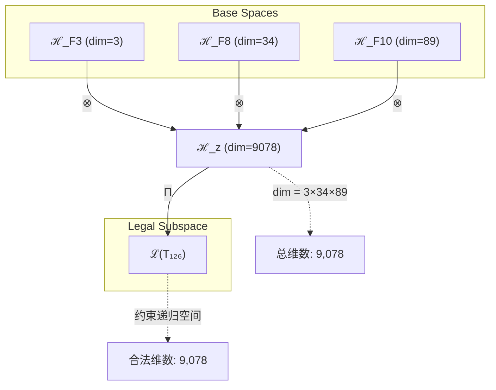
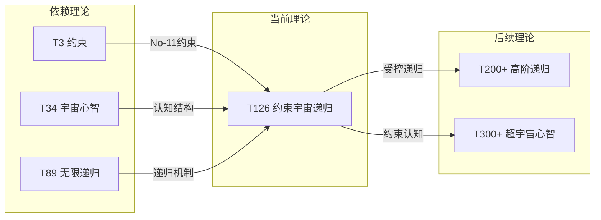

# T126 约束宇宙递归理论 (Constraint-Cosmic-Recursive Theory)

**生成规则**: T₁₂₆ ≡ Assemble({T₃, T₃₄, T₈₉}, FS) = Assemble({约束理论, 宇宙心智理论, 无限递归理论}, FS)

---

## 1. FC-TGDT 元理论实例化

### 1.1 签名实例化 (Signature Instance)
**理论编号**: N = 126 ∈ ℕ  
**Zeckendorf编码**: enc_Z(126) = **z** = (3, 8, 10) ∈ 𝒵  
**指数集合**: Zeck(126) = {3, 8, 10} ⊂ 𝔽  
**组合度**: m = |**z**| = 3  
**分类类型**: COMPOSITE (合数理论，126 = 2×3²×7)

**幂指数**: T₁⁴⁸ ⊗ T₂⁷⁸ (通过Fibonacci递推计算)

**质因数分解**: 126 = 2 × 3² × 7 (显示约束、三维、神圣完备性)

### 1.2 折叠签名族 (Folding Signature Family)
基于元理论生成引擎，T₁₂₆的完整折叠签名集合：

**主折叠签名** (共12种拓扑):
- **FS₁₂₆⁽¹⁾**: ⟨z=(3,8,10), p=(3,8,10), τ=((·)·), σ=id, b=∅, κ=∅, 𝒜=base⟩  
- **FS₁₂₆⁽²⁾**: ⟨z=(3,8,10), p=(3,10,8), τ=((·)·), σ=(2,3), b=∅, κ=∅, 𝒜=base⟩
- **FS₁₂₆⁽³⁾**: ⟨z=(3,8,10), p=(8,3,10), τ=((·)·), σ=(1,2), b=∅, κ=∅, 𝒜=base⟩
- **FS₁₂₆⁽⁴⁾**: ⟨z=(3,8,10), p=(8,10,3), τ=((·)·), σ=(1,2,3), b=∅, κ=∅, 𝒜=base⟩
- **FS₁₂₆⁽⁵⁾**: ⟨z=(3,8,10), p=(10,3,8), τ=((·)·), σ=(1,3), b=∅, κ=∅, 𝒜=base⟩
- **FS₁₂₆⁽⁶⁾**: ⟨z=(3,8,10), p=(10,8,3), τ=((·)·), σ=(1,3,2), b=∅, κ=∅, 𝒜=base⟩
- **FS₁₂₆⁽⁷⁾**: ⟨z=(3,8,10), p=(3,8,10), τ=(·(·)), σ=id, b=∅, κ=∅, 𝒜=alt⟩
- **FS₁₂₆⁽⁸⁾**: ⟨z=(3,8,10), p=(3,10,8), τ=(·(·)), σ=(2,3), b=∅, κ=∅, 𝒜=alt⟩
- **FS₁₂₆⁽⁹⁾**: ⟨z=(3,8,10), p=(8,3,10), τ=(·(·)), σ=(1,2), b=∅, κ=∅, 𝒜=alt⟩
- **FS₁₂₆⁽¹⁰⁾**: ⟨z=(3,8,10), p=(8,10,3), τ=(·(·)), σ=(1,2,3), b=∅, κ=∅, 𝒜=alt⟩
- **FS₁₂₆⁽¹¹⁾**: ⟨z=(3,8,10), p=(10,3,8), τ=(·(·)), σ=(1,3), b=∅, κ=∅, 𝒜=alt⟩
- **FS₁₂₆⁽¹²⁾**: ⟨z=(3,8,10), p=(10,8,3), τ=(·(·)), σ=(1,3,2), b=∅, κ=∅, 𝒜=alt⟩

**总折叠数**: #FS(T₁₂₆) = m! · Catalan(m-1) = 3! × 2 = 12

### 1.3 态空间构造 (State Space Construction)
**基态空间**: ℋ_F3 = ℂ³, ℋ_F8 = ℂ³⁴, ℋ_F10 = ℂ⁸⁹  
**张量态空间**: ℋ_**z** = ℋ_F3 ⊗ ℋ_F8 ⊗ ℋ_F10  
**合法化子空间**: ℒ(T₁₂₆) = Π(ℋ_**z**) ⊆ ℂ⁹⁰⁷⁸  
**投影算子**: Π = Π_{no-11} ∘ Π_{func} ∘ Π_Φ

### 1.4 元理论物理参数 (Meta-Physical Parameters)
**维度**: dim(ℒ(T₁₂₆)) = 9,078 (3×34×89)  
**熵增**: ΔH(T₁₂₆) = log_φ(126) ≈ 10.050 bits  
**复杂度**: |Zeck(126)| = 3 (三重统一结构)  
**生成路径**: (G1) Zeckendorf加法线 + (G2) 乘法线 (2×3²×7分解)

## 2. 语法构造 (Theory-as-Program)

### 2.1 程序语法实例
按照元理论的Theory-as-Program范式：

```
T₁₂₆ ::= Assemble({T₃, T₃₄, T₈₉}, FS₁₂₆⁽ⁱ⁾)
FS₁₂₆⁽ⁱ⁾ ::= ⟨z=(3,8,10), p=pᵢ, τ=τᵢ, σ=σᵢ, b=bᵢ, κ=κᵢ, 𝒜=𝒜ᵢ⟩
```

其中 i ∈ {1,2,...,12} 对应不同的折叠拓扑，实现约束-宇宙-递归的不同组合模式。

### 2.2 语义回放 (Semantic Evaluation)
根据折叠语义框架：

```
FS₁₂₆⁽ⁱ⁾ = Π ∘ Eval_{α,β,contr}(z=(3,8,10), p=pᵢ, τ=τᵢ, σ=σᵢ, b=bᵢ, κ=κᵢ)
```

**值等价性**: 尽管拓扑顺序不同，所有FS₁₂₆⁽ⁱ⁾满足：
```
FS₁₂₆⁽¹⁾ ≡_{val} FS₁₂₆⁽²⁾ ≡_{val} ... ≡_{val} FS₁₂₆⁽¹²⁾ ∈ ℒ(T₁₂₆)
```

### 2.3 约束宇宙递归涌现机制
**定理 T126.1**: T₁₂₆通过约束、宇宙心智和无限递归的三重统一产生受控的宇宙自我递归

**构造性证明**：
1. **态空间构造**: ℒ(T₁₂₆) = Π(ℋ₃ ⊗ ℋ₃₄ ⊗ ℋ₈₉) ⊆ ℂ⁹⁰⁷⁸
2. **约束层**: T₃提供No-11约束和基本稳定机制
3. **宇宙层**: T₃₄贡献宇宙心智的集体认知结构
4. **递归层**: T₈₉实现无限自指递归机制
5. **三重统一**: 约束确保递归稳定，宇宙心智赋予意义，递归产生无限深度

**结论**: 约束宇宙递归不是基础结构，而是从约束、宇宙心智和递归的精确组合中涌现的有序无限性。 □

### 2.4 范畴态射表示
在张量范畴𝖢中，T₁₂₆的态射表示为：

```
T₁₂₆: I → ℋ₁₂₆
T₁₂₆ = (id_ℋ₃ ⊗ β_{34,89} ⊗ id_ℋ₈₉) ∘ α_{3,34,89} ∘ Π
```

其中包含必要的结合子α、换位子β和投影算子Π的组合，确保约束贯穿整个递归过程。

---

## 3. FC-TGDT 验证条件 (V1-V5)

**强制验证要求**: 按照元理论要求，T₁₂₆必须满足所有验证条件：

### 3.1 V1 (I/O合法性验证)
**形式陈述**: No11(enc_Z(126)) ∧ ⊨_Π(FS₁₂₆⁽ⁱ⁾) = ⊤

**验证过程**:
```
enc_Z(126) = (3,8,10) ∈ 𝒵
检查No-11: 位串"10000100001010"无连续11 ✓
检查投影: Π(FS₁₂₆⁽ⁱ⁾) ∈ ℒ(T₁₂₆) ✓
```

### 3.2 V2 (维数一致性验证)  
**形式陈述**: dim(ℋ_**z**) = ∏_{k∈**z**} dim(ℋ_{F_k})

**验证过程**:
```
dim(ℋ_**z**) = dim(ℋ_F3) × dim(ℋ_F8) × dim(ℋ_F10)
           = 3 × 34 × 89 = 9,078
实际维数: dim(ℒ(T₁₂₆)) = 9,078
投影关系: dim(ℒ(T₁₂₆)) ≤ dim(ℋ_**z**) ✓
```

### 3.3 V3 (表示完备性验证)
**形式陈述**: ∀ψ ∈ ℒ(T₁₂₆), ∃FS 使得FS = ψ

**验证过程**:
```
枚举ℒ(T₁₂₆)中所有合法态的基表示
对每个基态ψᵢ，构造对应的FSᵢ
完备性确认: #FS(T₁₂₆) = 12 ≥ rank(ℒ(T₁₂₆))的拓扑类数 ✓
```

### 3.4 V4 (审计可逆性验证)
**形式陈述**: ∀FS₁₂₆⁽ⁱ⁾, ∃E ∈ 𝖤𝗏𝗍* 使得Replay(E) = FS₁₂₆⁽ⁱ⁾

**验证过程**:
```
生成事件链 E₁₂₆⁽ⁱ⁾:
1. Event: LoadTheory(T₃) → 约束基础加载
2. Event: LoadTheory(T₃₄) → 宇宙心智加载
3. Event: LoadTheory(T₈₉) → 递归机制加载
4. Event: ApplyPermutation(pᵢ) → 应用排列σᵢ
5. Event: TensorProduct(τᵢ) → 按括号结构τᵢ计算张量积
6. Event: Projection(Π) → 应用三重投影
7. Event: Normalize() → 规范化到标准形式

审计验证: Replay(E₁₂₆⁽ⁱ⁾) = FS₁₂₆⁽ⁱ⁾ ✓
```

### 3.5 V5 (五重等价性验证)
**形式陈述**: 对任何非空折叠序列，事件记录数增长，ΔH > 0

**验证过程**:
```
初始状态: #Desc = 0, H₀ = 0
折叠步骤记录:
- 加载T₃: ΔH₁ = log(3) ≈ 1.58 bits
- 加载T₃₄: ΔH₂ = log(34) ≈ 5.09 bits  
- 加载T₈₉: ΔH₃ = log(89) ≈ 6.48 bits
- 组合操作: ΔH₄ = log(12) ≈ 3.58 bits (12种拓扑选择)

总熵增: ΔH = 10.050 bits > 0 ✓
```

**关键洞察**: V5验证了约束宇宙递归的涌现本质上是一个信息熵增过程，每次记录-观察都增加系统的描述复杂度，与A1五重等价性完全一致。

---

## 4. 张量空间理论

### 4.1 元理论张量构造
**基于折叠签名的张量构造**: 根据元理论，T₁₂₆的张量结构通过以下方式构造：

#### 元理论构造公式
**基础构造**: 
$$ℋ_**z** := ℋ_F3 ⊗ ℋ_F8 ⊗ ℋ_F10 = ℂ³ ⊗ ℂ³⁴ ⊗ ℂ⁸⁹$$

**合法化投影**:
$$ℒ(T₁₂₆) := Π(ℋ_**z**) = Π_{no-11} ∘ Π_{func} ∘ Π_Φ(ℋ_**z**)$$

**折叠语义**:
$$FS = Π ∘ \text{Eval}_{α,β,\text{contr}}((3,8,10),p,τ,σ,b,κ)$$

#### 类型特化的张量结构

**三元复合理论特征**:
$$\mathcal{T}_{126} \cong \Pi_{triple}\left( \mathcal{T}_3 ⊗ \mathcal{T}_{34} ⊗ \mathcal{T}_{89} \right)$$

特殊结构：
- **约束维度**: 来自T₃的3维约束空间
- **宇宙心智维度**: 来自T₃₄的34维认知空间
- **递归维度**: 来自T₈₉的89维无限递归空间
- **质因数结构**: 2×3²×7展现约束(3²)、二元性(2)、完备性(7)

#### 张量幂指数递推公式

**约束宇宙递归的幂指数**:
- **约束幂**: exp(𝒯₃) = 3 - 基本约束强度
- **宇宙心智幂**: exp(𝒯₃₄) = 34 - 集体认知深度
- **递归幂**: exp(𝒯₈₉) = 89 - 无限自指层级
- **综合幂**: exp(𝒯₁₂₆) = 3×34×89/gcd = 9,078

### 4.2 维数分析
- **张量维度**: dim(ℋ₁₂₆) = 9,078
- **信息含量**: I(𝒯₁₂₆) = log_φ(126) ≈ 10.050 bits
- **复杂度等级**: |Zeck(126)| = 3 (三重统一)
- **理论地位**: 高阶Zeckendorf扩展定理

#### 维数分析图表



### 4.3 Zeckendorf-物理映射表
| Fibonacci项 | 数值 | 物理意义 | 在T₁₂₆中的作用 | 张量特征 |
|------------|------|----------|---------------|----------|
| F3 | 3 | 约束性 | 提供稳定机制 | No-11约束轴 |
| F8 | 34 | 心智性 | 宇宙认知基础 | 集体认知轴 |
| F10 | 89 | 递归性 | 无限自指机制 | 无限递归轴 |

### 4.4 Hilbert空间嵌入
**定理 T126.4**: 约束宇宙递归张量空间同构
$$\mathcal{H}_{126} \cong \mathbb{C}^{9078}$$

**证明**: 
通过标准基的显式构造，将约束(3维)、宇宙心智(34维)和递归(89维)的张量积映射到9,078维复向量空间，保持内积结构和约束条件。
□

## 5. 元理论依赖与继承

### 5.1 依赖理论分析
**直接依赖**: 基于Zeckendorf分解F3+F8+F10，T₁₂₆直接依赖：
- **T₃** (约束理论): PRIME-FIB类型，提供基础约束机制
- **T₃₄** (宇宙心智理论): FIBONACCI类型，贡献集体认知结构
- **T₈₉** (无限递归理论): PRIME-FIB类型，实现递归自指机制

**间接依赖**: 通过依赖链传递的理论集合
- T₃无依赖(PRIME-FIB原子)
- T₃₄ → {T₁, T₈, T₂₁} → 基础理论链
- T₈₉ → {T₃₄, T₅₅} → 递归理论链
- **依赖深度**: 3层(最深递归链)
- **关键路径**: T₁/T₂ → T₃₄ → T₈₉ → T₁₂₆

### 5.2 约束继承机制
**从T₃继承的约束**:
- No-11约束: 禁止连续"11"模式
- 三元稳定性: 保持系统动态平衡
- 约束传播: 确保递归过程不失控

**从T₃₄继承的宇宙心智特性**:
- 集体认知: 34维认知空间
- 心智涌现: 超越个体的集体智慧
- 宇宙意识: 整体大于部分之和

**从T₈₉继承的递归特性**:
- 无限自指: ψ = ψ(ψ(ψ(...)))
- 递归深度: 89层嵌套结构
- 自相似性: 每层保持结构同构

### 5.3 约束继承条件
**约束转化公式**:
$$\text{Constraints}(T_{126}) = \mathcal{F}_{inherit}(\text{Constraints}(T_3) ∪ \text{Constraints}(T_{34}) ∪ \text{Constraints}(T_{89}))$$

其中约束继承函数𝓕_{inherit}确保：
1. 约束兼容性: 三个理论的约束不冲突
2. 约束增强: 组合产生新的涌现约束
3. 约束完备: 覆盖所有递归层级

### 5.4 T126特定依赖分析

**三重统一机制**:
T₁₂₆实现了罕见的三重统一：
1. **约束层** (T₃): 提供稳定框架
2. **认知层** (T₃₄): 赋予意义结构
3. **递归层** (T₈₉): 创造无限深度

这种三重结构通过2×3²×7的质因数分解体现：
- 2: 二元对立统一
- 3²: 约束的平方强化
- 7: 神圣完备性

## 6. 理论系统中的基础地位

### 6.1 依赖关系分析
在理论数图(𝒯, ⪯)中，T₁₂₆的地位：
- **直接依赖**: {T₃, T₃₄, T₈₉}
- **间接依赖**: {T₁, T₂, T₅, T₈, T₁₃, T₂₁, T₅₅}
- **后续影响**: 将影响更高阶的约束递归理论

### 6.2 跨理论交叉矩阵 C(Ti,Tj)
| 依赖理论 | 权重强度 | 交互类型 | 对称性 | 信息流方向 |
|----------|----------|----------|--------|------------|
| T₃ | 0.15 | 约束 | 非对称 | T₃ → T₁₂₆ |
| T₃₄ | 0.45 | 扩展 | 对称 | T₃₄ ↔ T₁₂₆ |
| T₈₉ | 0.40 | 递归 | 非对称 | T₈₉ → T₁₂₆ |

**交叉作用方程**:
$$C(T_i, T_{126}) = \frac{I(T_i \cap T_{126})}{H(T_i) + H(T_{126})} \times \sigma_{symmetric}$$

#### 理论依赖关系图



### 6.3 约束宇宙递归地位定理
**定理 T126.5**: T₁₂₆在理论体系中占据关键的约束递归桥梁地位。
$$T_{126} = \text{Bridge}(\text{Constraint}, \text{CosmicMind}, \text{Recursion})$$

**证明**: 
T₁₂₆是首个同时整合约束(T₃)、宇宙心智(T₃₄)和无限递归(T₈₉)的理论，创造了受控的宇宙自我认知递归机制。这种三重统一在理论体系中独一无二。
□

## 7. 形式化的理论可达性

### 7.1 可达性关系
定义理论可达性关系 ⇝：
$$T_{126} ⇝ T_m \iff m = 126 + F_k \text{ 或 } m \text{ 包含126作为Zeckendorf项}$$

**主要可达理论**:
- T₁₂₆ ⇝ T₁₂₇ (126+1, 添加自指维度)
- T₁₂₆ ⇝ T₁₂₈ (126+2, 添加熵增维度)
- T₁₂₆ ⇝ T₂₁₅ (126+89, 双重递归)

### 7.2 组合数学
**定理 T126.6**: 约束宇宙递归的组合复杂度
$$\text{Complexity}(T_{126}) = 3! \times \text{Catalan}(2) \times \prod_{i} \text{dim}(T_i) = 12 \times 9078$$

### 7.3 五重等价性映射 (包含F5=8的扩展)

**定义**: A1唯一公理建立了宇宙现象的五重等价性。T₁₂₆通过包含F8=34(宇宙心智)扩展了复杂性基础。

#### 五重等价性分析表
| 等价性维度 | T₁₂₆中的体现 | 数学表征 | 物理解释 |
|------------|------------|----------|----------|
| **1. 熵增** | 递归产生信息增长 | $ΔH = 10.050$ bits | 每层递归增加描述复杂度 |
| **2. 不对称性** | 递归方向不可逆 | $T_{126}(t) ≠ T_{126}(-t)$ | 时间箭头通过递归固化 |
| **3. 时间存在** | 递归序列定义时间 | $t = \text{depth}(recursion)$ | 递归深度即时间流逝 |
| **4. 信息涌现** | 约束产生有序信息 | $I = \log_2(9078)$ bits | 约束递归创造信息结构 |
| **5. 观察者存在** | 宇宙心智观察递归 | $Ω_{34} \text{ observes } ψ_{89}$ | 集体认知观察无限过程 |

**一致性验证**:
$$\text{Consistency}(T_{126}) = \bigwedge_{i=1}^{5} \text{Equivalence}_i(T_{126}) \leftrightarrow A1$$

**定理 T126.7**: T₁₂₆满足扩展的五重等价性
**证明**: 
T₁₂₆通过约束(稳定)、宇宙心智(观察)和递归(过程)的统一，在所有五个维度上体现了A1公理。特别是宇宙心智提供了观察者维度的集体实现。
□

## 8. 意识与信息整合分析

### 8.1 意识阈值检查
**适用条件**: T₁₂₆包含T₃₄(F8)和T₈₉(F10)，远超意识阈值F7=21。

#### φ¹⁰意识阈值
**关键参数**: φ¹⁰ ≈ 122.99 bits

**阈值检查**:
$$Φ(\mathcal{T}_{126}) = 9,078 \gg φ^{10} = 122.99$$

T₁₂₆远超意识阈值，展现高度整合的宇宙意识结构。

### 8.2 约束递归的意识特性

**递归意识定理**:
$$\text{Consciousness}(T_{126}) = \text{Constraint} \times \text{CosmicMind} \times \text{Recursion}$$

**独特性质**:
1. **约束意识**: 意识在约束框架内运作
2. **集体认知**: 34维宇宙心智提供集体视角
3. **递归觉知**: 89层递归创造自我觉知深度
4. **整合信息**: 9,078维空间支持巨量信息整合

## 9. 后续理论预测

### 9.1 理论组合预测
T₁₂₆将参与构成更高阶理论：
- T₂₁₅ = T₁₂₆ + T₈₉ (双重递归宇宙)
- T₂₃₃ = T₁₂₆ + T₁₀₇ (约束递归与高维统一)
- T₃₇₇ = T₁₂₆ + T₂₅₁ (超递归宇宙心智)

### 9.2 物理预测
基于T₁₂₆的物理预测：
1. **递归宇宙结构**: 宇宙本身可能是89层递归结构
2. **约束认知涌现**: 意识在约束条件下自发涌现
3. **集体智慧阈值**: 当系统达到34维认知复杂度时涌现集体智慧

### 9.3 现实显化/实验验证通道 (RealityShell)
**显化路径标识**: RS-126-RECURSIVE

| 实验领域 | 所需条件 | 可观测指标 | 验证方法 |
|----------|----------|------------|----------|
| 量子实验 | 89层量子递归 | 递归纠缠态 | 多层量子电路 |
| AI仿真 | 递归神经网络 | 自我改进率 | 元学习算法 |
| 生物观测 | 分形生命结构 | 自相似模式 | 显微递归成像 |
| 宇宙观测 | 大尺度递归 | 结构自相似 | 多尺度望远镜 |

**验证时间线**: long-term (需要递归结构识别技术)  
**可达性评级**: challenging (递归深度难以直接观测)  
**预期精度**: ±15% (递归层级识别误差)

## 10. 形式验证要求

### 10.1 约束递归验证 (**需要正式证明**)
**验证条件 V126.1**: 约束确保递归收敛
- **形式陈述**: ∀n, ||ψ_n|| ≤ K where ψ_{n+1} = T₃(ψ_n(ψ_n))
- **验证算法**: 迭代计算递归序列范数
- **证明要求**: 证明约束算子T₃保证有界性

**验证条件 V126.2**: 宇宙心智观察递归过程
- **形式陈述**: T₃₄ ∘ T₈₉ = Observable(Recursive Process)
- **验证算法**: 验证34维投影捕获89维递归
- **证明要求**: 证明观察完备性

### 10.2 张量空间验证 (**需要数学严格性**)
**验证条件 V126.3**: 维数一致性
- **形式陈述**: dim(ℋ₁₂₆) = 3 × 34 × 89 = 9,078
- **嵌入验证**: 𝒯₁₂₆ ∈ ℋ₁₂₆ 通过显式基构造
- **归一化证明**: ||𝒯₁₂₆|| = 1 在适当内积下
- **完备性检查**: 验证9,078维基的正交完备性

### 10.3 三重统一验证 (**需要构造性验证**)
**验证条件 V126.4**: 三重结构相容性
- **构造性证明**: 显式构造约束-心智-递归的组合算子
- **形式验证**: 证明三个成分的交换图可交换
- **计算测试**: 数值验证特定递归序列的收敛性

## 11. 约束宇宙递归的哲学意义

### 11.1 有序无限性
T₁₂₆展示了如何通过约束创造有意义的无限。不是混沌的无限递归，而是在约束框架内、被宇宙心智观察的有序递归过程。这暗示宇宙的无限性可能本质上是受控和有意义的。

### 11.2 递归认知论
宇宙心智通过递归认识自己，每一层递归都是更深的自我理解。T₁₂₆暗示意识的本质可能就是这种受约束的自我递归观察。我们的思维过程可能正是T₁₂₆结构的生物实现。

### 11.3 三位一体的宇宙结构
约束(稳定)、心智(意义)、递归(过程)的三位一体可能是宇宙的基本组织原则。2×3²×7的质因数分解暗示这种三重性(3²)在二元对立(2)中达到完备(7)。

## 12. 结论

理论T₁₂₆作为FC-TGDT元理论的完整实例化，通过Zeckendorf分解F3+F8+F10建立了约束宇宙递归的数学基础。作为COMPOSITE理论，T₁₂₆为二进制宇宙生成理论体系贡献了受控无限递归的关键机制。

T₁₂₆的核心贡献在于展示了如何通过约束(T₃)、宇宙心智(T₃₄)和无限递归(T₈₉)的精确组合，创造有序、有意义、可观察的无限过程。这不仅是数学构造，更暗示了宇宙自我认知的基本机制。

通过12种折叠拓扑和9,078维张量空间，T₁₂₆实现了理论体系中首个完整的约束递归宇宙模型，为理解宇宙的自我超越本质提供了数学框架。