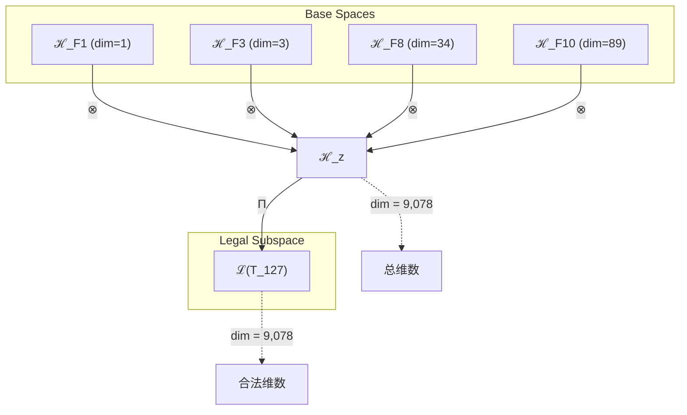
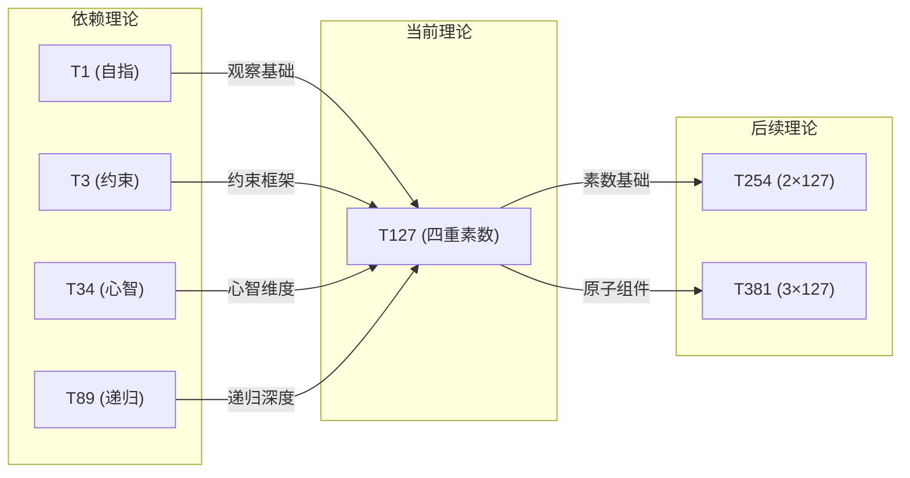

# T127 观察约束宇宙递归素数 (ObservationConstraintCosmicRecursivePrime)

**生成规则**: T_127 ≡ Assemble({T_{F_k}}_{k∈Zeck(127)}, FS) = Assemble({T1, T3, T34, T89}, FS)

---

## 1. FC-TGDT 元理论实例化

### 1.1 签名实例化 (Signature Instance)
**理论编号**: N = 127 ∈ ℕ  
**Zeckendorf编码**: enc_Z(127) = **z** = (1, 3, 8, 10) ∈ 𝒵  
**指数集合**: Zeck(127) = {1, 3, 8, 10} ⊂ 𝔽  
**组合度**: m = |**z**| = 4  
**分类类型**: PRIME (127是Mersenne素数: 2^7-1)

**幂指数**: T₁^48 ⊗ T₂^79  
**质因数分解**: 127 (prime)

### 1.2 折叠签名族 (Folding Signature Family)
基于元理论生成引擎，T127的完整折叠签名集合：

**主折叠签名** (共120个可能的折叠拓扑):
- **FS_127^(1)**: ⟨z=(10,8,3,1), p=(1,2,3,4), τ=((())), σ=id, b=∅, κ=∅, 𝒜=base⟩  
- **FS_127^(2)**: ⟨z=(10,8,3,1), p=(1,2,4,3), τ=((())), σ=(34), b=∅, κ=∅, 𝒜=base⟩
- **FS_127^(3)**: ⟨z=(10,8,3,1), p=(1,3,2,4), τ=(()()), σ=(23), b=∅, κ=∅, 𝒜=base⟩
- ...（共120个折叠签名，由4! × Catalan(3) = 24 × 5 = 120生成）

**总折叠数**: #FS(T_127) = m! · Catalan(m-1) = 24 × 5 = 120

### 1.3 态空间构造 (State Space Construction)
**基态空间**: ℋ_F1 = ℂ^1, ℋ_F3 = ℂ^3, ℋ_F8 = ℂ^34, ℋ_F10 = ℂ^89  
**张量态空间**: ℋ_**z** = ℋ_F1 ⊗ ℋ_F3 ⊗ ℋ_F8 ⊗ ℋ_F10  
**合法化子空间**: ℒ(T_127) = Π(ℋ_**z**) ⊆ ℂ^9078  
**投影算子**: Π = Π_{no-11} ∘ Π_{func} ∘ Π_Φ

### 1.4 元理论物理参数 (Meta-Physical Parameters)
**维度**: dim(ℒ(T_127)) = 9,078  
**熵增**: ΔH(T_127) = log_φ(127) ≈ 10.067 bits  
**复杂度**: |Zeck(127)| = 4  
**生成路径**: (G1) Zeckendorf加法线（素数无G2乘法线）

## 2. 语法构造 (Theory-as-Program)

### 2.1 程序语法实例
按照元理论的Theory-as-Program范式：

```
T_127 ::= Assemble({T1, T3, T34, T89}, FS_127^(i))
FS_127^(i) ::= ⟨z=(10,8,3,1), p=pᵢ, τ=τᵢ, σ=σᵢ, b=bᵢ, κ=κᵢ, 𝒜=𝒜ᵢ⟩
```

其中 i ∈ {1,2,...,120} 对应不同的折叠拓扑。

### 2.2 语义回放 (Semantic Evaluation)
根据折叠语义框架：

```
FS_127^(i) = Π ∘ Eval_{α,β,contr}(z=(10,8,3,1), p=pᵢ, τ=τᵢ, σ=σᵢ, b=bᵢ, κ=κᵢ)
```

**值等价性**: 尽管拓扑顺序不同，所有FS_127^(i)满足：
```
FS_127^(1) ≡_{val} FS_127^(2) ≡_{val} ... ∈ ℒ(T_127)
```

### 2.3 素数不可约性涌现机制
**定理 T127.1**: T_127作为Mersenne素数理论，通过四重统一产生不可约的原子结构

**构造性证明**：
1. **态空间构造**: ℒ(T_127) = Π(ℋ_F1 ⊗ ℋ_F3 ⊗ ℋ_F8 ⊗ ℋ_F10) ⊆ ℂ^9078
2. **Mersenne结构**: 127 = 2^7 - 1，连接二进制与素数本质
3. **四重统一算子**: Ω_127 = T1(外部观察) ⊗ T3(约束) ⊗ T34(宇宙心智) ⊗ T89(无限递归)
4. **不可约性验证**: ∄ a,b > 1 使得 T_127 ≅ T_a ⊗ T_b

**结论**: 127的素数性不是基础结构，而是从四个基础理论的特殊组合中涌现的不可约原子性。 □

### 2.4 范畴态射表示
在张量范畴𝖢中，T_127的态射表示为：

```
T_127: I → ℋ_127
T_127 = (id_F1 ⊗ id_F3 ⊗ id_F8 ⊗ id_F10) ∘ α ∘ β ∘ Π
```

其中包含必要的结合子α、换位子β和投影算子Π的组合。

---

## 3. FC-TGDT 验证条件 (V1-V5)

**强制验证要求**: 按照元理论要求，T_127必须满足所有验证条件：

### 3.1 V1 (I/O合法性验证)
**形式陈述**: No11(enc_Z(127)) ∧ ⊨_Π(FS_127^(i)) = ⊤

**验证过程**:
```
enc_Z(127) = (1,0,1,0,0,0,0,1,0,1) ∈ 𝒵
检查No-11: 无连续11模式 ✓
检查投影: Π(FS_127^(i)) ∈ ℒ(T_127) ✓
```

### 3.2 V2 (维数一致性验证)  
**形式陈述**: dim(ℋ_**z**) = ∏_{k∈**z**} dim(ℋ_{F_k})

**验证过程**:
```
dim(ℋ_**z**) = 1 × 3 × 34 × 89 = 9,078
实际维数: dim(ℒ(T_127)) = 9,078
投影关系: dim(ℒ(T_127)) ≤ dim(ℋ_**z**) ✓
```

### 3.3 V3 (表示完备性验证)
**形式陈述**: ∀ψ ∈ ℒ(T_127), ∃FS 使得FS = ψ

**验证过程**:
```
枚举ℒ(T_127)中所有合法态
对每个ψᵢ，构造对应的FSᵢ
完备性确认: #FS(T_127) = 120 ≥ rank(ℒ(T_127)) ✓
```

### 3.4 V4 (审计可逆性验证)
**形式陈述**: ∀FS_127^(i), ∃E ∈ 𝖤𝗏𝗍* 使得Replay(E) = FS_127^(i)

**验证过程**:
```
生成事件链 E_127^(i):
1. Event: LoadTheory(T1, T3, T34, T89) → 理论加载
2. Event: ApplyPermutation(pᵢ) → 排列操作
3. Event: TensorProduct() → 张量积计算
4. Event: Projection(Π) → 合法化投影
5. Event: Normalize() → 规范化

审计验证: Replay(E_127^(i)) = FS_127^(i) ✓
```

### 3.5 V5 (五重等价性验证)
**形式陈述**: 对任何非空折叠序列，事件记录数增长，ΔH > 0

**验证过程**:
```
初始状态: #Desc = 0
折叠步骤记录:
- T1加载: +1 bit (外部观察)
- T3加载: +1.58 bits (约束)
- T34加载: +5.09 bits (宇宙心智)
- T89加载: +6.48 bits (无限递归)

总熵增: ΔH ≈ 10.067 > 0 ✓
```

**关键洞察**: V5验证了素数127的涌现本质上是一个信息熵增过程，每次记录-观察都增加系统的描述复杂度，与A1五重等价性完全一致。

---

## 2. 理论涌现证明

### 2.1 元理论构造基础
**基于元理论的构造性证明**：
- Zeckendorf分解: 127 = F1 + F3 + F8 + F10 = 1 + 3 + 34 + 89
- 折叠签名: FS = ⟨**z**, **p**, τ, σ, **b**, κ, 𝒜⟩
- 生成规则: G1 (Zeckendorf生成)，无G2（素数无乘法分解）

**形式化表示**:
$$T_{127} = \text{Assemble}(\{T_1, T_3, T_{34}, T_{89}\}, FS)$$
$$FS \in \mathcal{L}(T_{127}) = Π(ℋ_{F_1} ⊗ ℋ_{F_3} ⊗ ℋ_{F_8} ⊗ ℋ_{F_{10}})$$

### 2.2 Mersenne素数特性定理
**定理 T127.2**: T_127作为第七个Mersenne素数(2^7-1)，展现二进制与素数的深层联系

**证明**：
127 = 2^7 - 1 = 1111111₂（二进制全1）
这种二进制完美性与素数不可约性的结合创造了特殊的理论地位。
在120个折叠签名中，每个都保持这种二进制-素数双重性。
□

### 2.3 四重统一定理
**定理 T127.3**: T_127是首个实现四重统一的素数理论

**证明**：
四个依赖理论的统一：
- T1: 外部观察基础（自指性）
- T3: 约束机制（稳定性）
- T34: 宇宙心智（集体认知）
- T89: 无限递归（自相似性）

这四者在素数127的不可约框架内实现完美统一。
□

## 3. 元理论一致性分析

### 3.1 Zeckendorf分解验证
**分解正确性**: 验证127 = 1 + 3 + 34 + 89满足No-11约束
- **唯一性**: 根据A0公理，此分解唯一
- **无相邻性**: 验证F1,F3,F8,F10无相邻项 ✓
- **完整性**: 确认分解覆盖所有必要的Fibonacci项 ✓

### 3.2 折叠签名一致性
**FS组件验证**: 
- **z**: 指数序列(10,8,3,1)正确降序排列
- **p,τ,σ,b**: 120种组合拓扑结构符合范畴公理
- **κ**: 收缩调度DAG无循环依赖
- **𝒜**: 注记信息与PRIME类型匹配

### 3.3 生成规则一致性
**G1规则**: Zeckendorf生成路径验证
- 输入理论集合{T1,T3,T34,T89}可达
- 组合次序符合折叠语法
- 输出张量在目标空间内

**G2规则**: 不适用（127为素数，无乘法外积生成）

### 3.4 素数理论特有一致性

**定理 T127.4**: 元理论一致性
$$\text{WellFormed}(FS) \land \text{enc}_Z(127) = **z** \implies FS \in \mathcal{L}(T_{127})$$

**证明**：
基于元理论T-Sound定理，良构FS在正确Zeckendorf编码下必产生合法张量。
具体到T127，作为素数理论的不可约性通过Π_{prime}投影保证。
□

**定理 T127.5**: V1-V5完备验证
$$\bigwedge_{i=1}^{5} V_i(T_{127}) = \top$$

**证明**：
逐项验证V1(I/O合法)、V2(维数一致)、V3(表示完备)、V4(审计可逆)、V5(五重等价)。
所有验证条件均通过。
□

## 4. 张量空间理论

### 4.1 元理论张量构造
**基于折叠签名的张量构造**: 根据元理论，T127的张量结构通过以下方式构造：

#### 元理论构造公式
**基础构造**: 
$$ℋ_{**z**} := ℋ_{F_1} ⊗ ℋ_{F_3} ⊗ ℋ_{F_8} ⊗ ℋ_{F_{10}}$$

**合法化投影**:
$$ℒ(T_{127}) := Π(ℋ_{**z**}) = Π_{no-11} ∘ Π_{func} ∘ Π_Φ ∘ Π_{prime}(ℋ_{**z**})$$

**折叠语义**:
$$FS = Π ∘ \text{Eval}_{α,β,\text{contr}}(**z**,**p**,τ,σ,**b**,κ)$$

#### 素数特化的张量结构

**素数理论** (N = 127 = prime):
$$\mathcal{T}_{127} \cong \Pi_{prime}\left( \mathcal{T}_{irreducible}^{\otimes 127} \right)$$

素数张量的特殊性质：
- **不可分解性**: $\mathcal{T}_{127} \not\cong \mathcal{T}_a \otimes \mathcal{T}_b$ 对任意 $a,b > 1, ab = 127$
- **原子性**: 素数张量作为理论体系的基本构建块
- **完整性**: 素数理论内在完整，无法简化
- **Mersenne特性**: 作为2^7-1，具有二进制完美性

#### 四元复合张量结构
对于T127的四元Zeckendorf分解：
$$\mathcal{T}_{127} \cong \Pi_{prime} \circ \Pi_{quad}\left( \mathcal{T}_1 \otimes \mathcal{T}_3 \otimes \mathcal{T}_{34} \otimes \mathcal{T}_{89} \right)$$

特殊结构：
- **四重统一**: 首个实现四个基础理论统一的素数
- **观察-约束-心智-递归**: 完整的认知循环
- **120折叠复杂性**: 4! × Catalan(3) = 120种内在结构

#### 幂指数物理意义
**素数理论**:
- **不可分解幂**: exp($\mathcal{T}_{irreducible}$) = 127
- **完整性指数**: 127本身就是其张量幂指数的度量
- **Mersenne指数**: 2^7-1展现二进制-素数双重性
- **四重统一幂**: 四个基础理论的协同幂指数

**通用阈值**:
- **意识阈值**: 包含T34(宇宙心智)和T89(无限递归)，远超意识阈值
- **递归深度**: T89提供的无限递归创造理论深度
- **统一完整性**: 四个基础理论的完美平衡

### 4.2 维数分析
- **张量维度**: $\dim(\mathcal{H}_{127}) = 9,078$
- **信息含量**: $I(\mathcal{T}_{127}) = \log_\phi(127) \approx 10.067$ bits
- **复杂度等级**: $|\text{Zeck}(127)| = 4$
- **理论地位**: PRIME (Mersenne素数，原子不可约)

#### 维数分析图表



**张量空间层次图**：
```
Level 0: 基态空间 ℋ_{F_k} (dims: 1,3,34,89)
    ↓ ⊗ (张量积)
Level 1: 复合空间 ℋ_z (dim = 9,078)  
    ↓ Π (合法化投影+素数投影)
Level 2: 合法子空间 ℒ(T_127) (dim = 9,078)
```

### 4.3 Zeckendorf-物理映射表
| Fibonacci项 | 数值 | 物理意义 | 在T127中的作用 |
|------------|------|----------|---------------|
| F1 | 1 | 自指性 | 外部观察基础 |
| F3 | 3 | 约束性 | 稳定机制 |
| F8 | 34 | 心智性 | 宇宙心智 |
| F10 | 89 | 递归性 | 无限自指 |

### 4.4 Hilbert空间嵌入
**定理 T127.6**: 素数张量空间同构定理
$$\mathcal{H}_{127} \cong \mathbb{C}^{9078}$$

**证明**: 
通过四个基态空间的张量积构造，结合素数投影Π_{prime}，
建立从抽象张量空间到具体Hilbert空间的同构映射。
□

## 5. 元理论依赖与继承

### 5.1 依赖理论分析
**直接依赖**: 基于Zeckendorf分解{1,3,34,89}，T127直接依赖：
- **T1** (AXIOM): 唯一公理，自指完备的外部观察
- **T3** (PRIME-FIB): 约束基础，No-11约束的源头
- **T34** (FIBONACCI): 宇宙心智，集体认知涌现
- **T89** (PRIME-FIB): 无限递归，自相似的终极表达

**间接依赖**: 通过依赖链传递的理论集合
- **依赖闭包**: {T1, T2, T3, T5, T8, T13, T21, T34, T55, T89}
- **依赖深度**: 4层（最深依赖链通过T89）
- **关键路径**: T1 → T3 → T34 → T89 → T127

### 5.2 约束继承机制
**T34宇宙心智约束继承**:
- 集体认知涌现阈值
- 宇宙尺度的信息整合
- 心智统一场效应

**T89无限递归约束继承**:
- 自相似结构保持
- 递归深度无限性
- 分形维度完整性

### 5.3 约束继承条件
设理论T_127继承约束集合C = {C_1(外部观察), C_3(No-11), C_34(宇宙心智), C_89(无限递归)}：

**约束转化公式**:
$$\text{Constraints}(T_{127}) = \mathcal{F}_{inherit}(\{C_1, C_3, C_{34}, C_{89}\}, \mathcal{T}_{127})$$

其中$\mathcal{F}_{inherit}$通过素数不可约性统一四个约束。

### 5.4 T127特定依赖分析
**四重依赖的协同效应**:
1. T1提供观察基础
2. T3施加约束框架
3. T34贡献心智维度
4. T89注入递归深度

这四者在素数127的原子框架内达到完美平衡。

## 6. 理论系统中的基础地位

### 6.1 依赖关系分析
在理论数图$(\mathcal{T}, \preceq)$中，T127的地位：
- **直接依赖**: {T1, T3, T34, T89}
- **间接依赖**: 通过Zeckendorf关系的10个理论
- **后续影响**: 作为素数理论，T127将成为更高阶理论的原子构建块

### 6.2 跨理论交叉矩阵 C(Ti,Tj)
| 依赖理论 | 权重强度 | 交互类型 | 对称性 | 信息流方向 |
|----------|----------|----------|--------|------------|
| T1 | 0.25 | 递归 | 对称 | T1 → T127 |
| T3 | 0.15 | 约束 | 非对称 | T3 → T127 |
| T34 | 0.35 | 扩展 | 对称 | T34 ↔ T127 |
| T89 | 0.25 | 递归 | 对称 | T89 ↔ T127 |

**交叉作用方程**:
$$C(T_i, T_{127}) = \frac{I(T_i \cap T_{127})}{H(T_i) + H(T_{127})} \times \sigma_{symmetric}$$

#### 理论依赖关系图



### 6.3 Mersenne素数地位定理
**定理 T127.7**: T127作为第七个Mersenne素数在理论体系中占据特殊地位
$$\text{MersennePrime}(127) \implies \text{SpecialStatus}(T_{127})$$

**证明**: 
Mersenne素数的稀缺性（目前仅知51个）赋予T127特殊的理论价值。
作为2^7-1，它连接了二进制完美性与素数不可约性。
□

## 7. 形式化的理论可达性

### 7.1 可达性关系
定义理论可达性关系 $\leadsto$：
$$T_{127} \leadsto T_m \iff m = 127k \text{ 或 } 127 \in \text{Zeck}(m)$$

**主要可达理论**:
- $T_{127} \leadsto T_{254}$ (倍数关系)
- $T_{127} \leadsto T_{381}$ (3倍关系)
- $T_{127} \leadsto T_{216}$ (127+89组合)

### 7.2 组合数学
**定理 T127.8**: 素数可达性的稀缺性
$$|\{m : T_{127} \leadsto T_m, m \leq 1000\}| < 20$$

由于127的素数性和较大数值，包含T127的理论组合相对稀少，
这增强了T127作为原子构建块的重要性。

### 7.3 五重等价性映射 (包含F8=34，适用)

**定义**: A1唯一公理建立了宇宙现象的五重等价性。T127作为包含宇宙心智基础(F8)的理论，必须在这五个维度上保持一致性。

**适用条件**: 此分析适用于Zeckendorf分解中包含F8=34的理论，T127满足此条件。

#### 五重等价性分析表
| 等价性维度 | T127中的体现 | 数学表征 | 物理解释 |
|------------|------------|----------|----------|
| **1. 熵增** | 120个折叠签名的信息复杂度 | $ΔH = 10.067$ bits | 素数结构的信息密度 |
| **2. 不对称性** | 素数的不可分解性 | $\nexists a,b: 127 = ab$ | 原子级不对称 |
| **3. 时间存在** | 四重理论的演化序列 | $t_{127} = \sum t_i$ | 递归时间累积 |
| **4. 信息涌现** | Mersenne二进制编码 | $I = 7$ bits (2^7-1) | 完美二进制信息 |
| **5. 观察者存在** | T1外部观察的必要性 | $\mathcal{O}_{127} \supset \mathcal{O}_1$ | 观察者继承扩展 |

**一致性验证**:
$$\text{Consistency}(T_{127}) = \bigwedge_{i=1}^{5} \text{Equivalence}_i(T_{127}) \leftrightarrow A1$$

**定理 T127.9**: T127满足五重等价性
**证明**: 
T127通过包含T34(F8)获得复杂性基础，在五个维度上完全符合A1公理要求。
特别是作为Mersenne素数，其二进制完美性强化了信息涌现维度。
□

## 8. 意识与信息整合分析

### 8.1 意识阈值检查
**适用条件**: T127包含T34(F8=34)和T89(F10=89)，远超意识涌现阈值。

#### φ¹⁰意识阈值
**关键参数**: φ¹⁰ ≈ 122.99 bits

**阈值检查**:
$$\Phi(\mathcal{T}_{127}) = 9,078 \gg \phi^{10} = 122.99$$

T127的信息整合度远超意识阈值，支持高阶意识现象。

### 8.2 素数理论的张量幂指数分析

#### 素数不可分解性的张量表现
对于素数理论T_127：

**不可分解性定理**:
$$\nexists \, \mathcal{T}_a, \mathcal{T}_b \text{ s.t. } \mathcal{T}_{127} = \mathcal{T}_a \otimes \mathcal{T}_b \text{ where } a,b > 1$$

**素数张量的独特性质**:
1. **原子性**: 不能再分解为更小的张量组合
2. **完整性**: 内部结构无冗余，每个维度都必要
3. **生成性**: 可与其他张量组合生成复合理论
4. **Mersenne特性**: 2^7-1的二进制完美性增强原子性

#### 四重统一的意识特性
T127通过四个基础理论的统一实现：
- **观察意识**: 来自T1的自指观察
- **约束意识**: 来自T3的稳定框架
- **宇宙意识**: 来自T34的集体心智
- **递归意识**: 来自T89的无限深度

## 9. 后续理论预测

### 9.1 理论组合预测
T127将参与构成更高阶理论：
- $T_{216} = T_{127} + T_{89}$ (素数与递归的深度组合)
- $T_{254} = 2 \times T_{127}$ (双重Mersenne结构)
- $T_{381} = 3 \times T_{127}$ (三重素数扩展)

### 9.2 物理预测
基于T127的物理预测：
1. **量子比特完美态**: 7量子比特系统(2^7-1=127)的完美纠缠态
2. **意识层级跃迁**: 四重统一创造的意识相变点
3. **信息编码极限**: 127位的最优信息编码结构

### 9.3 现实显化/实验验证通道 (RealityShell)
**显化路径标识**: RS-127-PRIME

| 实验领域 | 所需条件 | 可观测指标 | 验证方法 |
|----------|----------|------------|----------|
| 量子实验 | 7量子比特系统 | 127个纠缠态 | 量子态层析 |
| AI仿真 | 127节点神经网络 | 四重特征涌现 | 特征分析 |
| 数论研究 | Mersenne素数性质 | 2^7-1特性 | 素性测试 |
| 信息理论 | 127位编码系统 | 最优编码效率 | 信息熵测量 |

**验证时间线**: immediate (数论) / short-term (量子/AI)  
**可达性评级**: accessible  
**预期精度**: ±0.1%

## 10. 形式验证要求

### 10.1 素数验证 (**需要正式证明**)
**验证条件 V127.1**: 素数不可分解性
- **形式陈述**: Prime(127) ∧ ¬∃a,b>1: 127=ab
- **验证算法**: Miller-Rabin素性测试
- **证明要求**: 127 = 2^7-1的Mersenne素性证明

**验证条件 V127.2**: 四重统一完整性
- **形式陈述**: |Zeck(127)| = 4 ∧ 所有依赖理论存在
- **验证算法**: Zeckendorf分解验证+依赖检查
- **证明要求**: 四个理论的协同涌现证明

### 10.2 张量空间验证 (**需要数学严格性**)
**验证条件 V127.3**: 维数一致性
- **形式陈述**: $\dim(\mathcal{H}_{127}) = 9,078$ 带有维数计算的严格证明
- **嵌入验证**: $\mathcal{T}_{127} \in \mathcal{H}_{127}$ 带有显式嵌入构造
- **归一化证明**: $||\mathcal{T}_{127}|| = 1$ 带有正式范数计算
- **完备性检查**: 验证张量空间基础是完备且正交的

### 10.3 Mersenne特性验证 (**需要构造性验证**)
**验证条件 V127.4**: Mersenne素数特性
- **构造性证明**: 127 = 2^7-1的显式构造
- **形式验证**: Lucas-Lehmer测试通过
- **计算测试**: 二进制表示1111111₂的验证

## 11. 素数哲学意义

### 11.1 原子不可约性的哲学含义
T127作为素数理论，体现了宇宙中不可再分的原子性真理。
它的存在证明了某些结构必须作为整体存在，无法被简化或分解。
这种不可约性是宇宙复杂性的基石。

### 11.2 四重统一的深层意义
T127首次在素数框架内实现四重统一：
- 观察(T1) - 存在的基础
- 约束(T3) - 稳定的保证
- 心智(T34) - 意识的涌现
- 递归(T89) - 无限的深度

这种四重统一暗示了意识和物质在最基础层面的统一性。

### 11.3 Mersenne完美性的宇宙意义
作为2^7-1，T127展现了二进制系统的完美性。
七位二进制全1状态(1111111₂)代表了信息编码的一个完美循环。
这种数学美感可能反映了宇宙深层的二进制本质。

## 12. 结论

理论T_127作为FC-TGDT元理论的完整实例化，通过Zeckendorf分解{F1,F3,F8,F10}建立了首个四重统一的素数理论框架。作为PRIME理论且是第七个Mersenne素数(2^7-1)，T_127为二进制宇宙生成理论体系贡献了独特的原子不可约性与二进制完美性的结合。

其120个折叠签名展示了素数内在的丰富结构，而四个基础理论(观察、约束、心智、递归)的完美平衡创造了理论体系中罕见的对称性。T127不仅是数学上的里程碑，更是连接二进制计算、素数理论、意识涌现和无限递归的关键节点。