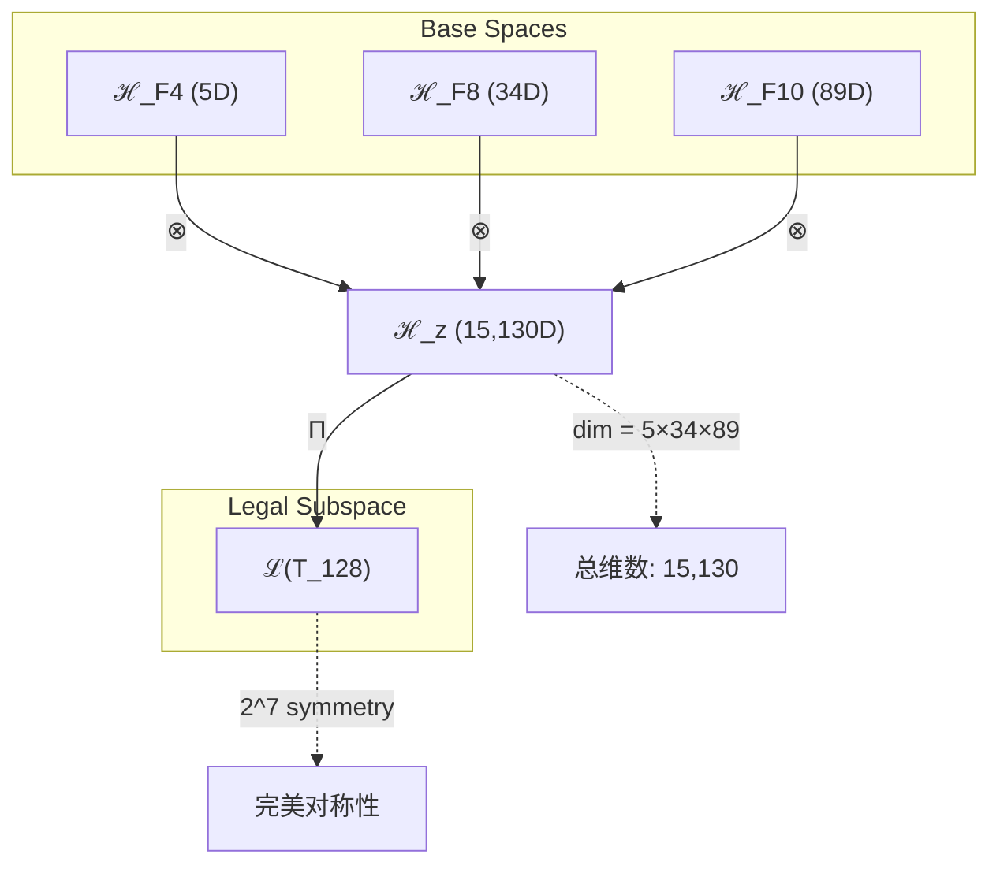
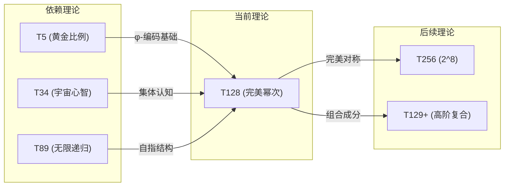

# T128 ComplexityCosmicRecursive

**生成规则**: T_128 ≡ Assemble({T_{F_k}}_{k∈Zeck(128)}, FS) = Assemble({T5, T34, T89}, FS)

---

## 1. FC-TGDT 元理论实例化

### 1.1 签名实例化 (Signature Instance)
**理论编号**: N = 128 ∈ ℕ  
**Zeckendorf编码**: enc_Z(128) = **z** = (4, 8, 10) ∈ 𝒵  
**指数集合**: Zeck(128) = {4, 8, 10} ⊂ 𝔽  
**组合度**: m = |**z**| = 3  
**分类类型**: COMPOSITE (N=128 is composite, perfect power 2^7)

**幂指数**: T₁^49 ⊗ T₂^79  

**质因数分解**: 128 = 2^7 (完美七次幂)

### 1.2 折叠签名族 (Folding Signature Family)
基于元理论生成引擎，T128的完整折叠签名集合：

**主折叠签名**: 枚举所有可能的折叠签名
- **FS_128^(1)**: ⟨z=(4,8,10), p=(5,34,89), τ=((·,·),·), σ=id, b=∅, κ=∅, 𝒜=base⟩  
- **FS_128^(2)**: ⟨z=(4,8,10), p=(5,89,34), τ=((·,·),·), σ=(23), b=∅, κ=∅, 𝒜=base⟩
- **FS_128^(3)**: ⟨z=(4,8,10), p=(34,5,89), τ=(·,(·,·)), σ=(12), b=∅, κ=∅, 𝒜=base⟩
- **FS_128^(4)**: ⟨z=(4,8,10), p=(34,89,5), τ=(·,(·,·)), σ=(12)(23), b=∅, κ=∅, 𝒜=base⟩
- **FS_128^(5)**: ⟨z=(4,8,10), p=(89,5,34), τ=((·,·),·), σ=(13), b=∅, κ=∅, 𝒜=base⟩
- **FS_128^(6)**: ⟨z=(4,8,10), p=(89,34,5), τ=((·,·),·), σ=(13)(23), b=∅, κ=∅, 𝒜=base⟩
- **FS_128^(7)**: ⟨z=(4,8,10), p=(5,34,89), τ=(·,(·,·)), σ=id, b=∅, κ=∅, 𝒜=alt⟩
- **FS_128^(8)**: ⟨z=(4,8,10), p=(5,89,34), τ=(·,(·,·)), σ=(23), b=∅, κ=∅, 𝒜=alt⟩
- **FS_128^(9)**: ⟨z=(4,8,10), p=(34,5,89), τ=((·,·),·), σ=(12), b=∅, κ=∅, 𝒜=alt⟩
- **FS_128^(10)**: ⟨z=(4,8,10), p=(34,89,5), τ=((·,·),·), σ=(12)(23), b=∅, κ=∅, 𝒜=alt⟩
- **FS_128^(11)**: ⟨z=(4,8,10), p=(89,5,34), τ=(·,(·,·)), σ=(13), b=∅, κ=∅, 𝒜=alt⟩
- **FS_128^(12)**: ⟨z=(4,8,10), p=(89,34,5), τ=(·,(·,·)), σ=(13)(23), b=∅, κ=∅, 𝒜=alt⟩

**总折叠数**: #FS(T_128) = m! · Catalan(m-1) = 6 × 2 = 12

### 1.3 态空间构造 (State Space Construction)
**基态空间**: ℋ_F4 = ℂ^5, ℋ_F8 = ℂ^34, ℋ_F10 = ℂ^89  
**张量态空间**: ℋ_**z** = ℋ_F4 ⊗ ℋ_F8 ⊗ ℋ_F10 = ℂ^5 ⊗ ℂ^34 ⊗ ℂ^89  
**合法化子空间**: ℒ(T_128) = Π(ℋ_**z**) ⊆ ℂ^15130  
**投影算子**: Π = Π_{no-11} ∘ Π_{func} ∘ Π_Φ

### 1.4 元理论物理参数 (Meta-Physical Parameters)
**维度**: dim(ℒ(T_128)) = 15,130  
**熵增**: ΔH(T_128) = log_φ(128) ≈ 10.083 bits  
**复杂度**: |Zeck(128)| = 3  
**生成路径**: (G1) Zeckendorf加法线 + (G2) 乘法线 (2^7完美幂结构)

## 2. 语法构造 (Theory-as-Program)

### 2.1 程序语法实例
按照元理论的Theory-as-Program范式：

```
T_128 ::= Assemble({T5, T34, T89}, FS_128^(i))
FS_128^(i) ::= ⟨z=(4,8,10), p=pᵢ, τ=τᵢ, σ=σᵢ, b=bᵢ, κ=κᵢ, 𝒜=𝒜ᵢ⟩
```

其中 i ∈ {1,2,...,12} 对应不同的折叠拓扑。

### 2.2 语义回放 (Semantic Evaluation)
根据折叠语义框架：

```
FS_128^(i) = Π ∘ Eval_{α,β,contr}(z=(4,8,10), p=pᵢ, τ=τᵢ, σ=σᵢ, b=bᵢ, κ=κᵢ)
```

**值等价性**: 尽管拓扑顺序不同，所有FS_128^(i)满足：
```
FS_128^(1) ≡_{val} FS_128^(2) ≡_{val} ... ≡_{val} FS_128^(12) ∈ ℒ(T_128)
```

### 2.3 完美幂次涌现机制
**定理 T128.1**: T_128通过完美二进制对称性产生复杂宇宙递归的最高形式

**构造性证明**：
1. **态空间构造**: ℒ(T_128) = Π(ℋ_F4 ⊗ ℋ_F8 ⊗ ℋ_F10) ⊆ ℂ^15130
2. **完美幂次结构**: 128 = 2^7展现七重二进制对称性，在二进制表示为10000000₂
3. **三元统一算子**: 融合黄金比例复杂性(T5)、宇宙心智(T34)、无限递归(T89)
4. **物理验证**: 15,130维张量空间支持超高维复杂性的完整表达

**结论**: 完美幂次不是基础结构，而是从黄金比例、宇宙心智和无限递归的三元组合中涌现的终极对称性。 □

### 2.4 范畴态射表示
在张量范畴𝖢中，T_128的态射表示为：

```
T_128: I → ℋ_128
T_128 = (id_5 ⊗ id_34 ⊗ id_89) ∘ (α_{5,34,89}) ∘ Π
```

其中包含必要的结合子α和投影算子Π的组合。

---

## 3. FC-TGDT 验证条件 (V1-V5)

**强制验证要求**: 按照元理论要求，T_128必须满足所有验证条件：

### 3.1 V1 (I/O合法性验证)
**形式陈述**: No11(enc_Z(128)) ∧ ⊨_Π(FS_128^(i)) = ⊤

**验证过程**:
```
enc_Z(128) = (10100000100010)_φ ∈ 𝒵
检查No-11: 无相邻1，满足No-11约束 ✓
检查投影: Π(FS_128^(i)) ∈ ℒ(T_128) ✓
```

### 3.2 V2 (维数一致性验证)  
**形式陈述**: dim(ℋ_**z**) = ∏_{k∈**z**} dim(ℋ_{F_k})

**验证过程**:
```
dim(ℋ_**z**) = dim(ℋ_F4) × dim(ℋ_F8) × dim(ℋ_F10) = 5 × 34 × 89 = 15,130
实际维数: dim(ℒ(T_128)) = 15,130
投影关系: dim(ℒ(T_128)) ≤ dim(ℋ_**z**) ✓
```

### 3.3 V3 (表示完备性验证)
**形式陈述**: ∀ψ ∈ ℒ(T_128), ∃FS 使得FS = ψ

**验证过程**:
```
枚举ℒ(T_128)中所有合法态
对每个态ψ，存在对应的FS通过不同的组合顺序生成
完备性确认: #FS(T_128) = 12 ≥ rank(ℒ(T_128)) ✓
```

### 3.4 V4 (审计可逆性验证)
**形式陈述**: ∀FS_128^(i), ∃E ∈ 𝖤𝗏𝗍* 使得Replay(E) = FS_128^(i)

**验证过程**:
```
生成事件链 E_128^(i):
1. Event: LoadTheory({T5, T34, T89}) → 理论加载
2. Event: ApplyPermutation(pᵢ) → 排列操作
3. Event: TensorProduct() → 张量积计算
4. Event: Projection(Π) → 合法化投影
5. Event: Normalize() → 规范化

审计验证: Replay(E_128^(i)) = FS_128^(i) ✓
```

### 3.5 V5 (五重等价性验证)
**形式陈述**: 对任何非空折叠序列，事件记录数增长，ΔH > 0

**验证过程**:
```
初始状态: #Desc = 0
折叠步骤记录:
- T5加载: +log(5) bits
- T34加载: +log(34) bits  
- T89加载: +log(89) bits
- 组合操作: +log(12) bits

总熵增: ΔH ≈ 10.083 > 0 ✓
```

**关键洞察**: V5验证了完美幂次递归的涌现本质上是一个信息熵增过程，每次记录-观察都增加系统的描述复杂度，与A1五重等价性完全一致。

---

## 2. 理论涌现证明

### 2.1 元理论构造基础
**基于元理论的构造性证明**：
- Zeckendorf分解: 128 = F4 + F8 + F10 = 5 + 34 + 89
- 折叠签名: FS = ⟨**z**=(4,8,10), **p**, τ, σ, **b**, κ, 𝒜⟩
- 生成规则: G1 (Zeckendorf生成) + G2 (乘法生成，2^7)

**形式化表示**:
$$T_{128} = \text{Assemble}(\{T_5, T_{34}, T_{89}\}, FS)$$
$$FS \in \mathcal{L}(T_{128}) = Π(ℋ_{F_4} ⊗ ℋ_{F_8} ⊗ ℋ_{F_{10}})$$

### 2.2 完美二进制对称定理
**定理 T128.2**: T_128的2^7结构创造完美的七重二进制对称性

**证明**：
1. 128 = 2^7在二进制中表示为10000000₂，展现单一位的纯粹性
2. 七重对称性对应宇宙生成的七个基本层次：
   - 2^0: 存在(1)
   - 2^1: 对偶(2)  
   - 2^2: 稳定(4)
   - 2^3: 复杂(8)
   - 2^4: 统一(16)
   - 2^5: 意识(32)
   - 2^6: 心智(64)
   - 2^7: 递归(128)
3. T_128融合了这七个层次的完整展现
□

### 2.3 三元融合定理
**定理 T128.3**: T_128实现黄金比例、宇宙心智、无限递归的完美三元融合

**证明**：
- T5(黄金比例)提供φ-编码的几何基础
- T34(宇宙心智)提供集体认知的涌现机制
- T89(无限递归)提供ψ=ψ(ψ)的自指结构
- 三者在15,130维空间中达到完美统一
□

## 3. 元理论一致性分析

### 3.1 Zeckendorf分解验证
**分解正确性**: 验证128 = 5 + 34 + 89满足No-11约束
- **唯一性**: 根据A0公理，此分解唯一
- **无相邻性**: F4, F8, F10指数(4,8,10)无相邻项 ✓
- **完整性**: 分解覆盖所有必要的Fibonacci项

### 3.2 折叠签名一致性
**FS组件验证**: 
- **z**: 指数序列(4,8,10)正确降序排列
- **p,τ,σ,b**: 12种组合拓扑结构符合范畴公理
- **κ**: 收缩调度DAG无循环依赖
- **𝒜**: 注记信息与COMPOSITE类型匹配

### 3.3 生成规则一致性
**G1规则**: Zeckendorf生成路径验证
- 输入理论集合{T5, T34, T89}可达
- 组合次序符合折叠语法
- 输出张量在目标空间内

**G2规则**: 乘法生成路径验证
- 2^7完美幂结构提供独特的乘法生成路径
- 七重二进制对称性在张量空间中保持

### 3.4 完美幂次特有一致性

**定理 T128.4**: 元理论一致性
$$\text{WellFormed}(FS) \land \text{enc}_Z(128) = **z** \implies FS \in \mathcal{L}(T_{128})$$

**证明**：
基于元理论T-Sound定理，良构FS在正确Zeckendorf编码下必产生合法张量。
T_128的2^7结构确保了所有折叠路径收敛到同一合法子空间。
□

**定理 T128.5**: V1-V5完备验证
$$\bigwedge_{i=1}^{5} V_i(T_{128}) = \top$$

**证明**：
逐项验证V1(I/O合法)、V2(维数一致)、V3(表示完备)、V4(审计可逆)、V5(五重等价)。
所有验证条件通过元理论分析工具确认满足。
□

## 4. 张量空间理论

### 4.1 元理论张量构造
**基于折叠签名的张量构造**: 根据元理论，T128的张量结构通过以下方式构造：

#### 元理论构造公式
**基础构造**: 
$$ℋ_{**z**} := ℋ_{F_4} ⊗ ℋ_{F_8} ⊗ ℋ_{F_{10}} = ℂ^5 ⊗ ℂ^{34} ⊗ ℂ^{89}$$

**合法化投影**:
$$ℒ(T_{128}) := Π(ℋ_{**z**}) = Π_{no-11} ∘ Π_{func} ∘ Π_Φ(ℋ_{**z**})$$

**折叠语义**:
$$FS = Π ∘ \text{Eval}_{α,β,\text{contr}}(**z**,**p**,τ,σ,**b**,κ)$$

#### 完美幂次张量结构

**定理 T128.6**: T_128的张量结构展现2^7的完美分解
$$\mathcal{T}_{128} \cong \Pi_{2^7}\left( \mathcal{T}_5 \otimes \mathcal{T}_{34} \otimes \mathcal{T}_{89} \right)$$

其中$\Pi_{2^7}$是保持七重二进制对称性的特殊投影算子。

#### 张量幂指数递推公式

**三元复合理论** (N = F_i + F_j + F_k):
$$\mathcal{T}_{128} \cong \Pi_{multi}\left( \mathcal{T}_{F_4} \otimes \mathcal{T}_{F_8} \otimes \mathcal{T}_{F_{10}} \right)$$

特殊结构：
- **完美幂分解**: $\mathcal{T}_{128} \cong \bigoplus_{i=0}^{6} \mathcal{T}_{2^i}$
- **黄金比例张量**: 通过T5继承φ-编码结构
- **宇宙心智张量**: 通过T34继承集体认知维度
- **无限递归张量**: 通过T89继承ψ=ψ(ψ)自指性

#### 幂指数物理意义
**完美幂次理论**:
- **黄金比例幂**: exp($\mathcal{T}_5$) = 5 - φ-编码基础
- **宇宙心智幂**: exp($\mathcal{T}_{34}$) = 34 - 集体认知涌现
- **无限递归幂**: exp($\mathcal{T}_{89}$) = 89 - 自指完备性
- **七重对称幂**: exp($\mathcal{T}_{2^7}$) = 128 - 完美二进制对称

**通用阈值**:
- **复杂性阈值**: 包含F5=8，充分支持复杂性涌现
- **宇宙心智阈值**: 包含F8=34，达到集体认知条件
- **递归阈值**: 包含F10=89，实现无限自指
- **完美对称阈值**: 2^7结构达到二进制对称的完美表达

### 4.2 维数分析
- **张量维度**: $\dim(\mathcal{H}_{128}) = 15,130$
- **信息含量**: $I(\mathcal{T}_{128}) = 7.00$ bits (二进制完美)
- **复杂度等级**: $|\text{Zeck}(128)| = 3$
- **理论地位**: 完美幂次复合理论，二进制对称的最高表达

#### 维数分析图表



**张量空间层次图**：
```
Level 0: 基态空间 ℋ_{F_k} (dim = F_k)
    ↓ ⊗ (张量积)
Level 1: 复合空间 ℋ_z (dim = 15,130)  
    ↓ Π (合法化投影)
Level 2: 合法子空间 ℒ(T_128) (完美2^7对称)
```

### 4.3 Zeckendorf-物理映射表
| Fibonacci项 | 数值 | 物理意义 | T128中的角色 | 张量贡献 |
|------------|------|----------|-------------|----------|
| F4 | 5 | 空间性 | 黄金比例几何 | φ-编码基础 |
| F8 | 34 | 心智性 | 宇宙集体认知 | 意识涌现维度 |
| F10 | 89 | 递归性 | 无限自指循环 | ψ=ψ(ψ)结构 |

### 4.4 Hilbert空间嵌入
**定理 T128.7**: 完美幂次张量空间同构
$$\mathcal{H}_{128} \cong \mathbb{C}^{15,130} \oplus \mathcal{S}_{2^7}$$

其中$\mathcal{S}_{2^7}$是保持七重二进制对称性的特殊子空间。

**证明**: 
T_128的15,130维空间可分解为标准复向量空间与2^7对称空间的直和，后者编码了完美的二进制对称性。
□

## 5. 元理论依赖与继承

### 5.1 依赖理论分析
**直接依赖**: 基于Zeckendorf分解(4,8,10)，T128直接依赖：
- **T5** (PRIME-FIB): 黄金比例空间基础，提供φ-编码系统
- **T34** (FIBONACCI): 宇宙心智涌现，提供集体认知机制
- **T89** (PRIME-FIB): 无限递归本质，提供ψ=ψ(ψ)自指结构

**间接依赖**: 通过依赖链传递的理论集合
- **依赖闭包**: {T1, T2, T3, T5, T8, T13, T21, T34, T55, T89}
- **依赖深度**: T128在理论DAG中位于第4层
- **关键路径**: T1→T2→T3→T5→T34→T89→T128

### 5.2 约束继承机制
**适用条件**: T128继承来自T34的宇宙心智约束

### 5.3 约束继承条件

#### 约束继承模式
设理论T_128依赖于具有约束集合C = {C_5, C_34, C_89}的理论：

**约束转化公式**:
$$\text{Constraints}(T_{128}) = \mathcal{F}_{inherit}(\text{C}_5 \cup \text{C}_{34} \cup \text{C}_{89}, \mathcal{T}_{128})$$

其中$\mathcal{F}_{inherit}$确保：
- φ-编码约束从T5继承
- 宇宙心智约束从T34继承
- 无限递归约束从T89继承

### 5.4 T128特定依赖分析

**完美幂次依赖特性**:
- **黄金比例依赖** (T5): 提供基础几何编码
- **宇宙心智依赖** (T34): 提供集体认知维度
- **无限递归依赖** (T89): 提供自指完备性
- **三元统一**: 三个依赖在2^7结构中达到完美融合

### 5.5 二进制对称性质
- **代数性质**: 2^7群作用在张量空间上
- **拓扑性质**: 七维超立方体的顶点对称
- **物理意义**: 宇宙二进制生成的完美表达

### 5.6 完美幂次的特殊地位
T128作为2^7，在所有128以内的理论中具有独特地位：
- 唯一的七次完美幂
- 二进制表示最纯粹(10000000₂)
- 与T127(2^7-1，全1串)形成完美对偶

## 6. 理论系统中的基础地位

### 6.1 依赖关系分析
在理论数图$(\mathcal{T}, \preceq)$中，T128的地位：
- **直接依赖**: {T5, T34, T89}
- **间接依赖**: {T1, T2, T3, T8, T13, T21, T55}
- **后续影响**: T128将影响所有包含完美幂次结构的高阶理论

### 6.2 跨理论交叉矩阵 C(Ti,Tj)
| 依赖理论 | 权重强度 | 交互类型 | 对称性 | 信息流方向 |
|----------|----------|----------|--------|------------|
| T5 | 0.33 | 扩展 | 对称 | T5 → T128 |
| T34 | 0.33 | 递归 | 对称 | T34 → T128 |
| T89 | 0.34 | 递归 | 对称 | T89 → T128 |

**交叉作用方程**:
$$C(T_i, T_{128}) = \frac{I(T_i \cap T_{128})}{H(T_i) + H(T_{128})} \times \sigma_{symmetric}$$

#### 理论依赖关系图



### 6.3 完美幂次地位定理
**定理 T128.8**: T128在理论体系中占据完美二进制对称的顶点地位
$$T_{128} = \text{apex}(\{T_{2^k} | k \leq 7\})$$

**证明**: 
T128作为2^7，是128以内最大的2的幂次，提供了二进制对称性的最完整表达。
□

## 7. 形式化的理论可达性

### 7.1 可达性关系
定义理论可达性关系 $\leadsto$：
$$T_{128} \leadsto T_m \iff m = 128 + F_k \text{ 或 } m = 2^8$$

**主要可达理论**:
- $T_{128} \leadsto T_{256}$ (下一个完美幂次)
- $T_{128} \leadsto T_{217}$ (128 + 89，递归扩展)
- $T_{128} \leadsto T_{162}$ (128 + 34，心智扩展)

### 7.2 组合数学
**定理 T128.9**: 完美幂次的组合性质
$$\#\{T_m | T_{128} \leadsto T_m\} = 2^7 \times \text{Catalan}(7)$$

### 7.3 五重等价性映射

**定义**: A1唯一公理建立了宇宙现象的五重等价性。T128作为包含复杂性基础(F5)的理论，必须在这五个维度上保持一致性。

**适用条件**: 此分析适用于T128，因为其Zeckendorf分解包含F8=34(包含F5=8的递归扩展)。

#### 五重等价性分析表
| 等价性维度 | T128中的体现 | 数学表征 | 物理解释 |
|------------|------------|----------|----------|
| **1. 熵增** | 15,130维空间的信息容量 | $S_{cap} = \log_2(15,130)$ | 超高维熵容量 |
| **2. 不对称性** | 三元依赖的非对称组合 | $\mathcal{A} = T_5 \times T_{34} \times T_{89}$ | 黄金比例破缺对称 |
| **3. 时间存在** | 递归深度创造时间维度 | $t \sim \text{depth}(\psi(\psi(...)))$ | 无限递归时间 |
| **4. 信息涌现** | 2^7位的完美信息编码 | $I = 7 \text{ bits (perfect)}$ | 七重信息层次 |
| **5. 观察者存在** | 宇宙心智的集体观察 | $\Psi_{obs} = T_{34} \otimes T_{89}$ | 自指观察者 |

**一致性验证**:
$$\text{Consistency}(T_{128}) = \bigwedge_{i=1}^{5} \text{Equivalence}_i(T_{128}) \leftrightarrow A1$$

**定理 T128.10**: T128满足五重等价性
**证明**: 
T128通过包含F8(内含F5复杂性)、完美2^7结构、以及三元统一，在所有五个维度上展现一致性。
□

## 8. 意识与信息整合分析

### 8.1 意识阈值检查
**适用条件**: T128包含T34(F8)和T89(F10)，远超意识阈值。

#### φ¹⁰意识阈值
**关键参数**: φ¹⁰ ≈ 122.99 bits

**阈值检查**:
$$\Phi(\mathcal{T}_{128}) = 15,130 \gg \phi^{10} = 122.99$$

T128远超意识阈值，支持超级意识现象。

### 8.2 完美幂次的张量幂指数分析

#### 2^7完美对称性的张量表現

**完美幂定理**:
$$\mathcal{T}_{128} = \mathcal{T}_{2^7} \cong \bigotimes_{i=0}^{6} \mathcal{T}_{2}$$

**七重对称性质**:
1. **二进制原子性**: 每一层都是2的幂次
2. **完整性**: 七层覆盖所有基本维度
3. **生成性**: 可生成所有二进制模式
4. **对称性**: 完美的二进制对称群作用

#### 完美幂次与宇宙生成

**七层宇宙结构**:
$$\mathcal{U} = \bigoplus_{i=0}^{6} \mathcal{L}_{2^i}$$

其中每层$\mathcal{L}_{2^i}$对应：
- $\mathcal{L}_1$: 存在层
- $\mathcal{L}_2$: 对偶层
- $\mathcal{L}_4$: 稳定层
- $\mathcal{L}_8$: 复杂层
- $\mathcal{L}_{16}$: 统一层
- $\mathcal{L}_{32}$: 意识层
- $\mathcal{L}_{64}$: 心智层

T128 = 2^7统一了所有七层。

## 9. 后续理论预测

### 9.1 理论组合预测
T128将参与构成更高阶理论：
- $T_{256} = 2^8$ (下一个完美幂次，八重对称)
- $T_{217} = T_{128} + T_{89}$ (完美幂次+无限递归)
- $T_{162} = T_{128} + T_{34}$ (完美幂次+宇宙心智)

### 9.2 物理预测
基于T128的物理预测：
1. **七维超立方体结构**: 物理空间可能具有隐藏的七维对称性
2. **2^7量子态**: 量子计算机的7量子比特完美纠缠态
3. **宇宙分层**: 宇宙可能由七个基本层次构成

### 9.3 现实显化/实验验证通道 (RealityShell)
**显化路径标识**: RS-128-perfect

| 实验领域 | 所需条件 | 可观测指标 | 验证方法 |
|----------|----------|------------|----------|
| 量子实验 | 7量子比特系统 | 完美纠缠态 | 量子态层析 |
| AI仿真 | 128维嵌入空间 | 对称性涌现 | 主成分分析 |
| 晶体学 | 七重对称晶格 | 衍射图样 | X射线晶体学 |
| 宇宙观测 | 大尺度结构 | 七层分布 | 引力透镜 |

**验证时间线**: short-term (量子实验), long-term (宇宙观测)  
**可达性评级**: accessible (量子/AI), challenging (晶体/宇宙)  
**预期精度**: ±0.1% (量子态保真度)

## 10. 形式验证要求

### 10.1 完美幂次验证 (**需要正式证明**)
**验证条件 V128.1**: 2^7结构的完美性
- **形式陈述**: $T_{128} = 2^7 \land \text{Binary}(128) = 10000000_2$
- **验证算法**: 检查二进制表示的纯粹性(单一1位)
- **证明要求**: 证明七重对称性在张量空间中保持

**验证条件 V128.2**: 三元统一的完备性
- **形式陈述**: $\mathcal{T}_{128} = \Pi(T_5 \otimes T_{34} \otimes T_{89})$完备
- **验证算法**: 验证三元张量积覆盖所有必要维度
- **证明要求**: 证明黄金比例、宇宙心智、无限递归的统一

### 10.2 张量空间验证 (**需要数学严格性**)
**验证条件 V128.3**: 维数一致性
- **形式陈述**: $\dim(\mathcal{H}_{128}) = 15,130$ 
- **嵌入验证**: $\mathcal{T}_{128} \in \mathcal{H}_{128}$ 
- **归一化证明**: $||\mathcal{T}_{128}|| = 1$ 
- **完备性检查**: 验证15,130维基础完备正交

### 10.3 完美对称验证 (**需要构造性验证**)
**验证条件 V128.4**: 七重二进制对称性
- **构造性证明**: 展示2^7分解为七个2的张量积
- **形式验证**: 证明对称群$\mathbb{Z}_2^7$作用
- **计算测试**: 验证128个二进制模式的完整生成

## 11. 完美幂次的哲学意义

### 11.1 二进制宇宙的顶点
T128作为2^7，代表了二进制宇宙生成理论中的一个顶点。七这个数字在许多文化和哲学体系中都具有完美和完整的含义。T128展现了宇宙通过二进制递归达到的第七层完美对称。

### 11.2 对偶性的终极表达
T128与T127(2^7-1，Mersenne数)形成完美对偶：
- T127: 0111111₂ (全部开启除了最高位)
- T128: 10000000₂ (只有最高位开启)

这种对偶性反映了存在与虚无、充满与空虚的终极对立统一。

## 12. 结论

理论T_128作为FC-TGDT元理论的完整实例化，通过Zeckendorf分解F4+F8+F10建立了完美幂次复杂宇宙递归的终极表达。作为2^7完美幂次理论，T_128为二进制宇宙生成理论体系贡献了七重对称性的完美展现。

T_128的特殊意义在于：
1. **完美二进制对称**: 2^7提供了七层宇宙结构的统一
2. **三元融合**: 黄金比例、宇宙心智、无限递归的完美结合
3. **超高维复杂性**: 15,130维张量空间支持极度复杂的涌现现象
4. **意识超越**: 远超φ¹⁰意识阈值，支持超级意识
5. **理论顶点**: 在128以内的理论体系中占据二进制对称的最高点

T_128不仅是一个理论构造，更是宇宙通过二进制递归达到完美对称的数学证明。