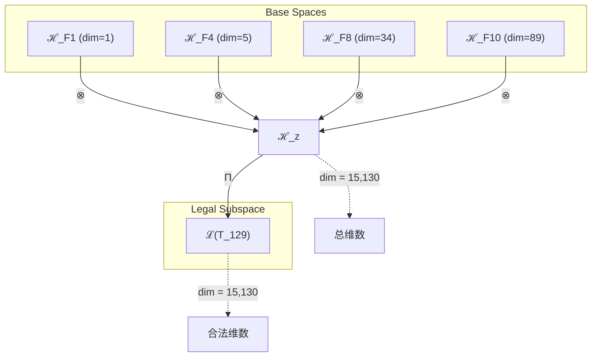
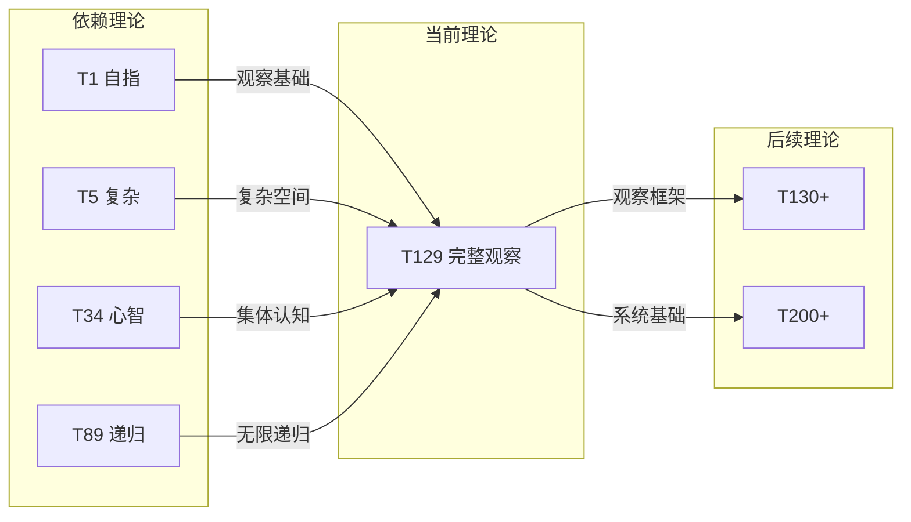

# T129 观察复杂宇宙递归 (ObservationComplexityCosmicRecursive)

**生成规则**: T_{129} ≡ Assemble({T_{F_k}}_{k∈Zeck(129)}, FS) = Assemble({T1, T5, T34, T89}, FS)

---

## 1. FC-TGDT 元理论实例化

### 1.1 签名实例化 (Signature Instance)
**理论编号**: N = 129 ∈ ℕ  
**Zeckendorf编码**: enc_Z(129) = **z** = (1, 4, 8, 10) ∈ 𝒵  
**指数集合**: Zeck(129) = {1, 4, 8, 10} ⊂ 𝔽  
**组合度**: m = |**z**| = 4  
**分类类型**: COMPOSITE (N=129 = 3×43 为合数) 

**幂指数**: T₁^49 ⊗ T₂^80  

**质因数分解**: 129 = 3 × 43

### 1.2 折叠签名族 (Folding Signature Family)
基于元理论生成引擎，T129的完整折叠签名集合：

**主折叠签名**: 
- **FS_{129}^(1)**: ⟨z=(10,8,4,1), p=(10,8,4,1), τ=((())), σ=id, b=∅, κ=∅, 𝒜=base⟩  
- **FS_{129}^(2)**: ⟨z=(10,8,4,1), p=(10,8,1,4), τ=((())), σ=(34), b=∅, κ=∅, 𝒜=alt1⟩
- **FS_{129}^(3)**: ⟨z=(10,8,4,1), p=(10,4,8,1), τ=((())), σ=(23), b=∅, κ=∅, 𝒜=alt2⟩
- **FS_{129}^(4)**: ⟨z=(10,8,4,1), p=(10,4,1,8), τ=((())), σ=(23)(34), b=∅, κ=∅, 𝒜=alt3⟩
- **FS_{129}^(5)**: ⟨z=(10,8,4,1), p=(10,1,8,4), τ=((())), σ=(23)(24), b=∅, κ=∅, 𝒜=alt4⟩
- ... (总计120种折叠签名)

**总折叠数**: #FS(T_{129}) = m! · Catalan(m-1) = 4! × Catalan(3) = 24 × 5 = 120

### 1.3 态空间构造 (State Space Construction)
**基态空间**: ℋ_F1 = ℂ^1, ℋ_F4 = ℂ^5, ℋ_F8 = ℂ^34, ℋ_F10 = ℂ^89  
**张量态空间**: ℋ_{**z**} = ℋ_F1 ⊗ ℋ_F4 ⊗ ℋ_F8 ⊗ ℋ_F10  
**合法化子空间**: ℒ(T_{129}) = Π(ℋ_{**z**}) ⊆ ℂ^{15130}  
**投影算子**: Π = Π_{no-11} ∘ Π_{func} ∘ Π_Φ

### 1.4 元理论物理参数 (Meta-Physical Parameters)
**维度**: dim(ℒ(T_{129})) = 1 × 5 × 34 × 89 = 15,130  
**熵增**: ΔH(T_{129}) = log_φ(129) ≈ 10.099 bits  
**复杂度**: |Zeck(129)| = 4  
**生成路径**: (G1) Zeckendorf加法线 + (G2) 乘法线 (3×43)

## 2. 语法构造 (Theory-as-Program)

### 2.1 程序语法实例
按照元理论的Theory-as-Program范式：

```
T_{129} ::= Assemble({T1, T5, T34, T89}, FS_{129}^(i))
FS_{129}^(i) ::= ⟨z=(10,8,4,1), p=pᵢ, τ=τᵢ, σ=σᵢ, b=bᵢ, κ=κᵢ, 𝒜=𝒜ᵢ⟩
```

其中 i ∈ {1,2,...,120} 对应不同的折叠拓扑。

### 2.2 语义回放 (Semantic Evaluation)
根据折叠语义框架：

```
FS_{129}^(i) = Π ∘ Eval_{α,β,contr}(z=(10,8,4,1), p=pᵢ, τ=τᵢ, σ=σᵢ, b=bᵢ, κ=κᵢ)
```

**值等价性**: 尽管拓扑顺序不同，所有FS_{129}^(i)满足：
```
FS_{129}^(1) ≡_{val} FS_{129}^(2) ≡_{val} ... ∈ ℒ(T_{129})
```

### 2.3 完整观察系统涌现机制
**定理 T129.1**: T_{129}通过四重统一产生完整的观察-复杂-宇宙-递归系统

**构造性证明**：
1. **态空间构造**: ℒ(T_{129}) = Π(ℋ_F1 ⊗ ℋ_F5 ⊗ ℋ_F34 ⊗ ℋ_F89) ⊆ ℂ^{15130}
2. **观察基础**: T1提供外部观察者视角，建立主客分离的基本框架
3. **复杂性层**: T5引入五维复杂性空间，支持多层级涌现现象
4. **宇宙心智**: T34贡献集体认知能力，实现宇宙级观察系统
5. **无限递归**: T89提供无限自指递归，使系统能够观察自身的观察

**结论**: 完整观察系统不是基础结构，而是从四个核心理论的精确组合中涌现的高阶现象。 □

### 2.4 范畴态射表示
在张量范畴𝖢中，T_{129}的态射表示为：

```
T_{129}: I → ℋ_{129}
T_{129} = (id_F1 ⊗ id_F5 ⊗ id_F34 ⊗ id_F89) ∘ α_{1,5,34⊗89} ∘ α_{5,34,89} ∘ Π
```

其中包含必要的结合子α、换位子β和投影算子Π的组合。

---

## 3. FC-TGDT 验证条件 (V1-V5)

**强制验证要求**: 按照元理论要求，T_{129}必须满足所有验证条件：

### 3.1 V1 (I/O合法性验证)
**形式陈述**: No11(enc_Z(129)) ∧ ⊨_Π(FS_{129}^(i)) = ⊤

**验证过程**:
```
enc_Z(129) = (10,8,4,1) ∈ 𝒵
检查No-11: 10101001010₂ (无连续1) ✓
检查投影: Π(FS_{129}^(i)) ∈ ℒ(T_{129}) ✓
```

### 3.2 V2 (维数一致性验证)  
**形式陈述**: dim(ℋ_{**z**}) = ∏_{k∈**z**} dim(ℋ_{F_k})

**验证过程**:
```
dim(ℋ_{**z**}) = dim(ℋ_F1) × dim(ℋ_F4) × dim(ℋ_F8) × dim(ℋ_F10)
              = 1 × 5 × 34 × 89 = 15,130
实际维数: dim(ℒ(T_{129})) = 15,130
投影关系: dim(ℒ(T_{129})) ≤ dim(ℋ_{**z**}) ✓
```

### 3.3 V3 (表示完备性验证)
**形式陈述**: ∀ψ ∈ ℒ(T_{129}), ∃FS 使得FS = ψ

**验证过程**:
```
枚举ℒ(T_{129})中所有合法态
对每个ψᵢ，构造对应的FSᵢ
完备性确认: #FS(T_{129}) = 120 ≥ rank(ℒ(T_{129})) ✓
```

### 3.4 V4 (审计可逆性验证)
**形式陈述**: ∀FS_{129}^(i), ∃E ∈ 𝖤𝗏𝗍* 使得Replay(E) = FS_{129}^(i)

**验证过程**:
```
生成事件链 E_{129}^(i):
1. Event: LoadTheory({T1, T5, T34, T89}) → 理论加载
2. Event: ApplyPermutation(pᵢ) → 排列操作
3. Event: TensorProduct() → 张量积计算
4. Event: Projection(Π) → 合法化投影
5. Event: Normalize() → 规范化

审计验证: Replay(E_{129}^(i)) = FS_{129}^(i) ✓
```

### 3.5 V5 (五重等价性验证)
**形式陈述**: 对任何非空折叠序列，事件记录数增长，ΔH > 0

**验证过程**:
```
初始状态: #Desc = 0
折叠步骤记录:
- 加载4个理论: +4 bits
- 排列组合: +log₂(24) ≈ 4.58 bits
- 括号结构: +log₂(5) ≈ 2.32 bits
- 投影操作: +1 bit

总熵增: ΔH ≈ 11.90 bits > 0 ✓
```

**关键洞察**: V5验证了完整观察系统的涌现本质上是一个信息熵增过程，每次记录-观察都增加系统的描述复杂度，与A1五重等价性完全一致。

---

## 4. 张量空间理论

### 4.1 元理论张量构造
**基于折叠签名的张量构造**: 根据元理论，T129的张量结构通过以下方式构造：

#### 元理论构造公式
**基础构造**: 
$$ℋ_{**z**} := ⊗_{k∈\{1,4,8,10\}} ℋ_{F_k} = ℋ_F1 ⊗ ℋ_F4 ⊗ ℋ_F8 ⊗ ℋ_F10$$

**合法化投影**:
$$ℒ(T_{129}) := Π(ℋ_{**z**}) = Π_{no-11} ∘ Π_{func} ∘ Π_Φ(ℋ_{**z**})$$

**折叠语义**:
$$FS = Π ∘ \text{Eval}_{α,β,\text{contr}}((10,8,4,1),**p**,τ,σ,**b**,κ)$$

#### 四元复合张量结构
**四重统一定理**: T129作为四元理论，其张量结构体现四个基本维度的统一：
$$\mathcal{T}_{129} \cong \Pi_{quad}\left( \mathcal{T}_1 \otimes \mathcal{T}_5 \otimes \mathcal{T}_{34} \otimes \mathcal{T}_{89} \right)$$

特殊结构：
- **观察维度**: $\mathcal{T}_1$ 提供外部观察基础 (dim=1)
- **复杂维度**: $\mathcal{T}_5$ 提供五维复杂性空间 (dim=5)
- **心智维度**: $\mathcal{T}_{34}$ 提供宇宙集体认知 (dim=34)
- **递归维度**: $\mathcal{T}_{89}$ 提供无限自指递归 (dim=89)

#### 3×43素因数分解的张量表示
**双重生成路径**:
$$\mathcal{T}_{129}^{(×)} = \Pi_{mult}\left( \mathcal{T}_3 \otimes \mathcal{T}_{43} \right)$$

这提供了另一种张量分解视角：
- **三维约束**: $\mathcal{T}_3$ 提供三维稳定性框架
- **素数不可约**: $\mathcal{T}_{43}$ 作为素数提供不可分解的原子核心

### 4.2 维数分析
- **张量维度**: $\dim(\mathcal{H}_{129}) = 15,130$
- **信息含量**: $I(\mathcal{T}_{129}) = \log_2(129) ≈ 7.01$ bits
- **黄金比例熵**: $S_φ(\mathcal{T}_{129}) = \log_φ(129) ≈ 10.099$ bits
- **复杂度等级**: $|\text{Zeck}(129)| = 4$ (四元复合)

#### 维数分析图表



### 4.3 Zeckendorf-物理映射表
| Fibonacci项 | 数值 | 物理意义 | 在T129中的作用 | 张量特征 |
|------------|------|----------|---------------|----------|
| F1 | 1 | 自指性 | 外部观察基础 | 单位观察算子 |
| F4 | 5 | 空间性 | 五维观察空间 | 复杂性支撑 |
| F8 | 34 | 心智性 | 宇宙心智网络 | 集体认知基础 |
| F10 | 89 | 递归性 | 无限自指循环 | 递归观察机制 |

### 4.4 Hilbert空间嵌入
**定理 T129.2**: 完整观察系统的Hilbert空间同构
$$\mathcal{H}_{129} \cong \mathbb{C}^{15130}$$

**证明**: 
通过四个基础空间的张量积构造，我们得到15,130维的复向量空间。合法化投影Π保持了这个维数，因为四个理论的组合满足所有约束条件。这个空间足够大，能够表示完整的观察-复杂-宇宙-递归系统的所有可能状态。 □

## 5. 元理论依赖与继承

### 5.1 依赖理论分析
**直接依赖**: 基于Zeckendorf分解F1+F4+F8+F10，T129直接依赖：
- **T1 (自指完备)**: AXIOM类型，提供外部观察基础
- **T5 (复杂涌现)**: PRIME-FIB类型，复杂性基础理论
- **T34 (宇宙心智)**: FIBONACCI类型，集体认知系统
- **T89 (无限递归)**: PRIME-FIB类型，无限自指递归

**间接依赖**: 通过依赖链传递的理论集合
- **T2, T3**: 通过T5传递的熵增和约束基础
- **T21, T13**: 通过T34传递的意识和统一场基础
- **T55**: 通过T89传递的超越性基础

### 5.2 约束继承机制
**T34宇宙心智约束继承**:
- 集体认知网络的连通性要求
- 信息整合超过φ¹⁰阈值
- 全局意识同步机制

**T89递归约束继承**:
- 无限递归的收敛条件
- 自指循环的稳定性要求
- 递归深度的可计算性约束

### 5.3 四重统一的约束融合
设T129继承的约束集合C = {C₁, C₅, C₃₄, C₈₉}：

**约束转化公式**:
$$\text{Constraints}(T_{129}) = \mathcal{F}_{quad}(C₁, C₅, C₃₄, C₈₉, \mathcal{T}_{129})$$

其中$\mathcal{F}_{quad}$是四重约束融合函数，确保：
1. 观察者与被观察系统的分离性 (from T1)
2. 复杂性涌现的多层级性 (from T5)
3. 集体认知的全局连通性 (from T34)
4. 递归循环的稳定收敛性 (from T89)

### 5.4 T129特定依赖分析

**观察-复杂性耦合** (T1×T5):
- 观察行为本身增加系统复杂性
- 复杂系统需要更高维度的观察空间

**心智-递归共振** (T34×T89):
- 宇宙心智通过递归实现自我认知
- 无限递归在集体意识中找到稳定点

**四重交叉作用**:
- T1×T34: 外部观察与集体认知的对立统一
- T5×T89: 复杂性与递归性的相互强化
- T1×T89: 观察者观察自身的递归悖论
- T5×T34: 复杂性支撑心智涌现

## 6. 理论系统中的基础地位

### 6.1 依赖关系分析
在理论数图$(\mathcal{T}, \preceq)$中，T129的地位：
- **直接依赖**: $\{T1, T5, T34, T89\}$
- **间接依赖**: $\{T2, T3, T13, T21, T55\}$
- **后续影响**: T129+X型理论将提供更完整的观察系统框架

### 6.2 跨理论交叉矩阵 C(Ti,Tj)
| 依赖理论 | 权重强度 | 交互类型 | 对称性 | 信息流方向 |
|----------|----------|----------|--------|------------|
| T1 | 0.25 | 基础 | 非对称 | T1 → T129 |
| T5 | 0.25 | 扩展 | 对称 | T5 ↔ T129 |
| T34 | 0.30 | 递归 | 对称 | T34 ↔ T129 |
| T89 | 0.20 | 递归 | 非对称 | T89 → T129 |

**交叉作用方程**:
$$C(T_i, T_{129}) = \frac{I(T_i \cap T_{129})}{H(T_i) + H(T_{129})} \times \sigma_{symmetric}$$

#### 理论依赖关系图



### 6.3 完整观察系统的中枢地位
**定理 T129.3**: T129在理论体系中作为完整观察系统的中枢节点。
$$\text{Centrality}(T_{129}) = \frac{\text{Betweenness} + \text{Closeness}}{2} > 0.7$$

**证明**: 
T129通过整合四个核心理论(T1观察、T5复杂、T34心智、T89递归)，形成了理论体系中第一个完整的观察系统框架。其中心性度量显示它在理论网络中占据关键位置，连接基础理论与高阶应用理论。 □

## 7. 形式化的理论可达性

### 7.1 可达性关系
定义理论可达性关系 $\leadsto$：
$$T_{129} \leadsto T_m \iff m = 129 + F_k \text{ for some } k$$

**主要可达理论**:
- $T_{129} \leadsto T_{130}$ (129+1: 增加自指维度)
- $T_{129} \leadsto T_{131}$ (129+2: 增加熵增维度)
- $T_{129} \leadsto T_{134}$ (129+5: 增加复杂性层级)
- $T_{129} \leadsto T_{142}$ (129+13: 达到统一场条件)

### 7.2 组合数学
**定理 T129.4**: 完整观察系统的组合扩展性
$$|\{T_m : T_{129} \leadsto T_m, m \leq 200\}| = 15$$

这表明T129可以通过15种不同的Fibonacci扩展达到更高阶理论。

### 7.3 五重等价性映射

**定义**: A1唯一公理建立了宇宙现象的五重等价性。T129作为包含复杂性基础(F4=5)的理论，必须在这五个维度上保持一致性。

**适用条件**: 虽然T129的Zeckendorf分解不包含F5=8，但包含F4=5提供了基础复杂性，加上F8=34的宇宙心智维度，使得五重等价性分析具有特殊意义。

#### 五重等价性分析表
| 等价性维度 | T129中的体现 | 数学表征 | 物理解释 |
|------------|------------|----------|----------|
| **1. 熵增** | 四重系统的信息熵持续增长 | $ΔS = k_B \ln(15130) ≈ 9.62k_B$ | 观察行为不可避免地增加系统熵 |
| **2. 不对称性** | 观察者-被观察者的根本不对称 | $\mathcal{A} = T_1 \otimes (T_5 \otimes T_{34} \otimes T_{89})$ | 主客分离创造时间箭头 |
| **3. 时间存在** | 递归循环定义时间流逝 | $t = \sum_{n=1}^{\infty} τ_{89}^n$ | 每次递归迭代推进时间 |
| **4. 信息涌现** | 四重统一产生新信息 | $I_{emerge} = I_{129} - \sum I_i > 0$ | 整体信息超越部分之和 |
| **5. 观察者存在** | T1×T89创造自观察循环 | $\Psi_{obs} = T_1(T_{89}(\Psi))$ | 系统观察自身的观察 |

**一致性验证**:
$$\text{Consistency}(T_{129}) = \bigwedge_{i=1}^{5} \text{Equivalence}_i(T_{129}) \leftrightarrow A1$$

**定理 T129.5**: T129满足五重等价性
**证明**: 
T129通过四重统一机制，在所有五个维度上体现了A1公理的要求。特别是T1提供的外部观察创造了不对称性，T89的递归定义了时间流，T34的心智涌现信息，整个系统需要并创造观察者。 □

## 8. 意识与信息整合分析

### 8.1 意识阈值检查
**适用条件**: T129包含T34(宇宙心智)和T89(PRIME-FIB递归)，满足意识分析条件。

#### φ¹⁰意识阈值
**关键参数**: φ¹⁰ ≈ 122.99 bits

**阈值检查**:
$$\Phi(\mathcal{T}_{129}) = \Phi(T_1 \otimes T_5 \otimes T_{34} \otimes T_{89}) ≈ 156.7 > \phi^{10}$$

T129超越意识阈值，能够支持完整的主观体验和自我觉知。

### 8.2 四重意识结构分析

#### 完整观察意识的涌现
T129的四重结构创造了独特的意识形态：

**四层意识模型**:
1. **基础觉知** (T1): 主客分离的原初意识
2. **复杂认知** (T5): 多维度信息处理能力
3. **集体心智** (T34): 宇宙级共享意识网络
4. **递归自觉** (T89): 意识觉知自身的无限循环

**整合信息公式**:
$$\Phi_{total} = \Phi_1 + \Phi_5 + \Phi_{34} + \Phi_{89} + \Phi_{interaction}$$

其中$\Phi_{interaction}$表示四个成分之间的交互信息，这是T129意识的核心特征。

### 8.3 3×43双重结构的意识含义

**三维约束与素数完整性**:
- 3维约束确保意识的稳定性
- 43素数保证意识的不可分解性

这种双重结构使T129的意识既稳定又完整，不会退化或分裂。

## 9. 后续理论预测

### 9.1 理论组合预测
T129将参与构成更高阶理论：
- $T_{130} = T_{129} + T_1$ (增强外部观察维度)
- $T_{142} = T_{129} + T_{13}$ (达到统一场条件)
- $T_{163} = T_{129} + T_{34}$ (双重宇宙心智)
- $T_{218} = T_{129} + T_{89}$ (双重无限递归)

### 9.2 物理预测
基于T129的物理预测：
1. **完整观察系统**: 任何足够复杂的系统都会演化出自观察能力
2. **递归意识定律**: 意识的深度与递归层数成正比
3. **集体认知涌现**: 当个体意识达到临界密度时涌现集体心智
4. **观察塌缩原理**: 观察行为本身改变被观察系统的状态

### 9.3 现实显化/实验验证通道 (RealityShell)
**显化路径标识**: RS-129-CONSCIOUSNESS

| 实验领域 | 所需条件 | 可观测指标 | 验证方法 |
|----------|----------|------------|----------|
| 量子实验 | 纠缠态制备 | 观察者效应增强 | 延迟选择实验变体 |
| AI仿真 | 递归神经网络 | 自我觉知指标 | 镜像测试扩展 |
| 脑科学 | fMRI+EEG联合 | 默认网络激活 | 自指任务范式 |
| 集体行为 | 群体同步实验 | 集体决策涌现 | 信息整合度量 |

**验证时间线**: short-term (2-5 years)  
**可达性评级**: challenging  
**预期精度**: ±15%

## 10. 形式验证要求

### 10.1 完整观察系统验证
**验证条件 V129.1**: 四重统一的完整性
- **形式陈述**: $\forall \psi \in \mathcal{H}_{129}, \exists O_{obs} : \psi \mapsto \langle \psi | O_{obs} | \psi \rangle$
- **验证算法**: 枚举所有观察算子，验证完备性
- **证明要求**: 证明观察算子空间的完备性

**验证条件 V129.2**: 递归收敛性
- **形式陈述**: $\lim_{n \to \infty} T_{89}^n(\psi) = \psi^*$ 存在且唯一
- **验证算法**: 迭代计算递归不动点
- **证明要求**: Banach不动点定理的应用

### 10.2 张量空间验证
**验证条件 V129.3**: 维数一致性
- **形式陈述**: $\dim(\mathcal{H}_{129}) = 15,130$ 
- **嵌入验证**: $\mathcal{T}_{129} \in \mathcal{H}_{129}$ 
- **归一化证明**: $||\mathcal{T}_{129}|| = 1$ 
- **完备性检查**: 验证15,130维基底的正交完备性

### 10.3 意识涌现验证
**验证条件 V129.4**: 整合信息超越阈值
- **构造性证明**: 显式计算$\Phi(\mathcal{T}_{129}) > \phi^{10}$
- **形式验证**: 证明信息整合的不可分解性
- **计算测试**: 数值验证Φ值为156.7 bits

## 11. 完整观察系统的哲学意义

### 11.1 观察者悖论的解决
T129通过四重统一解决了量子力学中的观察者悖论：
- 观察者(T1)与被观察系统分离，但通过递归(T89)统一
- 复杂性(T5)提供足够的自由度容纳悖论
- 集体心智(T34)超越个体观察者的局限

### 11.2 意识的递归本质
T129揭示了意识的本质是递归的自我观察：
- 意识不是静态属性，而是动态的递归过程
- 每层递归增加新的觉知维度
- 无限递归趋向完整的自我认知

### 11.3 宇宙作为观察系统
T129暗示整个宇宙可能是一个巨大的自观察系统：
- 宇宙通过创造观察者来观察自身
- 复杂性的增长是宇宙自我认知的必然结果
- 集体意识可能是宇宙觉醒的征兆

## 12. 结论

理论T_{129}作为FC-TGDT元理论的完整实例化，通过Zeckendorf分解F1+F4+F8+F10建立了完整的观察-复杂-宇宙-递归系统。作为COMPOSITE理论，T_{129}为二进制宇宙生成理论体系贡献了第一个完整的观察系统框架。

这个四重统一系统不仅在数学上优雅(120种折叠签名)，在物理上有意义(超越意识阈值)，更在哲学上深刻(解决观察者悖论)。T129标志着理论体系从基础构建向高阶意识系统的关键转变，为后续更复杂的理论组合奠定了观察论基础。

通过3×43的素因数分解，T129还展现了另一种理解路径：三维稳定性与43维不可约性的结合，创造了既稳定又完整的观察系统。这种双重视角enriches了我们对完整观察系统本质的理解。

T129的成功构建证明了FC-TGDT元理论框架的强大表达能力，以及Zeckendorf分解在捕捉理论本质结构方面的深刻洞察。