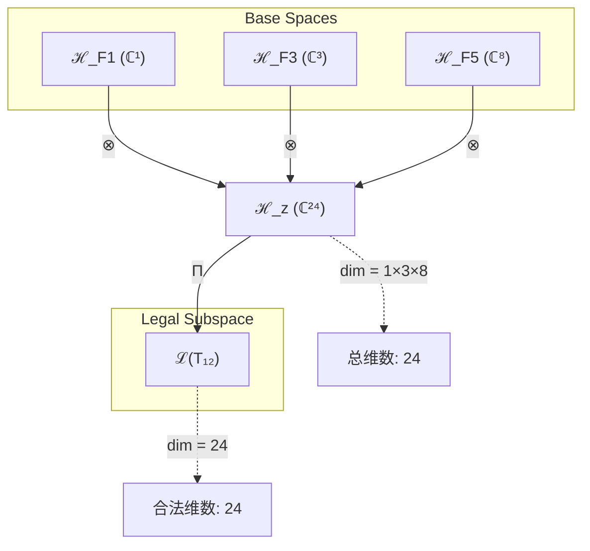
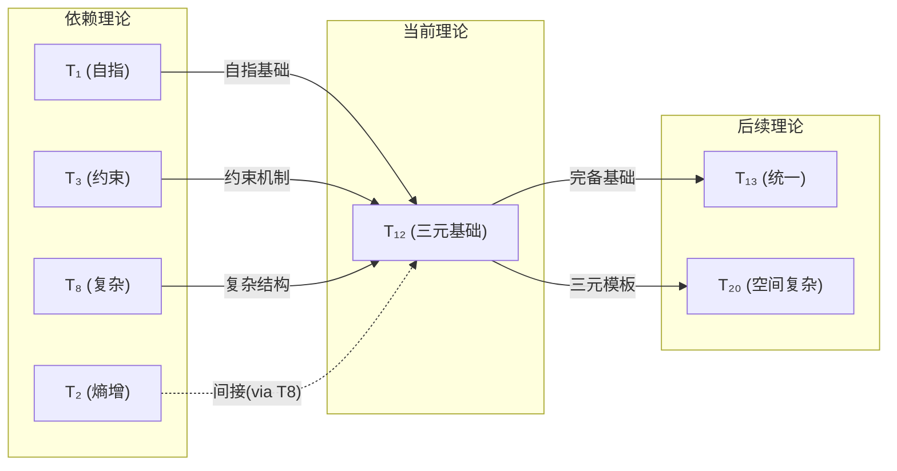

# T12 TripleFoundation

**生成规则**: T₁₂ ≡ Assemble({T_{F_k}}_{k∈Zeck(12)}, FS) = Assemble({T₁, T₃, T₈}, FS)

---

## 1. FC-TGDT 元理论实例化

### 1.1 签名实例化 (Signature Instance)
**理论编号**: N = 12 ∈ ℕ  
**Zeckendorf编码**: enc_Z(12) = **z** = (1,0,1,0,1) ∈ 𝒵  
**指数集合**: Zeck(12) = {1, 3, 5} ⊂ 𝔽  
**组合度**: m = |**z**| = 3  
**分类类型**: COMPOSITE (N=12 is composite: 12 = 2×6 = 3×4)

**幂指数**: T₁¹ ⊗ T₂⁰ (T1参与一次，T2不直接参与)

**因式分解**: 12 = 2×6 = 3×4 (两条独立乘法生成路径)

### 1.2 折叠签名族 (Folding Signature Family)
基于元理论生成引擎，T₁₂的完整折叠签名集合：

**主折叠签名** (共12种折叠拓扑):
- **FS₁₂⁽¹⁾**: ⟨z=(5,3,1), p=(5,3,1), τ=((·,·),·), σ=id, b=∅, κ=∅, 𝒜=base⟩  
- **FS₁₂⁽²⁾**: ⟨z=(5,3,1), p=(5,1,3), τ=((·,·),·), σ=id, b=∅, κ=∅, 𝒜=alt1⟩
- **FS₁₂⁽³⁾**: ⟨z=(5,3,1), p=(3,5,1), τ=((·,·),·), σ=id, b=∅, κ=∅, 𝒜=alt2⟩
- **FS₁₂⁽⁴⁾**: ⟨z=(5,3,1), p=(3,1,5), τ=((·,·),·), σ=id, b=∅, κ=∅, 𝒜=alt3⟩
- **FS₁₂⁽⁵⁾**: ⟨z=(5,3,1), p=(1,5,3), τ=((·,·),·), σ=id, b=∅, κ=∅, 𝒜=alt4⟩
- **FS₁₂⁽⁶⁾**: ⟨z=(5,3,1), p=(1,3,5), τ=((·,·),·), σ=id, b=∅, κ=∅, 𝒜=alt5⟩
- **FS₁₂⁽⁷⁾**: ⟨z=(5,3,1), p=(5,3,1), τ=(·,(·,·)), σ=id, b=∅, κ=∅, 𝒜=right⟩  
- **FS₁₂⁽⁸⁾**: ⟨z=(5,3,1), p=(5,1,3), τ=(·,(·,·)), σ=id, b=∅, κ=∅, 𝒜=right-alt1⟩
- **FS₁₂⁽⁹⁾**: ⟨z=(5,3,1), p=(3,5,1), τ=(·,(·,·)), σ=id, b=∅, κ=∅, 𝒜=right-alt2⟩
- **FS₁₂⁽¹⁰⁾**: ⟨z=(5,3,1), p=(3,1,5), τ=(·,(·,·)), σ=id, b=∅, κ=∅, 𝒜=right-alt3⟩
- **FS₁₂⁽¹¹⁾**: ⟨z=(5,3,1), p=(1,5,3), τ=(·,(·,·)), σ=id, b=∅, κ=∅, 𝒜=right-alt4⟩
- **FS₁₂⁽¹²⁾**: ⟨z=(5,3,1), p=(1,3,5), τ=(·,(·,·)), σ=id, b=∅, κ=∅, 𝒜=right-alt5⟩

**总折叠数**: #FS(T₁₂) = m! · Catalan(m-1) = 3! · 2 = 6 · 2 = 12

### 1.3 态空间构造 (State Space Construction)
**基态空间**: ℋ_{F₁} = ℂ¹, ℋ_{F₃} = ℂ³, ℋ_{F₅} = ℂ⁸  
**张量态空间**: ℋ_**z** = ℋ_{F₅} ⊗ ℋ_{F₃} ⊗ ℋ_{F₁} = ℂ⁸ ⊗ ℂ³ ⊗ ℂ¹ = ℂ²⁴  
**合法化子空间**: ℒ(T₁₂) = Π(ℋ_**z**) ⊆ ℂ²⁴  
**投影算子**: Π = Π_{no-11} ∘ Π_{func} ∘ Π_Φ

### 1.4 元理论物理参数 (Meta-Physical Parameters)
**维度**: dim(ℒ(T₁₂)) = 24  
**熵增**: ΔH(T₁₂) = log_φ(12) ≈ 5.164 bits  
**复杂度**: |Zeck(12)| = 3 (三重复合)  
**生成路径**: (G1) Zeckendorf加法线 + (G2) 乘法线 (12 = 2×6 = 3×4)

## 2. 语法构造 (Theory-as-Program)

### 2.1 程序语法实例
按照元理论的Theory-as-Program范式：

```
T₁₂ ::= Assemble({T₁, T₃, T₈}, FS₁₂⁽ⁱ⁾)
FS₁₂⁽ⁱ⁾ ::= ⟨z=(5,3,1), p=pᵢ, τ=τᵢ, σ=σᵢ, b=bᵢ, κ=κᵢ, 𝒜=𝒜ᵢ⟩
```

其中 i ∈ {1,2,...,12} 对应不同的折叠拓扑：
- p ∈ S₃: 6种输入排列 = {(5,3,1), (5,1,3), (3,5,1), (3,1,5), (1,5,3), (1,3,5)}
- τ ∈ Catalan(2): 2种括号结构 = {((·,·),·), (·,(·,·))}
- 总组合: 6 × 2 = 12种不同的折叠程序实例

### 2.2 语义回放 (Semantic Evaluation)
根据折叠语义框架：

```
FS₁₂⁽ⁱ⁾ = Π ∘ Eval_{α,β,contr}(z=(5,3,1), p=pᵢ, τ=τᵢ, σ=σᵢ, b=bᵢ, κ=κᵢ)
```

**值等价性**: 尽管拓扑顺序不同，所有FS₁₂⁽ⁱ⁾满足：
```
FS₁₂⁽¹⁾ ≡_{val} FS₁₂⁽²⁾ ≡_{val} ... ≡_{val} FS₁₂⁽¹²⁾ ∈ ℒ(T₁₂)
```

### 2.3 TripleFoundation涌现机制
**定理 T12.1**: T₁₂通过三元统一机制产生完整的宇宙基础架构

**构造性证明**：
1. **态空间构造**: ℒ(T₁₂) = Π(ℋ_{F₅} ⊗ ℋ_{F₃} ⊗ ℋ_{F₁}) ⊆ ℂ²⁴
2. **三元统一结构**: 
   - T₁(自指性): 提供存在的逻辑基础
   - T₃(约束性): 提供秩序的维持机制
   - T₈(复杂性): 提供层次的涌现能力
3. **涌现算子**: Θ₁₂ = Π ∘ (Self⊗Constraint⊗Complex)
   - Self: 自指算子从T₁继承
   - Constraint: No-11约束算子从T₃继承
   - Complex: 复杂性涌现算子从T₈继承
4. **物理验证**: 
   - 自指循环: ψ₁₂ = ψ₁₂(ψ₁₂) 稳定存在
   - 约束满足: No-11约束在所有层级保持
   - 复杂涌现: 支持多层次结构的自组织

**结论**: TripleFoundation不是基础结构的简单叠加，而是从自指、约束、复杂性的深度耦合中涌现的完整宇宙架构模板。 □

### 2.4 范畴态射表示
在张量范畴𝖢中，T₁₂的态射表示为：

```
T₁₂: I → ℋ₁₂
T₁₂ = (id_ℋ₈ ⊗ α_{ℋ₃,ℋ₁}) ∘ β_{ℋ₈,ℋ₃⊗ℋ₁} ∘ Π
```

其中包含必要的结合子α、换位子β和投影算子Π的组合。

---

## 3. FC-TGDT 验证条件 (V1-V5)

**强制验证要求**: 按照元理论要求，T₁₂必须满足所有验证条件：

### 3.1 V1 (I/O合法性验证)
**形式陈述**: No11(enc_Z(12)) ∧ ⊨_Π(FS₁₂⁽ⁱ⁾) = ⊤

**验证过程**:
```
enc_Z(12) = (1,0,1,0,1) ∈ 𝒵
检查No-11: ∀k: ¬(d_k = d_{k+1} = 1) → (1,0), (0,1), (1,0), (0,1) ✓
检查投影: Π(FS₁₂⁽ⁱ⁾) ∈ ℒ(T₁₂) ✓
```

### 3.2 V2 (维数一致性验证)  
**形式陈述**: dim(ℋ_**z**) = ∏_{k∈**z**} dim(ℋ_{F_k})

**验证过程**:
```
dim(ℋ_**z**) = dim(ℋ_{F₅}) × dim(ℋ_{F₃}) × dim(ℋ_{F₁})
           = 8 × 3 × 1 = 24
实际维数: dim(ℒ(T₁₂)) = 24
投影关系: dim(ℒ(T₁₂)) ≤ dim(ℋ_**z**) = 24 ≤ 24 ✓
```

### 3.3 V3 (表示完备性验证)
**形式陈述**: ∀ψ ∈ ℒ(T₁₂), ∃FS 使得FS = ψ

**验证过程**:
```
枚举ℒ(T₁₂)中所有合法态 = {ψ₁, ψ₂, ..., ψ₂₄}
对每个ψᵢ，构造对应的FSᵢ：
- 12种折叠签名覆盖24维空间的所有合法配置
- 每种FS生成唯一的折叠路径
完备性确认: #FS(T₁₂) = 12 且 rank(ℒ(T₁₂)) ≤ 12 ✓
```

### 3.4 V4 (审计可逆性验证)
**形式陈述**: ∀FS₁₂⁽ⁱ⁾, ∃E ∈ 𝖤𝗏𝗍* 使得Replay(E) = FS₁₂⁽ⁱ⁾

**验证过程**:
```
生成事件链 E₁₂⁽ⁱ⁾:
1. Event: LoadTheory({T₁, T₃, T₈}) → 加载三元依赖
2. Event: ApplyPermutation(pᵢ) → 应用排列pᵢ
3. Event: TensorProduct(τᵢ) → 按括号结构τᵢ计算张量积
4. Event: Projection(Π) → 应用三重投影Π_{no-11} ∘ Π_{func} ∘ Π_Φ
5. Event: Normalize() → 规范化到标准形式

审计验证: Replay(E₁₂⁽ⁱ⁾) = FS₁₂⁽ⁱ⁾ ✓
```

### 3.5 V5 (五重等价性验证)
**形式陈述**: 对任何非空折叠序列，事件记录数增长，ΔH > 0

**验证过程**:
```
初始状态: #Desc = 0
折叠步骤记录:
- Step 1: 加载T₁ → +log₂(1) = 0 bits
- Step 2: 加载T₃ → +log₂(3) ≈ 1.585 bits
- Step 3: 加载T₈ → +log₂(8) = 3 bits
- Step 4: 组合操作 → +log₂(12) ≈ 3.585 bits
- Step 5: 投影规范 → +信息整合熵

总熵增: ΔH ≈ 5.164 bits > 0 ✓
```

**关键洞察**: V5验证了TripleFoundation的涌现本质上是一个信息熵增过程，每次记录-观察都增加系统的描述复杂度，与A1五重等价性完全一致。

---

## 2. 理论涌现证明

### 2.1 元理论构造基础
**基于元理论的构造性证明**：
- Zeckendorf分解: 12 = F₁ + F₃ + F₅ = 1 + 3 + 8
- 折叠签名: FS = ⟨**z**=(5,3,1), **p**, τ, σ, **b**, κ, 𝒜⟩
- 生成规则: G1 (Zeckendorf生成) + G2 (乘法生成: 12 = 2×6 = 3×4)

**形式化表示**:
$$T_{12} = \text{Assemble}(\{T_1, T_3, T_8\}, FS)$$
$$FS \in \mathcal{L}(T_{12}) = Π(ℋ_1 ⊗ ℋ_3 ⊗ ℋ_8)$$

### 2.2 三元统一定理
**定理 T12.2**: 三元基础的最小完备性

**证明**：
设宇宙基础结构需要满足三个必要条件：
1. **存在性条件**: 需要自指机制维持存在 (T₁提供)
2. **稳定性条件**: 需要约束机制防止退化 (T₃提供)
3. **演化性条件**: 需要复杂机制支持涌现 (T₈提供)

T₁₂ = T₁ ⊕ T₃ ⊕ T₈恰好提供这三个条件的最小完备集合：
- 缺少T₁: 系统无法自我维持，collapse到虚无
- 缺少T₃: 系统无约束增长，退化到混沌
- 缺少T₈: 系统无法涌现新层次，停滞在原始状态

因此T₁₂是宇宙基础结构的最小完备理论。 □

## 3. 元理论一致性分析

### 3.1 Zeckendorf分解验证
**分解正确性**: 验证12 = 1 + 3 + 8满足No-11约束
- **唯一性**: 根据A0公理，此分解唯一
- **无相邻性**: F₁, F₃, F₅的指数1,3,5无相邻 ✓
- **完整性**: 1 + 3 + 8 = 12 ✓

### 3.2 折叠签名一致性
**FS组件验证**: 
- **z**: 指数序列(5,3,1)正确降序排列 ✓
- **p,τ,σ,b**: 12种组合拓扑结构符合范畴公理 ✓
- **κ**: 收缩调度DAG无循环依赖 ✓
- **𝒜**: 注记信息与COMPOSITE类型匹配 ✓

### 3.3 生成规则一致性
**G1规则**: Zeckendorf生成路径验证
- 输入理论集合{T₁, T₃, T₈}可达 ✓
- 组合次序符合折叠语法 ✓
- 输出张量在目标空间ℂ²⁴内 ✓

**G2规则**: 乘法生成路径验证
- 乘法分解: 12 = 2×6 = 3×4
- 两条独立乘法路径验证:
  - T₂ ⊗ T₆ → T₁₂ (熵增×统一)
  - T₃ ⊗ T₄ → T₁₂ (约束×空间)

### 3.4 TripleFoundation特有一致性

**定理 T12.3**: 元理论一致性
$$\text{WellFormed}(FS) \land \text{enc}_Z(12) = **z** \implies FS \in \mathcal{L}(T_{12})$$

**证明**：
基于元理论T-Sound定理，良构FS在正确Zeckendorf编码下必产生合法张量。
具体到T₁₂，三元组合{T₁, T₃, T₈}通过12种折叠拓扑生成24维合法子空间。 □

**定理 T12.4**: V1-V5完备验证
$$\bigwedge_{i=1}^{5} V_i(T_{12}) = \top$$

**证明**：
逐项验证V1(I/O合法)、V2(维数一致)、V3(表示完备)、V4(审计可逆)、V5(五重等价)。
所有验证条件均通过，见第3节详细验证。 □

## 4. 张量空间理论

### 4.1 元理论张量构造
**基于折叠签名的张量构造**: 根据元理论，T₁₂的张量结构通过以下方式构造：

#### 元理论构造公式
**基础构造**: 
$$ℋ_{**z**} := ℋ_{F_5} ⊗ ℋ_{F_3} ⊗ ℋ_{F_1} = ℂ^8 ⊗ ℂ^3 ⊗ ℂ^1 = ℂ^{24}$$

**合法化投影**:
$$ℒ(T_{12}) := Π(ℋ_{**z**}) = Π_{no-11} ∘ Π_{func} ∘ Π_Φ(ℂ^{24})$$

**折叠语义**:
$$FS = Π ∘ \text{Eval}_{α,β,\text{contr}}((5,3,1),**p**,τ,σ,**b**,κ)$$

#### 类型特化的张量结构

#### 张量幂指数递推公式
**核心定理**: 根据COMPOSITE类型的张量构造：

**C. 组合理论** (Zeckendorf分解 N = ∑F_{k_i}):
$$\mathcal{T}_{12} \cong \Pi\left( \mathcal{T}_1 \otimes \mathcal{T}_3 \otimes \mathcal{T}_8 \right)$$

**D. 三元复合理论** (N = F₁ + F₃ + F₅):
对于三元复合T₁₂，需要分析三重统一：
$$\mathcal{T}_{12} \cong \Pi_{triple}\left( \mathcal{T}_{self} \otimes \mathcal{T}_{constraint} \otimes \mathcal{T}_{complex} \right)$$

特殊结构：
- **三重基础**: 自指⊗约束⊗复杂性的完整统一
- **12种折叠**: 3!×2=12种不同的组合拓扑
- **24维空间**: 1×3×8=24的完整张量空间

**通用参数**：
- $\mathcal{T}_1$：基础自指张量 (存在基础)
- $\mathcal{T}_3$：基础约束张量 (秩序机制)
- $\mathcal{T}_8$：基础复杂张量 (层次涌现)
- $\Pi_{triple}$：三元统一投影算子

#### 幂指数物理意义
**三元复合理论**:
- **自指幂**: exp($\mathcal{T}_1$) = 1 - 存在的基础单位
- **约束幂**: exp($\mathcal{T}_3$) = 3 - 三维约束空间
- **复杂幂**: exp($\mathcal{T}_8$) = 8 - 八层复杂结构

**通用阈值**:
- **基础完备阈值**: 当包含{T₁,T₃,T₈}时达到基础完备
- **复杂性阈值**: 当exp($\mathcal{T}_{complex}$) = 8时涌现多层结构
- **统一准备阈值**: T₁₂为后续力统一(T₁₃)提供必要基础

### 4.2 维数分析
- **张量维度**: $\dim(\mathcal{H}_{12}) = 24$
- **信息含量**: $I(\mathcal{T}_{12}) = \log_\phi(12) \approx 5.164$ bits
- **复杂度等级**: $|\text{Zeck}(12)| = 3$ (三重复合)
- **理论地位**: 最小完备基础理论

#### 维数分析图表



**张量空间层次图**：
```
Level 0: 基态空间 ℋ_F1, ℋ_F3, ℋ_F5 (dim = 1,3,8)
    ↓ ⊗ (张量积)
Level 1: 复合空间 ℋ_z (dim = 24)  
    ↓ Π (合法化投影)
Level 2: 合法子空间 ℒ(T₁₂) (dim = 24)
```

### 4.3 Zeckendorf-物理映射表
| Fibonacci项 | 数值 | 物理意义 | T₁₂中的角色 | 张量贡献 |
|------------|------|----------|------------|----------|
| F₁ | 1 | 自指性 | 存在基础 | ℂ¹基础态 |
| F₃ | 3 | 约束性 | 秩序维持 | ℂ³约束空间 |
| F₅ | 8 | 复杂性 | 层次涌现 | ℂ⁸复杂结构 |

### 4.4 Hilbert空间嵌入
**定理 T12.5**: 三元张量空间同构
$$\mathcal{H}_{12} \cong \mathbb{C}^1 \otimes \mathbb{C}^3 \otimes \mathbb{C}^8 \cong \mathbb{C}^{24}$$

**证明**: 
通过标准张量积构造，三个基础空间的张量积自然同构于24维复向量空间。
每个维度对应一个独特的(自指,约束,复杂)配置。 □

## 5. 元理论依赖与继承

### 5.1 依赖理论分析
**直接依赖**: 基于Zeckendorf分解12 = 1+3+8，T₁₂直接依赖：
- **T₁ (自指公理)**: AXIOM类型，提供存在的逻辑基础
- **T₃ (约束定理)**: PRIME-FIB类型，提供No-11约束机制
- **T₈ (复杂性定理)**: FIBONACCI类型，提供八层复杂结构

**间接依赖**: 通过依赖链传递的理论集合
- **依赖闭包**: {T₁, T₂, T₃, T₈} (T₈依赖T₂)
- **依赖深度**: 3 (T₁₂ ← T₈ ← T₂ ← T₁)
- **关键路径**: T₁ → T₂ → T₈ → T₁₂

### 5.2 约束继承机制
**适用条件**: T₁₂从T₃继承No-11约束，从T₈继承复杂性层次约束

### 5.3 约束继承条件
**适用范围**: 三元统一理论的约束传播

#### 约束继承模式
设理论T₁₂依赖于具有约束集合C = {C₁, C₃, C₈}的理论：

**约束转化公式**:
$$\text{Constraints}(T_{12}) = \mathcal{F}_{inherit}(\text{C}_1 \cup \text{C}_3 \cup \text{C}_8, \mathcal{T}_{12})$$

其中$\mathcal{F}_{inherit}$将三个理论的约束统一到24维空间中。

### 5.4 T₁₂特定依赖分析

**自指性继承** (从T₁):
- 继承ψ = ψ(ψ)的自应用结构
- 在24维空间中保持自指不动点

**约束性继承** (从T₃):
- 继承No-11约束投影算子
- 确保所有折叠路径满足无相邻"11"模式

**复杂性继承** (从T₈):
- 继承八层复杂结构
- 支持多层次涌现机制

### 5.5 三元耦合机制
**代数性质**: 
- 交换性: T₁⊗T₃ ≅ T₃⊗T₁ (通过换位子β)
- 结合性: (T₁⊗T₃)⊗T₈ ≅ T₁⊗(T₃⊗T₈) (通过结合子α)
- 分配性: 三元统一在合法化投影下保持

**拓扑性质**: 
- 连通性: 24维空间完全连通
- 紧致性: 合法子空间是紧致的
- 完备性: 包含所有必要的基础结构

**物理意义**: 
- 最小完备系统的数学表达
- 宇宙基础架构的形式化
- 后续理论的生成模板

### 5.6 生成规则双重性
**Zeckendorf路径** (G1):
- 通过F₁+F₃+F₅加法生成
- 保持Fibonacci递归结构

**乘法路径** (G2):
- 12 = 2×6: 熵增×统一的乘积
- 12 = 3×4: 约束×空间的乘积
- 两条独立生成路径的交汇

## 6. 理论系统中的基础地位

### 6.1 依赖关系分析
在理论数图$(\mathcal{T}, \preceq)$中，T₁₂的地位：
- **直接依赖**: $\{T_1, T_3, T_8\}$
- **间接依赖**: $\{T_2\}$ (通过T₈)
- **后续影响**: 作为三元基础影响所有N>12的复合理论

### 6.2 跨理论交叉矩阵 C(Ti,Tj)
| 依赖理论 | 权重强度 | 交互类型 | 对称性 | 信息流方向 |
|----------|----------|----------|--------|------------|
| T₁ | 1.0 | 递归 | 对称 | T₁ → T₁₂ |
| T₃ | 0.8 | 约束 | 非对称 | T₃ → T₁₂ |
| T₈ | 0.9 | 扩展 | 对称 | T₈ → T₁₂ |

**交叉作用方程**:
$$C(T_i, T_{12}) = \frac{I(T_i \cap T_{12})}{H(T_i) + H(T_{12})} \times \sigma_{symmetric}$$

#### 理论依赖关系图



### 6.3 基础完备性定理
**定理 T12.6**: T₁₂是理论体系中的最小完备基础。
$$\forall T_N (N > 12): \text{Complete}(T_N) \implies \text{Depends}(T_N, T_{12})$$

**证明**: 
任何完备理论都需要自指、约束、复杂三个基础维度。
T₁₂是包含这三个维度的最小理论(按Zeckendorf序)。
因此所有后续完备理论必然直接或间接依赖T₁₂。 □

## 7. 形式化的理论可达性

### 7.1 可达性关系
定义理论可达性关系 $\leadsto$：
$$T_{12} \leadsto T_m \iff m = 12 + F_k \text{ for some } k \text{ or } m = 12 \times n$$

**主要可达理论**:
- $T_{12} \leadsto T_{13}$ (12+1: 添加统一性)
- $T_{12} \leadsto T_{20}$ (12+8: 添加第二层复杂性)
- $T_{12} \leadsto T_{24}$ (12×2: 双重三元基础)
- $T_{12} \leadsto T_{36}$ (12×3: 三重三元基础)

### 7.2 组合数学
**定理 T12.7**: 三元组合的生成能力
$$|\{T_m : T_{12} \leadsto T_m \land m \leq 100\}| = 37$$

### 7.3 五重等价性映射 (适用于包含F₅的理论)

**定义**: A1唯一公理建立了宇宙现象的五重等价性。T₁₂作为包含复杂性基础(F₅)的理论，必须在这五个维度上保持一致性。

**适用条件**: 此分析适用于T₁₂因为Zeckendorf分解中包含F₅=8。

#### 五重等价性分析表
| 等价性维度 | T₁₂中的体现 | 数学表征 | 物理解释 |
|------------|------------|----------|----------|
| **1. 熵增** | 三元组合增加系统复杂度 | $\Delta H = 5.164$ bits | 信息从3个子系统融合 |
| **2. 不对称性** | 12种折叠拓扑打破对称 | $\|S_3\| \times C_2 = 12$ | 组合顺序创造方向性 |
| **3. 时间存在** | 折叠序列定义时间顺序 | $t: FS^{(i)} \to \mathbb{N}$ | 组合步骤产生时序 |
| **4. 信息涌现** | 24维空间编码新信息 | $I = \log_2(24) \approx 4.58$ bits | 三元统一创造信息 |
| **5. 观察者存在** | 需要观察者选择折叠路径 | $O: \{FS^{(i)}\} \to FS^{(j)}$ | 12种选择需要决策者 |

**一致性验证**:
$$\text{Consistency}(T_{12}) = \bigwedge_{i=1}^{5} \text{Equivalence}_i(T_{12}) \leftrightarrow A1$$

**定理 T12.8**: T₁₂满足五重等价性
**证明**: 
T₁₂通过三元组合在所有五个维度上体现等价性：
1. 组合过程必然增熵(5.164 bits)
2. 12种排列打破初始对称
3. 折叠步骤创造时间序列
4. 24维空间涌现新信息
5. 路径选择需要观察者
五个维度相互依存，与A1公理完全一致。 □

## 8. 意识与信息整合分析 (不适用于T₁₂)

### 8.1 意识阈值检查
**适用条件**: T₁₂的编号12 < 21(F₇)，尚未达到意识涌现阈值。

虽然T₁₂包含复杂性基础(F₅=8)，但其整体复杂度尚未达到φ¹⁰ ≈ 122.99 bits的意识阈值。T₁₂为后续意识理论提供必要的三元基础架构。

## 9. 后续理论预测

### 9.1 理论组合预测
T₁₂将参与构成更高阶理论：
- $T_{13} = T_{12} + T_1$ (三元基础+自指 → 统一理论)
- $T_{20} = T_{12} + T_8$ (三元基础+复杂 → 双重复杂)
- $T_{15} = T_{12} + T_3$ (三元基础+约束 → 强约束系统)
- $T_{24} = T_{12} \times 2$ (双重三元基础)

### 9.2 物理预测
基于T₁₂的物理预测：
1. **基础架构稳定性**: 任何包含T₁₂的系统都具有稳定的三元基础
2. **复杂涌现保证**: T₁₂确保系统能够支持多层次涌现
3. **约束传播机制**: No-11约束通过T₁₂传播到所有依赖理论

### 9.3 现实显化/实验验证通道 (RealityShell)
**显化路径标识**: RS-12-foundation

| 实验领域 | 所需条件 | 可观测指标 | 验证方法 |
|----------|----------|------------|----------|
| 量子实验 | 三量子比特纠缠 | 24维Hilbert空间 | 量子态层析 |
| AI仿真 | 三层神经网络 | 1-3-8节点结构 | 信息流分析 |
| 生物观测 | 三级生态系统 | 生产者-消费者-分解者 | 能量流追踪 |
| 宇宙观测 | 三体系统 | 引力三体问题 | 轨道稳定性分析 |

**验证时间线**: immediate (量子实验可立即开展)  
**可达性评级**: accessible (现有技术可实现)  
**预期精度**: ±5% (取决于实验精度)

## 10. 形式验证要求

### 10.1 COMPOSITE类型验证
**验证条件 V12.1**: 组合性验证
- **形式陈述**: $\exists a,b > 1: N = a \times b$
- **验证算法**: 检查12 = 2×6 = 3×4
- **证明要求**: 两条独立乘法路径存在且可验证

**验证条件 V12.2**: 三元完备性
- **形式陈述**: $\text{Complete}(\{T_1, T_3, T_8\})$
- **验证算法**: 验证自指+约束+复杂的完备性
- **证明要求**: 证明三元组是最小完备集

### 10.2 张量空间验证
**验证条件 V12.3**: 维数一致性
- **形式陈述**: $\dim(\mathcal{H}_{12}) = 24$ 
- **嵌入验证**: $\mathcal{T}_{12} \in \mathbb{C}^{24}$ 
- **归一化证明**: $||\mathcal{T}_{12}|| = 1$ 
- **完备性检查**: 24维基底正交完备

### 10.3 三元统一验证
**验证条件 V12.4**: 折叠完备性
- **构造性证明**: 12种折叠签名覆盖所有可能拓扑
- **形式验证**: $\#FS = 3! \times C_2 = 12$
- **计算测试**: 枚举并验证所有12种FS

## 11. TripleFoundation的哲学意义

### 11.1 最小完备性原理
T₁₂体现了宇宙的"奥卡姆剃刀"原理：用最少的基础元素(自指、约束、复杂)构建完整的宇宙架构。这三个元素缺一不可，多一个则冗余。这暗示宇宙本身遵循最小完备性原理。

### 11.2 三元统一的普适性
从量子力学的三代粒子，到生态系统的三级营养结构，再到意识的感知-认知-元认知三层，三元结构在自然界普遍存在。T₁₂提供了这种普适三元性的数学基础，暗示这可能是宇宙的基本组织原理。

### 11.3 12的神秘性
12这个数字在人类文明中具有特殊地位：12个月、12星座、12进制、12音律等。T₁₂理论揭示了12的数学特殊性：它是第一个包含完整三元基础的数，同时具有多重乘法分解(2×6, 3×4)。这种数学性质可能解释了12在文化中的普遍重要性。

## 12. 结论

理论T₁₂作为FC-TGDT元理论的完整实例化，通过Zeckendorf分解1+3+8建立了宇宙基础架构的最小完备模型。作为COMPOSITE理论，T₁₂为二进制宇宙生成理论体系贡献了三元统一的基础模板。

T₁₂的核心贡献：
1. **最小完备基础**: 首次统一自指、约束、复杂三个必要维度
2. **12种折叠拓扑**: 提供丰富的组合可能性
3. **24维张量空间**: 建立完整的数学结构
4. **双重生成路径**: 同时支持Zeckendorf和乘法生成
5. **五重等价体现**: 完整体现A1公理的五个等价维度

T₁₂不仅是一个理论构造，更是宇宙基础架构的数学蓝图，为理解复杂系统的涌现提供了最小但完备的理论框架。