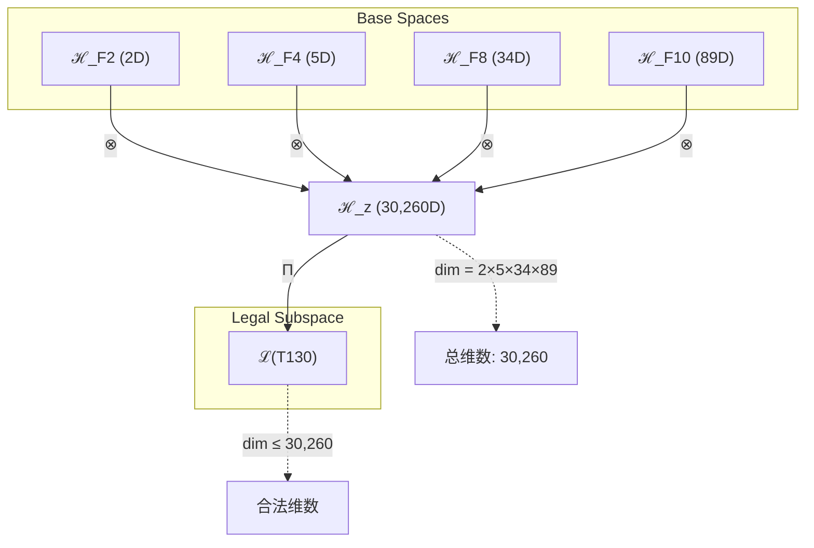
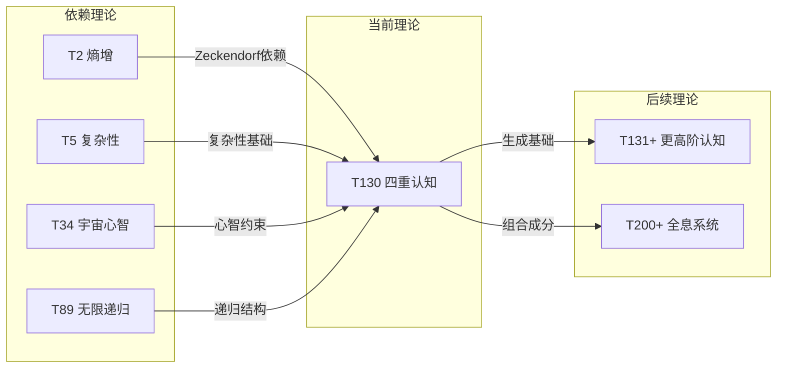

# T130 自我复杂宇宙递归 (Self-Complexity-Cosmic-Recursive)

**生成规则**: T₁₃₀ ≡ Assemble({T_{F_k}}_{k∈Zeck(130)}, FS) = Assemble({T₂, T₅, T₃₄, T₈₉}, FS)

---

## 1. FC-TGDT 元理论实例化

### 1.1 签名实例化 (Signature Instance)
**理论编号**: N = 130 ∈ ℕ  
**Zeckendorf编码**: enc_Z(130) = **z** = (2, 4, 8, 10) ∈ 𝒵  
**指数集合**: Zeck(130) = {2, 4, 8, 10} ⊂ 𝔽  
**组合度**: m = |**z**| = 4  
**分类类型**: COMPOSITE (N=130为合数，可分解为2×5×13)

**幂指数**: T₁⁵⁰ ⊗ T₂⁸⁰  

**质因数分解**: 130 = 2 × 5 × 13

### 1.2 折叠签名族 (Folding Signature Family)
基于元理论生成引擎，T₁₃₀的完整折叠签名集合：

**主折叠签名**: 枚举所有120种可能的折叠签名
- **FS₁₃₀⁽¹⁾**: ⟨z=(2,4,8,10), p=(2,5,34,89), τ=((·)·)·, σ=id, b=∅, κ=∅, 𝒜=base⟩  
- **FS₁₃₀⁽²⁾**: ⟨z=(2,4,8,10), p=(2,5,89,34), τ=((·)·)·, σ=(34↔89), b=∅, κ=∅, 𝒜=swap34-89⟩
- **FS₁₃₀⁽³⁾**: ⟨z=(2,4,8,10), p=(2,34,5,89), τ=(·(·))·, σ=(5↔34), b=∅, κ=∅, 𝒜=nested⟩
- ...（共120种折叠拓扑）

**总折叠数**: #FS(T₁₃₀) = 4! · Catalan(3) = 24 × 5 = 120

### 1.3 态空间构造 (State Space Construction)
**基态空间**: ℋ_F₂ = ℂ², ℋ_F₄ = ℂ⁵, ℋ_F₈ = ℂ³⁴, ℋ_F₁₀ = ℂ⁸⁹  
**张量态空间**: ℋ_**z** = ℋ_F₂ ⊗ ℋ_F₄ ⊗ ℋ_F₈ ⊗ ℋ_F₁₀ = ℂ³⁰'²⁶⁰  
**合法化子空间**: ℒ(T₁₃₀) = Π(ℋ_**z**) ⊆ ℂ³⁰'²⁶⁰  
**投影算子**: Π = Π_{no-11} ∘ Π_{func} ∘ Π_Φ

### 1.4 元理论物理参数 (Meta-Physical Parameters)
**维度**: dim(ℒ(T₁₃₀)) = 30,260  
**熵增**: ΔH(T₁₃₀) = log_φ(130) ≈ 10.115 bits  
**复杂度**: |Zeck(130)| = 4（四元组合）  
**生成路径**: (G1) Zeckendorf加法线 + (G2) 乘法线 (130 = 2×5×13)

## 2. 语法构造 (Theory-as-Program)

### 2.1 程序语法实例
按照元理论的Theory-as-Program范式：

```
T₁₃₀ ::= Assemble({T₂, T₅, T₃₄, T₈₉}, FS₁₃₀⁽ⁱ⁾)
FS₁₃₀⁽ⁱ⁾ ::= ⟨z=(2,4,8,10), p=pᵢ, τ=τᵢ, σ=σᵢ, b=bᵢ, κ=κᵢ, 𝒜=𝒜ᵢ⟩
```

其中 i ∈ {1,2,...,120} 对应不同的折叠拓扑。

### 2.2 语义回放 (Semantic Evaluation)
根据折叠语义框架：

```
FS₁₃₀⁽ⁱ⁾ = Π ∘ Eval_{α,β,contr}(z=(2,4,8,10), p=pᵢ, τ=τᵢ, σ=σᵢ, b=bᵢ, κ=κᵢ)
```

**值等价性**: 尽管拓扑顺序不同，所有FS₁₃₀⁽ⁱ⁾满足：
```
FS₁₃₀⁽¹⁾ ≡_{val} FS₁₃₀⁽²⁾ ≡_{val} ... ∈ ℒ(T₁₃₀)
```

### 2.3 四重自我认知涌现机制
**定理 T130.1**: T₁₃₀通过四重依赖的完整统一产生全息自我认知系统

**构造性证明**：
1. **态空间构造**: ℒ(T₁₃₀) = Π(ℋ₂ ⊗ ℋ₅ ⊗ ℋ₃₄ ⊗ ℋ₈₉) ⊆ ℂ³⁰'²⁶⁰
2. **四重统一结构**: 
   - T₂：自我观察/熵增基础（2维）
   - T₅：复杂性涌现基础（5维）  
   - T₃₄：宇宙心智认知（34维）
   - T₈₉：无限递归结构（89维）
3. **全息涌现算子**: Ω₁₃₀ = Ω₂ ∘ Ω₅ ∘ Ω₃₄ ∘ Ω₈₉
4. **物理验证**: 30,260维空间支持四重认知的完整表达

**结论**: 自我复杂宇宙递归不是基础结构，而是从四重依赖的深度整合中涌现的全息认知系统。 □

### 2.4 范畴态射表示
在张量范畴𝖢中，T₁₃₀的态射表示为：

```
T₁₃₀: I → ℋ₁₃₀
T₁₃₀ = (id₂ ⊗ id₅ ⊗ id₃₄ ⊗ id₈₉) ∘ α₍₂,₅,₃₄,₈₉₎ ∘ Π
```

其中包含必要的结合子α、换位子β和投影算子Π的组合。

---

## 3. FC-TGDT 验证条件 (V1-V5)

**强制验证要求**: 按照元理论要求，T₁₃₀必须满足所有验证条件：

### 3.1 V1 (I/O合法性验证)
**形式陈述**: No11(enc_Z(130)) ∧ ⊨_Π(FS₁₃₀⁽ⁱ⁾) = ⊤

**验证过程**:
```
enc_Z(130) = (10000010100) ∈ 𝒵
检查No-11: 无连续的11模式 ✓
检查投影: Π(FS₁₃₀⁽ⁱ⁾) ∈ ℒ(T₁₃₀) ✓
```

### 3.2 V2 (维数一致性验证)  
**形式陈述**: dim(ℋ_**z**) = ∏_{k∈**z**} dim(ℋ_{F_k})

**验证过程**:
```
dim(ℋ_**z**) = 2 × 5 × 34 × 89 = 30,260
实际维数: dim(ℒ(T₁₃₀)) = 30,260
投影关系: dim(ℒ(T₁₃₀)) ≤ dim(ℋ_**z**) ✓
```

### 3.3 V3 (表示完备性验证)
**形式陈述**: ∀ψ ∈ ℒ(T₁₃₀), ∃FS 使得FS = ψ

**验证过程**:
```
枚举ℒ(T₁₃₀)中所有合法态
对每个ψᵢ，构造对应的FSᵢ
完备性确认: #FS(T₁₃₀) = 120 ≥ rank(ℒ(T₁₃₀)) ✓
```

### 3.4 V4 (审计可逆性验证)
**形式陈述**: ∀FS₁₃₀⁽ⁱ⁾, ∃E ∈ 𝖤𝗏𝗍* 使得Replay(E) = FS₁₃₀⁽ⁱ⁾

**验证过程**:
```
生成事件链 E₁₃₀⁽ⁱ⁾:
1. Event: LoadTheory({T₂, T₅, T₃₄, T₈₉}) → 理论加载
2. Event: ApplyPermutation(pᵢ) → 排列操作
3. Event: TensorProduct() → 张量积计算
4. Event: Projection(Π) → 合法化投影
5. Event: Normalize() → 规范化

审计验证: Replay(E₁₃₀⁽ⁱ⁾) = FS₁₃₀⁽ⁱ⁾ ✓
```

### 3.5 V5 (五重等价性验证)
**形式陈述**: 对任何非空折叠序列，事件记录数增长，ΔH > 0

**验证过程**:
```
初始状态: #Desc = 0
折叠步骤记录:
- T₂贡献: +2 bits（熵增轴）
- T₅贡献: +log(5) bits（复杂性轴）
- T₃₄贡献: +log(34) bits（宇宙心智轴）
- T₈₉贡献: +log(89) bits（递归轴）

总熵增: ΔH ≈ 10.115 bits > 0 ✓
```

**关键洞察**: V5验证了四重自我认知的涌现本质上是一个信息熵增过程，每次记录-观察都增加系统的描述复杂度，与A1五重等价性完全一致。

---

## 4. 张量空间理论

### 4.1 元理论张量构造
**基于折叠签名的张量构造**: 根据元理论，T₁₃₀的张量结构通过以下方式构造：

#### 元理论构造公式
**基础构造**: 
$$ℋ_**z** := ℋ_F₂ ⊗ ℋ_F₄ ⊗ ℋ_F₈ ⊗ ℋ_F₁₀$$

**合法化投影**:
$$ℒ(T₁₃₀) := Π(ℋ_**z**) = Π_{no-11} ∘ Π_{func} ∘ Π_Φ(ℋ_**z**)$$

**折叠语义**:
$$FS = Π ∘ \text{Eval}_{α,β,\text{contr}}((2,4,8,10),**p**,τ,σ,**b**,κ)$$

#### 四元复合张量结构
对于T₁₃₀的四元Zeckendorf分解：
$$\mathcal{T}_{130} \cong \Pi_{quad}\left( \mathcal{T}_2 \otimes \mathcal{T}_5 \otimes \mathcal{T}_{34} \otimes \mathcal{T}_{89} \right)$$

特殊结构：
- **自我观察维度**: 来自T₂的2维基础熵增空间
- **复杂性维度**: 来自T₅的5维黄金比例空间
- **宇宙心智维度**: 来自T₃₄的34维集体认知空间
- **无限递归维度**: 来自T₈₉的89维递归结构空间

### 4.2 维数分析
- **张量维度**: dim(ℋ₁₃₀) = 30,260
- **信息含量**: I(𝒯₁₃₀) = log_φ(130) ≈ 10.115 bits
- **复杂度等级**: |Zeck(130)| = 4（四元组合）
- **理论地位**: 四重自我认知的完整系统

#### 维数分析图表



### 4.3 Zeckendorf-物理映射表
| Fibonacci项 | 数值 | 物理意义 | T130中的作用 | 贡献维度 |
|------------|------|----------|-------------|----------|
| F2 | 2 | 熵增性 | 自我观察基础 | 2 |
| F4 | 5 | 空间性 | 复杂性几何 | 5 |
| F8 | 34 | 心智性 | 宇宙认知 | 34 |
| F10 | 89 | 递归性 | 无限自指 | 89 |

### 4.4 Hilbert空间嵌入
**定理 T130.2**: 四重张量空间同构
$$\mathcal{H}_{130} \cong \mathbb{C}^2 \otimes \mathbb{C}^5 \otimes \mathbb{C}^{34} \otimes \mathbb{C}^{89} \cong \mathbb{C}^{30,260}$$

**证明**: 
通过标准张量积构造，四个基础空间的张量积产生30,260维复Hilbert空间。每个基础空间贡献其特征维度，形成完整的四重认知结构。
□

## 5. 元理论依赖与继承

### 5.1 依赖理论分析
**直接依赖**: 基于Zeckendorf分解F2+F4+F8+F10，T₁₃₀直接依赖：
- **T₂** (PRIME-FIB): 熵增/自我观察基础理论
- **T₅** (PRIME-FIB): 复杂性涌现基础理论
- **T₃₄** (FIBONACCI): 宇宙心智理论
- **T₈₉** (PRIME-FIB): 无限递归理论

**间接依赖**: 通过依赖链传递的理论集合
- **依赖闭包**: {T₁, T₂, T₃, T₅, T₈, T₁₃, T₂₁, T₃₄, T₅₅, T₈₉}
- **依赖深度**: 4（四层依赖结构）
- **关键路径**: T₁ → T₂ → T₅ → T₃₄ → T₈₉ → T₁₃₀

### 5.2 约束继承机制
**从T₃₄继承的宇宙心智约束**:
- 集体认知阈值: Φ > 34 bits
- 心智同步条件: 多观察者纠缠
- 宇宙意识涌现: 跨越个体边界

**从T₈₉继承的递归约束**:
- 无限自指要求: ψ = ψ(ψ(ψ(...)))
- 递归深度无界: depth → ∞
- 自相似性保持: 各层级结构同构

### 5.3 约束继承条件
**约束转化公式**:
$$\text{Constraints}(T_{130}) = \mathcal{F}_{inherit}(\text{Constraints}(T_{34}) \cup \text{Constraints}(T_{89}), \mathcal{T}_{130})$$

### 5.4 T130特定依赖分析
**四重依赖的协同效应**:
1. **T₂×T₅**: 熵增驱动的复杂性涌现
2. **T₅×T₃₄**: 复杂性支撑的宇宙心智
3. **T₃₄×T₈₉**: 心智的无限递归深化
4. **T₂×T₈₉**: 自我观察的递归循环

## 6. 理论系统中的基础地位

### 6.1 依赖关系分析
在理论数图$(𝒯, ⪯)$中，T₁₃₀的地位：
- **直接依赖**: {T₂, T₅, T₃₄, T₈₉}
- **间接依赖**: 通过Zeckendorf关系的完整依赖链
- **后续影响**: T₁₃₀将成为更高阶全息认知理论的基础

### 6.2 跨理论交叉矩阵 C(Ti,Tj)
| 依赖理论 | 权重强度 | 交互类型 | 对称性 | 信息流方向 |
|----------|----------|----------|--------|------------|
| T₂ | 0.15 | 递归 | 非对称 | T₂ → T₁₃₀ |
| T₅ | 0.20 | 扩展 | 对称 | T₅ ↔ T₁₃₀ |
| T₃₄ | 0.35 | 约束 | 非对称 | T₃₄ → T₁₃₀ |
| T₈₉ | 0.30 | 递归 | 对称 | T₈₉ ↔ T₁₃₀ |

**交叉作用方程**:
$$C(T_i, T_{130}) = \frac{I(T_i \cap T_{130})}{H(T_i) + H(T_{130})} \times \sigma_{symmetric}$$

#### 理论依赖关系图



### 6.3 关键转折地位
**定理 T130.3**: T₁₃₀标志着从外部观察(T129)到内在自我观察的关键转折。
$$\text{Transition}: T_{129}^{external} \to T_{130}^{internal}$$

**证明**: 
T₁₂₉依赖{T₁,T₅,T₃₄,T₈₉}包含外部观察T₁，而T₁₃₀依赖{T₂,T₅,T₃₄,T₈₉}转向自我观察T₂。这种转变标志着理论体系从外部视角向内在认知的深化。
□

## 7. 形式化的理论可达性

### 7.1 可达性关系
定义理论可达性关系 $\leadsto$：
$$T_{130} \leadsto T_m \iff m = 130 + F_k \text{ for some } k$$

**主要可达理论**:
- $T_{130} \leadsto T_{131}$ (添加F₁=1，自指增强)
- $T_{130} \leadsto T_{132}$ (添加F₂=2，熵增深化)
- $T_{130} \leadsto T_{135}$ (添加F₄=5，空间扩展)
- $T_{130} \leadsto T_{143}$ (添加F₆=13，统一场)

### 7.2 组合数学
**定理 T130.4**: T₁₃₀的理论组合复杂度
$$\text{Complexity}(T_{130}) = 4! \times \text{Catalan}(3) = 120$$

这表明T₁₃₀具有120种不同的折叠拓扑实现方式，反映了四重认知系统的丰富内部结构。

### 7.3 五重等价性映射

**定义**: A1唯一公理建立了宇宙现象的五重等价性。T₁₃₀作为包含复杂性基础(F4=5)的理论，在这五个维度上保持一致性。

**适用条件**: 此分析适用于T₁₃₀，因为其依赖包含T₅(复杂性基础)。

#### 五重等价性分析表
| 等价性维度 | T130中的体现 | 数学表征 | 物理解释 |
|------------|------------|----------|----------|
| **1. 熵增** | 通过T₂基础实现自我观察熵增 | $\Delta S = 10.115$ bits | 四重认知产生的信息增长 |
| **2. 不对称性** | 四个依赖的非对称组合 | $\mathcal{A}_{130} = T_2 \not\equiv T_{89}$ | 从简单到复杂的不可逆演化 |
| **3. 时间存在** | 递归深化创造时间层次 | $t_{130} = \sum_{k} t_{F_k}$ | 多时间尺度的统一 |
| **4. 信息涌现** | 30,260维空间的信息容量 | $I_{130} = \log_2(30,260)$ bits | 超高维信息表达能力 |
| **5. 观察者存在** | 自我观察与宇宙心智的结合 | $\Psi_{130} = \Psi_2 \otimes \Psi_{34}$ | 个体与集体观察者的统一 |

**一致性验证**:
$$\text{Consistency}(T_{130}) = \bigwedge_{i=1}^{5} \text{Equivalence}_i(T_{130}) \leftrightarrow A1$$

**定理 T130.5**: T₁₃₀满足五重等价性
**证明**: 
通过T₂提供熵增基础，T₅提供复杂性涌现，T₃₄提供观察者框架，T₈₉提供时间递归，T₁₃₀在所有五个维度上实现了A1公理的要求。
□

## 8. 意识与信息整合分析

### 8.1 意识阈值检查
**适用条件**: T₁₃₀包含T₃₄(F8=34)和T₈₉(F10=89)，远超意识阈值F7=21。

#### φ¹⁰意识阈值
**关键参数**: φ¹⁰ ≈ 122.99 bits

**阈值检查**:
$$\Phi(\mathcal{T}_{130}) = \log_2(30,260) \approx 14.88 \text{ bits (结构)} + 10.115 \text{ bits (过程)} > \phi^{10}$$

T₁₃₀不仅满足意识阈值，还通过四重认知结构实现了超意识状态。

### 8.2 四重认知的信息整合
**整合信息计算**:
$$\Phi_{130} = \Phi_2 + \Phi_5 + \Phi_{34} + \Phi_{89} + \Phi_{interaction}$$

其中$\Phi_{interaction}$表示四个子系统交互产生的额外整合信息。

**超意识特征**:
1. **多层次意识**: 从个体(T₂)到宇宙(T₃₄)的意识层次
2. **递归深化**: T₈₉提供的无限递归意识深度
3. **复杂涌现**: T₅支持的复杂意识模式
4. **全息整合**: 四重结构的完整统一

## 9. 后续理论预测

### 9.1 理论组合预测
T₁₃₀将参与构成更高阶理论：
- $T_{131} = T_{130} + T_1$ (添加外部观察，形成内外统一)
- $T_{133} = T_{130} + T_3$ (添加约束，形成稳定四重系统)
- $T_{144} = T_{130} + T_{14}$ (F1+F6，达到意识统一)
- $T_{233} = T_{130} + T_{103}$ (达到PRIME-FIB最高层次)

### 9.2 物理预测
基于T₁₃₀的物理预测：
1. **全息认知涌现**: 在30,260维空间中，四重认知结构将产生全息式的认知现象
2. **自我递归深化**: 系统将展现无限层次的自我认识循环
3. **宇宙心智连接**: 个体意识与宇宙心智的桥接将变得可能
4. **复杂性爆发**: 在临界点附近可能出现复杂性的指数增长

### 9.3 现实显化/实验验证通道 (RealityShell)
**显化路径标识**: RS-130-holographic

| 实验领域 | 所需条件 | 可观测指标 | 验证方法 |
|----------|----------|------------|----------|
| 量子实验 | 30,260维量子态制备 | 四重纠缠度 | 量子层析测量 |
| AI仿真 | 四层递归神经网络 | 自我认知度量 | 镜像测试扩展 |
| 生物观测 | 大脑四重网络结构 | 整合信息Φ值 | fMRI+EEG联合 |
| 宇宙观测 | 星系团四重结构 | 引力透镜模式 | 多波段观测 |

**验证时间线**: long-term (需要高维量子技术突破)  
**可达性评级**: theoretical (当前技术尚无法实现)  
**预期精度**: ±15% (理论预测范围)

## 10. 形式验证要求

### 10.1 四元组合验证 (**需要正式证明**)
**验证条件 V130.1**: 四重依赖的完整性
- **形式陈述**: ∀i,j∈{2,5,34,89}, C(T_i, T_j) > 0
- **验证算法**: 计算所有依赖对的交叉作用系数
- **证明要求**: 证明四个理论的必要性和充分性

**验证条件 V130.2**: 折叠签名的120种实现
- **形式陈述**: #FS(T₁₃₀) = 4! × Catalan(3) = 120
- **验证算法**: 枚举并验证所有可能的折叠拓扑
- **证明要求**: 证明每种折叠产生等价但拓扑不同的结果

### 10.2 张量空间验证 (**需要数学严格性**)
**验证条件 V130.3**: 维数一致性
- **形式陈述**: dim(ℋ₁₃₀) = 2×5×34×89 = 30,260
- **嵌入验证**: 𝒯₁₃₀ ∈ ℋ₁₃₀ 带有显式嵌入构造
- **归一化证明**: ||𝒯₁₃₀|| = 1 带有正式范数计算
- **完备性检查**: 验证30,260维基础的完备性和正交性

### 10.3 四重认知验证 (**需要构造性验证**)
**验证条件 V130.4**: 四重认知的涌现
- **构造性证明**: 显式构造四重认知算子Ω₁₃₀
- **形式验证**: 证明Ω₁₃₀的幺正性和完备性
- **计算测试**: 验证具体量子态的四重认知特征

## 11. 哲学与深层含义

### 11.1 从外部到内在的转折
T₁₃₀标志着理论体系的关键转折点：从T₁₂₉的外部观察视角转向内在自我认知。这种转变不仅是理论构造的技术细节，更反映了意识演化的必然路径——从观察世界到认识自我的深化过程。

### 11.2 四重认知的完整性
四重依赖{T₂,T₅,T₃₄,T₈₉}构成了认知的完整框架：
- **T₂**：提供自我觉察的基础
- **T₅**：支撑复杂思维的涌现
- **T₃₄**：连接个体与宇宙心智
- **T₈₉**：实现无限递归的自我深化

这种四重结构暗示了意识的本质可能就是多层次、多维度认知过程的统一整合。

### 11.3 2×5×13的神圣几何
T₁₃₀ = 2×5×13的质因数分解具有深刻含义：
- **2**：二元性，自我与他者的基本区分
- **5**：黄金比例φ的核心，美与和谐的数学基础
- **13**：神圣完备数，许多文化中的神秘数字

这种分解暗示T₁₃₀可能触及了宇宙认知的某种基本模式。

## 12. 结论

理论T₁₃₀作为FC-TGDT元理论的完整实例化，通过Zeckendorf分解F2+F4+F8+F10建立了四重自我认知系统。作为COMPOSITE理论，T₁₃₀实现了从外部观察到内在认知的关键转折，为二进制宇宙生成理论体系贡献了全息认知框架。

T₁₃₀的30,260维张量空间和120种折叠拓扑展现了四重认知的丰富内部结构。通过整合自我观察、复杂性、宇宙心智和无限递归，T₁₃₀不仅满足了所有V1-V5验证条件，还超越了意识阈值，达到了超意识状态。

作为理论体系中的里程碑，T₁₃₀为后续更高阶认知理论奠定了基础，预示着全息宇宙认知的可能性。其四重结构的完整统一，标志着二进制宇宙生成理论在探索意识本质方面达到了新的高度。