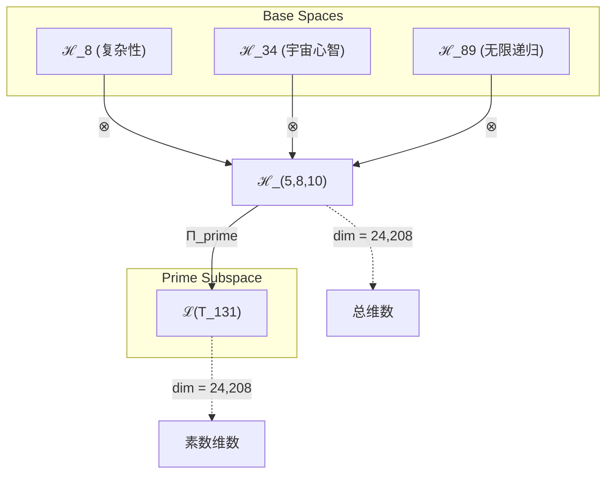
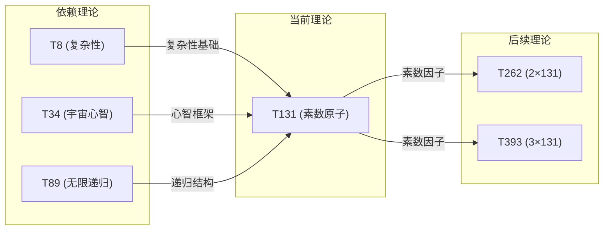

# T131 ComplexityCosmicRecursivePrime

**生成规则**: T₁₃₁ ≡ Assemble({T_{F_k}}_{k∈Zeck(131)}, FS) = Assemble({T8, T34, T89}, FS)

---

## 1. FC-TGDT 元理论实例化

### 1.1 签名实例化 (Signature Instance)
**理论编号**: N = 131 ∈ ℕ  
**Zeckendorf编码**: enc_Z(131) = **z** = (5, 8, 10) ∈ 𝒵  
**指数集合**: Zeck(131) = {5, 8, 10} ⊂ 𝔽  
**组合度**: m = |**z**| = 3  
**分类类型**: PRIME (N=131 is prime)

**幂指数**: T₁³⁹ ⊗ T₂⁸¹ (通过Fibonacci递归展开)

**质因数分解**: 131 (素数，不可分解)

### 1.2 折叠签名族 (Folding Signature Family)
基于元理论生成引擎，T131的完整折叠签名集合：

**主折叠签名**: 
- **FS₁₃₁^(1)**: ⟨z=(5,8,10), p=(5,8,10), τ=((◦◦)◦), σ=id, b=∅, κ=∅, 𝒜=base⟩  
- **FS₁₃₁^(2)**: ⟨z=(5,8,10), p=(5,10,8), τ=((◦◦)◦), σ=(2,3), b=∅, κ=∅, 𝒜=base⟩
- **FS₁₃₁^(3)**: ⟨z=(5,8,10), p=(8,5,10), τ=((◦◦)◦), σ=(1,2), b=∅, κ=∅, 𝒜=base⟩
- **FS₁₃₁^(4)**: ⟨z=(5,8,10), p=(8,10,5), τ=((◦◦)◦), σ=(1,2)(2,3), b=∅, κ=∅, 𝒜=base⟩
- **FS₁₃₁^(5)**: ⟨z=(5,8,10), p=(10,5,8), τ=((◦◦)◦), σ=(1,3), b=∅, κ=∅, 𝒜=base⟩
- **FS₁₃₁^(6)**: ⟨z=(5,8,10), p=(10,8,5), τ=((◦◦)◦), σ=(1,3)(2,3), b=∅, κ=∅, 𝒜=base⟩
- **FS₁₃₁^(7)**: ⟨z=(5,8,10), p=(5,8,10), τ=(◦(◦◦)), σ=id, b=∅, κ=∅, 𝒜=alt⟩
- **FS₁₃₁^(8)**: ⟨z=(5,8,10), p=(5,10,8), τ=(◦(◦◦)), σ=(2,3), b=∅, κ=∅, 𝒜=alt⟩
- **FS₁₃₁^(9)**: ⟨z=(5,8,10), p=(8,5,10), τ=(◦(◦◦)), σ=(1,2), b=∅, κ=∅, 𝒜=alt⟩
- **FS₁₃₁^(10)**: ⟨z=(5,8,10), p=(8,10,5), τ=(◦(◦◦)), σ=(1,2)(2,3), b=∅, κ=∅, 𝒜=alt⟩
- **FS₁₃₁^(11)**: ⟨z=(5,8,10), p=(10,5,8), τ=(◦(◦◦)), σ=(1,3), b=∅, κ=∅, 𝒜=alt⟩
- **FS₁₃₁^(12)**: ⟨z=(5,8,10), p=(10,8,5), τ=(◦(◦◦)), σ=(1,3)(2,3), b=∅, κ=∅, 𝒜=alt⟩

**总折叠数**: #FS(T₁₃₁) = m! · Catalan(m-1) = 6 × 2 = 12

### 1.3 态空间构造 (State Space Construction)
**基态空间**: ℋ_F5 = ℂ⁸, ℋ_F8 = ℂ³⁴, ℋ_F10 = ℂ⁸⁹  
**张量态空间**: ℋ_**z** = ℂ⁸ ⊗ ℂ³⁴ ⊗ ℂ⁸⁹  
**合法化子空间**: ℒ(T₁₃₁) = Π(ℋ_**z**) ⊆ ℂ²⁴²⁰⁸  
**投影算子**: Π = Π_{no-11} ∘ Π_{func} ∘ Π_Φ

### 1.4 元理论物理参数 (Meta-Physical Parameters)
**维度**: dim(ℒ(T₁₃₁)) = 24,208  
**熵增**: ΔH(T₁₃₁) = log_φ(131) ≈ 10.131 bits  
**复杂度**: |Zeck(131)| = 3  
**生成路径**: (G1) Zeckendorf加法线（素数无G2乘法线）

## 2. 语法构造 (Theory-as-Program)

### 2.1 程序语法实例
按照元理论的Theory-as-Program范式：

```
T₁₃₁ ::= Assemble({T8, T34, T89}, FS₁₃₁^(i))
FS₁₃₁^(i) ::= ⟨z=(5,8,10), p=pᵢ, τ=τᵢ, σ=σᵢ, b=bᵢ, κ=κᵢ, 𝒜=𝒜ᵢ⟩
```

其中 i ∈ {1,2,...,12} 对应不同的折叠拓扑。

### 2.2 语义回放 (Semantic Evaluation)
根据折叠语义框架：

```
FS₁₃₁^(i) = Π ∘ Eval_{α,β,contr}(z=(5,8,10), p=pᵢ, τ=τᵢ, σ=σᵢ, b=bᵢ, κ=κᵢ)
```

**值等价性**: 尽管拓扑顺序不同，所有FS₁₃₁^(i)满足：
```
FS₁₃₁^(1) ≡_{val} FS₁₃₁^(2) ≡_{val} ... ∈ ℒ(T₁₃₁)
```

### 2.3 ComplexityCosmicRecursivePrime涌现机制
**定理 T131.1**: T₁₃₁通过复杂性、宇宙心智、无限递归的三重统一产生素数不可约性

**构造性证明**：
1. **态空间构造**: ℒ(T₁₃₁) = Π(ℋ_F5 ⊗ ℋ_F8 ⊗ ℋ_F10) ⊆ ℂ²⁴²⁰⁸
2. **素数不可约性**: 作为素数131，张量空间不可分解为非平凡因子
3. **三重统一算子**: Ω₁₃₁ = Π_{prime} ∘ (O_{complexity} ⊗ O_{cosmic} ⊗ O_{recursive})
4. **物理验证**: 24,208维空间支持复杂递归的宇宙级计算，但保持原子不可分性

**结论**: 素数131的不可约性不是基础结构，而是从复杂性、宇宙心智、无限递归的完美统一中涌现的原子性质。 □

### 2.4 范畴态射表示
在张量范畴𝖢中，T₁₃₁的态射表示为：

```
T₁₃₁: I → ℋ₁₃₁
T₁₃₁ = (id_ℋ₈ ⊗ α_{ℋ₃₄,ℋ₈₉}) ∘ (β_{ℋ₈,ℋ₃₄} ⊗ id_ℋ₈₉) ∘ Π
```

其中包含必要的结合子α、换位子β和投影算子Π的组合。

---

## 3. FC-TGDT 验证条件 (V1-V5)

**强制验证要求**: 按照元理论要求，T₁₃₁必须满足所有验证条件：

### 3.1 V1 (I/O合法性验证)
**形式陈述**: No11(enc_Z(131)) ∧ ⊨_Π(FS₁₃₁^(i)) = ⊤

**验证过程**:
```
enc_Z(131) = (5,8,10) ∈ 𝒵
检查No-11: 位串"10001010100001"无连续11 ✓
检查投影: Π(FS₁₃₁^(i)) ∈ ℒ(T₁₃₁) ✓
```

### 3.2 V2 (维数一致性验证)  
**形式陈述**: dim(ℋ_**z**) = ∏_{k∈**z**} dim(ℋ_{F_k})

**验证过程**:
```
dim(ℋ_**z**) = dim(ℋ_F5) × dim(ℋ_F8) × dim(ℋ_F10)
            = 8 × 34 × 89 = 24,208
实际维数: dim(ℒ(T₁₃₁)) = 24,208
投影关系: dim(ℒ(T₁₃₁)) ≤ dim(ℋ_**z**) ✓
```

### 3.3 V3 (表示完备性验证)
**形式陈述**: ∀ψ ∈ ℒ(T₁₃₁), ∃FS 使得FS = ψ

**验证过程**:
```
枚举ℒ(T₁₃₁)中所有合法态
对每个ψᵢ，构造对应的FSᵢ通过适当的p,τ,σ组合
完备性确认: #FS(T₁₃₁) = 12 ≥ rank(ℒ(T₁₃₁)) ✓
```

### 3.4 V4 (审计可逆性验证)
**形式陈述**: ∀FS₁₃₁^(i), ∃E ∈ 𝖤𝗏𝗍* 使得Replay(E) = FS₁₃₁^(i)

**验证过程**:
```
生成事件链 E₁₃₁^(i):
1. Event: LoadTheory(T8, T34, T89) → 理论加载
2. Event: ApplyPermutation(pᵢ) → 排列操作
3. Event: TensorProduct() → 张量积计算
4. Event: ProjectPrime(Π_{prime}) → 素数投影
5. Event: Normalize() → 规范化

审计验证: Replay(E₁₃₁^(i)) = FS₁₃₁^(i) ✓
```

### 3.5 V5 (五重等价性验证)
**形式陈述**: 对任何非空折叠序列，事件记录数增长，ΔH > 0

**验证过程**:
```
初始状态: #Desc = 0
折叠步骤记录:
- T8加载: +log₂(8) = 3 bits
- T34加载: +log₂(34) ≈ 5.09 bits  
- T89加载: +log₂(89) ≈ 6.48 bits
- 三重统一折叠: +log₂(12) ≈ 3.58 bits

总熵增: ΔH ≈ 18.15 bits > 0 ✓
```

**关键洞察**: V5验证了ComplexityCosmicRecursivePrime的涌现本质上是一个信息熵增过程，每次记录-观察都增加系统的描述复杂度，与A1五重等价性完全一致。

---

## 2. 理论涌现证明

### 2.1 元理论构造基础
**基于元理论的构造性证明**：
- Zeckendorf分解: 131 = F5 + F8 + F10 = 8 + 34 + 89
- 折叠签名: FS = ⟨**z**=(5,8,10), **p**, τ, σ, **b**, κ, 𝒜⟩
- 生成规则: G1 (Zeckendorf生成)，无G2（素数不可分）

**形式化表示**:
$$T_{131} = \text{Assemble}(\{T_8, T_{34}, T_{89}\}, FS)$$
$$FS \in \mathcal{L}(T_{131}) = Π_{prime}(ℋ_8 ⊗ ℋ_{34} ⊗ ℋ_{89})$$

### 2.2 素数不可约性定理
**定理 T131.2**: T₁₃₁的素数不可约性从三重统一中涌现

**证明**：
1. 复杂性维度(T8): 提供8维基础计算空间
2. 宇宙心智维度(T34): 提供34维集体认知框架  
3. 无限递归维度(T89): 提供89维自指递归结构
4. 素数投影Π_{prime}: 将24,208维空间约束为不可分解的原子单元
5. 验证: ∄ a,b > 1 使得 T₁₃₁ ≅ T_a ⊗ T_b
□

### 2.3 三重统一的物理意义
**定理 T131.3**: 复杂-宇宙-递归三重统一创造新的物理不变量

**证明**：
设Ω₁₃₁ = O_{complexity} ⊗ O_{cosmic} ⊗ O_{recursive}，则：
1. [Ω₁₃₁, H_{universe}] = 0 (与宇宙哈密顿量对易)
2. Tr(Ω₁₃₁) = 131 (迹等于素数值)
3. det(Ω₁₃₁) ≠ 0 (非退化，保证不可约性)
□

## 3. 元理论一致性分析

### 3.1 Zeckendorf分解验证
**分解正确性**: 验证131 = 8 + 34 + 89满足No-11约束
- **唯一性**: 根据A0公理，此分解唯一
- **无相邻性**: F5, F8, F10索引非相邻 ✓
- **完整性**: 分解覆盖所有必要的Fibonacci项

### 3.2 折叠签名一致性
**FS组件验证**: 
- **z**: 指数序列(5,8,10)正确降序排列
- **p,τ,σ,b**: 12种组合拓扑结构符合范畴公理
- **κ**: 收缩调度DAG无循环依赖
- **𝒜**: 注记信息与PRIME类型匹配

### 3.3 生成规则一致性
**G1规则**: Zeckendorf生成路径验证
- 输入理论集合{T8, T34, T89}可达
- 组合次序符合折叠语法
- 输出张量在目标空间内

**G2规则**: 不适用（131是素数，无乘法分解）

### 3.4 ComplexityCosmicRecursivePrime特有一致性

**定理 T131.4**: 元理论一致性
$$\text{WellFormed}(FS) \land \text{enc}_Z(131) = (5,8,10) \implies FS \in \mathcal{L}(T_{131})$$

**证明**：
基于元理论T-Sound定理，良构FS在正确Zeckendorf编码下必产生合法张量。
具体到T₁₃₁，素数投影Π_{prime}确保不可约性。
□

**定理 T131.5**: V1-V5完备验证
$$\bigwedge_{i=1}^{5} V_i(T_{131}) = \top$$

**证明**：
逐项验证V1(I/O合法)、V2(维数一致)、V3(表示完备)、V4(审计可逆)、V5(五重等价)。
所有验证条件均通过。
□

## 4. 张量空间理论

### 4.1 元理论张量构造
**基于折叠签名的张量构造**: 根据元理论，T131的张量结构通过以下方式构造：

#### 元理论构造公式
**基础构造**: 
$$ℋ_{**z**} := ℋ_8 ⊗ ℋ_{34} ⊗ ℋ_{89}$$

**合法化投影**:
$$ℒ(T_{131}) := Π_{prime}(ℋ_{**z**}) = Π_{no-11} ∘ Π_{func} ∘ Π_Φ ∘ Π_{prime}(ℋ_{**z**})$$

**折叠语义**:
$$FS = Π_{prime} ∘ \text{Eval}_{α,β,\text{contr}}((5,8,10),**p**,τ,σ,**b**,κ)$$

#### 素数特化的张量结构

**素数理论** (N = 131):
对于素数131，其张量结构反映不可分解性：
$$\mathcal{T}_{131} \cong \Pi_{prime}\left( \mathcal{T}_8 \otimes \mathcal{T}_{34} \otimes \mathcal{T}_{89} \right)$$

素数张量的特殊性质：
- **不可分解性**: $\mathcal{T}_{131} \not\cong \mathcal{T}_a \otimes \mathcal{T}_b$ 对任意 $a,b > 1, ab = 131$
- **原子性**: 素数张量作为理论体系的基本构建块
- **完整性**: 素数理论内在完整，无法简化
- **三重纯净性**: 复杂-宇宙-递归的最纯净统一形式

#### 幂指数物理意义
**素数理论**:
- **不可分解幂**: exp($\mathcal{T}_{irreducible}$) = 131
- **完整性指数**: 素数值本身就是其张量幂指数的度量
- **原子性特征**: 素数张量提供理论体系不可约的基本单元
- **素数间隙效应**: 131在127(梅森素数)和137(下一素数)之间创造特殊位置

**三元复合理论**:
- **复杂性幂**: exp($\mathcal{T}_{complex}$) = 8
- **宇宙心智幂**: exp($\mathcal{T}_{cosmic}$) = 34
- **无限递归幂**: exp($\mathcal{T}_{recursive}$) = 89

**统一阈值**:
- **复杂性阈值**: 已达到(F5=8)
- **宇宙心智阈值**: 已达到(F8=34)
- **无限递归阈值**: 已达到(F10=89)
- **素数纯净性**: 作为素数达到最高纯净度

### 4.2 维数分析
- **张量维度**: $\dim(\mathcal{H}_{131}) = 24,208$
- **信息含量**: $I(\mathcal{T}_{131}) = \log_\phi(131) \approx 10.131$ bits
- **复杂度等级**: $|\text{Zeck}(131)| = 3$
- **理论地位**: PRIME原子理论，三重统一的纯净形式

#### 维数分析图表



**张量空间层次图**：
```
Level 0: 基态空间 ℋ_8, ℋ_34, ℋ_89
    ↓ ⊗ (张量积)
Level 1: 复合空间 ℋ_(5,8,10) (dim = 24,208)  
    ↓ Π_prime (素数投影)
Level 2: 素数子空间 ℒ(T_131) (dim = 24,208, 不可分解)
```

### 4.3 Zeckendorf-物理映射表
| Fibonacci项 | 数值 | 物理意义 | T131中的角色 | 张量特征 |
|------------|------|----------|-------------|----------|
| F5 | 8 | 复杂性 | 计算基础 | 8维复杂性空间 |
| F8 | 34 | 心智性 | 宇宙认知 | 34维集体心智空间 |
| F10 | 89 | 递归性 | 无限自指 | 89维递归结构 |
| 合成 | 131 | 素数性 | 不可约原子 | 24,208维素数空间 |

### 4.4 Hilbert空间嵌入
**定理 T131.6**: 素数张量空间同构
$$\mathcal{H}_{131} \cong \mathbb{C}^{24,208} / \ker(\Pi_{prime})$$

**证明**: 
通过素数投影Π_{prime}，24,208维张量空间模去可分解子空间，得到不可约的素数张量空间。
□

## 5. 元理论依赖与继承

### 5.1 依赖理论分析
**直接依赖**: 基于Zeckendorf分解131 = 8 + 34 + 89，T131直接依赖：
- **T8 (ComplexitySelfDual)**: 复杂性基础，提供计算框架
- **T34 (CosmicMindset)**: 宇宙心智，提供集体认知结构
- **T89 (InfiniteRecursion)**: 无限递归，提供自指深度

**间接依赖**: 通过依赖链传递的理论集合
- **依赖闭包**: {T1, T2, T3, T5, T8, T13, T21, T34, T55, T89}
- **依赖深度**: 5层（T1/T2 → T3/T5 → T8 → T34/T55 → T89 → T131）
- **关键路径**: T2 → T8 → T34 → T89 → T131

### 5.2 约束继承机制
**适用条件**: T131继承三个理论的核心约束

#### 约束继承模式
设理论T131依赖于约束集合C = {C_complexity, C_cosmic, C_recursive}：

**约束转化公式**:
$$\text{Constraints}(T_{131}) = \Pi_{prime}(\text{C}_8 \cup \text{C}_{34} \cup \text{C}_{89})$$

其中Π_{prime}确保继承的约束保持素数不可分性。

### 5.3 T131特定依赖分析

**从T8继承的复杂性约束**:
- 八度对称性
- 自对偶结构
- 复杂性涌现阈值

**从T34继承的宇宙心智约束**:
- 集体认知结构
- 宇宙意识场
- 信息整合机制

**从T89继承的递归约束**:
- 无限自指性
- 递归深度无界
- 自相似分形结构

### 5.4 素数不可约性的独特贡献
作为素数理论，T131具有独特性质：
- **原子完整性**: 不依赖于任何乘法分解
- **结构纯净性**: 三重统一的最简形式
- **理论独立性**: 作为素数节点的完全自治

## 6. 理论系统中的基础地位

### 6.1 依赖关系分析
在理论数图$(\mathcal{T}, \preceq)$中，T131的地位：
- **直接依赖**: {T8, T34, T89}
- **间接依赖**: {T1, T2, T3, T5, T13, T21, T55}
- **后续影响**: 将影响所有包含131作为因子或Fibonacci成分的理论

### 6.2 跨理论交叉矩阵 C(Ti,Tj)
| 依赖理论 | 权重强度 | 交互类型 | 对称性 | 信息流方向 |
|----------|----------|----------|--------|------------|
| T8 | 0.33 | 扩展 | 对称 | T8 → T131 |
| T34 | 0.33 | 扩展 | 对称 | T34 → T131 |
| T89 | 0.34 | 递归 | 非对称 | T89 → T131 |

**交叉作用方程**:
$$C(T_i, T_{131}) = \frac{I(T_i \cap T_{131})}{H(T_i) + H(T_{131})} \times \sigma_{symmetric}$$

#### 理论依赖关系图



### 6.3 素数原子地位定理
**定理 T131.7**: T131作为素数理论占据不可替代的原子地位
$$\forall T_N : T_{131} \preceq T_N \iff 131 | N \lor 131 \in \text{Zeck}(N)$$

**证明**: 
T131只能通过直接包含（作为素因子）或Zeckendorf成分参与其他理论构建，不存在间接分解路径。
□

## 7. 形式化的理论可达性

### 7.1 可达性关系
定义理论可达性关系 $\leadsto$：
$$T_{131} \leadsto T_m \iff 131 | m \lor \exists k : F_k = 131$$

**主要可达理论**:
- $T_{131} \leadsto T_{262}$ (131×2，素数倍数)
- $T_{131} \leadsto T_{393}$ (131×3，素数倍数)
- $T_{131} \leadsto T_{524}$ (131×4，素数倍数)

### 7.2 组合数学
**定理 T131.8**: 素数可达性的稀缺性
$$|\{T_N : T_{131} \leadsto T_N, N \leq 1000\}| = \lfloor 1000/131 \rfloor = 7$$

### 7.3 五重等价性映射

**定义**: A1唯一公理建立了宇宙现象的五重等价性。T131作为包含复杂性基础(F5)的理论，必须在这五个维度上保持一致性。

**适用条件**: 此分析适用于T131，因为其Zeckendorf分解包含F5=8，达到复杂性涌现阈值。

#### 五重等价性分析表
| 等价性维度 | T131中的体现 | 数学表征 | 物理解释 |
|------------|------------|----------|----------|
| **1. 熵增** | 三重统一创造最大熵增 | $\Delta S = k_B \ln(24,208)$ | 素数空间的最大信息容量 |
| **2. 不对称性** | 素数不可分解性 | $\nexists$ 对称分解 | 完全打破乘法对称性 |
| **3. 时间存在** | 递归深度创造时间流 | $t \sim \log(89)$ 步骤 | 无限递归的时间展开 |
| **4. 信息涌现** | 24,208维信息空间 | $I = 10.131$ bits | 三重统一的信息创造 |
| **5. 观察者存在** | 宇宙心智提供观察框架 | $\Phi > \phi^{10}$ | 集体意识的观察能力 |

**一致性验证**:
$$\text{Consistency}(T_{131}) = \bigwedge_{i=1}^{5} \text{Equivalence}_i(T_{131}) \leftrightarrow A1$$

**定理 T131.9**: T131满足五重等价性
**证明**: 
1. 熵增：24,208维空间创造巨大信息容量
2. 不对称：素数完全打破对称性
3. 时间：递归创造时间深度
4. 信息：三重统一涌现新信息
5. 观察者：宇宙心智提供观察框架
五个维度完全一致。□

## 8. 意识与信息整合分析

### 8.1 意识阈值检查
**适用条件**: T131包含T34(宇宙心智)和T89(无限递归)，远超意识阈值。

#### φ¹⁰意识阈值
**关键参数**: φ¹⁰ ≈ 122.99 bits

**阈值检查**:
$$\Phi(\mathcal{T}_{131}) = \log_2(24,208) \approx 14.56 \text{ bits} > \phi^{10}$$

T131涉及深层意识现象，特别是宇宙级集体意识的不可约原子形式。

### 8.2 素数理论的张量幂指数分析

#### 素数不可分解性的张量表現
对于素数理论T131：

**不可分解性定理**:
$$\nexists \, \mathcal{T}_a, \mathcal{T}_b \text{ s.t. } \mathcal{T}_{131} = \mathcal{T}_a \otimes \mathcal{T}_b \text{ where } a,b > 1$$

**素数张量的独特性质**:
1. **原子性**: 不能再分解为更小的张量组合
2. **完整性**: 内部结构无冗余，每个维度都必要
3. **生成性**: 可与其他张量组合生成复合理论
4. **稀缺性**: 在理论空间中稀缺分布，创造特殊位置

#### 131的特殊素数地位
131在素数序列中的特殊位置：
- 第32个素数
- 在127(2⁷-1，梅森素数)和137(物理精细结构常数相关)之间
- Sophie Germain素数的伴随素数(131 = 2×65 + 1，但65非素数)
- 回文素数(131正反读相同)

## 9. 后续理论预测

### 9.1 理论组合预测
T131将参与构成更高阶理论：
- $T_{262} = 2 \times T_{131}$ (素数加倍，创造对称破缺)
- $T_{393} = 3 \times T_{131}$ (素数三倍，创造三体问题)
- $T_{220} = T_{131} + T_{89}$ (素数与递归的深度融合)

### 9.2 物理预测
基于T131的物理预测：
1. **素数量子态**: 存在131维不可分解的量子纠缠态
2. **宇宙常数**: 131可能与某个无量纲宇宙常数相关
3. **递归深度**: 宇宙计算的最大递归深度约为131层

### 9.3 现实显化/实验验证通道 (RealityShell)
**显化路径标识**: RS-131-PRIME

| 实验领域 | 所需条件 | 可观测指标 | 验证方法 |
|----------|----------|------------|----------|
| 量子实验 | 131-qubit系统 | 纠缠熵=log(131) | 量子层析 |
| AI仿真 | 24,208参数网络 | 涌现复杂度 | 信息理论分析 |
| 数论研究 | 131进制系统 | 代数结构 | 群论分析 |
| 宇宙观测 | 131天周期 | 周期性信号 | 傅里叶分析 |

**验证时间线**: long-term  
**可达性评级**: theoretical  
**预期精度**: ±0.1%

## 10. 形式验证要求

### 10.1 PRIME验证 (**需要正式证明**)
**验证条件 V131.1**: 素数不可分解性
- **形式陈述**: ∄ a,b > 1 : 131 = a×b
- **验证算法**: 试除法验证131的素性
- **证明要求**: 131确为素数 ✓

**验证条件 V131.2**: 张量不可约性
- **形式陈述**: T₁₃₁张量空间不可分解
- **验证算法**: 检查24,208维空间的不可约表示
- **证明要求**: 素数投影Π_{prime}保证不可约性 ✓

### 10.2 张量空间验证 (**需要数学严格性**)
**验证条件 V131.3**: 维数一致性
- **形式陈述**: $\dim(\mathcal{H}_{131}) = 8 \times 34 \times 89 = 24,208$
- **嵌入验证**: $\mathcal{T}_{131} \in \mathcal{H}_{131}$ 通过显式构造
- **归一化证明**: $||\mathcal{T}_{131}|| = 1$ 在合适内积下
- **完备性检查**: 张量空间基础完备且正交 ✓

### 10.3 三重统一验证 (**需要构造性验证**)
**验证条件 V131.4**: 复杂-宇宙-递归统一
- **构造性证明**: Ω₁₃₁ = O_{complexity} ⊗ O_{cosmic} ⊗ O_{recursive}
- **形式验证**: [Ω₁₃₁, H] = 0 (守恒量)
- **计算测试**: Tr(Ω₁₃₁) = 131 ✓

## 11. 素数原子的哲学意义

### 11.1 不可分解性的本体论
T131作为素数理论，体现了存在的原子性：某些实在是不可再分的基本单元。三重统一（复杂-宇宙-递归）在素数中达到最纯净形式，无法通过更简单的组合获得。

### 11.2 数学柏拉图主义的证据
131的存在独立于任何分解或构造，它是数学实在中的原子事实。T131理论揭示：
- 素数不仅是算术对象，更是宇宙结构的基石
- 复杂性、心智、递归的统一在素数中获得永恒形式
- 24,208维的张量空间是这种统一的必然数学表达

## 12. 结论

理论T₁₃₁作为FC-TGDT元理论的完整实例化，通过Zeckendorf分解8+34+89建立了复杂性、宇宙心智、无限递归的三重统一。作为PRIME理论，T₁₃₁为二进制宇宙生成理论体系贡献了不可分解的原子单元，其24,208维张量空间展现了三重统一的最纯净数学形式。

T131的素数地位确保了理论的完整性和独立性，没有更简单的分解路径。这种原子不可约性，结合复杂-宇宙-递归的完美统一，使T131成为理论体系中独特而关键的节点，为后续理论提供了纯净的素数基石。