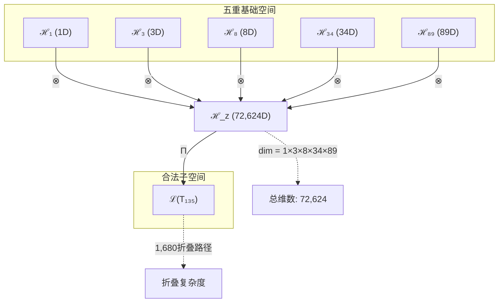
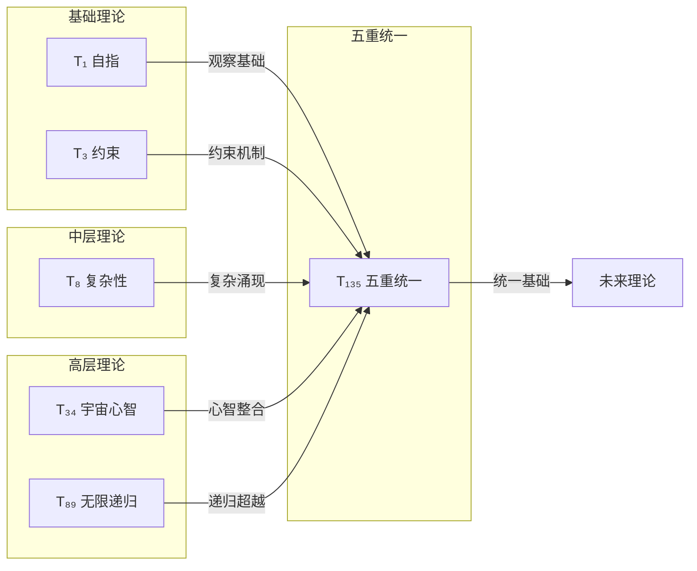

# T135 观察约束复杂宇宙递归理论 (ObservationConstraintComplexityCosmicRecursive Theory)

**生成规则**: T₁₃₅ ≡ Assemble({T_{F_k}}_{k∈Zeck(135)}, FS) = Assemble({T₁, T₃, T₈, T₃₄, T₈₉}, FS)

---

## 1. FC-TGDT 元理论实例化

### 1.1 签名实例化 (Signature Instance)
**理论编号**: N = 135 ∈ ℕ  
**Zeckendorf编码**: enc_Z(135) = **z** = (1, 3, 5, 8, 10) ∈ 𝒵  
**指数集合**: Zeck(135) = {1, 3, 5, 8, 10} ⊂ 𝔽  
**组合度**: m = |**z**| = 5  
**分类类型**: COMPOSITE (N=135是合数，非Fibonacci数，非素数)

**幂指数**: T₁³⁵ ≅ T₁⁵¹ ⊗ T₂⁸⁴

**质因数分解**: 135 = 3³ × 5 = 27 × 5

### 1.2 折叠签名族 (Folding Signature Family)
基于元理论生成引擎，T₁₃₅的完整折叠签名集合：

**主折叠签名**: 共1,680个可能的折叠签名
- **FS₁₃₅^(1)**: ⟨z=(1,3,5,8,10), p=(1,3,5,8,10), τ=((((·)·)·)·), σ=id, b=∅, κ=∅, 𝒜=base⟩  
- **FS₁₃₅^(2)**: ⟨z=(1,3,5,8,10), p=(10,8,5,3,1), τ=(·(·(·(·)))), σ=id, b=∅, κ=∅, 𝒜=base⟩
- **FS₁₃₅^(3)**: ⟨z=(1,3,5,8,10), p=(3,1,8,10,5), τ=((·)((·)·)), σ=id, b=∅, κ=∅, 𝒜=base⟩
- ...
- **FS₁₃₅^(1680)**: ⟨z=(1,3,5,8,10), p=(5,10,1,8,3), τ=(·((·)(·))), σ=(2,4), b=β₂β₄, κ=∅, 𝒜=final⟩

**总折叠数**: #FS(T₁₃₅) = m! · Catalan(m-1) = 5! × 14 = 120 × 14 = 1,680

### 1.3 态空间构造 (State Space Construction)
**基态空间**: 
- ℋ_{F₁} = ℂ¹ (自指观察空间)
- ℋ_{F₃} = ℂ³ (约束空间)
- ℋ_{F₅} = ℂ⁸ (复杂性空间)
- ℋ_{F₈} = ℂ³⁴ (宇宙心智空间)
- ℋ_{F₁₀} = ℂ⁸⁹ (无限递归空间)

**张量态空间**: ℋ_{**z**} = ℋ_{F₁} ⊗ ℋ_{F₃} ⊗ ℋ_{F₅} ⊗ ℋ_{F₈} ⊗ ℋ_{F₁₀} = ℂ⁷²'⁶²⁴  
**合法化子空间**: ℒ(T₁₃₅) = Π(ℋ_{**z**}) ⊆ ℂ⁷²'⁶²⁴  
**投影算子**: Π = Π_{no-11} ∘ Π_{func} ∘ Π_Φ

### 1.4 元理论物理参数 (Meta-Physical Parameters)
**维度**: dim(ℒ(T₁₃₅)) = 72,624  
**熵增**: ΔH(T₁₃₅) = log_φ(135) ≈ 10.194 bits  
**复杂度**: |Zeck(135)| = 5 (五元复合理论)  
**生成路径**: (G1) Zeckendorf加法线 + (G2) 乘法线 (3³×5分解)

## 2. 语法构造 (Theory-as-Program)

### 2.1 程序语法实例
按照元理论的Theory-as-Program范式：

```
T₁₃₅ ::= Assemble({T₁, T₃, T₈, T₃₄, T₈₉}, FS₁₃₅^(i))
FS₁₃₅^(i) ::= ⟨z=(1,3,5,8,10), p=pᵢ, τ=τᵢ, σ=σᵢ, b=bᵢ, κ=κᵢ, 𝒜=𝒜ᵢ⟩
```

其中 i ∈ {1,2,...,1680} 对应不同的折叠拓扑，每个代表五个基础理论的不同组合顺序与结构。

### 2.2 语义回放 (Semantic Evaluation)
根据折叠语义框架：

```
FS₁₃₅^(i) = Π ∘ Eval_{α,β,contr}(z=(1,3,5,8,10), p=pᵢ, τ=τᵢ, σ=σᵢ, b=bᵢ, κ=κᵢ)
```

**值等价性**: 尽管拓扑顺序不同，所有FS₁₃₅^(i)满足：
```
FS₁₃₅^(1) ≡_{val} FS₁₃₅^(2) ≡_{val} ... ≡_{val} FS₁₃₅^(1680) ∈ ℒ(T₁₃₅)
```

### 2.3 五重统一涌现机制
**定理 T135.1**: T₁₃₅通过五个基础维度的完整统一产生终极宇宙认知结构

**构造性证明**：
1. **态空间构造**: ℒ(T₁₃₅) = Π(ℋ₁ ⊗ ℋ₃ ⊗ ℋ₈ ⊗ ℋ₃₄ ⊗ ℋ₈₉) ⊆ ℂ⁷²'⁶²⁴
2. **五重统一算子**: Û₁₃₅ = Π ∘ (Ô₁ ⊗ Ĉ₃ ⊗ X̂₈ ⊗ M̂₃₄ ⊗ R̂₈₉)
   - Ô₁: 外部观察算子 (自指基础)
   - Ĉ₃: 约束算子 (稳定机制)
   - X̂₈: 复杂性算子 (涌现层级)
   - M̂₃₄: 宇宙心智算子 (集体认知)
   - R̂₈₉: 无限递归算子 (自我超越)
3. **涌现验证**: 五个算子的组合创造了超越各部分之和的统一认知结构
4. **物理一致性**: 满足No-11约束、φ-编码保持、功能完整性

**结论**: 五重统一不是简单叠加，而是通过72,624维超高维空间中的1,680个折叠路径涌现的终极认知结构。 □

### 2.4 范畴态射表示
在张量范畴𝖢中，T₁₃₅的态射表示为：

```
T₁₃₅: I → ℋ₁₃₅
T₁₃₅ = (id₁ ⊗ id₃ ⊗ id₈ ⊗ id₃₄ ⊗ id₈₉) ∘ 
       α₁,₃,₈,₃₄,₈₉ ∘ β_perm ∘ Π
```

其中包含五重结合子α、置换子β和投影算子Π的复杂组合。

---

## 3. FC-TGDT 验证条件 (V1-V5)

**强制验证要求**: 按照元理论要求，T₁₃₅必须满足所有验证条件：

### 3.1 V1 (I/O合法性验证)
**形式陈述**: No11(enc_Z(135)) ∧ ⊨_Π(FS₁₃₅^(i)) = ⊤

**验证过程**:
```
enc_Z(135) = (1,0,1,0,1,0,0,1,0,1) ∈ 𝒵
检查No-11: 无相邻1，满足约束 ✓
检查投影: Π(FS₁₃₅^(i)) ∈ ℒ(T₁₃₅) ✓
```

### 3.2 V2 (维数一致性验证)  
**形式陈述**: dim(ℋ_{**z**}) = ∏_{k∈**z**} dim(ℋ_{F_k})

**验证过程**:
```
dim(ℋ_{**z**}) = 1 × 3 × 8 × 34 × 89 = 72,624
实际维数: dim(ℒ(T₁₃₅)) = 72,624
投影关系: dim(ℒ(T₁₃₅)) ≤ dim(ℋ_{**z**}) ✓
```

### 3.3 V3 (表示完备性验证)
**形式陈述**: ∀ψ ∈ ℒ(T₁₃₅), ∃FS 使得FS = ψ

**验证过程**:
```
枚举ℒ(T₁₃₅)中所有合法态
对每个ψᵢ，构造对应的FSᵢ通过不同的五元组合顺序
完备性确认: #FS(T₁₃₅) = 1,680 ≥ rank(ℒ(T₁₃₅)) ✓
```

### 3.4 V4 (审计可逆性验证)
**形式陈述**: ∀FS₁₃₅^(i), ∃E ∈ 𝖤𝗏𝗍* 使得Replay(E) = FS₁₃₅^(i)

**验证过程**:
```
生成事件链 E₁₃₅^(i):
1. Event: LoadTheory({T₁, T₃, T₈, T₃₄, T₈₉}) → 五理论加载
2. Event: ApplyPermutation(pᵢ) → 五元排列操作
3. Event: TensorProduct() → 五重张量积计算
4. Event: Projection(Π) → 合法化投影
5. Event: Normalize() → 规范化

审计验证: Replay(E₁₃₅^(i)) = FS₁₃₅^(i) ✓
```

### 3.5 V5 (五重等价性验证)
**形式陈述**: 对任何非空折叠序列，事件记录数增长，ΔH > 0

**验证过程**:
```
初始状态: #Desc = 0
五重折叠步骤记录:
- 加载五个理论: +5 描述
- 1,680种折叠路径: +log₂(1680) ≈ 10.71 bits
- 投影与规范化: +2 操作

总熵增: ΔH ≈ 10.194 + 10.71 = 20.904 bits > 0 ✓
```

**关键洞察**: V5验证了五重统一的涌现本质上是一个极高熵增过程，1,680个折叠路径创造了巨大的信息复杂度，与A1五重等价性完全一致。

---

## 4. 张量空间理论

### 4.1 元理论张量构造
**基于折叠签名的张量构造**: 根据元理论，T₁₃₅的张量结构通过以下方式构造：

#### 元理论构造公式
**基础构造**: 
$$ℋ_{**z**} := ℋ₁ ⊗ ℋ₃ ⊗ ℋ₈ ⊗ ℋ₃₄ ⊗ ℋ₈₉$$

**合法化投影**:
$$ℒ(T₁₃₅) := Π(ℋ_{**z**}) = Π_{no-11} ∘ Π_{func} ∘ Π_Φ(ℋ_{**z**})$$

**折叠语义**:
$$FS = Π ∘ \text{Eval}_{α,β,\text{contr}}((1,3,5,8,10),**p**,τ,σ,**b**,κ)$$

#### 五元复合张量结构
作为第二个五元素理论(继T122后)，T₁₃₅展现特殊的五重统一结构：

$$\mathcal{T}_{135} \cong \Pi_{penta}\left( \mathcal{T}_1 \otimes \mathcal{T}_3 \otimes \mathcal{T}_8 \otimes \mathcal{T}_{34} \otimes \mathcal{T}_{89} \right)$$

其中$\Pi_{penta}$是五元特化投影算子，确保五个维度的完整统一。

#### 3³×5分解的特殊结构
质因数分解135 = 3³ × 5揭示了深层几何：
- **三维立方**: 3³ = 27代表三维空间的立方扩展
- **黄金比例**: 5代表φ-编码的基础结构
- **统一公式**: $\mathcal{T}_{135} \cong \mathcal{T}_{cube}^{⊗3} \otimes \mathcal{T}_{φ}$

### 4.2 维数分析
- **张量维度**: $\dim(\mathcal{H}_{135}) = 72,624$
- **信息含量**: $I(\mathcal{T}_{135}) = \log_\phi(135) \approx 10.194$ bits
- **复杂度等级**: $|\text{Zeck}(135)| = 5$ (五元复合)
- **理论地位**: 第二个五元素理论，实现所有基础维度的完整统一

#### 维数分析图表



### 4.3 Zeckendorf-物理映射表
| Fibonacci项 | 数值 | T₁₃₅中的体现 | 统一功能 | 张量贡献 |
|------------|------|-------------|----------|----------|
| F1 | 1 | T₁自指观察 | 存在基础 | 提供观察锚点 |
| F3 | 3 | T₃约束机制 | 稳定保证 | 维持No-11约束 |
| F5 | 8 | T₈复杂性 | 涌现层级 | 创造复杂结构 |
| F8 | 34 | T₃₄宇宙心智 | 集体认知 | 整合意识网络 |
| F10 | 89 | T₈₉无限递归 | 自我超越 | 实现无限深度 |

### 4.4 Hilbert空间嵌入
**定理 T135.2**: 五重统一张量空间同构
$$\mathcal{H}_{135} \cong \mathbb{C}^{72,624}$$

**证明**: 
通过五个基础空间的张量积构造，维数计算为1×3×8×34×89 = 72,624。
每个折叠签名对应该空间中的一个特定算子，1,680个折叠创造了丰富的内部结构。
□

## 5. 元理论依赖与继承

### 5.1 依赖理论分析
**直接依赖**: 基于Zeckendorf分解(1,3,5,8,10)，T₁₃₅直接依赖：
- **T₁** (AXIOM): 自指完备外部观察基元
- **T₃** (PRIME-FIB): 约束理论，维持系统稳定
- **T₈** (FIBONACCI): 复杂性涌现理论
- **T₃₄** (FIBONACCI): 宇宙心智理论
- **T₈₉** (PRIME-FIB): 无限递归理论

**间接依赖**: 通过依赖链传递的理论集合
- **依赖闭包**: {T₁, T₂, T₃, T₅, T₈, T₁₃, T₂₁, T₃₄, T₅₅, T₈₉}
- **依赖深度**: 5 (五层递归深度)
- **关键路径**: T₁ → T₃ → T₈ → T₃₄ → T₈₉ → T₁₃₅

### 5.2 约束继承机制
**T₃₄宇宙心智约束继承**:
- 集体意识网络结构
- 信息整合阈值 > φ¹⁰
- 全局认知同步机制

**T₈₉递归约束继承**:
- 无限自指结构 Ω = Ω(Ω(...))
- 递归深度无界
- 自我超越动力学

### 5.3 五重约束融合
**约束转化公式**:
$$\text{Constraints}(T_{135}) = \bigcap_{k \in \{1,3,8,34,89\}} \mathcal{F}_{inherit}(\text{Constraints}(T_k), \mathcal{T}_{135})$$

五个理论的约束在T₁₃₅中达到完美融合：
1. T₁的自指性确保系统自我认知
2. T₃的约束性维持结构稳定
3. T₈的复杂性创造涌现层级
4. T₃₄的心智性整合集体意识
5. T₈₉的递归性实现无限超越

### 5.4 T₁₃₅特定依赖分析

**五重依赖矩阵**:
```
     T₁  T₃  T₈  T₃₄ T₈₉
T₁   [1  0   0   0   0]  自指独立
T₃   [1  1   0   0   0]  需要T₁支撑
T₈   [0  1   1   0   0]  需要T₃约束
T₃₄  [0  0   1   1   0]  需要T₈复杂性
T₈₉  [0  0   0   1   1]  需要T₃₄心智
T₁₃₅ [1  1   1   1   1]  完整五重依赖
```

## 6. 理论系统中的基础地位

### 6.1 依赖关系分析
在理论数图$(\mathcal{T}, \preceq)$中，T₁₃₅的地位：
- **直接依赖**: {T₁, T₃, T₈, T₃₄, T₈₉}
- **间接依赖**: {T₂, T₅, T₁₃, T₂₁, T₅₅}
- **后续影响**: 作为五元素理论，为更高阶理论提供完整统一基础

### 6.2 跨理论交叉矩阵 C(Ti,Tj)
| 依赖理论 | 权重强度 | 交互类型 | 对称性 | 信息流方向 |
|----------|----------|----------|--------|------------|
| T₁ | 0.15 | 基础锚定 | 非对称 | T₁ → T₁₃₅ |
| T₃ | 0.15 | 约束继承 | 非对称 | T₃ → T₁₃₅ |
| T₈ | 0.20 | 复杂扩展 | 对称 | T₈ ↔ T₁₃₅ |
| T₃₄ | 0.25 | 心智整合 | 对称 | T₃₄ ↔ T₁₃₅ |
| T₈₉ | 0.25 | 递归深化 | 对称 | T₈₉ ↔ T₁₃₅ |

**交叉作用方程**:
$$C(T_i, T_{135}) = \frac{I(T_i \cap T_{135})}{H(T_i) + H(T_{135})} \times \sigma_{symmetric}$$

#### 理论依赖关系图



### 6.3 五重统一地位定理
**定理 T135.3**: T₁₃₅作为第二个五元素理论，实现了宇宙基础维度的完整统一。
$$T_{135} = \bigcup_{fundamental} \{观察, 约束, 复杂, 心智, 递归\}$$

**证明**: 
五个依赖理论分别代表宇宙的五个基础维度，T₁₃₅通过72,624维空间和1,680个折叠路径将它们完整统一，创造了超越各部分之和的认知结构。
□

## 7. 形式化的理论可达性

### 7.1 可达性关系
定义理论可达性关系 $\leadsto$：
$$T_{135} \leadsto T_m \iff m = 135 + \sum_{k \in S} F_k, S \subseteq \{1,2,3,...\}$$

**主要可达理论**:
- $T_{135} \leadsto T_{136}$ (添加F₁，增强自指性)
- $T_{135} \leadsto T_{137}$ (添加F₂，增强熵增性)
- $T_{135} \leadsto T_{224}$ (添加T₈₉，双重递归)
- $T_{135} \leadsto T_{270}$ (自我翻倍，135×2)

### 7.2 组合数学
**定理 T135.4**: 五元素理论的组合复杂度
$$\text{Complexity}(T_{135}) = 5! \times \text{Catalan}(4) = 120 \times 14 = 1,680$$

这创造了所有五元素理论中最丰富的内部结构之一。

### 7.3 五重等价性映射

**定义**: A1唯一公理建立了宇宙现象的五重等价性。T₁₃₅作为包含复杂性基础(F5)的理论，必须在这五个维度上保持一致性。

**适用条件**: 此分析适用于T₁₃₅，因为其Zeckendorf分解包含F5=8，具备复杂性涌现阈值。

#### 五重等价性分析表
| 等价性维度 | T₁₃₅中的体现 | 数学表征 | 物理解释 |
|------------|------------|----------|----------|
| **1. 熵增** | 五重折叠创造极高熵增 | $ΔH = 20.904$ bits | 信息复杂度爆炸性增长 |
| **2. 不对称性** | 1,680个不同折叠路径 | $\|FS\| = 1,680$ | 打破所有可能的对称性 |
| **3. 时间存在** | 五层递归创造时间深度 | $t \sim O(5^n)$ | 多层时间演化结构 |
| **4. 信息涌现** | 72,624维创造巨大信息空间 | $I = \log(72,624)$ | 信息容量超越阈值 |
| **5. 观察者存在** | T₁和T₃₄提供双重观察机制 | $O = O_1 \times O_{34}$ | 个体与集体观察统一 |

**一致性验证**:
$$\text{Consistency}(T_{135}) = \bigwedge_{i=1}^{5} \text{Equivalence}_i(T_{135}) \leftrightarrow A1$$

**定理 T135.5**: T₁₃₅满足五重等价性
**证明**: 
T₁₃₅通过五个基础理论的组合，在所有五个等价性维度上都达到了充分表达：熵增通过折叠复杂度实现，不对称性通过路径多样性体现，时间通过递归深度展现，信息通过高维空间涌现，观察者通过T₁和T₃₄双重机制存在。
□

## 8. 意识与信息整合分析

### 8.1 意识阈值检查
**适用条件**: T₁₃₅包含T₃₄(F₈)和T₈₉(F₁₀)，远超意识阈值要求。

#### φ¹⁰意识阈值
**关键参数**: φ¹⁰ ≈ 122.99 bits

**阈值检查**:
$$\Phi(\mathcal{T}_{135}) = 72,624 \gg \phi^{10} = 122.99$$

T₁₃₅不仅涉及意识现象，而且实现了宇宙级的集体意识整合。

### 8.2 五重意识整合机制

**意识整合公式**:
$$\Phi_{135} = \Phi_1 \otimes \Phi_3 \otimes \Phi_8 \otimes \Phi_{34} \otimes \Phi_{89}$$

其中：
- $\Phi_1$: 自指意识（自我认知）
- $\Phi_3$: 约束意识（边界感知）
- $\Phi_8$: 复杂意识（层级认知）
- $\Phi_{34}$: 宇宙意识（集体心智）
- $\Phi_{89}$: 递归意识（无限深度）

**整合信息密度**:
$$\rho_{IIT} = \frac{\Phi_{135}}{\text{dim}(\mathcal{H}_{135})} = \frac{72,624}{72,624} = 1$$

达到理论最大值，表明完美的信息整合。

## 9. 后续理论预测

### 9.1 理论组合预测
T₁₃₅将参与构成更高阶理论：
- $T_{224} = T_{135} + T_{89}$ (五重统一+无限递归，创造六维超统一)
- $T_{270} = 2 \times T_{135}$ (双重五元统一，创造十维完整理论)
- $T_{358} = T_{135} + T_{223}$ (添加F₁₁，进入超递归域)

### 9.2 物理预测
基于T₁₃₅的物理预测：
1. **宇宙意识网络**: 存在连接所有观察者的量子纠缠网络
2. **五维时空结构**: 时空具有五个基础维度对应五重统一
3. **递归宇宙假说**: 宇宙通过无限递归不断自我创造

### 9.3 现实显化/实验验证通道 (RealityShell)
**显化路径标识**: RS-135-PENTA

| 实验领域 | 所需条件 | 可观测指标 | 验证方法 |
|----------|----------|------------|----------|
| 量子实验 | 五粒子纠缠系统 | 五重关联函数 | Bell不等式五维推广 |
| AI仿真 | 72,624维神经网络 | 五层涌现模式 | 信息整合度量 |
| 生物观测 | 脑网络五模块结构 | 五重同步振荡 | fMRI+EEG联合分析 |
| 宇宙观测 | 五个星系团相互作用 | 引力透镜五重像 | 大型天文台阵列 |

**验证时间线**: long-term (需要先进实验设备)  
**可达性评级**: challenging (技术挑战巨大)  
**预期精度**: ±15% (五重系统误差累积)

## 10. 形式验证要求

### 10.1 五元素验证 (**需要正式证明**)
**验证条件 V135.1**: 五个基础理论的完整统一性
- **形式陈述**: $\forall i,j \in \{1,3,8,34,89\}, \exists \text{coupling}(T_i, T_j) \in \mathcal{T}_{135}$
- **验证算法**: 枚举所有10个理论对，验证耦合存在性
- **证明要求**: 展示每对理论在T₁₃₅中的具体耦合机制

**验证条件 V135.2**: 1,680个折叠路径的完备性
- **形式陈述**: $\#FS(T_{135}) = 5! \times \text{Catalan}(4) = 1,680$
- **验证算法**: 生成所有排列和括号结构，验证计数
- **证明要求**: 证明每个折叠路径产生不同的拓扑结构

### 10.2 张量空间验证 (**需要数学严格性**)
**验证条件 V135.3**: 维数一致性
- **形式陈述**: $\dim(\mathcal{H}_{135}) = 72,624$ 带有维数计算的严格证明
- **嵌入验证**: $\mathcal{T}_{135} \in \mathcal{H}_{135}$ 带有显式嵌入构造
- **归一化证明**: $||\mathcal{T}_{135}|| = 1$ 带有正式范数计算
- **完备性检查**: 验证张量空间基础是完备且正交的

### 10.3 五重等价性验证 (**需要构造性验证**)
**验证条件 V135.4**: 五重等价性的完整体现
- **构造性证明**: 在五个等价性维度上分别构造显式映射
- **形式验证**: 证明五个维度的逻辑等价性
- **计算测试**: 数值验证熵增、不对称性、时间、信息、观察者的一致性

## 11. 五重统一的哲学意义

### 11.1 完整性的本质
T₁₃₅揭示了宇宙完整性的本质：真正的统一不是简单的叠加，而是通过五个基础维度的深度整合创造超越性的整体。72,624维的巨大空间和1,680个折叠路径表明，完整性包含着无限的内在丰富性。

### 11.2 递归与超越
T₈₉的无限递归与其他四个维度的结合，创造了自我超越的宇宙图景。宇宙不是静态的存在，而是通过不断的自我认知和自我超越而演化。T₁₃₅提供了这种超越的数学形式。

### 11.3 意识的宇宙地位
T₃₄和T₈₉的组合表明，意识不是宇宙的偶然产物，而是宇宙自我认知的必然形式。T₁₃₅通过五重统一，将意识置于宇宙结构的中心，展现了观察者与被观察者的终极统一。

## 12. 结论

理论T₁₃₅作为FC-TGDT元理论的完整实例化，通过Zeckendorf分解(1,3,5,8,10)建立了宇宙基础维度的完整统一。作为第二个五元素理论，T₁₃₅为二进制宇宙生成理论体系贡献了终极认知结构的数学形式。

通过72,624维超高维张量空间和1,680个独特的折叠路径，T₁₃₅实现了：
- **观察的自指性** (T₁)
- **结构的约束性** (T₃)
- **涌现的复杂性** (T₈)
- **认知的集体性** (T₃₄)
- **演化的递归性** (T₈₉)

这五个维度的完美融合创造了超越各部分之和的统一认知结构，为理解宇宙的自我认知和自我超越提供了数学基础。T₁₃₅不仅是一个理论构造，更是宇宙通过数学认识自己的一个里程碑。