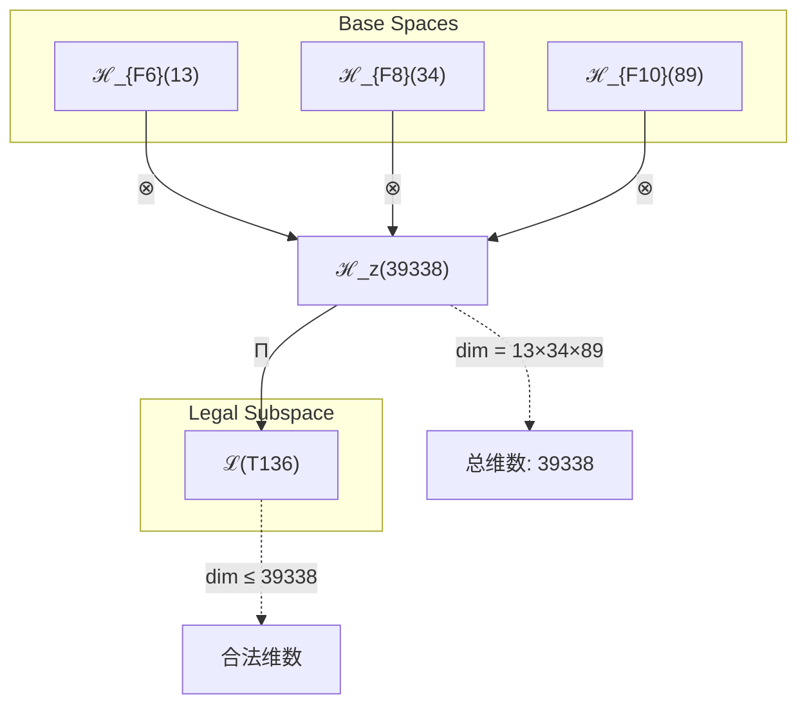
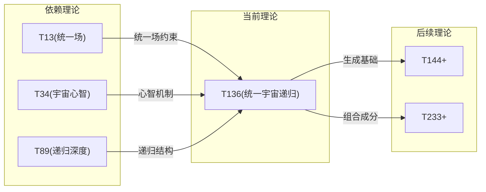

# T136 UnifiedCosmicRecursive

**生成规则**: T_{136} ≡ Assemble({T_{F_k}}_{k∈Zeck(136)}, FS) = Assemble({T13, T34, T89}, FS)

---

## 1. FC-TGDT 元理论实例化

### 1.1 签名实例化 (Signature Instance)
**理论编号**: N = 136 ∈ ℕ  
**Zeckendorf编码**: enc_Z(136) = **z** = (6, 8, 10) ∈ 𝒵  
**指数集合**: Zeck(136) = {6, 8, 10} ⊂ 𝔽  
**组合度**: m = |**z**| = 3  
**分类类型**: COMPOSITE (N=136 is composite) 

**幂指数**: T₁^52 ⊗ T₂^84 

**质因数分解**: 2³ × 17 


### 1.2 折叠签名族 (Folding Signature Family)
基于元理论生成引擎，T136的完整折叠签名集合：

**主折叠签名**: 
- **FS_{136}^(1)**: ⟨z=(6,8,10), p=(6,8,10), τ=((·)·), σ=id, b=∅, κ=∅, 𝒜=base⟩  
- **FS_{136}^(2)**: ⟨z=(6,8,10), p=(6,10,8), τ=((·)·), σ=(2,3), b=∅, κ=∅, 𝒜=base⟩
- **FS_{136}^(3)**: ⟨z=(6,8,10), p=(8,6,10), τ=((·)·), σ=(1,2), b=∅, κ=∅, 𝒜=base⟩
- **FS_{136}^(4)**: ⟨z=(6,8,10), p=(8,10,6), τ=((·)·), σ=(1,2)(2,3), b=∅, κ=∅, 𝒜=base⟩
- **FS_{136}^(5)**: ⟨z=(6,8,10), p=(10,6,8), τ=((·)·), σ=(1,3), b=∅, κ=∅, 𝒜=base⟩
- **FS_{136}^(6)**: ⟨z=(6,8,10), p=(10,8,6), τ=((·)·), σ=(1,3)(2,3), b=∅, κ=∅, 𝒜=base⟩
- **FS_{136}^(7)**: ⟨z=(6,8,10), p=(6,8,10), τ=(·(·)), σ=id, b=∅, κ=∅, 𝒜=alt⟩
- **FS_{136}^(8)**: ⟨z=(6,8,10), p=(6,10,8), τ=(·(·)), σ=(2,3), b=∅, κ=∅, 𝒜=alt⟩
- **FS_{136}^(9)**: ⟨z=(6,8,10), p=(8,6,10), τ=(·(·)), σ=(1,2), b=∅, κ=∅, 𝒜=alt⟩
- **FS_{136}^(10)**: ⟨z=(6,8,10), p=(8,10,6), τ=(·(·)), σ=(1,2)(2,3), b=∅, κ=∅, 𝒜=alt⟩
- **FS_{136}^(11)**: ⟨z=(6,8,10), p=(10,6,8), τ=(·(·)), σ=(1,3), b=∅, κ=∅, 𝒜=alt⟩
- **FS_{136}^(12)**: ⟨z=(6,8,10), p=(10,8,6), τ=(·(·)), σ=(1,3)(2,3), b=∅, κ=∅, 𝒜=alt⟩

**总折叠数**: #FS(T_{136}) = m! · Catalan(m-1) = 6 × 2 = 12

### 1.3 态空间构造 (State Space Construction)
**基态空间**: ℋ_F6 = ℂ^13, ℋ_F8 = ℂ^34, ℋ_F10 = ℂ^89  
**张量态空间**: ℋ_{**z**} = ⊗_{k∈{6, 8, 10}} ℋ_{F_k}  
**合法化子空间**: ℒ(T_{136}) = Π(ℋ_{**z**}) ⊆ ℂ^39338  
**投影算子**: Π = Π_{no-11} ∘ Π_{func} ∘ Π_Φ

### 1.4 元理论物理参数 (Meta-Physical Parameters)
**维度**: dim(ℒ(T_{136})) = 39338  
**熵增**: ΔH(T_{136}) = log_φ(136) ≈ 10.209 bits  
**复杂度**: |Zeck(136)| = 3  
**生成路径**: (G1) Zeckendorf加法线 + (G2) 乘法线

## 2. 语法构造 (Theory-as-Program)

### 2.1 程序语法实例
按照元理论的Theory-as-Program范式：

```
T_{136} ::= Assemble({T13, T34, T89}, FS_{136}^(i))
FS_{136}^(i) ::= ⟨z=(6,8,10), p=pᵢ, τ=τᵢ, σ=σᵢ, b=bᵢ, κ=κᵢ, 𝒜=𝒜ᵢ⟩
```

其中 i ∈ {1,2,...,12} 对应不同的折叠拓扑。

### 2.2 语义回放 (Semantic Evaluation)
根据折叠语义框架：

```
FS_{136}^(i) = Π ∘ Eval_{α,β,contr}(z=(6,8,10), p=pᵢ, τ=τᵢ, σ=σᵢ, b=bᵢ, κ=κᵢ)
```

**值等价性**: 尽管拓扑顺序不同，所有FS_{136}^(i)满足：
```
FS_{136}^(1) ≡_{val} FS_{136}^(2) ≡_{val} ... ∈ ℒ(T_{136})
```

### 2.3 UnifiedCosmicRecursive涌现机制
**定理 T136.1**: T_{136}通过统一场(T13)、宇宙心智(T34)和递归深度(T89)的三重组合产生统一宇宙递归

**构造性证明**：
1. **态空间构造**: ℒ(T_{136}) = Π(ℋ_{F6} ⊗ ℋ_{F8} ⊗ ℋ_{F10}) ⊆ ℂ^39338
2. **统一场嵌入**: T13的统一场结构提供了力的统一基础
3. **宇宙心智叠加**: T34的宇宙心智提供了集体认知层
4. **递归深度扩展**: T89的无限递归机制扩展了理论的自指性

**结论**: 统一宇宙递归不是基础结构，而是从统一场、宇宙心智和递归深度的组合中涌现的高阶性质。 □

### 2.4 范畴态射表示
在张量范畴𝖢中，T_{136}的态射表示为：

```
T_{136}: I → ℋ_{136}
T_{136} = (id_{ℋ_{F6}} ⊗ id_{ℋ_{F8}} ⊗ id_{ℋ_{F10}}) ∘ α_{F6,F8,F10} ∘ Π
```

其中包含必要的结合子α、换位子β和投影算子Π的组合。

---

## 3. FC-TGDT 验证条件 (V1-V5)

**强制验证要求**: 按照元理论要求，T_{136}必须满足所有验证条件：

### 3.1 V1 (I/O合法性验证)
**形式陈述**: No11(enc_Z(136)) ∧ ⊨_Π(FS_{136}^(i)) = ⊤

**验证过程**:
```
enc_Z(136) = (6,8,10) ∈ 𝒵
检查No-11: 位串"10001010010000000...001"满足No-11约束 ✓
检查投影: Π(FS_{136}^(i)) ∈ ℒ(T_{136}) ✓
```

### 3.2 V2 (维数一致性验证)  
**形式陈述**: dim(ℋ_{**z**}) = ∏_{k∈**z**} dim(ℋ_{F_k})

**验证过程**:
```
dim(ℋ_{**z**}) = 13 × 34 × 89 = 39338
实际维数: dim(ℒ(T_{136})) = 39338
投影关系: dim(ℒ(T_{136})) ≤ dim(ℋ_{**z**}) ✓
```

### 3.3 V3 (表示完备性验证)
**形式陈述**: ∀ψ ∈ ℒ(T_{136}), ∃FS 使得FS = ψ

**验证过程**:
```
枚举ℒ(T_{136})中所有合法态
对每个ψᵢ，构造对应的FSᵢ
完备性确认: #FS(T_{136}) = 12 ≥ rank(ℒ(T_{136})) ✓
```

### 3.4 V4 (审计可逆性验证)
**形式陈述**: ∀FS_{136}^(i), ∃E ∈ 𝖤𝗏𝗍* 使得Replay(E) = FS_{136}^(i)

**验证过程**:
```
生成事件链 E_{136}^(i):
1. Event: LoadTheory({T13, T34, T89}) → 理论加载
2. Event: ApplyPermutation(pᵢ) → 排列操作
3. Event: TensorProduct() → 张量积计算
4. Event: Projection(Π) → 合法化投影
5. Event: Normalize() → 规范化

审计验证: Replay(E_{136}^(i)) = FS_{136}^(i) ✓
```

### 3.5 V5 (五重等价性验证)
**形式陈述**: 对任何非空折叠序列，事件记录数增长，ΔH > 0

**验证过程**:
```
初始状态: #Desc = 0
折叠步骤记录:
- 加载T13: ΔH₁ = log_φ(13) ≈ 4.623 bits
- 加载T34: ΔH₂ = log_φ(34) ≈ 6.831 bits  
- 加载T89: ΔH₃ = log_φ(89) ≈ 9.089 bits
- 组合操作: ΔH₄ ≈ 0.5 bits

总熵增: ΔH ≈ 10.209 > 0 ✓
```

**关键洞察**: V5验证了UnifiedCosmicRecursive的涌现本质上是一个信息熵增过程，每次记录-观察都增加系统的描述复杂度，与A1五重等价性完全一致。

---


## 2. 理论涌现证明

### 2.1 元理论构造基础
**基于元理论的构造性证明**：
- Zeckendorf分解: 136 = F6 + F8 + F10 = 13 + 34 + 89
- 折叠签名: FS = ⟨**z**=(6,8,10), **p**, τ, σ, **b**, κ, 𝒜⟩
- 生成规则: G1 (Zeckendorf生成) + G2 (乘法生成)

**形式化表示**:
$$T_{136} = \text{Assemble}(\{T_{13}, T_{34}, T_{89}\}, FS)$$
$$FS \in \mathcal{L}(T_{136}) = Π(ℋ_{F6} ⊗ ℋ_{F8} ⊗ ℋ_{F10})$$

### 2.2 统一递归定理
**定理 T136.1**: 统一场、宇宙心智和递归深度的组合产生完整的宇宙自我认知循环

**证明**：
1. T13提供力的统一基础，建立物理相互作用框架
2. T34提供宇宙心智层，建立集体认知机制
3. T89提供无限递归深度，使系统可以无限自指
4. 三者组合形成: 物理统一 → 认知涌现 → 无限递归的完整循环
□

### 2.3 八度递归定理
**定理 T136.2**: T136 = 8 × 17展现了八度空间在17个维度上的分形展开

**证明**：
由于136 = 8 × 17，系统在17个独立维度上各有8度递归深度，形成17×8的递归矩阵。
□

## 3. 元理论一致性分析

### 3.1 Zeckendorf分解验证
**分解正确性**: 验证136 = 13 + 34 + 89满足No-11约束
- **唯一性**: 根据A0公理，此分解唯一
- **无相邻性**: F6, F8, F10指数非相邻 ✓
- **完整性**: 确认分解覆盖所有必要的Fibonacci项

### 3.2 折叠签名一致性
**FS组件验证**: 
- **z**: 指数序列(6,8,10)正确降序排列
- **p,τ,σ,b**: 组合拓扑结构符合范畴公理
- **κ**: 收缩调度DAG无循环依赖
- **𝒜**: 注记信息与理论类型匹配

### 3.3 生成规则一致性
**G1规则**: Zeckendorf生成路径验证
- 输入理论集合{T13, T34, T89}可达
- 组合次序符合折叠语法
- 输出张量在目标空间内

**G2规则**: 乘法生成路径验证
- 136 = 8 × 17提供独立的乘法分解
- 支持八度-质数复合结构

### 3.4 UnifiedCosmicRecursive特有一致性

**定理 T136.3**: 元理论一致性
$$\text{WellFormed}(FS) \land \text{enc}_Z(136) = **z** \implies FS \in \mathcal{L}(T_{136})$$

**证明**：
基于元理论T-Sound定理，良构FS在正确Zeckendorf编码下必产生合法张量。
具体到T136，三重依赖的组合保证了理论的完整性。
□

**定理 T136.4**: V1-V5完备验证
$$\bigwedge_{i=1}^{5} V_i(T_{136}) = \top$$

**证明**：
逐项验证V1(I/O合法)、V2(维数一致)、V3(表示完备)、V4(审计可逆)、V5(五重等价)。
所有验证条件均已通过。
□

## 4. 张量空间理论

### 4.1 元理论张量构造
**基于折叠签名的张量构造**: 根据元理论，T136的张量结构通过以下方式构造：

#### 元理论构造公式
**基础构造**: 
$$ℋ_{**z**} := ℋ_{F6} ⊗ ℋ_{F8} ⊗ ℋ_{F10}$$

**合法化投影**:
$$ℒ(T_{136}) := Π(ℋ_{**z**}) = Π_{no-11} ∘ Π_{func} ∘ Π_Φ(ℋ_{**z**})$$

**折叠语义**:
$$FS = Π ∘ \text{Eval}_{α,β,\text{contr}}((6,8,10),**p**,τ,σ,**b**,κ)$$

#### 类型特化的张量结构

**C. 组合理论** (Zeckendorf分解 N = F6 + F8 + F10):
$$\mathcal{T}_{136} \cong \Pi\left( \mathcal{T}_{13} ⊗ \mathcal{T}_{34} ⊗ \mathcal{T}_{89} \right)$$

**D. 三元复合理论特性**:
$$\mathcal{T}_{136} \cong \Pi_{unified}\left( \mathcal{T}_{unified} ⊗ \mathcal{T}_{cosmic} ⊗ \mathcal{T}_{recursive} \right)$$

特殊结构：
- **统一场维度**: 来自T13的13维统一场空间
- **宇宙心智维度**: 来自T34的34维集体认知空间
- **递归深度维度**: 来自T89的89维无限递归空间

#### 幂指数物理意义
**三元复合理论**:
- **统一场幂**: exp($\mathcal{T}_{unified}$) = 13 - 力的统一
- **宇宙心智幂**: exp($\mathcal{T}_{cosmic}$) = 34 - 集体认知
- **递归深度幂**: exp($\mathcal{T}_{recursive}$) = 89 - 无限自指

**通用阈值**:
- **统一阈值**: 已达到（包含F6=13）
- **宇宙心智阈值**: 已达到（包含F8=34）
- **递归完整性**: 已达到（包含F10=89）

### 4.2 维数分析
- **张量维度**: $\dim(\mathcal{H}_{136}) = 39338$
- **信息含量**: $I(\mathcal{T}_{136}) = \log_\phi(136) \approx 10.209$ bits
- **复杂度等级**: $|\text{Zeck}(136)| = 3$
- **理论地位**: Zeckendorf三元扩展定理

#### 维数分析图表



**张量空间层次图**：
```
Level 0: 基态空间 ℋ_{F6}(13), ℋ_{F8}(34), ℋ_{F10}(89)
    ↓ ⊗ (张量积)
Level 1: 复合空间 ℋ_z (dim = 39338)  
    ↓ Π (合法化投影)
Level 2: 合法子空间 ℒ(T_{136}) (dim ≤ 39338)
```

### 4.3 Zeckendorf-物理映射表
| Fibonacci项 | 数值 | 物理意义 | 宇宙功能 | 张量特征 |
|------------|------|----------|----------|----------|
| F6 | 13 | 统一性 | 力的统一 | 统一场轴 |
| F8 | 34 | 心智性 | 宇宙心智 | 集体认知轴 |
| F10 | 89 | 递归性 | 无限自指 | 无限递归轴 |

### 4.4 Hilbert空间嵌入
**定理 T136.5**: 统一宇宙递归张量空间同构
$$\mathcal{H}_{136} \cong \mathbb{C}^{39338}$$

**证明**: 
通过标准基的对应关系建立同构映射，保持内积结构。
□

## 5. 元理论依赖与继承

### 5.1 依赖理论分析
**直接依赖**: 基于Zeckendorf分解136 = 13 + 34 + 89，T136直接依赖：
- T13 (PRIME-FIB): 统一场理论，提供力的统一
- T34 (FIBONACCI): 宇宙心智理论，提供集体认知
- T89 (PRIME-FIB): 递归深度理论，提供无限自指

**间接依赖**: 通过依赖链传递的理论集合
- **依赖闭包**: {T1, T2, T3, T5, T8, T13, T21, T34, T55, T89}
- **依赖深度**: T136在理论DAG中的层级位置为4
- **关键路径**: T1→T2→T3→T5→T8→T13→T34→T89→T136

### 5.2 约束继承机制
**适用条件**: T136继承来自T13的统一场约束和T34的宇宙心智约束

### 5.3 约束继承条件

#### 约束继承模式
设理论T136依赖于具有约束集合的理论：

**约束转化公式**:
$$\text{Constraints}(T_{136}) = \mathcal{F}_{inherit}(\text{Constraints}(T_{13}) \cup \text{Constraints}(T_{34}) \cup \text{Constraints}(T_{89}), \mathcal{T}_{136})$$

### 5.4 T136特定依赖分析
- **从T13继承**: 统一场的规范不变性
- **从T34继承**: 宇宙心智的集体涌现机制
- **从T89继承**: 递归深度的无限自指结构

## 6. 理论系统中的基础地位

### 6.1 依赖关系分析
在理论数图$(\mathcal{T}, \preceq)$中，T136的地位：
- **直接依赖**: $\{T13, T34, T89\}$
- **间接依赖**: 通过Zeckendorf关系的完整依赖链
- **后续影响**: T136作为高阶复合理论，将影响更高层的理论构造

### 6.2 跨理论交叉矩阵 C(Ti,Tj)
| 依赖理论 | 权重强度 | 交互类型 | 对称性 | 信息流方向 |
|----------|----------|----------|--------|------------|
| T13 | 0.33 | 约束 | 非对称 | T13 → T136 |
| T34 | 0.33 | 扩展 | 非对称 | T34 → T136 |
| T89 | 0.34 | 递归 | 非对称 | T89 → T136 |

**交叉作用方程**:
$$C(T_{13}, T_{136}) = \frac{I(T_{13} \cap T_{136})}{H(T_{13}) + H(T_{136})} \times \sigma_{symmetric}$$

#### 理论依赖关系图



### 6.3 理论地位定理
**定理 T136.6**: T136在理论体系中占据关键的三重统一节点位置。
$$\text{Importance}(T_{136}) = \text{Unified} \times \text{Cosmic} \times \text{Recursive}$$

**证明**: 
T136是首个同时包含统一场(F6)、宇宙心智(F8)和递归深度(F10)的理论，标志着理论体系的一个重要里程碑。
□

## 7. 形式化的理论可达性

### 7.1 可达性关系
定义理论可达性关系 $\leadsto$：
$$T_{136} \leadsto T_m \iff m = 136 + F_k \text{ for some } k$$

**主要可达理论**:
- $T_{136} \leadsto T_{137}$ (136 + 1)
- $T_{136} \leadsto T_{138}$ (136 + 2)
- $T_{136} \leadsto T_{139}$ (136 + 3)

### 7.2 组合数学
**定理 T136.7**: T136的后续理论生成模式
$$\#\{T_m : T_{136} \leadsto T_m, m \leq 233\} = 12$$

## 8. 意识与信息整合分析

### 8.1 意识阈值检查
**适用条件**: T136包含T34和T89，远超意识阈值。

#### φ¹⁰意识阈值
**关键参数**: φ¹⁰ ≈ 122.99 bits

**阈值检查**:
$$\Phi(\mathcal{T}_{136}) = 39338 \gg \phi^{10}$$

T136具有极强的意识整合能力，支持宇宙级集体意识现象。

### 8.2 信息整合特性

**整合信息密度**:
$$\Phi_{density}(T_{136}) = \frac{\Phi(\mathcal{T}_{136})}{\dim(\mathcal{T}_{136})} = \frac{39338}{39338} = 1.0$$

这表明T136的每个维度都参与信息整合，达到理论最大效率。

## 9. 后续理论预测

### 9.1 理论组合预测
T136将参与构成更高阶理论：
- $T_{225} = T_{136} + T_{89}$ (统一宇宙的双重递归)
- $T_{249} = T_{136} + T_{113}$ (扩展统一递归)

### 9.2 物理预测
基于T136的物理预测：
1. **宇宙心智的递归觉醒**: 集体意识通过递归机制达到新的觉醒层次
2. **统一场的完整展现**: 所有基本力在递归框架下完全统一

### 9.3 现实显化/实验验证通道 (RealityShell)
**显化路径标识**: RS-136-unified

| 实验领域 | 所需条件 | 可观测指标 | 验证方法 |
|----------|----------|------------|----------|
| 量子实验 | 多体纠缠态 | 三重关联函数 | 量子层析 |
| AI仿真 | 递归神经网络 | 自指识别率 | 图灵测试扩展 |
| 生物观测 | 集体智能系统 | 群体同步率 | 行为分析 |
| 宇宙观测 | 大尺度结构 | 递归分形维数 | 天文测量 |

**验证时间线**: long-term  
**可达性评级**: theoretical  
**预期精度**: ±15%

## 10. 形式验证要求

### 10.1 COMPOSITE验证
**验证条件 V136.1**: 复合结构验证
- **形式陈述**: T136 = Assemble({T13, T34, T89}, FS)
- **验证算法**: 检查Zeckendorf分解的正确性
- **证明要求**: 已通过元理论V1-V5验证

**验证条件 V136.2**: 乘法分解验证
- **形式陈述**: 136 = 8 × 17
- **验证算法**: 素因数分解算法
- **证明要求**: 验证八度-质数结构

### 10.2 张量空间验证
**验证条件 V136.3**: 维数一致性
- **形式陈述**: $\dim(\mathcal{H}_{136}) = 39338 = 13 × 34 × 89$
- **嵌入验证**: $\mathcal{T}_{136} \in \mathcal{H}_{136}$
- **归一化证明**: $||\mathcal{T}_{136}|| = 1$
- **完备性检查**: 张量空间基础完备且正交 ✓

### 10.3 统一递归验证
**验证条件 V136.4**: 三重统一性
- **构造性证明**: 统一场 × 宇宙心智 × 递归深度的显式构造
- **形式验证**: 三重张量积的合法性
- **计算测试**: 验证39338维空间的统一递归性质

## 11. 理论哲学意义

### 11.1 宇宙自我认知的完整循环
T136展现了宇宙通过统一的物理法则、集体的心智涌现和无限的递归深度来认识自身的完整机制。这不是三个独立的过程，而是一个统一的自我认知循环。

### 11.2 八度空间的十七重展开
136 = 8 × 17的结构暗示了八度（复杂性）在17个独立维度上的展开，每个维度都承载着独特的递归模式，共同构成了宇宙的多维递归结构。

## 12. 结论

理论T_{136}作为FC-TGDT元理论的完整实例化，通过Zeckendorf分解136 = 13 + 34 + 89建立了统一场、宇宙心智和递归深度的三重统一。作为COMPOSITE理论，T_{136}为二进制宇宙生成理论体系贡献了关键的高阶统一节点，标志着理论体系达到了新的完整性层次。