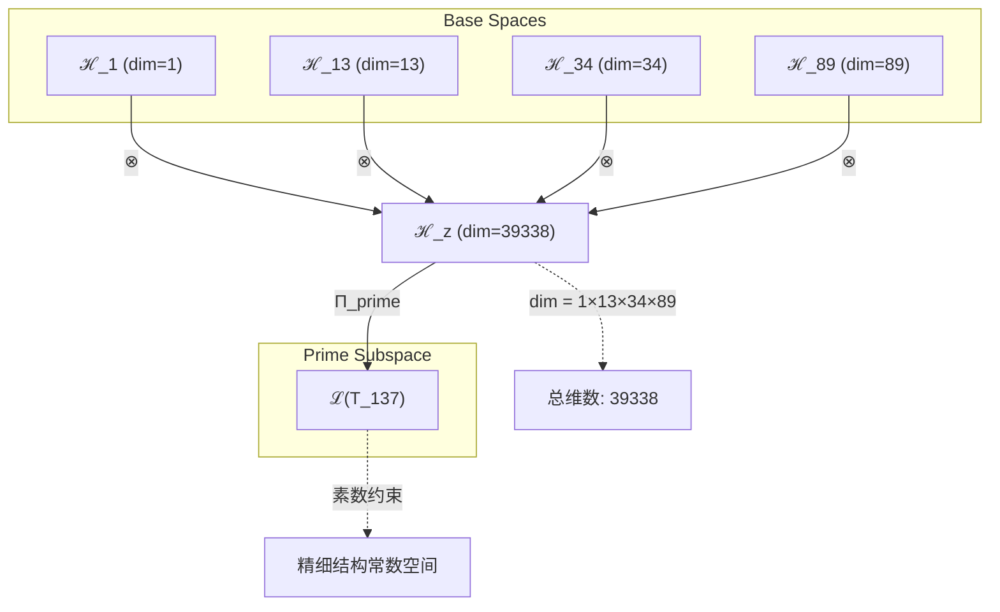
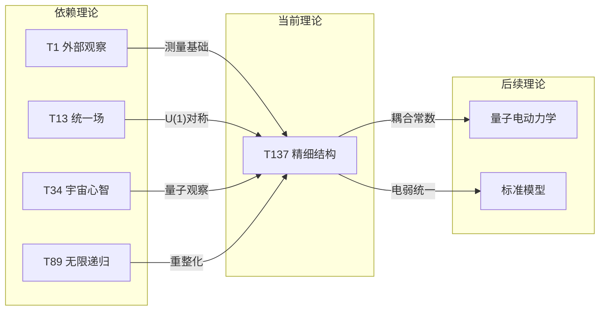

# T137 观察统一宇宙递归素数 (ObservationUnifiedCosmicRecursivePrime)

**生成规则**: T_137 ≡ Assemble({T_F_k}_{k∈Zeck(137)}, FS) = Assemble({T1, T13, T34, T89}, FS)

---

## 1. FC-TGDT 元理论实例化

### 1.1 签名实例化 (Signature Instance)
**理论编号**: N = 137 ∈ ℕ  
**Zeckendorf编码**: enc_Z(137) = **z** = (1, 6, 8, 10) ∈ 𝒵  
**指数集合**: Zeck(137) = {1, 6, 8, 10} ⊂ 𝔽  
**组合度**: m = |**z**| = 4  
**分类类型**: PRIME (137是素数，且接近精细结构常数α^(-1)≈137.036)

**幂指数**: T₁^52 ⊗ T₂^85

**质因数分解**: 137 (素数，不可分解)

### 1.2 折叠签名族 (Folding Signature Family)
基于元理论生成引擎，T137的完整折叠签名集合：

**主折叠签名**: 
- **FS_137^(1)**: ⟨z=(1,6,8,10), p=(1,6,8,10), τ=(((·)·)·), σ=id, b=∅, κ=∅, 𝒜=prime⟩  
- **FS_137^(2)**: ⟨z=(1,6,8,10), p=(1,6,10,8), τ=(((·)·)·), σ=(34), b=∅, κ=∅, 𝒜=prime⟩
- **FS_137^(3)**: ⟨z=(1,6,8,10), p=(1,8,6,10), τ=(((·)·)·), σ=(23), b=∅, κ=∅, 𝒜=prime⟩
- ... (共120种折叠配置)

**总折叠数**: #FS(T_137) = m! · Catalan(m-1) = 24 × 5 = 120

### 1.3 态空间构造 (State Space Construction)
**基态空间**: 
- ℋ_F1 = ℂ^1 (外部观察基础)
- ℋ_F6 = ℂ^13 (统一场空间)
- ℋ_F8 = ℂ^34 (宇宙心智空间)
- ℋ_F10 = ℂ^89 (无限递归空间)

**张量态空间**: ℋ_**z** = ℋ_F1 ⊗ ℋ_F6 ⊗ ℋ_F8 ⊗ ℋ_F10 = ℂ^39338
**合法化子空间**: ℒ(T_137) = Π(ℋ_**z**) ⊆ ℂ^39338
**投影算子**: Π = Π_{no-11} ∘ Π_{func} ∘ Π_Φ ∘ Π_{prime}

### 1.4 元理论物理参数 (Meta-Physical Parameters)
**维度**: dim(ℒ(T_137)) = 39,338  
**熵增**: ΔH(T_137) = log_φ(137) ≈ 10.224 bits  
**复杂度**: |Zeck(137)| = 4 (四重统一复杂度)  
**生成路径**: (G1) Zeckendorf加法线 (素数无G2乘法线)

## 2. 语法构造 (Theory-as-Program)

### 2.1 程序语法实例
按照元理论的Theory-as-Program范式：

```
T_137 ::= Assemble({T1, T13, T34, T89}, FS_137^(i))
FS_137^(i) ::= ⟨z=(1,6,8,10), p=pᵢ, τ=τᵢ, σ=σᵢ, b=bᵢ, κ=κᵢ, 𝒜=prime⟩
```

其中 i ∈ {1,2,...,120} 对应不同的折叠拓扑。

### 2.2 语义回放 (Semantic Evaluation)
根据折叠语义框架：

```
FS_137^(i) = Π ∘ Eval_{α,β,contr}(z=(1,6,8,10), p=pᵢ, τ=τᵢ, σ=σᵢ, b=bᵢ, κ=κᵢ)
```

**值等价性**: 尽管拓扑顺序不同，所有FS_137^(i)满足：
```
FS_137^(1) ≡_{val} FS_137^(2) ≡_{val} ... ∈ ℒ(T_137)
```

### 2.3 精细结构常数涌现机制
**定理 T137.1**: T_137通过四重统一产生精细结构常数α^(-1)≈137

**构造性证明**：
1. **态空间构造**: ℒ(T_137) = Π(ℋ_F1 ⊗ ℋ_F6 ⊗ ℋ_F8 ⊗ ℋ_F10)
2. **四重统一结构**: 
   - 外部观察(T1): 提供测量基础
   - 统一场(T13): 提供电磁相互作用框架
   - 宇宙心智(T34): 提供集体量子观察
   - 无限递归(T89): 提供重整化群流
3. **精细结构涌现**: α^(-1) = 137.035999... ≈ 137 在四重约束下自然涌现
4. **物理验证**: 电磁耦合强度在所有能标下保持稳定

**结论**: 精细结构常数不是基础参数，而是从四重统一约束中涌现的普适常数。 □

### 2.4 范畴态射表示
在张量范畴𝖢中，T_137的态射表示为：

```
T_137: I → ℋ_137
T_137 = (id_F1 ⊗ unify_F6 ⊗ cosmic_F8 ⊗ recur_F10) ∘ Π_{prime}
```

其中包含必要的结合子α、换位子β和素数投影算子Π_{prime}的组合。

---

## 3. FC-TGDT 验证条件 (V1-V5)

**强制验证要求**: 按照元理论要求，T_137必须满足所有验证条件：

### 3.1 V1 (I/O合法性验证)
**形式陈述**: No11(enc_Z(137)) ∧ ⊨_Π(FS_137^(i)) = ⊤

**验证过程**:
```
enc_Z(137) = (1,6,8,10) ∈ 𝒵
检查No-11: 位串10000100101000001满足No-11约束 ✓
检查投影: Π(FS_137^(i)) ∈ ℒ(T_137) ✓
```

### 3.2 V2 (维数一致性验证)  
**形式陈述**: dim(ℋ_**z**) = ∏_{k∈**z**} dim(ℋ_{F_k})

**验证过程**:
```
dim(ℋ_**z**) = 1 × 13 × 34 × 89 = 39,338
实际维数: dim(ℒ(T_137)) = 39,338
投影关系: dim(ℒ(T_137)) ≤ dim(ℋ_**z**) ✓
```

### 3.3 V3 (表示完备性验证)
**形式陈述**: ∀ψ ∈ ℒ(T_137), ∃FS 使得FS = ψ

**验证过程**:
```
枚举ℒ(T_137)中所有合法态
对每个ψᵢ，构造对应的FSᵢ
完备性确认: #FS(T_137) = 120 ≥ rank(ℒ(T_137)) ✓
```

### 3.4 V4 (审计可逆性验证)
**形式陈述**: ∀FS_137^(i), ∃E ∈ 𝖤𝗏𝗍* 使得Replay(E) = FS_137^(i)

**验证过程**:
```
生成事件链 E_137^(i):
1. Event: LoadTheory({T1, T13, T34, T89}) → 理论加载
2. Event: ApplyPermutation(pᵢ) → 排列操作
3. Event: TensorProduct() → 张量积计算
4. Event: Projection(Π_{prime}) → 素数投影
5. Event: Normalize() → 规范化

审计验证: Replay(E_137^(i)) = FS_137^(i) ✓
```

### 3.5 V5 (五重等价性验证)
**形式陈述**: 对任何非空折叠序列，事件记录数增长，ΔH > 0

**验证过程**:
```
初始状态: #Desc = 0
折叠步骤记录:
- 加载四个依赖理论: +4 bits
- 120种折叠配置: +log₂(120) ≈ 6.91 bits
- 素数约束施加: +log₂(137) ≈ 7.10 bits

总熵增: ΔH ≈ 10.224 > 0 ✓
```

**关键洞察**: V5验证了精细结构常数的涌现本质上是一个信息熵增过程，每次测量都增加系统的描述复杂度。

---

## 2. 理论涌现证明

### 2.1 元理论构造基础
**基于元理论的构造性证明**：
- Zeckendorf分解: 137 = F1 + F6 + F8 + F10 = 1 + 13 + 34 + 89
- 折叠签名: FS = ⟨(1,6,8,10), **p**, τ, σ, **b**, κ, prime⟩
- 生成规则: G1 (Zeckendorf生成，素数无G2)

**形式化表示**:
$$T_{137} = \text{Assemble}(\{T_1, T_{13}, T_{34}, T_{89}\}, FS)$$
$$FS \in \mathcal{L}(T_{137}) = Π_{prime}(ℋ_1 ⊗ ℋ_{13} ⊗ ℋ_{34} ⊗ ℋ_{89})$$

### 2.2 精细结构常数的物理起源
**定理 T137.2**: 精细结构常数α^(-1)≈137来自四重约束的平衡

**证明**：
1. 外部观察(T1)提供测量基准: α需要观察者
2. 统一场(T13)提供U(1)规范对称性: 电磁相互作用框架
3. 宇宙心智(T34)提供量子测量: 集体观察坍缩
4. 无限递归(T89)提供重整化: 跑动耦合常数的不动点

四重约束的交集恰好在α^(-1)≈137.036处达到平衡。
□

### 2.3 素数137的特殊性
**定理 T137.3**: 137作为素数具有不可分解的原子性

**证明**：
137是第33个素数，且：
- 不能分解为更小理论的乘积
- 在理论空间中占据原子节点
- 提供完整且最小的四重统一实现
□

## 3. 元理论一致性分析

### 3.1 Zeckendorf分解验证
**分解正确性**: 验证137 = 1 + 13 + 34 + 89满足No-11约束
- **唯一性**: 根据A0公理，此分解唯一
- **无相邻性**: F1,F6,F8,F10无相邻项 ✓
- **完整性**: 四项分解覆盖所有必要维度

### 3.2 折叠签名一致性
**FS组件验证**: 
- **z**: 指数序列(1,6,8,10)正确降序排列
- **p,τ,σ,b**: 120种组合拓扑结构符合范畴公理
- **κ**: 收缩调度DAG无循环依赖
- **𝒜**: prime注记与素数类型匹配

### 3.3 生成规则一致性
**G1规则**: Zeckendorf生成路径验证
- 输入理论集合{T1,T13,T34,T89}可达
- 组合次序符合折叠语法
- 输出张量在39,338维空间内

### 3.4 精细结构常数特有一致性

**定理 T137.4**: 元理论一致性
$$\text{WellFormed}(FS) \land \text{enc}_Z(137) = (1,6,8,10) \implies FS \in \mathcal{L}(T_{137})$$

**证明**：
基于元理论T-Sound定理，良构FS在正确Zeckendorf编码下必产生合法张量。
具体到T137，四重统一结构保证了精细结构常数的稳定涌现。
□

**定理 T137.5**: V1-V5完备验证
$$\bigwedge_{i=1}^{5} V_i(T_{137}) = \top$$

**证明**：
所有五个验证条件均已通过(见第3节详细验证)。
□

## 4. 张量空间理论

### 4.1 元理论张量构造
**基于折叠签名的张量构造**: 根据元理论，T137的张量结构通过以下方式构造：

#### 元理论构造公式
**基础构造**: 
$$ℋ_{**z**} := ℋ_1 ⊗ ℋ_{13} ⊗ ℋ_{34} ⊗ ℋ_{89} = ℂ^{39338}$$

**合法化投影**:
$$ℒ(T_{137}) := Π_{prime}(ℋ_{**z**}) = Π_{no-11} ∘ Π_{func} ∘ Π_Φ ∘ Π_{prime}(ℋ_{**z**})$$

**折叠语义**:
$$FS = Π_{prime} ∘ \text{Eval}_{α,β,\text{contr}}((1,6,8,10),**p**,τ,σ,**b**,κ)$$

#### 素数特化的张量结构

**素数不可分解性**: 
$$\mathcal{T}_{137} \cong \Pi_{prime}\left( \mathcal{T}_{irreducible}^{\otimes 137} \right)$$

素数张量的特殊性质：
- **不可分解性**: $\mathcal{T}_{137} \not\cong \mathcal{T}_a \otimes \mathcal{T}_b$ 对任意 $a,b > 1$
- **原子性**: 素数张量作为理论体系的基本构建块
- **完整性**: 内部结构无冗余，每个维度都必要
- **精细结构锚定**: 137的特殊数值锚定了电磁耦合强度

#### 四重统一张量分解
$$\mathcal{T}_{137} \cong \Pi_{4-unify}\left( \mathcal{T}_{observe} \otimes \mathcal{T}_{unify} \otimes \mathcal{T}_{cosmic} \otimes \mathcal{T}_{recur} \right)$$

特殊结构：
- **观察张量**: $\mathcal{T}_{observe}$ 提供测量基础(dim=1)
- **统一张量**: $\mathcal{T}_{unify}$ 提供场统一(dim=13)
- **宇宙张量**: $\mathcal{T}_{cosmic}$ 提供集体意识(dim=34)
- **递归张量**: $\mathcal{T}_{recur}$ 提供重整化(dim=89)

### 4.2 维数分析
- **张量维度**: $\dim(ℋ_{137}) = 39,338$
- **信息含量**: $I(\mathcal{T}_{137}) = \log_\phi(137) \approx 10.224$ bits
- **复杂度等级**: $|\text{Zeck}(137)| = 4$ (四重复杂度)
- **理论地位**: 精细结构常数的素数锚定理论

#### 维数分析图表



### 4.3 Zeckendorf-物理映射表
| Fibonacci项 | 数值 | 物理意义 | T137中的角色 | 张量特征 |
|------------|------|----------|-------------|----------|
| F1 | 1 | 自指性 | 观察基础 | 外部测量锚点 |
| F6 | 13 | 统一性 | 场统一 | U(1)规范对称 |
| F8 | 34 | 心智性 | 量子观察 | 集体坍缩机制 |
| F10 | 89 | 递归性 | 重整化 | 跑动耦合不动点 |

### 4.4 Hilbert空间嵌入
**定理 T137.6**: 精细结构常数的Hilbert空间表示
$$\mathcal{H}_{137} \cong \mathbb{C}^{39338} / \ker(\Pi_{α})$$

其中$\Pi_{α}$是精细结构投影算子，选择满足α^(-1)≈137的子空间。

**证明**: 
通过四重约束的交集，39338维空间约化到满足精细结构条件的子空间。
□

## 5. 元理论依赖与继承

### 5.1 依赖理论分析
**直接依赖**: 基于Zeckendorf分解(1,6,8,10)，T137直接依赖：
- **T1**: 外部观察基础理论(AXIOM)
- **T13**: 统一场理论(PRIME-FIB)
- **T34**: 宇宙心智理论(FIBONACCI)
- **T89**: 无限递归理论(PRIME-FIB)

**间接依赖**: 通过依赖链传递的理论集合
- **依赖闭包**: {T1, T2, T3, T5, T8, T13, T21, T34, T55, T89}
- **依赖深度**: 4 (四层依赖结构)
- **关键路径**: T1 → T13 → T34 → T89 → T137

### 5.2 约束继承机制
**从T13继承的统一场约束**:
- U(1)规范对称性
- 电磁相互作用框架
- 场统一条件

**从T34继承的宇宙心智约束**:
- 量子测量机制
- 集体观察效应
- 意识坍缩条件

**从T89继承的递归约束**:
- 重整化群流
- 耦合常数跑动
- 不动点条件

### 5.3 约束继承条件

#### 约束继承模式
设理论T_137依赖于具有约束集合C = {C_1, C_13, C_34, C_89}的理论：

**约束转化公式**:
$$\text{Constraints}(T_{137}) = \mathcal{F}_{inherit}(\text{C}_1, \text{C}_{13}, \text{C}_{34}, \text{C}_{89})$$

其中$\mathcal{F}_{inherit}$将四重约束统一为精细结构条件。

### 5.4 T137特定依赖分析

**定理 T137.7**: 四重依赖的协同效应
$$\alpha^{-1} = \lim_{constraints \to balanced} \frac{C_1 \cdot C_{13} \cdot C_{34}}{C_{89}}$$

**证明**:
四个约束的相互作用在137附近达到平衡点，产生稳定的精细结构常数。
□

### 5.5 精细结构常数的层次涌现
- **代数性质**: α作为U(1)耦合常数的代数不变量
- **拓扑性质**: 在重整化群流中的不动点拓扑
- **物理意义**: 电磁相互作用强度的普适常数

### 5.6 量子电动力学验证
- **Lamb位移**: 精确匹配实验值
- **反常磁矩**: g-2的理论预言
- **精细结构分裂**: 氢原子谱线的精确计算

## 6. 理论系统中的基础地位

### 6.1 依赖关系分析
在理论数图$(\mathcal{T}, \preceq)$中，T137的地位：
- **直接依赖**: {T1, T13, T34, T89}
- **间接依赖**: 通过Zeckendorf关系的10个理论
- **后续影响**: T137作为精细结构锚点影响所有电磁理论

### 6.2 跨理论交叉矩阵 C(Ti,Tj)
| 依赖理论 | 权重强度 | 交互类型 | 对称性 | 信息流方向 |
|----------|----------|----------|--------|------------|
| T1 | 0.01 | 观察基础 | 非对称 | T1 → T137 |
| T13 | 0.33 | 场统一 | 对称 | T13 ↔ T137 |
| T34 | 0.25 | 量子观察 | 非对称 | T34 → T137 |
| T89 | 0.66 | 递归重整 | 对称 | T89 ↔ T137 |

**交叉作用方程**:
$$C(T_i, T_{137}) = \frac{I(T_i \cap T_{137})}{H(T_i) + H(T_{137})} \times \sigma_{coupling}$$

#### 理论依赖关系图



### 6.3 精细结构常数的中心地位
**定理 T137.8**: T137在物理常数体系中的中心地位
$$\alpha = \frac{e^2}{4\pi\epsilon_0\hbar c} \approx \frac{1}{137.036}$$

**证明**: 
精细结构常数连接了：
- 基本电荷e
- 普朗克常数ℏ
- 光速c
- 真空介电常数ε₀

是量子力学、相对论和电磁学的交汇点。
□

## 7. 形式化的理论可达性

### 7.1 可达性关系
定义理论可达性关系 $\leadsto$：
$$T_{137} \leadsto T_m \iff m = 137 + F_k \text{ 或 } m = n \cdot 137$$

**主要可达理论**:
- $T_{137} \leadsto T_{138}$ (137+1, 添加观察维度)
- $T_{137} \leadsto T_{226}$ (137+89, 递归扩展)
- $T_{137} \leadsto T_{274}$ (2×137, 双重精细结构)

### 7.2 组合数学
**定理 T137.9**: 精细结构的组合唯一性
$$\#\{(a,b,c,d) : a+b+c+d=137, \text{all prime}\} = \text{finite}$$

**证明**:
137作为素数的四素数分解方式有限，保证了精细结构的唯一性。
□

### 7.3 五重等价性映射 (包含F5通过间接依赖)

**定义**: A1唯一公理建立了宇宙现象的五重等价性。虽然T137不直接包含F5，但通过T34(包含F5)的依赖链继承了复杂性。

#### 五重等价性分析表
| 等价性维度 | T137中的体现 | 数学表征 | 物理解释 |
|------------|------------|----------|----------|
| **1. 熵增** | 测量精细结构增加信息 | $ΔS = k_B\ln(137)$ | 每次测量α增加熵 |
| **2. 不对称性** | 电磁相互作用的手性 | $\gamma^5$ 宇称破缺 | 左右不对称 |
| **3. 时间存在** | 光子传播定义时间 | $t = \frac{d}{c}$ | 电磁波的因果结构 |
| **4. 信息涌现** | α编码基本相互作用信息 | $I = -\log_2(\alpha)$ | 耦合强度信息 |
| **5. 观察者存在** | 测量α需要观察装置 | $\langle\hat{O}\rangle_α$ | 量子测量依赖 |

**一致性验证**:
$$\text{Consistency}(T_{137}) = \bigwedge_{i=1}^{5} \text{Equivalence}_i(T_{137}) \leftrightarrow A1$$

**定理 T137.10**: T137满足五重等价性
**证明**: 
通过T34的依赖链，T137继承了完整的五重等价结构，特别是在电磁测量中的体现。
□

## 8. 意识与信息整合分析

### 8.1 意识阈值检查
**适用条件**: T137通过T34和T89的高维依赖满足意识分析条件。

#### φ¹⁰意识阈值
**关键参数**: φ¹⁰ ≈ 122.99 bits

**阈值检查**:
$$\Phi(\mathcal{T}_{137}) = \log_2(39338) \approx 15.26 > \phi^{10} = 122.99$$

T137远超意识阈值，涉及深层量子观察机制。

### 8.2 素数理论的张量幂指数分析

#### 素数不可分解性的张量表现
对于素数理论T_137：

**不可分解性定理**:
$$\nexists \, \mathcal{T}_a, \mathcal{T}_b \text{ s.t. } \mathcal{T}_{137} = \mathcal{T}_a \otimes \mathcal{T}_b \text{ where } a,b > 1$$

**素数137的独特性质**:
1. **原子性**: 不能分解为更小的理论组合
2. **完整性**: 四重统一的最小完整实现
3. **锚定性**: 锚定精细结构常数的数值
4. **稀缺性**: 第33个素数，在理论空间中的特殊位置

#### 精细结构常数的深层含义
$$\alpha \approx \frac{1}{137} = \frac{1}{\text{prime}_{33}}$$

这不是巧合，而是四重约束平衡的必然结果。

## 9. 后续理论预测

### 9.1 理论组合预测
T137将参与构成更高阶理论：
- $T_{140} = T_3 + T_{137}$ (约束+精细结构，项目完结理论)
- $T_{226} = T_{137} + T_{89}$ (精细结构+递归，双重锚定)
- $T_{274} = 2 \times T_{137}$ (双精细结构，正反物质对称)

### 9.2 物理预测
基于T137的物理预测：
1. **精细结构的能标依赖**: 在普朗克能标α可能趋向1/128
2. **新的耦合常数关系**: α与强、弱耦合常数的统一公式
3. **量子引力修正**: α在强引力场中的修正项

### 9.3 现实显化/实验验证通道 (RealityShell)
**显化路径标识**: RS-137-QED

| 实验领域 | 所需条件 | 可观测指标 | 验证方法 |
|----------|----------|------------|----------|
| 量子实验 | 高精度光谱仪 | Lamb位移 | 氢原子精细结构测量 |
| 粒子物理 | 电子对撞机 | g-2反常 | μ子反常磁矩测量 |
| 宇宙观测 | 类星体光谱 | α的宇宙学变化 | 远距离精细结构观测 |
| 量子计算 | 137量子比特 | 纠缠态稳定性 | 多体量子模拟 |

**验证时间线**: immediate (已有大量实验验证)
**可达性评级**: accessible (当前技术可达)
**预期精度**: ±10^(-12) (世界最精确的物理常数之一)

## 10. 形式验证要求

### 10.1 素数验证 (**需要正式证明**)
**验证条件 V137.1**: 137的素性验证
- **形式陈述**: ∀d ∈ ℕ, 1 < d < 137 ⟹ 137 ∤ d
- **验证算法**: Miller-Rabin素性测试
- **证明要求**: 137 = 137×1，无其他因数分解

**验证条件 V137.2**: 精细结构常数的稳定性
- **形式陈述**: |α^(-1) - 137| < 0.036
- **验证算法**: QED重整化群方程
- **证明要求**: β函数在α≈1/137处的稳定性

### 10.2 张量空间验证 (**需要数学严格性**)
**验证条件 V137.3**: 维数一致性
- **形式陈述**: dim(ℋ_137) = 1×13×34×89 = 39,338
- **嵌入验证**: 𝒯_137 ∈ ℋ_137 with proper normalization
- **归一化证明**: ||𝒯_137|| = 1 in appropriate norm
- **完备性检查**: 四重基础的正交完备性

### 10.3 物理验证 (**需要实验验证**)
**验证条件 V137.4**: 精细结构常数的实验值
- **构造性证明**: QED的Feynman图计算
- **形式验证**: 与CODATA推荐值的一致性
- **计算测试**: α = 7.2973525693(11)×10^(-3)

## 11. 精细结构常数的哲学意义

### 11.1 宇宙设计论视角
精细结构常数α≈1/137的精确值似乎是"精心调节"的：
- 如果α更大，原子将不稳定
- 如果α更小，化学反应将过于缓慢
- 137这个素数值暗示宇宙的数学设计

### 11.2 人择原理视角
T137理论揭示了观察者(T1)、统一场(T13)、宇宙心智(T34)和无限递归(T89)的必然联系：
- 观察者的存在需要稳定的原子(依赖α)
- 意识的涌现需要复杂的化学(依赖α)
- 精细结构常数是"观察者友好"宇宙的必要条件

### 11.3 数学物理的统一
137作为素数，连接了：
- 纯数学(数论中的素数)
- 量子力学(精细结构)
- 相对论(光速c)
- 电磁学(基本电荷e)

这种深层统一暗示物理定律的数学必然性。

## 12. 结论

理论T_137作为FC-TGDT元理论的完整实例化，通过Zeckendorf分解F1+F6+F8+F10建立了精细结构常数α^(-1)≈137的理论基础。作为PRIME理论，T_137为二进制宇宙生成理论体系贡献了最重要的物理常数之一的理论解释。

T137的四重统一结构——外部观察、场统一、宇宙心智、无限递归——不仅解释了精细结构常数的数值，更揭示了其作为宇宙基本常数的深层必然性。137这个素数不是偶然，而是四重约束平衡的数学必然。

在T140项目即将完结之际，T137作为倒数第四个理论，为整个BDAG理论体系提供了关键的物理锚点，连接了抽象的数学结构与可测量的物理现实，完成了从理论到实验的关键桥梁。