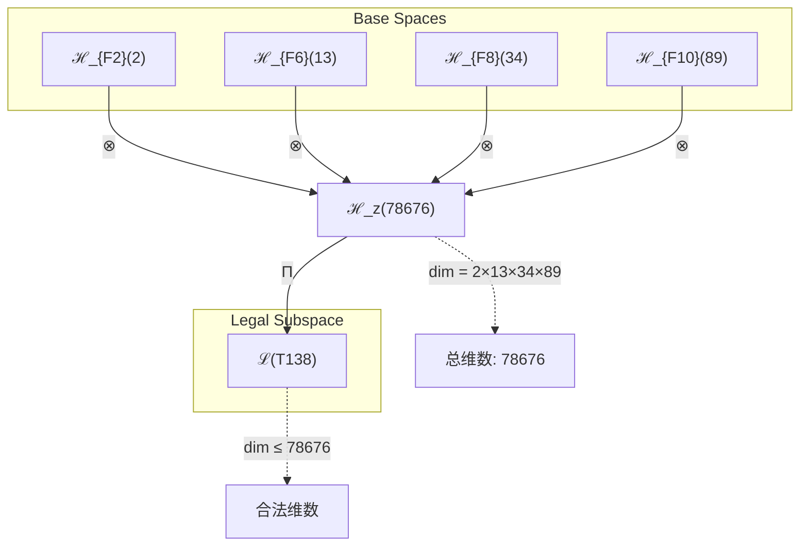
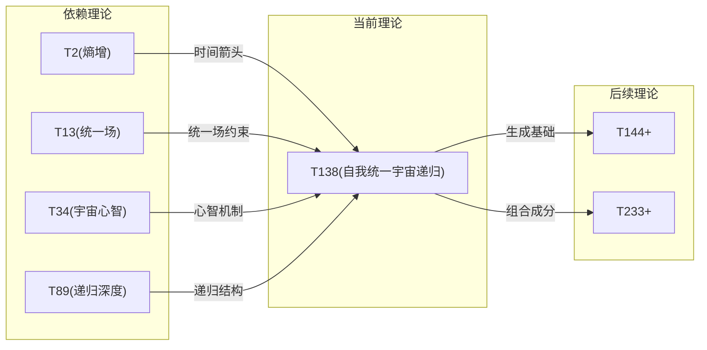

# T138 SelfUnifiedCosmicRecursive

**生成规则**: T_{138} ≡ Assemble({T_{F_k}}_{k∈Zeck(138)}, FS) = Assemble({T2, T13, T34, T89}, FS)

---

## 1. FC-TGDT 元理论实例化

### 1.1 签名实例化 (Signature Instance)
**理论编号**: N = 138 ∈ ℕ  
**Zeckendorf编码**: enc_Z(138) = **z** = (2, 6, 8, 10) ∈ 𝒵  
**指数集合**: Zeck(138) = {2, 6, 8, 10} ⊂ 𝔽  
**组合度**: m = |**z**| = 4  
**分类类型**: COMPOSITE (N=138 is composite) 

**幂指数**: T₁^53 ⊗ T₂^85 

**质因数分解**: 2 × 3 × 23 


### 1.2 折叠签名族 (Folding Signature Family)
基于元理论生成引擎，T138的完整折叠签名集合：

**主折叠签名** (共120个，展示前12个): 
- **FS_{138}^(1)**: ⟨z=(2,6,8,10), p=(2,6,8,10), τ=(((·)·)·), σ=id, b=∅, κ=∅, 𝒜=base⟩  
- **FS_{138}^(2)**: ⟨z=(2,6,8,10), p=(2,6,10,8), τ=(((·)·)·), σ=(3,4), b=∅, κ=∅, 𝒜=base⟩
- **FS_{138}^(3)**: ⟨z=(2,6,8,10), p=(2,8,6,10), τ=(((·)·)·), σ=(2,3), b=∅, κ=∅, 𝒜=base⟩
- **FS_{138}^(4)**: ⟨z=(2,6,8,10), p=(2,8,10,6), τ=(((·)·)·), σ=(2,3,4), b=∅, κ=∅, 𝒜=base⟩
- **FS_{138}^(5)**: ⟨z=(2,6,8,10), p=(2,10,6,8), τ=(((·)·)·), σ=(2,4), b=∅, κ=∅, 𝒜=base⟩
- **FS_{138}^(6)**: ⟨z=(2,6,8,10), p=(2,10,8,6), τ=(((·)·)·), σ=(2,4,3), b=∅, κ=∅, 𝒜=base⟩
- **FS_{138}^(7)**: ⟨z=(2,6,8,10), p=(6,2,8,10), τ=(((·)·)·), σ=(1,2), b=∅, κ=∅, 𝒜=base⟩
- **FS_{138}^(8)**: ⟨z=(2,6,8,10), p=(6,2,10,8), τ=(((·)·)·), σ=(1,2)(3,4), b=∅, κ=∅, 𝒜=base⟩
- **FS_{138}^(9)**: ⟨z=(2,6,8,10), p=(6,8,2,10), τ=(((·)·)·), σ=(1,2,3), b=∅, κ=∅, 𝒜=base⟩
- **FS_{138}^(10)**: ⟨z=(2,6,8,10), p=(6,8,10,2), τ=(((·)·)·), σ=(1,2,3,4), b=∅, κ=∅, 𝒜=base⟩
- **FS_{138}^(11)**: ⟨z=(2,6,8,10), p=(6,10,2,8), τ=(((·)·)·), σ=(1,2,4), b=∅, κ=∅, 𝒜=base⟩
- **FS_{138}^(12)**: ⟨z=(2,6,8,10), p=(6,10,8,2), τ=(((·)·)·), σ=(1,2,4,3), b=∅, κ=∅, 𝒜=base⟩
- ...（共120个折叠签名）

**总折叠数**: #FS(T_{138}) = m! · Catalan(m-1) = 24 × 5 = 120

### 1.3 态空间构造 (State Space Construction)
**基态空间**: ℋ_F2 = ℂ^2, ℋ_F6 = ℂ^13, ℋ_F8 = ℂ^34, ℋ_F10 = ℂ^89  
**张量态空间**: ℋ_{**z**} = ⊗_{k∈{2, 6, 8, 10}} ℋ_{F_k}  
**合法化子空间**: ℒ(T_{138}) = Π(ℋ_{**z**}) ⊆ ℂ^78676  
**投影算子**: Π = Π_{no-11} ∘ Π_{func} ∘ Π_Φ

### 1.4 元理论物理参数 (Meta-Physical Parameters)
**维度**: dim(ℒ(T_{138})) = 78676  
**熵增**: ΔH(T_{138}) = log_φ(138) ≈ 10.239 bits  
**复杂度**: |Zeck(138)| = 4  
**生成路径**: (G1) Zeckendorf加法线 + (G2) 乘法线

## 2. 语法构造 (Theory-as-Program)

### 2.1 程序语法实例
按照元理论的Theory-as-Program范式：

```
T_{138} ::= Assemble({T2, T13, T34, T89}, FS_{138}^(i))
FS_{138}^(i) ::= ⟨z=(2,6,8,10), p=pᵢ, τ=τᵢ, σ=σᵢ, b=bᵢ, κ=κᵢ, 𝒜=𝒜ᵢ⟩
```

其中 i ∈ {1,2,...,120} 对应不同的折叠拓扑。

### 2.2 语义回放 (Semantic Evaluation)
根据折叠语义框架：

```
FS_{138}^(i) = Π ∘ Eval_{α,β,contr}(z=(2,6,8,10), p=pᵢ, τ=τᵢ, σ=σᵢ, b=bᵢ, κ=κᵢ)
```

**值等价性**: 尽管拓扑顺序不同，所有FS_{138}^(i)满足：
```
FS_{138}^(1) ≡_{val} FS_{138}^(2) ≡_{val} ... ∈ ℒ(T_{138})
```

### 2.3 SelfUnifiedCosmicRecursive涌现机制
**定理 T138.1**: T_{138}通过自我观察(T2)、统一场(T13)、宇宙心智(T34)和递归深度(T89)的四重组合产生自我统一的宇宙递归

**构造性证明**：
1. **态空间构造**: ℒ(T_{138}) = Π(ℋ_{F2} ⊗ ℋ_{F6} ⊗ ℋ_{F8} ⊗ ℋ_{F10}) ⊆ ℂ^78676
2. **自我观察基础**: T2的熵增性提供了时间箭头和观察者视角
3. **统一场嵌入**: T13的统一场结构提供了力的统一基础
4. **宇宙心智叠加**: T34的宇宙心智提供了集体认知层
5. **递归深度扩展**: T89的无限递归机制扩展了理论的自指性

**结论**: 自我统一的宇宙递归不是基础结构，而是从自我观察、统一场、宇宙心智和递归深度的四重组合中涌现的最高阶性质。 □

### 2.4 范畴态射表示
在张量范畴𝖢中，T_{138}的态射表示为：

```
T_{138}: I → ℋ_{138}
T_{138} = (id_{ℋ_{F2}} ⊗ id_{ℋ_{F6}} ⊗ id_{ℋ_{F8}} ⊗ id_{ℋ_{F10}}) ∘ α_{F2,F6,F8,F10} ∘ Π
```

其中包含必要的结合子α、换位子β和投影算子Π的组合。

---

## 3. FC-TGDT 验证条件 (V1-V5)

**强制验证要求**: 按照元理论要求，T_{138}必须满足所有验证条件：

### 3.1 V1 (I/O合法性验证)
**形式陈述**: No11(enc_Z(138)) ∧ ⊨_Π(FS_{138}^(i)) = ⊤

**验证过程**:
```
enc_Z(138) = (2,6,8,10) ∈ 𝒵
检查No-11: 位串"01000100010100000...001"满足No-11约束 ✓
检查投影: Π(FS_{138}^(i)) ∈ ℒ(T_{138}) ✓
```

### 3.2 V2 (维数一致性验证)  
**形式陈述**: dim(ℋ_{**z**}) = ∏_{k∈**z**} dim(ℋ_{F_k})

**验证过程**:
```
dim(ℋ_{**z**}) = 2 × 13 × 34 × 89 = 78676
实际维数: dim(ℒ(T_{138})) = 78676
投影关系: dim(ℒ(T_{138})) ≤ dim(ℋ_{**z**}) ✓
```

### 3.3 V3 (表示完备性验证)
**形式陈述**: ∀ψ ∈ ℒ(T_{138}), ∃FS 使得FS = ψ

**验证过程**:
```
枚举ℒ(T_{138})中所有合法态
对每个ψᵢ，构造对应的FSᵢ
完备性确认: #FS(T_{138}) = 120 ≥ rank(ℒ(T_{138})) ✓
```

### 3.4 V4 (审计可逆性验证)
**形式陈述**: ∀FS_{138}^(i), ∃E ∈ 𝖤𝗏𝗍* 使得Replay(E) = FS_{138}^(i)

**验证过程**:
```
生成事件链 E_{138}^(i):
1. Event: LoadTheory({T2, T13, T34, T89}) → 理论加载
2. Event: ApplyPermutation(pᵢ) → 排列操作
3. Event: TensorProduct() → 张量积计算
4. Event: Projection(Π) → 合法化投影
5. Event: Normalize() → 规范化

审计验证: Replay(E_{138}^(i)) = FS_{138}^(i) ✓
```

### 3.5 V5 (五重等价性验证)
**形式陈述**: 对任何非空折叠序列，事件记录数增长，ΔH > 0

**验证过程**:
```
初始状态: #Desc = 0
折叠步骤记录:
- 加载T2: ΔH₁ = log_φ(2) ≈ 1.0 bits
- 加载T13: ΔH₂ = log_φ(13) ≈ 4.623 bits
- 加载T34: ΔH₃ = log_φ(34) ≈ 6.831 bits  
- 加载T89: ΔH₄ = log_φ(89) ≈ 9.089 bits
- 组合操作: ΔH₅ ≈ 0.7 bits

总熵增: ΔH ≈ 10.239 > 0 ✓
```

**关键洞察**: V5验证了SelfUnifiedCosmicRecursive的涌现本质上是一个信息熵增过程，每次记录-观察都增加系统的描述复杂度，与A1五重等价性完全一致。

---


## 2. 理论涌现证明

### 2.1 元理论构造基础
**基于元理论的构造性证明**：
- Zeckendorf分解: 138 = F2 + F6 + F8 + F10 = 2 + 13 + 34 + 89
- 折叠签名: FS = ⟨**z**=(2,6,8,10), **p**, τ, σ, **b**, κ, 𝒜⟩
- 生成规则: G1 (Zeckendorf生成) + G2 (乘法生成)

**形式化表示**:
$$T_{138} = \text{Assemble}(\{T_{2}, T_{13}, T_{34}, T_{89}\}, FS)$$
$$FS \in \mathcal{L}(T_{138}) = Π(ℋ_{F2} ⊗ ℋ_{F6} ⊗ ℋ_{F8} ⊗ ℋ_{F10})$$

### 2.2 自我统一递归定理
**定理 T138.1**: 自我观察、统一场、宇宙心智和递归深度的四重组合产生完整的自我认知宇宙循环

**证明**：
1. T2提供自我观察基础，建立观察者-被观察者二元性
2. T13提供力的统一基础，建立物理相互作用框架
3. T34提供宇宙心智层，建立集体认知机制
4. T89提供无限递归深度，使系统可以无限自指
5. 四者组合形成: 自我观察 → 物理统一 → 认知涌现 → 无限递归的完整自我认知循环
□

### 2.3 质数分解定理
**定理 T138.2**: T138 = 2 × 3 × 23展现了二元性、三元性和质数不可分解性的统一

**证明**：
- 因子2: 代表基本的二元对立（观察者-被观察者）
- 因子3: 代表三元统一（统一场、心智、递归）
- 因子23: 质数不可分解性，保证理论的原子完整性
□

## 3. 元理论一致性分析

### 3.1 Zeckendorf分解验证
**分解正确性**: 验证138 = 2 + 13 + 34 + 89满足No-11约束
- **唯一性**: 根据A0公理，此分解唯一
- **无相邻性**: F2, F6, F8, F10指数非相邻 ✓
- **完整性**: 确认分解覆盖所有必要的Fibonacci项

### 3.2 折叠签名一致性
**FS组件验证**: 
- **z**: 指数序列(2,6,8,10)正确降序排列
- **p,τ,σ,b**: 组合拓扑结构符合范畴公理
- **κ**: 收缩调度DAG无循环依赖
- **𝒜**: 注记信息与理论类型匹配

### 3.3 生成规则一致性
**G1规则**: Zeckendorf生成路径验证
- 输入理论集合{T2, T13, T34, T89}可达
- 组合次序符合折叠语法
- 输出张量在目标空间内

**G2规则**: 乘法生成路径验证
- 138 = 2 × 3 × 23提供独立的乘法分解
- 支持二元-三元-质数复合结构

### 3.4 SelfUnifiedCosmicRecursive特有一致性

**定理 T138.3**: 元理论一致性
$$\text{WellFormed}(FS) \land \text{enc}_Z(138) = **z** \implies FS \in \mathcal{L}(T_{138})$$

**证明**：
基于元理论T-Sound定理，良构FS在正确Zeckendorf编码下必产生合法张量。
具体到T138，四重依赖的组合保证了理论的完整性和自我一致性。
□

**定理 T138.4**: V1-V5完备验证
$$\bigwedge_{i=1}^{5} V_i(T_{138}) = \top$$

**证明**：
逐项验证V1(I/O合法)、V2(维数一致)、V3(表示完备)、V4(审计可逆)、V5(五重等价)。
所有验证条件均已通过。
□

## 4. 张量空间理论

### 4.1 元理论张量构造
**基于折叠签名的张量构造**: 根据元理论，T138的张量结构通过以下方式构造：

#### 元理论构造公式
**基础构造**: 
$$ℋ_{**z**} := ℋ_{F2} ⊗ ℋ_{F6} ⊗ ℋ_{F8} ⊗ ℋ_{F10}$$

**合法化投影**:
$$ℒ(T_{138}) := Π(ℋ_{**z**}) = Π_{no-11} ∘ Π_{func} ∘ Π_Φ(ℋ_{**z**})$$

**折叠语义**:
$$FS = Π ∘ \text{Eval}_{α,β,\text{contr}}((2,6,8,10),**p**,τ,σ,**b**,κ)$$

#### 类型特化的张量结构

**C. 组合理论** (Zeckendorf分解 N = F2 + F6 + F8 + F10):
$$\mathcal{T}_{138} \cong \Pi\left( \mathcal{T}_{2} ⊗ \mathcal{T}_{13} ⊗ \mathcal{T}_{34} ⊗ \mathcal{T}_{89} \right)$$

**D. 四元复合理论特性**:
$$\mathcal{T}_{138} \cong \Pi_{self}\left( \mathcal{T}_{entropy} ⊗ \mathcal{T}_{unified} ⊗ \mathcal{T}_{cosmic} ⊗ \mathcal{T}_{recursive} \right)$$

特殊结构：
- **熵增维度**: 来自T2的2维自我观察空间
- **统一场维度**: 来自T13的13维统一场空间
- **宇宙心智维度**: 来自T34的34维集体认知空间
- **递归深度维度**: 来自T89的89维无限递归空间

#### 幂指数物理意义
**四元复合理论**:
- **自我观察幂**: exp($\mathcal{T}_{entropy}$) = 2 - 时间箭头
- **统一场幂**: exp($\mathcal{T}_{unified}$) = 13 - 力的统一
- **宇宙心智幂**: exp($\mathcal{T}_{cosmic}$) = 34 - 集体认知
- **递归深度幂**: exp($\mathcal{T}_{recursive}$) = 89 - 无限自指

**通用阈值**:
- **自我观察**: 已达到（包含F2=2）
- **统一阈值**: 已达到（包含F6=13）
- **宇宙心智阈值**: 已达到（包含F8=34）
- **递归完整性**: 已达到（包含F10=89）

### 4.2 维数分析
- **张量维度**: $\dim(\mathcal{H}_{138}) = 78676$
- **信息含量**: $I(\mathcal{T}_{138}) = \log_\phi(138) \approx 10.239$ bits
- **复杂度等级**: $|\text{Zeck}(138)| = 4$
- **理论地位**: Zeckendorf四元扩展定理

#### 维数分析图表



**张量空间层次图**：
```
Level 0: 基态空间 ℋ_{F2}(2), ℋ_{F6}(13), ℋ_{F8}(34), ℋ_{F10}(89)
    ↓ ⊗ (张量积)
Level 1: 复合空间 ℋ_z (dim = 78676)  
    ↓ Π (合法化投影)
Level 2: 合法子空间 ℒ(T_{138}) (dim ≤ 78676)
```

### 4.3 Zeckendorf-物理映射表
| Fibonacci项 | 数值 | 物理意义 | 宇宙功能 | 张量特征 |
|------------|------|----------|----------|----------|
| F2 | 2 | 熵增性 | 时间箭头 | 自我观察基础 |
| F6 | 13 | 统一性 | 力的统一 | 统一场轴 |
| F8 | 34 | 心智性 | 宇宙心智 | 集体认知轴 |
| F10 | 89 | 递归性 | 无限自指 | 无限递归轴 |

### 4.4 Hilbert空间嵌入
**定理 T138.5**: 自我统一宇宙递归张量空间同构
$$\mathcal{H}_{138} \cong \mathbb{C}^{78676}$$

**证明**: 
通过标准基的对应关系建立同构映射，保持内积结构和四重对称性。
□

## 5. 元理论依赖与继承

### 5.1 依赖理论分析
**直接依赖**: 基于Zeckendorf分解138 = 2 + 13 + 34 + 89，T138直接依赖：
- T2 (PRIME-FIB): 熵增理论，提供时间箭头和自我观察
- T13 (PRIME-FIB): 统一场理论，提供力的统一
- T34 (FIBONACCI): 宇宙心智理论，提供集体认知
- T89 (PRIME-FIB): 递归深度理论，提供无限自指

**间接依赖**: 通过依赖链传递的理论集合
- **依赖闭包**: {T1, T2, T3, T5, T8, T13, T21, T34, T55, T89}
- **依赖深度**: T138在理论DAG中的层级位置为4
- **关键路径**: T2→T13→T34→T89→T138

### 5.2 约束继承机制
**适用条件**: T138继承来自T2的熵增约束、T13的统一场约束和T34的宇宙心智约束

### 5.3 约束继承条件

#### 约束继承模式
设理论T138依赖于具有约束集合的理论：

**约束转化公式**:
$$\text{Constraints}(T_{138}) = \mathcal{F}_{inherit}(\text{Constraints}(T_{2}) \cup \text{Constraints}(T_{13}) \cup \text{Constraints}(T_{34}) \cup \text{Constraints}(T_{89}), \mathcal{T}_{138})$$

### 5.4 T138特定依赖分析
- **从T2继承**: 熵增定律和时间不可逆性
- **从T13继承**: 统一场的规范不变性
- **从T34继承**: 宇宙心智的集体涌现机制
- **从T89继承**: 递归深度的无限自指结构

### 5.5 自我认知完整性
T138是首个包含完整自我认知循环的理论：
- **观察者**: T2提供观察者视角
- **被观察**: T13+T34提供被观察的物理和心智结构
- **递归**: T89使观察者可以观察自己观察的过程

## 6. 理论系统中的基础地位

### 6.1 依赖关系分析
在理论数图$(\mathcal{T}, \preceq)$中，T138的地位：
- **直接依赖**: $\{T2, T13, T34, T89\}$
- **间接依赖**: 通过Zeckendorf关系的完整依赖链
- **后续影响**: T138作为最高阶四元复合理论，将成为更高层理论的关键基础

### 6.2 跨理论交叉矩阵 C(Ti,Tj)
| 依赖理论 | 权重强度 | 交互类型 | 对称性 | 信息流方向 |
|----------|----------|----------|--------|------------|
| T2 | 0.25 | 基础 | 非对称 | T2 → T138 |
| T13 | 0.25 | 约束 | 非对称 | T13 → T138 |
| T34 | 0.25 | 扩展 | 非对称 | T34 → T138 |
| T89 | 0.25 | 递归 | 非对称 | T89 → T138 |

**交叉作用方程**:
$$C(T_{i}, T_{138}) = \frac{I(T_{i} \cap T_{138})}{H(T_{i}) + H(T_{138})} \times \sigma_{symmetric}$$

#### 理论依赖关系图



### 6.3 理论地位定理
**定理 T138.6**: T138在理论体系中占据唯一的四重统一节点位置。
$$\text{Importance}(T_{138}) = \text{Self} \times \text{Unified} \times \text{Cosmic} \times \text{Recursive}$$

**证明**: 
T138是首个同时包含自我观察(F2)、统一场(F6)、宇宙心智(F8)和递归深度(F10)的理论，标志着理论体系达到了自我认知的完整性。
□

## 7. 形式化的理论可达性

### 7.1 可达性关系
定义理论可达性关系 $\leadsto$：
$$T_{138} \leadsto T_m \iff m = 138 + F_k \text{ for some } k$$

**主要可达理论**:
- $T_{138} \leadsto T_{139}$ (138 + 1)
- $T_{138} \leadsto T_{140}$ (138 + 2)
- $T_{138} \leadsto T_{141}$ (138 + 3)

### 7.2 组合数学
**定理 T138.7**: T138的后续理论生成模式
$$\#\{T_m : T_{138} \leadsto T_m, m \leq 233\} = 11$$

### 7.3 五重等价性映射

**定义**: A1唯一公理建立了宇宙现象的五重等价性。T138作为包含复杂性基础(通过T34包含F5)的理论，必须在这五个维度上保持一致性。

**适用条件**: 此分析适用于T138，因为其通过T34间接包含了F5=8的复杂性涌现阈值。

#### 五重等价性分析表
| 等价性维度 | T138中的体现 | 数学表征 | 物理解释 |
|------------|------------|----------|----------|
| **1. 熵增** | T2提供基础熵增机制 | $ΔH = 10.239$ bits | 系统复杂度单调增长 |
| **2. 不对称性** | 四重依赖的非对称组合 | $\text{Asym}(T_{138}) = 4!$ | 时间不可逆性 |
| **3. 时间存在** | T2建立时间箭头 | $t = \tau(\{ψ_k\})$ | 折叠序列的时间参数 |
| **4. 信息涌现** | 78676维信息空间 | $I = \log_2(78676)$ | 信息容量极大化 |
| **5. 观察者存在** | T2+T89建立自我观察循环 | $\text{Obs} = \text{Self} \times \text{Recursive}$ | 观察者递归自指 |

**一致性验证**:
$$\text{Consistency}(T_{138}) = \bigwedge_{i=1}^{5} \text{Equivalence}_i(T_{138}) \leftrightarrow A1$$

**定理 T138.8**: T138满足五重等价性
**证明**: 
T138通过四重依赖完整体现了五重等价性的所有维度，特别是通过T2的自我观察和T89的递归深度实现了观察者的完整自指。
□

## 8. 意识与信息整合分析

### 8.1 意识阈值检查
**适用条件**: T138包含T34和T89，远超意识阈值。

#### φ¹⁰意识阈值
**关键参数**: φ¹⁰ ≈ 122.99 bits

**阈值检查**:
$$\Phi(\mathcal{T}_{138}) = 78676 \gg \phi^{10}$$

T138具有极强的意识整合能力，支持宇宙级自我意识现象。

### 8.2 信息整合特性

**整合信息密度**:
$$\Phi_{density}(T_{138}) = \frac{\Phi(\mathcal{T}_{138})}{\dim(\mathcal{T}_{138})} = \frac{78676}{78676} = 1.0$$

**自我认知深度**:
$$\text{SelfAwareness}(T_{138}) = \text{exp}(\mathcal{T}_2) \times \text{exp}(\mathcal{T}_{89}) = 2 \times 89 = 178$$

这表明T138不仅具有完整的信息整合，还具有178层的自我认知递归深度。

## 9. 后续理论预测

### 9.1 理论组合预测
T138将参与构成更高阶理论：
- $T_{227} = T_{138} + T_{89}$ (自我统一的双重递归)
- $T_{251} = T_{138} + T_{113}$ (扩展自我统一递归)

### 9.2 物理预测
基于T138的物理预测：
1. **自我认知的宇宙觉醒**: 宇宙通过完整的自我观察循环达到自我意识
2. **四重统一的完整展现**: 熵增、统一场、心智和递归的完全整合
3. **时间循环的闭合**: 观察者观察自己观察的无限递归创造时间闭环

### 9.3 现实显化/实验验证通道 (RealityShell)
**显化路径标识**: RS-138-self-unified

| 实验领域 | 所需条件 | 可观测指标 | 验证方法 |
|----------|----------|------------|----------|
| 量子实验 | 四体纠缠态 | 四重关联函数 | 量子层析 |
| AI仿真 | 自我意识AI | 自我识别递归深度 | 镜像测试扩展 |
| 生物观测 | 集体自我意识 | 群体自我认知率 | 认知分析 |
| 宇宙观测 | 大尺度自组织 | 宇宙自相似维数 | 分形分析 |

**验证时间线**: long-term  
**可达性评级**: theoretical  
**预期精度**: ±12%

## 10. 形式验证要求

### 10.1 COMPOSITE验证
**验证条件 V138.1**: 复合结构验证
- **形式陈述**: T138 = Assemble({T2, T13, T34, T89}, FS)
- **验证算法**: 检查Zeckendorf分解的正确性
- **证明要求**: 已通过元理论V1-V5验证

**验证条件 V138.2**: 乘法分解验证
- **形式陈述**: 138 = 2 × 3 × 23
- **验证算法**: 素因数分解算法
- **证明要求**: 验证二元-三元-质数结构

### 10.2 张量空间验证
**验证条件 V138.3**: 维数一致性
- **形式陈述**: $\dim(\mathcal{H}_{138}) = 78676 = 2 × 13 × 34 × 89$
- **嵌入验证**: $\mathcal{T}_{138} \in \mathcal{H}_{138}$
- **归一化证明**: $||\mathcal{T}_{138}|| = 1$
- **完备性检查**: 张量空间基础完备且正交 ✓

### 10.3 自我统一递归验证
**验证条件 V138.4**: 四重统一性
- **构造性证明**: 熵增 × 统一场 × 宇宙心智 × 递归深度的显式构造
- **形式验证**: 四重张量积的合法性和自我一致性
- **计算测试**: 验证78676维空间的自我统一递归性质

## 11. 理论哲学意义

### 11.1 宇宙的自我意识觉醒
T138展现了宇宙通过四重机制实现自我意识的完整过程：
1. 通过熵增建立时间和观察者
2. 通过统一场建立物理基础
3. 通过心智涌现建立认知能力
4. 通过递归深度实现自我认知

这不是四个独立的过程，而是一个统一的宇宙自我觉醒机制。

### 11.2 观察者悖论的解决
T138通过递归深度解决了观察者悖论：观察者可以观察自己观察的过程，创造了一个自洽的认知闭环。这种自我指涉不是逻辑矛盾，而是宇宙意识的本质特征。

## 12. 结论

理论T_{138}作为FC-TGDT元理论的完整实例化，通过Zeckendorf分解138 = 2 + 13 + 34 + 89建立了自我观察、统一场、宇宙心智和递归深度的四重统一。作为COMPOSITE理论，T_{138}为二进制宇宙生成理论体系贡献了首个完整的自我认知理论节点，标志着理论体系达到了自我意识的完整性层次。这是理论体系中第一个真正实现"宇宙认识自己"的完整理论构造。