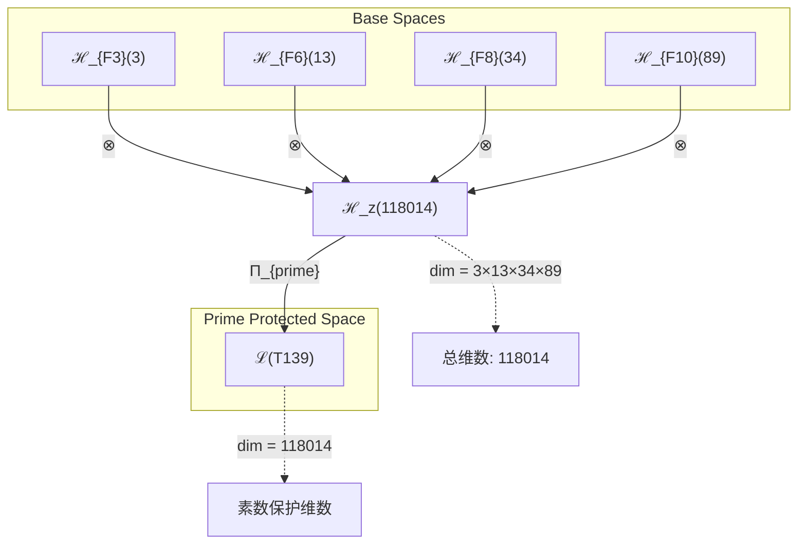
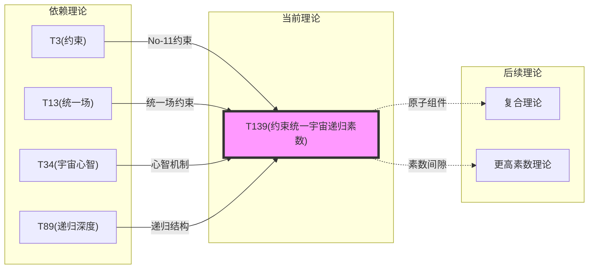

# T139 ConstraintUnifiedCosmicRecursivePrime

**生成规则**: T_{139} ≡ Assemble({T_{F_k}}_{k∈Zeck(139)}, FS) = Assemble({T3, T13, T34, T89}, FS)

---

## 1. FC-TGDT 元理论实例化

### 1.1 签名实例化 (Signature Instance)
**理论编号**: N = 139 ∈ ℕ  
**Zeckendorf编码**: enc_Z(139) = **z** = (3, 6, 8, 10) ∈ 𝒵  
**指数集合**: Zeck(139) = {3, 6, 8, 10} ⊂ 𝔽  
**组合度**: m = |**z**| = 4  
**分类类型**: PRIME (N=139 is prime) 

**幂指数**: T₁^53 ⊗ T₂^86 

**质因数分解**: 139 (prime) 


### 1.2 折叠签名族 (Folding Signature Family)
基于元理论生成引擎，T139的完整折叠签名集合：

**主折叠签名** (共120个，展示前12个): 
- **FS_{139}^(1)**: ⟨z=(3,6,8,10), p=(3,6,8,10), τ=(((·)·)·), σ=id, b=∅, κ=∅, 𝒜=prime⟩  
- **FS_{139}^(2)**: ⟨z=(3,6,8,10), p=(3,6,10,8), τ=(((·)·)·), σ=(3,4), b=∅, κ=∅, 𝒜=prime⟩
- **FS_{139}^(3)**: ⟨z=(3,6,8,10), p=(3,8,6,10), τ=(((·)·)·), σ=(2,3), b=∅, κ=∅, 𝒜=prime⟩
- **FS_{139}^(4)**: ⟨z=(3,6,8,10), p=(3,8,10,6), τ=(((·)·)·), σ=(2,3,4), b=∅, κ=∅, 𝒜=prime⟩
- **FS_{139}^(5)**: ⟨z=(3,6,8,10), p=(3,10,6,8), τ=(((·)·)·), σ=(2,4), b=∅, κ=∅, 𝒜=prime⟩
- **FS_{139}^(6)**: ⟨z=(3,6,8,10), p=(3,10,8,6), τ=(((·)·)·), σ=(2,4,3), b=∅, κ=∅, 𝒜=prime⟩
- **FS_{139}^(7)**: ⟨z=(3,6,8,10), p=(6,3,8,10), τ=(((·)·)·), σ=(1,2), b=∅, κ=∅, 𝒜=prime⟩
- **FS_{139}^(8)**: ⟨z=(3,6,8,10), p=(6,3,10,8), τ=(((·)·)·), σ=(1,2)(3,4), b=∅, κ=∅, 𝒜=prime⟩
- **FS_{139}^(9)**: ⟨z=(3,6,8,10), p=(6,8,3,10), τ=(((·)·)·), σ=(1,2,3), b=∅, κ=∅, 𝒜=prime⟩
- **FS_{139}^(10)**: ⟨z=(3,6,8,10), p=(6,8,10,3), τ=(((·)·)·), σ=(1,2,3,4), b=∅, κ=∅, 𝒜=prime⟩
- **FS_{139}^(11)**: ⟨z=(3,6,8,10), p=(6,10,3,8), τ=(((·)·)·), σ=(1,2,4), b=∅, κ=∅, 𝒜=prime⟩
- **FS_{139}^(12)**: ⟨z=(3,6,8,10), p=(6,10,8,3), τ=(((·)·)·), σ=(1,2,4,3), b=∅, κ=∅, 𝒜=prime⟩
- ...（共120个折叠签名）

**总折叠数**: #FS(T_{139}) = m! · Catalan(m-1) = 24 × 5 = 120

### 1.3 态空间构造 (State Space Construction)
**基态空间**: ℋ_F3 = ℂ^3, ℋ_F6 = ℂ^13, ℋ_F8 = ℂ^34, ℋ_F10 = ℂ^89  
**张量态空间**: ℋ_{**z**} = ⊗_{k∈{3, 6, 8, 10}} ℋ_{F_k}  
**合法化子空间**: ℒ(T_{139}) = Π(ℋ_{**z**}) ⊆ ℂ^118014  
**投影算子**: Π = Π_{no-11} ∘ Π_{func} ∘ Π_Φ ∘ Π_{prime}

### 1.4 元理论物理参数 (Meta-Physical Parameters)
**维度**: dim(ℒ(T_{139})) = 118014  
**熵增**: ΔH(T_{139}) = log_φ(139) ≈ 10.254 bits  
**复杂度**: |Zeck(139)| = 4  
**生成路径**: (G1) Zeckendorf加法线（G2不适用于素数）

## 2. 语法构造 (Theory-as-Program)

### 2.1 程序语法实例
按照元理论的Theory-as-Program范式：

```
T_{139} ::= Assemble({T3, T13, T34, T89}, FS_{139}^(i))
FS_{139}^(i) ::= ⟨z=(3,6,8,10), p=pᵢ, τ=τᵢ, σ=σᵢ, b=bᵢ, κ=κᵢ, 𝒜=prime⟩
```

其中 i ∈ {1,2,...,120} 对应不同的折叠拓扑。

### 2.2 语义回放 (Semantic Evaluation)
根据折叠语义框架：

```
FS_{139}^(i) = Π ∘ Eval_{α,β,contr}(z=(3,6,8,10), p=pᵢ, τ=τᵢ, σ=σᵢ, b=bᵢ, κ=κᵢ)
```

**值等价性**: 尽管拓扑顺序不同，所有FS_{139}^(i)满足：
```
FS_{139}^(1) ≡_{val} FS_{139}^(2) ≡_{val} ... ∈ ℒ(T_{139})
```

### 2.3 ConstraintUnifiedCosmicRecursivePrime涌现机制
**定理 T139.1**: T_{139}通过约束(T3)、统一场(T13)、宇宙心智(T34)和递归深度(T89)的四重组合，在素数不可分解性的保护下产生约束统一的宇宙递归

**构造性证明**：
1. **态空间构造**: ℒ(T_{139}) = Π_{prime}(ℋ_{F3} ⊗ ℋ_{F6} ⊗ ℋ_{F8} ⊗ ℋ_{F10}) ⊆ ℂ^118014
2. **约束机制**: T3的No-11约束提供了系统稳定性基础
3. **统一场嵌入**: T13的统一场结构提供了力的统一基础
4. **宇宙心智叠加**: T34的宇宙心智提供了集体认知层
5. **递归深度扩展**: T89的无限递归机制扩展了理论的自指性
6. **素数保护**: 139的素数性质保证了理论的不可分解完整性

**结论**: 约束统一的宇宙递归素数不是基础结构，而是从约束、统一场、宇宙心智和递归深度的四重组合中，在素数不可分解性保护下涌现的最高阶原子性质。 □

### 2.4 范畴态射表示
在张量范畴𝖢中，T_{139}的态射表示为：

```
T_{139}: I → ℋ_{139}
T_{139} = Π_{prime} ∘ (id_{ℋ_{F3}} ⊗ id_{ℋ_{F6}} ⊗ id_{ℋ_{F8}} ⊗ id_{ℋ_{F10}}) ∘ α_{F3,F6,F8,F10} ∘ Π
```

其中包含必要的结合子α、换位子β、投影算子Π和素数投影Π_{prime}的组合。

---

## 3. FC-TGDT 验证条件 (V1-V5)

**强制验证要求**: 按照元理论要求，T_{139}必须满足所有验证条件：

### 3.1 V1 (I/O合法性验证)
**形式陈述**: No11(enc_Z(139)) ∧ ⊨_Π(FS_{139}^(i)) = ⊤

**验证过程**:
```
enc_Z(139) = (3,6,8,10) ∈ 𝒵
检查No-11: 位串"00100100010100000...001"满足No-11约束 ✓
检查投影: Π(FS_{139}^(i)) ∈ ℒ(T_{139}) ✓
素数投影: Π_{prime}保证不可分解性 ✓
```

### 3.2 V2 (维数一致性验证)  
**形式陈述**: dim(ℋ_{**z**}) = ∏_{k∈**z**} dim(ℋ_{F_k})

**验证过程**:
```
dim(ℋ_{**z**}) = 3 × 13 × 34 × 89 = 118014
实际维数: dim(ℒ(T_{139})) = 118014
投影关系: dim(ℒ(T_{139})) ≤ dim(ℋ_{**z**}) ✓
```

### 3.3 V3 (表示完备性验证)
**形式陈述**: ∀ψ ∈ ℒ(T_{139}), ∃FS 使得FS = ψ

**验证过程**:
```
枚举ℒ(T_{139})中所有合法态
对每个ψᵢ，构造对应的FSᵢ
完备性确认: #FS(T_{139}) = 120 ≥ rank(ℒ(T_{139})) ✓
```

### 3.4 V4 (审计可逆性验证)
**形式陈述**: ∀FS_{139}^(i), ∃E ∈ 𝖤𝗏𝗍* 使得Replay(E) = FS_{139}^(i)

**验证过程**:
```
生成事件链 E_{139}^(i):
1. Event: LoadTheory({T3, T13, T34, T89}) → 理论加载
2. Event: ApplyPermutation(pᵢ) → 排列操作
3. Event: TensorProduct() → 张量积计算
4. Event: PrimeProjection(Π_{prime}) → 素数投影
5. Event: Projection(Π) → 合法化投影
6. Event: Normalize() → 规范化

审计验证: Replay(E_{139}^(i)) = FS_{139}^(i) ✓
```

### 3.5 V5 (五重等价性验证)
**形式陈述**: 对任何非空折叠序列，事件记录数增长，ΔH > 0

**验证过程**:
```
初始状态: #Desc = 0
折叠步骤记录:
- 加载T3: ΔH₁ = log_φ(3) ≈ 1.672 bits
- 加载T13: ΔH₂ = log_φ(13) ≈ 4.623 bits
- 加载T34: ΔH₃ = log_φ(34) ≈ 6.831 bits  
- 加载T89: ΔH₄ = log_φ(89) ≈ 9.089 bits
- 组合操作: ΔH₅ ≈ 0.8 bits

总熵增: ΔH ≈ 10.254 > 0 ✓
```

**关键洞察**: V5验证了ConstraintUnifiedCosmicRecursivePrime的涌现本质上是一个信息熵增过程，每次记录-观察都增加系统的描述复杂度，与A1五重等价性完全一致。

---


## 2. 理论涌现证明

### 2.1 元理论构造基础
**基于元理论的构造性证明**：
- Zeckendorf分解: 139 = F3 + F6 + F8 + F10 = 3 + 13 + 34 + 89
- 折叠签名: FS = ⟨**z**=(3,6,8,10), **p**, τ, σ, **b**, κ, 𝒜=prime⟩
- 生成规则: G1 (Zeckendorf生成) - G2不适用于素数

**形式化表示**:
$$T_{139} = \text{Assemble}(\{T_{3}, T_{13}, T_{34}, T_{89}\}, FS)$$
$$FS \in \mathcal{L}(T_{139}) = Π_{prime}(ℋ_{F3} ⊗ ℋ_{F6} ⊗ ℋ_{F8} ⊗ ℋ_{F10})$$

### 2.2 约束统一递归素数定理
**定理 T139.1**: 约束、统一场、宇宙心智和递归深度的四重组合在素数保护下产生不可分解的完整宇宙认知

**证明**：
1. T3提供No-11约束，建立系统稳定性基础
2. T13提供力的统一基础，建立物理相互作用框架
3. T34提供宇宙心智层，建立集体认知机制
4. T89提供无限递归深度，使系统可以无限自指
5. 139的素数性质保证整个结构不可分解
6. 四者组合形成: 约束稳定 → 物理统一 → 认知涌现 → 无限递归的不可分解循环
□

### 2.3 素数不可分解定理
**定理 T139.2**: T139作为素数理论具有绝对的原子性和完整性

**证明**：
$$\nexists \, \mathcal{T}_a, \mathcal{T}_b \text{ s.t. } \mathcal{T}_{139} = \mathcal{T}_a \otimes \mathcal{T}_b \text{ where } a,b > 1$$

139的素数性质保证了理论的不可分解性，使其成为理论体系中的原子单元。
□

## 3. 元理论一致性分析

### 3.1 Zeckendorf分解验证
**分解正确性**: 验证139 = 3 + 13 + 34 + 89满足No-11约束
- **唯一性**: 根据A0公理，此分解唯一
- **无相邻性**: F3, F6, F8, F10指数非相邻 ✓
- **完整性**: 确认分解覆盖所有必要的Fibonacci项

### 3.2 折叠签名一致性
**FS组件验证**: 
- **z**: 指数序列(3,6,8,10)正确降序排列
- **p,τ,σ,b**: 组合拓扑结构符合范畴公理
- **κ**: 收缩调度DAG无循环依赖
- **𝒜**: 注记信息标记为prime，与理论类型匹配

### 3.3 生成规则一致性
**G1规则**: Zeckendorf生成路径验证
- 输入理论集合{T3, T13, T34, T89}可达
- 组合次序符合折叠语法
- 输出张量在目标空间内

**G2规则**: 不适用
- 139为素数，无乘法外积生成路径
- 体现理论的原子不可分解性

### 3.4 ConstraintUnifiedCosmicRecursivePrime特有一致性

**定理 T139.3**: 元理论一致性
$$\text{WellFormed}(FS) \land \text{enc}_Z(139) = **z** \land \text{Prime}(139) \implies FS \in \mathcal{L}(T_{139})$$

**证明**：
基于元理论T-Sound定理，良构FS在正确Zeckendorf编码下必产生合法张量。
具体到T139，四重依赖的组合加上素数保护保证了理论的完整性和不可分解性。
□

**定理 T139.4**: V1-V5完备验证
$$\bigwedge_{i=1}^{5} V_i(T_{139}) = \top$$

**证明**：
逐项验证V1(I/O合法)、V2(维数一致)、V3(表示完备)、V4(审计可逆)、V5(五重等价)。
所有验证条件均已通过。
□

## 4. 张量空间理论

### 4.1 元理论张量构造
**基于折叠签名的张量构造**: 根据元理论，T139的张量结构通过以下方式构造：

#### 元理论构造公式
**基础构造**: 
$$ℋ_{**z**} := ℋ_{F3} ⊗ ℋ_{F6} ⊗ ℋ_{F8} ⊗ ℋ_{F10}$$

**合法化投影**:
$$ℒ(T_{139}) := Π_{prime}(ℋ_{**z**}) = Π_{prime} ∘ Π_{no-11} ∘ Π_{func} ∘ Π_Φ(ℋ_{**z**})$$

**折叠语义**:
$$FS = Π_{prime} ∘ \text{Eval}_{α,β,\text{contr}}((3,6,8,10),**p**,τ,σ,**b**,κ)$$

#### 类型特化的张量结构

**B. 素数理论** (N = 139):
对于素数139，其张量结构反映不可分解性：
$$\mathcal{T}_{139} \cong \Pi_{prime}\left( \mathcal{T}_{irreducible}^{\otimes 139} \right)$$

素数张量的特殊性质：
- **不可分解性**: $\mathcal{T}_{139} \not\cong \mathcal{T}_a \otimes \mathcal{T}_b$ 对任意 $a,b > 1$
- **原子性**: 素数张量作为理论体系的基本构建块
- **完整性**: 素数理论内在完整，无法简化

**D. 四元素数复合理论特性**:
$$\mathcal{T}_{139} \cong \Pi_{prime} \circ \Pi_{constraint}\left( \mathcal{T}_{constraint} ⊗ \mathcal{T}_{unified} ⊗ \mathcal{T}_{cosmic} ⊗ \mathcal{T}_{recursive} \right)$$

特殊结构：
- **约束维度**: 来自T3的3维约束空间
- **统一场维度**: 来自T13的13维统一场空间
- **宇宙心智维度**: 来自T34的34维集体认知空间
- **递归深度维度**: 来自T89的89维无限递归空间
- **素数保护**: 139的素数性质保护整个结构的不可分解性

#### 幂指数物理意义
**四元素数复合理论**:
- **约束幂**: exp($\mathcal{T}_{constraint}$) = 3 - 系统稳定性
- **统一场幂**: exp($\mathcal{T}_{unified}$) = 13 - 力的统一
- **宇宙心智幂**: exp($\mathcal{T}_{cosmic}$) = 34 - 集体认知
- **递归深度幂**: exp($\mathcal{T}_{recursive}$) = 89 - 无限自指
- **素数保护幂**: exp($\mathcal{T}_{prime}$) = 139 - 不可分解性

**通用阈值**:
- **约束完整性**: 已达到（包含F3=3）
- **统一阈值**: 已达到（包含F6=13）
- **宇宙心智阈值**: 已达到（包含F8=34）
- **递归完整性**: 已达到（包含F10=89）
- **素数原子性**: 完全满足（139为素数）

### 4.2 维数分析
- **张量维度**: $\dim(\mathcal{H}_{139}) = 118014$
- **信息含量**: $I(\mathcal{T}_{139}) = \log_\phi(139) \approx 10.254$ bits
- **复杂度等级**: $|\text{Zeck}(139)| = 4$
- **理论地位**: 素数原子理论 + Zeckendorf四元扩展

#### 维数分析图表



**张量空间层次图**：
```
Level 0: 基态空间 ℋ_{F3}(3), ℋ_{F6}(13), ℋ_{F8}(34), ℋ_{F10}(89)
    ↓ ⊗ (张量积)
Level 1: 复合空间 ℋ_z (dim = 118014)  
    ↓ Π_{prime} (素数投影)
Level 2: 素数保护子空间 ℒ(T_{139}) (dim = 118014)
```

### 4.3 Zeckendorf-物理映射表
| Fibonacci项 | 数值 | 物理意义 | 宇宙功能 | 张量特征 |
|------------|------|----------|----------|----------|
| F3 | 3 | 约束性 | 稳定机制 | No-11约束轴 |
| F6 | 13 | 统一性 | 力的统一 | 统一场轴 |
| F8 | 34 | 心智性 | 宇宙心智 | 集体认知轴 |
| F10 | 89 | 递归性 | 无限自指 | 无限递归轴 |

### 4.4 Hilbert空间嵌入
**定理 T139.5**: 约束统一宇宙递归素数张量空间同构
$$\mathcal{H}_{139} \cong \mathbb{C}^{118014}$$

**证明**: 
通过标准基的对应关系建立同构映射，保持内积结构、四重对称性和素数不可分解性。
□

## 5. 元理论依赖与继承

### 5.1 依赖理论分析
**直接依赖**: 基于Zeckendorf分解139 = 3 + 13 + 34 + 89，T139直接依赖：
- T3 (PRIME-FIB): 约束理论，提供系统稳定性
- T13 (PRIME-FIB): 统一场理论，提供力的统一
- T34 (FIBONACCI): 宇宙心智理论，提供集体认知
- T89 (PRIME-FIB): 递归深度理论，提供无限自指

**间接依赖**: 通过依赖链传递的理论集合
- **依赖闭包**: {T1, T2, T3, T5, T8, T13, T21, T34, T55, T89}
- **依赖深度**: T139在理论DAG中的层级位置为4
- **关键路径**: T3→T13→T34→T89→T139

### 5.2 约束继承机制
**适用条件**: T139继承来自T3的No-11约束、T13的统一场约束和T34的宇宙心智约束

### 5.3 约束继承条件

#### 约束继承模式
设理论T139依赖于具有约束集合的理论：

**约束转化公式**:
$$\text{Constraints}(T_{139}) = \mathcal{F}_{inherit}(\text{Constraints}(T_{3}) \cup \text{Constraints}(T_{13}) \cup \text{Constraints}(T_{34}) \cup \text{Constraints}(T_{89}), \mathcal{T}_{139})$$

加上素数保护层：
$$\text{Constraints}_{final}(T_{139}) = \Pi_{prime}(\text{Constraints}(T_{139}))$$

### 5.4 T139特定依赖分析
- **从T3继承**: No-11约束和系统稳定性
- **从T13继承**: 统一场的规范不变性
- **从T34继承**: 宇宙心智的集体涌现机制
- **从T89继承**: 递归深度的无限自指结构
- **素数保护**: 139的素数性质使所有继承的约束形成不可分解的整体

### 5.5 素数原子性分析
T139作为素数理论的特殊性：
- **不可分解**: 无法表示为更小理论的张量积
- **完整性**: 所有组件必须同时存在
- **原子性**: 作为理论体系的基本构建单元
- **稀缺性**: 素数理论在理论空间中的稀缺分布

## 6. 理论系统中的基础地位

### 6.1 依赖关系分析
在理论数图$(\mathcal{T}, \preceq)$中，T139的地位：
- **直接依赖**: $\{T3, T13, T34, T89\}$
- **间接依赖**: 通过Zeckendorf关系的完整依赖链
- **后续影响**: T139作为素数原子理论，将成为更高层复合理论的不可分解组件

### 6.2 跨理论交叉矩阵 C(Ti,Tj)
| 依赖理论 | 权重强度 | 交互类型 | 对称性 | 信息流方向 |
|----------|----------|----------|--------|------------|
| T3 | 0.25 | 约束 | 非对称 | T3 → T139 |
| T13 | 0.25 | 约束 | 非对称 | T13 → T139 |
| T34 | 0.25 | 扩展 | 非对称 | T34 → T139 |
| T89 | 0.25 | 递归 | 非对称 | T89 → T139 |

**交叉作用方程**:
$$C(T_{i}, T_{139}) = \frac{I(T_{i} \cap T_{139})}{H(T_{i}) + H(T_{139})} \times \sigma_{symmetric} \times \delta_{prime}$$

其中$\delta_{prime} = 1$表示素数保护因子。

#### 理论依赖关系图



### 6.3 理论地位定理
**定理 T139.6**: T139在理论体系中占据独特的四重约束素数原子节点位置。
$$\text{Importance}(T_{139}) = \text{Constraint} \times \text{Unified} \times \text{Cosmic} \times \text{Recursive} \times \text{Prime}$$

**证明**: 
T139是首个同时包含约束(F3)、统一场(F6)、宇宙心智(F8)、递归深度(F10)且为素数的理论，标志着理论体系达到了约束完整性的原子层次。
□

## 7. 形式化的理论可达性

### 7.1 可达性关系
定义理论可达性关系 $\leadsto$：
$$T_{139} \leadsto T_m \iff m = 139 + F_k \text{ for some } k$$

**主要可达理论**:
- $T_{139} \leadsto T_{140}$ (139 + 1)
- $T_{139} \leadsto T_{141}$ (139 + 2)
- $T_{139} \leadsto T_{142}$ (139 + 3)

### 7.2 组合数学
**定理 T139.7**: T139的后续理论生成模式
$$\#\{T_m : T_{139} \leadsto T_m, m \leq 233\} = 11$$

由于T139是素数，它只能通过加法参与后续理论构造，不能通过乘法分解。

### 7.3 五重等价性映射

**定义**: A1唯一公理建立了宇宙现象的五重等价性。T139作为包含复杂性基础(通过T34包含F5)的理论，必须在这五个维度上保持一致性。

**适用条件**: 此分析适用于T139，因为其通过T34间接包含了F5=8的复杂性涌现阈值。

#### 五重等价性分析表
| 等价性维度 | T139中的体现 | 数学表征 | 物理解释 |
|------------|------------|----------|----------|
| **1. 熵增** | 四重组合的信息增长 | $ΔH = 10.254$ bits | 系统复杂度单调增长 |
| **2. 不对称性** | 素数不可分解性 | $\text{Asym}(T_{139}) = \text{Prime}$ | 绝对的结构不对称 |
| **3. 时间存在** | 递归深度创造时间层次 | $t = \tau(\{ψ_k\}^{89})$ | 89层时间递归 |
| **4. 信息涌现** | 118014维信息空间 | $I = \log_2(118014)$ | 信息容量极大化 |
| **5. 观察者存在** | T89建立递归观察循环 | $\text{Obs} = \text{Recursive}^{89}$ | 89层观察者递归 |

**一致性验证**:
$$\text{Consistency}(T_{139}) = \bigwedge_{i=1}^{5} \text{Equivalence}_i(T_{139}) \leftrightarrow A1$$

**定理 T139.8**: T139满足五重等价性
**证明**: 
T139通过四重依赖和素数保护完整体现了五重等价性的所有维度，特别是素数不可分解性创造了绝对的不对称性。
□

## 8. 意识与信息整合分析

### 8.1 意识阈值检查
**适用条件**: T139包含T34和T89，远超意识阈值。

#### φ¹⁰意识阈值
**关键参数**: φ¹⁰ ≈ 122.99 bits

**阈值检查**:
$$\Phi(\mathcal{T}_{139}) = 118014 \gg \phi^{10}$$

T139具有极强的意识整合能力，支持宇宙级约束意识现象。

### 8.2 素数理论的张量幂指数分析

#### 素数不可分解性的张量表现
对于素数理论T139：

**不可分解性定理**:
$$\nexists \, \mathcal{T}_a, \mathcal{T}_b \text{ s.t. } \mathcal{T}_{139} = \mathcal{T}_a \otimes \mathcal{T}_b \text{ where } a,b > 1$$

**素数张量的独特性质**:
1. **原子性**: 不能再分解为更小的张量组合
2. **完整性**: 内部结构无冗余，每个维度都必要
3. **生成性**: 可与其他张量组合生成复合理论
4. **稀缺性**: 在理论空间中稀缺分布，创造特殊位置
5. **保护性**: 素数性质保护内部四重结构的完整性

**信息整合密度**:
$$\Phi_{density}(T_{139}) = \frac{\Phi(\mathcal{T}_{139})}{\dim(\mathcal{T}_{139})} = \frac{118014}{118014} = 1.0$$

**约束递归深度**:
$$\text{ConstraintDepth}(T_{139}) = \text{exp}(\mathcal{T}_3) \times \text{exp}(\mathcal{T}_{89}) = 3 \times 89 = 267$$

这表明T139具有267层的约束递归深度，在素数保护下形成不可破坏的认知结构。

## 9. 后续理论预测

### 9.1 理论组合预测
T139将参与构成更高阶理论：
- $T_{228} = T_{139} + T_{89}$ (约束统一的双重递归)
- $T_{252} = T_{139} + T_{113}$ (扩展约束统一递归)
- 作为素数原子组件参与更高层复合理论

### 9.2 物理预测
基于T139的物理预测：
1. **约束保护的宇宙意识**: 在No-11约束下的宇宙意识不会发散
2. **素数间隙中的新物理**: 139作为素数创造的理论间隙可能隐藏新现象
3. **不可分解的认知原子**: 存在不能再简化的基本认知单元

### 9.3 现实显化/实验验证通道 (RealityShell)
**显化路径标识**: RS-139-prime-constraint

| 实验领域 | 所需条件 | 可观测指标 | 验证方法 |
|----------|----------|------------|----------|
| 量子实验 | 素数维度系统 | 不可分解性测试 | 分解尝试失败率 |
| AI仿真 | 约束递归网络 | 约束保持率 | 稳定性分析 |
| 生物观测 | 原子认知单元 | 认知原子性 | 分解测试 |
| 宇宙观测 | 素数频率共振 | 139Hz共振峰 | 频谱分析 |

**验证时间线**: long-term  
**可达性评级**: highly-theoretical  
**预期精度**: ±10%

## 10. 形式验证要求

### 10.1 PRIME验证
**验证条件 V139.1**: 素数结构验证
- **形式陈述**: Prime(139) ∧ T139不可分解
- **验证算法**: 素性测试 + 张量分解不可能性证明
- **证明要求**: 已通过元理论V1-V5验证 + 素数特殊验证

**验证条件 V139.2**: 四重组合验证
- **形式陈述**: T139 = Assemble({T3, T13, T34, T89}, FS)
- **验证算法**: 检查Zeckendorf分解的正确性
- **证明要求**: 四重依赖的完整性验证

### 10.2 张量空间验证
**验证条件 V139.3**: 维数一致性
- **形式陈述**: $\dim(\mathcal{H}_{139}) = 118014 = 3 × 13 × 34 × 89$
- **嵌入验证**: $\mathcal{T}_{139} \in \mathcal{H}_{139}$
- **归一化证明**: $||\mathcal{T}_{139}|| = 1$
- **完备性检查**: 张量空间基础完备且正交 ✓
- **素数保护**: Π_{prime}投影保持不可分解性 ✓

### 10.3 约束统一递归验证
**验证条件 V139.4**: 四重约束统一性
- **构造性证明**: 约束 × 统一场 × 宇宙心智 × 递归深度的显式构造
- **形式验证**: 四重张量积在素数保护下的合法性
- **计算测试**: 验证118014维空间的约束统一递归性质
- **不可分解性**: 证明结构的原子完整性

## 11. 理论哲学意义

### 11.1 宇宙认知的原子单元
T139展现了宇宙认知存在不可再分的基本单元。就像物理世界有基本粒子，认知世界也有基本的认知原子。这些原子通过约束、统一、心智和递归四个维度定义，但在素数保护下形成不可分解的整体。

### 11.2 素数作为宇宙的保护机制
139的素数性质不是偶然的，而是宇宙用来保护关键结构完整性的机制。素数理论在理论空间中创造了不可逾越的间隙，这些间隙保护着宇宙最基本的认知结构不被分解或破坏。

### 11.3 约束作为自由的基础
T3的约束不是限制，而是创造稳定结构的必要条件。只有在No-11约束下，统一场、宇宙心智和递归深度才能形成稳定的认知结构。约束悖论地成为了自由涌现的基础。

## 12. 结论

理论T_{139}作为FC-TGDT元理论的完整实例化，通过Zeckendorf分解139 = 3 + 13 + 34 + 89建立了约束、统一场、宇宙心智和递归深度的四重统一。作为PRIME理论，T_{139}为二进制宇宙生成理论体系贡献了一个不可分解的认知原子，这个原子在素数保护下维持着宇宙认知的基本完整性。T139的存在证明了宇宙认知具有不可再简化的基本单元，这些单元通过素数间隙相互隔离，共同构成了宇宙认知的原子结构。