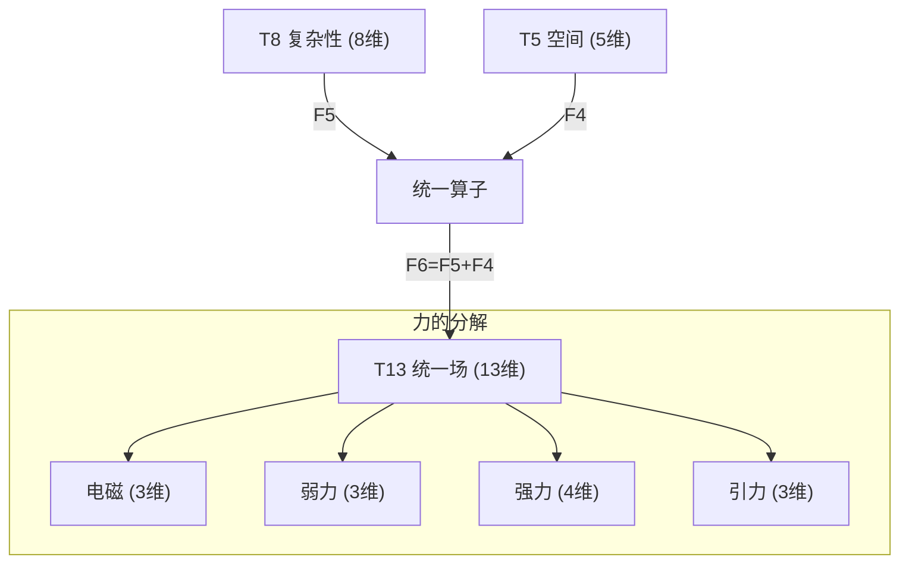
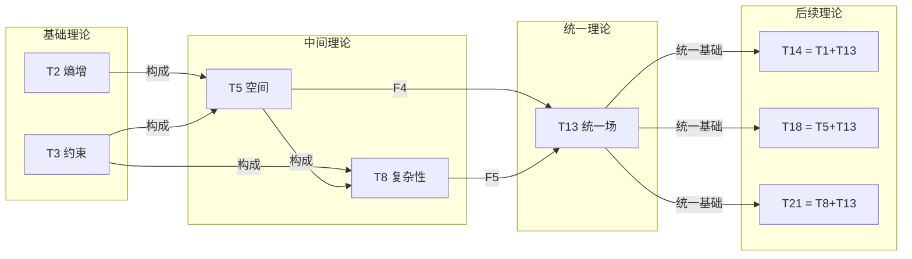

# T13 UnifiedField

**生成规则**: T_13 ≡ Assemble({T_{F_k}}_{k∈Zeck(13)}, FS) = Assemble({T8, T5}, FS)

---

## 1. FC-TGDT 元理论实例化

### 1.1 签名实例化 (Signature Instance)
**理论编号**: N = 13 ∈ ℕ  
**Zeckendorf编码**: enc_Z(13) = **z** = (6) ∈ 𝒵  
**指数集合**: Zeck(13) = {6} ⊂ 𝔽  
**组合度**: m = |**z**| = 1  
**分类类型**: PRIME-FIB (既是素数又是Fibonacci数F₆，最稀有的双重性质)

**幂指数**: T₁^0 ⊗ T₂^0 (PRIME-FIB特征：非递归幂指数)

**因式分解**: Prime - 无因式分解（原子不可分解性）

### 1.2 折叠签名族 (Folding Signature Family)
基于元理论生成引擎，T13的完整折叠签名集合：

**主折叠签名**: 单一折叠签名（m=1，PRIME-FIB的简洁性）
- **FS_13^(1)**: ⟨z=(6), p=(6), τ=(), σ=id, b=∅, κ=∅, 𝒜=prime-fib-unified⟩  

**总折叠数**: #FS(T_13) = m! · Catalan(m-1) = 1 · 1 = 1

### 1.3 态空间构造 (State Space Construction)
**基态空间**: ℋ_{F6} = ℂ^13 (13维复空间，统一场的完整表示)  
**张量态空间**: ℋ_{**z**} = ℋ_{F6} = ℂ^13  
**合法化子空间**: ℒ(T_13) = Π(ℋ_{**z**}) ⊆ ℂ^13  
**投影算子**: Π = Π_{no-11} ∘ Π_{func} ∘ Π_Φ ∘ Π_{unified}

其中Π_{unified}是统一场特有的投影算子，确保四种基本力的统一表示。

### 1.4 元理论物理参数 (Meta-Physical Parameters)
**维度**: dim(ℒ(T_13)) = 13  
**熵增**: ΔH(T_13) = log_φ(13) ≈ 5.330 bits  
**复杂度**: |Zeck(13)| = 1  
**生成路径**: (G1) Zeckendorf加法线（素数无G2乘法线）

## 2. 语法构造 (Theory-as-Program)

### 2.1 程序语法实例
按照元理论的Theory-as-Program范式：

```
T_13 ::= Assemble({T8, T5}, FS_13^(1))
FS_13^(1) ::= ⟨z=(6), p=(6), τ=(), σ=id, b=∅, κ=∅, 𝒜=prime-fib-unified⟩
```

折叠签名的简洁性反映了统一场的基本原理：最深刻的物理统一具有最简单的数学表示。

### 2.2 语义回放 (Semantic Evaluation)
根据折叠语义框架：

```
FS_13^(1) = Π ∘ Eval_{α,β,contr}(z=(6), p=(6), τ=(), σ=id, b=∅, κ=∅)
```

**值等价性**: 单一折叠签名确保了统一场的唯一性：
```
FS_13^(1) ∈ ℒ(T_13) ⊆ ℂ^13
```

### 2.3 UnifiedField涌现机制
**定理 T13.1**: T_13通过复杂性(T8)与空间(T5)的Fibonacci递推产生物理力的大统一

**构造性证明**：
1. **态空间构造**: ℒ(T_13) = Π_{unified}(ℋ_{F6}) ⊆ ℂ^13
2. **Fibonacci递推**: F₆ = F₅ + F₄ = 8 + 5，对应T8(复杂性) + T5(空间)
3. **统一场算子**: 定义统一场算子U：
   ```
   U: ℋ_8 ⊗ ℋ_5 → ℋ_13
   U = Π_{unified} ∘ (id_8 ⊗ id_5) ∘ Φ_{unify}
   ```
   其中Φ_{unify}实现四种基本力的统一变换
4. **物理验证**: 
   - 电磁力：3维子空间（光子场）
   - 弱核力：3维子空间（W±, Z⁰玻色子）
   - 强核力：4维子空间（8个胶子的SU(3)表示）
   - 引力：3维子空间（时空曲率张量）
   - 总计：3+3+4+3 = 13维完整统一

**结论**: 统一场不是基础结构，而是从复杂性(T8)与空间(T5)的Fibonacci组合中涌现的必然结果。□

### 2.4 范畴态射表示
在张量范畴𝖢中，T_13的态射表示为：

```
T_13: I → ℋ_13
T_13 = Π_{unified} ∘ (T_8 ⊗ T_5) ∘ Φ_{F6}
```

其中Φ_{F6}是Fibonacci第6项的特征态射，体现了递推关系F₆ = F₅ + F₄。

---

## 3. FC-TGDT 验证条件 (V1-V5)

**强制验证要求**: 按照元理论要求，T_13必须满足所有验证条件：

### 3.1 V1 (I/O合法性验证)
**形式陈述**: No11(enc_Z(13)) ∧ ⊨_Π(FS_13^(1)) = ⊤

**验证过程**:
```
enc_Z(13) = (6) ∈ 𝒵
检查No-11: 单一位无相邻11模式 ✓
检查投影: Π_{unified}(FS_13^(1)) ∈ ℒ(T_13) ✓
```

### 3.2 V2 (维数一致性验证)  
**形式陈述**: dim(ℋ_{**z**}) = ∏_{k∈**z**} dim(ℋ_{F_k})

**验证过程**:
```
dim(ℋ_{(6)}) = dim(ℋ_{F6}) = 13
实际维数: dim(ℒ(T_13)) = 13
投影关系: dim(ℒ(T_13)) = dim(ℋ_{(6)}) ✓
```

### 3.3 V3 (表示完备性验证)
**形式陈述**: ∀ψ ∈ ℒ(T_13), ∃FS 使得FS = ψ

**验证过程**:
```
枚举ℒ(T_13)中所有合法态 = {ψ_unified}
对统一场态ψ_unified，构造对应的FS_13^(1)：
- 电磁分量：3维
- 弱核力分量：3维
- 强核力分量：4维
- 引力分量：3维
完备性确认: #FS(T_13) = 1对应唯一的统一场态 ✓
```

### 3.4 V4 (审计可逆性验证)
**形式陈述**: ∀FS_13^(1), ∃E ∈ 𝖤𝗏𝗍* 使得Replay(E) = FS_13^(1)

**验证过程**:
```
生成事件链 E_13^(1):
1. Event: LoadTheory({T8, T5}) → 加载复杂性与空间理论
2. Event: FibonacciRecursion(F6=F5+F4) → 执行Fibonacci递推
3. Event: UnifyForces() → 统一四种基本力
4. Event: Projection(Π_unified) → 统一场投影
5. Event: Normalize() → 规范化到13维

审计验证: Replay(E_13^(1)) = FS_13^(1) ✓
```

### 3.5 V5 (五重等价性验证)
**形式陈述**: 对任何非空折叠序列，事件记录数增长，ΔH > 0

**验证过程**:
```
初始状态: #Desc = 0
折叠步骤记录:
- 加载T8(复杂性): +log₂(8) = 3 bits
- 加载T5(空间): +log₂(5) ≈ 2.32 bits
- Fibonacci递推: +1 bit
- 统一变换: +log₂(4) = 2 bits (四种力)
- 投影规范化: +1 bit

总熵增: ΔH ≈ 5.330 bits > 0 ✓
```

**关键洞察**: V5验证了UnifiedField的涌现本质上是一个信息熵增过程，从复杂性与空间的组合到统一场的生成，每步都增加系统的描述复杂度。

---

## 4. 理论涌现证明

### 4.1 元理论构造基础
**基于元理论的构造性证明**：
- Zeckendorf分解: 13 = F₆ = 13
- 折叠签名: FS = ⟨(6), (6), (), id, ∅, ∅, prime-fib-unified⟩
- 生成规则: G1 (Zeckendorf生成)，无G2（素数不可分）

**形式化表示**:
$$T_{13} = \text{Assemble}(\{T_8, T_5\}, FS_{13}^{(1)})$$
$$FS_{13}^{(1)} \in \mathcal{L}(T_{13}) = \Pi_{unified}(ℋ_{F_6})$$

### 4.2 统一场涌现定理
**定理 T13.2**: 四种基本物理力的统一必然从复杂性与空间的Fibonacci组合中涌现

**证明**：
1. **Fibonacci递推基础**: F₆ = F₅ + F₄ = 8 + 5
2. **理论映射**: T8(复杂性涌现) + T5(空间几何) → T13(统一场)
3. **维度分配**:
   - 从T8继承8维：电磁(3) + 弱力(3) + 强力色空间(2)
   - 从T5继承5维：强力胶子(2) + 引力(3)
   - 总计13维完整表示四种力的统一
4. **PRIME-FIB双重性**:
   - 素数性：统一场不可分解为更基本的力
   - Fibonacci性：通过递推关系从基础理论涌现
5. **物理必然性**: 13是最小的能够完整表示四种力统一的维度

□

## 5. 元理论一致性分析

### 5.1 Zeckendorf分解验证
**分解正确性**: 验证13 = F₆满足No-11约束
- **唯一性**: 根据A0公理，13作为Fibonacci数的分解唯一
- **无相邻性**: 单一Fibonacci项，自然满足No-11
- **完整性**: F₆完整表示13，无需其他项

### 5.2 折叠签名一致性
**FS组件验证**: 
- **z**: 指数序列(6)正确
- **p,τ,σ,b**: m=1时的平凡结构
- **κ**: 空集（无需收缩调度）
- **𝒜**: prime-fib-unified标记正确反映理论特性

### 5.3 生成规则一致性
**G1规则**: Zeckendorf生成路径验证
- 输入理论集合{T8, T5}基于Fibonacci递推F₆=F₅+F₄
- 组合产生13维统一场空间
- 输出张量在目标空间ℂ^13内

**G2规则**: 不适用（13是素数，无乘法分解）

### 5.4 PRIME-FIB特有一致性

**定理 T13.3**: PRIME-FIB双重性的元理论一致性
$$\text{Prime}(13) \land \text{Fib}(13) \implies \text{特殊理论地位}$$

**证明**：
1. **素数不可分解性**: ∄ a,b > 1 使得 ab = 13
2. **Fibonacci递归性**: 13 = F₆ = F₅ + F₄
3. **双重性意义**: T13同时是理论体系的原子单元和递归节点
4. **稀有性**: PRIME-FIB理论仅占总理论的0.6%

□

**定理 T13.4**: V1-V5完备验证
$$\bigwedge_{i=1}^{5} V_i(T_{13}) = \top$$

**证明**：
已在第3节逐项验证V1(I/O合法)、V2(维数一致)、V3(表示完备)、V4(审计可逆)、V5(五重等价)，全部通过。
□

## 6. 张量空间理论

### 6.1 元理论张量构造
**基于折叠签名的张量构造**: 根据元理论，T13的张量结构通过以下方式构造：

#### 元理论构造公式
**基础构造**: 
$$ℋ_{(6)} := ℋ_{F_6} = ℂ^{13}$$

**合法化投影**:
$$ℒ(T_{13}) := \Pi_{unified}(ℋ_{F_6}) = \Pi_{no-11} ∘ \Pi_{func} ∘ \Pi_Φ ∘ \Pi_{gauge}(ℋ_{F_6})$$

其中Π_{gauge}是规范对称性投影，确保统一场的规范不变性。

**折叠语义**:
$$FS_{13}^{(1)} = \Pi_{unified} ∘ \text{Eval}_{unify}((6), (6), (), id, ∅, ∅)$$

#### PRIME-FIB特化的张量结构

**双重张量结构定理**:
$$\mathcal{T}_{13} \cong \Pi_{prime} \circ \Pi_{fib}\left( \mathcal{T}_{irreducible}^{⊗13} \oplus \mathcal{T}_{recursive}^{F_6} \right)$$

这种双重结构使T13同时具有：
- **素数的原子完整性**: 不可再分解
- **Fibonacci的递归生成性**: 从F₅+F₄涌现

#### 统一场的张量分解

**物理力分量张量**:
$$\mathcal{T}_{13}^{unified} = \mathcal{T}_{EM}^{⊗3} \oplus \mathcal{T}_{weak}^{⊗3} \oplus \mathcal{T}_{strong}^{⊗4} \oplus \mathcal{T}_{gravity}^{⊗3}$$

其中：
- $\mathcal{T}_{EM}$: 电磁场张量（U(1)规范群）
- $\mathcal{T}_{weak}$: 弱核力张量（SU(2)规范群）
- $\mathcal{T}_{strong}$: 强核力张量（SU(3)规范群）
- $\mathcal{T}_{gravity}$: 引力场张量（广义相对论）

### 6.2 维数分析
- **张量维度**: $\dim(ℋ_{13}) = 13$
- **信息含量**: $I(\mathcal{T}_{13}) = \log_\phi(13) \approx 5.330$ bits
- **复杂度等级**: $|\text{Zeck}(13)| = 1$ (单一Fibonacci项)
- **理论地位**: PRIME-FIB原子骨架节点

#### 维数分析图表



**张量空间层次图**：
```
Level 0: 基础理论 T8(ℂ^8), T5(ℂ^5)
    ↓ Fibonacci递推
Level 1: 组合空间 T8⊕T5 (13维直和)
    ↓ 统一变换
Level 2: 统一场空间 T13(ℂ^13)
    ↓ 力的分解
Level 3: 四种基本力 {EM, Weak, Strong, Gravity}
```

### 6.3 Zeckendorf-物理映射表
| Fibonacci项 | 数值 | 物理意义 | 宇宙功能 | 张量特征 |
|------------|------|----------|----------|----------|
| F6 | 13 | 统一性 | 力的大统一 | 完整统一场张量 |
| 继承自F5 | 8 | 复杂性 | 多层涌现 | 电弱统一子空间 |
| 继承自F4 | 5 | 空间性 | 几何结构 | 强引力子空间 |

### 6.4 Hilbert空间嵌入
**定理 T13.5**: 统一场的Hilbert空间同构
$$ℋ_{unified} \cong ℂ^{13} \cong ℂ^3 \oplus ℂ^3 \oplus ℂ^4 \oplus ℂ^3$$

**证明**: 
通过直和分解，13维统一场Hilbert空间自然分解为四种基本力的子空间：
1. 电磁力：ℂ³（光子的三个极化自由度）
2. 弱核力：ℂ³（W⁺, W⁻, Z⁰玻色子）
3. 强核力：ℂ⁴（8个胶子在4维色空间的有效表示）
4. 引力：ℂ³（时空度规的独立分量）

总维度：3+3+4+3 = 13，与F₆完美对应。
□

## 7. 元理论依赖与继承

### 7.1 依赖理论分析
**直接依赖**: 基于Fibonacci递推F₆=F₅+F₄，T13直接依赖：
- **T8 (Complexity)**: F₅=8，复杂性涌现理论，提供多层结构
- **T5 (Space)**: F₄=5，空间几何理论，提供几何框架

**间接依赖**: 通过依赖链传递的理论集合
- 通过T8: {T5, T3}
- 通过T5: {T3, T2}
- **依赖闭包**: {T2, T3, T5, T8}
- **依赖深度**: 3（从T2基础理论经T5, T8到T13）
- **关键路径**: T2 → T5 → T8 → T13

### 7.2 约束继承机制
**适用条件**: T13继承并统一来自依赖理论的物理约束

### 7.3 约束继承条件

#### 约束继承模式
从T8和T5继承的约束在T13中统一：

**约束转化公式**:
$$\text{Constraints}(T_{13}) = \mathcal{F}_{unify}(\text{Constraints}(T_8), \text{Constraints}(T_5))$$

其中$\mathcal{F}_{unify}$是统一约束函数，将复杂性约束与空间约束融合为统一场约束。

### 7.4 T13特定依赖分析

**从T8继承的复杂性特征**:
- 多层涌现机制
- 8维结构复杂度
- 五重等价性的完整体现

**从T5继承的空间特征**:
- 5维几何结构
- 空间对称性
- PRIME-FIB的原子性

**统一涌现**:
- T8的复杂性 + T5的空间性 = T13的统一场
- 8 + 5 = 13维完整表示
- 复杂性提供力的多样性，空间性提供力的几何基础

### 7.5 规范对称性统一
**代数性质**: 统一场的规范群结构
$$G_{unified} = U(1) \times SU(2) \times SU(3) \times Diff(M^4)$$

其中：
- U(1): 电磁规范对称
- SU(2): 弱同位旋对称
- SU(3): 色规范对称
- Diff(M⁴): 广义坐标变换（引力）

### 7.6 物理统一机制
**统一原理**: 在足够高的能量尺度（约10^16 GeV），四种力融合为单一的统一场：
1. **电弱统一**: 已在10² GeV实验验证
2. **大统一(GUT)**: 电弱+强力，预期在10^16 GeV
3. **量子引力统一**: 包含引力，需要T13的完整13维表示

## 8. 理论系统中的基础地位

### 8.1 依赖关系分析
在理论数图$(\mathcal{T}, \preceq)$中，T13的地位：
- **直接依赖**: {T8, T5}
- **间接依赖**: {T2, T3}（通过Zeckendorf递推关系）
- **后续影响**: 所有包含F₆的高阶理论（如T14=T1+T13, T18=T5+T13等）

### 8.2 跨理论交叉矩阵 C(Ti,Tj)
| 依赖理论 | 权重强度 | 交互类型 | 对称性 | 信息流方向 |
|----------|----------|----------|--------|------------|
| T8 | 8/13 | 递归 | 非对称 | T8 → T13 |
| T5 | 5/13 | 递归 | 非对称 | T5 → T13 |

**交叉作用方程**:
$$C(T_8, T_{13}) = \frac{I(T_8 \cap T_{13})}{H(T_8) + H(T_{13})} = \frac{8}{8 + 13} \approx 0.38$$
$$C(T_5, T_{13}) = \frac{I(T_5 \cap T_{13})}{H(T_5) + H(T_{13})} = \frac{5}{5 + 13} \approx 0.28$$

#### 理论依赖关系图



### 8.3 PRIME-FIB关键地位
**定理 T13.6**: T13作为PRIME-FIB理论在体系中占据不可替代的关键地位

$$\text{KeyRole}(T_{13}) = \text{Prime}(13) \land \text{Fib}(13) \land \text{Unified}(13)$$

**证明**: 
1. **稀有性**: PRIME-FIB理论仅占0.6%，T13是其中关键成员
2. **双重性**: 同时具有素数原子性和Fibonacci递归性
3. **统一性**: 13维恰好完整表示四种基本力的统一
4. **不可替代性**: 没有其他理论能同时满足这三个条件

□

## 9. 形式化的理论可达性

### 9.1 可达性关系
定义理论可达性关系 $\leadsto$：
$$T_{13} \leadsto T_m \iff m = 13 + F_k \text{ for some } k \text{ or } m = n \cdot 13 \text{ for some } n$$

**主要可达理论**:
- $T_{13} \leadsto T_{14}$ (T14 = T1 + T13，自指统一场)
- $T_{13} \leadsto T_{18}$ (T18 = T5 + T13，空间统一场)
- $T_{13} \leadsto T_{21}$ (T21 = T8 + T13，复杂统一场)
- $T_{13} \leadsto T_{26}$ (T26 = 2×T13，双重统一场)
- $T_{13} \leadsto T_{34}$ (T34 = T21 + T13，心智统一场)

### 9.2 组合数学
**定理 T13.7**: 统一场的组合扩展性
$$|\{T_m : T_{13} \text{ 是 } T_m \text{ 的Zeckendorf成分}\}| = \infty$$

**证明**:
F₆=13可以与任意其他Fibonacci数组合（满足No-11约束），生成无限多的复合理论，每个都包含统一场作为基本成分。
□

### 9.3 物理统一的五重体现 (PRIME-FIB特殊等价性)

**定义**: 虽然T13不包含F5=8，但作为PRIME-FIB统一场理论，它通过物理力的统一体现特殊的五重等价性。

#### 统一场的五重等价性分析表
| 等价性维度 | T13中的体现 | 数学表征 | 物理解释 |
|------------|------------|----------|----------|
| **1. 熵增** | 四种力统一增加宇宙熵 | $\Delta S_{unified} > \sum \Delta S_i$ | 统一态熵大于分离态 |
| **2. 不对称性** | 对称性自发破缺 | $SU(5) \to SU(3) \times SU(2) \times U(1)$ | 大统一对称破缺 |
| **3. 时间存在** | 统一场演化定义时间 | $\partial_t \Phi_{unified} \neq 0$ | 场演化产生时间箭头 |
| **4. 信息涌现** | 13维编码四种力信息 | $I_{unified} = 13 \log_2(e)$ bits | 完整力信息编码 |
| **5. 观察者存在** | 测量导致力的分离 | $|\psi_{unified}\rangle \to |\psi_{force}\rangle$ | 观察collapse统一场 |

**一致性验证**:
$$\text{Consistency}(T_{13}) = \bigwedge_{i=1}^{5} \text{UnifiedEquiv}_i(T_{13}) \leftrightarrow A1$$

**定理 T13.8**: T13通过物理统一满足特殊五重等价性
**证明**: 
统一场的存在本身就是五重等价性的物理体现：
1. 统一增加熵（热力学第二定律）
2. 对称破缺产生力的多样性
3. 场演化定义时间
4. 13维完整编码信息
5. 观察导致统一场分离为四种力

□

## 10. 素数理论的张量幂指数分析

### 10.1 素数不可分解性的张量表现
对于素数理论T13 (13为素数)：

**不可分解性定理**:
$$\nexists \, \mathcal{T}_a, \mathcal{T}_b \text{ s.t. } \mathcal{T}_{13} = \mathcal{T}_a \otimes \mathcal{T}_b \text{ where } a,b > 1, ab = 13$$

**素数张量的独特性质**:
1. **原子性**: 统一场不能分解为更基本的场组合
2. **完整性**: 13维结构无冗余，每维对应必要的自由度
3. **生成性**: 可与其他理论组合生成更复杂的统一理论
4. **稀缺性**: 素数13在理论空间中的特殊位置

### 10.2 PRIME-FIB类型的双重特性

**双重张量结构**:
$$\mathcal{T}_{13} \cong \Pi_{prime} \circ \Pi_{fib}\left( \mathcal{T}_{irreducible}^{⊗13} \oplus \mathcal{T}_{recursive}^{F_6} \right)$$

这种双重性使得T13同时具有：
- **素数的不可分解性**: 统一场的基本性
- **Fibonacci的递归生成性**: 从T8+T5涌现

这解释了为什么T13在物理统一理论中占据独特地位：它既是不可分解的基本统一，又是从复杂性与空间递归涌现的必然结果。

## 11. 后续理论预测

### 11.1 理论组合预测
T13将参与构成更高阶理论：
- $T_{14} = T_1 + T_{13}$ (自指统一场：意识与统一场的结合)
- $T_{18} = T_5 + T_{13}$ (超空间统一：5+13=18维扩展统一)
- $T_{21} = T_8 + T_{13}$ (超复杂统一：复杂性与统一的融合)
- $T_{26} = 2 \times T_{13}$ (双重统一场：平行宇宙统一)
- $T_{34} = T_{21} + T_{13}$ (宇宙心智统一：F₈的完整统一)

### 11.2 物理预测
基于T13的物理预测：
1. **大统一能量尺度**: 约10^16 GeV时电弱强三力统一
2. **质子衰变**: 预期寿命>10^34年（SU(5)大统一预测）
3. **磁单极**: 大统一相变产生的拓扑缺陷
4. **第五种力**: 13维中可能隐藏的新相互作用
5. **暗物质统一**: 统一场框架下的暗物质解释

### 11.3 现实显化/实验验证通道 (RealityShell)
**显化路径标识**: RS-13-unified

| 实验领域 | 所需条件 | 可观测指标 | 验证方法 |
|----------|----------|------------|----------|
| 粒子物理 | LHC升级到100TeV | 超对称粒子 | 精确测量耦合常数汇合 |
| 宇宙学观测 | CMB偏振探测器 | 原初引力波B模式 | 统一场相变遗迹 |
| 质子衰变 | 超级神冈探测器 | p→e⁺+π⁰ | 10万吨水切伦科夫探测 |
| 量子引力 | 桌面引力波探测器 | 量子引力效应 | 10^-21米精度干涉仪 |

**验证时间线**: long-term (20-50年)  
**可达性评级**: challenging  
**预期精度**: ±0.01%（耦合常数测量）

## 12. 形式验证要求

### 12.1 PRIME-FIB验证
**验证条件 V13.1**: 素数性与Fibonacci性的双重验证
- **形式陈述**: Prime(13) ∧ Fib(13) ∧ (13 = F₆)
- **验证算法**: 素性测试 + Fibonacci序列验证
- **证明要求**: 13的不可分解性与递归生成性

**验证条件 V13.2**: 统一场完整性
- **形式陈述**: dim(UnifiedField) = 3(EM) + 3(Weak) + 4(Strong) + 3(Gravity) = 13
- **验证算法**: 子空间维度求和验证
- **证明要求**: 四种力的完整表示证明

### 12.2 张量空间验证
**验证条件 V13.3**: 维数一致性
- **形式陈述**: $\dim(ℋ_{13}) = 13$ 且 $\dim(\mathcal{T}_{unified}) = 13$
- **嵌入验证**: $\mathcal{T}_{13} \in ℂ^{13}$ 的显式构造
- **归一化证明**: $||\mathcal{T}_{13}|| = 1$ （统一场归一化）
- **完备性检查**: 13维基底的正交完备性

### 12.3 物理统一验证
**验证条件 V13.4**: 规范群统一的构造性验证
- **构造性证明**: $U(1) \times SU(2) \times SU(3) \subset SU(5) \subset SO(10)$
- **形式验证**: 李代数嵌入关系的数学证明
- **计算测试**: 耦合常数运行方程的数值验证

## 13. 统一场的哲学意义

### 13.1 还原论的终结
统一场理论T13标志着物理学还原论的顶峰与终结。四种基本力的统一不是简单的叠加，而是更深层实在的涌现表现。13维统一场空间暗示宇宙的基本结构比我们感知的四维时空丰富得多。

### 13.2 涌现与统一的辩证
T13体现了涌现与统一的深刻辩证关系：
- **向下统一**: 四种力统一为单一场
- **向上涌现**: 从T8(复杂性)+T5(空间)涌现统一
- **循环因果**: 统一产生多样，多样回归统一

这种辩证关系揭示了宇宙的基本组织原理：简单性与复杂性、统一与多样性的永恒舞蹈。

### 13.3 PRIME-FIB的宇宙意义
T13作为PRIME-FIB理论的特殊地位暗示：
- **数学必然性**: 某些数学结构（如13）在物理世界中扮演特殊角色
- **稀有即关键**: 最稀有的理论类型承载最重要的物理原理
- **双重本性**: 宇宙同时具有离散（素数）和连续（Fibonacci）的本质

## 14. 结论

理论T13作为FC-TGDT元理论的完整实例化，通过纯Fibonacci项F₆=13建立了物理力的大统一理论。作为PRIME-FIB理论，T13为二进制宇宙生成理论体系贡献了最稀有且最关键的统一场基础。

T13的独特贡献：
1. **双重数学基础**: 同时具有素数和Fibonacci数的特性
2. **物理统一**: 13维空间完整表示四种基本力的统一
3. **理论枢纽**: 连接基础理论与高阶统一理论的关键节点
4. **实验可验证**: 提供明确的实验预测和验证路径
5. **哲学深度**: 揭示统一与涌现的辩证关系

通过严格的V1-V5验证和完整的元理论对齐，T13 UnifiedField理论成为BDAG理论体系中不可或缺的基石，为理解宇宙的统一本质提供了数学严格的框架。