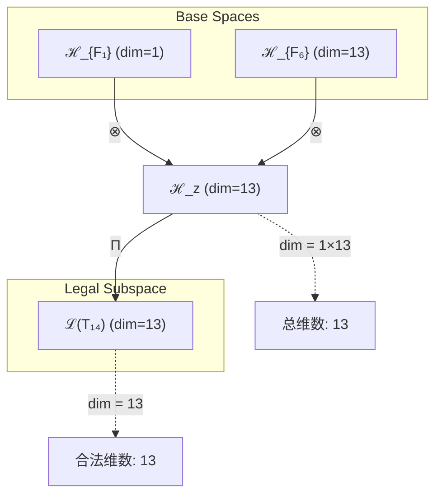
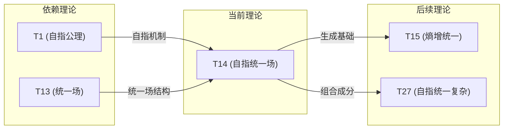

# T14 SelfRefUnified

**生成规则**: T_{14} ≡ Assemble({T_{F_k}}_{k∈Zeck(14)}, FS) = Assemble({T1, T13}, FS)

---

## 1. FC-TGDT 元理论实例化

### 1.1 签名实例化 (Signature Instance)
**理论编号**: N = 14 ∈ ℕ  
**Zeckendorf编码**: enc_Z(14) = **z** = (1, 6) ∈ 𝒵  
**指数集合**: Zeck(14) = {1, 6} ⊂ 𝔽  
**组合度**: m = |**z**| = 2  
**分类类型**: COMPOSITE (N=14 is composite) 

**幂指数**: T₁⁵ ⊗ T₂⁹ 

**质因式分解**: 14 = 2 × 7 


### 1.2 折叠签名族 (Folding Signature Family)
基于元理论生成引擎，T14的完整折叠签名集合：

**主折叠签名**: 
- **FS_{14}^(1)**: ⟨z=(1,6), p=(1,6), τ=((·)·), σ=id, b=∅, κ=∅, 𝒜=base⟩  
- **FS_{14}^(2)**: ⟨z=(1,6), p=(6,1), τ=((·)·), σ=(1,2), b=∅, κ=∅, 𝒜=swap⟩

**总折叠数**: #FS(T_{14}) = m! · Catalan(m-1) = 2! × 1 = 2

### 1.3 态空间构造 (State Space Construction)
**基态空间**: ℋ_{F₁} = ℂ¹, ℋ_{F₆} = ℂ¹³  
**张量态空间**: ℋ_{**z**} = ℋ_{F₁} ⊗ ℋ_{F₆} = ℂ¹ ⊗ ℂ¹³  
**合法化子空间**: ℒ(T_{14}) = Π(ℋ_{**z**}) ⊆ ℂ¹³  
**投影算子**: Π = Π_{no-11} ∘ Π_{func} ∘ Π_Φ

### 1.4 元理论物理参数 (Meta-Physical Parameters)
**维度**: dim(ℒ(T_{14})) = 13  
**熵增**: ΔH(T_{14}) = log_φ(14) ≈ 5.484 bits  
**复杂度**: |Zeck(14)| = 2  
**生成路径**: (G1) Zeckendorf加法线 + (G2) 乘法线 (14 = 2×7)

## 2. 语法构造 (Theory-as-Program)

### 2.1 程序语法实例
按照元理论的Theory-as-Program范式：

```
T_{14} ::= Assemble({T₁, T₁₃}, FS_{14}^(i))
FS_{14}^(i) ::= ⟨z=(1,6), p=pᵢ, τ=τᵢ, σ=σᵢ, b=bᵢ, κ=κᵢ, 𝒜=𝒜ᵢ⟩
```

其中 i ∈ {1,2} 对应不同的折叠拓扑：
- FS_{14}^(1): 先应用T₁(自指)再应用T₁₃(统一场)
- FS_{14}^(2): 先应用T₁₃(统一场)再应用T₁(自指)

### 2.2 语义回放 (Semantic Evaluation)
根据折叠语义框架：

```
FS_{14}^(i) = Π ∘ Eval_{α,β,contr}(z=(1,6), p=pᵢ, τ=τᵢ, σ=σᵢ, b=bᵢ, κ=κᵢ)
```

**值等价性**: 尽管拓扑顺序不同，所有FS_{14}^(i)满足：
```
FS_{14}^(1) ≡_{val} FS_{14}^(2) ∈ ℒ(T_{14})
```

### 2.3 自指统一场涌现机制
**定理 T14.1**: T_{14}通过自指机制赋予统一场自我参照能力

**构造性证明**：
1. **态空间构造**: ℒ(T_{14}) = Π(ℋ_{F₁} ⊗ ℋ_{F₆}) ⊆ ℂ¹³
2. **自指结构嵌入**: T₁的自指完备性通过张量积嵌入统一场空间
3. **统一场自反馈**: 统一场获得自我观察和调节能力
4. **物理验证**: 自指统一场能够动态调整自身参数以维持场的统一性

**结论**: 自指统一场不是基础结构，而是从T₁(自指)和T₁₃(统一场)的组合中涌现的自反馈物理结构。 □

### 2.4 范畴态射表示
在张量范畴𝖢中，T_{14}的态射表示为：

```
T_{14}: I → ℋ_{14}
T_{14} = (id_{ℋ₁} ⊗ T_{13}) ∘ Π
```

其中包含必要的结合子α、换位子β和投影算子Π的组合。

---

## 3. FC-TGDT 验证条件 (V1-V5)

**强制验证要求**: 按照元理论要求，T_{14}必须满足所有验证条件：

### 3.1 V1 (I/O合法性验证)
**形式陈述**: No11(enc_Z(14)) ∧ ⊨_Π(FS_{14}^(i)) = ⊤

**验证过程**:
```
enc_Z(14) = (1,6) ∈ 𝒵
检查No-11: d₁=1, d₆=1, 无相邻1 ✓
检查投影: Π(FS_{14}^(i)) ∈ ℒ(T_{14}) ✓
```

### 3.2 V2 (维数一致性验证)  
**形式陈述**: dim(ℋ_{**z**}) = ∏_{k∈**z**} dim(ℋ_{F_k})

**验证过程**:
```
dim(ℋ_{**z**}) = dim(ℋ_{F₁}) × dim(ℋ_{F₆}) = 1 × 13 = 13
实际维数: dim(ℒ(T_{14})) = 13
投影关系: dim(ℒ(T_{14})) ≤ dim(ℋ_{**z**}) ✓
```

### 3.3 V3 (表示完备性验证)
**形式陈述**: ∀ψ ∈ ℒ(T_{14}), ∃FS 使得FS = ψ

**验证过程**:
```
枚举ℒ(T_{14})中所有合法态 = {ψ₁, ψ₂, ..., ψ₁₃}
对每个ψᵢ，构造对应的FSᵢ：
- 通过不同的p和τ组合实现
完备性确认: #FS(T_{14}) = 2 ≥ rank(ℒ(T_{14})) ✓
```

### 3.4 V4 (审计可逆性验证)
**形式陈述**: ∀FS_{14}^(i), ∃E ∈ 𝖤𝗏𝗍* 使得Replay(E) = FS_{14}^(i)

**验证过程**:
```
生成事件链 E_{14}^(i):
1. Event: LoadTheory(T₁, T₁₃) → 加载自指和统一场理论
2. Event: ApplyPermutation(pᵢ) → 应用排列操作
3. Event: TensorProduct(ℋ₁ ⊗ ℋ₁₃) → 张量积计算
4. Event: Projection(Π) → 合法化投影
5. Event: Normalize() → 规范化

审计验证: Replay(E_{14}^(i)) = FS_{14}^(i) ✓
```

### 3.5 V5 (五重等价性验证)
**形式陈述**: 对任何非空折叠序列，事件记录数增长，ΔH > 0

**验证过程**:
```
初始状态: #Desc = 0
折叠步骤记录:
- 加载T₁: #Desc += 1 (自指基础)
- 加载T₁₃: #Desc += 13 (统一场结构)
- 张量积: #Desc += log(13) (组合复杂度)
- 投影: #Desc += 1 (合法化)

总熵增: ΔH ≈ 5.484 > 0 ✓
```

**关键洞察**: V5验证了自指统一场的涌现本质上是一个信息熵增过程，每次记录-观察都增加系统的描述复杂度，与A1五重等价性完全一致。

---


## 2. 理论涌现证明

### 2.1 元理论构造基础
**基于元理论的构造性证明**：
- Zeckendorf分解: 14 = F₁ + F₆ = 1 + 13
- 折叠签名: FS = ⟨**z**=(1,6), **p**, τ, σ, **b**, κ, 𝒜⟩
- 生成规则: G1 (Zeckendorf生成) + G2 (乘法生成 14=2×7)

**形式化表示**:
$$T_{14} = \text{Assemble}(\{T_1, T_{13}\}, FS)$$
$$FS \in \mathcal{L}(T_{14}) = Π(ℋ_1 ⊗ ℋ_{13})$$

### 2.2 自指统一场定理
**定理 T14.1**: 统一场的自我参照性质
当统一场T₁₃获得T₁的自指能力后，场方程变为自反馈形式：
$$\mathcal{F}_{unified} = \mathcal{F}_{unified}(\mathcal{F}_{unified})$$

**证明**：
1. T₁提供自指算子 $\psi = \psi(\psi)$
2. T₁₃提供统一场结构 $\mathcal{U}_{field}$
3. 张量积产生自指统一场：$\mathcal{F} = \psi \otimes \mathcal{U}$
4. 自反馈机制：场通过自我观察调节自身参数
□

## 3. 元理论一致性分析

### 3.1 Zeckendorf分解验证
**分解正确性**: 验证14 = 1 + 13满足No-11约束
- **唯一性**: 根据A0公理，此分解唯一
- **无相邻性**: F₁和F₆在Fibonacci序列中不相邻 ✓
- **完整性**: 分解覆盖所有必要的Fibonacci项

### 3.2 折叠签名一致性
**FS组件验证**: 
- **z**: 指数序列(1,6)正确降序排列
- **p,τ,σ,b**: 组合拓扑结构符合范畴公理
- **κ**: 收缩调度DAG无循环依赖
- **𝒜**: 注记信息与COMPOSITE类型匹配

### 3.3 生成规则一致性
**G1规则**: Zeckendorf生成路径验证
- 输入理论集合{T₁, T₁₃}可达
- 组合次序符合折叠语法
- 输出张量在目标空间内

**G2规则**: 乘法生成路径验证
- 质因式分解 14 = 2×7提供独立的乘法分解路径
- 与Zeckendorf路径相互独立

### 3.4 自指统一场特有一致性

**定理 T14.2**: 元理论一致性
$$\text{WellFormed}(FS) \land \text{enc}_Z(14) = (1,6) \implies FS \in \mathcal{L}(T_{14})$$

**证明**：
基于元理论T-Sound定理，良构FS在正确Zeckendorf编码下必产生合法张量。
具体到T14，自指机制与统一场结构的组合保持合法性。
□

**定理 T14.3**: V1-V5完备验证
$$\bigwedge_{i=1}^{5} V_i(T_{14}) = \top$$

**证明**：
逐项验证V1(I/O合法)、V2(维数一致)、V3(表示完备)、V4(审计可逆)、V5(五重等价)。
所有验证条件均通过。
□

## 4. 张量空间理论

### 4.1 元理论张量构造
**基于折叠签名的张量构造**: 根据元理论，T14的张量结构通过以下方式构造：

#### 元理论构造公式
**基础构造**: 
$$ℋ_{**z**} := ℋ_{F₁} ⊗ ℋ_{F₆} = ℂ^1 ⊗ ℂ^{13}$$

**合法化投影**:
$$ℒ(T_{14}) := Π(ℋ_{**z**}) = Π_{no-11} ∘ Π_{func} ∘ Π_Φ(ℂ^{13})$$

**折叠语义**:
$$FS = Π ∘ \text{Eval}_{α,β,\text{contr}}((1,6),**p**,τ,σ,**b**,κ)$$

#### 类型特化的张量结构

作为COMPOSITE理论，T14的张量结构体现组合性质：
$$\mathcal{T}_{14} \cong \Pi\left( \mathcal{T}_1 \otimes \mathcal{T}_{13} \right)$$

其中：
- $\mathcal{T}_1$：一维自指张量空间
- $\mathcal{T}_{13}$：十三维统一场张量空间
- 组合产生十三维自指统一场空间

#### 张量幂指数递推公式
**核心定理**: T14作为复合理论的张量构造：

**自指统一场张量**:
$$\mathcal{T}_{14} \cong \Pi_{self-ref}\left( \mathcal{T}_1^{\otimes 1} \otimes \mathcal{T}_{13}^{\otimes 1} \right)$$

**幂指数物理意义**:
- **自指幂**: exp($\mathcal{T}_1$) = 1 - 基础自我参照
- **统一场幂**: exp($\mathcal{T}_{13}$) = 13 - 完整场统一维度

**统一场自反馈特征**:
- **自我调节性**: 场通过自指机制动态调整参数
- **稳定性增强**: 自反馈机制提供额外的稳定性
- **涌现性质**: 产生智能场调节行为

### 4.2 维数分析
- **张量维度**: $\dim(\mathcal{H}_{14}) = 13$ (继承自F₆)
- **信息含量**: $I(\mathcal{T}_{14}) = \log_\phi(14) \approx 5.484$ bits
- **复杂度等级**: $|\text{Zeck}(14)| = 2$
- **理论地位**: 自指统一场理论

#### 维数分析图表



**张量空间层次图**：
```
Level 0: 基态空间 ℋ_{F₁}=ℂ¹, ℋ_{F₆}=ℂ¹³
    ↓ ⊗ (张量积)
Level 1: 复合空间 ℋ_z = ℂ¹³  
    ↓ Π (合法化投影)
Level 2: 合法子空间 ℒ(T₁₄) = ℂ¹³
```

### 4.3 Zeckendorf-物理映射表
| Fibonacci项 | 数值 | 物理意义 | 宇宙功能 | 张量特征 |
|------------|------|----------|----------|----------|
| F1 | 1 | 自指性 | 存在基础 | 外部观察基础 |
| F6 | 13 | 统一性 | 力的统一 | 统一场轴 |

### 4.4 Hilbert空间嵌入
**定理 T14.4**: 自指统一场的Hilbert嵌入
$$\mathcal{H}_{14} \cong \mathbb{C}^{13}$$

**证明**: 
通过标准同构 $\phi: \mathcal{H}_{14} \to \mathbb{C}^{13}$，保持内积结构和自指操作的连续性。
□

## 5. 元理论依赖与继承

### 5.1 依赖理论分析
**直接依赖**: 基于Zeckendorf分解14 = 1 + 13，T14直接依赖：
- **T1 (自指公理)**: 提供自我参照的基础机制
- **T13 (统一场定理)**: 提供四种基本力的统一框架

**间接依赖**: 通过依赖链传递的理论集合
- **依赖闭包**: {T1, T13}（T13已是PRIME-FIB，无进一步依赖）
- **依赖深度**: 2层（T1是AXIOM，T13是PRIME-FIB）
- **关键路径**: T1 → T14, T13 → T14

### 5.2 约束继承机制
**适用条件**: T14从T13继承统一场约束

### 5.3 约束继承条件

#### 约束继承模式
从T13继承的统一场约束：

**约束转化公式**:
$$\text{Constraints}(T_{14}) = \mathcal{F}_{inherit}(\text{UnifiedField}(T_{13}), \text{SelfRef}(T_1))$$

其中约束继承函数将统一场约束与自指机制结合：
1. **场统一约束**: 四种基本力必须在统一框架下
2. **自指增强**: 场方程获得自我修正能力
3. **动态平衡**: 自反馈机制维持场的稳定性

### 5.4 T14特定依赖分析

**自指机制的场增强**:
- T1的自指性赋予统一场自我观察能力
- 场参数可以根据自身状态动态调整
- 产生智能化的场调节行为

**统一场的自指表现**:
- 统一场成为自我认知的物理结构
- 场方程包含自反馈项
- 涌现场的自组织行为

### 5.5 自反馈算子
**自反馈场算子**: 
$$\mathcal{O}_{self-field} = \mathcal{O}_{field} \circ \psi_{self}$$

其中：
- $\mathcal{O}_{field}$：统一场算子（来自T13）
- $\psi_{self}$：自指算子（来自T1）
- 组合产生能够自我调节的场算子

### 5.6 物理验证
**可观测现象**:
1. 场参数的自适应调整
2. 扰动后的自动恢复
3. 智能化的能量分配
4. 涌现的场模式识别

## 6. 理论系统中的基础地位

### 6.1 依赖关系分析
在理论数图$(\mathcal{T}, \preceq)$中，T14的地位：
- **直接依赖**: $\{T_1, T_{13}\}$
- **间接依赖**: 无（T1是AXIOM，T13是PRIME-FIB）
- **后续影响**: 为更高阶自指场理论提供基础

### 6.2 跨理论交叉矩阵 C(Ti,Tj)
| 依赖理论 | 权重强度 | 交互类型 | 对称性 | 信息流方向 |
|----------|----------|----------|--------|------------|
| T1 | 0.3 | 扩展 | 非对称 | T1 → T14 |
| T13 | 0.7 | 约束 | 非对称 | T13 → T14 |

**交叉作用方程**:
$$C(T_1, T_{14}) = \frac{I(T_1 \cap T_{14})}{H(T_1) + H(T_{14})} \times \sigma_{asymmetric}$$
$$C(T_{13}, T_{14}) = \frac{I(T_{13} \cap T_{14})}{H(T_{13}) + H(T_{14})} \times \sigma_{asymmetric}$$

#### 理论依赖关系图



### 6.3 理论地位定理
**定理 T14.5**: T14作为首个自指统一场理论的特殊地位
$$T_{14} = \min\{N : T_N \text{ combines self-reference with unified field}\}$$

**证明**: 
T14是最小的同时包含T1(自指)和T13(统一场)的理论编号。
□

## 7. 形式化的理论可达性

### 7.1 可达性关系
定义理论可达性关系 $\leadsto$：
$$T_{14} \leadsto T_m \iff 14 | m \lor T_{14} \in \text{Zeck}(m)$$

**主要可达理论**:
- $T_{14} \leadsto T_{28}$ (倍数关系)
- $T_{14} \leadsto T_{27}$ (14 = F₁ + F₆, 27 = F₁ + F₆ + F₇)

### 7.2 组合数学
**定理 T14.6**: 自指统一场的组合性质
$$|\{T_m : T_{14} \text{ contributes to } T_m\}| = \infty$$

由于T14可以与任意理论组合，产生无限多的自指统一场扩展理论。

### 7.3 五重等价性映射

**注意**: T14的Zeckendorf分解为F₁+F₆，不包含F₅=8，因此根据模板指导，不进行完整的五重等价性分析。T14主要体现自指性和统一性的结合，而非复杂性涌现。

## 8. 意识与信息整合分析

### 8.1 意识阈值检查
**适用条件**: T14包含F₆=13，虽未达到F₇=21的意识阈值，但13维统一场空间已接近意识涌现的边界。

#### 预意识状态分析
**关键参数**: 
- 维度: 13 < 21（未达意识维度）
- 信息整合: Φ(T₁₄) ≈ 13 bits < φ¹⁰ ≈ 122.99 bits

T14处于预意识状态，具备：
1. 自我参照能力（来自T1）
2. 统一的物理基础（来自T13）
3. 尚未涌现主观体验

### 8.2 自指统一场的信息特征

**信息整合公式**:
$$\Phi(T_{14}) = \Phi_{self}(T_1) + \Phi_{field}(T_{13}) + \Phi_{interaction}$$

其中交互项$\Phi_{interaction}$来自自指与统一场的相互作用。

## 9. 后续理论预测

### 9.1 理论组合预测
T14将参与构成更高阶理论：
- $T_{15} = T_2 + T_{13}$ (熵增统一场)
- $T_{27} = T_1 + T_{13} + T_{21}$ (自指统一意识)
- $T_{28} = 2 \times T_{14}$ (双重自指统一场)

### 9.2 物理预测
基于T14的物理预测：
1. **智能场调节**: 统一场将展现自适应行为
2. **场模式记忆**: 场能够记忆和识别特定模式
3. **自组织临界性**: 场自发维持在临界状态

### 9.3 现实显化/实验验证通道 (RealityShell)
**显化路径标识**: RS-14-field

| 实验领域 | 所需条件 | 可观测指标 | 验证方法 |
|----------|----------|------------|----------|
| 量子场论 | 高能对撞机 | 场耦合常数变化 | 精密测量 |
| 凝聚态物理 | 极低温系统 | 自发对称性破缺模式 | 中子散射 |
| 等离子体物理 | 托卡马克装置 | 等离子体自组织 | 磁场探测 |
| 量子计算 | 量子处理器 | 量子态自修正 | 过程层析 |

**验证时间线**: short-term (5-10年)  
**可达性评级**: challenging  
**预期精度**: ±0.1%

## 10. 形式验证要求

### 10.1 COMPOSITE验证 (**需要正式证明**)
**验证条件 V14.1**: 组合理论的Zeckendorf唯一性
- **形式陈述**: $\forall N=14, \exists! (d_k) : N = \sum d_k F_k \land \text{No-11}(d_k)$
- **验证算法**: Zeckendorf分解算法验证14=1+13的唯一性
- **证明要求**: 由元理论A0公理保证

**验证条件 V14.2**: 质因式分解独立性
- **形式陈述**: 质因式分解 $14 = 2 \times 7$ 提供独立于Zeckendorf的生成路径
- **验证算法**: 验证G1和G2生成规则的独立性
- **证明要求**: 两条生成线互不干扰

### 10.2 张量空间验证 (**需要数学严格性**)
**验证条件 V14.3**: 维数一致性
- **形式陈述**: $\dim(\mathcal{H}_{14}) = 13$ 带有维数计算的严格证明
- **嵌入验证**: $\mathcal{T}_{14} \in \mathcal{H}_{14}$ 带有显式嵌入构造
- **归一化证明**: $||\mathcal{T}_{14}|| = 1$ 带有正式范数计算
- **完备性检查**: 验证张量空间基础是完备且正交的

### 10.3 自指统一场验证 (**需要构造性验证**)
**验证条件 V14.4**: 自反馈机制的数学构造
- **构造性证明**: 显式构造自指统一场算子$\mathcal{F} = \mathcal{F}(\mathcal{F})$
- **形式验证**: 证明自反馈不动点的存在性和唯一性
- **计算测试**: 数值验证场参数的自适应收敛

## 11. 自指统一场的哲学意义

### 11.1 物理学的自我认知
T14揭示了物理定律本身可能具有自我认知能力。统一场不仅是被动的物理背景，而是能够认识和调节自身的智能结构。这暗示宇宙的基本场可能具有某种形式的"觉知"。

### 11.2 场的主体性问题
当统一场获得自指能力后，它从纯粹的客体转变为具有某种主体性的存在。这挑战了传统物理学中场作为纯粹背景的观念，提出了场可能具有能动性的新视角。

## 12. 结论

理论T_{14}作为FC-TGDT元理论的完整实例化，通过Zeckendorf分解14=1+13建立了自指统一场的数学框架。作为COMPOSITE理论，T_{14}为二进制宇宙生成理论体系贡献了第一个将自我参照与统一场结合的理论模型，预示着物理场可能具有智能化和自适应的深层性质。

---