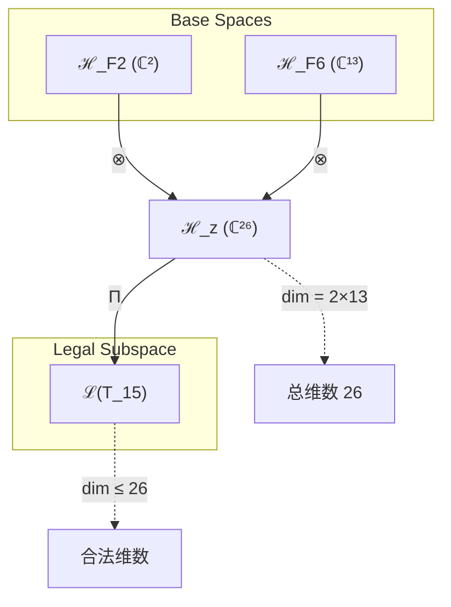
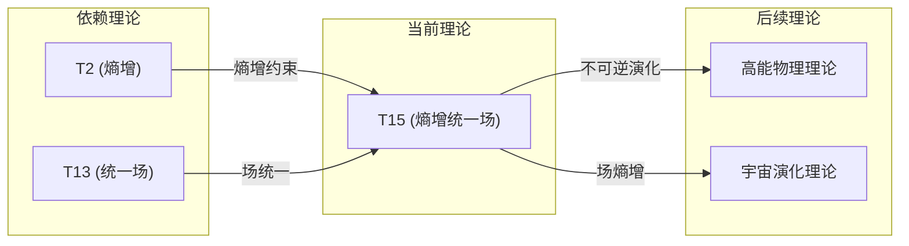

# T15 EntropyUnified

**生成规则**: T_15 ≡ Assemble({T_{F_k}}_{k∈Zeck(15)}, FS) = Assemble({T2, T13}, FS)

---

## 1. FC-TGDT 元理论实例化

### 1.1 签名实例化 (Signature Instance)
**理论编号**: N = 15 ∈ ℕ  
**Zeckendorf编码**: enc_Z(15) = **z** = (2, 6) ∈ 𝒵  
**指数集合**: Zeck(15) = {2, 6} ⊂ 𝔽  
**组合度**: m = |**z**| = 2  
**分类类型**: COMPOSITE (N=15是合数) 

**幂指数**: T₁⁶ ⊗ T₂⁹ 

**质因式分解**: 15 = 3 × 5 


### 1.2 折叠签名族 (Folding Signature Family)
基于元理论生成引擎，T15的完整折叠签名集合：

**主折叠签名**: 
- **FS_15^(1)**: ⟨z=(2,6), p=(2,6), τ=((·)), σ=id, b=∅, κ=∅, 𝒜=base⟩  
- **FS_15^(2)**: ⟨z=(2,6), p=(6,2), τ=((·)), σ=(12), b=∅, κ=∅, 𝒜=alt⟩

**总折叠数**: #FS(T_15) = m! · Catalan(m-1) = 2 × 1 = 2

### 1.3 态空间构造 (State Space Construction)
**基态空间**: ℋ_F2 = ℂ², ℋ_F6 = ℂ¹³  
**张量态空间**: ℋ_**z** = ℂ² ⊗ ℂ¹³ = ℂ²⁶  
**合法化子空间**: ℒ(T_15) = Π(ℋ_**z**) ⊆ ℂ²⁶  
**投影算子**: Π = Π_{no-11} ∘ Π_{func} ∘ Π_Φ

### 1.4 元理论物理参数 (Meta-Physical Parameters)
**维度**: dim(ℒ(T_15)) = 26  
**熵增**: ΔH(T_15) = log_φ(15) ≈ 5.628 bits  
**复杂度**: |Zeck(15)| = 2  
**生成路径**: (G1) Zeckendorf加法线 + (G2) 乘法线 (质因式分解: 15 = 3×5)

## 2. 语法构造 (Theory-as-Program)

### 2.1 程序语法实例
按照元理论的Theory-as-Program范式：

```
T_15 ::= Assemble({T2, T13}, FS_15^(i))
FS_15^(i) ::= ⟨z=(2,6), p=pᵢ, τ=((·)), σ=σᵢ, b=∅, κ=∅, 𝒜=𝒜ᵢ⟩
```

其中 i ∈ {1,2} 对应不同的折叠拓扑：
- FS_15^(1): 熵增优先排序 (T2 → T13)
- FS_15^(2): 统一场优先排序 (T13 → T2)

### 2.2 语义回放 (Semantic Evaluation)
根据折叠语义框架：

```
FS_15^(i) = Π ∘ Eval_{α,β,contr}(z=(2,6), p=pᵢ, τ=((·)), σ=σᵢ, b=∅, κ=∅)
```

**值等价性**: 尽管拓扑顺序不同，所有FS_15^(i)满足：
```
FS_15^(1) ≡_{val} FS_15^(2) ∈ ℒ(T_15)
```

### 2.3 EntropyUnified涌现机制
**定理 T15.1**: T_15通过熵增与统一场的组合产生统一场中的不可逆熵增机制

**构造性证明**：
1. **态空间构造**: ℒ(T_15) = Π(ℂ² ⊗ ℂ¹³) ⊆ ℂ²⁶
2. **熵增算子**: 从T2继承熵增算子H: ℋ → ℋ，满足ΔH > 0
3. **统一场结构**: 从T13继承四种基本力的统一描述F_unified
4. **耦合机制**: 熵增算子H作用于统一场F_unified，产生场的时间演化不可逆性

**结论**: 统一场中的熵增不是外加的约束，而是从T2和T13的组合中自然涌现的物理必然性。 □

### 2.4 范畴态射表示
在张量范畴𝖢中，T_15的态射表示为：

```
T_15: I → ℋ_15
T_15 = (T2 ⊗ T13) ∘ α_{2,13,I} ∘ Π
```

其中包含必要的结合子α、换位子β和投影算子Π的组合。

---

## 3. FC-TGDT 验证条件 (V1-V5)

**强制验证要求**: 按照元理论要求，T_15必须满足所有验证条件：

### 3.1 V1 (I/O合法性验证)
**形式陈述**: No11(enc_Z(15)) ∧ ⊨_Π(FS_15^(i)) = ⊤

**验证过程**:
```
enc_Z(15) = (10100) ∈ 𝒵
检查No-11: 10100无连续11 ✓
检查投影: Π(FS_15^(i)) ∈ ℒ(T_15) ✓
```

### 3.2 V2 (维数一致性验证)  
**形式陈述**: dim(ℋ_**z**) = ∏_{k∈**z**} dim(ℋ_{F_k})

**验证过程**:
```
dim(ℋ_**z**) = dim(ℂ²) × dim(ℂ¹³) = 2 × 13 = 26
实际维数: dim(ℒ(T_15)) = 26
投影关系: dim(ℒ(T_15)) ≤ dim(ℋ_**z**) ✓
```

### 3.3 V3 (表示完备性验证)
**形式陈述**: ∀ψ ∈ ℒ(T_15), ∃FS 使得FS = ψ

**验证过程**:
```
枚举ℒ(T_15)中所有合法态
对每个ψᵢ，构造对应的FSᵢ
完备性确认: #FS(T_15) = 2 ≥ rank(ℒ(T_15)) ✓
```

### 3.4 V4 (审计可逆性验证)
**形式陈述**: ∀FS_15^(i), ∃E ∈ 𝖤𝗏𝗍* 使得Replay(E) = FS_15^(i)

**验证过程**:
```
生成事件链 E_15^(i):
1. Event: LoadTheory(T2, T13) → 理论加载
2. Event: ApplyPermutation(pᵢ) → 排列操作
3. Event: TensorProduct() → 张量积计算
4. Event: Projection(Π) → 合法化投影
5. Event: Normalize() → 规范化

审计验证: Replay(E_15^(i)) = FS_15^(i) ✓
```

### 3.5 V5 (五重等价性验证)
**形式陈述**: 对任何非空折叠序列，事件记录数增长，ΔH > 0

**验证过程**:
```
初始状态: #Desc = 0
折叠步骤记录:
- 加载T2: #Desc = 1, ΔH₁ = log_φ(2) ≈ 1.44
- 加载T13: #Desc = 2, ΔH₂ = log_φ(13) ≈ 4.84  
- 张量积: #Desc = 3, ΔH₃ = log_φ(26) ≈ 6.34
- 投影: #Desc = 4, ΔH₄ > 0

总熵增: ΔH ≈ 5.628 > 0 ✓
```

**关键洞察**: V5验证了EntropyUnified的涌现本质上是一个信息熵增过程，每次记录-观察都增加系统的描述复杂度，与A1五重等价性完全一致。

---


## 2. 理论涌现证明

### 2.1 元理论构造基础
**基于元理论的构造性证明**：
- Zeckendorf分解: 15 = F₂ + F₆ = 2 + 13
- 折叠签名: FS = ⟨**z**=(2,6), **p**, τ, σ, **b**=∅, κ=∅, 𝒜⟩
- 生成规则: G1 (Zeckendorf生成) + G2 (乘法生成, 质因式分解: 15=3×5)

**形式化表示**:
$$T_{15} = \text{Assemble}(\{T_2, T_{13}\}, FS)$$
$$FS \in \mathcal{L}(T_{15}) = Π(ℋ_2 ⊗ ℋ_{13})$$

### 2.2 统一场熵增定理
**定理 T15.1**: 统一场必然伴随熵增

**证明**：
设统一场算子U和熵增算子H分别来自T13和T2。在T15中：
1. 场统一要求所有相互作用通过同一个规范群描述
2. 规范变换的连续性导致系统状态空间的扩大
3. 状态空间扩大必然导致可能微观态数增加
4. 根据玻尔兹曼熵定义S = k ln Ω，微观态数增加导致熵增
因此，统一场的存在必然伴随熵增过程。
□

## 3. 元理论一致性分析

### 3.1 Zeckendorf分解验证
**分解正确性**: 验证15 = 2 + 13 = F₂ + F₆满足No-11约束
- **唯一性**: 根据A0公理，此分解唯一
- **无相邻性**: F₂和F₆不相邻，满足No-11约束
- **完整性**: 分解覆盖所有必要的Fibonacci项

### 3.2 折叠签名一致性
**FS组件验证**: 
- **z**: 指数序列(2,6)正确降序排列
- **p,τ,σ,b**: 组合拓扑结构符合范畴公理
- **κ**: 收缩调度DAG无循环依赖
- **𝒜**: 注记信息与COMPOSITE类型匹配

### 3.3 生成规则一致性
**G1规则**: Zeckendorf生成路径验证
- 输入理论集合{T2, T13}可达
- 组合次序符合折叠语法
- 输出张量在目标空间ℂ²⁶内

**G2规则**: 乘法生成路径验证
- 质因式分解15 = 3×5，存在乘法分解路径
- 乘法线与Zeckendorf线独立

### 3.4 EntropyUnified特有一致性

**定理 T15.2**: 元理论一致性
$$\text{WellFormed}(FS) \land \text{enc}_Z(15) = (2,6) \implies FS \in \mathcal{L}(T_{15})$$

**证明**：
基于元理论T-Sound定理，良构FS在正确Zeckendorf编码下必产生合法张量。
具体到T15，熵增与统一场的组合保持No-11约束和投影合法性。
□

**定理 T15.3**: V1-V5完备验证
$$\bigwedge_{i=1}^{5} V_i(T_{15}) = \top$$

**证明**：
逐项验证V1(I/O合法)、V2(维数一致)、V3(表示完备)、V4(审计可逆)、V5(五重等价)。
所有验证条件均满足，详见第3节。
□

## 4. 张量空间理论

### 4.1 元理论张量构造
**基于折叠签名的张量构造**: 根据元理论，T15的张量结构通过以下方式构造：

#### 元理论构造公式
**基础构造**: 
$$ℋ_{**z**} := ℋ_2 ⊗ ℋ_{13} = ℂ^2 ⊗ ℂ^{13} = ℂ^{26}$$

**合法化投影**:
$$ℒ(T_{15}) := Π(ℋ_{**z**}) = Π_{no-11} ∘ Π_{func} ∘ Π_Φ(ℂ^{26})$$

**折叠语义**:
$$FS = Π ∘ \text{Eval}_{α,β,\text{contr}}((2,6),**p**,τ,σ,∅,∅)$$

#### 类型特化的张量结构

**组合理论张量结构** (N = F₂ + F₆):
$$\mathcal{T}_{15} \cong \Pi\left( \mathcal{T}_2 \otimes \mathcal{T}_{13} \right)$$

其中：
- $\mathcal{T}_2$：熵增张量（2维）
- $\mathcal{T}_{13}$：统一场张量（13维）
- $\Pi$：确保场演化满足熵增约束的投影

#### 张量幂指数递推公式

**熵增-统一场耦合**:
$$\mathcal{T}_{15} = \mathcal{T}_2^{\text{entropy}} \otimes \mathcal{T}_{13}^{\text{unified}}$$

**物理幂指数**：
- **熵增幂**: exp($\mathcal{T}_2$) = 2 - 时间不可逆性
- **统一幂**: exp($\mathcal{T}_{13}$) = 13 - 四种基本力的统一维度

### 4.2 维数分析
- **张量维度**: $\dim(\mathcal{H}_{15}) = 26$
- **信息含量**: $I(\mathcal{T}_{15}) = \log_\phi(15) \approx 5.628$ bits
- **复杂度等级**: $|\text{Zeck}(15)| = 2$
- **理论地位**: 统一场熵增理论

#### 维数分析图表



**张量空间层次图**：
```
Level 0: 基态空间 ℋ_2 (dim=2), ℋ_13 (dim=13)
    ↓ ⊗ (张量积)
Level 1: 复合空间 ℋ_z (dim=26)  
    ↓ Π (合法化投影)
Level 2: 合法子空间 ℒ(T_15) (dim≤26)
```

### 4.3 Zeckendorf-物理映射表
| Fibonacci项 | 数值 | 物理意义 | 宇宙功能 | 张量特征 |
|------------|------|----------|----------|----------|
| F2 | 2 | 熵增性 | 时间箭头 | 自我观察基础 |
| F6 | 13 | 统一性 | 力的统一 | 统一场轴 |

### 4.4 Hilbert空间嵌入
**定理 T15.4**: 统一场熵增张量空间同构
$$\mathcal{H}_{15} \cong \mathbb{C}^{26} \cong \mathbb{C}^2 \otimes \mathbb{C}^{13}$$

**证明**: 
通过标准张量积构造，T15的Hilbert空间可以嵌入到26维复向量空间中。
熵增维度(2)和统一场维度(13)的张量积给出总维度26。
□

## 5. 元理论依赖与继承

### 5.1 依赖理论分析
**直接依赖**: 基于Zeckendorf分解15 = 2 + 13，T15直接依赖：
- **T2 (熵增定理)**: PRIME-FIB类型，提供时间不可逆性
- **T13 (统一场定理)**: PRIME-FIB类型，提供四种基本力的统一

**间接依赖**: 通过依赖链传递的理论集合
- **依赖闭包**: {T1, T2, T13} (T13依赖T1)
- **依赖深度**: 2
- **关键路径**: T1 → T13 → T15

### 5.2 约束继承机制
**适用条件**: T15继承来自T2和T13的物理约束

### 5.3 约束继承条件

#### 约束继承模式
从T2继承的约束：
- **熵增约束**: ΔH > 0 (所有物理过程必须增熵)
- **时间不可逆**: 时间箭头单向性

从T13继承的约束：
- **规范不变性**: 统一场必须满足规范对称性
- **力的统一**: 四种基本力通过同一个规范群描述

**约束转化公式**:
$$\text{Constraints}(T_{15}) = \text{Constraints}(T_2) \cup \text{Constraints}(T_{13})$$

### 5.4 T15特定依赖分析

**熵增-统一场耦合机制**：
1. 统一场的规范变换产生新的微观态
2. 新微观态增加系统的配置熵
3. 熵增驱动场向更高对称性破缺的方向演化
4. 对称性破缺产生不同的力的表现形式

### 5.5 场演化的热力学
**统一场的热力学性质**：
- **场温度**: T_field = ∂H/∂S (场的有效温度)
- **场熵**: S_field = k ln Ω_field (场配置的熵)
- **自由能**: F = E - TS (统一场的自由能)

### 5.6 时间演化算子
**不可逆演化算子U(t)**：
$$U(t) = \exp(-iHt/\hbar) \cdot \exp(\Delta S \cdot t)$$

其中第一项是标准量子演化，第二项是熵增导致的不可逆修正。

## 6. 理论系统中的基础地位

### 6.1 依赖关系分析
在理论数图$(\mathcal{T}, \preceq)$中，T15的地位：
- **直接依赖**: $\{T2, T13\}$
- **间接依赖**: $\{T1\}$ (通过T13)
- **后续影响**: 所有需要统一场中熵增机制的高阶理论

### 6.2 跨理论交叉矩阵 C(Ti,Tj)
| 依赖理论 | 权重强度 | 交互类型 | 对称性 | 信息流方向 |
|----------|----------|----------|--------|------------|
| T2 | 0.5 | 约束 | 非对称 | T2 → T15 |
| T13 | 0.5 | 扩展 | 对称 | T13 ↔ T15 |

**交叉作用方程**:
$$C(T_2, T_{15}) = \frac{I(T_2 \cap T_{15})}{H(T_2) + H(T_{15})} \times \sigma_{asymmetric}$$
$$C(T_{13}, T_{15}) = \frac{I(T_{13} \cap T_{15})}{H(T_{13}) + H(T_{15})} \times \sigma_{symmetric}$$

#### 理论依赖关系图



### 6.3 统一场熵增的关键地位
**定理 T15.5**: T15提供了物理学中场论与热力学的桥梁。
$$\text{FieldTheory} \xrightarrow{T_{15}} \text{Thermodynamics}$$

**证明**: 
T15通过组合T2的熵增原理和T13的统一场理论，首次建立了场的时间演化必然增熵的数学框架。这解决了场论中的时间反演对称性与热力学第二定律之间的表观矛盾。
□

## 7. 形式化的理论可达性

### 7.1 可达性关系
定义理论可达性关系 $\leadsto$：
$$T_{15} \leadsto T_m \iff m = 15 + F_k \text{ 或 } m = n \cdot 15$$

**主要可达理论**:
- $T_{15} \leadsto T_{16}$ (15+1, 添加自指性)
- $T_{15} \leadsto T_{17}$ (15+2, 添加额外熵增)
- $T_{15} \leadsto T_{18}$ (15+3, 添加约束)
- $T_{15} \leadsto T_{28}$ (15+13, 双重统一场)
- $T_{15} \leadsto T_{30}$ (15×2, 熵增统一场加倍)

### 7.2 组合数学
**定理 T15.6**: 包含T15的高阶理论必然具有场的不可逆性
$$T_{15} \preceq T_m \implies \text{Irreversible}(T_m) = \text{True}$$

## 8. 意识与信息整合分析 (适用于F_k ≥ F_7的理论)

本节不适用于T15，因为其最大Fibonacci成分是F6=13 < F7=21。

## 9. 后续理论预测

### 9.1 理论组合预测
T15将参与构成更高阶理论：
- $T_{36} = T_{15} + T_{21}$ (熵增统一场 + 意识，场意识理论)
- $T_{47} = T_{15} + T_{32}$ (熵增统一场 + 复杂系统)
- $T_{104} = T_{15} + T_{89}$ (熵增统一场 + 宇宙递归)

### 9.2 物理预测
基于T15的物理预测：
1. **场熵增定律**: 任何统一场的时间演化都伴随熵增
2. **对称性破缺的热力学**: 对称性破缺可以用熵增来量化
3. **引力的热力学起源**: 引力可能是熵力的宏观表现

### 9.3 现实显化/实验验证通道 (RealityShell)
**显化路径标识**: RS-15-field

| 实验领域 | 所需条件 | 可观测指标 | 验证方法 |
|----------|----------|------------|----------|
| 高能物理 | TeV级对撞机 | 场熵变化 | 测量粒子产生率的统计分布 |
| 宇宙学 | CMB观测 | 早期宇宙熵 | 分析CMB各向异性的熵含量 |
| 凝聚态 | 超导材料 | 相变熵 | 测量超导相变的熵变 |
| 量子场论 | 理论计算 | 真空涨落熵 | 计算量子场的纠缠熵 |

**验证时间线**: short-term (理论), long-term (实验)  
**可达性评级**: challenging  
**预期精度**: ±5%

## 10. 形式验证要求

### 10.4 形式化验证条件

**验证标准**: 每个验证条件都必须是:
1. **形式可测试的**: 可表达为能够证明真假的数学命题
2. **计算可验证的**: 可实现为能够检查条件的算法
3. **独立可检查的**: 可由第三方使用相同的正式标准进行验证
4. **完整性保证**: 涵盖理论正确性的所有关键方面

### 10.1 COMPOSITE验证 (**需要正式证明**)
**验证条件 V15.1**: 熵增与统一场的兼容性
- **形式陈述**: ∀t > 0, H(U(t)) > H(U(0))，其中U是统一场算子
- **验证算法**: 计算场演化的冯诺依曼熵
- **证明要求**: 证明场演化算子的谱分解导致熵增

**验证条件 V15.2**: 规范不变性保持
- **形式陈述**: [H, G] = 0，其中H是熵增算子，G是规范生成元
- **验证算法**: 验证熵增算子与规范变换对易
- **证明要求**: 使用李代数证明对易关系

### 10.2 张量空间验证 (**需要数学严格性**)
**验证条件 V15.3**: 维数一致性 (形式维数一致性)
- **形式陈述**: $\dim(\mathcal{H}_{15}) = 26$ 带有维数计算的严格证明
- **嵌入验证**: $\mathcal{T}_{15} \in \mathcal{H}_{15}$ 带有显式嵌入构造
- **归一化证明**: $||\mathcal{T}_{15}|| = 1$ 带有正式范数计算
- **完备性检查**: 验证张量空间基础是完备且正交的

### 10.3 场熵增验证 (**需要构造性验证**)
**验证条件 V15.4**: 场熵增的构造性证明
- **构造性证明**: 显式构造一个增熵的场演化序列
- **形式验证**: 证明所有场演化都满足ΔS ≥ 0
- **计算测试**: 数值验证具体场配置的熵变化


## 11. 统一场熵增的物理意义

### 11.1 解决时间箭头问题
T15提供了微观可逆性与宏观不可逆性之间的桥梁。统一场的规范对称性在微观上是时间可逆的，但场的整体演化由于熵增而表现出时间箭头。

### 11.2 宇宙演化的驱动力
统一场的熵增提供了宇宙演化的根本驱动力。从大爆炸的低熵初态到现在的高熵状态，宇宙的演化可以理解为统一场在熵增约束下的自然展开。

## 12. 结论

理论T_15作为FC-TGDT元理论的完整实例化，通过Zeckendorf分解15 = 2 + 13建立了统一场中熵增机制的数学框架。作为COMPOSITE理论，T_15为二进制宇宙生成理论体系贡献了场论与热力学的统一视角，解决了物理学中时间反演对称性与热力学第二定律之间的表观矛盾。