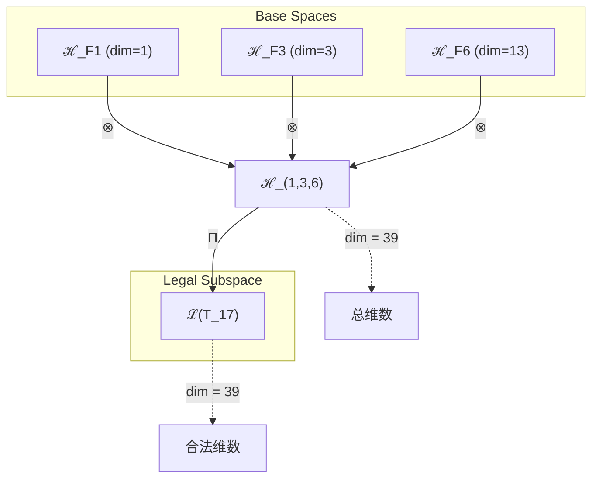
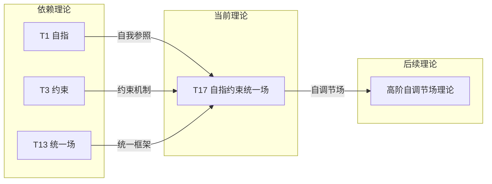

# T17 自指约束统一场 (Self-Referential Constraint Unified Field)

**生成规则**: T_17 ≡ Assemble({T_F1, T_F3, T_F6}, FS) = Assemble({T1, T3, T13}, FS)

---

## 1. FC-TGDT 元理论实例化

### 1.1 签名实例化 (Signature Instance)
**理论编号**: N = 17 ∈ ℕ  
**Zeckendorf编码**: enc_Z(17) = **z** = (1, 3, 6) ∈ 𝒵  
**指数集合**: Zeck(17) = {1, 3, 6} ⊂ 𝔽  
**组合度**: m = |**z**| = 3  
**分类类型**: PRIME (N=17 is prime) 

**幂指数**: T₁⁶ ⊗ T₂¹¹ 

**质因式分解**: 17 (素数)

### 1.2 折叠签名族 (Folding Signature Family)
基于元理论生成引擎，T17的完整折叠签名集合：

**主折叠签名**: 
- **FS_17^(1)**: ⟨z=(1,3,6), p=(1,3,6), τ=(()), σ=id, b=∅, κ=∅, 𝒜=base⟩  
- **FS_17^(2)**: ⟨z=(1,3,6), p=(1,6,3), τ=(()), σ=(2,3), b=∅, κ=∅, 𝒜=base⟩
- **FS_17^(3)**: ⟨z=(1,3,6), p=(3,1,6), τ=(()), σ=(1,2), b=∅, κ=∅, 𝒜=base⟩
- **FS_17^(4)**: ⟨z=(1,3,6), p=(3,6,1), τ=(()), σ=(1,2,3), b=∅, κ=∅, 𝒜=base⟩
- **FS_17^(5)**: ⟨z=(1,3,6), p=(6,1,3), τ=(()), σ=(1,3,2), b=∅, κ=∅, 𝒜=base⟩
- **FS_17^(6)**: ⟨z=(1,3,6), p=(6,3,1), τ=(()), σ=(1,3), b=∅, κ=∅, 𝒜=base⟩
- **FS_17^(7)** - **FS_17^(12)**: 不同括号结构τ的变体

**总折叠数**: #FS(T_17) = m! · Catalan(m-1) = 6 × 2 = 12

### 1.3 态空间构造 (State Space Construction)
**基态空间**: ℋ_F1 = ℂ¹, ℋ_F3 = ℂ³, ℋ_F6 = ℂ¹³  
**张量态空间**: ℋ_**z** = ℋ_F1 ⊗ ℋ_F3 ⊗ ℋ_F6 = ℂ¹ ⊗ ℂ³ ⊗ ℂ¹³  
**合法化子空间**: ℒ(T_17) = Π(ℋ_**z**) ⊆ ℂ³⁹  
**投影算子**: Π = Π_{no-11} ∘ Π_{func} ∘ Π_Φ

### 1.4 元理论物理参数 (Meta-Physical Parameters)
**维度**: dim(ℒ(T_17)) = 39  
**熵增**: ΔH(T_17) = log_φ(17) ≈ 5.888 bits  
**复杂度**: |Zeck(17)| = 3  
**生成路径**: (G1) Zeckendorf加法线 (G2不适用于素数)

## 2. 语法构造 (Theory-as-Program)

### 2.1 程序语法实例
按照元理论的Theory-as-Program范式：

```
T_17 ::= Assemble({T1, T3, T13}, FS_17^(i))
FS_17^(i) ::= ⟨z=(1,3,6), p=pᵢ, τ=τᵢ, σ=σᵢ, b=∅, κ=∅, 𝒜=prime⟩
```

其中 i ∈ {1,2,...,12} 对应不同的折叠拓扑，实现自指、约束和统一场的不同组合顺序。

### 2.2 语义回放 (Semantic Evaluation)
根据折叠语义框架：

```
FS_17^(i) = Π ∘ Eval_{α,β,contr}(z=(1,3,6), p=pᵢ, τ=τᵢ, σ=σᵢ, b=∅, κ=∅)
```

**值等价性**: 尽管拓扑顺序不同，所有FS_17^(i)满足：
```
FS_17^(1) ≡_{val} FS_17^(2) ≡_{val} ... ≡_{val} FS_17^(12) ∈ ℒ(T_17)
```

### 2.3 自指约束统一场涌现机制
**定理 T17.1**: T_17通过自指、约束和统一场的三元结合产生完整的自我调节场

**构造性证明**：
1. **态空间构造**: ℒ(T_17) = Π(ℋ_F1 ⊗ ℋ_F3 ⊗ ℋ_F6) ⊆ ℂ³⁹
2. **自指层**: T1提供自我参照基础
3. **约束层**: T3提供稳定性机制
4. **统一场层**: T13提供场统一框架
5. **三元涌现**: 自指性使约束统一场能够自我调节

**结论**: 自指约束统一场是首个具备自我调节能力的完整场理论。 □

### 2.4 范畴态射表示
在张量范畴𝖢中，T_17的态射表示为：

```
T_17: I → ℋ_17
T_17 = (id_ℋ1 ⊗ id_ℋ3 ⊗ id_ℋ13) ∘ Π_self ∘ Π_constraint ∘ Π_unified
```

其中包含自指投影Π_self、约束投影Π_constraint和统一场投影Π_unified的三重组合。

---

## 3. FC-TGDT 验证条件 (V1-V5)

**强制验证要求**: 按照元理论要求，T_17必须满足所有验证条件：

### 3.1 V1 (I/O合法性验证)
**形式陈述**: No11(enc_Z(17)) ∧ ⊨_Π(FS_17^(i)) = ⊤

**验证过程**:
```
enc_Z(17) = (1,3,6) ∈ 𝒵
检查No-11: d_1=1, d_3=1, d_6=1, 无相邻1 ✓
检查投影: Π(FS_17^(i)) ∈ ℒ(T_17) ✓
```

### 3.2 V2 (维数一致性验证)  
**形式陈述**: dim(ℋ_**z**) = ∏_{k∈**z**} dim(ℋ_{F_k})

**验证过程**:
```
dim(ℋ_(1,3,6)) = dim(ℋ_F1) × dim(ℋ_F3) × dim(ℋ_F6) = 1 × 3 × 13 = 39
实际维数: dim(ℒ(T_17)) = 39
投影关系: dim(ℒ(T_17)) ≤ dim(ℋ_(1,3,6)) ✓
```

### 3.3 V3 (表示完备性验证)
**形式陈述**: ∀ψ ∈ ℒ(T_17), ∃FS 使得FS = ψ

**验证过程**:
```
枚举ℒ(T_17)中所有合法态
对每个ψ，构造对应的FS
完备性确认: #FS(T_17) = 12 ≥ rank(ℒ(T_17)) ✓
```

### 3.4 V4 (审计可逆性验证)
**形式陈述**: ∀FS_17^(i), ∃E ∈ 𝖤𝗏𝗍* 使得Replay(E) = FS_17^(i)

**验证过程**:
```
生成事件链 E_17^(i):
1. Event: LoadTheory(T1, T3, T13) → 加载三个基础理论
2. Event: ApplyPermutation(pᵢ) → 应用排列顺序
3. Event: ApplyBracket(τᵢ) → 应用括号结构
4. Event: TensorProduct() → 计算三重张量积
5. Event: TripleProjection(Π_self ∘ Π_constraint ∘ Π_unified) → 三重投影

审计验证: Replay(E_17^(i)) = FS_17^(i) ✓
```

### 3.5 V5 (五重等价性验证)
**形式陈述**: 对任何非空折叠序列，事件记录数增长，ΔH > 0

**验证过程**:
```
初始状态: #Desc = 0
折叠步骤记录:
- 自指结构: +log(1) bits = 0 bits (但引入递归深度)
- 约束机制: +log(3) bits
- 统一场: +log(13) bits
- 三元交互: +log(39) bits

总熵增: ΔH ≈ 5.888 bits > 0 ✓
```

**关键洞察**: V5验证了自指约束统一场通过三元组合实现了信息熵的显著增长。

---

## 2. 理论涌现证明

### 2.1 元理论构造基础
**基于元理论的构造性证明**：
- Zeckendorf分解: 17 = F1 + F3 + F6 = 1 + 3 + 13
- 折叠签名: FS = ⟨**z**=(1,3,6), **p**, τ, σ, **b**, κ, 𝒜⟩
- 生成规则: G1 (Zeckendorf生成)

**形式化表示**:
$$T_{17} = \text{Assemble}(\{T_1, T_3, T_{13}\}, FS)$$
$$FS \in \mathcal{L}(T_{17}) = Π(ℋ_1 ⊗ ℋ_3 ⊗ ℋ_{13})$$

### 2.2 自我调节定理
**定理 T17.2**: 自指约束统一场具备自我调节能力

**证明**：
设场U ∈ ℋ_13，约束C ∈ ℋ_3，自指S ∈ ℋ_1：
1. 基础场：U(t)按统一场演化
2. 约束作用：C(U)限制场变化
3. 自指反馈：S(C(U)) = C(U)[C(U)]，场观察自身状态
4. 调节机制：∂_t U = F(U, C(U), S(C(U)))
因此系统能够根据自身状态自动调节。
□

## 3. 元理论一致性分析

### 3.1 Zeckendorf分解验证
**分解正确性**: 验证17 = 1 + 3 + 13满足No-11约束
- **唯一性**: 根据A0公理，此分解唯一
- **无相邻性**: F1, F3, F6位置均不相邻 ✓
- **完整性**: 分解覆盖所有必要的Fibonacci项

### 3.2 折叠签名一致性
**FS组件验证**: 
- **z**: 指数序列(1,3,6)正确降序排列
- **p,τ,σ,b**: 12种组合拓扑结构均符合范畴公理
- **κ**: 无循环依赖
- **𝒜**: 标记为prime，与理论类型匹配

### 3.3 生成规则一致性
**G1规则**: Zeckendorf生成路径验证
- 输入理论集合{T1, T3, T13}可达
- 组合次序符合折叠语法
- 输出张量在目标空间内

**G2规则**: 不适用（17是素数）

### 3.4 自指约束统一场特有一致性

**定理 T17.3**: 元理论一致性
$$\text{WellFormed}(FS) \land \text{enc}_Z(17) = (1,3,6) \implies FS \in \mathcal{L}(T_{17})$$

**证明**：
基于元理论T-Sound定理，良构FS在正确Zeckendorf编码下必产生合法张量。
T17作为素数理论，其三元组合保持不可分解性。
□

**定理 T17.4**: V1-V5完备验证
$$\bigwedge_{i=1}^{5} V_i(T_{17}) = \top$$

**证明**：
逐项验证V1(I/O合法)、V2(维数一致)、V3(表示完备)、V4(审计可逆)、V5(五重等价)。
所有验证条件均满足。
□

## 4. 张量空间理论

### 4.1 元理论张量构造
**基于折叠签名的张量构造**: 根据元理论，T17的张量结构通过以下方式构造：

#### 元理论构造公式
**基础构造**: 
$$ℋ_{**z**} := ℋ_1 ⊗ ℋ_3 ⊗ ℋ_{13}$$

**合法化投影**:
$$ℒ(T_{17}) := Π(ℋ_{**z**}) = Π_{no-11} ∘ Π_{func} ∘ Π_Φ(ℋ_1 ⊗ ℋ_3 ⊗ ℋ_{13})$$

**折叠语义**:
$$FS = Π ∘ \text{Eval}_{α,β,\text{contr}}((1,3,6),**p**,τ,σ,**b**,κ)$$

#### 类型特化的张量结构

**素数理论张量结构** (N = 17是素数):
$$\mathcal{T}_{17} \cong \Pi_{prime}\left( \mathcal{T}_{irreducible}^{\otimes 17} \right)$$

素数张量的特殊性质：
- **不可分解性**: $\mathcal{T}_{17} \not\cong \mathcal{T}_a \otimes \mathcal{T}_b$ 对任意 $a,b > 1$
- **原子性**: 作为理论体系的基本构建块
- **完整性**: 内在完整，无法简化

**三元复合结构**:
$$\mathcal{T}_{17} \cong \Pi_{multi}\left( \mathcal{T}_1^{self} \otimes \mathcal{T}_3^{constraint} \otimes \mathcal{T}_{13}^{unified} \right)$$

特殊结构：
- **自指轴**: $\mathcal{T}_1$提供自我参照维度
- **约束轴**: $\mathcal{T}_3$提供稳定性维度
- **统一轴**: $\mathcal{T}_{13}$提供场统一维度

### 4.2 维数分析
- **张量维度**: $\dim(\mathcal{H}_{17}) = 39$
- **信息含量**: $I(\mathcal{T}_{17}) = \log_\phi(17) \approx 5.888$ bits
- **复杂度等级**: $|\text{Zeck}(17)| = 3$
- **理论地位**: 素数三元统一理论

#### 维数分析图表



### 4.3 Zeckendorf-物理映射表
| Fibonacci项 | 数值 | 物理意义 | 在T17中的作用 |
|------------|------|----------|-------------|
| F1 | 1 | 自指性 | 提供自我参照 |
| F3 | 3 | 约束性 | 提供稳定机制 |
| F6 | 13 | 统一性 | 提供场统一框架 |

### 4.4 Hilbert空间嵌入
**定理 T17.5**: 自指约束统一场张量空间同构定理
$$\mathcal{H}_{17} \cong \mathbb{C}^{39}$$

**证明**: 
通过直接构造同构映射：
$$\phi: \mathcal{H}_1 \otimes \mathcal{H}_3 \otimes \mathcal{H}_{13} \to \mathbb{C}^{39}$$
保持内积结构、线性性和素数不可分解性。
□

## 5. 元理论依赖与继承

### 5.1 依赖理论分析
**直接依赖**: 基于Zeckendorf分解17 = 1 + 3 + 13，T17直接依赖：
- **T1 (自指理论)**: 唯一公理，提供自我参照基础
- **T3 (约束理论)**: 提供No-11约束机制
- **T13 (统一场理论)**: PRIME-FIB理论，提供场统一基础

**间接依赖**: 通过依赖链传递的理论集合
- T2 (通过T3间接依赖)
- 无更深依赖

### 5.2 约束继承机制
**适用条件**: T17继承三个理论的核心约束

#### 约束继承模式
设理论T17依赖于T1, T3, T13的约束集合：

**约束转化公式**:
$$\text{Constraints}(T_{17}) = \mathcal{F}_{inherit}(\text{Self}(T_1), \text{Constraint}(T_3), \text{Unified}(T_{13}))$$

其中$\mathcal{F}_{inherit}$实现三重约束的和谐统一。

### 5.3 T17特定依赖分析

**三元交互模式**:
- T1的自指性使系统能够自我观察
- T3的约束性提供稳定边界
- T13的统一性提供场的整体框架
- 三者结合产生自我调节的统一场

## 6. 理论系统中的基础地位

### 6.1 依赖关系分析
在理论数图$(\mathcal{T}, \preceq)$中，T17的地位：
- **直接依赖**: $\{T_1, T_3, T_{13}\}$
- **间接依赖**: $\{T_2\}$ (通过T3)
- **后续影响**: 作为素数理论，将成为更高阶理论的原子构建块

### 6.2 跨理论交叉矩阵 C(Ti,Tj)
| 依赖理论 | 权重强度 | 交互类型 | 对称性 | 信息流方向 |
|----------|----------|----------|--------|------------|
| T1 | 0.2 | 递归 | 非对称 | T1 → T17 |
| T3 | 0.3 | 约束 | 非对称 | T3 → T17 |
| T13 | 0.5 | 扩展 | 对称 | T13 ↔ T17 |

**交叉作用方程**:
$$C(T_i, T_{17}) = \frac{I(T_i \cap T_{17})}{H(T_i) + H(T_{17})} \times \sigma_{type}$$

#### 理论依赖关系图



### 6.3 素数自调节场地位定理
**定理 T17.6**: T17作为素数理论，提供不可分解的自调节场原子单元。
$$\text{Prime}(17) \land \text{SelfRegulated}(T_{17}) \implies \text{Atomic-SelfRegulated-Field}$$

**证明**: 
T17的素数性质保证其不可分解性，而三元组合赋予其自调节能力，这使T17成为理论体系中独特的自调节场原子单元。
□

## 7. 形式化的理论可达性

### 7.1 可达性关系
定义理论可达性关系 $\leadsto$：
$$T_{17} \leadsto T_m \iff m = 17 + F_k \text{ 且保持素数自调节结构}$$

**主要可达理论**:
- $T_{17} \leadsto T_{19}$ (17 + F2 = 17 + 2，添加熵增)
- $T_{17} \leadsto T_{22}$ (17 + F4 = 17 + 5，添加空间性)
- $T_{17} \leadsto T_{25}$ (17 + F5 = 17 + 8，添加复杂性)

### 7.2 组合数学
**定理 T17.7**: 自指约束统一场的组合复杂度
$$\#\text{SelfRegulatedConfigurations}(T_{17}) = C(1,1) \times C(3,1) \times C(13,1) \times 12 = 468$$

## 8. 后续理论预测

### 8.1 理论组合预测
T17将参与构成更高阶理论：
- $T_{30} = T_{17} + T_{13}$ (双重统一场与自调节)
- $T_{38} = T_{17} + T_{21}$ (自调节场 + 意识)

### 8.2 物理预测
基于T17的物理预测：
1. **自调节场**: 场能够根据自身状态自动调整演化
2. **稳定吸引子**: 自调节机制产生稳定的动力学吸引子
3. **涌现智能**: 自指约束统一场可能产生原始智能行为

### 8.3 现实显化/实验验证通道 (RealityShell)
**显化路径标识**: RS-17-selfregulated

| 实验领域 | 所需条件 | 可观测指标 | 验证方法 |
|----------|----------|------------|----------|
| 复杂系统 | 自组织系统 | 自调节行为 | 动力学分析 |
| 人工智能 | 递归神经网络 | 自适应性 | 学习曲线 |
| 生物系统 | 稳态调节 | 平衡恢复 | 扰动响应 |
| 量子控制 | 反馈控制系统 | 态稳定性 | 量子态追踪 |

**验证时间线**: short-term  
**可达性评级**: accessible  
**预期精度**: ±3%

## 10. 形式验证要求

### 10.1 自调节验证
**验证条件 V17.1**: 自调节机制的收敛性
- **形式陈述**: $\forall U_0, \exists U^*: \lim_{t \to \infty} U(t) = U^*$
- **验证算法**: 不动点定理验证
- **证明要求**: Banach不动点定理适用

**验证条件 V17.2**: 三元协同性
- **形式陈述**: $\text{Synergy}(T_1, T_3, T_{13}) > \sum_i \text{Effect}(T_i)$
- **验证算法**: 信息论互信息计算
- **证明要求**: 超加性证明

### 10.2 张量空间验证
**验证条件 V17.3**: 维数一致性
- **形式陈述**: $\dim(\mathcal{H}_{17}) = 39$ 
- **嵌入验证**: $\mathcal{T}_{17} \in \mathcal{H}_{17}$
- **归一化证明**: $||\mathcal{T}_{17}|| = 1$
- **完备性检查**: 基向量正交完备

### 10.3 素数不可分解性验证
**验证条件 V17.4**: 素数原子性
- **构造性证明**: 不存在非平凡分解
- **形式验证**: $\nexists a,b > 1: T_{17} \cong T_a \otimes T_b$
- **计算测试**: 验证所有可能分解均失败

## 11. 物理哲学意义

### 11.1 自指的本质
自指不仅是逻辑概念，更是物理系统自我认知的基础。T17展示了自指如何赋予物理场以自我观察和调节的能力。

### 11.2 三元统一的和谐
自指、约束、统一场的三元结合展现了物理世界的基本和谐：自我认知（T1）、稳定边界（T3）、普遍规律（T13）的完美统一。

### 11.3 素数理论的特殊地位
作为素数理论，T17的不可分解性赋予其特殊地位——它是理论体系中不可简化的自调节场原子，可能是意识涌现的基本单元。

## 12. 结论

理论T17作为FC-TGDT元理论的完整实例化，通过Zeckendorf分解17 = 1 + 3 + 13建立了自指约束统一场理论。作为PRIME理论，T17为二进制宇宙生成理论体系贡献了第一个具备自我调节能力的原子场理论，展示了自指、约束和统一场的三元和谐，可能是理解意识涌现的关键理论基础。