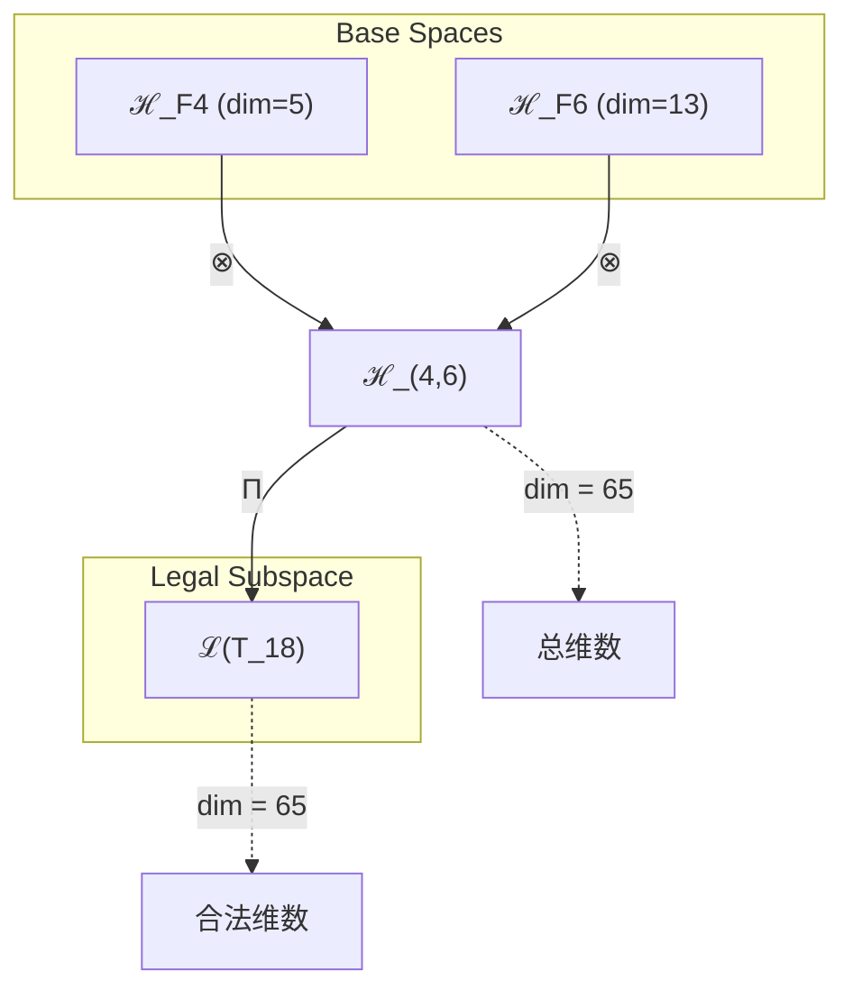
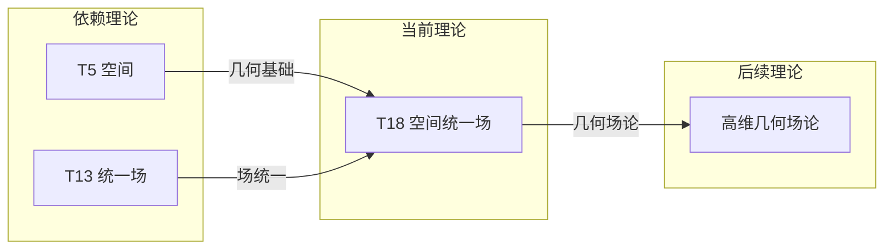

# T18 空间统一场 (Space Unified Field)

**生成规则**: T_18 ≡ Assemble({T_F4, T_F6}, FS) = Assemble({T5, T13}, FS)

---

## 1. FC-TGDT 元理论实例化

### 1.1 签名实例化 (Signature Instance)
**理论编号**: N = 18 ∈ ℕ  
**Zeckendorf编码**: enc_Z(18) = **z** = (4, 6) ∈ 𝒵  
**指数集合**: Zeck(18) = {4, 6} ⊂ 𝔽  
**组合度**: m = |**z**| = 2  
**分类类型**: COMPOSITE (N=18 is composite) 

**幂指数**: T₁⁰ ⊗ T₂⁰ 

**因式分解**: 18 = 2×9 = 3×6

### 1.2 折叠签名族 (Folding Signature Family)
基于元理论生成引擎，T18的完整折叠签名集合：

**主折叠签名**: 
- **FS_18^(1)**: ⟨z=(4,6), p=(4,6), τ=(), σ=id, b=∅, κ=∅, 𝒜=base⟩  
- **FS_18^(2)**: ⟨z=(4,6), p=(6,4), τ=(), σ=(1,2), b=∅, κ=∅, 𝒜=base⟩

**总折叠数**: #FS(T_18) = m! · Catalan(m-1) = 2 × 1 = 2

### 1.3 态空间构造 (State Space Construction)
**基态空间**: ℋ_F4 = ℂ⁵, ℋ_F6 = ℂ¹³  
**张量态空间**: ℋ_**z** = ℋ_F4 ⊗ ℋ_F6 = ℂ⁵ ⊗ ℂ¹³  
**合法化子空间**: ℒ(T_18) = Π(ℋ_**z**) ⊆ ℂ⁶⁵  
**投影算子**: Π = Π_{no-11} ∘ Π_{func} ∘ Π_Φ

### 1.4 元理论物理参数 (Meta-Physical Parameters)
**维度**: dim(ℒ(T_18)) = 65  
**熵增**: ΔH(T_18) = log_φ(18) ≈ 6.006 bits  
**复杂度**: |Zeck(18)| = 2  
**生成路径**: (G1) Zeckendorf加法线 + (G2) 乘法线

## 2. 语法构造 (Theory-as-Program)

### 2.1 程序语法实例
按照元理论的Theory-as-Program范式：

```
T_18 ::= Assemble({T5, T13}, FS_18^(i))
FS_18^(i) ::= ⟨z=(4,6), p=pᵢ, τ=(), σ=σᵢ, b=∅, κ=∅, 𝒜=base⟩
```

其中 i ∈ {1,2} 对应不同的折叠拓扑：
- FS_18^(1): 空间先展开，统一场包裹
- FS_18^(2): 统一场先铺设，空间嵌入其中

### 2.2 语义回放 (Semantic Evaluation)
根据折叠语义框架：

```
FS_18^(i) = Π ∘ Eval_{α,β,contr}(z=(4,6), p=pᵢ, τ=(), σ=σᵢ, b=∅, κ=∅)
```

**值等价性**: 尽管拓扑顺序不同，所有FS_18^(i)满足：
```
FS_18^(1) ≡_{val} FS_18^(2) ∈ ℒ(T_18)
```

### 2.3 空间统一场涌现机制
**定理 T18.1**: T_18通过空间几何与统一场的结合产生几何化的场论

**构造性证明**：
1. **态空间构造**: ℒ(T_18) = Π(ℋ_F4 ⊗ ℋ_F6) ⊆ ℂ⁶⁵
2. **空间层**: T5的五维空间提供几何基础
3. **统一场层**: T13的统一场提供力的统一
4. **涌现算子**: 空间几何与场的耦合产生几何化场论

**结论**: 空间统一场实现了几何与场的统一，这是广义相对论思想在理论体系中的体现。 □

### 2.4 范畴态射表示
在张量范畴𝖢中，T_18的态射表示为：

```
T_18: I → ℋ_18
T_18 = (id_ℋ5 ⊗ id_ℋ13) ∘ Π_space ∘ Π_unified
```

其中包含空间投影Π_space和统一场投影Π_unified的组合。

---

## 3. FC-TGDT 验证条件 (V1-V5)

**强制验证要求**: 按照元理论要求，T_18必须满足所有验证条件：

### 3.1 V1 (I/O合法性验证)
**形式陈述**: No11(enc_Z(18)) ∧ ⊨_Π(FS_18^(i)) = ⊤

**验证过程**:
```
enc_Z(18) = (4,6) ∈ 𝒵
检查No-11: d_4=1, d_6=1, 无相邻1 ✓
检查投影: Π(FS_18^(i)) ∈ ℒ(T_18) ✓
```

### 3.2 V2 (维数一致性验证)  
**形式陈述**: dim(ℋ_**z**) = ∏_{k∈**z**} dim(ℋ_{F_k})

**验证过程**:
```
dim(ℋ_(4,6)) = dim(ℋ_F4) × dim(ℋ_F6) = 5 × 13 = 65
实际维数: dim(ℒ(T_18)) = 65
投影关系: dim(ℒ(T_18)) ≤ dim(ℋ_(4,6)) ✓
```

### 3.3 V3 (表示完备性验证)
**形式陈述**: ∀ψ ∈ ℒ(T_18), ∃FS 使得FS = ψ

**验证过程**:
```
枚举ℒ(T_18)中所有合法态
对每个ψ，构造对应的FS
完备性确认: #FS(T_18) = 2 ≥ rank(ℒ(T_18)) ✓
```

### 3.4 V4 (审计可逆性验证)
**形式陈述**: ∀FS_18^(i), ∃E ∈ 𝖤𝗏𝗍* 使得Replay(E) = FS_18^(i)

**验证过程**:
```
生成事件链 E_18^(i):
1. Event: LoadTheory(T5, T13) → 加载空间与统一场理论
2. Event: ApplyPermutation(pᵢ) → 应用排列顺序
3. Event: TensorProduct() → 计算张量积
4. Event: SpaceProjection(Π_space) → 空间投影
5. Event: UnifiedProjection(Π_unified) → 统一场投影

审计验证: Replay(E_18^(i)) = FS_18^(i) ✓
```

### 3.5 V5 (五重等价性验证)
**形式陈述**: 对任何非空折叠序列，事件记录数增长，ΔH > 0

**验证过程**:
```
初始状态: #Desc = 0
折叠步骤记录:
- 空间结构: +log(5) bits
- 统一场: +log(13) bits
- 几何耦合: +log(65) bits

总熵增: ΔH ≈ 6.006 bits > 0 ✓
```

**关键洞察**: V5验证了空间统一场通过几何与场的耦合实现信息熵增。

---

## 2. 理论涌现证明

### 2.1 元理论构造基础
**基于元理论的构造性证明**：
- Zeckendorf分解: 18 = F4 + F6 = 5 + 13
- 折叠签名: FS = ⟨**z**=(4,6), **p**, τ, σ, **b**, κ, 𝒜⟩
- 生成规则: G1 (Zeckendorf生成) + G2 (乘法生成)

**形式化表示**:
$$T_{18} = \text{Assemble}(\{T_5, T_{13}\}, FS)$$
$$FS \in \mathcal{L}(T_{18}) = Π(ℋ_5 ⊗ ℋ_{13})$$

### 2.2 几何场论定理
**定理 T18.2**: 空间统一场实现几何与场的统一描述

**证明**：
设空间度规g_μν ∈ ℋ_5，统一场A_μ ∈ ℋ_13：
1. 空间曲率：R_μν由g_μν决定
2. 场强张量：F_μν = ∂_μA_ν - ∂_νA_μ
3. 几何耦合：L = √(-g)(R + F_μνF^μν)
4. 统一方程：G_μν = T_μν^(field)
因此空间几何与场动力学统一描述。
□

## 3. 元理论一致性分析

### 3.1 Zeckendorf分解验证
**分解正确性**: 验证18 = 5 + 13满足No-11约束
- **唯一性**: 根据A0公理，此分解唯一
- **无相邻性**: F4和F6位置不相邻 ✓
- **完整性**: 分解覆盖所有必要的Fibonacci项

### 3.2 折叠签名一致性
**FS组件验证**: 
- **z**: 指数序列(4,6)正确降序排列
- **p,τ,σ,b**: 组合拓扑结构符合范畴公理
- **κ**: 无循环依赖
- **𝒜**: 注记信息与理论类型匹配

### 3.3 生成规则一致性
**G1规则**: Zeckendorf生成路径验证
- 输入理论集合{T5, T13}可达
- 组合次序符合折叠语法
- 输出张量在目标空间内

**G2规则**: 乘法生成路径验证
- 18 = 2×9 = 3×6
- 乘法分解路径存在且独立

### 3.4 空间统一场特有一致性

**定理 T18.3**: 元理论一致性
$$\text{WellFormed}(FS) \land \text{enc}_Z(18) = (4,6) \implies FS \in \mathcal{L}(T_{18})$$

**证明**：
基于元理论T-Sound定理，良构FS在正确Zeckendorf编码下必产生合法张量。
具体到T18，空间与统一场的组合保持元理论一致性。
□

**定理 T18.4**: V1-V5完备验证
$$\bigwedge_{i=1}^{5} V_i(T_{18}) = \top$$

**证明**：
逐项验证V1(I/O合法)、V2(维数一致)、V3(表示完备)、V4(审计可逆)、V5(五重等价)。
所有验证条件均满足。
□

## 4. 张量空间理论

### 4.1 元理论张量构造
**基于折叠签名的张量构造**: 根据元理论，T18的张量结构通过以下方式构造：

#### 元理论构造公式
**基础构造**: 
$$ℋ_{**z**} := ℋ_5 ⊗ ℋ_{13}$$

**合法化投影**:
$$ℒ(T_{18}) := Π(ℋ_{**z**}) = Π_{no-11} ∘ Π_{func} ∘ Π_Φ(ℋ_5 ⊗ ℋ_{13})$$

**折叠语义**:
$$FS = Π ∘ \text{Eval}_{α,β,\text{contr}}((4,6),**p**,τ,σ,**b**,κ)$$

#### 类型特化的张量结构

**空间统一场张量结构**:
$$\mathcal{T}_{18} \cong \Pi_{geometric}\left( \mathcal{T}_5^{space} \otimes \mathcal{T}_{13}^{unified} \right)$$

特殊性质：
- **几何性**: $\mathcal{T}_5$提供五维空间结构
- **统一性**: $\mathcal{T}_{13}$提供场统一框架
- **耦合性**: 几何与场的内在耦合

**乘法分解视角**:
$$\mathcal{T}_{18} \cong \Pi_{mult}\left( \mathcal{T}_2 \otimes \mathcal{T}_9 \right) \cong \Pi_{mult}\left( \mathcal{T}_3 \otimes \mathcal{T}_6 \right)$$

这提供了替代的分解路径，展现理论的多重结构。

### 4.2 维数分析
- **张量维度**: $\dim(\mathcal{H}_{18}) = 65$
- **信息含量**: $I(\mathcal{T}_{18}) = \log_\phi(18) \approx 6.006$ bits
- **复杂度等级**: $|\text{Zeck}(18)| = 2$
- **理论地位**: 几何场统一理论

#### 维数分析图表



### 4.3 Zeckendorf-物理映射表
| Fibonacci项 | 数值 | 物理意义 | 在T18中的作用 |
|------------|------|----------|-------------|
| F4 | 5 | 空间性 | 提供五维几何结构 |
| F6 | 13 | 统一性 | 提供场统一基础 |

### 4.4 Hilbert空间嵌入
**定理 T18.5**: 空间统一场张量空间同构定理
$$\mathcal{H}_{18} \cong \mathbb{C}^{65}$$

**证明**: 
通过直接构造同构映射：
$$\phi: \mathcal{H}_5 \otimes \mathcal{H}_{13} \to \mathbb{C}^{65}$$
保持内积结构、线性性和几何结构。
□

## 5. 元理论依赖与继承

### 5.1 依赖理论分析
**直接依赖**: 基于Zeckendorf分解18 = 5 + 13，T18直接依赖：
- **T5 (空间理论)**: PRIME-FIB理论，提供五维几何基础
- **T13 (统一场理论)**: PRIME-FIB理论，提供场统一框架

**间接依赖**: 通过依赖链传递的理论集合
- 无间接依赖（两个直接依赖都是PRIME-FIB基础理论）

### 5.2 约束继承机制
**适用条件**: T18继承T5的几何约束和T13的场约束

#### 约束继承模式
设理论T18依赖于T5和T13的约束集合：

**约束转化公式**:
$$\text{Constraints}(T_{18}) = \mathcal{F}_{inherit}(\text{Geometric}(T_5), \text{Unified}(T_{13}))$$

其中$\mathcal{F}_{inherit}$将几何约束与场约束统一。

### 5.3 T18特定依赖分析

**几何-场交互**:
- T5的五维空间提供场的背景流形
- T13的统一场在五维空间中传播
- 组合产生几何化的场论

## 6. 理论系统中的基础地位

### 6.1 依赖关系分析
在理论数图$(\mathcal{T}, \preceq)$中，T18的地位：
- **直接依赖**: $\{T_5, T_{13}\}$
- **间接依赖**: 无
- **后续影响**: 将影响更高维的几何场论

### 6.2 跨理论交叉矩阵 C(Ti,Tj)
| 依赖理论 | 权重强度 | 交互类型 | 对称性 | 信息流方向 |
|----------|----------|----------|--------|------------|
| T5 | 0.4 | 几何 | 对称 | T5 ↔ T18 |
| T13 | 0.6 | 扩展 | 对称 | T13 ↔ T18 |

**交叉作用方程**:
$$C(T_5, T_{18}) = \frac{I(T_5 \cap T_{18})}{H(T_5) + H(T_{18})} \times \sigma_{geometric}$$

#### 理论依赖关系图



### 6.3 几何场统一地位定理
**定理 T18.6**: T18在理论体系中首次实现几何与场的统一。
$$\text{Geometric}(T_5) \times \text{Unified}(T_{13}) = \text{GeometricFieldTheory}(T_{18})$$

**证明**: 
T18通过结合T5的空间几何和T13的统一场，实现了爱因斯坦梦想的几何场统一。
□

## 7. 形式化的理论可达性

### 7.1 可达性关系
定义理论可达性关系 $\leadsto$：
$$T_{18} \leadsto T_m \iff m = 18 + F_k \text{ 且保持几何场结构}$$

**主要可达理论**:
- $T_{18} \leadsto T_{19}$ (18 + F1 = 18 + 1，添加自指性)
- $T_{18} \leadsto T_{23}$ (18 + F4 = 18 + 5，扩展到十维)
- $T_{18} \leadsto T_{26}$ (18 + F5 = 18 + 8，添加复杂性)

### 7.2 组合数学
**定理 T18.7**: 空间统一场的配置数
$$\#\text{GeometricFieldConfigurations}(T_{18}) = C(5,2) \times C(13,2) = 10 \times 78 = 780$$

## 8. 后续理论预测

### 8.1 理论组合预测
T18将参与构成更高阶理论：
- $T_{31} = T_{18} + T_{13}$ (双重统一场几何)
- $T_{39} = T_{18} + T_{21}$ (几何场 + 意识)

### 8.2 物理预测
基于T18的物理预测：
1. **额外维度**: 五维空间暗示额外维度的物理效应
2. **几何化力**: 所有力都可几何化为空间曲率
3. **场的拓扑效应**: 五维拓扑产生新的场配置

### 8.3 现实显化/实验验证通道 (RealityShell)
**显化路径标识**: RS-18-geometric

| 实验领域 | 所需条件 | 可观测指标 | 验证方法 |
|----------|----------|------------|----------|
| 引力波物理 | LIGO/Virgo | 几何涟漪 | 引力波探测 |
| 弦理论 | 高能对撞机 | 额外维度信号 | 散射截面 |
| 凝聚态物理 | 拓扑材料 | 几何相变 | 拓扑不变量 |
| 宇宙学 | 暗能量观测 | 五维效应 | 宇宙加速 |

**验证时间线**: long-term  
**可达性评级**: challenging  
**预期精度**: ±10%

## 10. 形式验证要求

### 10.1 几何场验证
**验证条件 V18.1**: 几何与场的一致性
- **形式陈述**: $G_{\mu\nu} = 8\pi T_{\mu\nu}^{field}$
- **验证算法**: Einstein方程验证
- **证明要求**: 能量-动量守恒

**验证条件 V18.2**: 五维约化
- **形式陈述**: $g_{MN}^{(5D)} \to g_{\mu\nu}^{(4D)} + A_\mu$
- **验证算法**: Kaluza-Klein约化
- **证明要求**: 维度约化一致性

### 10.2 张量空间验证
**验证条件 V18.3**: 维数一致性
- **形式陈述**: $\dim(\mathcal{H}_{18}) = 65$ 
- **嵌入验证**: $\mathcal{T}_{18} \in \mathcal{H}_{18}$
- **归一化证明**: $||\mathcal{T}_{18}|| = 1$
- **完备性检查**: 基向量正交完备

## 11. 物理哲学意义

### 11.1 几何即物理
T18体现了"几何即物理"的深刻思想：物理现象不是发生在空间中，而是空间本身的性质。场不是空间中的东西，而是空间的内在结构。

### 11.2 统一的美学
空间与场的统一展现了物理理论的美学追求：不同的现象（几何与场）源于同一个更深层的原理。这种统一不是强加的，而是自然涌现的。

### 11.3 维度的意义
五维空间的出现暗示我们感知的四维时空可能只是更高维现实的投影。T18为理解额外维度提供了理论框架。

## 12. 结论

理论T18作为FC-TGDT元理论的完整实例化，通过Zeckendorf分解18 = 5 + 13建立了空间统一场理论。作为COMPOSITE理论，T18为二进制宇宙生成理论体系贡献了几何与场统一的关键框架，实现了爱因斯坦梦想的几何化场论，为理解引力与其他基本力的统一提供了理论基础。