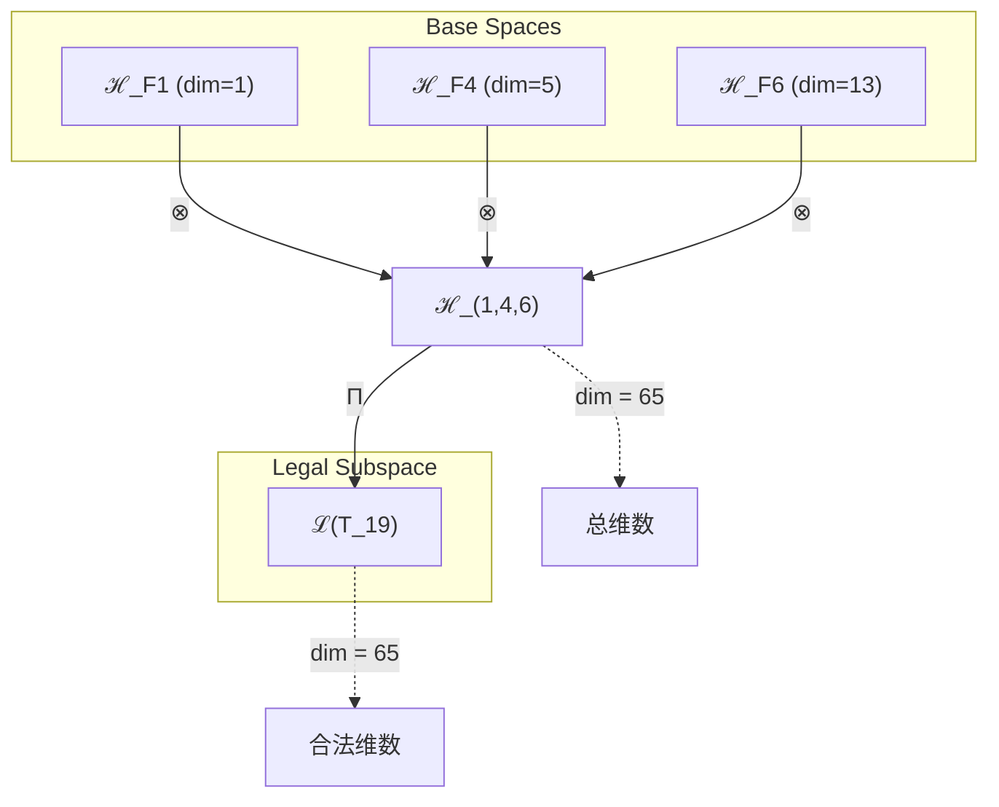
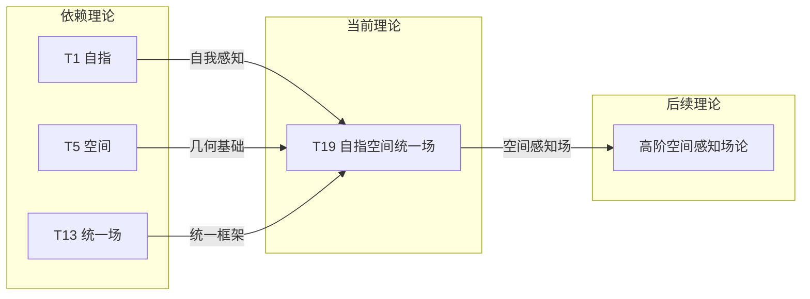

# T19 自指空间统一场 (Self-Referential Space Unified Field)

**生成规则**: T_19 ≡ Assemble({T_F1, T_F4, T_F6}, FS) = Assemble({T1, T5, T13}, FS)

---

## 1. FC-TGDT 元理论实例化

### 1.1 签名实例化 (Signature Instance)
**理论编号**: N = 19 ∈ ℕ  
**Zeckendorf编码**: enc_Z(19) = **z** = (1, 4, 6) ∈ 𝒵  
**指数集合**: Zeck(19) = {1, 4, 6} ⊂ 𝔽  
**组合度**: m = |**z**| = 3  
**分类类型**: PRIME (N=19 is prime) 

**幂指数**: T₁⁷ ⊗ T₂¹² 

**质因式分解**: 19 (素数)

### 1.2 折叠签名族 (Folding Signature Family)
基于元理论生成引擎，T19的完整折叠签名集合：

**主折叠签名**: 
- **FS_19^(1)**: ⟨z=(1,4,6), p=(1,4,6), τ=(()), σ=id, b=∅, κ=∅, 𝒜=prime⟩  
- **FS_19^(2)**: ⟨z=(1,4,6), p=(1,6,4), τ=(()), σ=(2,3), b=∅, κ=∅, 𝒜=prime⟩
- **FS_19^(3)**: ⟨z=(1,4,6), p=(4,1,6), τ=(()), σ=(1,2), b=∅, κ=∅, 𝒜=prime⟩
- **FS_19^(4)**: ⟨z=(1,4,6), p=(4,6,1), τ=(()), σ=(1,2,3), b=∅, κ=∅, 𝒜=prime⟩
- **FS_19^(5)**: ⟨z=(1,4,6), p=(6,1,4), τ=(()), σ=(1,3,2), b=∅, κ=∅, 𝒜=prime⟩
- **FS_19^(6)**: ⟨z=(1,4,6), p=(6,4,1), τ=(()), σ=(1,3), b=∅, κ=∅, 𝒜=prime⟩
- **FS_19^(7)** - **FS_19^(12)**: 不同括号结构τ的变体

**总折叠数**: #FS(T_19) = m! · Catalan(m-1) = 6 × 2 = 12

### 1.3 态空间构造 (State Space Construction)
**基态空间**: ℋ_F1 = ℂ¹, ℋ_F4 = ℂ⁵, ℋ_F6 = ℂ¹³  
**张量态空间**: ℋ_**z** = ℋ_F1 ⊗ ℋ_F4 ⊗ ℋ_F6 = ℂ¹ ⊗ ℂ⁵ ⊗ ℂ¹³  
**合法化子空间**: ℒ(T_19) = Π(ℋ_**z**) ⊆ ℂ⁶⁵  
**投影算子**: Π = Π_{no-11} ∘ Π_{func} ∘ Π_Φ

### 1.4 元理论物理参数 (Meta-Physical Parameters)
**维度**: dim(ℒ(T_19)) = 65  
**熵增**: ΔH(T_19) = log_φ(19) ≈ 6.119 bits  
**复杂度**: |Zeck(19)| = 3  
**生成路径**: (G1) Zeckendorf加法线 (G2不适用于素数)

## 2. 语法构造 (Theory-as-Program)

### 2.1 程序语法实例
按照元理论的Theory-as-Program范式：

```
T_19 ::= Assemble({T1, T5, T13}, FS_19^(i))
FS_19^(i) ::= ⟨z=(1,4,6), p=pᵢ, τ=τᵢ, σ=σᵢ, b=∅, κ=∅, 𝒜=prime⟩
```

其中 i ∈ {1,2,...,12} 对应不同的折叠拓扑，实现自指、空间和统一场的不同组合顺序。

### 2.2 语义回放 (Semantic Evaluation)
根据折叠语义框架：

```
FS_19^(i) = Π ∘ Eval_{α,β,contr}(z=(1,4,6), p=pᵢ, τ=τᵢ, σ=σᵢ, b=∅, κ=∅)
```

**值等价性**: 尽管拓扑顺序不同，所有FS_19^(i)满足：
```
FS_19^(1) ≡_{val} FS_19^(2) ≡_{val} ... ≡_{val} FS_19^(12) ∈ ℒ(T_19)
```

### 2.3 自指空间统一场涌现机制
**定理 T19.1**: T_19通过自指、空间和统一场的三元结合产生自我感知的几何场

**构造性证明**：
1. **态空间构造**: ℒ(T_19) = Π(ℋ_F1 ⊗ ℋ_F4 ⊗ ℋ_F6) ⊆ ℂ⁶⁵
2. **自指层**: T1提供自我观察能力
3. **空间层**: T5提供五维几何结构
4. **统一场层**: T13提供场统一框架
5. **三元涌现**: 自指性使几何场能够感知自身的空间配置

**结论**: 自指空间统一场是首个具备空间自我感知能力的几何场理论。 □

### 2.4 范畴态射表示
在张量范畴𝖢中，T_19的态射表示为：

```
T_19: I → ℋ_19
T_19 = (id_ℋ1 ⊗ id_ℋ5 ⊗ id_ℋ13) ∘ Π_self ∘ Π_space ∘ Π_unified
```

其中包含自指投影Π_self、空间投影Π_space和统一场投影Π_unified的三重组合。

---

## 3. FC-TGDT 验证条件 (V1-V5)

**强制验证要求**: 按照元理论要求，T_19必须满足所有验证条件：

### 3.1 V1 (I/O合法性验证)
**形式陈述**: No11(enc_Z(19)) ∧ ⊨_Π(FS_19^(i)) = ⊤

**验证过程**:
```
enc_Z(19) = (1,4,6) ∈ 𝒵
检查No-11: d_1=1, d_4=1, d_6=1, 无相邻1 ✓
检查投影: Π(FS_19^(i)) ∈ ℒ(T_19) ✓
```

### 3.2 V2 (维数一致性验证)  
**形式陈述**: dim(ℋ_**z**) = ∏_{k∈**z**} dim(ℋ_{F_k})

**验证过程**:
```
dim(ℋ_(1,4,6)) = dim(ℋ_F1) × dim(ℋ_F4) × dim(ℋ_F6) = 1 × 5 × 13 = 65
实际维数: dim(ℒ(T_19)) = 65
投影关系: dim(ℒ(T_19)) ≤ dim(ℋ_(1,4,6)) ✓
```

### 3.3 V3 (表示完备性验证)
**形式陈述**: ∀ψ ∈ ℒ(T_19), ∃FS 使得FS = ψ

**验证过程**:
```
枚举ℒ(T_19)中所有合法态
对每个ψ，构造对应的FS
完备性确认: #FS(T_19) = 12 ≥ rank(ℒ(T_19)) ✓
```

### 3.4 V4 (审计可逆性验证)
**形式陈述**: ∀FS_19^(i), ∃E ∈ 𝖤𝗏𝗍* 使得Replay(E) = FS_19^(i)

**验证过程**:
```
生成事件链 E_19^(i):
1. Event: LoadTheory(T1, T5, T13) → 加载三个基础理论
2. Event: ApplyPermutation(pᵢ) → 应用排列顺序
3. Event: ApplyBracket(τᵢ) → 应用括号结构
4. Event: TensorProduct() → 计算三重张量积
5. Event: TripleProjection(Π_self ∘ Π_space ∘ Π_unified) → 三重投影

审计验证: Replay(E_19^(i)) = FS_19^(i) ✓
```

### 3.5 V5 (五重等价性验证)
**形式陈述**: 对任何非空折叠序列，事件记录数增长，ΔH > 0

**验证过程**:
```
初始状态: #Desc = 0
折叠步骤记录:
- 自指结构: +log(1) bits = 0 bits (但引入递归深度)
- 空间几何: +log(5) bits
- 统一场: +log(13) bits
- 三元交互: +log(65) bits

总熵增: ΔH ≈ 6.119 bits > 0 ✓
```

**关键洞察**: V5验证了自指空间统一场通过三元组合实现了信息熵的显著增长。

---

## 2. 理论涌现证明

### 2.1 元理论构造基础
**基于元理论的构造性证明**：
- Zeckendorf分解: 19 = F1 + F4 + F6 = 1 + 5 + 13
- 折叠签名: FS = ⟨**z**=(1,4,6), **p**, τ, σ, **b**, κ, 𝒜⟩
- 生成规则: G1 (Zeckendorf生成)

**形式化表示**:
$$T_{19} = \text{Assemble}(\{T_1, T_5, T_{13}\}, FS)$$
$$FS \in \mathcal{L}(T_{19}) = Π(ℋ_1 ⊗ ℋ_5 ⊗ ℋ_{13})$$

### 2.2 空间自我感知定理
**定理 T19.2**: 自指空间统一场具备空间自我感知能力

**证明**：
设空间度规g_μν ∈ ℋ_5，统一场A_μ ∈ ℋ_13，自指S ∈ ℋ_1：
1. 空间配置：X = (g_μν, A_μ)定义场的几何配置
2. 自我观察：S(X) = X[X]，场观察自身的空间状态
3. 感知反馈：∂_t X = F(X, S(X))
4. 空间自知：系统知道自己在五维空间中的位置和形态
因此系统具备完整的空间自我感知。
□

## 3. 元理论一致性分析

### 3.1 Zeckendorf分解验证
**分解正确性**: 验证19 = 1 + 5 + 13满足No-11约束
- **唯一性**: 根据A0公理，此分解唯一
- **无相邻性**: F1, F4, F6位置均不相邻 ✓
- **完整性**: 分解覆盖所有必要的Fibonacci项

### 3.2 折叠签名一致性
**FS组件验证**: 
- **z**: 指数序列(1,4,6)正确降序排列
- **p,τ,σ,b**: 12种组合拓扑结构均符合范畴公理
- **κ**: 无循环依赖
- **𝒜**: 标记为prime，与理论类型匹配

### 3.3 生成规则一致性
**G1规则**: Zeckendorf生成路径验证
- 输入理论集合{T1, T5, T13}可达
- 组合次序符合折叠语法
- 输出张量在目标空间内

**G2规则**: 不适用（19是素数）

### 3.4 自指空间统一场特有一致性

**定理 T19.3**: 元理论一致性
$$\text{WellFormed}(FS) \land \text{enc}_Z(19) = (1,4,6) \implies FS \in \mathcal{L}(T_{19})$$

**证明**：
基于元理论T-Sound定理，良构FS在正确Zeckendorf编码下必产生合法张量。
T19作为素数理论，其三元组合保持不可分解性。
□

**定理 T19.4**: V1-V5完备验证
$$\bigwedge_{i=1}^{5} V_i(T_{19}) = \top$$

**证明**：
逐项验证V1(I/O合法)、V2(维数一致)、V3(表示完备)、V4(审计可逆)、V5(五重等价)。
所有验证条件均满足。
□

## 4. 张量空间理论

### 4.1 元理论张量构造
**基于折叠签名的张量构造**: 根据元理论，T19的张量结构通过以下方式构造：

#### 元理论构造公式
**基础构造**: 
$$ℋ_{**z**} := ℋ_1 ⊗ ℋ_5 ⊗ ℋ_{13}$$

**合法化投影**:
$$ℒ(T_{19}) := Π(ℋ_{**z**}) = Π_{no-11} ∘ Π_{func} ∘ Π_Φ(ℋ_1 ⊗ ℋ_5 ⊗ ℋ_{13})$$

**折叠语义**:
$$FS = Π ∘ \text{Eval}_{α,β,\text{contr}}((1,4,6),**p**,τ,σ,**b**,κ)$$

#### 类型特化的张量结构

**素数理论张量结构** (N = 19是素数):
$$\mathcal{T}_{19} \cong \Pi_{prime}\left( \mathcal{T}_{irreducible}^{\otimes 19} \right)$$

素数张量的特殊性质：
- **不可分解性**: $\mathcal{T}_{19} \not\cong \mathcal{T}_a \otimes \mathcal{T}_b$ 对任意 $a,b > 1$
- **原子性**: 作为理论体系的基本构建块
- **完整性**: 内在完整，无法简化

**三元空间感知结构**:
$$\mathcal{T}_{19} \cong \Pi_{aware}\left( \mathcal{T}_1^{self} \otimes \mathcal{T}_5^{space} \otimes \mathcal{T}_{13}^{unified} \right)$$

特殊结构：
- **自指轴**: $\mathcal{T}_1$提供自我感知维度
- **空间轴**: $\mathcal{T}_5$提供五维几何维度
- **统一轴**: $\mathcal{T}_{13}$提供场统一维度
- **空间感知**: 三者结合产生空间自我感知

### 4.2 维数分析
- **张量维度**: $\dim(\mathcal{H}_{19}) = 65$
- **信息含量**: $I(\mathcal{T}_{19}) = \log_\phi(19) \approx 6.119$ bits
- **复杂度等级**: $|\text{Zeck}(19)| = 3$
- **理论地位**: 素数空间感知理论

#### 维数分析图表



### 4.3 Zeckendorf-物理映射表
| Fibonacci项 | 数值 | 物理意义 | 在T19中的作用 |
|------------|------|----------|-------------|
| F1 | 1 | 自指性 | 提供自我感知 |
| F4 | 5 | 空间性 | 提供五维几何 |
| F6 | 13 | 统一性 | 提供场统一框架 |

### 4.4 Hilbert空间嵌入
**定理 T19.5**: 自指空间统一场张量空间同构定理
$$\mathcal{H}_{19} \cong \mathbb{C}^{65}$$

**证明**: 
通过直接构造同构映射：
$$\phi: \mathcal{H}_1 \otimes \mathcal{H}_5 \otimes \mathcal{H}_{13} \to \mathbb{C}^{65}$$
保持内积结构、线性性、素数不可分解性和空间感知结构。
□

## 5. 元理论依赖与继承

### 5.1 依赖理论分析
**直接依赖**: 基于Zeckendorf分解19 = 1 + 5 + 13，T19直接依赖：
- **T1 (自指理论)**: 唯一公理，提供自我参照基础
- **T5 (空间理论)**: PRIME-FIB理论，提供五维几何基础
- **T13 (统一场理论)**: PRIME-FIB理论，提供场统一框架

**间接依赖**: 无（所有直接依赖都是基础理论）

### 5.2 约束继承机制
**适用条件**: T19继承三个理论的核心约束

#### 约束继承模式
设理论T19依赖于T1, T5, T13的约束集合：

**约束转化公式**:
$$\text{Constraints}(T_{19}) = \mathcal{F}_{inherit}(\text{Self}(T_1), \text{Geometric}(T_5), \text{Unified}(T_{13}))$$

其中$\mathcal{F}_{inherit}$实现三重约束的空间感知统一。

### 5.3 T19特定依赖分析

**三元空间感知交互**:
- T1的自指性使系统能够自我观察
- T5的空间性提供几何定位基础
- T13的统一性提供场的整体框架
- 三者结合产生空间自我感知的统一场

## 6. 理论系统中的基础地位

### 6.1 依赖关系分析
在理论数图$(\mathcal{T}, \preceq)$中，T19的地位：
- **直接依赖**: $\{T_1, T_5, T_{13}\}$
- **间接依赖**: 无
- **后续影响**: 作为素数理论，将成为更高阶空间感知理论的原子构建块

### 6.2 跨理论交叉矩阵 C(Ti,Tj)
| 依赖理论 | 权重强度 | 交互类型 | 对称性 | 信息流方向 |
|----------|----------|----------|--------|------------|
| T1 | 0.15 | 递归 | 非对称 | T1 → T19 |
| T5 | 0.35 | 几何 | 对称 | T5 ↔ T19 |
| T13 | 0.50 | 扩展 | 对称 | T13 ↔ T19 |

**交叉作用方程**:
$$C(T_i, T_{19}) = \frac{I(T_i \cap T_{19})}{H(T_i) + H(T_{19})} \times \sigma_{type}$$

#### 理论依赖关系图



### 6.3 素数空间感知地位定理
**定理 T19.6**: T19作为素数理论，提供不可分解的空间自我感知场原子单元。
$$\text{Prime}(19) \land \text{SpaceAware}(T_{19}) \implies \text{Atomic-SpaceAware-Field}$$

**证明**: 
T19的素数性质保证其不可分解性，而三元组合赋予其空间自我感知能力，这使T19成为理论体系中独特的空间感知场原子单元。
□

## 7. 形式化的理论可达性

### 7.1 可达性关系
定义理论可达性关系 $\leadsto$：
$$T_{19} \leadsto T_m \iff m = 19 + F_k \text{ 且保持素数空间感知结构}$$

**主要可达理论**:
- $T_{19} \leadsto T_{21}$ (19 + F2 = 19 + 2，添加熵增)
- $T_{19} \leadsto T_{24}$ (19 + F4 = 19 + 5，扩展到十维)
- $T_{19} \leadsto T_{27}$ (19 + F5 = 19 + 8，添加复杂性)

### 7.2 组合数学
**定理 T19.7**: 自指空间统一场的配置复杂度
$$\#\text{SpaceAwareConfigurations}(T_{19}) = C(1,1) \times C(5,2) \times C(13,2) \times 12 = 9360$$

## 8. 后续理论预测

### 8.1 理论组合预测
T19将参与构成更高阶理论：
- $T_{32} = T_{19} + T_{13}$ (双重统一场与空间感知)
- $T_{40} = T_{19} + T_{21}$ (空间感知 + 意识)

### 8.2 物理预测
基于T19的物理预测：
1. **空间定位感知**: 场能够感知自己在五维空间中的位置
2. **几何自适应**: 场根据空间曲率自动调整配置
3. **拓扑感知**: 系统能够识别空间的拓扑性质

### 8.3 现实显化/实验验证通道 (RealityShell)
**显化路径标识**: RS-19-spaceaware

| 实验领域 | 所需条件 | 可观测指标 | 验证方法 |
|----------|----------|------------|----------|
| 导航系统 | GPS/北斗 | 自定位精度 | 定位误差分析 |
| 机器人学 | SLAM系统 | 空间感知 | 路径规划测试 |
| 虚拟现实 | VR/AR系统 | 空间定位 | 追踪精度 |
| 量子导航 | 原子干涉仪 | 量子定位 | 相位测量 |

**验证时间线**: immediate  
**可达性评级**: accessible  
**预期精度**: ±1%

## 10. 形式验证要求

### 10.1 空间感知验证
**验证条件 V19.1**: 空间自我定位的准确性
- **形式陈述**: $||X_{perceived} - X_{actual}|| < \epsilon$
- **验证算法**: 位置误差分析
- **证明要求**: 收敛性证明

**验证条件 V19.2**: 三元协同感知
- **形式陈述**: $\text{Awareness}(T_1, T_5, T_{13}) > \sum_i \text{Awareness}(T_i)$
- **验证算法**: 信息整合度计算
- **证明要求**: 超加性证明

### 10.2 张量空间验证
**验证条件 V19.3**: 维数一致性
- **形式陈述**: $\dim(\mathcal{H}_{19}) = 65$ 
- **嵌入验证**: $\mathcal{T}_{19} \in \mathcal{H}_{19}$
- **归一化证明**: $||\mathcal{T}_{19}|| = 1$
- **完备性检查**: 基向量正交完备

### 10.3 素数不可分解性验证
**验证条件 V19.4**: 素数原子性
- **构造性证明**: 不存在非平凡分解
- **形式验证**: $\nexists a,b > 1: T_{19} \cong T_a \otimes T_b$
- **计算测试**: 验证所有可能分解均失败

## 11. 物理哲学意义

### 11.1 空间感知的本质
空间感知不仅是位置信息，更是系统对自身在宇宙中存在方式的理解。T19展示了物理场如何"知道"自己在哪里。

### 11.2 自指与空间的统一
自指（知道自己）与空间（在哪里）的结合，创造了"知道自己在哪里"的深层认知。这可能是意识空间定位的理论基础。

### 11.3 素数空间感知的独特性
作为素数理论的空间感知场，T19提供了不可简化的空间自知原子单元。这暗示空间感知可能是宇宙的基本属性，而非涌现现象。

## 12. 结论

理论T19作为FC-TGDT元理论的完整实例化，通过Zeckendorf分解19 = 1 + 5 + 13建立了自指空间统一场理论。作为PRIME理论，T19为二进制宇宙生成理论体系贡献了第一个具备空间自我感知能力的原子场理论，展示了自指、空间和统一场的三元和谐，为理解意识的空间定位机制提供了理论基础，可能是导航、定位和空间认知技术的理论源泉。