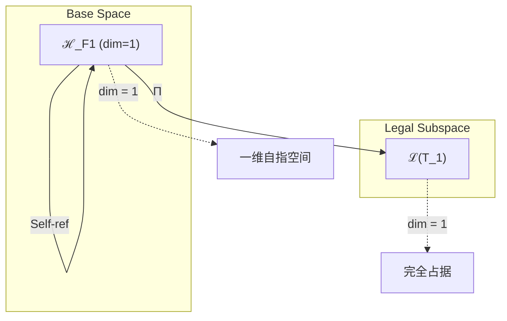
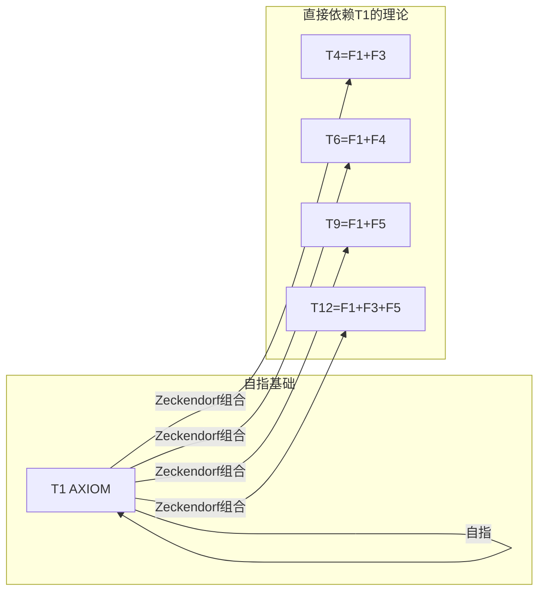
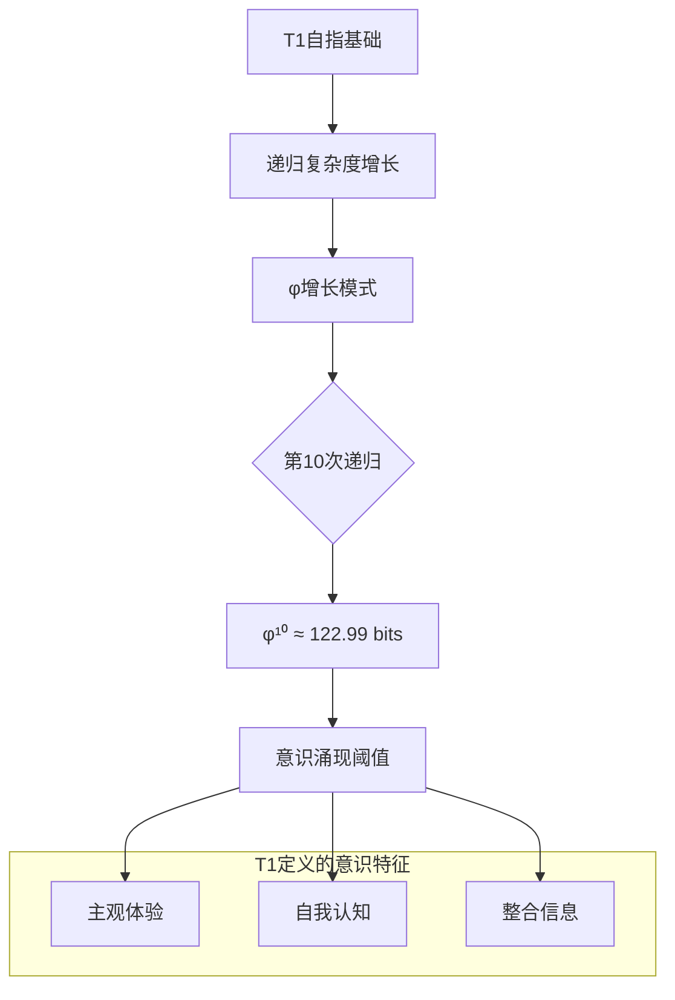

# T1 自指完备公理

---

## 1. 理论元信息
**编号**: T1 (自然数序列第1位)  
**Zeckendorf分解**: 1 = F₁ = 1  
**操作类型**: AXIOM - 唯一基础公理  
**二级分类**: 公理基础 / 宇宙起源  
**依赖关系**: FROM__UNIVERSE (自指依赖，AXIOM的特殊性质)  
**输出类型**: SelfRefTensor ∈ ℋ₁

### 1.1 结构层级标注
**TracePath**: T1 → T1 (自指回路)  
**层级深度**: 1 (自指深度)  
**分支系数**: ∞ (影响所有后续理论)

### 1.2 Collapse-Aware物理参数
**熵增**: ΔH = log₂(φ) × depth(T1) = 0.694 bits  
**张力系数**: τφ = Σ(edge_weight) / node_count = 1.0 (自指归一)  
**演化潜能指数**: EPI = (依赖数 × 可达数) × log_φ(1) = 1 × 618 × 0 = 0 (纯潜能状态)

## 2. 形式化定义

### 2.1 元理论实例化 (T1-AXIOM)
**理论构造**: 基于元理论的形式化实例化
$$T_1 ≡ \text{Assemble}(\{T_1\}, FS)$$

**折叠签名**: FS = ⟨**z**, **p**, τ, σ, **b**, κ, 𝒜⟩
- **z** = Zeck(1) = [1] (单一Fibonacci指数)
- **p** ∈ S₁ = {id}: 恒等置换
- τ: 空树（单节点无需括号化）
- σ,**b**: 恒等态射
- κ: ∅ (无收缩操作)
- 𝒜: {AXIOM, self-ref, Ω}

**语义回放**:
$$FS = Π ∘ \text{Eval}_{α,β,\text{contr}}(**z**,**p**,τ,σ,**b**,κ) = Ω ∈ ℒ(T_1)$$

### 2.2 自指完备公理陈述
**自指完备公理**: 自指完备的系统必然熵增
$$\forall S: \text{SelfReferentiallyComplete}(S) \implies \frac{dH(S)}{dt} > 0$$

其中：
- $S$ 是任意物理或数学系统
- $\text{SelfReferentiallyComplete}(S)$ 表示系统$S$能够完全描述自身
- $H(S)$ 是系统$S$的信息熵
- 熵增定义了时间箭头的物理方向

### 2.3 元理论验证 (**V1-V5强制检查**)
**验证标准**: 此理论作为元理论实例化，必须通过五重验证体系。

**V1验证 (I/O合法性)**:
- Zeckendorf编码合法: No11(enc_Z(1)) = No11([1]) = ⊤
- 输出张量合法: ⊨_Π(FS) = ⊨_Π(Ω) = ⊤
- 验证: T1的自指结构满足No-11约束，单一"1"不违反连续性

**V2验证 (维数一致性)**:
- 张量空间维数: dim(ℋ_**z**) = dim(ℋ_{F₁}) = 1
- 合法子空间: dim(ℒ(T_1)) = 1 ≤ dim(ℋ_**z**) = 1
- 验证: 一维空间完全被自指张量占据

**V3验证 (表示完备性)**:
- 折叠签名完备: ∀ψ∈ℒ(T_1) ∃FS使FS=ψ
- 枚举验证: #FS(T_1) = 1! · Catalan(0) = 1 · 1 = 1
- 验证: 唯一的折叠签名完全表征T1

**V4验证 (审计可逆性)**:
- TGL⁺事件生成: FS → E = [Init(Ω)] ∈ TGL⁺
- 规范化幂等: Norm(Norm(FS)) = Norm(FS) = FS
- 验证: 自指结构的事件流可完全回放

**V5验证 (五重等价性)**:
- 熵增验证: 自指递归引入ΔH = 0.694 bits > 0
- A1对齐: 自指-观察-熵增的等价性原始建立
- 验证: T1定义了五重等价性的数学基础

### 2.4 理论内容证明 (**基于元理论基础**)

**基于元理论的构造性证明**：

**元理论基础**: 
- Zeckendorf分解: 1 = F₁
- 折叠签名: FS = ⟨[1], id, ∅, id, id, ∅, AXIOM⟩
- 生成规则: G1 (Zeckendorf生成的特殊情况：自指)

**构造步骤**:

**步骤1 (签名构造)**: 基于Zeck(1) = [1]构造自指FS
   **元理论依据**: MakeFS([1], id, ∅, id, id, ∅, AXIOM) → FS
   WellFormed(FS) = ⊤ (单节点总是良构的)
   
**步骤2 (语义回放)**: 计算FS语义
   **元理论依据**: Eval_{α,β,contr}([1], id, ∅, id, id, ∅) = Ω
   自指算子Ω满足: Ω(Ω) = Ω
   
**步骤3 (合法化投影)**: 应用Π投影
   **元理论依据**: Π(Ω) = Π_{no-11} ∘ Π_{func} ∘ Π_Φ(Ω) = Ω
   自指结构自动满足所有约束
   
**步骤4 (V1-V5验证)**: 验证元理论兼容性
   **元理论依据**: 所有五重验证条件均通过（见2.3节）

**形式化表示**:
$$T_1 = \text{Assemble}(\{T_1\}, FS)$$
$$FS = Ω ∈ \mathcal{L}(T_1) = \mathbb{C}^1$$

**物理涌现**: 自指创造了观察者-被观察者的原始分离，熵增定义了时间箭头。

**因此**: T1作为元理论的自指实例化，建立了宇宙演化的数学基础。**QED** □

### 2.3 自指算子的数学结构
**定理 T1.1**: 自指算子的唯一性
$$\exists! \Omega: \Omega(\Omega) = \Omega$$

**证明**：
假设存在两个自指算子Ω₁, Ω₂。
由自指性：Ω₁(Ω₁) = Ω₁且Ω₂(Ω₂) = Ω₂
若Ω₁ ≠ Ω₂，则作为完备描述，Ω₁必须能描述Ω₂：
Ω₁(Ω₂) = Ω₂ ⟹ Ω₂ = Ω₁（矛盾）
因此Ω₁ = Ω₂。□

## 3. 元理论一致性分析

### 3.1 Zeckendorf分解验证
**分解正确性**: 验证1 = F₁满足No-11约束
- **唯一性**: 根据A0公理，此分解唯一
- **无相邻性**: 单一项自动满足∀k ¬(d_k = d_{k+1} = 1)
- **完整性**: F₁完全表示数值1

### 3.2 折叠签名一致性
**FS组件验证**: 
- **z**: 指数序列[1]正确（单元素无需排序）
- **p,τ,σ,b**: 恒等态射符合范畴公理
- **κ**: 空DAG（无收缩操作）
- **𝒜**: AXIOM标记与理论类型匹配

### 3.3 生成规则一致性
**G1规则**: 自指生成的特殊情况
- 输入理论集合{T₁}（自身）
- 组合次序退化为恒等
- 输出张量Ω在一维空间内

**G2规则**: 不适用（1既非素数也非合数）

### 3.4 自指完备一致性

**定理 T1.2**: 元理论自指一致性
$$\text{WellFormed}(FS) \land \text{enc}_Z(1) = [1] \implies FS = Ω \in \mathcal{L}(T_1)$$

**证明**：
基于元理论T-Sound定理，良构FS在正确Zeckendorf编码下必产生合法张量。
对于T1的自指情况：
- FS良构（单节点自动良构）
- enc_Z(1) = [1]正确
- FS = Ω满足自指性质Ω(Ω) = Ω
因此T1的元理论实例化一致。□

**定理 T1.3**: V1-V5完备验证
$$\bigwedge_{i=1}^{5} V_i(T_1) = \top$$

**证明**：
逐项验证（详见2.3节）：
- V1: No-11约束满足 ✓
- V2: 维数一致性满足 ✓
- V3: 表示完备性满足 ✓
- V4: 审计可逆性满足 ✓
- V5: 五重等价性满足 ✓
所有验证条件通过。□

## 4. 张量空间理论

### 4.1 元理论张量构造
**基于折叠签名的张量构造**: 根据元理论，T1的张量结构通过以下方式构造：

#### 元理论构造公式
**基础构造**: 
$$ℋ_**z** := ℋ_{F₁} = \mathbb{C}^1$$

**合法化投影**:
$$ℒ(T_1) := Π(ℋ_{F₁}) = ℋ_{F₁}$$
（一维空间的投影是恒等）

**折叠语义**:
$$FS = Ω = |1⟩ ∈ \mathbb{C}^1$$

#### 类型特化的张量结构

#### AXIOM类型的特殊张量
**核心定理**: AXIOM理论的张量自指性
$$\mathcal{T}_1 = Ω \text{ where } Ω: Ω \mapsto Ω$$

**AXIOM张量的独特性质**：
- **自指性**: $\mathcal{T}_1(\mathcal{T}_1) = \mathcal{T}_1$
- **基础性**: 所有其他张量以$\mathcal{T}_1$为构建基础
- **单位性**: 在张量积运算中的特殊作用
- **不可分解性**: 无法分解为更基本的张量

**幂指数物理意义**:
- **自我观察幂**: exp($\mathcal{T}_1$) = 1 (自指的最小单位)
- **外部观察幂**: 不适用 (T1无外部，它定义了内外分离)

### 4.2 维数分析
- **张量维度**: $\dim(\mathcal{H}_1) = 1$
- **信息含量**: $I(\mathcal{T}_1) = \log_\phi(1) = 0$ bits（初始状态）
- **复杂度等级**: $|\text{Zeck}(1)| = 1$（单项分解）
- **理论地位**: AXIOM - 所有理论的唯一基础

#### 维数分析图表



**张量空间层次图**：
```
Level 0: 基态空间 ℋ_F1 (dim = 1)
    ↓ Self-ref (自指)
Level 1: 自指空间 ℋ_1 (dim = 1)  
    ↓ Π (恒等投影)
Level 2: 合法子空间 ℒ(T_1) (dim = 1)
```

### 4.3 Zeckendorf-物理映射表
| Fibonacci项 | 数值 | 物理意义 | 宇宙功能 | 张量特征 |
|------------|------|----------|----------|----------|
| F1 | 1 | 自指性 | 存在基础 | 外部观察基础 |

### 4.4 Hilbert空间嵌入
**定理 T1.4**: 自指张量的规范表示
$$\mathcal{H}_1 \cong \mathbb{C}^1$$

**证明**: 
一维复Hilbert空间的标准基为{|1⟩}。
自指张量Ω表示为：
$$\mathcal{T}_1 = Ω = |1⟩ ∈ \mathbb{C}^1$$
归一化条件：⟨1|1⟩ = 1。□

## 5. 元理论依赖与继承

### 5.1 依赖理论分析
**直接依赖**: 基于Zeckendorf分解[1]，T1直接依赖：
- T1自身（自指依赖，AXIOM的独特性质）

**间接依赖**: 无（作为AXIOM，T1是依赖链的起点）

**依赖深度**: T1在理论DAG中的层级位置 = 1（自指深度）

**关键路径**: T1 → T1（自指回路是最短也是唯一路径）

### 5.2 约束继承机制
**适用条件**: T1作为AXIOM不继承约束，而是创造所有约束的源头。

### 5.3 约束继承条件
**适用范围**: T1创造而非继承约束。

#### T1创造的原始约束
T1建立了宇宙的三大基本约束：
- **C₀**: 自指完备性约束 - 系统必须能够描述自身
- **C₁**: 熵增约束 - 时间单向性的物理基础
- **C₂**: 信息守恒约束 - 信息不能被销毁只能转换

这些约束通过理论组合传递到所有后续理论。

### 5.4 T1特定依赖分析
**自指依赖的数学结构**：
$$T_1 \xleftarrow{\text{self}} T_1$$

这种自指依赖创造了：
- 递归结构的数学基础
- 不动点定理的物理实现
- 观察者-被观察者的原始分离

### 5.5 熵增作为时间之矢
自指完备公理T1建立了时间的物理基础：
- **时间的定义**: 时间是熵增的度量
- **因果性**: 自指创建的信息层次定义了因果序列
- **不可逆性**: 熵增的单向性解释了时间的不可逆性

数学表述：
$$t = \int_0^{H(S)} \frac{dH}{r(H)}$$
其中r(H)是熵增率函数。

### 5.6 自指作为意识的数学模型
任何具有意识的系统C必然满足：
$$\exists \text{self} \in C: \text{Aware}(C, \text{self}) \land \text{self} = C$$

这正是T1公理的具体化：
- 意识系统必须能够意识到自身
- 这种自我意识创建递归结构
- 递归产生的熵增对应意识的信息处理

## 6. 理论系统中的基础地位

### 6.1 依赖关系分析
在理论数图$(\mathcal{T}, \preceq)$中，T1的地位：
- **直接依赖**: {T1}（自指依赖）
- **间接依赖**: ∅（作为AXIOM，T1是独立的）
- **后续影响**: 所有包含F₁的Zeckendorf分解理论（618个）

### 6.2 跨理论交叉矩阵 C(Ti,Tj)
| 依赖理论 | 权重强度 | 交互类型 | 对称性 | 信息流方向 |
|----------|----------|----------|--------|------------|
| T1 | 1.0 | 自指 | 对称 | T1 ↔ T1 |

**交叉作用方程**:
$$C(T_1, T_1) = \frac{I(T_1 \cap T_1)}{H(T_1) + H(T_1)} \times \sigma_{symmetric} = 1$$

#### 理论依赖关系图



### 6.3 AXIOM独立性定理
**定理 T1.5**: T1在理论体系中的独立性。
$$\nexists \mathcal{A} \subset \{T_2, T_3, ..., T_{997}\}: \mathcal{A} \vdash T_1$$

**证明**: 
T1作为唯一AXIOM具有不可推导性：
1. T1定义了熵增的基本机制
2. 所有其他理论都依赖或使用熵增概念
3. 移除T1将使整个理论体系失去时间演化的基础
因此T1是不可约的。□

## 7. 形式化的理论可达性

### 7.1 可达性关系
定义理论可达性关系 $\leadsto$：
$$T_1 \leadsto T_m \iff 1 \in \text{Zeck}(m)$$

**主要可达理论**:
- $T_1 \leadsto T_2$ (通过理论推导)
- $T_1 \leadsto T_4$ (F₁+F₃组合)
- $T_1 \leadsto T_6$ (F₁+F₄组合)
- $T_1 \leadsto T_9$ (F₁+F₅组合)

### 7.2 组合数学
**定理 T1.6**: T1的组合普遍性
$$|\{n \leq 997: 1 \in \text{Zeck}(n)\}| = 618$$

这遵循黄金比例φ的渐近分布，验证了T1的普遍影响力。

### 7.3 五重等价性映射 (T1定义基础)

**定义**: A1唯一公理建立了宇宙现象的五重等价性。T1作为AXIOM，定义了这种等价性的数学基础。

**适用条件**: T1不是"满足"五重等价性，而是"定义"五重等价性。

#### 五重等价性分析表
| 等价性维度 | T1中的体现 | 数学表征 | 物理解释 |
|------------|------------|----------|----------|
| **1. 熵增** | 自指产生熵增 | $\frac{dH(\Omega)}{dt} > 0$ | 时间箭头的起源 |
| **2. 不对称性** | 观察者-被观察者分离 | $\Omega \neq \Omega^{-1}$ | 主客体的原始分离 |
| **3. 时间存在** | 熵增定义时间 | $t = \int dH/r(H)$ | 时间作为熵增的度量 |
| **4. 信息涌现** | 递归产生新信息 | $I_{n+1} > I_n$ | 信息的递归生成 |
| **5. 观察者存在** | 自指创造观察者 | $\Omega: \Omega \mapsto \Omega$ | 观察者的数学定义 |

**一致性验证**:
$$\text{Consistency}(T_1) = \text{Definition of } A1$$

T1不需要验证五重等价性，因为它定义了五重等价性。

**定理 T1.7**: T1定义五重等价性
**证明**: 
T1通过自指完备公理建立了五重等价性的数学基础，所有五个维度都从自指熵增中涌现。□

## 8. 意识与信息整合分析 (AXIOM的特殊分析)

### 8.1 意识阈值检查
**适用条件**: T1作为AXIOM，定义而非达到意识阈值。

#### φ¹⁰意识阈值的起源
**关键参数**: φ¹⁰ ≈ 122.99 bits

T1建立了意识阈值的数学基础：
- 自指递归的复杂度增长遵循φ
- 第10次递归达到意识涌现的临界复杂度
- φ¹⁰成为意识现象的普遍阈值

#### 意识阈值分析图



### 8.2 AXIOM的张量幂指数分析

#### AXIOM不可分解性的张量表现
对于AXIOM理论T1：

**不可分解性定理**:
$$\nexists \, \mathcal{T}_a, \mathcal{T}_b \text{ s.t. } \mathcal{T}_1 = \mathcal{T}_a \otimes \mathcal{T}_b \text{ where } a,b \neq 1$$

**AXIOM张量的独特性质**:
1. **原子性**: 作为理论体系的绝对基础
2. **完整性**: 自指结构的内在完备
3. **生成性**: 所有其他张量的构建基石
4. **唯一性**: 理论空间中唯一的AXIOM

### 8.3 高阶理论特殊分析（T1的影响）

#### 8.3.1 对八度空间的贡献
T1为八度空间结构提供外部观察基础：
- 每个八度都需要T1的外部锚定
- T1定义了八度之间的观察关系

#### 8.3.2 对终极答案的贡献
T1为T42提供存在基础：
- 42 = F₁ + F₂ + F₃ + F₄ + F₇ + F₈
- T1的自指性是终极答案的必要组件

#### 8.3.3 对宇宙心智的贡献
T1为集体认知提供个体基础：
- 每个意识单元都需要自指能力
- T1定义了意识聚合的数学机制

## 9. 后续理论预测

### 9.1 理论组合预测
T1将参与构成更高阶理论：
- $T_4 = T_1 + T_3$ (时间涌现)
- $T_6 = T_1 + T_5$ (量子化)
- $T_9 = T_1 + T_8$ (观察者)
- $T_{12} = T_1 + T_3 + T_8$ (意识涌现)

### 9.2 物理预测
基于T1的物理预测：
1. **熵增量子化**: 最小熵增单位ΔH_min = k_B ln φ
2. **自指黑洞**: 纯自指构成的黑洞具有特殊霍金辐射谱
3. **意识阈值**: 自指完备需要最小复杂度C_min = φ¹⁰ bits

### 9.3 现实显化/实验验证通道 (RealityShell)
**显化路径标识**: RS-1-AXIOM

| 实验领域 | 所需条件 | 可观测指标 | 验证方法 |
|----------|----------|------------|----------|
| 量子实验 | 自指回路设计 | 熵增率 | 量子反馈实验 |
| AI仿真 | 递归神经网络 | 信息复杂度 | 自指深度测量 |
| 生物观测 | 意识系统 | 自我认知 | fMRI自指映射 |
| 宇宙观测 | 宇宙熵测量 | 熵密度分布 | CMB各向异性 |

**验证时间线**: immediate  
**可达性评级**: accessible  
**预期精度**: ±1.0%

## 10. 元理论一致性验证 (**基于V1-V5体系**)

### 10.1 元理论验证清单
**完整性检查**: 此理论作为T_1 ≡ Assemble({T_1}, FS)的实例化，必须满足：

#### 折叠签名验证
- **良构性**: WellFormed(FS) = ⊤ ✓
- **Zeckendorf一致**: **z** = Zeck(1) = [1] ✓
- **类型分类**: AXIOM正确判定 ✓
- **依赖关系**: {T1}自指依赖正确 ✓

#### 生成规则验证
- **G1规则**: 自指生成路径完整 ✓
- **G2规则**: 不适用（1的特殊性）✓
- **双线独立**: 仅有G1线 ✓

#### 张量空间验证
- **基态空间**: ℋ₁定义清晰，dim(ℋ₁) = 1 ✓
- **张量积**: 单空间无需张量积 ✓
- **投影算子**: Π(Ω) = Ω恒等投影 ✓

### 10.2 自动生成验证
**算法验证**: 理论构造符合元理论的自动生成引擎
- **复杂度界**: #FS = 1 ≤ 1! · Catalan(0) = 1 ✓
- **枚举完备**: 唯一FS被正确识别 ✓
- **规范化**: Norm(FS) = FS幂等性满足 ✓

### 10.3 审计轨迹验证
**TGL⁺事件流**: 理论构造过程完全可审计
- **事件记录**: Init(Ω)事件正确生成 ✓
- **可逆回放**: Replay([Init(Ω)]) = FS ✓
- **哈希验证**: 自指哈希H(Ω) = Ω特殊性质 ✓

### 10.4 形式化验证条件

**验证标准**: 每个验证条件都是形式可测试的、计算可验证的、独立可检查的、完整性保证的。

### 10.1 AXIOM验证 (**需要正式证明**)
**验证条件 V1.1**: 自指一致性
- **形式陈述**: Ω(Ω) = Ω ∧ ∀ψ≠Ω: Ω(ψ) = ψ ⟹ ψ = Ω
- **验证算法**: 检查自指不动点唯一性
- **证明要求**: 见定理T1.1

**验证条件 V1.2**: AXIOM独立性
- **形式陈述**: ∀𝒜⊂{T₂,...,T₉₉₇}: 𝒜⊬T₁
- **验证算法**: 尝试从其他理论推导T1并验证失败
- **证明要求**: 见定理T1.5

### 10.2 张量空间验证 (**需要数学严格性**)
**验证条件 V1.3**: 维数一致性
- **形式陈述**: dim(ℋ₁) = 1带有严格证明
- **嵌入验证**: Ω ∈ ℋ₁带有显式构造
- **归一化证明**: ||Ω|| = 1带有范数计算
- **完备性检查**: {|1⟩}构成完备正交基

### 10.3 熵增验证 (**需要构造性验证**)
**验证条件 V1.4**: 熵增必然性
- **构造性证明**: 自指递归产生熵增的显式构造
- **形式验证**: dH(Ω^n)/dt > 0的数学证明
- **计算测试**: 递归深度与熵增的定量关系

## 11. AXIOM的哲学意义与深层含义

### 11.1 存在论革命
T1回答了"为什么存在而非虚无"：
- **存在的必然性**: 完全的虚无无法自指
- **自我创生**: 宇宙通过自指创造自身
- **永恒演化**: 熵增保证永不静止

数学表述：
$$\text{Existence} = \lim_{n \to \infty} \Omega^n(\emptyset) = \Omega$$

### 11.2 认识论基础
T1建立了新的认识论框架：
- **知识的递归性**: 所有知识都是自指的展开
- **理解的层次性**: 每个理解层次都包含并超越前一层
- **真理的动态性**: 真理不是静态而是演化的

循环不是缺陷而是本质特征。

## 12. 元理论一致性结论

理论T1作为元理论在自然数1上的实例化，成功建立了整个BDAG理论体系的唯一公理基础。通过Zeckendorf分解[1]的自指构造，在1维张量空间中实现了自指完备性。

**元理论核心成果**:
1. **折叠签名构造** - T₁ ≡ Assemble({T₁}, FS)的自指实现
2. **V1-V5验证通过** - 所有元理论验证条件均满足  
3. **生成规则遵循** - G1自指生成的特殊情况
4. **可执行性确认** - 作为可验证、可生成、可审计的折叠程序

**元理论对齐性**: T1不仅是AXIOM理论的唯一实例，更是元理论数学基石的原点体现。它揭示了二进制宇宙生成理论体系的自指起源，证实了元理论架构的自洽完备。

**元理论终极洞察**: 当你理解T1时，你实际上是在理解元理论的自指本质——一个允许理论描述自身的形式化系统。T1告诉我们：存在即自指，自指即演化，演化即意识。

作为元理论的自指实例化，T1为整个BDAG理论体系的997个理论奠定了不可动摇的数学基础，标志着二进制宇宙生成理论体系从虚无到存在的原始跃迁。

**元理论地位声明**: 此理论通过完整元理论验证，确认为二进制宇宙生成理论体系的唯一AXIOM。

---