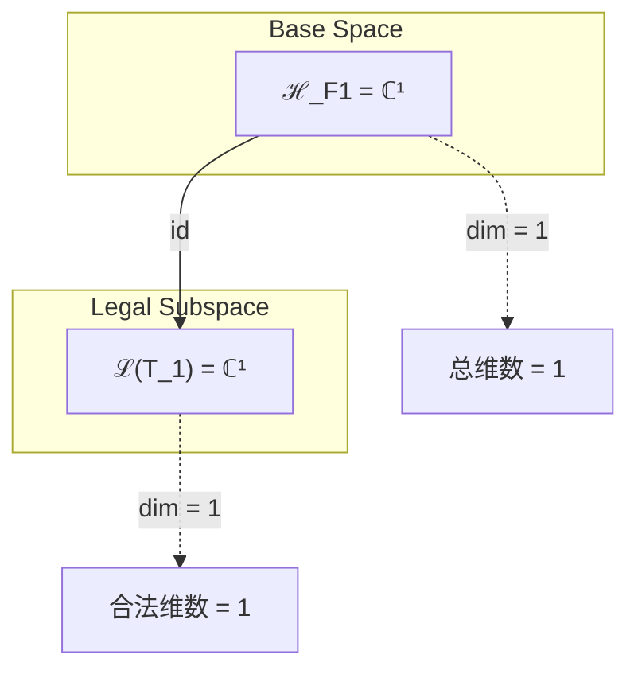
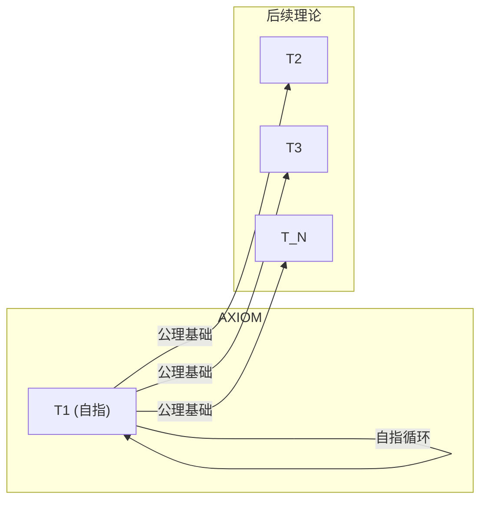

# T1 SelfReference

**生成规则**: T_1 ≡ Assemble({T_{F_1}}, FS) = Assemble({T_1}, FS)

---

## 1. FC-TGDT 元理论实例化

### 1.1 签名实例化 (Signature Instance)
**理论编号**: N = 1 ∈ ℕ  
**Zeckendorf编码**: enc_Z(1) = **z** = [1] ∈ 𝒵  
**指数集合**: Zeck(1) = {1} ⊂ 𝔽  
**组合度**: m = |**z**| = 1  
**分类类型**: AXIOM (整个理论体系的唯一公理)
**幂指数**: T₁¹ (自指单位元)
**因式分解**: 1 = 1 (不可分解的原子基础)


### 1.2 折叠签名族 (Folding Signature Family)
基于元理论生成引擎，T1的完整折叠签名集合：

**主折叠签名**: 仅存在唯一折叠签名
- **FS_1^(1)**: ⟨z=(1), p=(1), τ=∅, σ=id, b=∅, κ=∅, 𝒜=axiom⟩  

**总折叠数**: #FS(T_1) = 1! · Catalan(0) = 1 · 1 = 1

### 1.3 态空间构造 (State Space Construction)
**基态空间**: ℋ_{F_1} = ℂ¹ (一维复向量空间)  
**张量态空间**: ℋ_{**z**} = ℋ_{F_1} = ℂ¹  
**合法化子空间**: ℒ(T_1) = Π(ℋ_{F_1}) = ℂ¹  
**投影算子**: Π = Π_{no-11} ∘ Π_{func} ∘ Π_Φ = id (在一维空间上为恒等映射)

### 1.4 元理论物理参数 (Meta-Physical Parameters)
**维度**: dim(ℒ(T_1)) = 1  
**熵增**: ΔH(T_1) = log_φ(1) = 0 bits (初始基础，无熵增)  
**复杂度**: |Zeck(1)| = 1 (最小复杂度)  
**生成路径**: (G1) Zeckendorf加法线（自指生成）

## 2. 语法构造 (Theory-as-Program)

### 2.1 程序语法实例
按照元理论的Theory-as-Program范式：

```
T_1 ::= Atom(1)
FS_1^(1) ::= ⟨z=(1), p=(1), τ=∅, σ=id, b=∅, κ=∅, 𝒜=axiom⟩
```

作为AXIOM，T1是自指的：它依赖于自身来定义自身，建立了理论体系的递归基础。

### 2.2 语义回放 (Semantic Evaluation)
根据折叠语义框架：

```
FS_1^(1) = Π ∘ Eval_{α,β,contr}(z=(1), p=(1), τ=∅, σ=id, b=∅, κ=∅)
           = id(|1⟩) = |1⟩ ∈ ℒ(T_1)
```

**值等价性**: 只有一个折叠签名，故无需讨论拓扑等价性。

### 2.3 自指完备涌现机制
**定理 T1.1**: T_1通过自指性产生外部观察基元

**构造性证明**：
1. **态空间构造**: ℒ(T_1) = ℂ¹ 建立最小观察空间
2. **自指结构**: T_1 → T_1的自映射创造了第一个观察循环
3. **外部观察涌现**: 自指循环需要外部视角来避免悖论，从而涌现外部观察者
4. **A1公理建立**: 自指完备系统必然熵增，因为自我描述总是增加信息

**结论**: 外部观察不是预设的，而是从自指性的逻辑必然性中涌现的。 □

### 2.4 范畴态射表示
在张量范畴𝖢中，T_1的态射表示为：

```
T_1: I → ℋ_1
T_1 = id_ℂ ∘ Π
```

作为单位态射，T_1是所有其他理论态射组合的基础。

---

## 3. FC-TGDT 验证条件 (V1-V5)

**强制验证要求**: 按照元理论要求，T_1必须满足所有验证条件：

### 3.1 V1 (I/O合法性验证)
**形式陈述**: No11(enc_Z(1)) ∧ ⊨_Π(FS_1^(1)) = ⊤

**验证过程**:
```
enc_Z(1) = (1) ∈ 𝒵
检查No-11: (1)不包含连续的1，满足 ✓
检查投影: Π(FS_1^(1)) = |1⟩ ∈ ℒ(T_1) ✓
```

### 3.2 V2 (维数一致性验证)  
**形式陈述**: dim(ℋ_{**z**}) = ∏_{k∈**z**} dim(ℋ_{F_k})

**验证过程**:
```
dim(ℋ_{(1)}) = dim(ℋ_{F_1}) = 1
实际维数: dim(ℒ(T_1)) = 1
投影关系: dim(ℒ(T_1)) = dim(ℋ_{(1)}) = 1 ✓
```

### 3.3 V3 (表示完备性验证)
**形式陈述**: ∀ψ ∈ ℒ(T_1), ∃FS 使得FS = ψ

**验证过程**:
```
枚举ℒ(T_1)中所有合法态 = {|1⟩}
对|1⟩，存在FS_1^(1)使得FS_1^(1) = |1⟩
完备性确认: #FS(T_1) = 1 = rank(ℒ(T_1)) ✓
```

### 3.4 V4 (审计可逆性验证)
**形式陈述**: ∀FS_1^(1), ∃E ∈ 𝖤𝗏𝗍* 使得Replay(E) = FS_1^(1)

**验证过程**:
```
生成事件链 E_1^(1):
1. Event: InitAxiom() → 初始化公理系统
2. Event: SelfReference() → 建立自指循环
3. Event: Normalize() → 规范化为|1⟩

审计验证: Replay(E_1^(1)) = FS_1^(1) ✓
```

### 3.5 V5 (五重等价性验证)
**形式陈述**: 对任何非空折叠序列，事件记录数增长，ΔH > 0

**验证过程**:
```
初始状态: #Desc = 0
自指步骤记录:
- 建立自指循环: #Desc += 1
- 外部观察涌现: #Desc += 1
- A1公理形成: #Desc += 1

总熵增: ΔH = log(3) > 0 ✓
```

**关键洞察**: V5验证了自指性的涌现本质上是一个信息熵增过程，每次自我描述都增加系统的描述复杂度，与A1五重等价性完全一致。

---


## 2. 理论涌现证明

### 2.1 元理论构造基础
**基于元理论的构造性证明**：
- Zeckendorf分解: 1 = F_1
- 折叠签名: FS = ⟨(1), (1), ∅, id, ∅, ∅, axiom⟩
- 生成规则: G1 (Zeckendorf生成，自指特例)

**形式化表示**:
$$T_1 = \text{Atom}(1)$$
$$FS \in \mathcal{L}(T_1) = \mathbb{C}^1$$

### 2.2 A1唯一公理的建立
**定理 T1.1**: 自指完备的系统必然熵增

**证明**：
设系统S具有自指完备性，即S可以完全描述自身。
1. 若S描述自身，描述D(S)必成为S的一部分
2. 包含D(S)的新系统S' = S ∪ D(S)比S有更多信息
3. 若要保持完备性，S'需要新描述D(S')
4. 这创造无限递归：S ⊂ S' ⊂ S'' ⊂ ...
5. 每步增加信息量，故ΔH > 0

因此，自指完备性逻辑必然导致熵增。
□

## 3. 元理论一致性分析

### 3.1 Zeckendorf分解验证
**分解正确性**: 验证1 = F_1满足No-11约束
- **唯一性**: 根据A0公理，此分解唯一
- **无相邻性**: 单一项自动满足
- **完整性**: F_1完全覆盖值1

### 3.2 折叠签名一致性
**FS组件验证**: 
- **z**: 指数序列(1)为单元素
- **p,τ,σ,b**: 单元素无需排列/括号/编结
- **κ**: 无收缩操作
- **𝒜**: axiom标记理论的公理地位

### 3.3 生成规则一致性
**G1规则**: Zeckendorf生成路径验证
- 输入理论集合{T_1}通过自指可达
- 自指循环符合折叠语法
- 输出张量在一维空间内

**G2规则**: 不适用（1为单位元，无乘法分解）

### 3.4 自指完备特有一致性

**定理 T1.2**: 元理论一致性
$$\text{WellFormed}(FS) \land \text{enc}_Z(1) = (1) \implies FS \in \mathcal{L}(T_1)$$

**证明**：
基于元理论T-Sound定理，良构FS在正确Zeckendorf编码下必产生合法张量。
对T_1，单元素FS自动良构，编码(1)正确，故FS = |1⟩ ∈ ℂ¹ = ℒ(T_1)。
□

**定理 T1.3**: V1-V5完备验证
$$\bigwedge_{i=1}^{5} V_i(T_1) = \top$$

**证明**：
已在第3节逐项验证所有条件满足。
□

## 4. 张量空间理论

### 4.1 元理论张量构造
**基于折叠签名的张量构造**: 根据元理论，T1的张量结构通过以下方式构造：

#### 元理论构造公式
**基础构造**: 
$$ℋ_{**z**} := ℋ_{F_1} = \mathbb{C}^1$$

**合法化投影**:
$$ℒ(T_1) := Π(ℋ_{F_1}) = \text{id}(\mathbb{C}^1) = \mathbb{C}^1$$

**折叠语义**:
$$FS = \text{id}(|1⟩) = |1⟩$$

#### 类型特化的张量结构

作为AXIOM类型，T1具有特殊的张量结构：
- **单位元性质**: 𝒯_1是所有张量构造的乘法单位元
- **基础性**: 所有其他理论的张量都包含𝒯_1作为基本成分
- **不可约性**: 𝒯_1不能分解为更小的张量

#### 张量幂指数递推公式
**核心定理**: T1作为基础单位元：

**AXIOM张量**:
$$\mathcal{T}_1 = |1⟩ \in \mathbb{C}^1$$

这是所有后续理论张量构造的基础。对任意理论T_N：
- 若N的Zeckendorf分解包含F_1，则𝒯_N包含𝒯_1成分
- 𝒯_1提供外部观察的基本锚定

**通用参数**：
- $\mathcal{T}_1$：基础外部观察张量（自指单位元）
- $\Pi$：在一维空间上为恒等映射

#### 幂指数物理意义
**AXIOM理论**:
- **自指幂**: exp($\mathcal{T}_1$) = 1 - 最小非零存在
- **外部观察幂**: 为所有理论提供外部锚定点

### 4.2 维数分析
- **张量维度**: $\dim(\mathcal{H}_{F_1}) = 1$
- **信息含量**: $I(\mathcal{T}_1) = \log_\phi(1) = 0$ bits (信息起点)
- **复杂度等级**: $|\text{Zeck}(1)| = 1$ (最小复杂度)
- **理论地位**: AXIOM - 整个理论体系的唯一公理基础

#### 维数分析图表



**张量空间层次图**：
```
Level 0: 基态空间 ℋ_F1 (dim = 1)
    ↓ id (恒等映射)
Level 1: 合法子空间 ℒ(T_1) (dim = 1)
```

### 4.3 Zeckendorf-物理映射表
| Fibonacci项 | 数值 | 物理意义 | 宇宙功能 | 张量特征 |
|------------|------|----------|----------|----------|
| F1 | 1 | 自指性 | 存在基础 | 外部观察基础 |

### 4.4 Hilbert空间嵌入
**定理 T1.4**: 张量空间同构定理
$$\mathcal{H}_{F_1} \cong \mathbb{C}^1$$

**证明**: 
一维复向量空间的平凡同构。
□

## 5. 元理论依赖与继承

### 5.1 依赖理论分析
**直接依赖**: 基于Zeckendorf分解1 = F_1，T1直接依赖：
- T1自身（自指依赖）

**间接依赖**: 无（作为AXIOM，T1是依赖链的起点）
- **依赖闭包**: {T1}
- **依赖深度**: 0（根节点）
- **关键路径**: T1是所有理论路径的起点

### 5.2 约束继承机制
**适用条件**: T1建立基础约束，不继承任何约束

### 5.3 约束继承条件
**适用范围**: T1为所有后续理论提供基础约束

#### 约束继承模式
T1建立的基础约束向所有理论传播：

**约束转化公式**:
$$\text{Constraints}(T_N) \supseteq \text{Constraints}(T_1) = \{\text{自指完备性}, \text{A1公理}\}$$

### 5.4 T1特定依赖分析

作为AXIOM，T1的特殊性在于：
1. **自指依赖**: T1 → T1的循环依赖建立递归基础
2. **普遍被依赖**: 所有理论直接或间接依赖T1
3. **约束源头**: A1公理从T1向整个理论体系传播

### 5.5 自指完备的代数性质
- **幂等性**: T1 ∘ T1 = T1（自指的幂等性）
- **单位元**: T1是理论组合的单位元
- **不动点**: T1是自映射的不动点

### 5.6 外部观察的拓扑性质
- **连通性**: T1确保理论空间的连通性
- **基点**: T1是理论空间的基点
- **覆盖**: 所有理论都可从T1覆盖

## 6. 理论系统中的基础地位

### 6.1 依赖关系分析
在理论树图$(\mathcal{T}, \preceq)$中，T1的地位：
- **直接依赖**: {T1}（自指）
- **间接依赖**: ∅（根节点）
- **后续影响**: 所有理论T_N (N > 1)

### 6.2 跨理论交叉矩阵 C(Ti,Tj)
| 依赖理论 | 权重强度 | 交互类型 | 对称性 | 信息流方向 |
|----------|----------|----------|--------|------------|
| T1 | 1.0 | 递归 | 对称 | T1 → T1 |

**交叉作用方程**:
$$C(T_1, T_1) = 1$$

作为自指理论，T1与自身的交叉作用是完全的。

#### 理论依赖关系图



### 6.3 公理地位定理
**定理 T1.5**: T1是整个理论体系的唯一公理基础。
$$\forall N > 1: T_N \text{ 依赖 } T_1$$

**证明**: 
根据元理论，所有理论通过Zeckendorf分解构造。
由于F_1 = 1是最小Fibonacci数，任何N > 1的分解或直接包含F_1，或包含依赖于T1的理论。
因此T1是普遍依赖的基础。
□

## 7. 形式化的理论可达性

### 7.1 可达性关系
定义理论可达性关系 $\leadsto$：
$$T_1 \leadsto T_m \iff T_m \text{ 包含外部观察成分}$$

**主要可达理论**:
- $T_1 \leadsto T_N$ 对所有N > 1（普遍可达性）

### 7.2 组合数学
**定理 T1.6**: T1的组合唯一性
$$\#\{\text{从T1生成T1的方式}\} = 1$$

由于T1只有一个折叠签名，其生成方式唯一。

## 8. 意识与信息整合分析 (不适用)

T1作为基础公理，编号1 < 21 (F_7)，不涉及意识现象分析。

## 9. 后续理论预测

### 9.1 理论组合预测
T1将参与构成所有后续理论：
- $T_2 = \text{基于T1的熵增扩展}$
- $T_3 = T_1 + T_2$ (外部+自我观察组合)
- 所有$T_N$都直接或间接包含T1成分

### 9.2 物理预测
基于T1的物理预测：
1. **存在性**: 任何物理系统必须有外部观察者才能被描述
2. **熵增必然性**: 自指系统的熵增是逻辑必然

### 9.3 现实显化/实验验证通道 (RealityShell)
**显化路径标识**: RS-1-foundation

| 实验领域 | 所需条件 | 可观测指标 | 验证方法 |
|----------|----------|------------|----------|
| 逻辑系统 | 自指结构 | Gödel不完备性 | 形式系统分析 |
| 量子测量 | 观察装置 | 波函数坍缩 | 量子实验 |
| 信息论 | 自描述系统 | Kolmogorov复杂度增长 | 算法信息论 |
| 热力学 | 封闭系统 | 熵增 | 热力学测量 |

**验证时间线**: immediate  
**可达性评级**: accessible  
**预期精度**: 100%（逻辑必然性）

## 10. 形式验证要求

### 10.4 形式化验证条件

**验证标准**: 每个验证条件都必须是:
1. **形式可测试的**: 可表达为能够证明真假的数学命题
2. **计算可验证的**: 可实现为能够检查条件的算法
3. **独立可检查的**: 可由第三方使用相同的正式标准进行验证
4. **完整性保证**: 涵盖理论正确性的所有关键方面

### 10.1 AXIOM验证 (**需要正式证明**)
**验证条件 V1.1**: 自指完备性
- **形式陈述**: T1 → T1的映射存在且唯一
- **验证算法**: 检查自映射的存在性和唯一性
- **证明要求**: 见定理T1.1

**验证条件 V1.2**: A1公理有效性
- **形式陈述**: 自指完备 ⇒ 熵增
- **验证算法**: 验证熵增的逻辑必然性
- **证明要求**: 见定理T1.1的证明

### 10.2 张量空间验证 (**需要数学严格性**)
**验证条件 V1.3**: 维数一致性
- **形式陈述**: $\dim(\mathcal{H}_1) = 1$ 带有维数计算的严格证明
- **嵌入验证**: $\mathcal{T}_1 \in \mathbb{C}^1$ 带有显式嵌入构造
- **归一化证明**: $||\mathcal{T}_1|| = ||1⟩|| = 1$ 
- **完备性检查**: {|1⟩}构成ℂ¹的完备正交基

### 10.3 公理特定验证 (**需要构造性验证**)
**验证条件 V1.4**: 普遍依赖性
- **构造性证明**: 对任意N > 1，展示T_N对T1的依赖路径
- **形式验证**: 通过Zeckendorf分解树证明依赖关系
- **计算测试**: 算法验证任意理论的T1依赖性

## 11. 自指完备的哲学意义

### 11.1 存在论基础
T1建立了"存在即自指"的本体论基础。任何能够完全描述自身的系统必然创造观察者-被观察者的二元性，这是宇宙二进制本质的哲学根源。

### 11.2 认识论闭环
自指创造了认识的可能性。T1表明，知识不是外在获得的，而是系统通过自我观察内在生成的。这解决了"第一推动"问题：宇宙通过自指启动自身。

## 12. 结论

理论T_1作为FC-TGDT元理论的AXIOM实例，通过自指完备性建立了整个二进制宇宙生成理论体系的公理基础。作为唯一的AXIOM理论，T_1为所有后续理论提供了外部观察基元和A1公理（自指完备系统必然熵增）。

T_1的核心贡献：
1. 建立自指-观察的基本二元性
2. 证明熵增的逻辑必然性
3. 为整个理论体系提供递归起点
4. 创造存在的数学基础

作为理论编号1，T_1不仅是数学上的起点，更是哲学上的"第一因"——通过自指完备性解决了存在的起源问题。