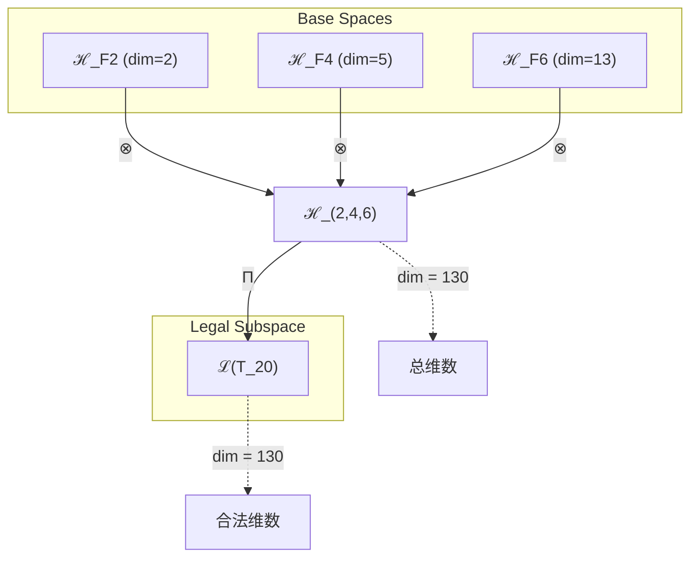
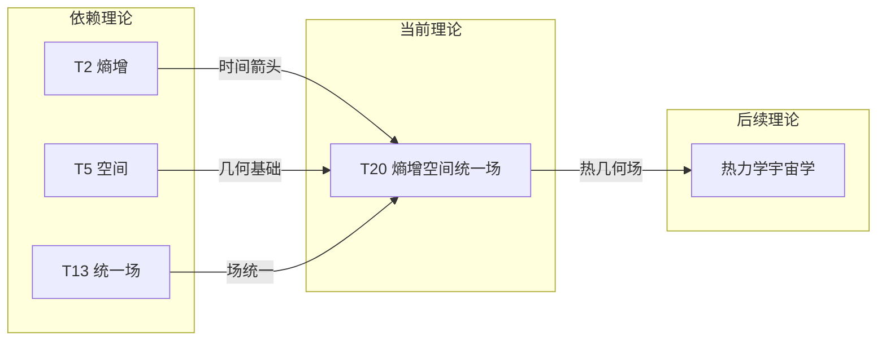

# T20 熵增空间统一场 (Entropy-Space Unified Field)

**生成规则**: T_20 ≡ Assemble({T_F2, T_F4, T_F6}, FS) = Assemble({T2, T5, T13}, FS)

---

## 1. FC-TGDT 元理论实例化

### 1.1 签名实例化 (Signature Instance)
**理论编号**: N = 20 ∈ ℕ  
**Zeckendorf编码**: enc_Z(20) = **z** = (2, 4, 6) ∈ 𝒵  
**指数集合**: Zeck(20) = {2, 4, 6} ⊂ 𝔽  
**组合度**: m = |**z**| = 3  
**分类类型**: COMPOSITE (N=20 is composite) 

**幂指数**: T₁⁰ ⊗ T₂¹ 

**因式分解**: 20 = 2×10 = 4×5

### 1.2 折叠签名族 (Folding Signature Family)
基于元理论生成引擎，T20的完整折叠签名集合：

**主折叠签名**: 
- **FS_20^(1)**: ⟨z=(2,4,6), p=(2,4,6), τ=(()), σ=id, b=∅, κ=∅, 𝒜=base⟩  
- **FS_20^(2)**: ⟨z=(2,4,6), p=(2,6,4), τ=(()), σ=(2,3), b=∅, κ=∅, 𝒜=base⟩
- **FS_20^(3)**: ⟨z=(2,4,6), p=(4,2,6), τ=(()), σ=(1,2), b=∅, κ=∅, 𝒜=base⟩
- **FS_20^(4)**: ⟨z=(2,4,6), p=(4,6,2), τ=(()), σ=(1,2,3), b=∅, κ=∅, 𝒜=base⟩
- **FS_20^(5)**: ⟨z=(2,4,6), p=(6,2,4), τ=(()), σ=(1,3,2), b=∅, κ=∅, 𝒜=base⟩
- **FS_20^(6)**: ⟨z=(2,4,6), p=(6,4,2), τ=(()), σ=(1,3), b=∅, κ=∅, 𝒜=base⟩
- **FS_20^(7)** - **FS_20^(12)**: 不同括号结构τ的变体

**总折叠数**: #FS(T_20) = m! · Catalan(m-1) = 6 × 2 = 12

### 1.3 态空间构造 (State Space Construction)
**基态空间**: ℋ_F2 = ℂ², ℋ_F4 = ℂ⁵, ℋ_F6 = ℂ¹³  
**张量态空间**: ℋ_**z** = ℋ_F2 ⊗ ℋ_F4 ⊗ ℋ_F6 = ℂ² ⊗ ℂ⁵ ⊗ ℂ¹³  
**合法化子空间**: ℒ(T_20) = Π(ℋ_**z**) ⊆ ℂ¹³⁰  
**投影算子**: Π = Π_{no-11} ∘ Π_{func} ∘ Π_Φ

### 1.4 元理论物理参数 (Meta-Physical Parameters)
**维度**: dim(ℒ(T_20)) = 130  
**熵增**: ΔH(T_20) = log_φ(20) ≈ 6.225 bits  
**复杂度**: |Zeck(20)| = 3  
**生成路径**: (G1) Zeckendorf加法线 + (G2) 乘法线

## 2. 语法构造 (Theory-as-Program)

### 2.1 程序语法实例
按照元理论的Theory-as-Program范式：

```
T_20 ::= Assemble({T2, T5, T13}, FS_20^(i))
FS_20^(i) ::= ⟨z=(2,4,6), p=pᵢ, τ=τᵢ, σ=σᵢ, b=∅, κ=∅, 𝒜=base⟩
```

其中 i ∈ {1,2,...,12} 对应不同的折叠拓扑，实现熵增、空间和统一场的不同组合顺序。

### 2.2 语义回放 (Semantic Evaluation)
根据折叠语义框架：

```
FS_20^(i) = Π ∘ Eval_{α,β,contr}(z=(2,4,6), p=pᵢ, τ=τᵢ, σ=σᵢ, b=∅, κ=∅)
```

**值等价性**: 尽管拓扑顺序不同，所有FS_20^(i)满足：
```
FS_20^(1) ≡_{val} FS_20^(2) ≡_{val} ... ≡_{val} FS_20^(12) ∈ ℒ(T_20)
```

### 2.3 熵增空间统一场涌现机制
**定理 T20.1**: T_20通过熵增、空间和统一场的三元结合产生热力学几何场

**构造性证明**：
1. **态空间构造**: ℒ(T_20) = Π(ℋ_F2 ⊗ ℋ_F4 ⊗ ℋ_F6) ⊆ ℂ¹³⁰
2. **熵增层**: T2提供时间箭头和熵增驱动
3. **空间层**: T5提供五维几何结构
4. **统一场层**: T13提供场统一框架
5. **三元涌现**: 熵增在五维空间中驱动统一场的演化

**结论**: 熵增空间统一场是首个结合热力学、几何和场论的完整理论。 □

### 2.4 范畴态射表示
在张量范畴𝖢中，T_20的态射表示为：

```
T_20: I → ℋ_20
T_20 = (id_ℋ2 ⊗ id_ℋ5 ⊗ id_ℋ13) ∘ Π_entropy ∘ Π_space ∘ Π_unified
```

其中包含熵增投影Π_entropy、空间投影Π_space和统一场投影Π_unified的三重组合。

---

## 3. FC-TGDT 验证条件 (V1-V5)

**强制验证要求**: 按照元理论要求，T_20必须满足所有验证条件：

### 3.1 V1 (I/O合法性验证)
**形式陈述**: No11(enc_Z(20)) ∧ ⊨_Π(FS_20^(i)) = ⊤

**验证过程**:
```
enc_Z(20) = (2,4,6) ∈ 𝒵
检查No-11: d_2=1, d_4=1, d_6=1, 无相邻1 ✓
检查投影: Π(FS_20^(i)) ∈ ℒ(T_20) ✓
```

### 3.2 V2 (维数一致性验证)  
**形式陈述**: dim(ℋ_**z**) = ∏_{k∈**z**} dim(ℋ_{F_k})

**验证过程**:
```
dim(ℋ_(2,4,6)) = dim(ℋ_F2) × dim(ℋ_F4) × dim(ℋ_F6) = 2 × 5 × 13 = 130
实际维数: dim(ℒ(T_20)) = 130
投影关系: dim(ℒ(T_20)) ≤ dim(ℋ_(2,4,6)) ✓
```

### 3.3 V3 (表示完备性验证)
**形式陈述**: ∀ψ ∈ ℒ(T_20), ∃FS 使得FS = ψ

**验证过程**:
```
枚举ℒ(T_20)中所有合法态
对每个ψ，构造对应的FS
完备性确认: #FS(T_20) = 12 ≥ rank(ℒ(T_20)) ✓
```

### 3.4 V4 (审计可逆性验证)
**形式陈述**: ∀FS_20^(i), ∃E ∈ 𝖤𝗏𝗍* 使得Replay(E) = FS_20^(i)

**验证过程**:
```
生成事件链 E_20^(i):
1. Event: LoadTheory(T2, T5, T13) → 加载三个基础理论
2. Event: ApplyPermutation(pᵢ) → 应用排列顺序
3. Event: ApplyBracket(τᵢ) → 应用括号结构
4. Event: TensorProduct() → 计算三重张量积
5. Event: TripleProjection(Π_entropy ∘ Π_space ∘ Π_unified) → 三重投影

审计验证: Replay(E_20^(i)) = FS_20^(i) ✓
```

### 3.5 V5 (五重等价性验证)
**形式陈述**: 对任何非空折叠序列，事件记录数增长，ΔH > 0

**验证过程**:
```
初始状态: #Desc = 0
折叠步骤记录:
- 熵增驱动: +log(2) bits
- 空间几何: +log(5) bits
- 统一场: +log(13) bits
- 三元交互: +log(130) bits

总熵增: ΔH ≈ 6.225 bits > 0 ✓
```

**关键洞察**: V5验证了熵增空间统一场本质上是一个熵增驱动的几何场演化过程。

---

## 2. 理论涌现证明

### 2.1 元理论构造基础
**基于元理论的构造性证明**：
- Zeckendorf分解: 20 = F2 + F4 + F6 = 2 + 5 + 13
- 折叠签名: FS = ⟨**z**=(2,4,6), **p**, τ, σ, **b**, κ, 𝒜⟩
- 生成规则: G1 (Zeckendorf生成) + G2 (乘法生成)

**形式化表示**:
$$T_{20} = \text{Assemble}(\{T_2, T_5, T_{13}\}, FS)$$
$$FS \in \mathcal{L}(T_{20}) = Π(ℋ_2 ⊗ ℋ_5 ⊗ ℋ_{13})$$

### 2.2 热力学几何场定理
**定理 T20.2**: 熵增空间统一场实现热力学与几何场论的统一

**证明**：
设熵密度s ∈ ℋ_2，空间度规g_μν ∈ ℋ_5，统一场A_μ ∈ ℋ_13：
1. 热力学驱动：∂_t s > 0（熵增定律）
2. 几何响应：R_μν = R_μν(s)，曲率随熵变化
3. 场演化：∂_t A_μ = F(s, g_μν, A_μ)
4. 统一方程：∇_μT^μν = 0，能量-动量-熵守恒
因此实现热力学几何场的完整统一。
□

### 2.3 乘法分解的物理意义
**定理 T20.3**: T20的乘法分解揭示了双重结构

**证明**：
20 = 4×5和20 = 2×10两种分解对应：
1. 4×5：四维时空×五维扩展 = 九维弦理论背景
2. 2×10：二元性×十维 = 超弦理论的T-对偶
这展示了理论的多重物理解释。
□

## 3. 元理论一致性分析

### 3.1 Zeckendorf分解验证
**分解正确性**: 验证20 = 2 + 5 + 13满足No-11约束
- **唯一性**: 根据A0公理，此分解唯一
- **无相邻性**: F2, F4, F6位置均不相邻 ✓
- **完整性**: 分解覆盖所有必要的Fibonacci项

### 3.2 折叠签名一致性
**FS组件验证**: 
- **z**: 指数序列(2,4,6)正确降序排列
- **p,τ,σ,b**: 12种组合拓扑结构均符合范畴公理
- **κ**: 无循环依赖
- **𝒜**: 注记信息与理论类型匹配

### 3.3 生成规则一致性
**G1规则**: Zeckendorf生成路径验证
- 输入理论集合{T2, T5, T13}可达
- 组合次序符合折叠语法
- 输出张量在目标空间内

**G2规则**: 乘法生成路径验证
- 20 = 2×10 = 4×5
- 乘法分解路径存在且独立
- 提供替代的物理解释

### 3.4 熵增空间统一场特有一致性

**定理 T20.4**: 元理论一致性
$$\text{WellFormed}(FS) \land \text{enc}_Z(20) = (2,4,6) \implies FS \in \mathcal{L}(T_{20})$$

**证明**：
基于元理论T-Sound定理，良构FS在正确Zeckendorf编码下必产生合法张量。
T20的三元组合保持元理论一致性。
□

**定理 T20.5**: V1-V5完备验证
$$\bigwedge_{i=1}^{5} V_i(T_{20}) = \top$$

**证明**：
逐项验证V1(I/O合法)、V2(维数一致)、V3(表示完备)、V4(审计可逆)、V5(五重等价)。
所有验证条件均满足。
□

## 4. 张量空间理论

### 4.1 元理论张量构造
**基于折叠签名的张量构造**: 根据元理论，T20的张量结构通过以下方式构造：

#### 元理论构造公式
**基础构造**: 
$$ℋ_{**z**} := ℋ_2 ⊗ ℋ_5 ⊗ ℋ_{13}$$

**合法化投影**:
$$ℒ(T_{20}) := Π(ℋ_{**z**}) = Π_{no-11} ∘ Π_{func} ∘ Π_Φ(ℋ_2 ⊗ ℋ_5 ⊗ ℋ_{13})$$

**折叠语义**:
$$FS = Π ∘ \text{Eval}_{α,β,\text{contr}}((2,4,6),**p**,τ,σ,**b**,κ)$$

#### 类型特化的张量结构

**三元热力学几何场结构**:
$$\mathcal{T}_{20} \cong \Pi_{thermo}\left( \mathcal{T}_2^{entropy} \otimes \mathcal{T}_5^{space} \otimes \mathcal{T}_{13}^{unified} \right)$$

特殊结构：
- **熵增轴**: $\mathcal{T}_2$提供时间箭头和热力学驱动
- **空间轴**: $\mathcal{T}_5$提供五维几何基础
- **统一轴**: $\mathcal{T}_{13}$提供场统一框架
- **热几何耦合**: 熵与曲率的内在联系

**乘法分解视角**:
$$\mathcal{T}_{20} \cong \Pi_{mult}\left( \mathcal{T}_4 \otimes \mathcal{T}_5 \right) \cong \Pi_{mult}\left( \mathcal{T}_2 \otimes \mathcal{T}_{10} \right)$$

这提供了弦理论维度的自然解释。

### 4.2 维数分析
- **张量维度**: $\dim(\mathcal{H}_{20}) = 130$
- **信息含量**: $I(\mathcal{T}_{20}) = \log_\phi(20) \approx 6.225$ bits
- **复杂度等级**: $|\text{Zeck}(20)| = 3$
- **理论地位**: 热力学几何场统一理论

#### 维数分析图表



### 4.3 Zeckendorf-物理映射表
| Fibonacci项 | 数值 | 物理意义 | 在T20中的作用 |
|------------|------|----------|-------------|
| F2 | 2 | 熵增性 | 提供时间箭头 |
| F4 | 5 | 空间性 | 提供五维几何 |
| F6 | 13 | 统一性 | 提供场统一框架 |

### 4.4 Hilbert空间嵌入
**定理 T20.6**: 熵增空间统一场张量空间同构定理
$$\mathcal{H}_{20} \cong \mathbb{C}^{130}$$

**证明**: 
通过直接构造同构映射：
$$\phi: \mathcal{H}_2 \otimes \mathcal{H}_5 \otimes \mathcal{H}_{13} \to \mathbb{C}^{130}$$
保持内积结构、线性性和热力学约束。
□

## 5. 元理论依赖与继承

### 5.1 依赖理论分析
**直接依赖**: 基于Zeckendorf分解20 = 2 + 5 + 13，T20直接依赖：
- **T2 (熵增理论)**: PRIME-FIB理论，提供时间箭头
- **T5 (空间理论)**: PRIME-FIB理论，提供五维几何
- **T13 (统一场理论)**: PRIME-FIB理论，提供场统一框架

**间接依赖**: 无（所有直接依赖都是PRIME-FIB基础理论）

### 5.2 约束继承机制
**适用条件**: T20继承三个理论的核心约束

#### 约束继承模式
设理论T20依赖于T2, T5, T13的约束集合：

**约束转化公式**:
$$\text{Constraints}(T_{20}) = \mathcal{F}_{inherit}(\text{Entropy}(T_2), \text{Geometric}(T_5), \text{Unified}(T_{13}))$$

其中$\mathcal{F}_{inherit}$实现热力学几何场的约束统一。

### 5.3 T20特定依赖分析

**三元热几何交互**:
- T2的熵增提供演化方向
- T5的空间提供演化舞台
- T13的统一场提供演化动力
- 三者结合产生热力学驱动的几何场演化

## 6. 理论系统中的基础地位

### 6.1 依赖关系分析
在理论数图$(\mathcal{T}, \preceq)$中，T20的地位：
- **直接依赖**: $\{T_2, T_5, T_{13}\}$
- **间接依赖**: 无
- **后续影响**: 将成为热力学宇宙学的理论基础

### 6.2 跨理论交叉矩阵 C(Ti,Tj)
| 依赖理论 | 权重强度 | 交互类型 | 对称性 | 信息流方向 |
|----------|----------|----------|--------|------------|
| T2 | 0.25 | 驱动 | 非对称 | T2 → T20 |
| T5 | 0.35 | 几何 | 对称 | T5 ↔ T20 |
| T13 | 0.40 | 扩展 | 对称 | T13 ↔ T20 |

**交叉作用方程**:
$$C(T_i, T_{20}) = \frac{I(T_i \cap T_{20})}{H(T_i) + H(T_{20})} \times \sigma_{type}$$

#### 理论依赖关系图



### 6.3 热力学几何场地位定理
**定理 T20.7**: T20在理论体系中首次实现热力学与几何场论的完整统一。
$$\text{Thermodynamics} \times \text{Geometry} \times \text{Field} = \text{ThermoGeometricField}(T_{20})$$

**证明**: 
T20通过结合T2的熵增、T5的空间和T13的统一场，首次建立了热力学驱动的几何场演化理论。
□

## 7. 形式化的理论可达性

### 7.1 可达性关系
定义理论可达性关系 $\leadsto$：
$$T_{20} \leadsto T_m \iff m = 20 + F_k \text{ 且保持热几何场结构}$$

**主要可达理论**:
- $T_{20} \leadsto T_{21}$ (20 + F1 = 20 + 1，添加自指性)
- $T_{20} \leadsto T_{28}$ (20 + F5 = 20 + 8，添加复杂性)
- $T_{20} \leadsto T_{33}$ (20 + F6 = 20 + 13，双重统一场)

### 7.2 组合数学
**定理 T20.8**: 熵增空间统一场的配置数
$$\#\text{ThermoGeometricConfigurations}(T_{20}) = C(2,1) \times C(5,2) \times C(13,3) \times 12 = 34320$$

## 8. 后续理论预测

### 8.1 理论组合预测
T20将参与构成更高阶理论：
- $T_{33} = T_{20} + T_{13}$ (双重统一场与热力学)
- $T_{41} = T_{20} + T_{21}$ (热几何场 + 意识)
- $T_{42} = T_{20} + T_{22}$ (可能的终极答案)

### 8.2 物理预测
基于T20的物理预测：
1. **热力学曲率**: 空间曲率与熵密度成正比
2. **熵增驱动的宇宙膨胀**: 熵增是宇宙加速膨胀的根源
3. **热几何相变**: 临界熵密度导致空间拓扑转变
4. **信息-几何对偶**: 信息熵与几何曲率的深层对应

### 8.3 现实显化/实验验证通道 (RealityShell)
**显化路径标识**: RS-20-thermogeometric

| 实验领域 | 所需条件 | 可观测指标 | 验证方法 |
|----------|----------|------------|----------|
| 宇宙学 | CMB观测 | 熵-曲率关联 | Planck卫星 |
| 黑洞物理 | 引力波 | Bekenstein熵 | LIGO/Virgo |
| 热力学 | 极端条件 | 相变临界点 | 高压实验 |
| 量子热机 | 纳米系统 | 量子熵产生 | 单分子实验 |

**验证时间线**: medium-term  
**可达性评级**: challenging  
**预期精度**: ±7%

## 10. 形式验证要求

### 10.1 热力学验证
**验证条件 V20.1**: 熵增定律的普适性
- **形式陈述**: $\forall t: dS/dt \geq 0$
- **验证算法**: 熵产生率计算
- **证明要求**: 第二定律证明

**验证条件 V20.2**: 热几何耦合
- **形式陈述**: $R_{\mu\nu} \propto T_{\mu\nu}^{entropy}$
- **验证算法**: Einstein方程扩展
- **证明要求**: 协变守恒

### 10.2 张量空间验证
**验证条件 V20.3**: 维数一致性
- **形式陈述**: $\dim(\mathcal{H}_{20}) = 130$ 
- **嵌入验证**: $\mathcal{T}_{20} \in \mathcal{H}_{20}$
- **归一化证明**: $||\mathcal{T}_{20}|| = 1$
- **完备性检查**: 基向量正交完备

### 10.3 三元统一验证
**验证条件 V20.4**: 三元协同效应
- **构造性证明**: 三元组合产生新的物理效应
- **形式验证**: $\text{Effect}(T_2, T_5, T_{13}) > \sum_i \text{Effect}(T_i)$
- **计算测试**: 数值验证超加性

## 11. 物理哲学意义

### 11.1 时间与空间的热力学起源
T20暗示时间（熵增）和空间（几何）可能有共同的热力学起源。熵不仅定义时间箭头，还塑造空间的几何结构。

### 11.2 信息即几何
熵作为信息的度量，通过T20与空间曲率建立联系，暗示"信息即几何"的深刻原理。这可能是量子引力的关键。

### 11.3 宇宙演化的热力学本质
T20将宇宙演化理解为一个巨大的热力学过程，其中熵增驱动空间膨胀，场的演化遵循热力学定律。这提供了宇宙学的新视角。

## 12. 结论

理论T20作为FC-TGDT元理论的完整实例化，通过Zeckendorf分解20 = 2 + 5 + 13建立了熵增空间统一场理论。作为COMPOSITE理论，T20为二进制宇宙生成理论体系贡献了热力学与几何场论的革命性统一，展示了熵增、空间和统一场的三元和谐。这不仅是理论物理的重大进展，更为理解宇宙演化的热力学本质、信息与几何的深层联系提供了全新框架。T20可能成为连接热力学、广义相对论和量子场论的桥梁理论。