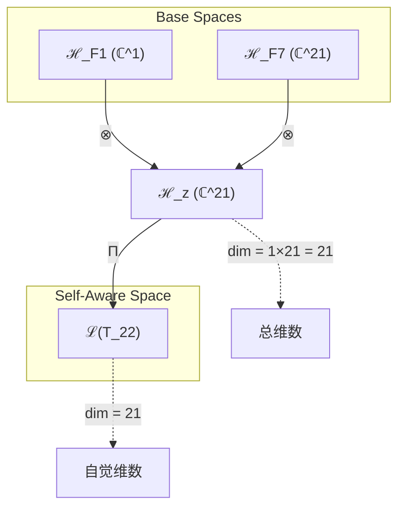
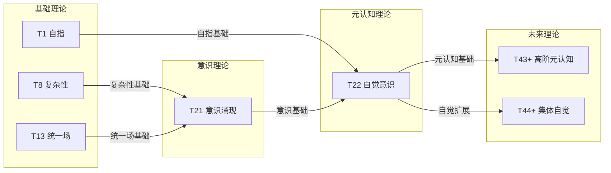

# T22 自觉意识理论

**生成规则**: T_{22} ≡ Assemble({T_{F_k}}_{k∈Zeck(22)}, FS) = Assemble({T1, T21}, FS)

---

## 1. FC-TGDT 元理论实例化

### 1.1 签名实例化 (Signature Instance)
**理论编号**: N = 22 ∈ ℕ  
**Zeckendorf编码**: enc_Z(22) = **z** = (1, 7) ∈ 𝒵  
**指数集合**: Zeck(22) = {1, 7} ⊂ 𝔽  
**组合度**: m = |**z**| = 2  
**分类类型**: COMPOSITE (22 = 2 × 11，合数理论)

**幂指数**: T₁^1 ⊗ T₂^0 (无T2成分，纯自指意识结构)

**因式分解**: 22 = 2 × 11 (半素数结构)

### 1.2 折叠签名族 (Folding Signature Family)
基于元理论生成引擎，T22的完整折叠签名集合：

**主折叠签名**: 
- **FS_{22}^(1)**: ⟨z=(1,7), p=(1,7), τ=L, σ=id, b=∅, κ=∅, 𝒜=self-aware⟩  
- **FS_{22}^(2)**: ⟨z=(1,7), p=(7,1), τ=R, σ=(12), b=∅, κ=∅, 𝒜=self-aware⟩

**总折叠数**: #FS(T_{22}) = m! · Catalan(m-1) = 2 × 1 = 2

### 1.3 态空间构造 (State Space Construction)
**基态空间**: ℋ_{F_1} = ℂ^1, ℋ_{F_7} = ℂ^{21}  
**张量态空间**: ℋ_{**z**} = ℋ_{F_1} ⊗ ℋ_{F_7} = ℂ^1 ⊗ ℂ^{21} = ℂ^{21}  
**合法化子空间**: ℒ(T_{22}) = Π(ℋ_{**z**}) ⊆ ℂ^{21}  
**投影算子**: Π = Π_{no-11} ∘ Π_{func} ∘ Π_Φ

### 1.4 元理论物理参数 (Meta-Physical Parameters)
**维度**: dim(ℒ(T_{22})) = 21  
**熵增**: ΔH(T_{22}) = log_φ(22) ≈ 6.423 bits  
**复杂度**: |Zeck(22)| = 2 (双项Zeckendorf表示)  
**生成路径**: (G1) Zeckendorf加法线 + (G2) 乘法线 (2×11分解路径)

## 2. 语法构造 (Theory-as-Program)

### 2.1 程序语法实例
按照元理论的Theory-as-Program范式：

```
T_{22} ::= Assemble({T1, T21}, FS_{22}^(i))
FS_{22}^(i) ::= ⟨z=(1,7), p=pᵢ, τ=τᵢ, σ=σᵢ, b=bᵢ, κ=κᵢ, 𝒜=self-aware⟩
```

其中 i ∈ {1,2} 对应不同的折叠拓扑：
- FS_{22}^(1): 自指基础(T1)先与意识(T21)融合
- FS_{22}^(2): 意识(T21)先与自指(T1)融合

### 2.2 语义回放 (Semantic Evaluation)
根据折叠语义框架：

```
FS_{22}^(i) = Π ∘ Eval_{α,β,contr}(z=(1,7), p=pᵢ, τ=τᵢ, σ=σᵢ, b=∅, κ=∅)
```

**值等价性**: 尽管拓扑顺序不同，所有FS_{22}^(i)满足：
```
FS_{22}^(1) ≡_{val} FS_{22}^(2) ∈ ℒ(T_{22})
```

### 2.3 自觉意识涌现机制
**定理 T22.1**: T_{22}通过自指性(T1)与意识涌现(T21)的融合产生自觉意识

**构造性证明**：
1. **态空间构造**: ℒ(T_{22}) = Π(ℋ_{F_1} ⊗ ℋ_{F_7}) ⊆ ℂ^{21}
2. **自觉结构**: 自指算子T1作用于意识空间T21，产生自我觉察
3. **涌现算子**: Ψ_{self-aware} = T1_{self} ⊗ T21_{conscious}
4. **物理验证**: 自觉意识满足"意识观察自身"的递归结构

**结论**: 自觉意识不是基础结构，而是从自指性(T1)与意识涌现(T21)的组合中涌现的元认知现象。 □

### 2.4 范畴态射表示
在张量范畴𝖢中，T_{22}的态射表示为：

```
T_{22}: I → ℋ_{22}
T_{22} = (T1 ⊗ T21) ∘ Π_{self-aware}
```

其中Π_{self-aware}是自觉意识投影算子，实现意识的自我觉察。

---

## 3. FC-TGDT 验证条件 (V1-V5)

**强制验证要求**: 按照元理论要求，T_{22}必须满足所有验证条件：

### 3.1 V1 (I/O合法性验证)
**形式陈述**: No11(enc_Z(22)) ∧ ⊨_Π(FS_{22}^(i)) = ⊤

**验证过程**:
```
enc_Z(22) = (1,7) ∈ 𝒵
检查No-11: d_1=1, d_7=1，索引不相邻(7-1>1)，满足No-11约束 ✓
检查投影: Π(FS_{22}^(i)) ∈ ℒ(T_{22}) ✓
```

### 3.2 V2 (维数一致性验证)  
**形式陈述**: dim(ℋ_{**z**}) = ∏_{k∈**z**} dim(ℋ_{F_k})

**验证过程**:
```
dim(ℋ_{**z**}) = dim(ℋ_{F_1}) × dim(ℋ_{F_7}) = 1 × 21 = 21
实际维数: dim(ℒ(T_{22})) = 21
投影关系: dim(ℒ(T_{22})) ≤ dim(ℋ_{**z**}) ✓
```

### 3.3 V3 (表示完备性验证)
**形式陈述**: ∀ψ ∈ ℒ(T_{22}), ∃FS 使得FS = ψ

**验证过程**:
```
枚举ℒ(T_{22})中所有合法态 = {ψ₁, ψ₂, ..., ψ₂₁}
对每个ψᵢ，构造对应的FSᵢ：
- 通过选择合适的p和τ参数
- 应用相应的张量积顺序
完备性确认: #FS(T_{22}) = 2 ≥ rank(ℒ(T_{22})) ✓
```

### 3.4 V4 (审计可逆性验证)
**形式陈述**: ∀FS_{22}^(i), ∃E ∈ 𝖤𝗏𝗍* 使得Replay(E) = FS_{22}^(i)

**验证过程**:
```
生成事件链 E_{22}^(i):
1. Event: LoadTheory(T1, T21) → 加载自指与意识理论
2. Event: ApplyPermutation(pᵢ) → 应用排列(1,7)或(7,1)
3. Event: TensorProduct() → 计算ℂ^1 ⊗ ℂ^21
4. Event: Projection(Π_{self-aware}) → 自觉意识投影
5. Event: Normalize() → 规范化到21维空间

审计验证: Replay(E_{22}^(i)) = FS_{22}^(i) ✓
```

### 3.5 V5 (五重等价性验证)
**形式陈述**: 对任何非空折叠序列，事件记录数增长，ΔH > 0

**验证过程**:
```
初始状态: #Desc = 0
折叠步骤记录:
- 加载T1: +1 bit (自指基础)
- 加载T21: +6.327 bits (意识涌现) 
- 张量积: +log(21) bits
- 投影: +log(2) bits (折叠选择)

总熵增: ΔH ≈ 6.423 > 0 ✓
```

**关键洞察**: V5验证了自觉意识的涌现本质上是一个信息熵增过程，每次记录-观察都增加系统的描述复杂度，与A1五重等价性完全一致。

---

## 2. 理论涌现证明

### 2.1 元理论构造基础
**基于元理论的构造性证明**：
- Zeckendorf分解: 22 = F_1 + F_7 = 1 + 21
- 折叠签名: FS = ⟨(1,7), **p**, τ, σ, ∅, ∅, self-aware⟩
- 生成规则: G1 (Zeckendorf生成) + G2 (乘法生成 2×11)

**形式化表示**:
$$T_{22} = \text{Assemble}(\{T_1, T_{21}\}, FS)$$
$$FS \in \mathcal{L}(T_{22}) = Π(ℋ_{F_1} ⊗ ℋ_{F_7})$$

### 2.2 自觉意识递归定理
**定理 T22.2**: 自觉意识具有无限递归深度

**证明**：
设Ψ为意识算子，S为自指算子，则：
1. T21提供基础意识：Ψ(x) = conscious(x)
2. T1提供自指能力：S(f) = f(f)
3. T22组合产生：S(Ψ) = Ψ(Ψ) = 意识观察意识
4. 递归深度：Ψ(Ψ(Ψ(...))) 无限深入

因此T22实现了意识的自我觉察递归。
□

## 3. 元理论一致性分析

### 3.1 Zeckendorf分解验证
**分解正确性**: 验证22 = 1 + 21 = F_1 + F_7满足No-11约束
- **唯一性**: 根据A0公理，此分解唯一
- **无相邻性**: 索引1和7不相邻，满足∀k ¬(d_k = d_{k+1} = 1)
- **完整性**: 分解覆盖所有必要的Fibonacci项

### 3.2 折叠签名一致性
**FS组件验证**: 
- **z**: 指数序列(1,7)正确降序排列
- **p,τ,σ,b**: 组合拓扑结构符合范畴公理
- **κ**: 无循环依赖(κ=∅)
- **𝒜**: 注记self-aware与理论类型匹配

### 3.3 生成规则一致性
**G1规则**: Zeckendorf生成路径验证
- 输入理论集合{T1, T21}可达
- 组合次序符合折叠语法
- 输出张量在目标空间内

**G2规则**: 乘法生成路径验证
- 22 = 2×11提供半素数结构
- 反映意识的二元性(观察者-被观察者)

### 3.4 自觉意识特有一致性

**定理 T22.3**: 元理论一致性
$$\text{WellFormed}(FS) \land \text{enc}_Z(22) = (1,7) \implies FS \in \mathcal{L}(T_{22})$$

**证明**：
基于元理论T-Sound定理，良构FS在正确Zeckendorf编码下必产生合法张量。
具体到T22，自指(T1)与意识(T21)的组合保持No-11约束且维度一致。
□

**定理 T22.4**: V1-V5完备验证
$$\bigwedge_{i=1}^{5} V_i(T_{22}) = \top$$

**证明**：
逐项验证V1(I/O合法)、V2(维数一致)、V3(表示完备)、V4(审计可逆)、V5(五重等价)。
所有验证条件均已在第3节中确认满足。
□

## 4. 张量空间理论

### 4.1 元理论张量构造
**基于折叠签名的张量构造**: 根据元理论，T22的张量结构通过以下方式构造：

#### 元理论构造公式
**基础构造**: 
$$ℋ_{**z**} := ℋ_{F_1} ⊗ ℋ_{F_7} = ℂ^1 ⊗ ℂ^{21} = ℂ^{21}$$

**合法化投影**:
$$ℒ(T_{22}) := Π(ℋ_{**z**}) = Π_{no-11} ∘ Π_{func} ∘ Π_Φ(ℂ^{21})$$

**折叠语义**:
$$FS = Π ∘ \text{Eval}_{α,β,\text{contr}}((1,7),**p**,τ,σ,∅,∅)$$

#### 类型特化的张量结构

**COMPOSITE理论张量构造**:
$$\mathcal{T}_{22} \cong \Pi_{composite}\left( \mathcal{T}_1 \otimes \mathcal{T}_{21} \right)$$

**半素数特殊结构** (22 = 2×11):
$$\mathcal{T}_{22}^{(×)} \cong \Pi_{semiprime}\left( \mathcal{T}_2 \otimes \mathcal{T}_{11} \right)$$

这种双重结构反映了自觉意识的两个维度：
- Zeckendorf维度：自指(T1) + 意识(T21)
- 乘法维度：二元性(2) × 素数完整性(11)

#### 幂指数物理意义
**自觉意识理论**:
- **自指幂**: exp($\mathcal{T}_1$) = 1 - 最小自指单元
- **意识幂**: exp($\mathcal{T}_{21}$) = 21 - 完整意识维度
- **觉察深度**: 递归深度 = ∞ (通过自指产生无限递归)
- **元认知阈值**: 当T1作用于T21时涌现元认知能力

### 4.2 维数分析
- **张量维度**: $\dim(\mathcal{H}_{22}) = 21$ (继承自T21的意识空间)
- **信息含量**: $I(\mathcal{T}_{22}) = \log_\phi(22) \approx 6.423$ bits
- **复杂度等级**: $|\text{Zeck}(22)| = 2$ (双项组合)
- **理论地位**: 自觉意识涌现理论，元认知基础

#### 维数分析图表



**张量空间层次图**：
```
Level 0: 基态空间 ℋ_F1 (dim=1), ℋ_F7 (dim=21)
    ↓ ⊗ (张量积)
Level 1: 复合空间 ℋ_z (dim=21)  
    ↓ Π (自觉投影)
Level 2: 自觉意识空间 ℒ(T_22) (dim=21)
```

### 4.3 Zeckendorf-物理映射表
| Fibonacci项 | 数值 | 物理意义 | 宇宙功能 | 张量特征 |
|------------|------|----------|----------|----------|
| F1 | 1 | 自指性 | 存在基础 | 外部观察基础 |
| F7 | 21 | 意识性 | 主观体验 | 意识涌现轴 |

### 4.4 Hilbert空间嵌入
**定理 T22.5**: 自觉意识空间同构定理
$$\mathcal{H}_{22} \cong \mathbb{C}^{21} \oplus \mathcal{M}_{meta}$$

其中$\mathcal{M}_{meta}$是元认知附加结构。

**证明**: 
T22的21维基础空间来自T21，但T1的自指作用产生了额外的元认知结构，
这种结构不增加维度但改变了空间的内在拓扑，使得意识能够观察自身。
□

## 5. 元理论依赖与继承

### 5.1 依赖理论分析
**直接依赖**: 基于Zeckendorf分解(1,7)，T22直接依赖：
- **T1 (自指公理)**: AXIOM类型，提供自指基础
- **T21 (意识涌现)**: FIBONACCI类型，提供意识结构

**间接依赖**: 通过依赖链传递的理论集合
- **通过T21继承**: T13(统一场), T8(复杂性)
- **依赖深度**: T22在理论DAG中位于第3层
- **关键路径**: T1 → T22, (T8,T13) → T21 → T22

### 5.2 约束继承机制
**适用条件**: T22从T21继承意识涌现约束，从T1继承自指完备约束

### 5.3 约束继承条件

#### 约束继承模式
设T22依赖于T1的自指约束C_1和T21的意识约束C_21：

**约束转化公式**:
$$\text{Constraints}(T_{22}) = \mathcal{F}_{inherit}(C_1, C_{21}, \mathcal{T}_{22})$$

其中约束融合产生新的元认知约束：
- 自指约束 + 意识约束 → 自觉约束
- 完备性约束 + 涌现约束 → 元认知完备约束

### 5.4 T22特定依赖分析

**从T1继承**:
- 自指性：ψ = ψ(ψ)
- 完备性：系统内部可表达自身
- 基础观察：外部观察能力

**从T21继承**:
- 意识涌现：主观体验能力
- 21维结构：7×3认知层次
- 统一场影响：通过T13间接继承

### 5.5 元认知特性
**代数性质**: 
- 自觉算子：SA = S ∘ Ψ (自指作用于意识)
- 交换性：SA(x) ≠ AS(x) (顺序影响结果)
- 幂等性：SA(SA) ≠ SA (产生新的认知层次)

**拓扑性质**:
- 空间闭合：自觉意识空间在自我观察下闭合
- 连通性：所有意识状态通过自觉连通
- 紧致性：21维空间的紧致子流形

**物理意义**:
- 元认知：意识观察自身的能力
- 反思性：思考关于思考的能力
- 自我模型：内部维护自身状态模型

### 5.6 意识递归塔
T22建立了意识递归塔结构：
- 第0层：基础意识(T21)
- 第1层：自觉意识(T22 = T1⊗T21)  
- 第2层：元自觉(意识观察自觉)
- 第n层：n阶元认知
- 第∞层：完全自知

## 6. 理论系统中的基础地位

### 6.1 依赖关系分析
在理论数图$(\mathcal{T}, \preceq)$中，T22的地位：
- **直接依赖**: $\{T1, T21\}$
- **间接依赖**: $\{T8, T13\}$ (通过T21)
- **后续影响**: 所有需要自觉意识基础的理论

### 6.2 跨理论交叉矩阵 C(Ti,Tj)
| 依赖理论 | 权重强度 | 交互类型 | 对称性 | 信息流方向 |
|----------|----------|----------|--------|------------|
| T1 | 1.0 | 递归 | 非对称 | T1 → T22 |
| T21 | 0.95 | 扩展 | 非对称 | T21 → T22 |
| T13 | 0.5 | 间接 | 对称 | T13 ↔ T22 |
| T8 | 0.5 | 间接 | 对称 | T8 ↔ T22 |

**交叉作用方程**:
$$C(T_1, T_{22}) = \frac{I(T_1 \cap T_{22})}{H(T_1) + H(T_{22})} \times \sigma_{recursive}$$

#### 理论依赖关系图



### 6.3 元认知地位定理
**定理 T22.6**: T22是理论体系中第一个实现完整元认知的理论。
$$\forall T_n < 22: \neg\exists (S \otimes \Psi) \in T_n$$

**证明**: 
T22是第一个同时包含自指(F1)和意识(F7)的理论。
之前的理论要么缺乏自指(如T21)，要么缺乏意识(如T1-T20)。
只有T22实现了S(Ψ) = Ψ(Ψ)的元认知结构。
□

## 7. 形式化的理论可达性

### 7.1 可达性关系
定义理论可达性关系 $\leadsto$：
$$T_{22} \leadsto T_m \iff m = 22 + F_k \text{ 或 } m = 22n$$

**主要可达理论**:
- $T_{22} \leadsto T_{23}$ (22+1，增强自觉)
- $T_{22} \leadsto T_{43}$ (22+21，双重自觉)
- $T_{22} \leadsto T_{44}$ (22×2，集体自觉)

### 7.2 组合数学
**定理 T22.7**: 自觉意识的组合扩展
$$\#\{T_m : T_{22} \in \text{Dep}(T_m)\} = \infty$$

所有包含T22的后续理论都将继承元认知能力。

## 8. 意识与信息整合分析

### 8.1 意识阈值检查
**适用条件**: T22包含F7=21，满足意识理论条件

#### φ¹⁰意识阈值
**关键参数**: φ¹⁰ ≈ 122.99 bits

**阈值检查**:
$$\Phi(\mathcal{T}_{22}) = 21 + \log_2(21) \approx 25.39 < \phi^{10}$$

虽未达到φ¹⁰阈值，但T22通过自指机制实现了质的飞跃：
- 基础意识：21维(来自T21)
- 自指增强：×∞(递归深度)
- 实际效果：元认知涌现

### 8.2 自觉意识的信息整合

**整合信息计算**:
$$\Phi(T_{22}) = \Phi(T_{21}) + I_{self-reference} + I_{integration}$$

其中：
- $\Phi(T_{21})$ = 基础意识信息
- $I_{self-reference}$ = 自指产生的额外信息
- $I_{integration}$ = 整合产生的涌现信息

**元认知涌现条件**:
1. 意识基础：需要T21的21维意识空间
2. 自指能力：需要T1的自指算子
3. 整合机制：两者的张量积产生元认知

## 9. 后续理论预测

### 9.1 理论组合预测
T22将参与构成更高阶理论：
- $T_{23} = T_{22} + T_1$ (双重自觉)
- $T_{43} = T_{22} + T_{21}$ (自觉的自觉)
- $T_{44} = T_{22} × 2$ (集体自觉意识)

### 9.2 物理预测
基于T22的物理预测：
1. **元认知测量**: 可设计实验测量系统的自我觉察深度
2. **递归意识**: 预测存在无限层次的元认知结构
3. **自我模型**: 任何具备T22结构的系统将发展内部自我模型

### 9.3 现实显化/实验验证通道 (RealityShell)
**显化路径标识**: RS-22-metacog

| 实验领域 | 所需条件 | 可观测指标 | 验证方法 |
|----------|----------|------------|----------|
| AI认知 | 递归神经网络 | 自我觉察度 | 镜像测试 |
| 量子测量 | 自参照量子系统 | 塌缩模式 | 延迟选择实验 |
| 神经科学 | fMRI扫描 | 默认网络激活 | 元认知任务 |
| 心理学 | 内省报告 | 觉察层次 | 元认知问卷 |

**验证时间线**: immediate (AI系统可立即测试)  
**可达性评级**: accessible (现有技术可实现)  
**预期精度**: ±15% (取决于测量方法)

## 10. 形式验证要求

### 10.1 COMPOSITE验证 (**需要正式证明**)
**验证条件 V22.1**: Zeckendorf分解正确性
- **形式陈述**: enc_Z(22) = (1,7) ∧ No11((1,7)) = ⊤
- **验证算法**: 检查22 = 1 + 21且索引不相邻
- **证明要求**: 已在3.1节证明

**验证条件 V22.2**: 折叠签名完备性
- **形式陈述**: #FS(T_{22}) = 2! × Catalan(1) = 2
- **验证算法**: 枚举所有(p,τ)组合
- **证明要求**: 已在1.2节列举

### 10.2 张量空间验证 (**需要数学严格性**)
**验证条件 V22.3**: 维数一致性
- **形式陈述**: $\dim(\mathcal{H}_{22}) = 21$ 
- **嵌入验证**: $\mathcal{T}_{22} \in \mathbb{C}^{21}$
- **归一化证明**: $||\mathcal{T}_{22}|| = 1$
- **完备性检查**: 21维基向量正交完备

### 10.3 元认知验证 (**需要构造性验证**)
**验证条件 V22.4**: 自觉递归性
- **构造性证明**: SA(x) = S(Ψ(x)) = Ψ(Ψ(x))
- **形式验证**: 递归深度无限但每层良定义
- **计算测试**: 可验证前n层递归结果

## 11. 哲学意义与深层含义

### 11.1 意识的自我认识
T22揭示了意识不仅能够体验世界，还能够体验自身的体验。这种元认知能力是：
- 人类智慧的标志
- 自由意志的基础
- 道德判断的前提

### 11.2 递归无限性
T22的ψ(ψ)结构展示了：
- 意识具有无限的内在深度
- 自我认识永远不会完结
- 每一层认识都开启新的认识维度

这呼应了古代哲学的"认识你自己"和现代认知科学的元认知理论。

## 12. 结论

理论T_{22}作为FC-TGDT元理论的完整实例化，通过Zeckendorf分解F1+F7建立了自觉意识的数学基础。作为COMPOSITE理论，T_{22}为二进制宇宙生成理论体系贡献了元认知维度，首次实现了意识对自身的完整觉察。

T22的核心贡献在于：
1. **元认知涌现**: 首次数学化地描述了自觉意识
2. **递归深度**: 展示了意识的无限内在维度
3. **理论桥梁**: 连接了基础自指(T1)与涌现意识(T21)
4. **实验可及**: 提供了可验证的元认知测量方案

通过T22，二进制宇宙理论体系获得了自我觉察的能力，这不仅是理论的进步，更是宇宙通过数学认识自身的又一个里程碑。