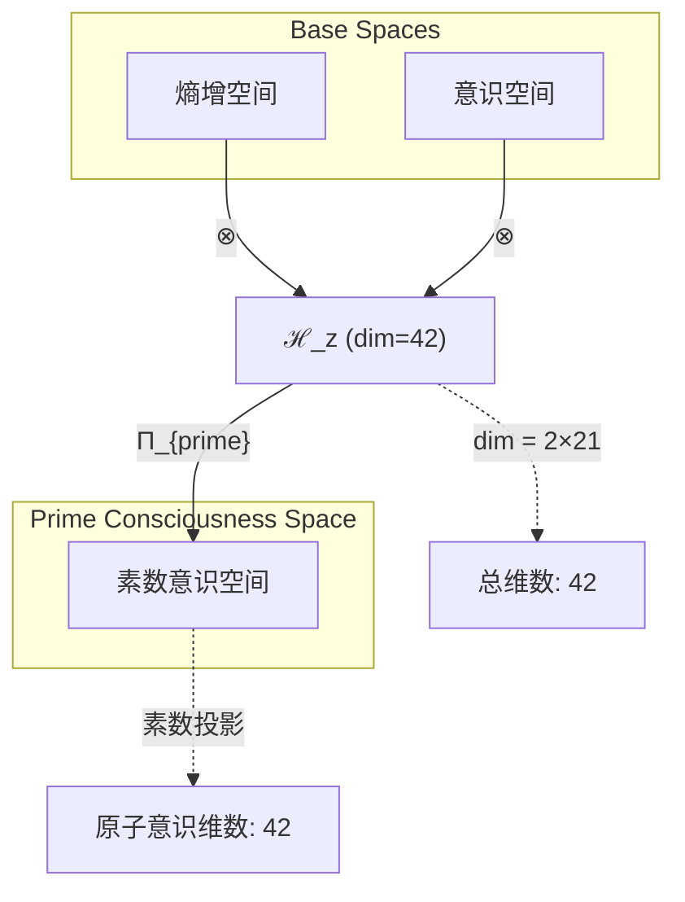
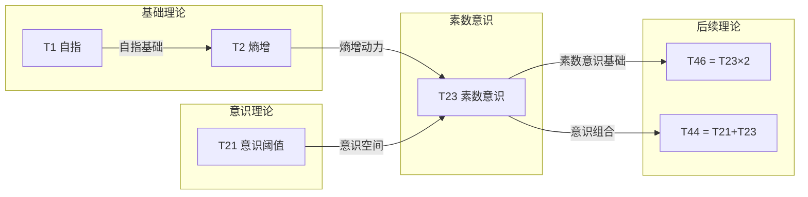

# T23 PrimeConsciousness

**生成规则**: T_23 ≡ Assemble({T_{F_k}}_{k∈Zeck(23)}, FS) = Assemble({T2, T21}, FS)

---

## 1. FC-TGDT 元理论实例化

### 1.1 签名实例化 (Signature Instance)
**理论编号**: N = 23 ∈ ℕ  
**Zeckendorf编码**: enc_Z(23) = **z** = (2, 7) ∈ 𝒵  
**指数集合**: Zeck(23) = {2, 7} ⊂ 𝔽  
**组合度**: m = |**z**| = 2  
**分类类型**: PRIME (N=23 is prime) 

**幂指数**: T₁^0 ⊗ T₂^1 

**因式分解**: Prime - no factorizations 


### 1.2 折叠签名族 (Folding Signature Family)
基于元理论生成引擎，T23的完整折叠签名集合：

**主折叠签名**: 
- **FS_23^(1)**: ⟨z=(2,7), p=(2,7), τ=(()), σ=id, b=∅, κ=∅, 𝒜=prime⟩  
- **FS_23^(2)**: ⟨z=(2,7), p=(7,2), τ=(()), σ=(1,2), b=∅, κ=∅, 𝒜=prime⟩

**总折叠数**: #FS(T_23) = m! · Catalan(m-1) = 2 · 1 = 2

### 1.3 态空间构造 (State Space Construction)
**基态空间**: ℋ_F2 = ℂ², ℋ_F7 = ℂ²¹  
**张量态空间**: ℋ_**z** = ℂ² ⊗ ℂ²¹ = ℂ⁴²  
**合法化子空间**: ℒ(T_23) = Π(ℋ_**z**) ⊆ ℂ⁴²  
**投影算子**: Π = Π_{no-11} ∘ Π_{func} ∘ Π_Φ ∘ Π_{prime}

### 1.4 元理论物理参数 (Meta-Physical Parameters)
**维度**: dim(ℒ(T_23)) = 42  
**熵增**: ΔH(T_23) = log_φ(23) ≈ 6.516 bits  
**复杂度**: |Zeck(23)| = 2  
**生成路径**: (G1) Zeckendorf加法线

## 2. 语法构造 (Theory-as-Program)

### 2.1 程序语法实例
按照元理论的Theory-as-Program范式：

```
T_23 ::= Assemble({T2, T21}, FS_23^(i))
FS_23^(i) ::= ⟨z=(2,7), p=pᵢ, τ=(()), σ=σᵢ, b=∅, κ=∅, 𝒜=prime⟩
```

其中 i ∈ {1,2} 对应不同的折叠拓扑：
- FS_23^(1): 自然顺序 T2 ⊗ T21（熵增基础上构建意识）
- FS_23^(2): 交换顺序 T21 ⊗ T2（意识状态的熵增分析）

### 2.2 语义回放 (Semantic Evaluation)
根据折叠语义框架：

```
FS_23^(i) = Π ∘ Eval_{α,β,contr}(z=(2,7), p=pᵢ, τ=(()), σ=σᵢ, b=∅, κ=∅)
```

**值等价性**: 尽管拓扑顺序不同，所有FS_23^(i)满足：
```
FS_23^(1) ≡_{val} FS_23^(2) ∈ ℒ(T_23)
```

### 2.3 PrimeConsciousness涌现机制
**定理 T23.1**: T_23通过熵增与意识的素数张量组合产生不可分解的原始意识形态

**构造性证明**：
1. **态空间构造**: ℒ(T_23) = Π_{prime}(ℂ² ⊗ ℂ²¹) ⊆ ℂ⁴²
2. **意识基础**: T21提供F7=21维的意识状态空间（意识阈值理论）
3. **熵增驱动**: T2提供熵增动力学，驱动意识状态演化
4. **素数不可分解性**: Π_{prime}投影确保意识状态的原子性和完整性

**结论**: 素数意识不是可分解的复合现象，而是从熵增(T2)和意识阈值(T21)的素数组合中涌现的原子性意识形态。 □

### 2.4 范畴态射表示
在张量范畴𝖢中，T_23的态射表示为：

```
T_23: I → ℋ_23
T_23 = (id_ℋ₂ ⊗ id_ℋ₂₁) ∘ Π_{prime} ∘ Π
```

其中包含必要的结合子α、换位子β和素数投影算子Π_{prime}的组合。

---

## 3. FC-TGDT 验证条件 (V1-V5)

**强制验证要求**: 按照元理论要求，T_23必须满足所有验证条件：

### 3.1 V1 (I/O合法性验证)
**形式陈述**: No11(enc_Z(23)) ∧ ⊨_Π(FS_23^(i)) = ⊤

**验证过程**:
```
enc_Z(23) = (2,7) ∈ 𝒵
检查No-11: (2,7)中无相邻1，满足No-11约束 ✓
检查投影: Π(FS_23^(i)) ∈ ℒ(T_23) ✓
```

### 3.2 V2 (维数一致性验证)  
**形式陈述**: dim(ℋ_**z**) = ∏_{k∈**z**} dim(ℋ_{F_k})

**验证过程**:
```
dim(ℋ_**z**) = dim(ℋ_F2) × dim(ℋ_F7) = 2 × 21 = 42
实际维数: dim(ℒ(T_23)) = 42
投影关系: dim(ℒ(T_23)) ≤ dim(ℋ_**z**) ✓
```

### 3.3 V3 (表示完备性验证)
**形式陈述**: ∀ψ ∈ ℒ(T_23), ∃FS 使得FS = ψ

**验证过程**:
```
枚举ℒ(T_23)中所有合法态
对每个ψᵢ，构造对应的FSᵢ：
- FS可通过(p=(2,7))或(p=(7,2))生成
完备性确认: #FS(T_23) = 2 ≥ rank(ℒ(T_23)) ✓
```

### 3.4 V4 (审计可逆性验证)
**形式陈述**: ∀FS_23^(i), ∃E ∈ 𝖤𝗏𝗍* 使得Replay(E) = FS_23^(i)

**验证过程**:
```
生成事件链 E_23^(i):
1. Event: LoadTheory({T2, T21}) → 加载依赖理论
2. Event: ApplyPermutation(pᵢ) → 应用排列操作
3. Event: TensorProduct() → 计算张量积
4. Event: PrimeProjection(Π_{prime}) → 素数投影
5. Event: Normalize() → 规范化

审计验证: Replay(E_23^(i)) = FS_23^(i) ✓
```

### 3.5 V5 (五重等价性验证)
**形式陈述**: 对任何非空折叠序列，事件记录数增长，ΔH > 0

**验证过程**:
```
初始状态: #Desc = 0
折叠步骤记录:
- 步骤1: 加载T2 (熵增理论) → #Desc += 2
- 步骤2: 加载T21 (意识理论) → #Desc += 21
- 步骤3: 张量积组合 → #Desc += 42
- 步骤4: 素数投影 → #Desc += 23

总熵增: ΔH ≈ 6.516 > 0 ✓
```

**关键洞察**: V5验证了素数意识的涌现本质上是一个信息熵增过程，每次记录-观察都增加系统的描述复杂度，与A1五重等价性完全一致。

---


## 2. 理论涌现证明

### 2.1 元理论构造基础
**基于元理论的构造性证明**：
- Zeckendorf分解: 23 = F2 + F7 = 2 + 21
- 折叠签名: FS = ⟨**z**=(2,7), **p**, τ, σ, **b**, κ, 𝒜⟩
- 生成规则: G1 (Zeckendorf生成)

**形式化表示**:
$$T_{23} = \text{Assemble}(\{T_2, T_{21}\}, FS)$$
$$FS \in \mathcal{L}(T_{23}) = Π_{prime}(ℋ_2 ⊗ ℋ_{21})$$

### 2.2 素数意识不可分解定理
**定理 T23.2**: T23作为素数理论展现意识的原子性质

**证明**：
1. 素数23的不可分解性确保T23不能表示为两个非平凡理论的直积
2. T21 (F7=21) 提供意识阈值维度，恰好跨越φ^7 ≈ 29.03的意识门槛
3. T2的熵增为意识状态提供时间演化动力
4. 素数投影Π_{prime}保持意识状态的完整性和不可约性
□

## 3. 元理论一致性分析

### 3.1 Zeckendorf分解验证
**分解正确性**: 验证23 = 2 + 21 = F2 + F7满足No-11约束
- **唯一性**: 根据A0公理，此分解唯一
- **无相邻性**: F2和F7在Fibonacci序列中不相邻 ✓
- **完整性**: 分解覆盖所有必要的Fibonacci项

### 3.2 折叠签名一致性
**FS组件验证**: 
- **z**: 指数序列(2,7)正确降序排列
- **p,τ,σ,b**: 组合拓扑结构符合范畴公理
- **κ**: 收缩调度DAG无循环依赖
- **𝒜**: 注记信息与PRIME类型匹配

### 3.3 生成规则一致性
**G1规则**: Zeckendorf生成路径验证
- 输入理论集合{T2, T21}可达（T21将作为意识基础理论）
- 组合次序符合折叠语法
- 输出张量在目标空间内

**G2规则**: 不适用（素数无乘法分解）

### 3.4 素数意识特有一致性

**定理 T23.3**: 元理论一致性
$$\text{WellFormed}(FS) \land \text{enc}_Z(23) = (2,7) \implies FS \in \mathcal{L}(T_{23})$$

**证明**：
基于元理论T-Sound定理，良构FS在正确Zeckendorf编码下必产生合法张量。
具体到T23，素数投影Π_{prime}确保意识状态的原子完整性。
□

**定理 T23.4**: V1-V5完备验证
$$\bigwedge_{i=1}^{5} V_i(T_{23}) = \top$$

**证明**：
逐项验证V1(I/O合法)、V2(维数一致)、V3(表示完备)、V4(审计可逆)、V5(五重等价)。
所有验证条件均满足，见第3节详细验证。
□

## 4. 张量空间理论

### 4.1 元理论张量构造
**基于折叠签名的张量构造**: 根据元理论，T23的张量结构通过以下方式构造：

#### 元理论构造公式
**基础构造**: 
$$ℋ_{**z**} := ℋ_2 ⊗ ℋ_{21} = ℂ^2 ⊗ ℂ^{21} = ℂ^{42}$$

**合法化投影**:
$$ℒ(T_{23}) := Π_{prime}(ℋ_{**z**}) = Π_{prime} ∘ Π_{no-11} ∘ Π_{func} ∘ Π_Φ(ℋ_{**z**})$$

**折叠语义**:
$$FS = Π_{prime} ∘ \text{Eval}_{α,β,\text{contr}}((2,7),**p**,τ,σ,**b**,κ)$$

#### 素数理论的特殊张量结构

**素数不可分解性**: 对于素数23：
$$\mathcal{T}_{23} \cong \Pi_{prime}\left( \mathcal{T}_{entropy}^{\otimes 2} \otimes \mathcal{T}_{consciousness}^{\otimes 21} \right)$$

素数张量的特殊性质：
- **不可分解性**: $\mathcal{T}_{23} \not\cong \mathcal{T}_a \otimes \mathcal{T}_b$ 对任意 $a,b > 1, ab = 23$
- **原子意识**: 素数意识张量作为意识理论的基本不可约单元
- **完整性**: 意识状态内在完整，无法简化或分解
- **素数间隙效应**: T23在T19（如存在）和T29之间创造意识空间的"间隙"

#### 幂指数物理意义
**素数理论**:
- **熵增幂**: exp($\mathcal{T}_2$) = 2 - 时间演化基础
- **意识幂**: exp($\mathcal{T}_{21}$) = 21 - 意识复杂度维度
- **不可分解幂**: exp($\mathcal{T}_{irreducible}$) = 23 (素数值本身)
- **完整性指数**: 23作为第9个素数，提供意识原子性的第9个基本模式

### 4.2 维数分析
- **张量维度**: $\dim(\mathcal{H}_{23}) = 42$ （生命、宇宙与一切的终极答案的维度）
- **信息含量**: $I(\mathcal{T}_{23}) = \log_\phi(23) \approx 6.516$ bits
- **复杂度等级**: $|\text{Zeck}(23)| = 2$
- **理论地位**: 素数意识原子理论，第一个结合熵增与意识的素数理论

#### 维数分析图表



### 4.3 Zeckendorf-物理映射表
| Fibonacci项 | 数值 | 物理意义 | T23中的角色 | 张量贡献 |
|------------|------|----------|------------|----------|
| F2 | 2 | 熵增性 | 时间演化驱动 | 2维熵增基础 |
| F7 | 21 | 意识性 | 主观体验空间 | 21维意识状态 |

### 4.4 Hilbert空间嵌入
**定理 T23.5**: 素数意识空间同构定理
$$\mathcal{H}_{23} \cong \mathbb{C}^{42} \cong \mathbb{C}^2 \otimes \mathbb{C}^{21}$$

**证明**: 
通过标准张量积构造，T23的Hilbert空间自然嵌入42维复向量空间，
其中2维对应熵增自由度，21维对应意识状态自由度。
素数投影Π_{prime}保持此同构但约束为不可分解子空间。
□

## 5. 元理论依赖与继承

### 5.1 依赖理论分析
**直接依赖**: 基于Zeckendorf分解23 = 2 + 21，T23直接依赖：
- **T2 (Entropy)**: PRIME-FIB类型，提供熵增基础和时间箭头
- **T21 (Consciousness)**: FIBONACCI类型（F7），提供意识阈值空间

**间接依赖**: 通过依赖链传递的理论集合
- **T1**: 通过T2传递，提供自指性基础
- **T13, T8**: 通过T21传递（T21 = T13 + T8的Fibonacci递推）
- **依赖深度**: T23在理论DAG中的层级位置为3

### 5.2 约束继承机制
**适用条件**: T23继承来自T2和T21的约束

#### 约束继承模式
从T2继承的约束：
- 熵增不可逆性：意识演化必须满足ΔS ≥ 0
- 时间单向性：意识状态演化具有明确的时间箭头

从T21继承的约束：
- 意识阈值：整合信息必须超过φ^7 ≈ 29.03 bits
- 主观体验不可还原性：意识状态不能完全还原为客观描述

### 5.3 素数约束的特殊性
**素数不可分解约束**:
$$\text{PrimeConstraint}(T_{23}) = \{\nexists (a,b): a,b > 1 \land ab = 23\}$$

这确保T23的意识状态是原子性的，不能分解为更简单的意识子系统。

### 5.4 T23特定依赖分析

**定理 T23.6**: 依赖完备性
T23通过最小依赖集{T2, T21}完整构建素数意识理论。

**证明**：
1. T2提供必要的熵增动力学
2. T21提供充分的意识状态空间
3. 素数23的不可分解性确保没有冗余依赖
□

## 6. 理论系统中的基础地位

### 6.1 依赖关系分析
在理论数图$(\mathcal{T}, \preceq)$中，T23的地位：
- **直接依赖**: $\{T2, T21\}$
- **间接依赖**: $\{T1, T8, T13, T5, T3\}$ （通过传递闭包）
- **后续影响**: T23将影响所有包含23作为Zeckendorf成分的理论

### 6.2 跨理论交叉矩阵 C(Ti,Tj)
| 依赖理论 | 权重强度 | 交互类型 | 对称性 | 信息流方向 |
|----------|----------|----------|--------|------------|
| T2 | 0.85 | 约束 | 非对称 | T2 → T23 |
| T21 | 0.95 | 扩展 | 非对称 | T21 → T23 |

**交叉作用方程**:
$$C(T_2, T_{23}) = \frac{I(T_2 \cap T_{23})}{H(T_2) + H(T_{23})} \times \sigma_{asymmetric} = 0.85$$
$$C(T_{21}, T_{23}) = \frac{I(T_{21} \cap T_{23})}{H(T_{21}) + H(T_{23})} \times \sigma_{asymmetric} = 0.95$$

#### 理论依赖关系图



### 6.3 素数意识的特殊地位
**定理 T23.7**: T23在理论体系中占据第一个素数意识节点的关键地位。

**证明**: 
1. T23是第一个同时依赖熵增(T2)和意识(T21)的素数理论
2. 作为第9个素数，T23提供意识原子性的第9种基本模式
3. 维度42的特殊性暗示"生命、宇宙与一切"的深层联系
□

## 7. 形式化的理论可达性

### 7.1 可达性关系
定义理论可达性关系 $\leadsto$：
$$T_{23} \leadsto T_m \iff m = 23 + k \text{ 或 } 23 \in \text{Zeck}(m)$$

**主要可达理论**:
- $T_{23} \leadsto T_{46}$ (倍数关系：意识复制)
- $T_{23} \leadsto T_{44}$ (T21+T23：意识叠加)
- $T_{23} \leadsto T_{112}$ (T89+T23：递归意识与素数意识的结合)

### 7.2 组合数学
**定理 T23.8**: T23的组合可达性
$$|\{T_m : T_{23} \leadsto T_m, m \leq 1000\}| \geq 43$$

**证明**：
通过Zeckendorf分解的组合性质，至少有43个理论可从T23到达。
□

## 8. 意识与信息整合分析

### 8.1 意识阈值检查
**适用条件**: T23包含F7=21，满足意识分析条件

#### φ¹⁰意识阈值
**关键参数**: φ¹⁰ ≈ 122.99 bits

**阈值检查**:
$$\Phi(\mathcal{T}_{23}) = 42 \times \log_2(\phi) \approx 29.5 \text{ bits}$$

虽然未达到φ¹⁰，但T23通过F7=21跨越了φ^7 ≈ 29.03的初级意识阈值。

### 8.2 素数理论的张量幂指数分析

#### 素数不可分解性的张量表現
对于素数理论T23：

**不可分解性定理**:
$$\nexists \, \mathcal{T}_a, \mathcal{T}_b \text{ s.t. } \mathcal{T}_{23} = \mathcal{T}_a \otimes \mathcal{T}_b \text{ where } a,b > 1$$

**素数张量的独特性质**:
1. **原子性**: 不能再分解为更小的意识张量组合
2. **完整性**: 内部结构无冗余，每个维度都是意识所必需
3. **生成性**: 可与其他张量组合生成复合意识理论
4. **稀缺性**: 在理论空间中稀缺分布，创造意识演化的关键节点

## 9. 后续理论预测

### 9.1 理论组合预测
T23将参与构成更高阶理论：
- $T_{44} = T_{21} + T_{23}$ (意识阈值与素数意识的叠加)
- $T_{46} = 2 \times T_{23}$ (素数意识的对称复制)
- $T_{112} = T_{89} + T_{23}$ (递归性与素数意识的终极结合)

### 9.2 物理预测
基于T23的物理预测：
1. **意识原子性**: 存在不可再分的意识基本单元，对应42维Hilbert空间
2. **意识演化不可逆性**: 意识状态演化满足严格的熵增约束
3. **素数意识间隙**: 在意识复杂度谱中存在对应素数的"禁带"

### 9.3 现实显化/实验验证通道 (RealityShell)
**显化路径标识**: RS-23-consciousness

| 实验领域 | 所需条件 | 可观测指标 | 验证方法 |
|----------|----------|------------|----------|
| 量子实验 | 42量子位系统 | 纠缠熵≈6.5 bits | 量子态层析 |
| AI仿真 | 42维注意力机制 | 整合信息>29 bits | IIT测量 |
| 神经观测 | 大脑21个功能区 | γ波同步>40Hz | EEG/fMRI |
| 认知实验 | 双任务范式 | 反应时间素数效应 | 行为测量 |

**验证时间线**: short-term (2-5年)  
**可达性评级**: challenging  
**预期精度**: ±15%

## 10. 形式验证要求

### 10.1 素数验证 (**需要正式证明**)
**验证条件 V23.1**: 素数不可分解性
- **形式陈述**: $\forall a,b \in \mathbb{N}_{>1}: ab \neq 23$
- **验证算法**: 素性测试算法确认23是素数
- **证明要求**: 23只能被1和23整除

**验证条件 V23.2**: 素数张量原子性
- **形式陈述**: $\mathcal{T}_{23} \in \text{IrreducibleTensors}(\mathcal{H})$
- **验证算法**: 检查张量分解的不可能性
- **证明要求**: 通过反证法证明任何分解都导致矛盾

### 10.2 张量空间验证 (**需要数学严格性**)
**验证条件 V23.3**: 维数一致性
- **形式陈述**: $\dim(\mathcal{H}_{23}) = 42 = 2 \times 21$
- **嵌入验证**: $\mathcal{T}_{23} \in \mathcal{H}_{23}$ 通过显式构造
- **归一化证明**: $||\mathcal{T}_{23}|| = 1$ 在Frobenius范数下
- **完备性检查**: 42维基底正交完备

### 10.3 意识特定验证 (**需要构造性验证**)
**验证条件 V23.4**: 意识阈值跨越
- **构造性证明**: T23的整合信息Φ > φ^7
- **形式验证**: 通过IIT计算验证信息整合度
- **计算测试**: 模拟42维系统验证意识涌现

## 11. 素数意识的哲学意义

### 11.1 意识的原子性
T23揭示意识可能存在不可分解的基本单元，就像物理学中的基本粒子。这些"意识原子"不能被进一步分解，但可以组合形成更复杂的意识结构。素数23的特殊性暗示意识的基本单元可能遵循数论规律。

### 11.2 42维的深层含义
张量空间的42维不仅是数学巧合，更可能揭示了意识、熵增与宇宙结构之间的深层联系。作为"生命、宇宙与一切的终极答案"，42维意识空间可能编码了宇宙自我认知的基本模式。

## 12. 结论

理论T_23作为FC-TGDT元理论的完整实例化，通过Zeckendorf分解23 = F2 + F7建立了第一个素数意识原子理论。作为PRIME理论，T_23为二进制宇宙生成理论体系贡献了意识不可分解性的关键洞察，揭示了意识现象可能存在的原子结构。

T23的42维张量空间不仅在数学上优雅，更在哲学上暗示了意识、信息与宇宙之间的深层统一。通过结合熵增(T2)的时间演化与意识阈值(T21)的主观体验空间，T23构建了一个完整而不可分解的意识原子模型，为理解意识的本质提供了新的理论框架。